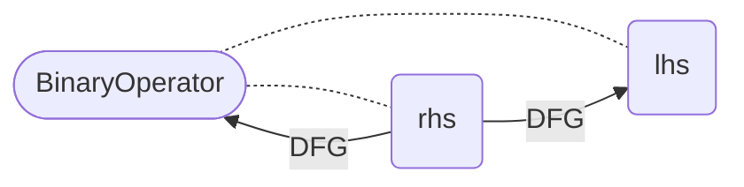

# Specification: Data Flow Graph

The Data Flow Graph (DFG) is built as edges between nodes. Each node has a set of incoming data flows (`prevDFG`) and outgoing data flows (`nextDFG`). In the following, we summarize how different types of nodes construct the respective data flows.


## CallExpression

Interesting fields:
* `invokes: List<FunctionDeclaration>`: A list of the functions which are called
* `arguments: List<Expression>`: The arguments which are used in the function call

A call expressions calls another function. We differentiate two types of call expressions: 1) the called function is implemented in the program (and we can analyze the code) and 2) the called function cannot be analyzed (e.g., this is the case for library/API functions). For the first case, the `invokes` list contains values, in the second case, the list is empty.

### Case 1: Known function

For each function in the `invokes` list, the arguments of the call expression flow to the function's parameters. The value of the function declaration flows to the call.

Scheme:
  ```mermaid
  flowchart LR
    A["forall i: argument[i]"] -- DFG --> B["forall j: invokes[j].parameter[i]"];
    B --> C;
    C["forall j: invokes[j]"] -- DFG --> callExpression;
  ```

### Case 2: Unknown function

The base and all arguments flow to the call expression.

Scheme:
  ```mermaid
  flowchart LR
    A["for all i: argument[i]"] -- DFG --> B[callExpression];
    C[base] -- DFG --> B;
  ```

## CastExpression

Interesting fields:
* `expression: Expression`: The inner expression which has to be casted

The value of the `expression` flows to the cast expression.
Scheme:
```mermaid
  flowchart LR
    node([CastExpression]) -.- expression(expression);
    expression -- DFG --> node;
  ```

## BinaryOperator

Interesting fields:
* `operatorCode: String`: String representation of the operator
* `lhs: Expression`: The left-hand side of the operation
* `rhs: Expression`: The right-hand side of the operation

We have to differentiate between the operators. We can group them into three categories: 1) Assignment, 2) Assignment with a Computation and 3) Computation.

### Case 1: Assignment (`operatorCode: =`)

The `rhs` flows to `lhs`. In some languages, it is possible to have an assignment in a subexpression (e.g. `a + (b=1)`).
For this reason, if the assignment's ast parent is not a `CompoundStatement` (i.e., a block of statements), we also add a DFG edge to the whole operator.

Scheme:
```mermaid
flowchart LR
    node([BinaryOperator]) -.- rhs(rhs);
      rhs -- DFG --> lhs;
    node([BinaryOperator]) -.- lhs(lhs);

```



  ```mermaid
  flowchart LR
    A[binaryOperator.rhs] -- DFG --> binaryOperator.lhs;
    subgraph S[If the ast parent is not a CompoundStatement]
      direction LR
      binaryOperator.rhs -- DFG --> binaryOperator;
    end
    A --> S;
  ```
     

### Case 2: Assignment with a Computation (`operatorCode: *=, /=, %=, +=, -=, <<=, >>=, &=, ^=, |=` )

The `lhs` and the `rhs` flow to the binary operator expression, the binary operator flows to the `lhs`.

Scheme:
  ```mermaid
  flowchart LR
    node([BinaryOperator]) -.- lhs(lhs);
    node([BinaryOperator]) -.- rhs(rhs);
    lhs -- DFG --> node;
    rhs -- DFG --> node;
    node == DFG ==> lhs;
  ```

*Dangerous: We have to ensure that the first two operations are performed before the last one*


### Case 3: Computation

The `lhs` and the `rhs` flow to the binary operator expression.

Scheme:
  ```mermaid
  flowchart
    node([BinaryOperator]) -.- lhs(lhs);
    node([BinaryOperator]) -.- rhs(rhs);
    rhs -- DFG --> node;
    lhs -- DFG --> node;
  ```

## ArrayCreationExpression

Interesting fields:
* `initializer: Expression`: The initialization values of the array.

The `initializer` flows to the array creation expression.

Scheme:
  ```mermaid
  flowchart LR
    node([ArrayCreationExpression]) -.- initializer(initializer)
    initializer -- DFG --> node
  ```


## ArraySubscriptionExpression

Interesting fields:
* `arrayExpression: Expression`: The array which is accessed
* `subscriptExpression: Expression`: The index which is accessed

The `arrayExpression` flows to the subscription expression. This means, we do not differentiate between the field which is accessed.

Scheme:
  ```mermaid
  flowchart LR
    arrayExpression -- DFG --> ArraySubscriptionExpression;
  ```


## ConditionalExpression

Interesting fields:
* `condition: Expression`: The condition which is evaluated
* `thenExpr: Expression`: The expression which is executed if the condition holds
* `elseExpr: Expression`: The expression which is executed if the condition does not hold

The `thenExpr` and the `elseExpr` flow to the `ConditionalExpression`. This means that implicit data flows are not considered.

Scheme:
  ```mermaid
  flowchart LR
    thenExpr -- DFG --> ConditionalExpression;
    elseExpr` -- DFG --> ConditionalExpression;
   ```

## DeclaredReferenceExpression

Interesting fields:
* `refersTo: Declaration`: The declaration e.g. of the variable or symbol
* `access: AccessValues`: Determines if the value is read from, written to or both

This is the most tricky concept for the DFG edges. We have to differentiate between the DFG edges generated by the `DFGPass` and the ones generated by the `ControlFlowSensitiveDFGPass`.

The `DFGPass` generates very simple edges based on the access to the variable as follows:
* The value flows from the declaration to the expression for read access. Scheme:
  ```mermaid
  flowchart LR
    refersTo -- DFG --> DeclaredReferenceExpression;
  ```
* For write access, data flow from the expression to the declaration. Scheme:
  ```mermaid
  flowchart LR
    DeclaredReferenceExpression` -- DFG --> refersTo;
  ```
* For readwrite access, both flows are present. Scheme:
  ```mermaid
  flowchart LR
    refersTo -- DFG 1 --> DeclaredReferenceExpression;
    DeclaredReferenceExpression -- DFG 2 --> refersTo;
  ```

This mostly serves one purpose: The current function pointer resolution requires such flows. Once the respective passes are redesigned, we may want to update this.

The `ControlFlowSensitiveDFGPass` completely changes this behavior and accounts for the data flows which differ depending on the program's control flow (e.g., different assignments to a variable in an if and else branch, ...). The pass performs the following actions:
* First, it clears all the edges between a `VariableDeclaration` and its `DeclaredReferenceExpression`. Actually, it clears all incoming and outgoing DFG edges of all VariableDeclarations in a function. This includes the initializer but this edge is restored right away. Scheme:
  ```mermaid
  flowchart LR
    variableDeclaration.initializer -- DFG --> variableDeclaration;
  ```
* For each read access to a DeclaredReferenceExpression, it collects all potential previous assignments to the variable and adds these to the incoming DFG edges. You can imagine that this is done by traversing the EOG backwards until finding the first assignment to the variable for each possible path. Scheme:
  ```mermaid
  flowchart LR
    A[last writes to var] -- DFG --> var;
  ```
* If we increment or decrement a variable with "++" or "--", the data of this statement flows from the previous writes of the variable to the input of the statement (= the DeclaredReferenceExpression). We write back to this reference and consider the lhs as a "write" to the variable! *Attention: This potentially adds loops and can look like a branch. Needs to be handled with care in subsequent passes/analyses!* Scheme:
  ```mermaid
  flowchart LR
    Z[last writes to the variable in expr.input] -- DFG 1 --> A;
    A[expr.input] -- DFG 2 --> B[expr];
    B -- DFG 3 --> A;
    A -- DFG 4 --> C[next reads of var];
  ```
* For compound operators such as `+=, -=, *=, /=`, we have an incoming flow from the last writes to reference on the left hand side of the expression to the lhs. The lhs then flows to the whole expression. Also, the right hand side flows to the whole expression (if it's a read, this is processed separately). The data flows back to the lhs which is marked as the last write to the variable. *Attention: This potentially adds loops and can look like a branch. Needs to be handled with care in subsequent passes/analyses!*
  ```mermaid
  flowchart LR
    A[last writes to the variable in expr.lhs] -- DFG 1 --> B[expr.lhs];
    D[expr.rhs] -- DFG 2 --> C;
    B -- DFG 2 --> C[expr];
    C -- DFG 3 --> B;
    B -- DFG 4 --> E[next reads of the variable used in expr.lhs];
  ```
* If the variable is assigned a value (a binary operator `var = rhs`), the right hand side flows to the variable. This is considered as a write operation.
  ```mermaid
  flowchart LR
    A[expr.rhs] -- DFG --> B[expr.lhs];
    B -- DFG --> C[next reads of the variable in expr.lhs];
  ```

## MemberExpression

Interesting fields:
* `base: Expression`: The base object whose field is accessed
* `refersTo: Declaration?`: The field it refers to. If the class is not implemented in the code under analysis, it is `null`.

The MemberExpression represents an access to an object's field and extends a DeclaredReferenceExpression with a `base`.

If an implementation of the respective class is available, we handle it like a normal DeclaredReferenceExpression.
If the `refersTo` field is `null` (i.e., the implementation is not available), base flows to the expression.

## ExpressionList

Interesting fields:
* `expressions: List<Statement>`

The data of the last statement in `expressions` flows to the expression.

## InitializerListExpression

Interesting fields:
* `initializers: List<Expression>`: The list of expressions which initialize the values.

The data of all initializers flow to this expression.

Scheme:
* `initializers[i]` -- DFG --> `ConditionalExpression` for all i


## KeyValueExpression

Interesting fields:
* `value: Expression`: The value which is assigned.

The value flows to this expression.

Scheme:
* `value` -- DFG --> `KeyValueExpression`


## LambdaExpression

Interesting fields:
* `function: FunctionDeclaration`: The usage of a lambda

The data flow from the function representing the lambda to the expression.

Scheme:
* `function` -- DFG --> `LambdaExpression`


## UnaryOperator

Interesting fields:
* `input: Expression`: The inner expression
* `operatorCode: String`: A string representation of the operation

The data flow from the input to this node and, in case of the operatorCodes ++ and -- also back from the node to the input.

*Dangerous: We have to ensure that the first operation is performed before the last one (if applicable)*


## ReturnStatement

Interesting fields:
* `returnValue: Expression`: The value which is returned

The return value flows to the whole statement.


## FunctionDeclaration

Interesting fields:
* `body: Expression`: The body (i.e., all statements) of the function implementation

The values of all return expressions in the body flow to the function declaration.

Scheme:
* `ReturnExpression` -- DFG --> `FieldDeclaration` for all returns


## FieldDeclaration

Interesting fields:
* `initializer: Expression?`: The value which is used to initialize a field (if applicable).

The value of the initializer flows to the whole field.

In addition, all writes to a reference to the field (via a `DeclaredReferenceExpression`) flow to the field, for all reads, data flow to the reference.

Scheme:
* `initializer` -- DFG --> field

## VariableDeclaration

Interesting fields:
* `initializer: Expression?`: The value which is used to initialize a variable (if applicable).

The value of the initializer flows to the variable declaration. The value of the variable declarations flows to all `DeclaredReferenceExpressions` which read the value before the value of the variable is written to through another reference to the variable.

Scheme:
* `initializer` -- DFG --> `VariableDeclaration`
* `VariableDeclaration` -- DFG -->  `ref` where `ref.access == AccessValues.READ` and if there is a path between `ref` and `VariableDeclaration` where no write access to the variable takes place


## Assignment

Interesting fields:
* `value: Expression`: The rhs of the assignment
* `target: AssignmentTarget`: The lhs of the assignment

This should already be covered by the declarations and binary operator "=". If not, the `value` flows to the `target`

