# Specification: Evaluation Order Graph

The Evaluation Order Graph (EOG) is built as edges between AST nodes after the initial language to CPG translation. Its purpose is to follow the order in which code is executed, similar to a CFG, and additionally differentiate on a finer level of granularity in which order expressions and subexpressions are evaluated. Each node that is part of the graph points to a set of previously evaluated nodes (`prevEOG`) and nodes that are evaluated after (`nextEOG`). The EOG-Edges are intracprocedural and thus differentiate from INVOKES-Edges. In the following, we summarize in which order the root node representing a language construct and its descendants in the AST tree are connected.

 An EOG always starts at the header of a method/function or record that holds code and ends in one (implicit) or multiple
 return statements. A implicit return statement with a code location of (-1,-1) is used if the
 actual source code does not have an explicit return statement.
 
 A distinct EOG is drawn for any declared component that can contain code, currently: `NamespaceDeclaration`, `TranslationUnitDeclaration`, `RecordDeclaration` and any Subclass of `FunctionDeclaration`.
 
 The EOG is similar to the CFG `ControlFlowGraphPass`, but there are some subtle differences:
 * For methods without explicit return statement, EOF will have an edge to a virtual return node  with line number -1 which does not exist in the original code. A CFG will always end with the last reachable statement(s) and not insert any virtual return statements.
 * EOG considers an opening blocking ("CompoundStatement", indicated by a "{") as a separate node. A CFG will rather use the first actual executable statement within the block.
 * For IF statements, EOG treats the "if" keyword and the condition as separate nodes. CFG treats this as one "if" statement.
 * EOG considers a method header as a node. CFG will consider the first executable statement of the methods as a node.

## General Structure
The graphs in this specifications abstract the representation of the handled graph to formally specify how EOG-edges are drawn between a parent node and the subgraphs rooted by its children. Therefore a collection of AST-children are represented as abstract nodes showing the multiplicity of the node with an indicator (n), in case of sets, or as several nodes showing how the position in a list can impact the construction of an EOG, e.g. nodes (i - 1) to i.
The EOG is constructed as postorder of the AST-traversal. When building the EOG for the expression a + b, the entire expression is considerd evaluated after the subexpression a and the subexpression b is evaluated, therefore EOG-Edges connect nodes of (a) and (b) before reaching the parent node (+).

Note: Nodes describing the titled programing construct will be drawn round, while the rectangular nodes represent their abstract children, that can be atomic leaf nodes or deep AST-Subtrees. EOG-Edges to these abstract nodes always mean that a subtree expansion would be necessary to connect the target of the EOG-Edge to the right node in the subtree.


Whether or not a subgraph (a) or (b) is connected first, depends on the exact constuct and sometimes the language that is translated into a CPG.Note, in the following graphics we will often draw an EOG-Edge to an abstract childnode of a language construct that is an AST-Subtree. The EOG-Path through that subtree will depend on the node types of that tree and mostly start connecting one of the AST-Leaf nodes.

## FunctionDeclaration
A function declaration is the root of an interaprocedural EOG and therefore has no incoming or outgoing edges to previous or next eog nodes. The EOG connects the code body, as well as the default values of parameters if such exist.
Interesting fields:
* `parameters:List<ParamVariableDeclaration>`: parameters of a function.
* `defaultValue:Expression`: optional default values of the parameters that have to be evaluated before body execution.
* `body:Statement`: one or multiple statements executed when this function is called.
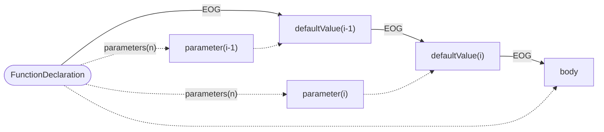
  
## StatementHolder
StatementHolder is an interface for any node that is not a function and contains code that should be connected with an EOG. The following classes implement this interface: `NamespaceDeclaration`, `TranslationUnitDeclaration`, `RecordDeclaration` and `CompoundStatement`. The Node implementing the interface is the start of one or multiple EOGs. Note that code inside such a holder can be static or non-static (bound to an instance of a record). Therefore two separate EOGs may be build. 
Interesting fields:
* `statements:List<Statement>`: the Code inside a holder, the individual elements are distinguished by a property marking them as `staticBlock` if they are a `CompoundStatement`.


## VariableDeclaration
Represents the declaration of a local variable.
Interesting fields:
* `initializer:Expression`: the result of evaluation will initialize the variable.

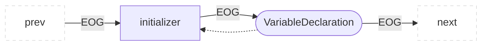

## CallExpression
Represents any type of call in a program.
Interesting fields:
* `base:Expression`: the base in a `MemberCallExpression` or a function pointer in a `CallExpression` evaluated to determine the call target.
* `arguments:List<Expression>`: mapped to the parameters of the call target but evaluated before the call happens.


## MemberExpression
Access to the field in a `RecordDeclaration`.
Interesting fields:
* `base:Expression`: the base evaluated to determine whomes field we want to access.

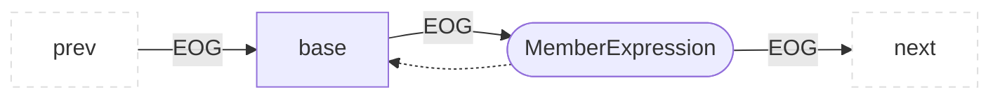
## ArraySubscriptionExpression
Array access in the form of `arrayExpression[subscriptExpression]`.
Interesting fields:
* `arrayExpression:Expression`: array to be accessed.
* `subscriptExpression:Expression`: index in the array.

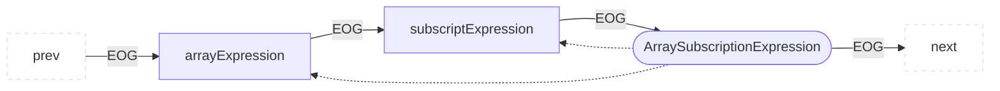
## ArrayCreationExpression
Interesting fields:
* `dimensions:List<Expression>`: multiple expression that define the size if the array dimensions.
* `initializer:Expression`: expression for array initialization.


## DeclarationStatement

Here the EOG is only drawn to the child component if that component is a VariableDeclaration, not if it is a FunctionDeclaration.

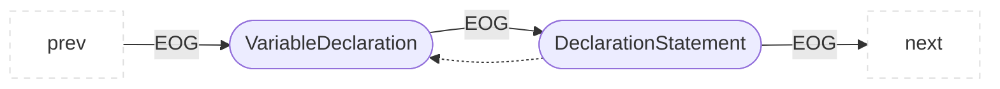
## ReturnStatement
End of an EOG as this is the last statement to be executed in the function.


## BinaryOperator

For binary operations like `+`, `-` but also assigments `=` and `+=` wer follow the left before right order. the `lhs` is evaluated before the `rhs` as we assume left to right evaluation.
Interesting fields:
* `lhs:Expression`:left side of a binary operation.
* `rhs:Expression`: right side of a binary operation.

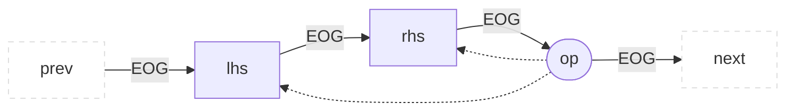


## BinaryOperator of short-circuit evaluation

`&&` and `||` lead to control flow bypassing the evaluation of the rhs expression.


## CompoundStatement

Represent an explizit block of statements
Interesting fields:
* `statements:List<Statement>`:Statements in a block of code that are evaluated sequentially.


## UnaryOperator
For unary operations like `!` but also writing operations: `++` and `--`.

Interesting fields:
* `input:Expression`:wrapped by the unary operation.

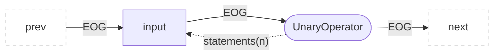


## UnaryOperator for exception throws
Throwing of exceptions is modelled as binary operation to follow the parsing of the CDT. The EOG continues at the an exception catching structure or a function that does a re-throw. 

Interesting fields:
* `input:Expression`:Exception to be thrown for exception handling.


## AssertStatement
Statement that evaluates a condition and if the condition is false, evaluates a message, this message is generalized to a `Statement` to hold everything 
from a single string, to an Exception construction
Interesting fields:
* `condition:Expression`:its evaluation leads to evaluation of message and EOG termination or to the regular evaluation of the parent `AssertStatement`
* `message:Statement`: a String message or Exception evaluated only if the assertion fails. 

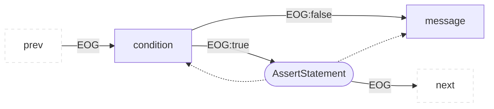


## TryStatement

After the execution of the statement the control flow only proceeds with the next statement if all exceptions were handled. If not, execution is relayed to the next outer exception handling context.
Interesting fields:
* `resources:List<Statement>`: initialization of values needed in the block or special objects needing cleanup.
* `tryBlock:CompoundStatement`:the code that should be "tried", exceptions inside lead to an eog edge to the catch clauses.
* `finallyBlock:CompoundStatement`: all EOG paths inside the `tryBlock` or the `catch` blocks will finally reach this block and evaluate it.
* `catchBlocks:List<CompoundStatementt>`:Children of `CatchClause` (omitted here), evaluated when the exception matches the clauses condition.

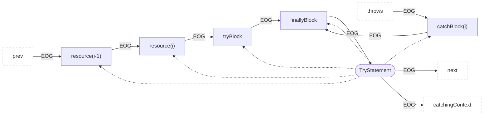

## ContinueStatement
Execution continues at the `condition` of a node associated to a `Continuable` scope, e.g. `WhileStatement`. This is not necessarely the closest enclosing node of this type, the `ContinueStatement` may contain a label specifying the exact outer node.

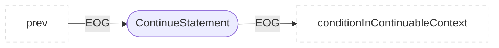
## BreakStatement
Execution continues after a node associated to a `Breakable` scope, e.g. `WhileStatement`or `SwitchStatement`. This is not necessarely the closest enclosing node of this type, the `BreakStatement` may contain a label specifying the exact outer node.
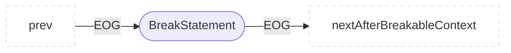
## DeleteExpression
Deletion of a specific object freeing memory or calling the destructor.
Interesting fields:
* `operand:Expression`: the result of the evaluation is the object to be deleted.

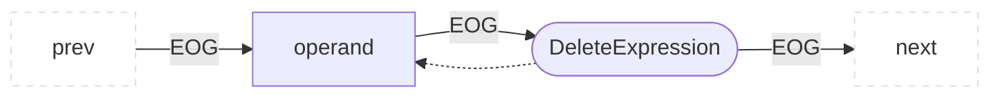
## LabelStatement
The `LabelStatement` itself is not added to the EOG. EOG construction is directly forwarded to the labeled statement in the `subStatement`.
```mermaid
flowchart LR
  classDef outer fill:#fff,stroke:#ddd,stroke-dasharray:5 5;
  prev:::outer --EOG--> child["subStatement"]
  child --EOG--> next:::outer
  parent(["LabelStatement"]) -.-> child

```
## GotoStatement
Modelles a GotoStatement and an EOG-Edge is created to the appropriate `LabelStatement`.
```mermaid
flowchart LR
  classDef outer fill:#fff,stroke:#ddd,stroke-dasharray:5 5;
  prev:::outer --EOG--> child["GotoStatement"]
  child --EOG--> labeledStatement:::outer

```

## NewExpression
```mermaid
flowchart LR
  classDef outer fill:#fff,stroke:#ddd,stroke-dasharray:5 5;
  prev:::outer --EOG--> child["initializer"]
  child --EOG--> parent
  parent(["NewExpression"]) --EOG--> next:::outer
  parent -.-> child

```
## CastExpression
```mermaid
flowchart LR
  classDef outer fill:#fff,stroke:#ddd,stroke-dasharray:5 5;
  prev:::outer --EOG--> child["expression"]
  child --EOG--> parent
  parent(["CastExpression"]) --EOG--> next:::outer
  parent -.-> child

```
## ExpressionList
```mermaid
flowchart LR
  classDef outer fill:#fff,stroke:#ddd,stroke-dasharray:5 5;
  prev:::outer --EOG--> child1["expression(i-1)"]
  child1 --EOG--> child2["expression(i)"]
  child2 --EOG--> parent
  parent(["ExpressionList"]) --EOG--> next:::outer
  parent -."expressions(n)".-> child1
  parent -."expressions(n)".-> child2

```
## InitializerListExpression
```mermaid
flowchart LR
  classDef outer fill:#fff,stroke:#ddd,stroke-dasharray:5 5;
  prev:::outer --EOG--> child1["initializer(i-1)"]
  child1 --EOG--> child2["initializer(i)"]
  child2 --EOG--> parent
  parent(["InitializerListExpression"]) --EOG--> next:::outer
  parent -."initializers(n)".-> child1
  parent -."initializers(n)".-> child2

```
## ConstructExpression

```mermaid
flowchart LR
  classDef outer fill:#fff,stroke:#ddd,stroke-dasharray:5 5;
  prev:::outer --EOG--> child1["argument(i-1)"]
  child1 --EOG--> child2["argument(i)"]
  child2 --EOG--> parent
  parent(["ConstructExpression"]) --EOG--> next:::outer
  parent -."arguments(n)".-> child1
  parent -."arguments(n)".-> child2

```
## SynchronizedStatement
The placement of the root node between expression and executed block is such that algorithms can evaluated the expression and then encountering the information that this expression is used for synchronization.
```mermaid
flowchart LR
  classDef outer fill:#fff,stroke:#ddd,stroke-dasharray:5 5;
  prev:::outer --EOG--> child1["expression"]
  child1 --EOG--> parent
  parent --EOG--> child2["blockStatement"]
  child2 --EOG--> next:::outer
  parent -.-> child1
  parent -.-> child2

```
## ConditionalExpression 
```mermaid
flowchart LR
  classDef outer fill:#fff,stroke:#ddd,stroke-dasharray:5 5;
  prev:::outer --EOG--> child1["condition"]
  child1 --EOG--> parent(["ConditionalExpression"])
  parent --EOG:true--> child2["thenExpr"]
  parent --EOG:false--> child3["elseExpr"]
  child2 --EOG--> next:::outer
  child3 --EOG--> next:::outer
  parent -.-> child1
  parent -.-> child2
  parent -.-> child3

```
## DoStatement
```mermaid
flowchart LR
  classDef outer fill:#fff,stroke:#ddd,stroke-dasharray:5 5;
  prev:::outer --EOG--> child1["statement"]
  child1 --EOG--> child2["condition"]
  child2 --EOG--> parent(["DoStatement"])
  parent --EOG:false--> next:::outer
  parent --EOG:true--> child1
  parent -.-> child1
  parent -.-> child2

```
## WhileStatement
```mermaid
flowchart LR
  classDef outer fill:#fff,stroke:#ddd,stroke-dasharray:5 5;
  prev:::outer --EOG--> child1["condition"]
  prev:::outer --EOG--> child2["conditionDeclaration"]
  child1 --EOG--> parent
  child2 --EOG--> parent
  parent(["WhileStatement"]) --EOG:true--> child3["statement"]
  parent --EOG:false--> next:::outer
  child3 --EOG--> child1
  child3 --EOG--> child2
  parent -.-> child1
  parent -.-> child2
  parent -.-> child3

```
## ForEachStatement
```mermaid
flowchart LR
  classDef outer fill:#fff,stroke:#ddd,stroke-dasharray:5 5;
  prev:::outer --EOG--> child1["iterable"]
  child1 --EOG--> child2["variable"]
  child2 --EOG--> parent
  parent(["ForEachStatement"]) --EOG:true--> child3["statement"]
  parent --EOG:false--> next:::outer
  child3 --EOG--> child1
  child3 --EOG--> child2
  parent -.-> child1
  parent -.-> child2
  parent -.-> child3

```
## ForStatement

```mermaid
flowchart LR
  classDef outer fill:#fff,stroke:#ddd,stroke-dasharray:5 5;
  prev:::outer --EOG--> child1["initializerStatement"]
  child1 --EOG--> child2["condition"]
  child1 --EOG--> child3["conditionDeclaration"]
  child2 --EOG--> parent
  child3 --EOG--> parent
  parent(["ForStatement"]) --EOG:true--> child4["statement"]
  parent --EOG:false--> next:::outer
  child4 --EOG--> child5["iterationStatement"]
  child5 --EOG--> child2
  child5 --EOG--> child3

```
## IfStatement
```mermaid
flowchart LR
  classDef outer fill:#fff,stroke:#ddd,stroke-dasharray:5 5;
  prev:::outer --EOG--> child1["initializerStatement"]
  child1 --EOG--> child2["condition"]
  child1 --EOG--> child3["conditionDeclaration"]
  child2 --EOG--> parent
  child3 --EOG--> parent
  parent(["ifStatement"]) --EOG:true--> child4["thenStatement"]
  parent --EOG:false--> child5["elseStatement"]
  parent --EOG--> next:::outer
  child4 --EOG--> next:::outer
  child5 --EOG--> next:::outer

```
## SwitchStatement
```mermaid
flowchart LR
  classDef outer fill:#fff,stroke:#ddd,stroke-dasharray:5 5;
  prev:::outer --EOG--> child1["initializerStatement"]
  child1 --EOG--> child2["selector"]
  child1 --EOG--> child3["selectorDeclaration"]
  child2 --EOG--> parent
  child3 --EOG--> parent
  parent(["SwitchStatement"]) --EOG--> child4["caseStatement"]
  parent --EOG--> child5["defaultStatement"]
  child7["statement(n-1)"] --EOG--> child6["statement"]
  parent -.->child6
  child6 -."statements(n)".-> child4
  child6 -."statements(n)".-> child5
  child6 -."statements(n)".-> child7
  child6 --EOG--> next:::outer

```
## CaseStatement
Serves as an entry point inside a `SwitchStatement`, the statements executed after entry are not children of this structure but can be found on the same AST-Hierarchy level. 
Interesting fields:
* `caseExpression:Expression`: serves as an entry point if its evaluation matches the `selector` evaluation in `SwitchStatement`
```mermaid
flowchart LR
  classDef outer fill:#fff,stroke:#ddd,stroke-dasharray:5 5;
  prev:::outer --EOG--> child["caseExpression"]
  child --EOG--> parent
  parent(["CaseStatement"]) --EOG--> next:::outer
  parent -.-> child

```


  

