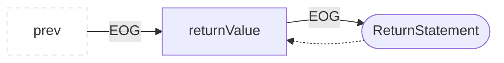

# Specification: Evaluation Order Graph

The Evaluation Order Graph (EOG) is built as edges between AST nodes after the initial language to CPG translation. Its purpose is to follow the order in which code is executed, similar to a CFG, and additionally differentiate on a finer level of granularity in which order expressions and subexpressions are evaluated. Each node that is part of the graph points to a set of previously evaluated nodes (`prevEOG`) and nodes that are evaluated after (`nextEOG`). The EOG-Edges are intracprocedural and thus differentiate from INVOKES-Edges. In the following, we summarize in which order the root node representing a language construct and its descendants in the AST tree are connected.

 An EOG always starts at the header of a method/function or record that holds code and ends in one (implicit) or multiple
 return statements. A implicit return statement with a code location of (-1,-1) is used if the
 actual source code does not have an explicit return statement.
 
 A distinct EOG is drawn for any declared component that can contain code, currently: `NamespaceDeclaration`, `TranslationUnitDeclaration`, `RecordDeclaration` and any Subclass of `FunctionDeclaration`.
 
 The EOG is similar to the CFG `ControlFlowGraphPass`, but there are some subtle differences:
 * For methods without explicit return statement, EOF will have an edge to a virtual return node  with line number -1 which does not exist in the original code. A CFG will always end with the last reachable statement(s) and not insert any virtual return statements.
 * EOG considers an opening blocking ("CompoundStatement", indicated by a "{") as a separate node. A CFG will rather use the first actual executable statement within the block.
 * For IF statements, EOG treats the "if" keyword and the condition as separate nodes. CFG treats this as one "if" statement.
 * EOG considers a method header as a node. CFG will consider the first executable statement of the methods as a node.

## General Structure
The graphs in this specifications abstract the representation of the handled graph to formally specify how EOG-edges are drawn between a parent node and the subgraphs rooted by its children. Therefore a collection of AST-children are represented as abstract nodes showing the multiplicity of the node with an indicator (n), in case of sets, or as several nodes showing how the position in a list can impact the construction of an EOG, e.g. nodes (i - 1) to i.
The EOG is constructed as postorder of the AST-traversal. When building the EOG for the expression a + b, the entire expression is considerd evaluated after the subexpression a and the subexpression b is evaluated, therefore EOG-Edges connect nodes of (a) and (b) before reaching the parent node (+).

Note: Nodes describing the titled programing construct will be drawn round, while the rectangular nodes represent their abstract children, that can be atomic leaf nodes or deep AST-Subtrees. EOG-Edges to these abstract nodes always mean that a subtree expansion would be necessary to connect the target of the EOG-Edge to the right node in the subtree.

Whether or not a subgraph (a) or (b) is connected first, depends on the exact constuct and sometimes the language that is translated into a CPG.Note, in the following graphics we will often draw an EOG-Edge to an abstract childnode of a language construct that is an AST-Subtree. The EOG-Path through that subtree will depend on the node types of that tree and mostly start connecting one of the AST-Leaf nodes.

## VariableDeclaration

  
## StatementHolder
StatementHolder is an interface for any node that is not a function and contains code that should be connected with an EOG. The following classes implement this interface: `NamespaceDeclaration`, `TranslationUnitDeclaration`, `RecordDeclaration` and `CompoundStatement`. Note that code can be static or non-static (bound to an instance of a record)

## CallExpression

## MemberExpression

## ArraySubscriptionExpression

## ArrayCreationExpression

## DeclarationStatement

Here the EOG is only drawn to the child component if that component is a VariableDeclaration, not if it is a FunctionDeclaration.

## ReturnStatement

## FunctionDeclaration

  

