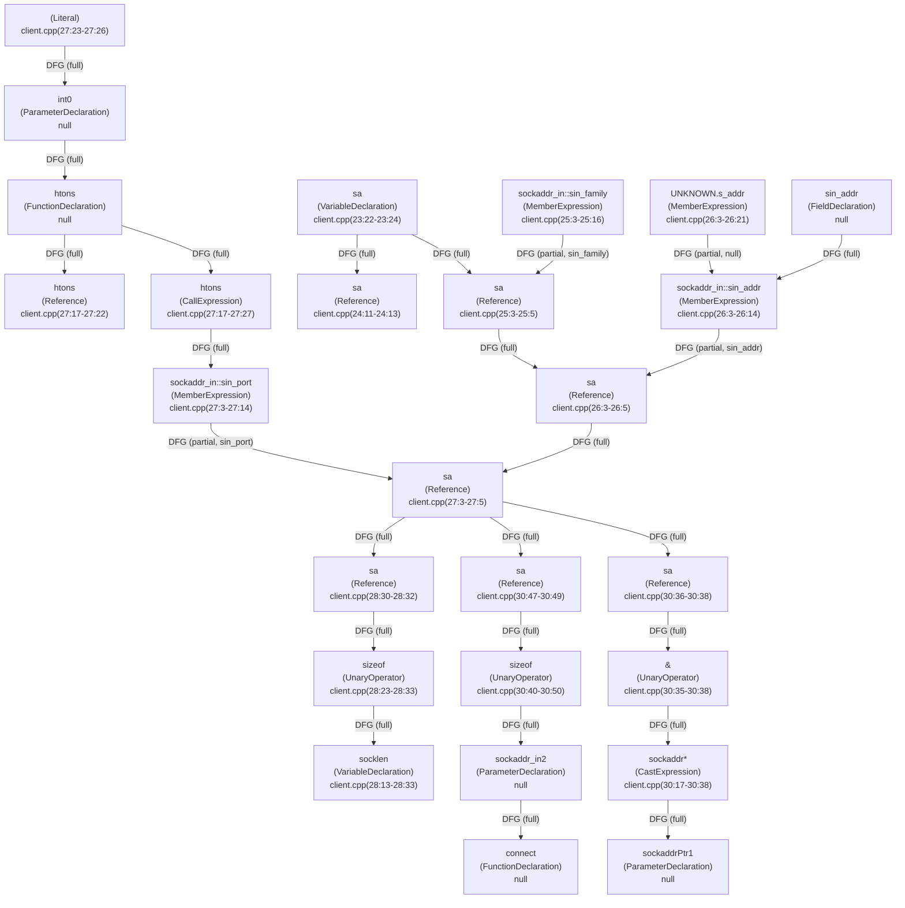

```mermaid
flowchart TD
    -665493437["htons (CallExpression) client.cpp(27:17-27:27)"]-->|"DFG (full)"|-97370009["sockaddr_in::sin_port
(MemberExpression)
client.cpp(27:3-27:14)"]
-97370009["sockaddr_in::sin_port
(MemberExpression)
client.cpp(27:3-27:14)"]-->|"DFG (partial, sin_port)"|-1628183843["sa
(Reference)
client.cpp(27:3-27:5)"]
1442660830["htons
(FunctionDeclaration)
null"]-->|"DFG (full)"|-665493437["htons
(CallExpression)
client.cpp(27:17-27:27)"]
-1628183843["sa
(Reference)
client.cpp(27:3-27:5)"]-->|"DFG (full)"|1896415814["sa
(Reference)
client.cpp(30:36-30:38)"]
-1628183843["sa
(Reference)
client.cpp(27:3-27:5)"]-->|"DFG (full)"|-1400154375["sa
(Reference)
client.cpp(30:47-30:49)"]
-1628183843["sa
(Reference)
client.cpp(27:3-27:5)"]-->|"DFG (full)"|-1197212555["sa
(Reference)
client.cpp(28:30-28:32)"]
2011685141["sa
(Reference)
client.cpp(26:3-26:5)"]-->|"DFG (full)"|-1628183843["sa
(Reference)
client.cpp(27:3-27:5)"]
1442660830["htons
(FunctionDeclaration)
null"]-->|"DFG (full)"|113222568["htons
(Reference)
client.cpp(27:17-27:22)"]
1633994253["int0
(ParameterDeclaration)
null"]-->|"DFG (full)"|1442660830["htons
(FunctionDeclaration)
null"]
1896415814["sa
(Reference)
client.cpp(30:36-30:38)"]-->|"DFG (full)"|-15082798["&
(UnaryOperator)
client.cpp(30:35-30:38)"]
-1400154375["sa
(Reference)
client.cpp(30:47-30:49)"]-->|"DFG (full)"|91487189["sizeof
(UnaryOperator)
client.cpp(30:40-30:50)"]
-1197212555["sa
(Reference)
client.cpp(28:30-28:32)"]-->|"DFG (full)"|-397411529["sizeof
(UnaryOperator)
client.cpp(28:23-28:33)"]
1188578321["sa
(Reference)
client.cpp(25:3-25:5)"]-->|"DFG (full)"|2011685141["sa
(Reference)
client.cpp(26:3-26:5)"]
661963929["sockaddr_in::sin_addr
(MemberExpression)
client.cpp(26:3-26:14)"]-->|"DFG (partial, sin_addr)"|2011685141["sa
(Reference)
client.cpp(26:3-26:5)"]
2016783228["
(Literal)
client.cpp(27:23-27:26)"]-->|"DFG (full)"|1633994253["int0
(ParameterDeclaration)
null"]
-15082798["&
(UnaryOperator)
client.cpp(30:35-30:38)"]-->|"DFG (full)"|-555036241["sockaddr*
(CastExpression)
client.cpp(30:17-30:38)"]
91487189["sizeof
(UnaryOperator)
client.cpp(30:40-30:50)"]-->|"DFG (full)"|209176719["sockaddr_in2
(ParameterDeclaration)
null"]
-397411529["sizeof
(UnaryOperator)
client.cpp(28:23-28:33)"]-->|"DFG (full)"|1392172385["socklen
(VariableDeclaration)
client.cpp(28:13-28:33)"]
-1990596440["sa
(VariableDeclaration)
client.cpp(23:22-23:24)"]-->|"DFG (full)"|1188578321["sa
(Reference)
client.cpp(25:3-25:5)"]
-743838394["sockaddr_in::sin_family
(MemberExpression)
client.cpp(25:3-25:16)"]-->|"DFG (partial, sin_family)"|1188578321["sa
(Reference)
client.cpp(25:3-25:5)"]
-729605854["UNKNOWN.s_addr
(MemberExpression)
client.cpp(26:3-26:21)"]-->|"DFG (partial, null)"|661963929["sockaddr_in::sin_addr
(MemberExpression)
client.cpp(26:3-26:14)"]
-1826033249["sin_addr
(FieldDeclaration)
null"]-->|"DFG (full)"|661963929["sockaddr_in::sin_addr
(MemberExpression)
client.cpp(26:3-26:14)"]
-555036241["sockaddr*
(CastExpression)
client.cpp(30:17-30:38)"]-->|"DFG (full)"|-2051447548["sockaddrPtr1
(ParameterDeclaration)
null"]
209176719["sockaddr_in2
(ParameterDeclaration)
null"]-->|"DFG (full)"|1011067204["connect
(FunctionDeclaration)
null"]
-1990596440["sa
(VariableDeclaration)
client.cpp(23:22-23:24)"]-->|"DFG (full)"|-2085989243["sa
(Reference)
client.cpp(24:11-24:13)"]
```