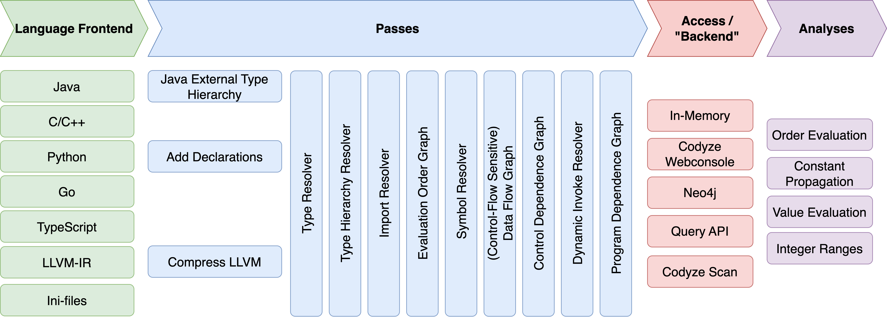

# Implementation and Concepts

The translation of source code to the graph consists of two main steps. First,
the source code is parsed and transferred to the CPG nodes by a so-called
**Language Frontend**. Then, **Passes** refine the information which is kept in
the graph. These two stages are strictly separated one from each other.

 
{ align=center }

* [Languages and Language Frontends](./language)
* [Scopes](./scopes)
* [Passes](./passes)
* [Symbol Resolution](./symbol-resolver.md)
