# Specification: Data Flow Graph

The Data Flow Graph (DFG) is built as edges between nodes. Each node has a set
of incoming data flows (`prevDFG`) and outgoing data flows (`nextDFG`). In the
following, we summarize how different types of nodes construct the respective
data flows.


## Call

Interesting fields:

* `invokes: List<FunctionDeclaration>`: A list of the functions which are called
* `arguments: List<Expression>`: The arguments which are used in the function
  call

A call expressions calls another function. We differentiate two types of call
expressions: 1) the called function is implemented in the program (and we can
analyze the code) and 2) the called function cannot be analyzed (e.g., this is
the case for library/API functions). For the first case, the `invokes` list
contains values, in the second case, the list is empty.

### Case 1: Known function

For each function in the `invokes` list, the arguments of the call expression
flow to the function's parameters. The value of the function declaration flows
to the call.

Scheme:
  ```mermaid
  flowchart LR
    node([Call]) -.- invokes["invokes[j]"];
    node -.- arguments["arguments[i]"];
    invokes ==> decl([FunctionDeclaration])
    decl -.- parameters["parameters[i]"]
    arguments -- "for all i: DFG" --> parameters
    invokes -- "forall j: DFG" --> node
  ```

### Case 2: Unknown function

The base and all arguments flow to the call expression.

Scheme:
  ```mermaid
  flowchart LR
    arguments["arguments[i]"] -- "for all i: DFG" --> node([Call]);
    base -- DFG --> node;
    arguments -.- node;
    node -.- base;
  ```

## Cast

Interesting fields:

* `expression: Expression`: The inner expression which has to be cast

The value of the `expression` flows to the cast expression.
Scheme:
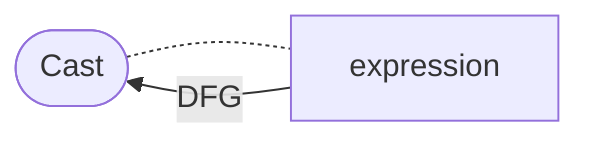


## Assign

Interesting fields:

* `lhs: List<Expression>`: All expressions on the left-hand side of the
  assignment.
* `rhs: List<Expression>`: All expressions on the right-hand side of the
  assignment.

### Case 1: Normal assignment (`operatorCode: =`)

The `rhs` flows to `lhs`. In some languages, it is possible to have an
assignment in a subexpression (e.g. `a + (b=1)`).
For this reason, if the assignment's ast parent is not a `Block` (i.e., a block
of statements), we also add a DFG edge to the whole operator.
If the `lhs` consists of multiple variables (or a tuple), we try to split up the
`rhs` by the index. If we can't do this, the whole `rhs` flows to all variables
in `lhs`.

Scheme:

* Standard case:
  ```mermaid
  flowchart LR
      node([Assign]) -.- rhs(rhs);
        rhs -- DFG --> lhs;
      node([Assign]) -.- lhs(lhs);
  ```
* If the assignment happens inside another statement/expression (not inside a
  `Block`):
  ```mermaid
  flowchart LR
      node([Assign]) -.- lhs(lhs);
      node([Assign]) -.- rhs(rhs);
      rhs -- DFG --> lhs;
      rhs -- DFG --> node;
  ```
* Since `lhs` and `rhs` can consist of multiple values, if size of `lhs` and
  `rhs` is equal, we actually make the DFG-edges for each indexed value: 
  ```mermaid
  flowchart LR
      node([Assign]) -.- rhs("rhs[i]");
        rhs -- "for all i: DFG[i]" --> lhs;
      node([Assign]) -.- lhs("lhs[i]");
  ```

### Case 2: Compound assignment (`operatorCode: *=, /=, %=, +=, -=, <<=, >>=, &=, ^=, |=` )

The `lhs` and the `rhs` flow to the binary operator expression, the binary
operator flows to the `lhs`.

Scheme:
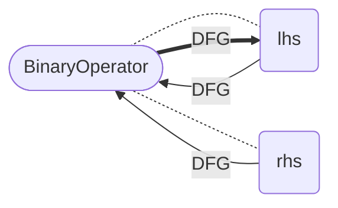

*Dangerous: We have to ensure that the first two operations are performed before
the last one*


## BinaryOperator

Interesting fields:

* `operatorCode: String`: String representation of the operator
* `lhs: Expression`: The left-hand side of the operation
* `rhs: Expression`: The right-hand side of the operation

We have to differentiate between the operators. We can group them into three
categories: 1) Assignment, 2) Assignment with a Computation and 3) Computation.

The `lhs` and the `rhs` flow to the binary operator expression.

Scheme:
  ```mermaid
  flowchart
    node([BinaryOperator]) -.- lhs(lhs);
    node([BinaryOperator]) -.- rhs(rhs);
    rhs -- DFG --> node;
    lhs -- DFG --> node;
  ```

## ArrayConstruction

Interesting fields:

* `initializer: Expression`: The initialization values of the array.

The `initializer` flows to the array creation expression.

Scheme:
  ```mermaid
  flowchart LR
    node([ArrayConstruction]) -.- initializer(initializer)
    initializer -- DFG --> node
  ```

## New

Interesting fields:

* `initializer: Expression`: The initializer of the expression.

The `initializer` flows to the whole expression.

Scheme:
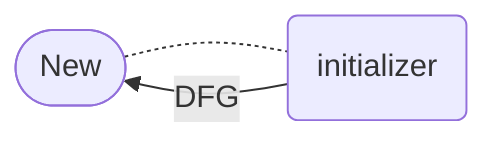

## Subscription

Interesting fields:

* `arrayExpression: Expression`: The array which is accessed
* `subscriptExpression: Expression`: The index which is accessed

The `arrayExpression` flows to the subscription expression. This means, we do
not differentiate between the field which is accessed.

Scheme:
  ```mermaid
  flowchart LR
    arrayExpression -- DFG --> node([Subscription]);
    arrayExpression -.- node;
  ```

## CollectionComprehension

Interesting fields:

* `comprehensionExpressions:
* List<CollectionComprehension.Comprehension>`: The list of
  expressions which are iterated over.
* `statement: Statement`: The statement which returns the data.

The data of `comprehensionExpressions[i]` flow to
`comprehensionExpressions[i+1]` and the last item in `comprehensionExpressions`
flows to `statement`.

Scheme:
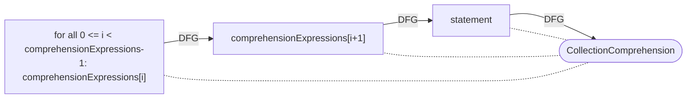

## CollectionComprehension.Comprehension

Interesting fields:

* `predicates: List<Statements>`: A list of conditions which have to hold to
  process the variable in the result.
* `iterable: Statement`: The statement which iterates over something.
* `variable: Statement`: The variable which holds the individual elements in the
  iterable.

The data of `iterable` flow to `variable` which flows to the whole node. Also,
all `predicates` flow to the whole node.

Scheme:
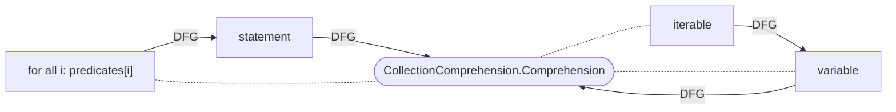

!!! info "Implicit Dataflows"

    The DFG does not model implicit dataflows, i.e., the information if the
    execution or some conditions may have an impact on certain variables, the
    program's behavior. This information can easily be found in the [program
    dependence graph (PDG)](./pdg).

## Conditional

Interesting fields:

* `condition: Expression`: The condition which is evaluated.
* `thenExpression: Expression`: The expression which is executed if the
  condition holds.
* `elseExpression: Expression`: The expression which is executed if the
  condition does not hold.

The `thenExpr` and the `elseExpr` flow to the `Conditional`. This
means that implicit data flows are not considered.

Scheme:
  ```mermaid
  flowchart LR
    thenExpression -- DFG --> node([Conditional]);
    thenExpression -.- node;
    elseExpression -.- node;
    elseExpression -- DFG --> node;
  ```

!!! info "Implicit Dataflows"

    The DFG does not model implicit dataflows, i.e., the information if the
    execution or some conditions may have an impact on certain variables, the
    program's behavior. This information can easily be found in the [program
    dependence graph (PDG)](./pdg).

## Reference

Interesting fields:

* `refersTo: Declaration`: The declaration e.g. of the variable or symbol.
* `access: AccessValues`: Determines if the value is read from, written to or
  both.

This is the most tricky concept for the DFG edges. We have to differentiate
between the DFG edges generated by the `DFGPass` and the ones generated by the
`ControlFlowSensitiveDFGPass`.

The `DFGPass` generates very simple edges based on the access to the variable as
follows:

* The value flows from the declaration to the expression for read access.
  Scheme:
  ```mermaid
  flowchart LR
    refersTo -- DFG --> node([Reference]);
    refersTo -.- node;
  ```
* For write access, data flow from the expression to the declaration. Scheme:
  ```mermaid
  flowchart LR
    node([Reference]) -- DFG --> refersTo;
    node -.- refersTo;
  ```
* For readwrite access, both flows are present. Scheme:
  ```mermaid
  flowchart LR
    refersTo -- DFG 1 --> node([Reference]);
    refersTo -.- node;
    node -- DFG 2 --> refersTo;
  ```

This mostly serves one purpose: The current function pointer resolution requires
such flows. Once the respective passes are redesigned, we may want to update
this.

The `ControlFlowSensitiveDFGPass` completely changes this behavior and accounts
for the data flows which differ depending on the program's control flow (e.g.,
different assignments to a variable in an if and else branch, ...). The pass
performs the following actions:

* First, it clears all the edges between a `VariableDeclaration` and its
  `Reference`. Actually, it clears all incoming and outgoing DFG edges of all
  VariableDeclarations in a function. This includes the initializer but this
  edge is restored right away. Scheme:
  ```mermaid
  flowchart LR
    node([VariableDeclaration]) -.- initializer;
    initializer -- DFG --> node;
  ```
* For each read access to a Reference, it collects all potential previous
  assignments to the variable and adds these to the incoming DFG edges. You can
  imagine that this is done by traversing the EOG backwards until finding the
  first assignment to the variable for each possible path. Scheme:
  ```mermaid
  flowchart LR
    node([Reference]) -.- refersTo;
    A == last write to ==> refersTo;
    A[/Node/] -- DFG --> node;
  ```
* If we increment or decrement a variable with "++" or "--", the data of this
  statement flows from the previous writes of the variable to the input of the
  statement (= the Reference). We write back to this reference and consider the
  lhs as a "write" to the variable! *Attention: This potentially adds loops and
  can look like a branch. Needs to be handled with care in subsequent
  passes/analyses!* Scheme:
  ```mermaid
  flowchart LR
    node([UnaryOperator]) -.- input;
    input -.- |"(optional)"| refersTo;
    W -- DFG 1 --> input;
    W[/Node/] == last write to ==> refersTo;
    input -- DFG 2 --> node;
    node -- DFG 3 --> input;
    input -- DFG 4 --> R[/Node/];
    R == next read of ==> refersTo;
  ```
* For compound operators such as `+=, -=, *=, /=`, we have an incoming flow from
  the last writes to reference on the left hand side of the expression to the
  lhs. The lhs then flows to the whole expression. Also, the right hand side
  flows to the whole expression (if it's a read, this is processed separately).
  The data flows back to the lhs which is marked as the last write to the
  variable. *Attention: This potentially adds loops and can look like a branch.
  Needs to be handled with care in subsequent passes/analyses!* Scheme:
  ```mermaid
  flowchart LR
    node -.- rhs;
    node -.- lhs;
    lhs -.- refersTo;
    W -- DFG 1 --> lhs;
    W[/Node/] == last write to ==> refersTo;
    rhs -- DFG 2 --> node;
    lhs -- DFG 4 --> R;
    lhs -- DFG 2 --> node([BinaryOperator]);
    node -- DFG 3 --> lhs;
    R[/Node/] == next read of ==> refersTo;
  ```
* If the variable is assigned a value (a binary operator `var = rhs`), the right
  hand side flows to the variable. This is considered as a write operation.
  Scheme:
  ```mermaid
  flowchart LR 
    node -.- rhs;
    node -.- lhs;
    lhs -.- refersTo;
    lhs -- DFG 2 --> node([BinaryOperator]);
    R[/Node/] == next read of ==> refersTo;
    rhs -- DFG --> lhs;
    lhs -- DFG --> refersTo
  ```

## MemberAccess

Interesting fields:

* `base: Expression`: The base object whose field is accessed.
* `refersTo: Declaration?`: The field it refers to. If the class is not
  implemented in the code under analysis, it is `null`.

The MemberAccess represents an access to an object's field and extends a
Reference with a `base`

If an implementation of the respective class is available, we handle it like a
normal Reference. If the `refersTo` field is `null` (i.e., the implementation is
not available), base flows to the expression.

## ExpressionList

Interesting fields:

* `expressions: List<Statement>`

The data of the last statement in `expressions` flows to the expression.

## InitializerList

Interesting fields:

* `initializers: List<Expression>`: The list of expressions which initialize the
  values.

The data of all initializers flow to this expression.

Scheme:
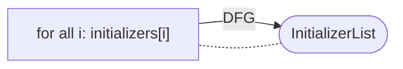

## KeyValue

Interesting fields:

* `value: Expression`: The value which is assigned.

The value flows to this expression.

Scheme:
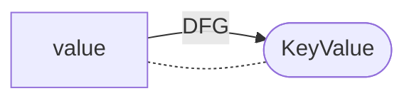


## Lambda

Interesting fields:

* `function: FunctionDeclaration`: The usage of a lambda

The data flow from the function representing the lambda to the expression.

Scheme:
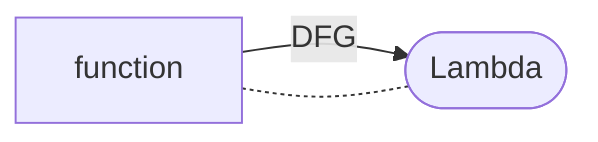

## UnaryOperator

Interesting fields:

* `input: Expression`: The inner expression
* `operatorCode: String`: A string representation of the operation

The data flow from the input to this node and, in case of the operatorCodes ++
and -- also back from the node to the input.

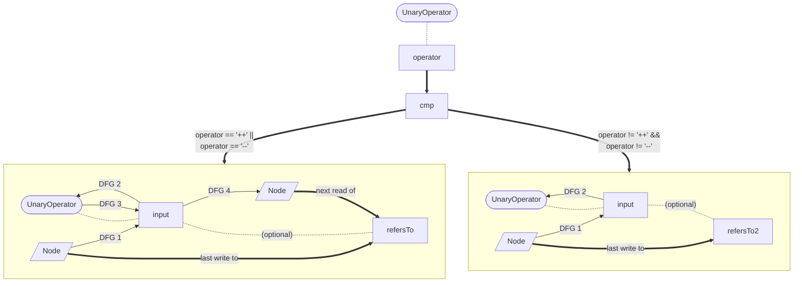

*Dangerous: We have to ensure that the first operation is performed before the
last one (if applicable).*

## Throw

Interesting fields:

* `exception: Expression`: The exception which is thrown.
* `parentException: Expression`: The exception which has originally caused this
  exception to be thrown (e.g. in a catch clause).

The return value flows to the whole statement.

Scheme:
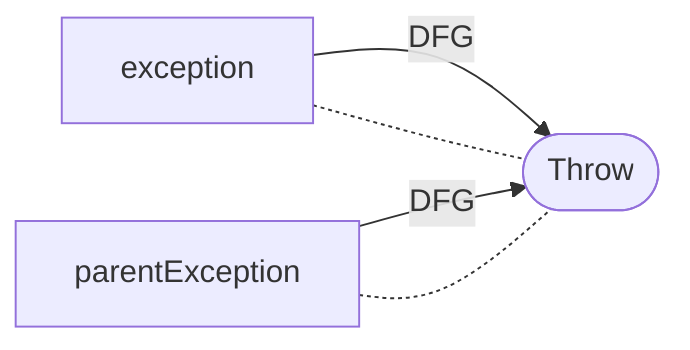

## ReturnStatement

Interesting fields:

* `returnValue: Expression`: The value which is returned

The return value flows to the whole statement.

Scheme:
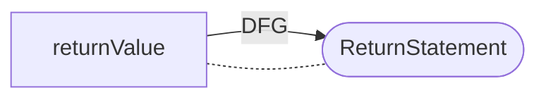
## Branching Statements
Specific statements lead to a branch in the control flow of a program. A value
that influences the branching decision can lead to an implicit data flow via the
branching, and we therefore draw a dfg edge from the condition, to the branching
node.

!!! info "Implicit Dataflows"

    The DFG does not model implicit dataflows, i.e., the information if the
    execution or some conditions may have an impact on certain variables, the
    program's behavior. This information can easily be found in the [program
    dependence graph (PDG)](./pdg).

### ForEachStatement

Interesting fields:

* `variable: Statement`: The statement which is used in each iteration to assign
  the current iteration value.
* `iterable: Statement`: The statement or expression, which is iterated.

The value of the iterable flow to the `VariableDeclaration` in the `variable`.
Since some languages allow arbitrary logic, we differentiate between two cases:

#### Case 1. The `variable` is a `DeclarationStatement`.

This is the case for most languages where we can have only a variable in this
place (e.g., `for(e in list)`). Here, we get the declaration(s) in the statement
and add the DFG from the iterable to this declaration.


Scheme:
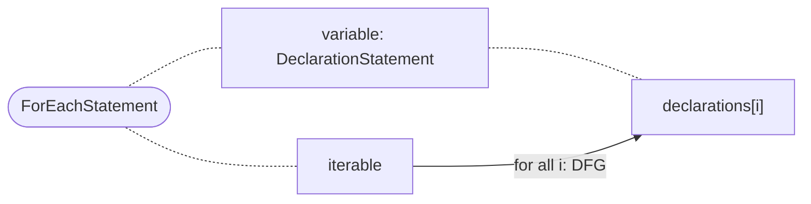

#### Case 2. The `variable` is another type of `Statement`.

In this case, we assume that the last VariableDeclaration is the one used for
looping. We add a DFG edge only to this declaration.

Scheme:
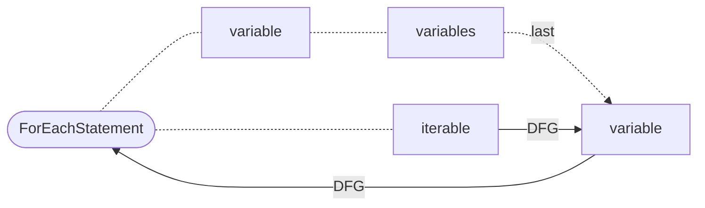

### DoStatement

Interesting fields:

* `condition: Statement`: The condition that is evaluated before making the
  branching decision.

Scheme:
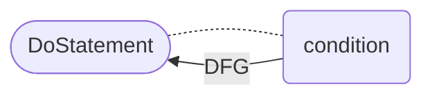

### WhileStatement

Interesting fields:

* `condition: Statement`: The condition that is evaluated before making the
  branching decision.
* `conditionDeclaration: Statement`: A declaration containing the condition in
  the initializer, used instead of the condition.

Scheme:
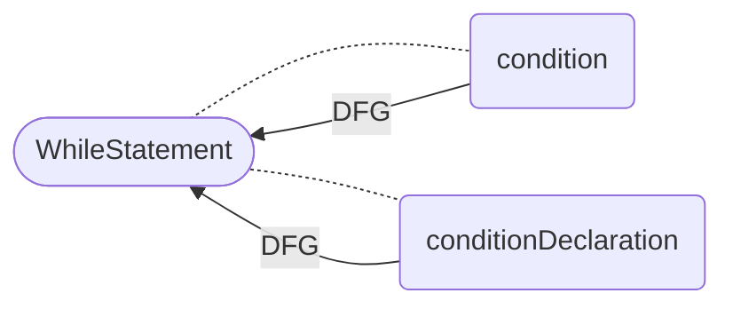

### ForStatement

Interesting fields:

* `condition: Statement`: The condition that is evaluated before making the
  branching decision.
* `conditionDeclaration: Statement`: A declaration containing the condition in
  the initializer, used instead of the condition.

Scheme:
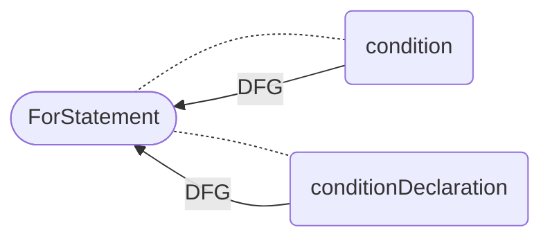


### IfStatement

Interesting fields:

* `condition: Statement`: The condition that is evaluated before making the
  branching decision.
* `conditionDeclaration: Statement`: A declaration with an initializer
  containing the condition which can be used instead of the condition.

Scheme:
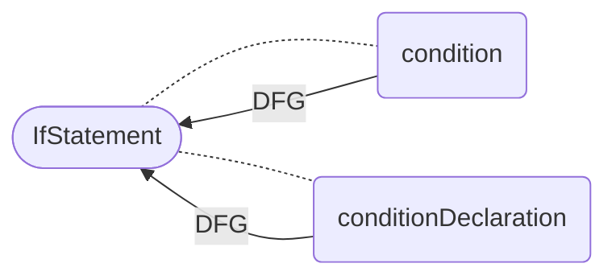


### SwitchStatement
Interesting fields:

* `selector: Statement`: The expression that is evaluated before making the
  branching decision.
* `selectorDeclaration: Statement`: A declaration containing the selector in the
  initializer, used instead of the selector.

Scheme:
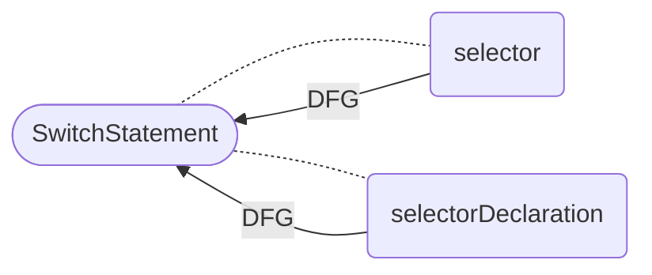

## FunctionDeclaration

Interesting fields:

* `body: Expression`: The body (i.e., all statements) of the function
  implementation.

The values of all return expressions in the body flow to the function
declaration.

Scheme:
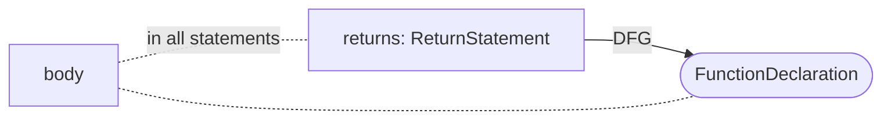


## FieldDeclaration

Interesting fields:

* `initializer: Expression?`: The value which is used to initialize a field (if
  applicable).

The value of the initializer flows to the whole field.

In addition, all writes to a reference to the field (via a `Reference`) flow to
the field, for all reads, data flow to the reference.

Scheme:
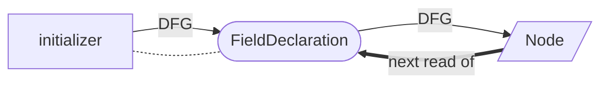

## VariableDeclaration

Interesting fields:

* `initializer: Expression?`: The value which is used to initialize a variable
* (if applicable).

The value of the initializer flows to the variable declaration. The value of the
variable declarations flows to all `References` which read the value before the
value of the variable is written to through another reference to the variable.

Scheme:
```mermaid
  flowchart LR
    initializer -- DFG --> node([VariableDeclaration]);
    initializer -.- node;
    node -- DFG --> R[/Node/];
    R == next read of ==> node;
```

## TupleDeclaration

Interesting fields:

* `initializer: Expression?`: The value which is used to initialize a variable
  (if applicable).
* `element: List<VariableDeclaration>`: The value which is used to initialize a
  variable (if applicable).

The value of the initializer flows to the elements of the tuple declaration. The
value of the variable declarations flows to all `References` which read the
value before the value of the variable is written to through another reference
to the variable.

Scheme:
```mermaid
  flowchart LR
    initializer -- "for all i: DFG[i]" --> tuple("elements[i]");
    node([VariableDeclaration]) -.- tuple;
    initializer -.- node;
    tuple -- DFG --> R[/Node/];
    R == next read of ==> tuple;
```


## Assignment

Interesting fields:

* `value: Expression`: The rhs of the assignment.
* `target: AssignmentTarget`: The lhs of the assignment.

This should already be covered by the declarations and binary operator "=". If
not, the `value` flows to the `target`.

Scheme:
```mermaid
  flowchart LR
    value -.- node([Assignment]);
    target -.- node;
    value -- DFG --> target;
```
