# Specification: Evaluation Order Graph

The Evaluation Order Graph (EOG) is built as edges between AST nodes after the initial translation of the code to the CPG.
Its purpose is to follow the order in which code is executed, similar to a CFG, and additionally differentiate on a finer level of granularity in which order expressions and subexpressions are evaluated.
Every node points to a set of previously evaluated nodes (`prevEOG`) and nodes that are evaluated after (`nextEOG`).
The EOG edges are intra-procedural and thus differentiate from INVOKES edges.
In the following, we summarize in which order the root node representing a language construct and its descendants in the AST tree are connected.

An EOG always starts at root node representing a method/function or record that holds executable code and ends in the node representing the corresponding code or multiple return statements.
An implicit return statement with a code location of (-1,-1) is used if the actual source code does not have an explicit return statement.

A distinct EOG is drawn for any declared component that can contain code, currently: `NamespaceDeclaration`, `TranslationUnitDeclaration`, `RecordDeclaration` and any subclass of `FunctionDeclaration`.
 
The EOG is similar to a CFG which connects basic blocks of statements, but there are some subtle differences:

* For methods without explicit return statement, the EOG will have an edge to a virtual return node  with line number -1 which does not exist in the original code. 
  A CFG will always end with the last reachable statement(s) and not insert any virtual return statements.
* The EOG considers an opening blocking (`Block`, indicated by a `{`) as a separate node.
  A CFG will rather use the first actual executable statement within the block.
* For IF statements, the EOG treats the `if` keyword and the condition as separate nodes.
  A CFG treats this as one `if` statement.
* The EOG considers a method header as a node.
  A CFG will consider the first executable statement of the methods as a node.

## General Structure

The graphs in this specification abstract the representation of the handled graph, to formally specify how EOG edges are drawn between a parent node and the subgraphs rooted by its children.
Therefore, a collection of AST children are represented as abstract nodes showing the multiplicity of the node with an indicator (n), in case of sets, or as several nodes showing how the position in a list can impact the construction of an EOG, e.g., nodes `(i - 1)` to `i`.
The EOG is constructed as postorder of the AST traversal.
When building the EOG for the expression a + b, the entire expression is considered evaluated after the subexpression a and the subexpression b is evaluated, therefore EOG edges connect nodes of (a) and (b) before reaching the parent node (+).

Note: Nodes describing the titled programing construct will be drawn round, while the rectangular nodes represent their abstract children, that can be atomic leaf nodes or deep AST subtrees.
EOG edges to these abstract nodes always mean that a subtree expansion would be necessary to connect the target of the EOG edge to the right node in the subtree.

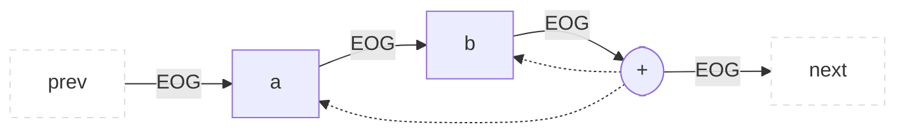

Whether a subgraph (a) or (b) is connected first, depends on the exact construct and sometimes the language that is translated into a CPG.
Note that, in the following graphics we will often draw an EOG edge to an abstract child node of a language construct that is an AST subtree.
The EOG path through that subtree will depend on the node types of that tree and mostly start connecting one of the AST leaf nodes.

## FunctionDeclaration
A function declaration is the start of an intra-procedural EOG and contains its end. Therefore, there is no incoming or outgoing edge to `previous` or `next` eog nodes that are not in its AST subtree. The EOG connects the code body, as well as the default values of parameters if they exist.

Interesting fields:

* `parameters: List<ParameterDeclaration>`: The parameters of the function.
* `defaultValue: Expression`: Optional default values of the parameters that have to be evaluated before executing the function's body.
* `body: Statement`: One or multiple statements executed when this function is called.

Scheme:
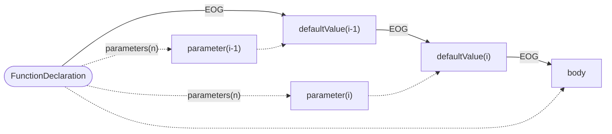
  
## StatementHolder
StatementHolder is an interface for any node that is not a function and contains code that should be connected with an EOG. The following classes implement this interface: `NamespaceDeclaration`, `TranslationUnitDeclaration`, `RecordDeclaration` and `Block`. The Node implementing the interface is the start of one or multiple EOGs. Note that code inside such a holder can be static or non-static (bound to an instance of a record). Therefore, two separate EOGs may be built. 

Interesting fields:

* `statements: List<Statement>`: The code inside a holder. The individual elements are distinguished by a property marking them as `staticBlock` if they are a `Block`.

Scheme:
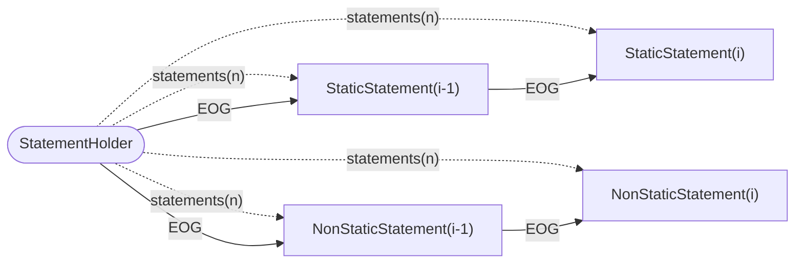

## TupleDeclaration
Represents the declaration of a tuple of variables.

Interesting fields:

* `initializer: Expression`: The result of evaluation will initialize the variable.
* `elements: List<VariableDeclaration>`: The result of evaluation will initialize the variable.

Scheme:
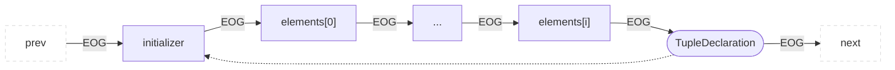

## VariableDeclaration
Represents the declaration of a local or global variable.

Interesting fields:

* `initializer: Expression`: The result of evaluation will initialize the variable.

Scheme:
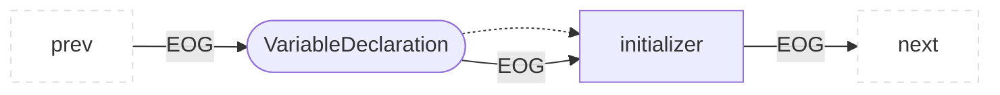

In case the variable is a global variable (e.g., a top-level variable in a `RecordDeclaration`), it does not have a `prevEOG` and the initializer does not have a `nextEOG`.

## Call
Represents any type of call in a program.

Interesting fields:

* `callee: Expression`: The expression declaring the target of a call. This can be a base in a `MemberCall` or a function pointer in a `Call`or a reference.
* `arguments: List<Expression>`: Mapped to the parameters of the call target but evaluated before the call happens.

Scheme:
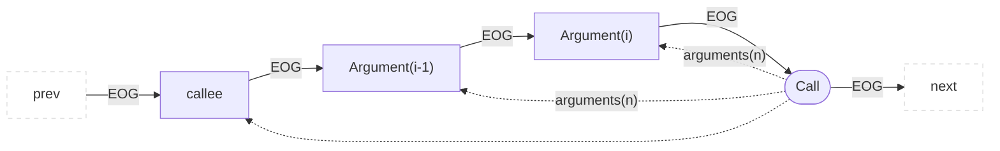

## MemberAccess
Access to the field in a `RecordDeclaration`.

Interesting fields:

* `base: Expression`: The base evaluated to determine whose field we want to access.

Scheme:
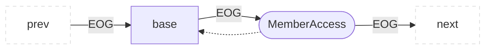

## Subscription
Array access in the form of `arrayExpression[subscriptExpression]`.

Interesting fields:

* `arrayExpression: Expression`: The array to be accessed.
* `subscriptExpression: Expression`: The index in the array.

Scheme:
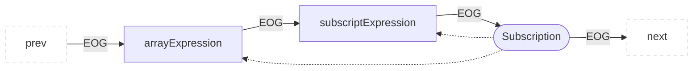

## ArrayConstruction
Interesting fields:

* `dimensions: List<Expression>`: Multiple expressions that define the array's dimensions.
* `initializer: Expression`: The expression for array initialization.

Scheme:
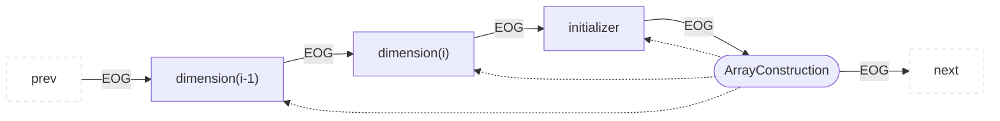

## KeyValue
Represents a key / value pair that could be used in associative arrays, among others.

Interesting fields:

* `key: Expression`: The key used for later accessing this pair.
* `value: Expression`: The value of the pair.

Scheme:
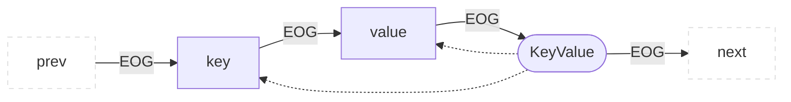

## DeclarationStatement

Here, the EOG is only drawn to the child component if that component is a VariableDeclaration, not if it is a FunctionDeclaration.

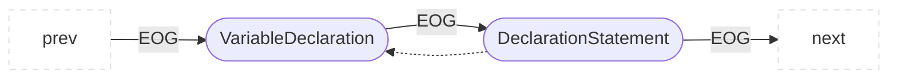
## ReturnStatement
This forms the end of an EOG as this is the last statement to be executed in the function.

Scheme:
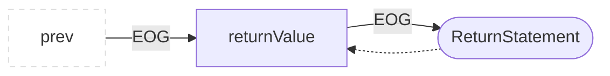

## BinaryOperator

Interesting fields:

* `lhs: Expression`: Left hand side of a binary operation.
* `rhs: Expression`: Right hand side of a binary operation.
* `operatorCode: String`: The operation.

We differentiate between two cases based on the `operatorCode`.

### Short-circuit evaluation

The operations `&&` and `||` have a short-circuit evaluation. This means that the expression can terminate early if the `lhs` is false (for `&&`) or `true` (for `||`). This affects the EOG by adding an EOG edge from `lhs` to the BinaryOperator.

Scheme:
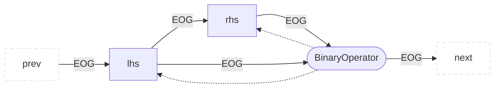
### Default case

For the other binary operations like `+`, `-` but also assignments `=` and `+=` we follow the left before right order. The `lhs` is evaluated before the `rhs` as we assume left to right evaluation.

Scheme:
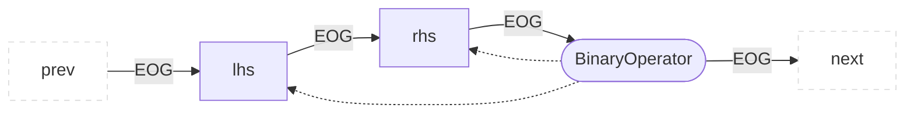

## Assign

Interesting fields:

* `lhs: List<Expression>`: All expressions on the left-hand side of the assignment (i.e., the target)
* `rhs: List<Expression>`: All expressions on the right-hand side of the assignment (i.e., the value to be assigned)
* `declarations: List<Declaration>`: All expressions on the left-hand side of the assignment (i.e., the target)

Scheme:
```mermaid
flowchart LR
  classDef outer fill:#fff,stroke:#ddd,stroke-dasharray:5 5;
  prev:::outer --EOG--> decl0["declarations[0]"]
  decl0 --EOG--> decl.["..."]
  decl. --EOG--> decli["declarations[i]"]
  decli --EOG--> lhs0["lhs[0]"]
  lhs0 --EOG--> lhs.["..."]
  lhs. --EOG--> lhsi["lhs[i]"]
  lhsi--EOG--> rhs0["rhs[0]"]
  rhs0 --EOG--> rhs.["..."]
  rhs. --EOG--> rhsi["rhs[i]"]
  rhsi --EOG--> node
```


## Block

Represents an explicit block of statements.

Interesting fields:

* `statements:List<Statement>`: Statements in a block of code that are evaluated sequentially.

Scheme:
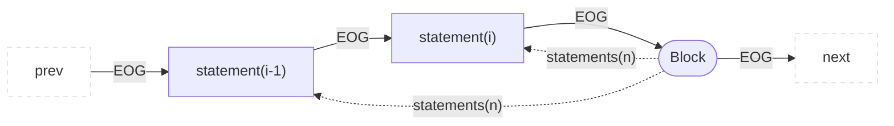

## UnaryOperator
For unary operations like `!` but also writing operations: `++` and `--`.

Interesting fields:

* `input:Expression`: Wrapped by the unary operation.

Scheme:
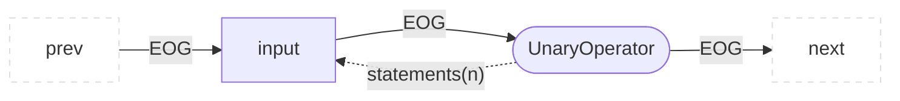

## Throw
The EOG continues at an exception catching structure or a function that does a re-throw.

Interesting fields:

* `exception: Expression`: Exception to be thrown for exception handling.
* `parentException: Expression`: Exception which caused this exception to be thrown.

Scheme:
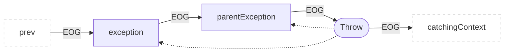


## AssertStatement
Statement that evaluates a condition and if the condition is false, evaluates a message, this message is generalized to a `Statement` to hold everything 
from a single String, to an Exception construction.

Interesting fields:

* `condition: Expression` Its evaluation leads to evaluation of message and EOG termination or to the regular evaluation of the parent `AssertStatement`.
* `message: Statement`: A String message or Exception evaluated only if the assertion fails. 

Scheme:
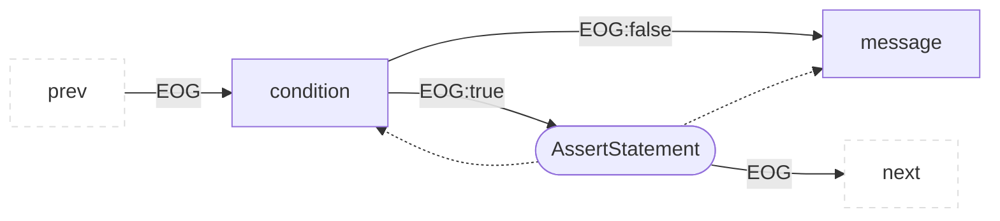

## TryStatement

After the execution of the statement the control flow only proceeds with the next statement if all exceptions were handled. If not, execution is relayed to the next outer exception handling context.

Interesting fields:

* `resources:List<Statement>`: Initialization of values needed in the block or special objects needing cleanup.
* `tryBlock:Block`: The code that should be tried, exceptions inside lead to an eog edge to the catch clauses.
* `finallyBlock:Block`: All EOG paths inside the `tryBlock` or the `catch` blocks will finally reach this block and evaluate it.
* `catchBlocks:List<Block>`: Children of `CatchClause` (omitted here), evaluated when the exception matches the clauses condition.

Scheme:
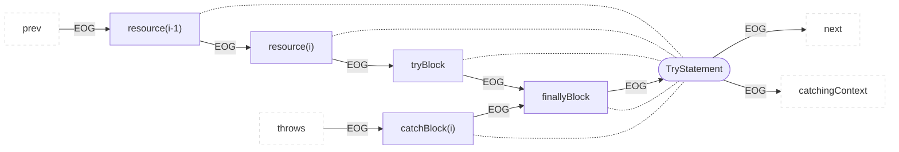

## ContinueStatement
The execution continues at the `condition` of a node associated to a `Continuable` scope, e.g. `WhileStatement`. This is not necessarily the closest enclosing node of this type, the `ContinueStatement` may contain a label specifying the exact outer node.

Scheme:
```mermaid
flowchart LR
  classDef outer fill:#fff,stroke:#ddd,stroke-dasharray:5 5;
  prev:::outer --EOG--> parent
  parent(["ContinueStatement"]) --EOG--> conditionInContinuableContext:::outer

```
## BreakStatement
The execution continues after a node associated to a `Breakable` scope, e.g. `WhileStatement`or `SwitchStatement`. This is not necessarily the closest enclosing node of this type, the `BreakStatement` may contain a label specifying the exact outer node.

Scheme:
```mermaid
flowchart LR
  classDef outer fill:#fff,stroke:#ddd,stroke-dasharray:5 5;
  prev:::outer --EOG--> parent
  parent(["BreakStatement"]) --EOG--> nextAfterBreakableContext:::outer
```

## Delete
Deletion of a specific object freeing memory or calling the destructor.

Interesting fields:

* `operand: Expression`: The result of the evaluation is the object to be deleted.

Scheme:
```mermaid
flowchart LR
  classDef outer fill:#fff,stroke:#ddd,stroke-dasharray:5 5;
  prev:::outer --EOG--> child["operand"]
  child --EOG--> parent
  parent(["Delete"]) --EOG--> next:::outer
  parent -.-> child
```

## LabelStatement
The `LabelStatement` itself is not added to the EOG. EOG construction is directly forwarded to the labeled statement in the `subStatement`.

Scheme:
```mermaid
flowchart LR
  classDef outer fill:#fff,stroke:#ddd,stroke-dasharray:5 5;
  prev:::outer --EOG--> child["subStatement"]
  child --EOG--> next:::outer
  parent(["LabelStatement"]) -.-> child
```

## GotoStatement
Models a `goto`statement and an EOG-Edge is created to the appropriate `LabelStatement`.

Scheme:
```mermaid
flowchart LR
  classDef outer fill:#fff,stroke:#ddd,stroke-dasharray:5 5;
  prev:::outer --EOG--> child(["GotoStatement"])
  child --EOG--> labeledStatement:::outer
```

## New
Creates a new object, which is either an array or an instantiation of a `RecordDeclaration`. The initializer has to be evaluated to create the object.

Interesting fields:

* `initializer: Expression`: To be evaluated before creating a new object.

Scheme:
```mermaid
flowchart LR
  classDef outer fill:#fff,stroke:#ddd,stroke-dasharray:5 5;
  prev:::outer --EOG--> child["initializer"]
  child --EOG--> parent
  parent(["New"]) --EOG--> next:::outer
  parent -.-> child
```

## Cast
Interesting fields:

* `expression: Expression`: An expression of a specific compile time type, cast to a specified other compile time type.

Scheme:
```mermaid
flowchart LR
  classDef outer fill:#fff,stroke:#ddd,stroke-dasharray:5 5;
  prev:::outer --EOG--> child["expression"]
  child --EOG--> parent
  parent(["Cast"]) --EOG--> next:::outer
  parent -.-> child
```

## ExpressionList
List of several expressions that are evaluated sequentially. The resulting value is the last evaluated expression.

Interesting fields:

* `expressions: List<Expression>`: Several expressions in sequential order.

Scheme:
```mermaid
flowchart LR
  classDef outer fill:#fff,stroke:#ddd,stroke-dasharray:5 5;
  prev:::outer --EOG--> child1["expression(i-1)"]
  child1 --EOG--> child2["expression(i)"]
  child2 --EOG--> parent
  parent(["ExpressionList"]) --EOG--> next:::outer
  parent -."expressions(n)".-> child1
  parent -."expressions(n)".-> child2
```

## InitializerList
This expression initializes multiple variables or an object of multiple elements, e.g. arrays, lists.

Scheme:
```mermaid
flowchart LR
  classDef outer fill:#fff,stroke:#ddd,stroke-dasharray:5 5;
  prev:::outer --EOG--> child1["initializer(i-1)"]
  child1 --EOG--> child2["initializer(i)"]
  child2 --EOG--> parent
  parent(["InitializerList"]) --EOG--> next:::outer
  parent -."initializers(n)".-> child1
  parent -."initializers(n)".-> child2
```

## Construction
A Construction creates an object.

Interesting fields:

* `arguments: List<Expression>`: Arguments to the construction, e.g. arguments for a call to a constructor.

Scheme:
```mermaid
flowchart LR
  classDef outer fill:#fff,stroke:#ddd,stroke-dasharray:5 5;
  prev:::outer --EOG--> child1["argument(i-1)"]
  child1 --EOG--> child2["argument(i)"]
  child2 --EOG--> parent
  parent(["Construction"]) --EOG--> next:::outer
  parent -."arguments(n)".-> child1
  parent -."arguments(n)".-> child2
```

## SynchronizedStatement
The placement of the root node between expression and executed block is such that algorithms can be evaluated the expression and then encountering the information that this expression is used for synchronization.

Interesting fields:

* `expression: Expression`: Its evaluation returns an object that acts as a lock for synchronization.
* `block: Block`: Code executed while the object evaluated from `expression` is locked.

Scheme:
```mermaid
flowchart LR
  classDef outer fill:#fff,stroke:#ddd,stroke-dasharray:5 5;
  prev:::outer --EOG--> child1["expression"]
  child1 --EOG--> parent(["SynchronizedStatement"])
  parent --EOG--> child2["block"]
  child2 --EOG--> next:::outer
  parent -.-> child1
  parent -.-> child2
```

## Conditional
A conditional evaluation of two expression, realizing the branching pattern of an `IfStatement` on the expression level.

Interesting fields:

* `condition:Expression`: Executed first to decide the branch of evaluation.
* `thenExpression:Expression`: Evaluated if `condition` evaluates to `true.`
* `elseExpression:Expression`: Evaluated if `condition` evaluates to `false.`

Scheme:
```mermaid
flowchart LR
  classDef outer fill:#fff,stroke:#ddd,stroke-dasharray:5 5;
  prev:::outer --EOG--> child1["condition"]
  child1 --EOG--> parent(["Conditional"])
  parent --EOG:true--> child2["thenExpression"]
  parent --EOG:false--> child3["elseExpression"]
  child2 --EOG--> next:::outer
  child3 --EOG--> next:::outer
  parent -.-> child1
  parent -.-> child2
  parent -.-> child3
```

## CollectionComprehension
This node iterates through a collection of elements via `comprehensionExpression` and applies `statement` to the elements. 

Interesting fields:

* `comprehensionExpressions: List<Comprehension>`: The part which iterates through all elements of the collection and filter them.
* `statement: Statement`: The operation applied to each element iterated over.

Scheme:
```mermaid
flowchart LR
  classDef outer fill:#fff,stroke:#ddd,stroke-dasharray:5 5;
  prev:::outer --EOG--> child1["comprehensionExpressions[0]"]
  child1 --EOG:true--> child2["comprehensionExpressions[n]"]
  child2 --EOG:true--> child3["statement"]
  child2 --EOG:false--> child1["comprehensionExpressions[0]"]
  child1 --EOG:false--> parent(["CollectionComprehension"])
  child3 --EOG--> child2
  parent --EOG--> next:::outer
  parent -.-> child3
  parent -.-> child2
  parent -.-> child1
```

## Comprehension
This node iterates through a collection of elements of `iterable`, keeps the element in `variable` and evaluates an optional `predicate`.

Interesting fields:

* `iterable: Statement`: The part which iterates through all elements of the collection (or similar).
* `variable: Statement`: The variable holding each element in the iterable.
* `predicate: Statement`: A condition which determines if we consider this variable further or if we fetch the next element.

Scheme:
```mermaid
flowchart LR
  classDef outer fill:#fff,stroke:#ddd,stroke-dasharray:5 5;
  prev:::outer --EOG--> child1["iterable"]
  child1 --EOG:true--> child2["variable"]
  child2 --EOG--> child3["predicate"]
  child3 --EOG--> parent(["Comprehension"])
  parent --EOG:true--> enter:::outer
  parent --EOG:false--> child1
  child1 --EOG:false--> exit:::outer
  parent -.-> child3
  parent -.-> child2
  parent -.-> child1
```

## WhileStatement
This is a classic while loop where the condition is evaluated before every loop iteration.

Note: The condition may be enclosed in a declaration, in that case the EOG will not contain a `condition` but rather a declaration of a variable where the `initializer` serves as loop condition. Uses of one or the other are currently mutually exclusive.

Interesting fields:

* `condition: Expression`: The condition for the loop.
* `conditionDeclaration: Declaration`: The declaration of a variable with condition as initializer.
* `statement: Statement`: The body of the loop to be iterated over.

Scheme:
```mermaid
flowchart LR
  classDef outer fill:#fff,stroke:#ddd,stroke-dasharray:5 5;
  prev:::outer --EOG--> child1["condition|conditionDeclaration"]
  child1 --EOG--> parent
  parent --EOG:false--> next:::outer
  parent(["WhileStatement"]) --EOG:true--> child3["statement"]
  child3 --EOG--> child1
  parent -.-> child1
  parent -.-> child3
```

## DoStatement
This is a classic do while loop where the condition is evaluated after every loop iteration.

Interesting fields:

* `condition: Expression`: The condition of the loop.
* `statement: Statement`: The body of the loop to be iterated over.

Scheme:
```mermaid
flowchart LR
  classDef outer fill:#fff,stroke:#ddd,stroke-dasharray:5 5;
  prev:::outer --EOG--> child1["statement"];
  child1 --EOG--> child2["condition"];
  child2 --EOG--> parent(["DoStatement"]);
  parent --EOG:false--> next:::outer
  parent --EOG:true--> child1
  parent -.-> child1
  parent -.-> child2
```

## ForEachStatement
This is a loop that iterates over all elements in a multi-element `iterable` with the single elements bound to the declaration of `variable` while evaluating `statement`.

Interesting fields:

* `iterable: Statement`: Elements of this iterable will trigger a loop iteration.
* `variable: Statement`: Variable declaring Statement that binds elements to a name.
* `statement: Statement`: Loop body to be iterated over.

Scheme:
```mermaid
flowchart LR
  classDef outer fill:#fff,stroke:#ddd,stroke-dasharray:5 5;
  prev:::outer --EOG--> child1["iterable"]
  child1 --EOG--> child2["variable"]
  child2 --EOG--> parent
  parent --EOG:false--> next:::outer
  parent(["ForEachStatement"]) --EOG:true--> child3["statement"]
  child3 --EOG--> child1
  parent -.-> child2
  parent -.-> child1
  parent -.-> child3
```

## ForStatement
This is a classic for-loop where a statement is executed before the loop run, a condition is evaluated before every loop iteration, and a post iteration statement can be declared.

Note: The condition may be enclosed in a declaration. In this case, the EOG will not contain a `condition` but rather a declaration of a variable where the `initializer` serves as loop condition. Uses of one or the other are currently mutually exclusive.

Interesting fields:

* `initializerStatement:Statement`: Statement run once, before the loop starts.
* `condition: Expression`: The condition of the loop.
* `conditionDeclaration: Declaration`: The declaration of a variable with the condition as initializer.
* `statement: Statement`: The body of the loop to be iterated over.
* `iterationStatement: Statement`: The statement to be executed after each loop iteration.

Scheme:
```mermaid
flowchart LR
  classDef outer fill:#fff,stroke:#ddd,stroke-dasharray:5 5;
  iteration --EOG--> condition
  statement --EOG--> iteration["iterationStatement"]
  prev:::outer --EOG--> initializer["initializerStatement"]
  parent --EOG:false--> next:::outer
  initializer --EOG--> condition["condition|conditionDeclaration"]
  condition --EOG--> parent
  parent(["ForStatement"]) --EOG:true--> statement["statement"]
```

## IfStatement
This is a branching statement where the evaluation of a `condition` leads to the execution of one optional, or two mutually exclusive blocks of code.

Note: The condition may be enclosed in a declaration, in that case the EOG will not contain a `condition` but rather a declaration of a variable where the `initializer` serves as branching condition. Uses of one or the other are currently mutually exclusive.

Interesting fields:

* `condition: Expression`: The condition of the branching decision.
* `conditionDeclaration: Declaration`: The declaration of a variable with condition as initializer.
* `thenStatement: Statement`: The body of the mandatory block that is evaluated if the `condition` evaluates to `true`.
* `elseStatement: Statement`: The body of an optional block that is evaluated if the `condition` evaluates to `false`.

Scheme:
```mermaid
flowchart LR
  classDef outer fill:#fff,stroke:#ddd,stroke-dasharray:5 5;
  prev:::outer --EOG--> child1["initializerStatement"]
  child1 --EOG--> child2["condition|conditionDeclaration"]
  child2 --EOG--> parent
  parent(["IfStatement"]) --EOG:true--> child4["thenStatement"]
  parent --EOG:false--> child5["elseStatement"]
  parent --EOG--> next:::outer
  child4 --EOG--> next:::outer
  child5 --EOG--> next:::outer
```

## SwitchStatement
This is a switch statement where the evaluation of a `selector` decides the entry point in a large block of code. `CaseStatements` serve as entry points and `BreakStatements` are needed to prevent all cases after the entry to be evaluated.

Note: The `selector` may be enclosed in a declaration. In this case, the EOG will not contain a selector but rather a declaration of a variable where the `initializer` serves as switch selector. Uses of one or the other are currently mutually exclusive.

Interesting fields:

* `selector: Expression`: The evaluated selector which needs to match the expression evaluation of the expression in a `caseStatement` or the entry will be the `defaultStatement`.
* `selectorDeclaration: Declaration`: The declarations `initializer` serves as `selector`.
* `statement: Statement`: The body containing all entry points and statements to be executed.
* `caseStatement: Statement`: The entry point into the evaluation of the switch body if the `selector` matches its `caseExpression`.
* `defaultStatement: Statement`: The default entry point if no `caseExpression` matched the selector.

Scheme:
```mermaid
flowchart LR
  classDef outer fill:#fff,stroke:#ddd,stroke-dasharray:5 5;
  prev:::outer --EOG--> child1["initializerStatement"]
  child1 --EOG--> child2["selector|selectorDeclaration"]
  child2 --EOG--> parent
  parent(["SwitchStatement"]) --EOG--> child4["caseStatement"]
  parent --EOG--> child5["defaultStatement"]
  child7["statement(n-1)"] --EOG--> child6["statement"]
  parent -.->child6
  child6 -."statements(n)".-> child4
  child6 -."statements(n)".-> child5
  child6 -."statements(n)".-> child7
  child6 --EOG--> next:::outer
```

## CaseStatement

Serves as an entry point inside a `SwitchStatement`, the statements executed after entry are not children of this structure but can be found on the same AST hierarchy level. 

Interesting fields:

* `caseExpression: Expression`: serves as an entry point if its evaluation matches the `selector` evaluation in `SwitchStatement`

Scheme:
```mermaid
flowchart LR
  classDef outer fill:#fff,stroke:#ddd,stroke-dasharray:5 5;
  prev:::outer --EOG--> child["caseExpression"]
  child --EOG--> parent
  parent(["CaseStatement"]) --EOG--> next:::outer
  parent -.-> child

```
## Lambda
The expression itself is connected to the outer EOG. A separate EOG is built for the expressed code, as the code itself is not executed at this point.

Interesting fields:

* `function: FunctionDeclaration`: The function declared by the lambda that can be executed at different points in the program.

Scheme:
```mermaid
flowchart LR
  classDef outer fill:#fff,stroke:#ddd,stroke-dasharray:5 5;
  prev:::outer --EOG--> parent["Lambda"]
  parent --EOG--> next:::outer
  parent -.-> child
  child(["function"]) --EOG-->internalNext:::outer

```

## TypeExpression
The expression itself is connected to the outer EOG.

Interesting fields: /

Scheme:
```mermaid
flowchart LR
  classDef outer fill:#fff,stroke:#ddd,stroke-dasharray:5 5;
  prev:::outer --EOG--> parent["TypeExpression"]
  parent --EOG--> next:::outer
```

## LookupScopeStatement
The statement itself is connected to the outer EOG.

Interesting fields: /

Scheme:
```mermaid
flowchart LR
  classDef outer fill:#fff,stroke:#ddd,stroke-dasharray:5 5;
  prev:::outer --EOG--> parent["LookupScopeStatement"]
  parent --EOG--> next:::outer
```

## EmptyStatement
The statement itself is connected to the outer EOG.

Interesting fields: /

Scheme:
```mermaid
flowchart LR
  classDef outer fill:#fff,stroke:#ddd,stroke-dasharray:5 5;
  prev:::outer --EOG--> parent["EmptyStatement"]
  parent --EOG--> next:::outer
```

## Literal
The statement itself is connected to the outer EOG.

Interesting fields: /

Scheme:
```mermaid
flowchart LR
  classDef outer fill:#fff,stroke:#ddd,stroke-dasharray:5 5;
  prev:::outer --EOG--> parent["Literal"]
  parent --EOG--> next:::outer
```

## DefaultStatement
The statement itself is connected to the outer EOG.

Interesting fields: /

Scheme:
```mermaid
flowchart LR
  classDef outer fill:#fff,stroke:#ddd,stroke-dasharray:5 5;
  prev:::outer --EOG--> parent["DefaultStatement"]
  parent --EOG--> next:::outer
```

## TypeReference
The statement itself is connected to the outer EOG.

Interesting fields: /

Scheme:
```mermaid
flowchart LR
  classDef outer fill:#fff,stroke:#ddd,stroke-dasharray:5 5;
  prev:::outer --EOG--> parent["TypeReference"]
  parent --EOG--> next:::outer
```

## Reference
The statement itself is connected to the outer EOG.

Interesting fields: /

Scheme:
```mermaid
flowchart LR
  classDef outer fill:#fff,stroke:#ddd,stroke-dasharray:5 5;
  prev:::outer --EOG--> parent["Reference"]
  parent --EOG--> next:::outer
```

## IncludeDeclaration
The `IncludeDeclaration` is not connected to the EOG.
We continue with the next statement.
