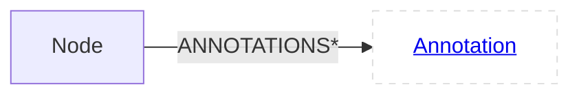
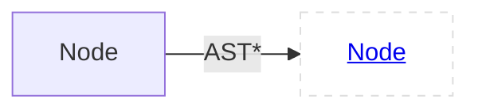
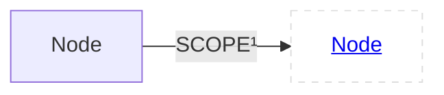
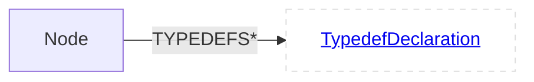
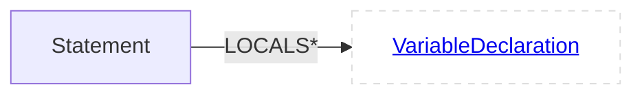
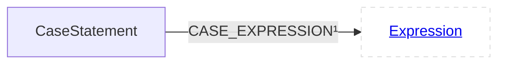
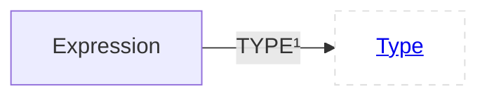
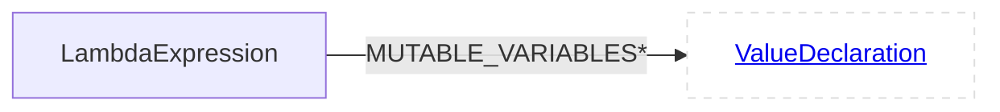
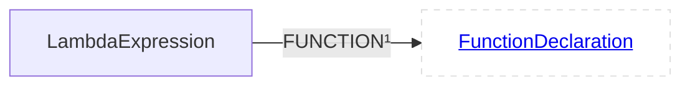
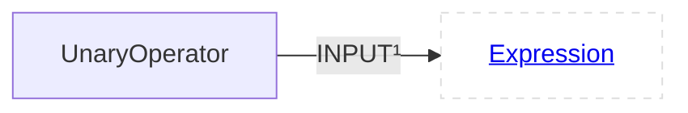

<style>.superclassLabel{background:#dddddd;border-radius:5%;line-height:26px;display:inline-block;text-align:center;margin-bottom:10px;padding-left:10px;padding-right:10px;}.classLabel{background:#aabbff;border-radius:5%;line-height:26px;display:inline-block;text-align:center;margin-bottom:10px;padding-left:10px;padding-right:10px;}.child{background:#dddddd;border-radius:5%;line-height:26px;display:inline-block;text-align:center;margin-bottom:10px;padding-left:10px;padding-right:10px;}.relationship{background:#aaffbb;border-radius:5%;line-height:26px;display:inline-block;text-align:center;margin-bottom:10px;padding-left:10px;padding-right:10px;}.inherited-relationship{background:#dddddd;border-radius:5%;line-height:26px;display:inline-block;text-align:center;margin-bottom:10px;padding-left:10px;padding-right:10px;}</style>

# CPG Schema
This file shows all node labels and relationships between them that are persisted from the in memory CPG to the Neo4j database. The specification is generated automatically and always up to date.
## Node<a id="enode"></a>
### Children
<span class="child">[Statement](#estatement)</span>
<span class="child">[Declaration](#edeclaration)</span>
<span class="child">[Type](#etype)</span>
<span class="child">[AnnotationMember](#eannotationmember)</span>
<span class="child">[Component](#ecomponent)</span>
<span class="child">[Annotation](#eannotation)</span>

### Relationships
<span class="relationship">[DFG](#NodeDFG)</span>

<span class="relationship">[EOG](#NodeEOG)</span>

<span class="relationship">[ANNOTATIONS](#NodeANNOTATIONS)</span>

<span class="relationship">[AST](#NodeAST)</span>

<span class="relationship">[SCOPE](#NodeSCOPE)</span>

<span class="relationship">[TYPEDEFS](#NodeTYPEDEFS)</span>

#### DFG<a id="NodeDFG"></a>

#### EOG<a id="NodeEOG"></a>

#### ANNOTATIONS<a id="NodeANNOTATIONS"></a>

#### AST<a id="NodeAST"></a>

#### SCOPE<a id="NodeSCOPE"></a>

#### TYPEDEFS<a id="NodeTYPEDEFS"></a>

## Statement<a id="estatement"></a>
**Labels**:<span class="superclassLabel">[Node](#enode)</span>
<span class="classLabel">[Statement](#estatement)</span>

### Children
<span class="child">[AssertStatement](#eassertstatement)</span>
<span class="child">[DoStatement](#edostatement)</span>
<span class="child">[CaseStatement](#ecasestatement)</span>
<span class="child">[ReturnStatement](#ereturnstatement)</span>
<span class="child">[Expression](#eexpression)</span>
<span class="child">[IfStatement](#eifstatement)</span>
<span class="child">[DeclarationStatement](#edeclarationstatement)</span>
<span class="child">[ForStatement](#eforstatement)</span>
<span class="child">[CatchClause](#ecatchclause)</span>
<span class="child">[SwitchStatement](#eswitchstatement)</span>
<span class="child">[GotoStatement](#egotostatement)</span>
<span class="child">[WhileStatement](#ewhilestatement)</span>
<span class="child">[BlockStatement](#ecompoundstatement)</span>
<span class="child">[ContinueStatement](#econtinuestatement)</span>
<span class="child">[DefaultStatement](#edefaultstatement)</span>
<span class="child">[SynchronizedStatement](#esynchronizedstatement)</span>
<span class="child">[TryStatement](#etrystatement)</span>
<span class="child">[ForEachStatement](#eforeachstatement)</span>
<span class="child">[LabelStatement](#elabelstatement)</span>
<span class="child">[BreakStatement](#ebreakstatement)</span>
<span class="child">[EmptyStatement](#eemptystatement)</span>

### Relationships
<span class="relationship">[LOCALS](#StatementLOCALS)</span>

<span class="inherited-relationship">[DFG](#NodeDFG)</span>

<span class="inherited-relationship">[EOG](#NodeEOG)</span>

<span class="inherited-relationship">[ANNOTATIONS](#NodeANNOTATIONS)</span>

<span class="inherited-relationship">[AST](#NodeAST)</span>

<span class="inherited-relationship">[SCOPE](#NodeSCOPE)</span>

<span class="inherited-relationship">[TYPEDEFS](#NodeTYPEDEFS)</span>

#### LOCALS<a id="StatementLOCALS"></a>

## AssertStatement<a id="eassertstatement"></a>
**Labels**:<span class="superclassLabel">[Node](#enode)</span>
<span class="superclassLabel">[Statement](#estatement)</span>
<span class="classLabel">[AssertStatement](#eassertstatement)</span>

### Relationships
<span class="relationship">[CONDITION](#AssertStatementCONDITION)</span>

<span class="relationship">[MESSAGE](#AssertStatementMESSAGE)</span>

<span class="inherited-relationship">[LOCALS](#StatementLOCALS)</span>

<span class="inherited-relationship">[DFG](#NodeDFG)</span>

<span class="inherited-relationship">[EOG](#NodeEOG)</span>

<span class="inherited-relationship">[ANNOTATIONS](#NodeANNOTATIONS)</span>

<span class="inherited-relationship">[AST](#NodeAST)</span>

<span class="inherited-relationship">[SCOPE](#NodeSCOPE)</span>

<span class="inherited-relationship">[TYPEDEFS](#NodeTYPEDEFS)</span>

#### CONDITION<a id="AssertStatementCONDITION"></a>

#### MESSAGE<a id="AssertStatementMESSAGE"></a>

## DoStatement<a id="edostatement"></a>
**Labels**:<span class="superclassLabel">[Node](#enode)</span>
<span class="superclassLabel">[Statement](#estatement)</span>
<span class="classLabel">[DoStatement](#edostatement)</span>

### Relationships
<span class="relationship">[CONDITION](#DoStatementCONDITION)</span>

<span class="relationship">[STATEMENT](#DoStatementSTATEMENT)</span>

<span class="inherited-relationship">[LOCALS](#StatementLOCALS)</span>

<span class="inherited-relationship">[DFG](#NodeDFG)</span>

<span class="inherited-relationship">[EOG](#NodeEOG)</span>

<span class="inherited-relationship">[ANNOTATIONS](#NodeANNOTATIONS)</span>

<span class="inherited-relationship">[AST](#NodeAST)</span>

<span class="inherited-relationship">[SCOPE](#NodeSCOPE)</span>

<span class="inherited-relationship">[TYPEDEFS](#NodeTYPEDEFS)</span>

#### CONDITION<a id="DoStatementCONDITION"></a>

#### STATEMENT<a id="DoStatementSTATEMENT"></a>

## CaseStatement<a id="ecasestatement"></a>
**Labels**:<span class="superclassLabel">[Node](#enode)</span>
<span class="superclassLabel">[Statement](#estatement)</span>
<span class="classLabel">[CaseStatement](#ecasestatement)</span>

### Relationships
<span class="relationship">[CASE_EXPRESSION](#CaseStatementCASE_EXPRESSION)</span>

<span class="inherited-relationship">[LOCALS](#StatementLOCALS)</span>

<span class="inherited-relationship">[DFG](#NodeDFG)</span>

<span class="inherited-relationship">[EOG](#NodeEOG)</span>

<span class="inherited-relationship">[ANNOTATIONS](#NodeANNOTATIONS)</span>

<span class="inherited-relationship">[AST](#NodeAST)</span>

<span class="inherited-relationship">[SCOPE](#NodeSCOPE)</span>

<span class="inherited-relationship">[TYPEDEFS](#NodeTYPEDEFS)</span>

#### CASE_EXPRESSION<a id="CaseStatementCASE_EXPRESSION"></a>

## ReturnStatement<a id="ereturnstatement"></a>
**Labels**:<span class="superclassLabel">[Node](#enode)</span>
<span class="superclassLabel">[Statement](#estatement)</span>
<span class="classLabel">[ReturnStatement](#ereturnstatement)</span>

### Relationships
<span class="relationship">[RETURN_VALUES](#ReturnStatementRETURN_VALUES)</span>

<span class="inherited-relationship">[LOCALS](#StatementLOCALS)</span>

<span class="inherited-relationship">[DFG](#NodeDFG)</span>

<span class="inherited-relationship">[EOG](#NodeEOG)</span>

<span class="inherited-relationship">[ANNOTATIONS](#NodeANNOTATIONS)</span>

<span class="inherited-relationship">[AST](#NodeAST)</span>

<span class="inherited-relationship">[SCOPE](#NodeSCOPE)</span>

<span class="inherited-relationship">[TYPEDEFS](#NodeTYPEDEFS)</span>

#### RETURN_VALUES<a id="ReturnStatementRETURN_VALUES"></a>

## Expression<a id="eexpression"></a>
**Labels**:<span class="superclassLabel">[Node](#enode)</span>
<span class="superclassLabel">[Statement](#estatement)</span>
<span class="classLabel">[Expression](#eexpression)</span>

### Children
<span class="child">[NewExpression](#enewexpression)</span>
<span class="child">[LambdaExpression](#elambdaexpression)</span>
<span class="child">[UnaryOperator](#eunaryoperator)</span>
<span class="child">[ArrayRangeExpression](#earrayrangeexpression)</span>
<span class="child">[CallExpression](#ecallexpression)</span>
<span class="child">[DesignatedInitializerExpression](#edesignatedinitializerexpression)</span>
<span class="child">[KeyValueExpression](#ekeyvalueexpression)</span>
<span class="child">[AssignExpression](#eassignexpression)</span>
<span class="child">[CastExpression](#ecastexpression)</span>
<span class="child">[NewArrayExpression](#earraycreationexpression)</span>
<span class="child">[SubscriptionExpression](#earraysubscriptionexpression)</span>
<span class="child">[TypeExpression](#etypeexpression)</span>
<span class="child">[BinaryOperator](#ebinaryoperator)</span>
<span class="child">[ConditionalExpression](#econditionalexpression)</span>
<span class="child">[Reference](#edeclaredreferenceexpression)</span>
<span class="child">[InitializerListExpression](#einitializerlistexpression)</span>
<span class="child">[DeleteExpression](#edeleteexpression)</span>
<span class="child">[BlockStatementExpression](#ecompoundstatementexpression)</span>
<span class="child">[ProblemExpression](#eproblemexpression)</span>
<span class="child">[Literal](#eliteral)</span>
<span class="child">[TypeIdExpression](#etypeidexpression)</span>
<span class="child">[ExpressionList](#eexpressionlist)</span>

### Relationships
<span class="relationship">[POSSIBLE_SUB_TYPES](#ExpressionPOSSIBLE_SUB_TYPES)</span>

<span class="relationship">[TYPE](#ExpressionTYPE)</span>

<span class="inherited-relationship">[LOCALS](#StatementLOCALS)</span>

<span class="inherited-relationship">[DFG](#NodeDFG)</span>

<span class="inherited-relationship">[EOG](#NodeEOG)</span>

<span class="inherited-relationship">[ANNOTATIONS](#NodeANNOTATIONS)</span>

<span class="inherited-relationship">[AST](#NodeAST)</span>

<span class="inherited-relationship">[SCOPE](#NodeSCOPE)</span>

<span class="inherited-relationship">[TYPEDEFS](#NodeTYPEDEFS)</span>

#### POSSIBLE_SUB_TYPES<a id="ExpressionPOSSIBLE_SUB_TYPES"></a>

#### TYPE<a id="ExpressionTYPE"></a>

## NewExpression<a id="enewexpression"></a>
**Labels**:<span class="superclassLabel">[Node](#enode)</span>
<span class="superclassLabel">[Statement](#estatement)</span>
<span class="superclassLabel">[Expression](#eexpression)</span>
<span class="classLabel">[NewExpression](#enewexpression)</span>

### Relationships
<span class="relationship">[INITIALIZER](#NewExpressionINITIALIZER)</span>

<span class="relationship">[TEMPLATE_PARAMETERS](#NewExpressionTEMPLATE_PARAMETERS)</span>

<span class="inherited-relationship">[POSSIBLE_SUB_TYPES](#ExpressionPOSSIBLE_SUB_TYPES)</span>

<span class="inherited-relationship">[TYPE](#ExpressionTYPE)</span>

<span class="inherited-relationship">[LOCALS](#StatementLOCALS)</span>

<span class="inherited-relationship">[DFG](#NodeDFG)</span>

<span class="inherited-relationship">[EOG](#NodeEOG)</span>

<span class="inherited-relationship">[ANNOTATIONS](#NodeANNOTATIONS)</span>

<span class="inherited-relationship">[AST](#NodeAST)</span>

<span class="inherited-relationship">[SCOPE](#NodeSCOPE)</span>

<span class="inherited-relationship">[TYPEDEFS](#NodeTYPEDEFS)</span>

#### INITIALIZER<a id="NewExpressionINITIALIZER"></a>

#### TEMPLATE_PARAMETERS<a id="NewExpressionTEMPLATE_PARAMETERS"></a>

## LambdaExpression<a id="elambdaexpression"></a>
**Labels**:<span class="superclassLabel">[Node](#enode)</span>
<span class="superclassLabel">[Statement](#estatement)</span>
<span class="superclassLabel">[Expression](#eexpression)</span>
<span class="classLabel">[LambdaExpression](#elambdaexpression)</span>

### Relationships
<span class="relationship">[MUTABLE_VARIABLES](#LambdaExpressionMUTABLE_VARIABLES)</span>

<span class="relationship">[FUNCTION](#LambdaExpressionFUNCTION)</span>

<span class="inherited-relationship">[POSSIBLE_SUB_TYPES](#ExpressionPOSSIBLE_SUB_TYPES)</span>

<span class="inherited-relationship">[TYPE](#ExpressionTYPE)</span>

<span class="inherited-relationship">[LOCALS](#StatementLOCALS)</span>

<span class="inherited-relationship">[DFG](#NodeDFG)</span>

<span class="inherited-relationship">[EOG](#NodeEOG)</span>

<span class="inherited-relationship">[ANNOTATIONS](#NodeANNOTATIONS)</span>

<span class="inherited-relationship">[AST](#NodeAST)</span>

<span class="inherited-relationship">[SCOPE](#NodeSCOPE)</span>

<span class="inherited-relationship">[TYPEDEFS](#NodeTYPEDEFS)</span>

#### MUTABLE_VARIABLES<a id="LambdaExpressionMUTABLE_VARIABLES"></a>

#### FUNCTION<a id="LambdaExpressionFUNCTION"></a>

## UnaryOperator<a id="eunaryoperator"></a>
**Labels**:<span class="superclassLabel">[Node](#enode)</span>
<span class="superclassLabel">[Statement](#estatement)</span>
<span class="superclassLabel">[Expression](#eexpression)</span>
<span class="classLabel">[UnaryOperator](#eunaryoperator)</span>

### Relationships
<span class="relationship">[INPUT](#UnaryOperatorINPUT)</span>

<span class="inherited-relationship">[POSSIBLE_SUB_TYPES](#ExpressionPOSSIBLE_SUB_TYPES)</span>

<span class="inherited-relationship">[TYPE](#ExpressionTYPE)</span>

<span class="inherited-relationship">[LOCALS](#StatementLOCALS)</span>

<span class="inherited-relationship">[DFG](#NodeDFG)</span>

<span class="inherited-relationship">[EOG](#NodeEOG)</span>

<span class="inherited-relationship">[ANNOTATIONS](#NodeANNOTATIONS)</span>

<span class="inherited-relationship">[AST](#NodeAST)</span>

<span class="inherited-relationship">[SCOPE](#NodeSCOPE)</span>

<span class="inherited-relationship">[TYPEDEFS](#NodeTYPEDEFS)</span>

#### INPUT<a id="UnaryOperatorINPUT"></a>

## ArrayRangeExpression<a id="earrayrangeexpression"></a>
**Labels**:<span class="superclassLabel">[Node](#enode)</span>
<span class="superclassLabel">[Statement](#estatement)</span>
<span class="superclassLabel">[Expression](#eexpression)</span>
<span class="classLabel">[ArrayRangeExpression](#earrayrangeexpression)</span>

### Relationships
<span class="relationship">[CEILING](#ArrayRangeExpressionCEILING)</span>

<span class="relationship">[STEP](#ArrayRangeExpressionSTEP)</span>

<span class="relationship">[FLOOR](#ArrayRangeExpressionFLOOR)</span>

<span class="inherited-relationship">[POSSIBLE_SUB_TYPES](#ExpressionPOSSIBLE_SUB_TYPES)</span>

<span class="inherited-relationship">[TYPE](#ExpressionTYPE)</span>

<span class="inherited-relationship">[LOCALS](#StatementLOCALS)</span>

<span class="inherited-relationship">[DFG](#NodeDFG)</span>

<span class="inherited-relationship">[EOG](#NodeEOG)</span>

<span class="inherited-relationship">[ANNOTATIONS](#NodeANNOTATIONS)</span>

<span class="inherited-relationship">[AST](#NodeAST)</span>

<span class="inherited-relationship">[SCOPE](#NodeSCOPE)</span>

<span class="inherited-relationship">[TYPEDEFS](#NodeTYPEDEFS)</span>

#### CEILING<a id="ArrayRangeExpressionCEILING"></a>
```mermaid
flowchart LR
  classDef outer fill:#fff,stroke:#ddd,stroke-dasharray:5 5;  classDef special fill:#afa,stroke:#5a5,stroke-dasharray:5 5;
ArrayRangeExpression--"CEILING¹"-->ArrayRangeExpressionCEILING[<a href='#eexpression'>Expression</a>]:::outer
```
#### STEP<a id="ArrayRangeExpressionSTEP"></a>
```mermaid
flowchart LR
  classDef outer fill:#fff,stroke:#ddd,stroke-dasharray:5 5;  classDef special fill:#afa,stroke:#5a5,stroke-dasharray:5 5;
ArrayRangeExpression--"STEP¹"-->ArrayRangeExpressionSTEP[<a href='#eexpression'>Expression</a>]:::outer
```
#### FLOOR<a id="ArrayRangeExpressionFLOOR"></a>
```mermaid
flowchart LR
  classDef outer fill:#fff,stroke:#ddd,stroke-dasharray:5 5;  classDef special fill:#afa,stroke:#5a5,stroke-dasharray:5 5;
ArrayRangeExpression--"FLOOR¹"-->ArrayRangeExpressionFLOOR[<a href='#eexpression'>Expression</a>]:::outer
```
## CallExpression<a id="ecallexpression"></a>
**Labels**:<span class="superclassLabel">[Node](#enode)</span>
<span class="superclassLabel">[Statement](#estatement)</span>
<span class="superclassLabel">[Expression](#eexpression)</span>
<span class="classLabel">[CallExpression](#ecallexpression)</span>

### Children
<span class="child">[ConstructorCallExpression](#eexplicitconstructorinvocation)</span>
<span class="child">[ConstructExpression](#econstructexpression)</span>
<span class="child">[MemberCallExpression](#emembercallexpression)</span>

### Relationships
<span class="relationship">[CALLEE](#CallExpressionCALLEE)</span>

<span class="relationship">[INVOKES](#CallExpressionINVOKES)</span>

<span class="relationship">[TEMPLATE_INSTANTIATION](#CallExpressionTEMPLATE_INSTANTIATION)</span>

<span class="relationship">[ARGUMENTS](#CallExpressionARGUMENTS)</span>

<span class="relationship">[TEMPLATE_PARAMETERS](#CallExpressionTEMPLATE_PARAMETERS)</span>

<span class="inherited-relationship">[POSSIBLE_SUB_TYPES](#ExpressionPOSSIBLE_SUB_TYPES)</span>

<span class="inherited-relationship">[TYPE](#ExpressionTYPE)</span>

<span class="inherited-relationship">[LOCALS](#StatementLOCALS)</span>

<span class="inherited-relationship">[DFG](#NodeDFG)</span>

<span class="inherited-relationship">[EOG](#NodeEOG)</span>

<span class="inherited-relationship">[ANNOTATIONS](#NodeANNOTATIONS)</span>

<span class="inherited-relationship">[AST](#NodeAST)</span>

<span class="inherited-relationship">[SCOPE](#NodeSCOPE)</span>

<span class="inherited-relationship">[TYPEDEFS](#NodeTYPEDEFS)</span>

#### CALLEE<a id="CallExpressionCALLEE"></a>
```mermaid
flowchart LR
  classDef outer fill:#fff,stroke:#ddd,stroke-dasharray:5 5;  classDef special fill:#afa,stroke:#5a5,stroke-dasharray:5 5;
CallExpression--"CALLEE¹"-->CallExpressionCALLEE[<a href='#eexpression'>Expression</a>]:::outer
```
#### INVOKES<a id="CallExpressionINVOKES"></a>
```mermaid
flowchart LR
  classDef outer fill:#fff,stroke:#ddd,stroke-dasharray:5 5;  classDef special fill:#afa,stroke:#5a5,stroke-dasharray:5 5;
CallExpression--"INVOKES*"-->CallExpressionINVOKES[<a href='#efunctiondeclaration'>FunctionDeclaration</a>]:::outer
```
#### TEMPLATE_INSTANTIATION<a id="CallExpressionTEMPLATE_INSTANTIATION"></a>
```mermaid
flowchart LR
  classDef outer fill:#fff,stroke:#ddd,stroke-dasharray:5 5;  classDef special fill:#afa,stroke:#5a5,stroke-dasharray:5 5;
CallExpression--"TEMPLATE_INSTANTIATION¹"-->CallExpressionTEMPLATE_INSTANTIATION[<a href='#etemplatedeclaration'>TemplateDeclaration</a>]:::outer
```
#### ARGUMENTS<a id="CallExpressionARGUMENTS"></a>
```mermaid
flowchart LR
  classDef outer fill:#fff,stroke:#ddd,stroke-dasharray:5 5;  classDef special fill:#afa,stroke:#5a5,stroke-dasharray:5 5;
CallExpression--"ARGUMENTS*"-->CallExpressionARGUMENTS[<a href='#eexpression'>Expression</a>]:::outer
```
#### TEMPLATE_PARAMETERS<a id="CallExpressionTEMPLATE_PARAMETERS"></a>
```mermaid
flowchart LR
  classDef outer fill:#fff,stroke:#ddd,stroke-dasharray:5 5;  classDef special fill:#afa,stroke:#5a5,stroke-dasharray:5 5;
CallExpression--"TEMPLATE_PARAMETERS*"-->CallExpressionTEMPLATE_PARAMETERS[<a href='#enode'>Node</a>]:::outer
```
## ConstructorCallExpression<a id="eexplicitconstructorinvocation"></a>
**Labels**:<span class="superclassLabel">[Node](#enode)</span>
<span class="superclassLabel">[Statement](#estatement)</span>
<span class="superclassLabel">[Expression](#eexpression)</span>
<span class="superclassLabel">[CallExpression](#ecallexpression)</span>
<span class="classLabel">[ConstructorCallExpression](#eexplicitconstructorinvocation)</span>

### Relationships
<span class="inherited-relationship">[CALLEE](#CallExpressionCALLEE)</span>

<span class="inherited-relationship">[INVOKES](#CallExpressionINVOKES)</span>

<span class="inherited-relationship">[TEMPLATE_INSTANTIATION](#CallExpressionTEMPLATE_INSTANTIATION)</span>

<span class="inherited-relationship">[ARGUMENTS](#CallExpressionARGUMENTS)</span>

<span class="inherited-relationship">[TEMPLATE_PARAMETERS](#CallExpressionTEMPLATE_PARAMETERS)</span>

<span class="inherited-relationship">[POSSIBLE_SUB_TYPES](#ExpressionPOSSIBLE_SUB_TYPES)</span>

<span class="inherited-relationship">[TYPE](#ExpressionTYPE)</span>

<span class="inherited-relationship">[LOCALS](#StatementLOCALS)</span>

<span class="inherited-relationship">[DFG](#NodeDFG)</span>

<span class="inherited-relationship">[EOG](#NodeEOG)</span>

<span class="inherited-relationship">[ANNOTATIONS](#NodeANNOTATIONS)</span>

<span class="inherited-relationship">[AST](#NodeAST)</span>

<span class="inherited-relationship">[SCOPE](#NodeSCOPE)</span>

<span class="inherited-relationship">[TYPEDEFS](#NodeTYPEDEFS)</span>

## ConstructExpression<a id="econstructexpression"></a>
**Labels**:<span class="superclassLabel">[Node](#enode)</span>
<span class="superclassLabel">[Statement](#estatement)</span>
<span class="superclassLabel">[Expression](#eexpression)</span>
<span class="superclassLabel">[CallExpression](#ecallexpression)</span>
<span class="classLabel">[ConstructExpression](#econstructexpression)</span>

### Relationships
<span class="relationship">[INSTANTIATES](#ConstructExpressionINSTANTIATES)</span>

<span class="relationship">[CONSTRUCTOR](#ConstructExpressionCONSTRUCTOR)</span>

<span class="relationship">[ANOYMOUS_CLASS](#ConstructExpressionANOYMOUS_CLASS)</span>

<span class="inherited-relationship">[CALLEE](#CallExpressionCALLEE)</span>

<span class="inherited-relationship">[INVOKES](#CallExpressionINVOKES)</span>

<span class="inherited-relationship">[TEMPLATE_INSTANTIATION](#CallExpressionTEMPLATE_INSTANTIATION)</span>

<span class="inherited-relationship">[ARGUMENTS](#CallExpressionARGUMENTS)</span>

<span class="inherited-relationship">[TEMPLATE_PARAMETERS](#CallExpressionTEMPLATE_PARAMETERS)</span>

<span class="inherited-relationship">[POSSIBLE_SUB_TYPES](#ExpressionPOSSIBLE_SUB_TYPES)</span>

<span class="inherited-relationship">[TYPE](#ExpressionTYPE)</span>

<span class="inherited-relationship">[LOCALS](#StatementLOCALS)</span>

<span class="inherited-relationship">[DFG](#NodeDFG)</span>

<span class="inherited-relationship">[EOG](#NodeEOG)</span>

<span class="inherited-relationship">[ANNOTATIONS](#NodeANNOTATIONS)</span>

<span class="inherited-relationship">[AST](#NodeAST)</span>

<span class="inherited-relationship">[SCOPE](#NodeSCOPE)</span>

<span class="inherited-relationship">[TYPEDEFS](#NodeTYPEDEFS)</span>

#### INSTANTIATES<a id="ConstructExpressionINSTANTIATES"></a>
```mermaid
flowchart LR
  classDef outer fill:#fff,stroke:#ddd,stroke-dasharray:5 5;  classDef special fill:#afa,stroke:#5a5,stroke-dasharray:5 5;
ConstructExpression--"INSTANTIATES¹"-->ConstructExpressionINSTANTIATES[<a href='#edeclaration'>Declaration</a>]:::outer
```
#### CONSTRUCTOR<a id="ConstructExpressionCONSTRUCTOR"></a>
```mermaid
flowchart LR
  classDef outer fill:#fff,stroke:#ddd,stroke-dasharray:5 5;  classDef special fill:#afa,stroke:#5a5,stroke-dasharray:5 5;
ConstructExpression--"CONSTRUCTOR¹"-->ConstructExpressionCONSTRUCTOR[<a href='#econstructordeclaration'>ConstructorDeclaration</a>]:::outer
```
#### ANOYMOUS_CLASS<a id="ConstructExpressionANOYMOUS_CLASS"></a>
```mermaid
flowchart LR
  classDef outer fill:#fff,stroke:#ddd,stroke-dasharray:5 5;  classDef special fill:#afa,stroke:#5a5,stroke-dasharray:5 5;
ConstructExpression--"ANOYMOUS_CLASS¹"-->ConstructExpressionANOYMOUS_CLASS[<a href='#erecorddeclaration'>RecordDeclaration</a>]:::outer
```
## MemberCallExpression<a id="emembercallexpression"></a>
**Labels**:<span class="superclassLabel">[Node](#enode)</span>
<span class="superclassLabel">[Statement](#estatement)</span>
<span class="superclassLabel">[Expression](#eexpression)</span>
<span class="superclassLabel">[CallExpression](#ecallexpression)</span>
<span class="classLabel">[MemberCallExpression](#emembercallexpression)</span>

### Relationships
<span class="inherited-relationship">[CALLEE](#CallExpressionCALLEE)</span>

<span class="inherited-relationship">[INVOKES](#CallExpressionINVOKES)</span>

<span class="inherited-relationship">[TEMPLATE_INSTANTIATION](#CallExpressionTEMPLATE_INSTANTIATION)</span>

<span class="inherited-relationship">[ARGUMENTS](#CallExpressionARGUMENTS)</span>

<span class="inherited-relationship">[TEMPLATE_PARAMETERS](#CallExpressionTEMPLATE_PARAMETERS)</span>

<span class="inherited-relationship">[POSSIBLE_SUB_TYPES](#ExpressionPOSSIBLE_SUB_TYPES)</span>

<span class="inherited-relationship">[TYPE](#ExpressionTYPE)</span>

<span class="inherited-relationship">[LOCALS](#StatementLOCALS)</span>

<span class="inherited-relationship">[DFG](#NodeDFG)</span>

<span class="inherited-relationship">[EOG](#NodeEOG)</span>

<span class="inherited-relationship">[ANNOTATIONS](#NodeANNOTATIONS)</span>

<span class="inherited-relationship">[AST](#NodeAST)</span>

<span class="inherited-relationship">[SCOPE](#NodeSCOPE)</span>

<span class="inherited-relationship">[TYPEDEFS](#NodeTYPEDEFS)</span>

## DesignatedInitializerExpression<a id="edesignatedinitializerexpression"></a>
**Labels**:<span class="superclassLabel">[Node](#enode)</span>
<span class="superclassLabel">[Statement](#estatement)</span>
<span class="superclassLabel">[Expression](#eexpression)</span>
<span class="classLabel">[DesignatedInitializerExpression](#edesignatedinitializerexpression)</span>

### Relationships
<span class="relationship">[LHS](#DesignatedInitializerExpressionLHS)</span>

<span class="relationship">[RHS](#DesignatedInitializerExpressionRHS)</span>

<span class="inherited-relationship">[POSSIBLE_SUB_TYPES](#ExpressionPOSSIBLE_SUB_TYPES)</span>

<span class="inherited-relationship">[TYPE](#ExpressionTYPE)</span>

<span class="inherited-relationship">[LOCALS](#StatementLOCALS)</span>

<span class="inherited-relationship">[DFG](#NodeDFG)</span>

<span class="inherited-relationship">[EOG](#NodeEOG)</span>

<span class="inherited-relationship">[ANNOTATIONS](#NodeANNOTATIONS)</span>

<span class="inherited-relationship">[AST](#NodeAST)</span>

<span class="inherited-relationship">[SCOPE](#NodeSCOPE)</span>

<span class="inherited-relationship">[TYPEDEFS](#NodeTYPEDEFS)</span>

#### LHS<a id="DesignatedInitializerExpressionLHS"></a>
```mermaid
flowchart LR
  classDef outer fill:#fff,stroke:#ddd,stroke-dasharray:5 5;  classDef special fill:#afa,stroke:#5a5,stroke-dasharray:5 5;
DesignatedInitializerExpression--"LHS*"-->DesignatedInitializerExpressionLHS[<a href='#eexpression'>Expression</a>]:::outer
```
#### RHS<a id="DesignatedInitializerExpressionRHS"></a>
```mermaid
flowchart LR
  classDef outer fill:#fff,stroke:#ddd,stroke-dasharray:5 5;  classDef special fill:#afa,stroke:#5a5,stroke-dasharray:5 5;
DesignatedInitializerExpression--"RHS¹"-->DesignatedInitializerExpressionRHS[<a href='#eexpression'>Expression</a>]:::outer
```
## KeyValueExpression<a id="ekeyvalueexpression"></a>
**Labels**:<span class="superclassLabel">[Node](#enode)</span>
<span class="superclassLabel">[Statement](#estatement)</span>
<span class="superclassLabel">[Expression](#eexpression)</span>
<span class="classLabel">[KeyValueExpression](#ekeyvalueexpression)</span>

### Relationships
<span class="relationship">[VALUE](#KeyValueExpressionVALUE)</span>

<span class="relationship">[KEY](#KeyValueExpressionKEY)</span>

<span class="inherited-relationship">[POSSIBLE_SUB_TYPES](#ExpressionPOSSIBLE_SUB_TYPES)</span>

<span class="inherited-relationship">[TYPE](#ExpressionTYPE)</span>

<span class="inherited-relationship">[LOCALS](#StatementLOCALS)</span>

<span class="inherited-relationship">[DFG](#NodeDFG)</span>

<span class="inherited-relationship">[EOG](#NodeEOG)</span>

<span class="inherited-relationship">[ANNOTATIONS](#NodeANNOTATIONS)</span>

<span class="inherited-relationship">[AST](#NodeAST)</span>

<span class="inherited-relationship">[SCOPE](#NodeSCOPE)</span>

<span class="inherited-relationship">[TYPEDEFS](#NodeTYPEDEFS)</span>

#### VALUE<a id="KeyValueExpressionVALUE"></a>
```mermaid
flowchart LR
  classDef outer fill:#fff,stroke:#ddd,stroke-dasharray:5 5;  classDef special fill:#afa,stroke:#5a5,stroke-dasharray:5 5;
KeyValueExpression--"VALUE¹"-->KeyValueExpressionVALUE[<a href='#eexpression'>Expression</a>]:::outer
```
#### KEY<a id="KeyValueExpressionKEY"></a>
```mermaid
flowchart LR
  classDef outer fill:#fff,stroke:#ddd,stroke-dasharray:5 5;  classDef special fill:#afa,stroke:#5a5,stroke-dasharray:5 5;
KeyValueExpression--"KEY¹"-->KeyValueExpressionKEY[<a href='#eexpression'>Expression</a>]:::outer
```
## AssignExpression<a id="eassignexpression"></a>
**Labels**:<span class="superclassLabel">[Node](#enode)</span>
<span class="superclassLabel">[Statement](#estatement)</span>
<span class="superclassLabel">[Expression](#eexpression)</span>
<span class="classLabel">[AssignExpression](#eassignexpression)</span>

### Relationships
<span class="relationship">[DECLARATIONS](#AssignExpressionDECLARATIONS)</span>

<span class="relationship">[LHS](#AssignExpressionLHS)</span>

<span class="relationship">[RHS](#AssignExpressionRHS)</span>

<span class="inherited-relationship">[POSSIBLE_SUB_TYPES](#ExpressionPOSSIBLE_SUB_TYPES)</span>

<span class="inherited-relationship">[TYPE](#ExpressionTYPE)</span>

<span class="inherited-relationship">[LOCALS](#StatementLOCALS)</span>

<span class="inherited-relationship">[DFG](#NodeDFG)</span>

<span class="inherited-relationship">[EOG](#NodeEOG)</span>

<span class="inherited-relationship">[ANNOTATIONS](#NodeANNOTATIONS)</span>

<span class="inherited-relationship">[AST](#NodeAST)</span>

<span class="inherited-relationship">[SCOPE](#NodeSCOPE)</span>

<span class="inherited-relationship">[TYPEDEFS](#NodeTYPEDEFS)</span>

#### DECLARATIONS<a id="AssignExpressionDECLARATIONS"></a>
```mermaid
flowchart LR
  classDef outer fill:#fff,stroke:#ddd,stroke-dasharray:5 5;  classDef special fill:#afa,stroke:#5a5,stroke-dasharray:5 5;
AssignExpression--"DECLARATIONS*"-->AssignExpressionDECLARATIONS[<a href='#evariabledeclaration'>VariableDeclaration</a>]:::outer
```
#### LHS<a id="AssignExpressionLHS"></a>
```mermaid
flowchart LR
  classDef outer fill:#fff,stroke:#ddd,stroke-dasharray:5 5;  classDef special fill:#afa,stroke:#5a5,stroke-dasharray:5 5;
AssignExpression--"LHS*"-->AssignExpressionLHS[<a href='#eexpression'>Expression</a>]:::outer
```
#### RHS<a id="AssignExpressionRHS"></a>
```mermaid
flowchart LR
  classDef outer fill:#fff,stroke:#ddd,stroke-dasharray:5 5;  classDef special fill:#afa,stroke:#5a5,stroke-dasharray:5 5;
AssignExpression--"RHS*"-->AssignExpressionRHS[<a href='#eexpression'>Expression</a>]:::outer
```
## CastExpression<a id="ecastexpression"></a>
**Labels**:<span class="superclassLabel">[Node](#enode)</span>
<span class="superclassLabel">[Statement](#estatement)</span>
<span class="superclassLabel">[Expression](#eexpression)</span>
<span class="classLabel">[CastExpression](#ecastexpression)</span>

### Relationships
<span class="relationship">[CAST_TYPE](#CastExpressionCAST_TYPE)</span>

<span class="relationship">[EXPRESSION](#CastExpressionEXPRESSION)</span>

<span class="inherited-relationship">[POSSIBLE_SUB_TYPES](#ExpressionPOSSIBLE_SUB_TYPES)</span>

<span class="inherited-relationship">[TYPE](#ExpressionTYPE)</span>

<span class="inherited-relationship">[LOCALS](#StatementLOCALS)</span>

<span class="inherited-relationship">[DFG](#NodeDFG)</span>

<span class="inherited-relationship">[EOG](#NodeEOG)</span>

<span class="inherited-relationship">[ANNOTATIONS](#NodeANNOTATIONS)</span>

<span class="inherited-relationship">[AST](#NodeAST)</span>

<span class="inherited-relationship">[SCOPE](#NodeSCOPE)</span>

<span class="inherited-relationship">[TYPEDEFS](#NodeTYPEDEFS)</span>

#### CAST_TYPE<a id="CastExpressionCAST_TYPE"></a>
```mermaid
flowchart LR
  classDef outer fill:#fff,stroke:#ddd,stroke-dasharray:5 5;  classDef special fill:#afa,stroke:#5a5,stroke-dasharray:5 5;
CastExpression--"CAST_TYPE¹"-->CastExpressionCAST_TYPE[<a href='#etype'>Type</a>]:::outer
```
#### EXPRESSION<a id="CastExpressionEXPRESSION"></a>
```mermaid
flowchart LR
  classDef outer fill:#fff,stroke:#ddd,stroke-dasharray:5 5;  classDef special fill:#afa,stroke:#5a5,stroke-dasharray:5 5;
CastExpression--"EXPRESSION¹"-->CastExpressionEXPRESSION[<a href='#eexpression'>Expression</a>]:::outer
```
## NewArrayExpression<a id="earraycreationexpression"></a>
**Labels**:<span class="superclassLabel">[Node](#enode)</span>
<span class="superclassLabel">[Statement](#estatement)</span>
<span class="superclassLabel">[Expression](#eexpression)</span>
<span class="classLabel">[NewArrayExpression](#earraycreationexpression)</span>

### Relationships
<span class="relationship">[INITIALIZER](#NewArrayExpressionINITIALIZER)</span>

<span class="relationship">[DIMENSIONS](#NewArrayExpressionDIMENSIONS)</span>

<span class="inherited-relationship">[POSSIBLE_SUB_TYPES](#ExpressionPOSSIBLE_SUB_TYPES)</span>

<span class="inherited-relationship">[TYPE](#ExpressionTYPE)</span>

<span class="inherited-relationship">[LOCALS](#StatementLOCALS)</span>

<span class="inherited-relationship">[DFG](#NodeDFG)</span>

<span class="inherited-relationship">[EOG](#NodeEOG)</span>

<span class="inherited-relationship">[ANNOTATIONS](#NodeANNOTATIONS)</span>

<span class="inherited-relationship">[AST](#NodeAST)</span>

<span class="inherited-relationship">[SCOPE](#NodeSCOPE)</span>

<span class="inherited-relationship">[TYPEDEFS](#NodeTYPEDEFS)</span>

#### INITIALIZER<a id="NewArrayExpressionINITIALIZER"></a>
```mermaid
flowchart LR
  classDef outer fill:#fff,stroke:#ddd,stroke-dasharray:5 5;  classDef special fill:#afa,stroke:#5a5,stroke-dasharray:5 5;
NewArrayExpression--"INITIALIZER¹"-->NewArrayExpressionINITIALIZER[<a href='#eexpression'>Expression</a>]:::outer
```
#### DIMENSIONS<a id="NewArrayExpressionDIMENSIONS"></a>
```mermaid
flowchart LR
  classDef outer fill:#fff,stroke:#ddd,stroke-dasharray:5 5;  classDef special fill:#afa,stroke:#5a5,stroke-dasharray:5 5;
NewArrayExpression--"DIMENSIONS*"-->NewArrayExpressionDIMENSIONS[<a href='#eexpression'>Expression</a>]:::outer
```
## SubscriptionExpression<a id="earraysubscriptionexpression"></a>
**Labels**:<span class="superclassLabel">[Node](#enode)</span>
<span class="superclassLabel">[Statement](#estatement)</span>
<span class="superclassLabel">[Expression](#eexpression)</span>
<span class="classLabel">[SubscriptionExpression](#earraysubscriptionexpression)</span>

### Relationships
<span class="relationship">[ARRAY_EXPRESSION](#SubscriptionExpressionARRAY_EXPRESSION)</span>

<span class="relationship">[SUBSCRIPT_EXPRESSION](#SubscriptionExpressionSUBSCRIPT_EXPRESSION)</span>

<span class="inherited-relationship">[POSSIBLE_SUB_TYPES](#ExpressionPOSSIBLE_SUB_TYPES)</span>

<span class="inherited-relationship">[TYPE](#ExpressionTYPE)</span>

<span class="inherited-relationship">[LOCALS](#StatementLOCALS)</span>

<span class="inherited-relationship">[DFG](#NodeDFG)</span>

<span class="inherited-relationship">[EOG](#NodeEOG)</span>

<span class="inherited-relationship">[ANNOTATIONS](#NodeANNOTATIONS)</span>

<span class="inherited-relationship">[AST](#NodeAST)</span>

<span class="inherited-relationship">[SCOPE](#NodeSCOPE)</span>

<span class="inherited-relationship">[TYPEDEFS](#NodeTYPEDEFS)</span>

#### ARRAY_EXPRESSION<a id="SubscriptionExpressionARRAY_EXPRESSION"></a>
```mermaid
flowchart LR
  classDef outer fill:#fff,stroke:#ddd,stroke-dasharray:5 5;  classDef special fill:#afa,stroke:#5a5,stroke-dasharray:5 5;
SubscriptionExpression--"ARRAY_EXPRESSION¹"-->SubscriptionExpressionARRAY_EXPRESSION[<a href='#eexpression'>Expression</a>]:::outer
```
#### SUBSCRIPT_EXPRESSION<a id="SubscriptionExpressionSUBSCRIPT_EXPRESSION"></a>
```mermaid
flowchart LR
  classDef outer fill:#fff,stroke:#ddd,stroke-dasharray:5 5;  classDef special fill:#afa,stroke:#5a5,stroke-dasharray:5 5;
SubscriptionExpression--"SUBSCRIPT_EXPRESSION¹"-->SubscriptionExpressionSUBSCRIPT_EXPRESSION[<a href='#eexpression'>Expression</a>]:::outer
```
## TypeExpression<a id="etypeexpression"></a>
**Labels**:<span class="superclassLabel">[Node](#enode)</span>
<span class="superclassLabel">[Statement](#estatement)</span>
<span class="superclassLabel">[Expression](#eexpression)</span>
<span class="classLabel">[TypeExpression](#etypeexpression)</span>

### Relationships
<span class="inherited-relationship">[POSSIBLE_SUB_TYPES](#ExpressionPOSSIBLE_SUB_TYPES)</span>

<span class="inherited-relationship">[TYPE](#ExpressionTYPE)</span>

<span class="inherited-relationship">[LOCALS](#StatementLOCALS)</span>

<span class="inherited-relationship">[DFG](#NodeDFG)</span>

<span class="inherited-relationship">[EOG](#NodeEOG)</span>

<span class="inherited-relationship">[ANNOTATIONS](#NodeANNOTATIONS)</span>

<span class="inherited-relationship">[AST](#NodeAST)</span>

<span class="inherited-relationship">[SCOPE](#NodeSCOPE)</span>

<span class="inherited-relationship">[TYPEDEFS](#NodeTYPEDEFS)</span>

## BinaryOperator<a id="ebinaryoperator"></a>
**Labels**:<span class="superclassLabel">[Node](#enode)</span>
<span class="superclassLabel">[Statement](#estatement)</span>
<span class="superclassLabel">[Expression](#eexpression)</span>
<span class="classLabel">[BinaryOperator](#ebinaryoperator)</span>

### Relationships
<span class="relationship">[LHS](#BinaryOperatorLHS)</span>

<span class="relationship">[RHS](#BinaryOperatorRHS)</span>

<span class="inherited-relationship">[POSSIBLE_SUB_TYPES](#ExpressionPOSSIBLE_SUB_TYPES)</span>

<span class="inherited-relationship">[TYPE](#ExpressionTYPE)</span>

<span class="inherited-relationship">[LOCALS](#StatementLOCALS)</span>

<span class="inherited-relationship">[DFG](#NodeDFG)</span>

<span class="inherited-relationship">[EOG](#NodeEOG)</span>

<span class="inherited-relationship">[ANNOTATIONS](#NodeANNOTATIONS)</span>

<span class="inherited-relationship">[AST](#NodeAST)</span>

<span class="inherited-relationship">[SCOPE](#NodeSCOPE)</span>

<span class="inherited-relationship">[TYPEDEFS](#NodeTYPEDEFS)</span>

#### LHS<a id="BinaryOperatorLHS"></a>
```mermaid
flowchart LR
  classDef outer fill:#fff,stroke:#ddd,stroke-dasharray:5 5;  classDef special fill:#afa,stroke:#5a5,stroke-dasharray:5 5;
BinaryOperator--"LHS¹"-->BinaryOperatorLHS[<a href='#eexpression'>Expression</a>]:::outer
```
#### RHS<a id="BinaryOperatorRHS"></a>
```mermaid
flowchart LR
  classDef outer fill:#fff,stroke:#ddd,stroke-dasharray:5 5;  classDef special fill:#afa,stroke:#5a5,stroke-dasharray:5 5;
BinaryOperator--"RHS¹"-->BinaryOperatorRHS[<a href='#eexpression'>Expression</a>]:::outer
```
## ConditionalExpression<a id="econditionalexpression"></a>
**Labels**:<span class="superclassLabel">[Node](#enode)</span>
<span class="superclassLabel">[Statement](#estatement)</span>
<span class="superclassLabel">[Expression](#eexpression)</span>
<span class="classLabel">[ConditionalExpression](#econditionalexpression)</span>

### Relationships
<span class="relationship">[ELSE_EXPR](#ConditionalExpressionELSE_EXPR)</span>

<span class="relationship">[THEN_EXPR](#ConditionalExpressionTHEN_EXPR)</span>

<span class="relationship">[CONDITION](#ConditionalExpressionCONDITION)</span>

<span class="inherited-relationship">[POSSIBLE_SUB_TYPES](#ExpressionPOSSIBLE_SUB_TYPES)</span>

<span class="inherited-relationship">[TYPE](#ExpressionTYPE)</span>

<span class="inherited-relationship">[LOCALS](#StatementLOCALS)</span>

<span class="inherited-relationship">[DFG](#NodeDFG)</span>

<span class="inherited-relationship">[EOG](#NodeEOG)</span>

<span class="inherited-relationship">[ANNOTATIONS](#NodeANNOTATIONS)</span>

<span class="inherited-relationship">[AST](#NodeAST)</span>

<span class="inherited-relationship">[SCOPE](#NodeSCOPE)</span>

<span class="inherited-relationship">[TYPEDEFS](#NodeTYPEDEFS)</span>

#### ELSE_EXPR<a id="ConditionalExpressionELSE_EXPR"></a>
```mermaid
flowchart LR
  classDef outer fill:#fff,stroke:#ddd,stroke-dasharray:5 5;  classDef special fill:#afa,stroke:#5a5,stroke-dasharray:5 5;
ConditionalExpression--"ELSE_EXPR¹"-->ConditionalExpressionELSE_EXPR[<a href='#eexpression'>Expression</a>]:::outer
```
#### THEN_EXPR<a id="ConditionalExpressionTHEN_EXPR"></a>
```mermaid
flowchart LR
  classDef outer fill:#fff,stroke:#ddd,stroke-dasharray:5 5;  classDef special fill:#afa,stroke:#5a5,stroke-dasharray:5 5;
ConditionalExpression--"THEN_EXPR¹"-->ConditionalExpressionTHEN_EXPR[<a href='#eexpression'>Expression</a>]:::outer
```
#### CONDITION<a id="ConditionalExpressionCONDITION"></a>
```mermaid
flowchart LR
  classDef outer fill:#fff,stroke:#ddd,stroke-dasharray:5 5;  classDef special fill:#afa,stroke:#5a5,stroke-dasharray:5 5;
ConditionalExpression--"CONDITION¹"-->ConditionalExpressionCONDITION[<a href='#eexpression'>Expression</a>]:::outer
```
## Reference<a id="edeclaredreferenceexpression"></a>
**Labels**:<span class="superclassLabel">[Node](#enode)</span>
<span class="superclassLabel">[Statement](#estatement)</span>
<span class="superclassLabel">[Expression](#eexpression)</span>
<span class="classLabel">[Reference](#edeclaredreferenceexpression)</span>

### Children
<span class="child">[MemberExpression](#ememberexpression)</span>

### Relationships
<span class="relationship">[REFERS_TO](#ReferenceREFERS_TO)</span>

<span class="inherited-relationship">[POSSIBLE_SUB_TYPES](#ExpressionPOSSIBLE_SUB_TYPES)</span>

<span class="inherited-relationship">[TYPE](#ExpressionTYPE)</span>

<span class="inherited-relationship">[LOCALS](#StatementLOCALS)</span>

<span class="inherited-relationship">[DFG](#NodeDFG)</span>

<span class="inherited-relationship">[EOG](#NodeEOG)</span>

<span class="inherited-relationship">[ANNOTATIONS](#NodeANNOTATIONS)</span>

<span class="inherited-relationship">[AST](#NodeAST)</span>

<span class="inherited-relationship">[SCOPE](#NodeSCOPE)</span>

<span class="inherited-relationship">[TYPEDEFS](#NodeTYPEDEFS)</span>

#### REFERS_TO<a id="ReferenceREFERS_TO"></a>
```mermaid
flowchart LR
  classDef outer fill:#fff,stroke:#ddd,stroke-dasharray:5 5;  classDef special fill:#afa,stroke:#5a5,stroke-dasharray:5 5;
Reference--"REFERS_TO¹"-->ReferenceREFERS_TO[<a href='#edeclaration'>Declaration</a>]:::outer
```
## MemberExpression<a id="ememberexpression"></a>
**Labels**:<span class="superclassLabel">[Node](#enode)</span>
<span class="superclassLabel">[Statement](#estatement)</span>
<span class="superclassLabel">[Expression](#eexpression)</span>
<span class="superclassLabel">[Reference](#edeclaredreferenceexpression)</span>
<span class="classLabel">[MemberExpression](#ememberexpression)</span>

### Relationships
<span class="relationship">[BASE](#MemberExpressionBASE)</span>

<span class="inherited-relationship">[REFERS_TO](#ReferenceREFERS_TO)</span>

<span class="inherited-relationship">[POSSIBLE_SUB_TYPES](#ExpressionPOSSIBLE_SUB_TYPES)</span>

<span class="inherited-relationship">[TYPE](#ExpressionTYPE)</span>

<span class="inherited-relationship">[LOCALS](#StatementLOCALS)</span>

<span class="inherited-relationship">[DFG](#NodeDFG)</span>

<span class="inherited-relationship">[EOG](#NodeEOG)</span>

<span class="inherited-relationship">[ANNOTATIONS](#NodeANNOTATIONS)</span>

<span class="inherited-relationship">[AST](#NodeAST)</span>

<span class="inherited-relationship">[SCOPE](#NodeSCOPE)</span>

<span class="inherited-relationship">[TYPEDEFS](#NodeTYPEDEFS)</span>

#### BASE<a id="MemberExpressionBASE"></a>
```mermaid
flowchart LR
  classDef outer fill:#fff,stroke:#ddd,stroke-dasharray:5 5;  classDef special fill:#afa,stroke:#5a5,stroke-dasharray:5 5;
MemberExpression--"BASE¹"-->MemberExpressionBASE[<a href='#eexpression'>Expression</a>]:::outer
```
## InitializerListExpression<a id="einitializerlistexpression"></a>
**Labels**:<span class="superclassLabel">[Node](#enode)</span>
<span class="superclassLabel">[Statement](#estatement)</span>
<span class="superclassLabel">[Expression](#eexpression)</span>
<span class="classLabel">[InitializerListExpression](#einitializerlistexpression)</span>

### Relationships
<span class="relationship">[INITIALIZERS](#InitializerListExpressionINITIALIZERS)</span>

<span class="inherited-relationship">[POSSIBLE_SUB_TYPES](#ExpressionPOSSIBLE_SUB_TYPES)</span>

<span class="inherited-relationship">[TYPE](#ExpressionTYPE)</span>

<span class="inherited-relationship">[LOCALS](#StatementLOCALS)</span>

<span class="inherited-relationship">[DFG](#NodeDFG)</span>

<span class="inherited-relationship">[EOG](#NodeEOG)</span>

<span class="inherited-relationship">[ANNOTATIONS](#NodeANNOTATIONS)</span>

<span class="inherited-relationship">[AST](#NodeAST)</span>

<span class="inherited-relationship">[SCOPE](#NodeSCOPE)</span>

<span class="inherited-relationship">[TYPEDEFS](#NodeTYPEDEFS)</span>

#### INITIALIZERS<a id="InitializerListExpressionINITIALIZERS"></a>
```mermaid
flowchart LR
  classDef outer fill:#fff,stroke:#ddd,stroke-dasharray:5 5;  classDef special fill:#afa,stroke:#5a5,stroke-dasharray:5 5;
InitializerListExpression--"INITIALIZERS*"-->InitializerListExpressionINITIALIZERS[<a href='#eexpression'>Expression</a>]:::outer
```
## DeleteExpression<a id="edeleteexpression"></a>
**Labels**:<span class="superclassLabel">[Node](#enode)</span>
<span class="superclassLabel">[Statement](#estatement)</span>
<span class="superclassLabel">[Expression](#eexpression)</span>
<span class="classLabel">[DeleteExpression](#edeleteexpression)</span>

### Relationships
<span class="relationship">[OPERAND](#DeleteExpressionOPERAND)</span>

<span class="inherited-relationship">[POSSIBLE_SUB_TYPES](#ExpressionPOSSIBLE_SUB_TYPES)</span>

<span class="inherited-relationship">[TYPE](#ExpressionTYPE)</span>

<span class="inherited-relationship">[LOCALS](#StatementLOCALS)</span>

<span class="inherited-relationship">[DFG](#NodeDFG)</span>

<span class="inherited-relationship">[EOG](#NodeEOG)</span>

<span class="inherited-relationship">[ANNOTATIONS](#NodeANNOTATIONS)</span>

<span class="inherited-relationship">[AST](#NodeAST)</span>

<span class="inherited-relationship">[SCOPE](#NodeSCOPE)</span>

<span class="inherited-relationship">[TYPEDEFS](#NodeTYPEDEFS)</span>

#### OPERAND<a id="DeleteExpressionOPERAND"></a>
```mermaid
flowchart LR
  classDef outer fill:#fff,stroke:#ddd,stroke-dasharray:5 5;  classDef special fill:#afa,stroke:#5a5,stroke-dasharray:5 5;
DeleteExpression--"OPERAND¹"-->DeleteExpressionOPERAND[<a href='#eexpression'>Expression</a>]:::outer
```
## BlockStatementExpression<a id="ecompoundstatementexpression"></a>
**Labels**:<span class="superclassLabel">[Node](#enode)</span>
<span class="superclassLabel">[Statement](#estatement)</span>
<span class="superclassLabel">[Expression](#eexpression)</span>
<span class="classLabel">[BlockStatementExpression](#ecompoundstatementexpression)</span>

### Relationships
<span class="relationship">[STATEMENT](#BlockStatementExpressionSTATEMENT)</span>

<span class="inherited-relationship">[POSSIBLE_SUB_TYPES](#ExpressionPOSSIBLE_SUB_TYPES)</span>

<span class="inherited-relationship">[TYPE](#ExpressionTYPE)</span>

<span class="inherited-relationship">[LOCALS](#StatementLOCALS)</span>

<span class="inherited-relationship">[DFG](#NodeDFG)</span>

<span class="inherited-relationship">[EOG](#NodeEOG)</span>

<span class="inherited-relationship">[ANNOTATIONS](#NodeANNOTATIONS)</span>

<span class="inherited-relationship">[AST](#NodeAST)</span>

<span class="inherited-relationship">[SCOPE](#NodeSCOPE)</span>

<span class="inherited-relationship">[TYPEDEFS](#NodeTYPEDEFS)</span>

#### STATEMENT<a id="BlockStatementExpressionSTATEMENT"></a>
```mermaid
flowchart LR
  classDef outer fill:#fff,stroke:#ddd,stroke-dasharray:5 5;  classDef special fill:#afa,stroke:#5a5,stroke-dasharray:5 5;
BlockStatementExpression--"STATEMENT¹"-->BlockStatementExpressionSTATEMENT[<a href='#estatement'>Statement</a>]:::outer
```
## ProblemExpression<a id="eproblemexpression"></a>
**Labels**:<span class="superclassLabel">[Node](#enode)</span>
<span class="superclassLabel">[Statement](#estatement)</span>
<span class="superclassLabel">[Expression](#eexpression)</span>
<span class="classLabel">[ProblemExpression](#eproblemexpression)</span>

### Relationships
<span class="inherited-relationship">[POSSIBLE_SUB_TYPES](#ExpressionPOSSIBLE_SUB_TYPES)</span>

<span class="inherited-relationship">[TYPE](#ExpressionTYPE)</span>

<span class="inherited-relationship">[LOCALS](#StatementLOCALS)</span>

<span class="inherited-relationship">[DFG](#NodeDFG)</span>

<span class="inherited-relationship">[EOG](#NodeEOG)</span>

<span class="inherited-relationship">[ANNOTATIONS](#NodeANNOTATIONS)</span>

<span class="inherited-relationship">[AST](#NodeAST)</span>

<span class="inherited-relationship">[SCOPE](#NodeSCOPE)</span>

<span class="inherited-relationship">[TYPEDEFS](#NodeTYPEDEFS)</span>

## Literal<a id="eliteral"></a>
**Labels**:<span class="superclassLabel">[Node](#enode)</span>
<span class="superclassLabel">[Statement](#estatement)</span>
<span class="superclassLabel">[Expression](#eexpression)</span>
<span class="classLabel">[Literal](#eliteral)</span>

### Relationships
<span class="inherited-relationship">[POSSIBLE_SUB_TYPES](#ExpressionPOSSIBLE_SUB_TYPES)</span>

<span class="inherited-relationship">[TYPE](#ExpressionTYPE)</span>

<span class="inherited-relationship">[LOCALS](#StatementLOCALS)</span>

<span class="inherited-relationship">[DFG](#NodeDFG)</span>

<span class="inherited-relationship">[EOG](#NodeEOG)</span>

<span class="inherited-relationship">[ANNOTATIONS](#NodeANNOTATIONS)</span>

<span class="inherited-relationship">[AST](#NodeAST)</span>

<span class="inherited-relationship">[SCOPE](#NodeSCOPE)</span>

<span class="inherited-relationship">[TYPEDEFS](#NodeTYPEDEFS)</span>

## TypeIdExpression<a id="etypeidexpression"></a>
**Labels**:<span class="superclassLabel">[Node](#enode)</span>
<span class="superclassLabel">[Statement](#estatement)</span>
<span class="superclassLabel">[Expression](#eexpression)</span>
<span class="classLabel">[TypeIdExpression](#etypeidexpression)</span>

### Relationships
<span class="relationship">[REFERENCED_TYPE](#TypeIdExpressionREFERENCED_TYPE)</span>

<span class="inherited-relationship">[POSSIBLE_SUB_TYPES](#ExpressionPOSSIBLE_SUB_TYPES)</span>

<span class="inherited-relationship">[TYPE](#ExpressionTYPE)</span>

<span class="inherited-relationship">[LOCALS](#StatementLOCALS)</span>

<span class="inherited-relationship">[DFG](#NodeDFG)</span>

<span class="inherited-relationship">[EOG](#NodeEOG)</span>

<span class="inherited-relationship">[ANNOTATIONS](#NodeANNOTATIONS)</span>

<span class="inherited-relationship">[AST](#NodeAST)</span>

<span class="inherited-relationship">[SCOPE](#NodeSCOPE)</span>

<span class="inherited-relationship">[TYPEDEFS](#NodeTYPEDEFS)</span>

#### REFERENCED_TYPE<a id="TypeIdExpressionREFERENCED_TYPE"></a>
```mermaid
flowchart LR
  classDef outer fill:#fff,stroke:#ddd,stroke-dasharray:5 5;  classDef special fill:#afa,stroke:#5a5,stroke-dasharray:5 5;
TypeIdExpression--"REFERENCED_TYPE¹"-->TypeIdExpressionREFERENCED_TYPE[<a href='#etype'>Type</a>]:::outer
```
## ExpressionList<a id="eexpressionlist"></a>
**Labels**:<span class="superclassLabel">[Node](#enode)</span>
<span class="superclassLabel">[Statement](#estatement)</span>
<span class="superclassLabel">[Expression](#eexpression)</span>
<span class="classLabel">[ExpressionList](#eexpressionlist)</span>

### Relationships
<span class="relationship">[SUBEXPR](#ExpressionListSUBEXPR)</span>

<span class="inherited-relationship">[POSSIBLE_SUB_TYPES](#ExpressionPOSSIBLE_SUB_TYPES)</span>

<span class="inherited-relationship">[TYPE](#ExpressionTYPE)</span>

<span class="inherited-relationship">[LOCALS](#StatementLOCALS)</span>

<span class="inherited-relationship">[DFG](#NodeDFG)</span>

<span class="inherited-relationship">[EOG](#NodeEOG)</span>

<span class="inherited-relationship">[ANNOTATIONS](#NodeANNOTATIONS)</span>

<span class="inherited-relationship">[AST](#NodeAST)</span>

<span class="inherited-relationship">[SCOPE](#NodeSCOPE)</span>

<span class="inherited-relationship">[TYPEDEFS](#NodeTYPEDEFS)</span>

#### SUBEXPR<a id="ExpressionListSUBEXPR"></a>
```mermaid
flowchart LR
  classDef outer fill:#fff,stroke:#ddd,stroke-dasharray:5 5;  classDef special fill:#afa,stroke:#5a5,stroke-dasharray:5 5;
ExpressionList--"SUBEXPR*"-->ExpressionListSUBEXPR[<a href='#estatement'>Statement</a>]:::outer
```
## IfStatement<a id="eifstatement"></a>
**Labels**:<span class="superclassLabel">[Node](#enode)</span>
<span class="superclassLabel">[Statement](#estatement)</span>
<span class="classLabel">[IfStatement](#eifstatement)</span>

### Relationships
<span class="relationship">[CONDITION_DECLARATION](#IfStatementCONDITION_DECLARATION)</span>

<span class="relationship">[INITIALIZER_STATEMENT](#IfStatementINITIALIZER_STATEMENT)</span>

<span class="relationship">[THEN_STATEMENT](#IfStatementTHEN_STATEMENT)</span>

<span class="relationship">[CONDITION](#IfStatementCONDITION)</span>

<span class="relationship">[ELSE_STATEMENT](#IfStatementELSE_STATEMENT)</span>

<span class="inherited-relationship">[LOCALS](#StatementLOCALS)</span>

<span class="inherited-relationship">[DFG](#NodeDFG)</span>

<span class="inherited-relationship">[EOG](#NodeEOG)</span>

<span class="inherited-relationship">[ANNOTATIONS](#NodeANNOTATIONS)</span>

<span class="inherited-relationship">[AST](#NodeAST)</span>

<span class="inherited-relationship">[SCOPE](#NodeSCOPE)</span>

<span class="inherited-relationship">[TYPEDEFS](#NodeTYPEDEFS)</span>

#### CONDITION_DECLARATION<a id="IfStatementCONDITION_DECLARATION"></a>
```mermaid
flowchart LR
  classDef outer fill:#fff,stroke:#ddd,stroke-dasharray:5 5;  classDef special fill:#afa,stroke:#5a5,stroke-dasharray:5 5;
IfStatement--"CONDITION_DECLARATION¹"-->IfStatementCONDITION_DECLARATION[<a href='#edeclaration'>Declaration</a>]:::outer
```
#### INITIALIZER_STATEMENT<a id="IfStatementINITIALIZER_STATEMENT"></a>
```mermaid
flowchart LR
  classDef outer fill:#fff,stroke:#ddd,stroke-dasharray:5 5;  classDef special fill:#afa,stroke:#5a5,stroke-dasharray:5 5;
IfStatement--"INITIALIZER_STATEMENT¹"-->IfStatementINITIALIZER_STATEMENT[<a href='#estatement'>Statement</a>]:::outer
```
#### THEN_STATEMENT<a id="IfStatementTHEN_STATEMENT"></a>
```mermaid
flowchart LR
  classDef outer fill:#fff,stroke:#ddd,stroke-dasharray:5 5;  classDef special fill:#afa,stroke:#5a5,stroke-dasharray:5 5;
IfStatement--"THEN_STATEMENT¹"-->IfStatementTHEN_STATEMENT[<a href='#estatement'>Statement</a>]:::outer
```
#### CONDITION<a id="IfStatementCONDITION"></a>
```mermaid
flowchart LR
  classDef outer fill:#fff,stroke:#ddd,stroke-dasharray:5 5;  classDef special fill:#afa,stroke:#5a5,stroke-dasharray:5 5;
IfStatement--"CONDITION¹"-->IfStatementCONDITION[<a href='#eexpression'>Expression</a>]:::outer
```
#### ELSE_STATEMENT<a id="IfStatementELSE_STATEMENT"></a>
```mermaid
flowchart LR
  classDef outer fill:#fff,stroke:#ddd,stroke-dasharray:5 5;  classDef special fill:#afa,stroke:#5a5,stroke-dasharray:5 5;
IfStatement--"ELSE_STATEMENT¹"-->IfStatementELSE_STATEMENT[<a href='#estatement'>Statement</a>]:::outer
```
## DeclarationStatement<a id="edeclarationstatement"></a>
**Labels**:<span class="superclassLabel">[Node](#enode)</span>
<span class="superclassLabel">[Statement](#estatement)</span>
<span class="classLabel">[DeclarationStatement](#edeclarationstatement)</span>

### Children
<span class="child">[ASMDeclarationStatement](#easmdeclarationstatement)</span>

### Relationships
<span class="relationship">[DECLARATIONS](#DeclarationStatementDECLARATIONS)</span>

<span class="inherited-relationship">[LOCALS](#StatementLOCALS)</span>

<span class="inherited-relationship">[DFG](#NodeDFG)</span>

<span class="inherited-relationship">[EOG](#NodeEOG)</span>

<span class="inherited-relationship">[ANNOTATIONS](#NodeANNOTATIONS)</span>

<span class="inherited-relationship">[AST](#NodeAST)</span>

<span class="inherited-relationship">[SCOPE](#NodeSCOPE)</span>

<span class="inherited-relationship">[TYPEDEFS](#NodeTYPEDEFS)</span>

#### DECLARATIONS<a id="DeclarationStatementDECLARATIONS"></a>
```mermaid
flowchart LR
  classDef outer fill:#fff,stroke:#ddd,stroke-dasharray:5 5;  classDef special fill:#afa,stroke:#5a5,stroke-dasharray:5 5;
DeclarationStatement--"DECLARATIONS*"-->DeclarationStatementDECLARATIONS[<a href='#edeclaration'>Declaration</a>]:::outer
```
## ASMDeclarationStatement<a id="easmdeclarationstatement"></a>
**Labels**:<span class="superclassLabel">[Node](#enode)</span>
<span class="superclassLabel">[Statement](#estatement)</span>
<span class="superclassLabel">[DeclarationStatement](#edeclarationstatement)</span>
<span class="classLabel">[ASMDeclarationStatement](#easmdeclarationstatement)</span>

### Relationships
<span class="inherited-relationship">[DECLARATIONS](#DeclarationStatementDECLARATIONS)</span>

<span class="inherited-relationship">[LOCALS](#StatementLOCALS)</span>

<span class="inherited-relationship">[DFG](#NodeDFG)</span>

<span class="inherited-relationship">[EOG](#NodeEOG)</span>

<span class="inherited-relationship">[ANNOTATIONS](#NodeANNOTATIONS)</span>

<span class="inherited-relationship">[AST](#NodeAST)</span>

<span class="inherited-relationship">[SCOPE](#NodeSCOPE)</span>

<span class="inherited-relationship">[TYPEDEFS](#NodeTYPEDEFS)</span>

## ForStatement<a id="eforstatement"></a>
**Labels**:<span class="superclassLabel">[Node](#enode)</span>
<span class="superclassLabel">[Statement](#estatement)</span>
<span class="classLabel">[ForStatement](#eforstatement)</span>

### Relationships
<span class="relationship">[CONDITION_DECLARATION](#ForStatementCONDITION_DECLARATION)</span>

<span class="relationship">[INITIALIZER_STATEMENT](#ForStatementINITIALIZER_STATEMENT)</span>

<span class="relationship">[ITERATION_STATEMENT](#ForStatementITERATION_STATEMENT)</span>

<span class="relationship">[CONDITION](#ForStatementCONDITION)</span>

<span class="relationship">[STATEMENT](#ForStatementSTATEMENT)</span>

<span class="inherited-relationship">[LOCALS](#StatementLOCALS)</span>

<span class="inherited-relationship">[DFG](#NodeDFG)</span>

<span class="inherited-relationship">[EOG](#NodeEOG)</span>

<span class="inherited-relationship">[ANNOTATIONS](#NodeANNOTATIONS)</span>

<span class="inherited-relationship">[AST](#NodeAST)</span>

<span class="inherited-relationship">[SCOPE](#NodeSCOPE)</span>

<span class="inherited-relationship">[TYPEDEFS](#NodeTYPEDEFS)</span>

#### CONDITION_DECLARATION<a id="ForStatementCONDITION_DECLARATION"></a>
```mermaid
flowchart LR
  classDef outer fill:#fff,stroke:#ddd,stroke-dasharray:5 5;  classDef special fill:#afa,stroke:#5a5,stroke-dasharray:5 5;
ForStatement--"CONDITION_DECLARATION¹"-->ForStatementCONDITION_DECLARATION[<a href='#edeclaration'>Declaration</a>]:::outer
```
#### INITIALIZER_STATEMENT<a id="ForStatementINITIALIZER_STATEMENT"></a>
```mermaid
flowchart LR
  classDef outer fill:#fff,stroke:#ddd,stroke-dasharray:5 5;  classDef special fill:#afa,stroke:#5a5,stroke-dasharray:5 5;
ForStatement--"INITIALIZER_STATEMENT¹"-->ForStatementINITIALIZER_STATEMENT[<a href='#estatement'>Statement</a>]:::outer
```
#### ITERATION_STATEMENT<a id="ForStatementITERATION_STATEMENT"></a>
```mermaid
flowchart LR
  classDef outer fill:#fff,stroke:#ddd,stroke-dasharray:5 5;  classDef special fill:#afa,stroke:#5a5,stroke-dasharray:5 5;
ForStatement--"ITERATION_STATEMENT¹"-->ForStatementITERATION_STATEMENT[<a href='#estatement'>Statement</a>]:::outer
```
#### CONDITION<a id="ForStatementCONDITION"></a>
```mermaid
flowchart LR
  classDef outer fill:#fff,stroke:#ddd,stroke-dasharray:5 5;  classDef special fill:#afa,stroke:#5a5,stroke-dasharray:5 5;
ForStatement--"CONDITION¹"-->ForStatementCONDITION[<a href='#eexpression'>Expression</a>]:::outer
```
#### STATEMENT<a id="ForStatementSTATEMENT"></a>
```mermaid
flowchart LR
  classDef outer fill:#fff,stroke:#ddd,stroke-dasharray:5 5;  classDef special fill:#afa,stroke:#5a5,stroke-dasharray:5 5;
ForStatement--"STATEMENT¹"-->ForStatementSTATEMENT[<a href='#estatement'>Statement</a>]:::outer
```
## CatchClause<a id="ecatchclause"></a>
**Labels**:<span class="superclassLabel">[Node](#enode)</span>
<span class="superclassLabel">[Statement](#estatement)</span>
<span class="classLabel">[CatchClause](#ecatchclause)</span>

### Relationships
<span class="relationship">[PARAMETER](#CatchClausePARAMETER)</span>

<span class="relationship">[BODY](#CatchClauseBODY)</span>

<span class="inherited-relationship">[LOCALS](#StatementLOCALS)</span>

<span class="inherited-relationship">[DFG](#NodeDFG)</span>

<span class="inherited-relationship">[EOG](#NodeEOG)</span>

<span class="inherited-relationship">[ANNOTATIONS](#NodeANNOTATIONS)</span>

<span class="inherited-relationship">[AST](#NodeAST)</span>

<span class="inherited-relationship">[SCOPE](#NodeSCOPE)</span>

<span class="inherited-relationship">[TYPEDEFS](#NodeTYPEDEFS)</span>

#### PARAMETER<a id="CatchClausePARAMETER"></a>
```mermaid
flowchart LR
  classDef outer fill:#fff,stroke:#ddd,stroke-dasharray:5 5;  classDef special fill:#afa,stroke:#5a5,stroke-dasharray:5 5;
CatchClause--"PARAMETER¹"-->CatchClausePARAMETER[<a href='#evariabledeclaration'>VariableDeclaration</a>]:::outer
```
#### BODY<a id="CatchClauseBODY"></a>
```mermaid
flowchart LR
  classDef outer fill:#fff,stroke:#ddd,stroke-dasharray:5 5;  classDef special fill:#afa,stroke:#5a5,stroke-dasharray:5 5;
CatchClause--"BODY¹"-->CatchClauseBODY[<a href='#ecompoundstatement'>BlockStatement</a>]:::outer
```
## SwitchStatement<a id="eswitchstatement"></a>
**Labels**:<span class="superclassLabel">[Node](#enode)</span>
<span class="superclassLabel">[Statement](#estatement)</span>
<span class="classLabel">[SwitchStatement](#eswitchstatement)</span>

### Relationships
<span class="relationship">[INITIALIZER_STATEMENT](#SwitchStatementINITIALIZER_STATEMENT)</span>

<span class="relationship">[SELECTOR_DECLARATION](#SwitchStatementSELECTOR_DECLARATION)</span>

<span class="relationship">[STATEMENT](#SwitchStatementSTATEMENT)</span>

<span class="relationship">[SELECTOR](#SwitchStatementSELECTOR)</span>

<span class="inherited-relationship">[LOCALS](#StatementLOCALS)</span>

<span class="inherited-relationship">[DFG](#NodeDFG)</span>

<span class="inherited-relationship">[EOG](#NodeEOG)</span>

<span class="inherited-relationship">[ANNOTATIONS](#NodeANNOTATIONS)</span>

<span class="inherited-relationship">[AST](#NodeAST)</span>

<span class="inherited-relationship">[SCOPE](#NodeSCOPE)</span>

<span class="inherited-relationship">[TYPEDEFS](#NodeTYPEDEFS)</span>

#### INITIALIZER_STATEMENT<a id="SwitchStatementINITIALIZER_STATEMENT"></a>
```mermaid
flowchart LR
  classDef outer fill:#fff,stroke:#ddd,stroke-dasharray:5 5;  classDef special fill:#afa,stroke:#5a5,stroke-dasharray:5 5;
SwitchStatement--"INITIALIZER_STATEMENT¹"-->SwitchStatementINITIALIZER_STATEMENT[<a href='#estatement'>Statement</a>]:::outer
```
#### SELECTOR_DECLARATION<a id="SwitchStatementSELECTOR_DECLARATION"></a>
```mermaid
flowchart LR
  classDef outer fill:#fff,stroke:#ddd,stroke-dasharray:5 5;  classDef special fill:#afa,stroke:#5a5,stroke-dasharray:5 5;
SwitchStatement--"SELECTOR_DECLARATION¹"-->SwitchStatementSELECTOR_DECLARATION[<a href='#edeclaration'>Declaration</a>]:::outer
```
#### STATEMENT<a id="SwitchStatementSTATEMENT"></a>
```mermaid
flowchart LR
  classDef outer fill:#fff,stroke:#ddd,stroke-dasharray:5 5;  classDef special fill:#afa,stroke:#5a5,stroke-dasharray:5 5;
SwitchStatement--"STATEMENT¹"-->SwitchStatementSTATEMENT[<a href='#estatement'>Statement</a>]:::outer
```
#### SELECTOR<a id="SwitchStatementSELECTOR"></a>
```mermaid
flowchart LR
  classDef outer fill:#fff,stroke:#ddd,stroke-dasharray:5 5;  classDef special fill:#afa,stroke:#5a5,stroke-dasharray:5 5;
SwitchStatement--"SELECTOR¹"-->SwitchStatementSELECTOR[<a href='#eexpression'>Expression</a>]:::outer
```
## GotoStatement<a id="egotostatement"></a>
**Labels**:<span class="superclassLabel">[Node](#enode)</span>
<span class="superclassLabel">[Statement](#estatement)</span>
<span class="classLabel">[GotoStatement](#egotostatement)</span>

### Relationships
<span class="relationship">[TARGET_LABEL](#GotoStatementTARGET_LABEL)</span>

<span class="inherited-relationship">[LOCALS](#StatementLOCALS)</span>

<span class="inherited-relationship">[DFG](#NodeDFG)</span>

<span class="inherited-relationship">[EOG](#NodeEOG)</span>

<span class="inherited-relationship">[ANNOTATIONS](#NodeANNOTATIONS)</span>

<span class="inherited-relationship">[AST](#NodeAST)</span>

<span class="inherited-relationship">[SCOPE](#NodeSCOPE)</span>

<span class="inherited-relationship">[TYPEDEFS](#NodeTYPEDEFS)</span>

#### TARGET_LABEL<a id="GotoStatementTARGET_LABEL"></a>
```mermaid
flowchart LR
  classDef outer fill:#fff,stroke:#ddd,stroke-dasharray:5 5;  classDef special fill:#afa,stroke:#5a5,stroke-dasharray:5 5;
GotoStatement--"TARGET_LABEL¹"-->GotoStatementTARGET_LABEL[<a href='#elabelstatement'>LabelStatement</a>]:::outer
```
## WhileStatement<a id="ewhilestatement"></a>
**Labels**:<span class="superclassLabel">[Node](#enode)</span>
<span class="superclassLabel">[Statement](#estatement)</span>
<span class="classLabel">[WhileStatement](#ewhilestatement)</span>

### Relationships
<span class="relationship">[CONDITION_DECLARATION](#WhileStatementCONDITION_DECLARATION)</span>

<span class="relationship">[CONDITION](#WhileStatementCONDITION)</span>

<span class="relationship">[STATEMENT](#WhileStatementSTATEMENT)</span>

<span class="inherited-relationship">[LOCALS](#StatementLOCALS)</span>

<span class="inherited-relationship">[DFG](#NodeDFG)</span>

<span class="inherited-relationship">[EOG](#NodeEOG)</span>

<span class="inherited-relationship">[ANNOTATIONS](#NodeANNOTATIONS)</span>

<span class="inherited-relationship">[AST](#NodeAST)</span>

<span class="inherited-relationship">[SCOPE](#NodeSCOPE)</span>

<span class="inherited-relationship">[TYPEDEFS](#NodeTYPEDEFS)</span>

#### CONDITION_DECLARATION<a id="WhileStatementCONDITION_DECLARATION"></a>
```mermaid
flowchart LR
  classDef outer fill:#fff,stroke:#ddd,stroke-dasharray:5 5;  classDef special fill:#afa,stroke:#5a5,stroke-dasharray:5 5;
WhileStatement--"CONDITION_DECLARATION¹"-->WhileStatementCONDITION_DECLARATION[<a href='#edeclaration'>Declaration</a>]:::outer
```
#### CONDITION<a id="WhileStatementCONDITION"></a>
```mermaid
flowchart LR
  classDef outer fill:#fff,stroke:#ddd,stroke-dasharray:5 5;  classDef special fill:#afa,stroke:#5a5,stroke-dasharray:5 5;
WhileStatement--"CONDITION¹"-->WhileStatementCONDITION[<a href='#eexpression'>Expression</a>]:::outer
```
#### STATEMENT<a id="WhileStatementSTATEMENT"></a>
```mermaid
flowchart LR
  classDef outer fill:#fff,stroke:#ddd,stroke-dasharray:5 5;  classDef special fill:#afa,stroke:#5a5,stroke-dasharray:5 5;
WhileStatement--"STATEMENT¹"-->WhileStatementSTATEMENT[<a href='#estatement'>Statement</a>]:::outer
```
## BlockStatement<a id="ecompoundstatement"></a>
**Labels**:<span class="superclassLabel">[Node](#enode)</span>
<span class="superclassLabel">[Statement](#estatement)</span>
<span class="classLabel">[BlockStatement](#ecompoundstatement)</span>

### Relationships
<span class="relationship">[STATEMENTS](#BlockStatementSTATEMENTS)</span>

<span class="inherited-relationship">[LOCALS](#StatementLOCALS)</span>

<span class="inherited-relationship">[DFG](#NodeDFG)</span>

<span class="inherited-relationship">[EOG](#NodeEOG)</span>

<span class="inherited-relationship">[ANNOTATIONS](#NodeANNOTATIONS)</span>

<span class="inherited-relationship">[AST](#NodeAST)</span>

<span class="inherited-relationship">[SCOPE](#NodeSCOPE)</span>

<span class="inherited-relationship">[TYPEDEFS](#NodeTYPEDEFS)</span>

#### STATEMENTS<a id="BlockStatementSTATEMENTS"></a>
```mermaid
flowchart LR
  classDef outer fill:#fff,stroke:#ddd,stroke-dasharray:5 5;  classDef special fill:#afa,stroke:#5a5,stroke-dasharray:5 5;
BlockStatement--"STATEMENTS*"-->BlockStatementSTATEMENTS[<a href='#estatement'>Statement</a>]:::outer
```
## ContinueStatement<a id="econtinuestatement"></a>
**Labels**:<span class="superclassLabel">[Node](#enode)</span>
<span class="superclassLabel">[Statement](#estatement)</span>
<span class="classLabel">[ContinueStatement](#econtinuestatement)</span>

### Relationships
<span class="inherited-relationship">[LOCALS](#StatementLOCALS)</span>

<span class="inherited-relationship">[DFG](#NodeDFG)</span>

<span class="inherited-relationship">[EOG](#NodeEOG)</span>

<span class="inherited-relationship">[ANNOTATIONS](#NodeANNOTATIONS)</span>

<span class="inherited-relationship">[AST](#NodeAST)</span>

<span class="inherited-relationship">[SCOPE](#NodeSCOPE)</span>

<span class="inherited-relationship">[TYPEDEFS](#NodeTYPEDEFS)</span>

## DefaultStatement<a id="edefaultstatement"></a>
**Labels**:<span class="superclassLabel">[Node](#enode)</span>
<span class="superclassLabel">[Statement](#estatement)</span>
<span class="classLabel">[DefaultStatement](#edefaultstatement)</span>

### Relationships
<span class="inherited-relationship">[LOCALS](#StatementLOCALS)</span>

<span class="inherited-relationship">[DFG](#NodeDFG)</span>

<span class="inherited-relationship">[EOG](#NodeEOG)</span>

<span class="inherited-relationship">[ANNOTATIONS](#NodeANNOTATIONS)</span>

<span class="inherited-relationship">[AST](#NodeAST)</span>

<span class="inherited-relationship">[SCOPE](#NodeSCOPE)</span>

<span class="inherited-relationship">[TYPEDEFS](#NodeTYPEDEFS)</span>

## SynchronizedStatement<a id="esynchronizedstatement"></a>
**Labels**:<span class="superclassLabel">[Node](#enode)</span>
<span class="superclassLabel">[Statement](#estatement)</span>
<span class="classLabel">[SynchronizedStatement](#esynchronizedstatement)</span>

### Relationships
<span class="relationship">[BLOCK_STATEMENT](#SynchronizedStatementBLOCK_STATEMENT)</span>

<span class="relationship">[EXPRESSION](#SynchronizedStatementEXPRESSION)</span>

<span class="inherited-relationship">[LOCALS](#StatementLOCALS)</span>

<span class="inherited-relationship">[DFG](#NodeDFG)</span>

<span class="inherited-relationship">[EOG](#NodeEOG)</span>

<span class="inherited-relationship">[ANNOTATIONS](#NodeANNOTATIONS)</span>

<span class="inherited-relationship">[AST](#NodeAST)</span>

<span class="inherited-relationship">[SCOPE](#NodeSCOPE)</span>

<span class="inherited-relationship">[TYPEDEFS](#NodeTYPEDEFS)</span>

#### BLOCK_STATEMENT<a id="SynchronizedStatementBLOCK_STATEMENT"></a>
```mermaid
flowchart LR
  classDef outer fill:#fff,stroke:#ddd,stroke-dasharray:5 5;  classDef special fill:#afa,stroke:#5a5,stroke-dasharray:5 5;
SynchronizedStatement--"BLOCK_STATEMENT¹"-->SynchronizedStatementBLOCK_STATEMENT[<a href='#ecompoundstatement'>BlockStatement</a>]:::outer
```
#### EXPRESSION<a id="SynchronizedStatementEXPRESSION"></a>
```mermaid
flowchart LR
  classDef outer fill:#fff,stroke:#ddd,stroke-dasharray:5 5;  classDef special fill:#afa,stroke:#5a5,stroke-dasharray:5 5;
SynchronizedStatement--"EXPRESSION¹"-->SynchronizedStatementEXPRESSION[<a href='#eexpression'>Expression</a>]:::outer
```
## TryStatement<a id="etrystatement"></a>
**Labels**:<span class="superclassLabel">[Node](#enode)</span>
<span class="superclassLabel">[Statement](#estatement)</span>
<span class="classLabel">[TryStatement](#etrystatement)</span>

### Relationships
<span class="relationship">[RESOURCES](#TryStatementRESOURCES)</span>

<span class="relationship">[FINALLY_BLOCK](#TryStatementFINALLY_BLOCK)</span>

<span class="relationship">[TRY_BLOCK](#TryStatementTRY_BLOCK)</span>

<span class="relationship">[CATCH_CLAUSES](#TryStatementCATCH_CLAUSES)</span>

<span class="inherited-relationship">[LOCALS](#StatementLOCALS)</span>

<span class="inherited-relationship">[DFG](#NodeDFG)</span>

<span class="inherited-relationship">[EOG](#NodeEOG)</span>

<span class="inherited-relationship">[ANNOTATIONS](#NodeANNOTATIONS)</span>

<span class="inherited-relationship">[AST](#NodeAST)</span>

<span class="inherited-relationship">[SCOPE](#NodeSCOPE)</span>

<span class="inherited-relationship">[TYPEDEFS](#NodeTYPEDEFS)</span>

#### RESOURCES<a id="TryStatementRESOURCES"></a>
```mermaid
flowchart LR
  classDef outer fill:#fff,stroke:#ddd,stroke-dasharray:5 5;  classDef special fill:#afa,stroke:#5a5,stroke-dasharray:5 5;
TryStatement--"RESOURCES*"-->TryStatementRESOURCES[<a href='#estatement'>Statement</a>]:::outer
```
#### FINALLY_BLOCK<a id="TryStatementFINALLY_BLOCK"></a>
```mermaid
flowchart LR
  classDef outer fill:#fff,stroke:#ddd,stroke-dasharray:5 5;  classDef special fill:#afa,stroke:#5a5,stroke-dasharray:5 5;
TryStatement--"FINALLY_BLOCK¹"-->TryStatementFINALLY_BLOCK[<a href='#ecompoundstatement'>BlockStatement</a>]:::outer
```
#### TRY_BLOCK<a id="TryStatementTRY_BLOCK"></a>
```mermaid
flowchart LR
  classDef outer fill:#fff,stroke:#ddd,stroke-dasharray:5 5;  classDef special fill:#afa,stroke:#5a5,stroke-dasharray:5 5;
TryStatement--"TRY_BLOCK¹"-->TryStatementTRY_BLOCK[<a href='#ecompoundstatement'>BlockStatement</a>]:::outer
```
#### CATCH_CLAUSES<a id="TryStatementCATCH_CLAUSES"></a>
```mermaid
flowchart LR
  classDef outer fill:#fff,stroke:#ddd,stroke-dasharray:5 5;  classDef special fill:#afa,stroke:#5a5,stroke-dasharray:5 5;
TryStatement--"CATCH_CLAUSES*"-->TryStatementCATCH_CLAUSES[<a href='#ecatchclause'>CatchClause</a>]:::outer
```
## ForEachStatement<a id="eforeachstatement"></a>
**Labels**:<span class="superclassLabel">[Node](#enode)</span>
<span class="superclassLabel">[Statement](#estatement)</span>
<span class="classLabel">[ForEachStatement](#eforeachstatement)</span>

### Relationships
<span class="relationship">[STATEMENT](#ForEachStatementSTATEMENT)</span>

<span class="relationship">[VARIABLE](#ForEachStatementVARIABLE)</span>

<span class="relationship">[ITERABLE](#ForEachStatementITERABLE)</span>

<span class="inherited-relationship">[LOCALS](#StatementLOCALS)</span>

<span class="inherited-relationship">[DFG](#NodeDFG)</span>

<span class="inherited-relationship">[EOG](#NodeEOG)</span>

<span class="inherited-relationship">[ANNOTATIONS](#NodeANNOTATIONS)</span>

<span class="inherited-relationship">[AST](#NodeAST)</span>

<span class="inherited-relationship">[SCOPE](#NodeSCOPE)</span>

<span class="inherited-relationship">[TYPEDEFS](#NodeTYPEDEFS)</span>

#### STATEMENT<a id="ForEachStatementSTATEMENT"></a>
```mermaid
flowchart LR
  classDef outer fill:#fff,stroke:#ddd,stroke-dasharray:5 5;  classDef special fill:#afa,stroke:#5a5,stroke-dasharray:5 5;
ForEachStatement--"STATEMENT¹"-->ForEachStatementSTATEMENT[<a href='#estatement'>Statement</a>]:::outer
```
#### VARIABLE<a id="ForEachStatementVARIABLE"></a>
```mermaid
flowchart LR
  classDef outer fill:#fff,stroke:#ddd,stroke-dasharray:5 5;  classDef special fill:#afa,stroke:#5a5,stroke-dasharray:5 5;
ForEachStatement--"VARIABLE¹"-->ForEachStatementVARIABLE[<a href='#estatement'>Statement</a>]:::outer
```
#### ITERABLE<a id="ForEachStatementITERABLE"></a>
```mermaid
flowchart LR
  classDef outer fill:#fff,stroke:#ddd,stroke-dasharray:5 5;  classDef special fill:#afa,stroke:#5a5,stroke-dasharray:5 5;
ForEachStatement--"ITERABLE¹"-->ForEachStatementITERABLE[<a href='#estatement'>Statement</a>]:::outer
```
## LabelStatement<a id="elabelstatement"></a>
**Labels**:<span class="superclassLabel">[Node](#enode)</span>
<span class="superclassLabel">[Statement](#estatement)</span>
<span class="classLabel">[LabelStatement](#elabelstatement)</span>

### Relationships
<span class="relationship">[SUB_STATEMENT](#LabelStatementSUB_STATEMENT)</span>

<span class="inherited-relationship">[LOCALS](#StatementLOCALS)</span>

<span class="inherited-relationship">[DFG](#NodeDFG)</span>

<span class="inherited-relationship">[EOG](#NodeEOG)</span>

<span class="inherited-relationship">[ANNOTATIONS](#NodeANNOTATIONS)</span>

<span class="inherited-relationship">[AST](#NodeAST)</span>

<span class="inherited-relationship">[SCOPE](#NodeSCOPE)</span>

<span class="inherited-relationship">[TYPEDEFS](#NodeTYPEDEFS)</span>

#### SUB_STATEMENT<a id="LabelStatementSUB_STATEMENT"></a>
```mermaid
flowchart LR
  classDef outer fill:#fff,stroke:#ddd,stroke-dasharray:5 5;  classDef special fill:#afa,stroke:#5a5,stroke-dasharray:5 5;
LabelStatement--"SUB_STATEMENT¹"-->LabelStatementSUB_STATEMENT[<a href='#estatement'>Statement</a>]:::outer
```
## BreakStatement<a id="ebreakstatement"></a>
**Labels**:<span class="superclassLabel">[Node](#enode)</span>
<span class="superclassLabel">[Statement](#estatement)</span>
<span class="classLabel">[BreakStatement](#ebreakstatement)</span>

### Relationships
<span class="inherited-relationship">[LOCALS](#StatementLOCALS)</span>

<span class="inherited-relationship">[DFG](#NodeDFG)</span>

<span class="inherited-relationship">[EOG](#NodeEOG)</span>

<span class="inherited-relationship">[ANNOTATIONS](#NodeANNOTATIONS)</span>

<span class="inherited-relationship">[AST](#NodeAST)</span>

<span class="inherited-relationship">[SCOPE](#NodeSCOPE)</span>

<span class="inherited-relationship">[TYPEDEFS](#NodeTYPEDEFS)</span>

## EmptyStatement<a id="eemptystatement"></a>
**Labels**:<span class="superclassLabel">[Node](#enode)</span>
<span class="superclassLabel">[Statement](#estatement)</span>
<span class="classLabel">[EmptyStatement](#eemptystatement)</span>

### Relationships
<span class="inherited-relationship">[LOCALS](#StatementLOCALS)</span>

<span class="inherited-relationship">[DFG](#NodeDFG)</span>

<span class="inherited-relationship">[EOG](#NodeEOG)</span>

<span class="inherited-relationship">[ANNOTATIONS](#NodeANNOTATIONS)</span>

<span class="inherited-relationship">[AST](#NodeAST)</span>

<span class="inherited-relationship">[SCOPE](#NodeSCOPE)</span>

<span class="inherited-relationship">[TYPEDEFS](#NodeTYPEDEFS)</span>

## Declaration<a id="edeclaration"></a>
**Labels**:<span class="superclassLabel">[Node](#enode)</span>
<span class="classLabel">[Declaration](#edeclaration)</span>

### Children
<span class="child">[ValueDeclaration](#evaluedeclaration)</span>
<span class="child">[TemplateDeclaration](#etemplatedeclaration)</span>
<span class="child">[EnumDeclaration](#eenumdeclaration)</span>
<span class="child">[TypedefDeclaration](#etypedefdeclaration)</span>
<span class="child">[UsingDirective](#eusingdirective)</span>
<span class="child">[NamespaceDeclaration](#enamespacedeclaration)</span>
<span class="child">[RecordDeclaration](#erecorddeclaration)</span>
<span class="child">[DeclarationSequence](#edeclarationsequence)</span>
<span class="child">[TranslationUnitDeclaration](#etranslationunitdeclaration)</span>
<span class="child">[IncludeDeclaration](#eincludedeclaration)</span>

### Relationships
<span class="inherited-relationship">[DFG](#NodeDFG)</span>

<span class="inherited-relationship">[EOG](#NodeEOG)</span>

<span class="inherited-relationship">[ANNOTATIONS](#NodeANNOTATIONS)</span>

<span class="inherited-relationship">[AST](#NodeAST)</span>

<span class="inherited-relationship">[SCOPE](#NodeSCOPE)</span>

<span class="inherited-relationship">[TYPEDEFS](#NodeTYPEDEFS)</span>

## ValueDeclaration<a id="evaluedeclaration"></a>
**Labels**:<span class="superclassLabel">[Node](#enode)</span>
<span class="superclassLabel">[Declaration](#edeclaration)</span>
<span class="classLabel">[ValueDeclaration](#evaluedeclaration)</span>

### Children
<span class="child">[FieldDeclaration](#efielddeclaration)</span>
<span class="child">[VariableDeclaration](#evariabledeclaration)</span>
<span class="child">[ProblemDeclaration](#eproblemdeclaration)</span>
<span class="child">[EnumConstantDeclaration](#eenumconstantdeclaration)</span>
<span class="child">[FunctionDeclaration](#efunctiondeclaration)</span>
<span class="child">[ParameterDeclaration](#eparamvariabledeclaration)</span>
<span class="child">[TypeParameterDeclaration](#etypeparamdeclaration)</span>

### Relationships
<span class="relationship">[POSSIBLE_SUB_TYPES](#ValueDeclarationPOSSIBLE_SUB_TYPES)</span>

<span class="relationship">[TYPE](#ValueDeclarationTYPE)</span>

<span class="relationship">[USAGE](#ValueDeclarationUSAGE)</span>

<span class="inherited-relationship">[DFG](#NodeDFG)</span>

<span class="inherited-relationship">[EOG](#NodeEOG)</span>

<span class="inherited-relationship">[ANNOTATIONS](#NodeANNOTATIONS)</span>

<span class="inherited-relationship">[AST](#NodeAST)</span>

<span class="inherited-relationship">[SCOPE](#NodeSCOPE)</span>

<span class="inherited-relationship">[TYPEDEFS](#NodeTYPEDEFS)</span>

#### POSSIBLE_SUB_TYPES<a id="ValueDeclarationPOSSIBLE_SUB_TYPES"></a>
```mermaid
flowchart LR
  classDef outer fill:#fff,stroke:#ddd,stroke-dasharray:5 5;  classDef special fill:#afa,stroke:#5a5,stroke-dasharray:5 5;
ValueDeclaration--"POSSIBLE_SUB_TYPES*"-->ValueDeclarationPOSSIBLE_SUB_TYPES[<a href='#etype'>Type</a>]:::outer
```
#### TYPE<a id="ValueDeclarationTYPE"></a>
```mermaid
flowchart LR
  classDef outer fill:#fff,stroke:#ddd,stroke-dasharray:5 5;  classDef special fill:#afa,stroke:#5a5,stroke-dasharray:5 5;
ValueDeclaration--"TYPE¹"-->ValueDeclarationTYPE[<a href='#etype'>Type</a>]:::outer
```
#### USAGE<a id="ValueDeclarationUSAGE"></a>
```mermaid
flowchart LR
  classDef outer fill:#fff,stroke:#ddd,stroke-dasharray:5 5;  classDef special fill:#afa,stroke:#5a5,stroke-dasharray:5 5;
ValueDeclaration--"USAGE*"-->ValueDeclarationUSAGE[<a href='#edeclaredreferenceexpression'>Reference</a>]:::outer
```
## FieldDeclaration<a id="efielddeclaration"></a>
**Labels**:<span class="superclassLabel">[Node](#enode)</span>
<span class="superclassLabel">[Declaration](#edeclaration)</span>
<span class="superclassLabel">[ValueDeclaration](#evaluedeclaration)</span>
<span class="classLabel">[FieldDeclaration](#efielddeclaration)</span>

### Relationships
<span class="relationship">[INITIALIZER](#FieldDeclarationINITIALIZER)</span>

<span class="relationship">[DEFINES](#FieldDeclarationDEFINES)</span>

<span class="inherited-relationship">[POSSIBLE_SUB_TYPES](#ValueDeclarationPOSSIBLE_SUB_TYPES)</span>

<span class="inherited-relationship">[TYPE](#ValueDeclarationTYPE)</span>

<span class="inherited-relationship">[USAGE](#ValueDeclarationUSAGE)</span>

<span class="inherited-relationship">[DFG](#NodeDFG)</span>

<span class="inherited-relationship">[EOG](#NodeEOG)</span>

<span class="inherited-relationship">[ANNOTATIONS](#NodeANNOTATIONS)</span>

<span class="inherited-relationship">[AST](#NodeAST)</span>

<span class="inherited-relationship">[SCOPE](#NodeSCOPE)</span>

<span class="inherited-relationship">[TYPEDEFS](#NodeTYPEDEFS)</span>

#### INITIALIZER<a id="FieldDeclarationINITIALIZER"></a>
```mermaid
flowchart LR
  classDef outer fill:#fff,stroke:#ddd,stroke-dasharray:5 5;  classDef special fill:#afa,stroke:#5a5,stroke-dasharray:5 5;
FieldDeclaration--"INITIALIZER¹"-->FieldDeclarationINITIALIZER[<a href='#eexpression'>Expression</a>]:::outer
```
#### DEFINES<a id="FieldDeclarationDEFINES"></a>
```mermaid
flowchart LR
  classDef outer fill:#fff,stroke:#ddd,stroke-dasharray:5 5;  classDef special fill:#afa,stroke:#5a5,stroke-dasharray:5 5;
FieldDeclaration--"DEFINES¹"-->FieldDeclarationDEFINES[<a href='#efielddeclaration'>FieldDeclaration</a>]:::outer
```
## VariableDeclaration<a id="evariabledeclaration"></a>
**Labels**:<span class="superclassLabel">[Node](#enode)</span>
<span class="superclassLabel">[Declaration](#edeclaration)</span>
<span class="superclassLabel">[ValueDeclaration](#evaluedeclaration)</span>
<span class="classLabel">[VariableDeclaration](#evariabledeclaration)</span>

### Relationships
<span class="relationship">[INITIALIZER](#VariableDeclarationINITIALIZER)</span>

<span class="relationship">[TEMPLATE_PARAMETERS](#VariableDeclarationTEMPLATE_PARAMETERS)</span>

<span class="inherited-relationship">[POSSIBLE_SUB_TYPES](#ValueDeclarationPOSSIBLE_SUB_TYPES)</span>

<span class="inherited-relationship">[TYPE](#ValueDeclarationTYPE)</span>

<span class="inherited-relationship">[USAGE](#ValueDeclarationUSAGE)</span>

<span class="inherited-relationship">[DFG](#NodeDFG)</span>

<span class="inherited-relationship">[EOG](#NodeEOG)</span>

<span class="inherited-relationship">[ANNOTATIONS](#NodeANNOTATIONS)</span>

<span class="inherited-relationship">[AST](#NodeAST)</span>

<span class="inherited-relationship">[SCOPE](#NodeSCOPE)</span>

<span class="inherited-relationship">[TYPEDEFS](#NodeTYPEDEFS)</span>

#### INITIALIZER<a id="VariableDeclarationINITIALIZER"></a>
```mermaid
flowchart LR
  classDef outer fill:#fff,stroke:#ddd,stroke-dasharray:5 5;  classDef special fill:#afa,stroke:#5a5,stroke-dasharray:5 5;
VariableDeclaration--"INITIALIZER¹"-->VariableDeclarationINITIALIZER[<a href='#eexpression'>Expression</a>]:::outer
```
#### TEMPLATE_PARAMETERS<a id="VariableDeclarationTEMPLATE_PARAMETERS"></a>
```mermaid
flowchart LR
  classDef outer fill:#fff,stroke:#ddd,stroke-dasharray:5 5;  classDef special fill:#afa,stroke:#5a5,stroke-dasharray:5 5;
VariableDeclaration--"TEMPLATE_PARAMETERS*"-->VariableDeclarationTEMPLATE_PARAMETERS[<a href='#enode'>Node</a>]:::outer
```
## ProblemDeclaration<a id="eproblemdeclaration"></a>
**Labels**:<span class="superclassLabel">[Node](#enode)</span>
<span class="superclassLabel">[Declaration](#edeclaration)</span>
<span class="superclassLabel">[ValueDeclaration](#evaluedeclaration)</span>
<span class="classLabel">[ProblemDeclaration](#eproblemdeclaration)</span>

### Relationships
<span class="inherited-relationship">[POSSIBLE_SUB_TYPES](#ValueDeclarationPOSSIBLE_SUB_TYPES)</span>

<span class="inherited-relationship">[TYPE](#ValueDeclarationTYPE)</span>

<span class="inherited-relationship">[USAGE](#ValueDeclarationUSAGE)</span>

<span class="inherited-relationship">[DFG](#NodeDFG)</span>

<span class="inherited-relationship">[EOG](#NodeEOG)</span>

<span class="inherited-relationship">[ANNOTATIONS](#NodeANNOTATIONS)</span>

<span class="inherited-relationship">[AST](#NodeAST)</span>

<span class="inherited-relationship">[SCOPE](#NodeSCOPE)</span>

<span class="inherited-relationship">[TYPEDEFS](#NodeTYPEDEFS)</span>

## EnumConstantDeclaration<a id="eenumconstantdeclaration"></a>
**Labels**:<span class="superclassLabel">[Node](#enode)</span>
<span class="superclassLabel">[Declaration](#edeclaration)</span>
<span class="superclassLabel">[ValueDeclaration](#evaluedeclaration)</span>
<span class="classLabel">[EnumConstantDeclaration](#eenumconstantdeclaration)</span>

### Relationships
<span class="relationship">[INITIALIZER](#EnumConstantDeclarationINITIALIZER)</span>

<span class="inherited-relationship">[POSSIBLE_SUB_TYPES](#ValueDeclarationPOSSIBLE_SUB_TYPES)</span>

<span class="inherited-relationship">[TYPE](#ValueDeclarationTYPE)</span>

<span class="inherited-relationship">[USAGE](#ValueDeclarationUSAGE)</span>

<span class="inherited-relationship">[DFG](#NodeDFG)</span>

<span class="inherited-relationship">[EOG](#NodeEOG)</span>

<span class="inherited-relationship">[ANNOTATIONS](#NodeANNOTATIONS)</span>

<span class="inherited-relationship">[AST](#NodeAST)</span>

<span class="inherited-relationship">[SCOPE](#NodeSCOPE)</span>

<span class="inherited-relationship">[TYPEDEFS](#NodeTYPEDEFS)</span>

#### INITIALIZER<a id="EnumConstantDeclarationINITIALIZER"></a>
```mermaid
flowchart LR
  classDef outer fill:#fff,stroke:#ddd,stroke-dasharray:5 5;  classDef special fill:#afa,stroke:#5a5,stroke-dasharray:5 5;
EnumConstantDeclaration--"INITIALIZER¹"-->EnumConstantDeclarationINITIALIZER[<a href='#eexpression'>Expression</a>]:::outer
```
## FunctionDeclaration<a id="efunctiondeclaration"></a>
**Labels**:<span class="superclassLabel">[Node](#enode)</span>
<span class="superclassLabel">[Declaration](#edeclaration)</span>
<span class="superclassLabel">[ValueDeclaration](#evaluedeclaration)</span>
<span class="classLabel">[FunctionDeclaration](#efunctiondeclaration)</span>

### Children
<span class="child">[MethodDeclaration](#emethoddeclaration)</span>

### Relationships
<span class="relationship">[THROWS_TYPES](#FunctionDeclarationTHROWS_TYPES)</span>

<span class="relationship">[OVERRIDES](#FunctionDeclarationOVERRIDES)</span>

<span class="relationship">[BODY](#FunctionDeclarationBODY)</span>

<span class="relationship">[RECORDS](#FunctionDeclarationRECORDS)</span>

<span class="relationship">[RETURN_TYPES](#FunctionDeclarationRETURN_TYPES)</span>

<span class="relationship">[PARAMETERS](#FunctionDeclarationPARAMETERS)</span>

<span class="relationship">[DEFINES](#FunctionDeclarationDEFINES)</span>

<span class="inherited-relationship">[POSSIBLE_SUB_TYPES](#ValueDeclarationPOSSIBLE_SUB_TYPES)</span>

<span class="inherited-relationship">[TYPE](#ValueDeclarationTYPE)</span>

<span class="inherited-relationship">[USAGE](#ValueDeclarationUSAGE)</span>

<span class="inherited-relationship">[DFG](#NodeDFG)</span>

<span class="inherited-relationship">[EOG](#NodeEOG)</span>

<span class="inherited-relationship">[ANNOTATIONS](#NodeANNOTATIONS)</span>

<span class="inherited-relationship">[AST](#NodeAST)</span>

<span class="inherited-relationship">[SCOPE](#NodeSCOPE)</span>

<span class="inherited-relationship">[TYPEDEFS](#NodeTYPEDEFS)</span>

#### THROWS_TYPES<a id="FunctionDeclarationTHROWS_TYPES"></a>
```mermaid
flowchart LR
  classDef outer fill:#fff,stroke:#ddd,stroke-dasharray:5 5;  classDef special fill:#afa,stroke:#5a5,stroke-dasharray:5 5;
FunctionDeclaration--"THROWS_TYPES*"-->FunctionDeclarationTHROWS_TYPES[<a href='#etype'>Type</a>]:::outer
```
#### OVERRIDES<a id="FunctionDeclarationOVERRIDES"></a>
```mermaid
flowchart LR
  classDef outer fill:#fff,stroke:#ddd,stroke-dasharray:5 5;  classDef special fill:#afa,stroke:#5a5,stroke-dasharray:5 5;
FunctionDeclaration--"OVERRIDES*"-->FunctionDeclarationOVERRIDES[<a href='#efunctiondeclaration'>FunctionDeclaration</a>]:::outer
```
#### BODY<a id="FunctionDeclarationBODY"></a>
```mermaid
flowchart LR
  classDef outer fill:#fff,stroke:#ddd,stroke-dasharray:5 5;  classDef special fill:#afa,stroke:#5a5,stroke-dasharray:5 5;
FunctionDeclaration--"BODY¹"-->FunctionDeclarationBODY[<a href='#estatement'>Statement</a>]:::outer
```
#### RECORDS<a id="FunctionDeclarationRECORDS"></a>
```mermaid
flowchart LR
  classDef outer fill:#fff,stroke:#ddd,stroke-dasharray:5 5;  classDef special fill:#afa,stroke:#5a5,stroke-dasharray:5 5;
FunctionDeclaration--"RECORDS*"-->FunctionDeclarationRECORDS[<a href='#erecorddeclaration'>RecordDeclaration</a>]:::outer
```
#### RETURN_TYPES<a id="FunctionDeclarationRETURN_TYPES"></a>
```mermaid
flowchart LR
  classDef outer fill:#fff,stroke:#ddd,stroke-dasharray:5 5;  classDef special fill:#afa,stroke:#5a5,stroke-dasharray:5 5;
FunctionDeclaration--"RETURN_TYPES*"-->FunctionDeclarationRETURN_TYPES[<a href='#etype'>Type</a>]:::outer
```
#### PARAMETERS<a id="FunctionDeclarationPARAMETERS"></a>
```mermaid
flowchart LR
  classDef outer fill:#fff,stroke:#ddd,stroke-dasharray:5 5;  classDef special fill:#afa,stroke:#5a5,stroke-dasharray:5 5;
FunctionDeclaration--"PARAMETERS*"-->FunctionDeclarationPARAMETERS[<a href='#eparamvariabledeclaration'>ParameterDeclaration</a>]:::outer
```
#### DEFINES<a id="FunctionDeclarationDEFINES"></a>
```mermaid
flowchart LR
  classDef outer fill:#fff,stroke:#ddd,stroke-dasharray:5 5;  classDef special fill:#afa,stroke:#5a5,stroke-dasharray:5 5;
FunctionDeclaration--"DEFINES¹"-->FunctionDeclarationDEFINES[<a href='#efunctiondeclaration'>FunctionDeclaration</a>]:::outer
```
## MethodDeclaration<a id="emethoddeclaration"></a>
**Labels**:<span class="superclassLabel">[Node](#enode)</span>
<span class="superclassLabel">[Declaration](#edeclaration)</span>
<span class="superclassLabel">[ValueDeclaration](#evaluedeclaration)</span>
<span class="superclassLabel">[FunctionDeclaration](#efunctiondeclaration)</span>
<span class="classLabel">[MethodDeclaration](#emethoddeclaration)</span>

### Children
<span class="child">[ConstructorDeclaration](#econstructordeclaration)</span>

### Relationships
<span class="relationship">[RECEIVER](#MethodDeclarationRECEIVER)</span>

<span class="relationship">[RECORD_DECLARATION](#MethodDeclarationRECORD_DECLARATION)</span>

<span class="inherited-relationship">[THROWS_TYPES](#FunctionDeclarationTHROWS_TYPES)</span>

<span class="inherited-relationship">[OVERRIDES](#FunctionDeclarationOVERRIDES)</span>

<span class="inherited-relationship">[BODY](#FunctionDeclarationBODY)</span>

<span class="inherited-relationship">[RECORDS](#FunctionDeclarationRECORDS)</span>

<span class="inherited-relationship">[RETURN_TYPES](#FunctionDeclarationRETURN_TYPES)</span>

<span class="inherited-relationship">[PARAMETERS](#FunctionDeclarationPARAMETERS)</span>

<span class="inherited-relationship">[DEFINES](#FunctionDeclarationDEFINES)</span>

<span class="inherited-relationship">[POSSIBLE_SUB_TYPES](#ValueDeclarationPOSSIBLE_SUB_TYPES)</span>

<span class="inherited-relationship">[TYPE](#ValueDeclarationTYPE)</span>

<span class="inherited-relationship">[USAGE](#ValueDeclarationUSAGE)</span>

<span class="inherited-relationship">[DFG](#NodeDFG)</span>

<span class="inherited-relationship">[EOG](#NodeEOG)</span>

<span class="inherited-relationship">[ANNOTATIONS](#NodeANNOTATIONS)</span>

<span class="inherited-relationship">[AST](#NodeAST)</span>

<span class="inherited-relationship">[SCOPE](#NodeSCOPE)</span>

<span class="inherited-relationship">[TYPEDEFS](#NodeTYPEDEFS)</span>

#### RECEIVER<a id="MethodDeclarationRECEIVER"></a>
```mermaid
flowchart LR
  classDef outer fill:#fff,stroke:#ddd,stroke-dasharray:5 5;  classDef special fill:#afa,stroke:#5a5,stroke-dasharray:5 5;
MethodDeclaration--"RECEIVER¹"-->MethodDeclarationRECEIVER[<a href='#evariabledeclaration'>VariableDeclaration</a>]:::outer
```
#### RECORD_DECLARATION<a id="MethodDeclarationRECORD_DECLARATION"></a>
```mermaid
flowchart LR
  classDef outer fill:#fff,stroke:#ddd,stroke-dasharray:5 5;  classDef special fill:#afa,stroke:#5a5,stroke-dasharray:5 5;
MethodDeclaration--"RECORD_DECLARATION¹"-->MethodDeclarationRECORD_DECLARATION[<a href='#erecorddeclaration'>RecordDeclaration</a>]:::outer
```
## ConstructorDeclaration<a id="econstructordeclaration"></a>
**Labels**:<span class="superclassLabel">[Node](#enode)</span>
<span class="superclassLabel">[Declaration](#edeclaration)</span>
<span class="superclassLabel">[ValueDeclaration](#evaluedeclaration)</span>
<span class="superclassLabel">[FunctionDeclaration](#efunctiondeclaration)</span>
<span class="superclassLabel">[MethodDeclaration](#emethoddeclaration)</span>
<span class="classLabel">[ConstructorDeclaration](#econstructordeclaration)</span>

### Relationships
<span class="inherited-relationship">[RECEIVER](#MethodDeclarationRECEIVER)</span>

<span class="inherited-relationship">[RECORD_DECLARATION](#MethodDeclarationRECORD_DECLARATION)</span>

<span class="inherited-relationship">[THROWS_TYPES](#FunctionDeclarationTHROWS_TYPES)</span>

<span class="inherited-relationship">[OVERRIDES](#FunctionDeclarationOVERRIDES)</span>

<span class="inherited-relationship">[BODY](#FunctionDeclarationBODY)</span>

<span class="inherited-relationship">[RECORDS](#FunctionDeclarationRECORDS)</span>

<span class="inherited-relationship">[RETURN_TYPES](#FunctionDeclarationRETURN_TYPES)</span>

<span class="inherited-relationship">[PARAMETERS](#FunctionDeclarationPARAMETERS)</span>

<span class="inherited-relationship">[DEFINES](#FunctionDeclarationDEFINES)</span>

<span class="inherited-relationship">[POSSIBLE_SUB_TYPES](#ValueDeclarationPOSSIBLE_SUB_TYPES)</span>

<span class="inherited-relationship">[TYPE](#ValueDeclarationTYPE)</span>

<span class="inherited-relationship">[USAGE](#ValueDeclarationUSAGE)</span>

<span class="inherited-relationship">[DFG](#NodeDFG)</span>

<span class="inherited-relationship">[EOG](#NodeEOG)</span>

<span class="inherited-relationship">[ANNOTATIONS](#NodeANNOTATIONS)</span>

<span class="inherited-relationship">[AST](#NodeAST)</span>

<span class="inherited-relationship">[SCOPE](#NodeSCOPE)</span>

<span class="inherited-relationship">[TYPEDEFS](#NodeTYPEDEFS)</span>

## ParameterDeclaration<a id="eparamvariabledeclaration"></a>
**Labels**:<span class="superclassLabel">[Node](#enode)</span>
<span class="superclassLabel">[Declaration](#edeclaration)</span>
<span class="superclassLabel">[ValueDeclaration](#evaluedeclaration)</span>
<span class="classLabel">[ParameterDeclaration](#eparamvariabledeclaration)</span>

### Relationships
<span class="relationship">[DEFAULT](#ParameterDeclarationDEFAULT)</span>

<span class="inherited-relationship">[POSSIBLE_SUB_TYPES](#ValueDeclarationPOSSIBLE_SUB_TYPES)</span>

<span class="inherited-relationship">[TYPE](#ValueDeclarationTYPE)</span>

<span class="inherited-relationship">[USAGE](#ValueDeclarationUSAGE)</span>

<span class="inherited-relationship">[DFG](#NodeDFG)</span>

<span class="inherited-relationship">[EOG](#NodeEOG)</span>

<span class="inherited-relationship">[ANNOTATIONS](#NodeANNOTATIONS)</span>

<span class="inherited-relationship">[AST](#NodeAST)</span>

<span class="inherited-relationship">[SCOPE](#NodeSCOPE)</span>

<span class="inherited-relationship">[TYPEDEFS](#NodeTYPEDEFS)</span>

#### DEFAULT<a id="ParameterDeclarationDEFAULT"></a>
```mermaid
flowchart LR
  classDef outer fill:#fff,stroke:#ddd,stroke-dasharray:5 5;  classDef special fill:#afa,stroke:#5a5,stroke-dasharray:5 5;
ParameterDeclaration--"DEFAULT¹"-->ParameterDeclarationDEFAULT[<a href='#eexpression'>Expression</a>]:::outer
```
## TypeParameterDeclaration<a id="etypeparamdeclaration"></a>
**Labels**:<span class="superclassLabel">[Node](#enode)</span>
<span class="superclassLabel">[Declaration](#edeclaration)</span>
<span class="superclassLabel">[ValueDeclaration](#evaluedeclaration)</span>
<span class="classLabel">[TypeParameterDeclaration](#etypeparamdeclaration)</span>

### Relationships
<span class="relationship">[DEFAULT](#TypeParameterDeclarationDEFAULT)</span>

<span class="inherited-relationship">[POSSIBLE_SUB_TYPES](#ValueDeclarationPOSSIBLE_SUB_TYPES)</span>

<span class="inherited-relationship">[TYPE](#ValueDeclarationTYPE)</span>

<span class="inherited-relationship">[USAGE](#ValueDeclarationUSAGE)</span>

<span class="inherited-relationship">[DFG](#NodeDFG)</span>

<span class="inherited-relationship">[EOG](#NodeEOG)</span>

<span class="inherited-relationship">[ANNOTATIONS](#NodeANNOTATIONS)</span>

<span class="inherited-relationship">[AST](#NodeAST)</span>

<span class="inherited-relationship">[SCOPE](#NodeSCOPE)</span>

<span class="inherited-relationship">[TYPEDEFS](#NodeTYPEDEFS)</span>

#### DEFAULT<a id="TypeParameterDeclarationDEFAULT"></a>
```mermaid
flowchart LR
  classDef outer fill:#fff,stroke:#ddd,stroke-dasharray:5 5;  classDef special fill:#afa,stroke:#5a5,stroke-dasharray:5 5;
TypeParameterDeclaration--"DEFAULT¹"-->TypeParameterDeclarationDEFAULT[<a href='#etype'>Type</a>]:::outer
```
## TemplateDeclaration<a id="etemplatedeclaration"></a>
**Labels**:<span class="superclassLabel">[Node](#enode)</span>
<span class="superclassLabel">[Declaration](#edeclaration)</span>
<span class="classLabel">[TemplateDeclaration](#etemplatedeclaration)</span>

### Children
<span class="child">[ClassTemplateDeclaration](#eclasstemplatedeclaration)</span>
<span class="child">[FunctionTemplateDeclaration](#efunctiontemplatedeclaration)</span>

### Relationships
<span class="relationship">[PARAMETERS](#TemplateDeclarationPARAMETERS)</span>

<span class="inherited-relationship">[DFG](#NodeDFG)</span>

<span class="inherited-relationship">[EOG](#NodeEOG)</span>

<span class="inherited-relationship">[ANNOTATIONS](#NodeANNOTATIONS)</span>

<span class="inherited-relationship">[AST](#NodeAST)</span>

<span class="inherited-relationship">[SCOPE](#NodeSCOPE)</span>

<span class="inherited-relationship">[TYPEDEFS](#NodeTYPEDEFS)</span>

#### PARAMETERS<a id="TemplateDeclarationPARAMETERS"></a>
```mermaid
flowchart LR
  classDef outer fill:#fff,stroke:#ddd,stroke-dasharray:5 5;  classDef special fill:#afa,stroke:#5a5,stroke-dasharray:5 5;
TemplateDeclaration--"PARAMETERS*"-->TemplateDeclarationPARAMETERS[<a href='#edeclaration'>Declaration</a>]:::outer
```
## ClassTemplateDeclaration<a id="eclasstemplatedeclaration"></a>
**Labels**:<span class="superclassLabel">[Node](#enode)</span>
<span class="superclassLabel">[Declaration](#edeclaration)</span>
<span class="superclassLabel">[TemplateDeclaration](#etemplatedeclaration)</span>
<span class="classLabel">[ClassTemplateDeclaration](#eclasstemplatedeclaration)</span>

### Relationships
<span class="relationship">[REALIZATION](#ClassTemplateDeclarationREALIZATION)</span>

<span class="inherited-relationship">[PARAMETERS](#TemplateDeclarationPARAMETERS)</span>

<span class="inherited-relationship">[DFG](#NodeDFG)</span>

<span class="inherited-relationship">[EOG](#NodeEOG)</span>

<span class="inherited-relationship">[ANNOTATIONS](#NodeANNOTATIONS)</span>

<span class="inherited-relationship">[AST](#NodeAST)</span>

<span class="inherited-relationship">[SCOPE](#NodeSCOPE)</span>

<span class="inherited-relationship">[TYPEDEFS](#NodeTYPEDEFS)</span>

#### REALIZATION<a id="ClassTemplateDeclarationREALIZATION"></a>
```mermaid
flowchart LR
  classDef outer fill:#fff,stroke:#ddd,stroke-dasharray:5 5;  classDef special fill:#afa,stroke:#5a5,stroke-dasharray:5 5;
ClassTemplateDeclaration--"REALIZATION*"-->ClassTemplateDeclarationREALIZATION[<a href='#erecorddeclaration'>RecordDeclaration</a>]:::outer
```
## FunctionTemplateDeclaration<a id="efunctiontemplatedeclaration"></a>
**Labels**:<span class="superclassLabel">[Node](#enode)</span>
<span class="superclassLabel">[Declaration](#edeclaration)</span>
<span class="superclassLabel">[TemplateDeclaration](#etemplatedeclaration)</span>
<span class="classLabel">[FunctionTemplateDeclaration](#efunctiontemplatedeclaration)</span>

### Relationships
<span class="relationship">[REALIZATION](#FunctionTemplateDeclarationREALIZATION)</span>

<span class="inherited-relationship">[PARAMETERS](#TemplateDeclarationPARAMETERS)</span>

<span class="inherited-relationship">[DFG](#NodeDFG)</span>

<span class="inherited-relationship">[EOG](#NodeEOG)</span>

<span class="inherited-relationship">[ANNOTATIONS](#NodeANNOTATIONS)</span>

<span class="inherited-relationship">[AST](#NodeAST)</span>

<span class="inherited-relationship">[SCOPE](#NodeSCOPE)</span>

<span class="inherited-relationship">[TYPEDEFS](#NodeTYPEDEFS)</span>

#### REALIZATION<a id="FunctionTemplateDeclarationREALIZATION"></a>
```mermaid
flowchart LR
  classDef outer fill:#fff,stroke:#ddd,stroke-dasharray:5 5;  classDef special fill:#afa,stroke:#5a5,stroke-dasharray:5 5;
FunctionTemplateDeclaration--"REALIZATION*"-->FunctionTemplateDeclarationREALIZATION[<a href='#efunctiondeclaration'>FunctionDeclaration</a>]:::outer
```
## EnumDeclaration<a id="eenumdeclaration"></a>
**Labels**:<span class="superclassLabel">[Node](#enode)</span>
<span class="superclassLabel">[Declaration](#edeclaration)</span>
<span class="classLabel">[EnumDeclaration](#eenumdeclaration)</span>

### Relationships
<span class="relationship">[ENTRIES](#EnumDeclarationENTRIES)</span>

<span class="relationship">[SUPER_TYPE_DECLARATIONS](#EnumDeclarationSUPER_TYPE_DECLARATIONS)</span>

<span class="relationship">[SUPER_TYPES](#EnumDeclarationSUPER_TYPES)</span>

<span class="inherited-relationship">[DFG](#NodeDFG)</span>

<span class="inherited-relationship">[EOG](#NodeEOG)</span>

<span class="inherited-relationship">[ANNOTATIONS](#NodeANNOTATIONS)</span>

<span class="inherited-relationship">[AST](#NodeAST)</span>

<span class="inherited-relationship">[SCOPE](#NodeSCOPE)</span>

<span class="inherited-relationship">[TYPEDEFS](#NodeTYPEDEFS)</span>

#### ENTRIES<a id="EnumDeclarationENTRIES"></a>
```mermaid
flowchart LR
  classDef outer fill:#fff,stroke:#ddd,stroke-dasharray:5 5;  classDef special fill:#afa,stroke:#5a5,stroke-dasharray:5 5;
EnumDeclaration--"ENTRIES*"-->EnumDeclarationENTRIES[<a href='#eenumconstantdeclaration'>EnumConstantDeclaration</a>]:::outer
```
#### SUPER_TYPE_DECLARATIONS<a id="EnumDeclarationSUPER_TYPE_DECLARATIONS"></a>
```mermaid
flowchart LR
  classDef outer fill:#fff,stroke:#ddd,stroke-dasharray:5 5;  classDef special fill:#afa,stroke:#5a5,stroke-dasharray:5 5;
EnumDeclaration--"SUPER_TYPE_DECLARATIONS*"-->EnumDeclarationSUPER_TYPE_DECLARATIONS[<a href='#erecorddeclaration'>RecordDeclaration</a>]:::outer
```
#### SUPER_TYPES<a id="EnumDeclarationSUPER_TYPES"></a>
```mermaid
flowchart LR
  classDef outer fill:#fff,stroke:#ddd,stroke-dasharray:5 5;  classDef special fill:#afa,stroke:#5a5,stroke-dasharray:5 5;
EnumDeclaration--"SUPER_TYPES*"-->EnumDeclarationSUPER_TYPES[<a href='#etype'>Type</a>]:::outer
```
## TypedefDeclaration<a id="etypedefdeclaration"></a>
**Labels**:<span class="superclassLabel">[Node](#enode)</span>
<span class="superclassLabel">[Declaration](#edeclaration)</span>
<span class="classLabel">[TypedefDeclaration](#etypedefdeclaration)</span>

### Relationships
<span class="relationship">[ALIAS](#TypedefDeclarationALIAS)</span>

<span class="relationship">[TYPE](#TypedefDeclarationTYPE)</span>

<span class="inherited-relationship">[DFG](#NodeDFG)</span>

<span class="inherited-relationship">[EOG](#NodeEOG)</span>

<span class="inherited-relationship">[ANNOTATIONS](#NodeANNOTATIONS)</span>

<span class="inherited-relationship">[AST](#NodeAST)</span>

<span class="inherited-relationship">[SCOPE](#NodeSCOPE)</span>

<span class="inherited-relationship">[TYPEDEFS](#NodeTYPEDEFS)</span>

#### ALIAS<a id="TypedefDeclarationALIAS"></a>
```mermaid
flowchart LR
  classDef outer fill:#fff,stroke:#ddd,stroke-dasharray:5 5;  classDef special fill:#afa,stroke:#5a5,stroke-dasharray:5 5;
TypedefDeclaration--"ALIAS¹"-->TypedefDeclarationALIAS[<a href='#etype'>Type</a>]:::outer
```
#### TYPE<a id="TypedefDeclarationTYPE"></a>
```mermaid
flowchart LR
  classDef outer fill:#fff,stroke:#ddd,stroke-dasharray:5 5;  classDef special fill:#afa,stroke:#5a5,stroke-dasharray:5 5;
TypedefDeclaration--"TYPE¹"-->TypedefDeclarationTYPE[<a href='#etype'>Type</a>]:::outer
```
## UsingDirective<a id="eusingdirective"></a>
**Labels**:<span class="superclassLabel">[Node](#enode)</span>
<span class="superclassLabel">[Declaration](#edeclaration)</span>
<span class="classLabel">[UsingDirective](#eusingdirective)</span>

### Relationships
<span class="inherited-relationship">[DFG](#NodeDFG)</span>

<span class="inherited-relationship">[EOG](#NodeEOG)</span>

<span class="inherited-relationship">[ANNOTATIONS](#NodeANNOTATIONS)</span>

<span class="inherited-relationship">[AST](#NodeAST)</span>

<span class="inherited-relationship">[SCOPE](#NodeSCOPE)</span>

<span class="inherited-relationship">[TYPEDEFS](#NodeTYPEDEFS)</span>

## NamespaceDeclaration<a id="enamespacedeclaration"></a>
**Labels**:<span class="superclassLabel">[Node](#enode)</span>
<span class="superclassLabel">[Declaration](#edeclaration)</span>
<span class="classLabel">[NamespaceDeclaration](#enamespacedeclaration)</span>

### Relationships
<span class="relationship">[STATEMENTS](#NamespaceDeclarationSTATEMENTS)</span>

<span class="relationship">[DECLARATIONS](#NamespaceDeclarationDECLARATIONS)</span>

<span class="inherited-relationship">[DFG](#NodeDFG)</span>

<span class="inherited-relationship">[EOG](#NodeEOG)</span>

<span class="inherited-relationship">[ANNOTATIONS](#NodeANNOTATIONS)</span>

<span class="inherited-relationship">[AST](#NodeAST)</span>

<span class="inherited-relationship">[SCOPE](#NodeSCOPE)</span>

<span class="inherited-relationship">[TYPEDEFS](#NodeTYPEDEFS)</span>

#### STATEMENTS<a id="NamespaceDeclarationSTATEMENTS"></a>
```mermaid
flowchart LR
  classDef outer fill:#fff,stroke:#ddd,stroke-dasharray:5 5;  classDef special fill:#afa,stroke:#5a5,stroke-dasharray:5 5;
NamespaceDeclaration--"STATEMENTS*"-->NamespaceDeclarationSTATEMENTS[<a href='#estatement'>Statement</a>]:::outer
```
#### DECLARATIONS<a id="NamespaceDeclarationDECLARATIONS"></a>
```mermaid
flowchart LR
  classDef outer fill:#fff,stroke:#ddd,stroke-dasharray:5 5;  classDef special fill:#afa,stroke:#5a5,stroke-dasharray:5 5;
NamespaceDeclaration--"DECLARATIONS*"-->NamespaceDeclarationDECLARATIONS[<a href='#edeclaration'>Declaration</a>]:::outer
```
## RecordDeclaration<a id="erecorddeclaration"></a>
**Labels**:<span class="superclassLabel">[Node](#enode)</span>
<span class="superclassLabel">[Declaration](#edeclaration)</span>
<span class="classLabel">[RecordDeclaration](#erecorddeclaration)</span>

### Relationships
<span class="relationship">[IMPORTS](#RecordDeclarationIMPORTS)</span>

<span class="relationship">[CONSTRUCTORS](#RecordDeclarationCONSTRUCTORS)</span>

<span class="relationship">[FIELDS](#RecordDeclarationFIELDS)</span>

<span class="relationship">[TEMPLATES](#RecordDeclarationTEMPLATES)</span>

<span class="relationship">[STATIC_IMPORTS](#RecordDeclarationSTATIC_IMPORTS)</span>

<span class="relationship">[RECORDS](#RecordDeclarationRECORDS)</span>

<span class="relationship">[SUPER_TYPE_DECLARATIONS](#RecordDeclarationSUPER_TYPE_DECLARATIONS)</span>

<span class="relationship">[STATEMENTS](#RecordDeclarationSTATEMENTS)</span>

<span class="relationship">[METHODS](#RecordDeclarationMETHODS)</span>

<span class="inherited-relationship">[DFG](#NodeDFG)</span>

<span class="inherited-relationship">[EOG](#NodeEOG)</span>

<span class="inherited-relationship">[ANNOTATIONS](#NodeANNOTATIONS)</span>

<span class="inherited-relationship">[AST](#NodeAST)</span>

<span class="inherited-relationship">[SCOPE](#NodeSCOPE)</span>

<span class="inherited-relationship">[TYPEDEFS](#NodeTYPEDEFS)</span>

#### IMPORTS<a id="RecordDeclarationIMPORTS"></a>
```mermaid
flowchart LR
  classDef outer fill:#fff,stroke:#ddd,stroke-dasharray:5 5;  classDef special fill:#afa,stroke:#5a5,stroke-dasharray:5 5;
RecordDeclaration--"IMPORTS*"-->RecordDeclarationIMPORTS[<a href='#edeclaration'>Declaration</a>]:::outer
```
#### CONSTRUCTORS<a id="RecordDeclarationCONSTRUCTORS"></a>
```mermaid
flowchart LR
  classDef outer fill:#fff,stroke:#ddd,stroke-dasharray:5 5;  classDef special fill:#afa,stroke:#5a5,stroke-dasharray:5 5;
RecordDeclaration--"CONSTRUCTORS*"-->RecordDeclarationCONSTRUCTORS[<a href='#econstructordeclaration'>ConstructorDeclaration</a>]:::outer
```
#### FIELDS<a id="RecordDeclarationFIELDS"></a>
```mermaid
flowchart LR
  classDef outer fill:#fff,stroke:#ddd,stroke-dasharray:5 5;  classDef special fill:#afa,stroke:#5a5,stroke-dasharray:5 5;
RecordDeclaration--"FIELDS*"-->RecordDeclarationFIELDS[<a href='#efielddeclaration'>FieldDeclaration</a>]:::outer
```
#### TEMPLATES<a id="RecordDeclarationTEMPLATES"></a>
```mermaid
flowchart LR
  classDef outer fill:#fff,stroke:#ddd,stroke-dasharray:5 5;  classDef special fill:#afa,stroke:#5a5,stroke-dasharray:5 5;
RecordDeclaration--"TEMPLATES*"-->RecordDeclarationTEMPLATES[<a href='#etemplatedeclaration'>TemplateDeclaration</a>]:::outer
```
#### STATIC_IMPORTS<a id="RecordDeclarationSTATIC_IMPORTS"></a>
```mermaid
flowchart LR
  classDef outer fill:#fff,stroke:#ddd,stroke-dasharray:5 5;  classDef special fill:#afa,stroke:#5a5,stroke-dasharray:5 5;
RecordDeclaration--"STATIC_IMPORTS*"-->RecordDeclarationSTATIC_IMPORTS[<a href='#evaluedeclaration'>ValueDeclaration</a>]:::outer
```
#### RECORDS<a id="RecordDeclarationRECORDS"></a>
```mermaid
flowchart LR
  classDef outer fill:#fff,stroke:#ddd,stroke-dasharray:5 5;  classDef special fill:#afa,stroke:#5a5,stroke-dasharray:5 5;
RecordDeclaration--"RECORDS*"-->RecordDeclarationRECORDS[<a href='#erecorddeclaration'>RecordDeclaration</a>]:::outer
```
#### SUPER_TYPE_DECLARATIONS<a id="RecordDeclarationSUPER_TYPE_DECLARATIONS"></a>
```mermaid
flowchart LR
  classDef outer fill:#fff,stroke:#ddd,stroke-dasharray:5 5;  classDef special fill:#afa,stroke:#5a5,stroke-dasharray:5 5;
RecordDeclaration--"SUPER_TYPE_DECLARATIONS*"-->RecordDeclarationSUPER_TYPE_DECLARATIONS[<a href='#erecorddeclaration'>RecordDeclaration</a>]:::outer
```
#### STATEMENTS<a id="RecordDeclarationSTATEMENTS"></a>
```mermaid
flowchart LR
  classDef outer fill:#fff,stroke:#ddd,stroke-dasharray:5 5;  classDef special fill:#afa,stroke:#5a5,stroke-dasharray:5 5;
RecordDeclaration--"STATEMENTS*"-->RecordDeclarationSTATEMENTS[<a href='#estatement'>Statement</a>]:::outer
```
#### METHODS<a id="RecordDeclarationMETHODS"></a>
```mermaid
flowchart LR
  classDef outer fill:#fff,stroke:#ddd,stroke-dasharray:5 5;  classDef special fill:#afa,stroke:#5a5,stroke-dasharray:5 5;
RecordDeclaration--"METHODS*"-->RecordDeclarationMETHODS[<a href='#emethoddeclaration'>MethodDeclaration</a>]:::outer
```
## DeclarationSequence<a id="edeclarationsequence"></a>
**Labels**:<span class="superclassLabel">[Node](#enode)</span>
<span class="superclassLabel">[Declaration](#edeclaration)</span>
<span class="classLabel">[DeclarationSequence](#edeclarationsequence)</span>

### Relationships
<span class="relationship">[CHILDREN](#DeclarationSequenceCHILDREN)</span>

<span class="inherited-relationship">[DFG](#NodeDFG)</span>

<span class="inherited-relationship">[EOG](#NodeEOG)</span>

<span class="inherited-relationship">[ANNOTATIONS](#NodeANNOTATIONS)</span>

<span class="inherited-relationship">[AST](#NodeAST)</span>

<span class="inherited-relationship">[SCOPE](#NodeSCOPE)</span>

<span class="inherited-relationship">[TYPEDEFS](#NodeTYPEDEFS)</span>

#### CHILDREN<a id="DeclarationSequenceCHILDREN"></a>
```mermaid
flowchart LR
  classDef outer fill:#fff,stroke:#ddd,stroke-dasharray:5 5;  classDef special fill:#afa,stroke:#5a5,stroke-dasharray:5 5;
DeclarationSequence--"CHILDREN*"-->DeclarationSequenceCHILDREN[<a href='#edeclaration'>Declaration</a>]:::outer
```
## TranslationUnitDeclaration<a id="etranslationunitdeclaration"></a>
**Labels**:<span class="superclassLabel">[Node](#enode)</span>
<span class="superclassLabel">[Declaration](#edeclaration)</span>
<span class="classLabel">[TranslationUnitDeclaration](#etranslationunitdeclaration)</span>

### Relationships
<span class="relationship">[NAMESPACES](#TranslationUnitDeclarationNAMESPACES)</span>

<span class="relationship">[DECLARATIONS](#TranslationUnitDeclarationDECLARATIONS)</span>

<span class="relationship">[STATEMENTS](#TranslationUnitDeclarationSTATEMENTS)</span>

<span class="relationship">[INCLUDES](#TranslationUnitDeclarationINCLUDES)</span>

<span class="inherited-relationship">[DFG](#NodeDFG)</span>

<span class="inherited-relationship">[EOG](#NodeEOG)</span>

<span class="inherited-relationship">[ANNOTATIONS](#NodeANNOTATIONS)</span>

<span class="inherited-relationship">[AST](#NodeAST)</span>

<span class="inherited-relationship">[SCOPE](#NodeSCOPE)</span>

<span class="inherited-relationship">[TYPEDEFS](#NodeTYPEDEFS)</span>

#### NAMESPACES<a id="TranslationUnitDeclarationNAMESPACES"></a>
```mermaid
flowchart LR
  classDef outer fill:#fff,stroke:#ddd,stroke-dasharray:5 5;  classDef special fill:#afa,stroke:#5a5,stroke-dasharray:5 5;
TranslationUnitDeclaration--"NAMESPACES*"-->TranslationUnitDeclarationNAMESPACES[<a href='#enamespacedeclaration'>NamespaceDeclaration</a>]:::outer
```
#### DECLARATIONS<a id="TranslationUnitDeclarationDECLARATIONS"></a>
```mermaid
flowchart LR
  classDef outer fill:#fff,stroke:#ddd,stroke-dasharray:5 5;  classDef special fill:#afa,stroke:#5a5,stroke-dasharray:5 5;
TranslationUnitDeclaration--"DECLARATIONS*"-->TranslationUnitDeclarationDECLARATIONS[<a href='#edeclaration'>Declaration</a>]:::outer
```
#### STATEMENTS<a id="TranslationUnitDeclarationSTATEMENTS"></a>
```mermaid
flowchart LR
  classDef outer fill:#fff,stroke:#ddd,stroke-dasharray:5 5;  classDef special fill:#afa,stroke:#5a5,stroke-dasharray:5 5;
TranslationUnitDeclaration--"STATEMENTS*"-->TranslationUnitDeclarationSTATEMENTS[<a href='#estatement'>Statement</a>]:::outer
```
#### INCLUDES<a id="TranslationUnitDeclarationINCLUDES"></a>
```mermaid
flowchart LR
  classDef outer fill:#fff,stroke:#ddd,stroke-dasharray:5 5;  classDef special fill:#afa,stroke:#5a5,stroke-dasharray:5 5;
TranslationUnitDeclaration--"INCLUDES*"-->TranslationUnitDeclarationINCLUDES[<a href='#eincludedeclaration'>IncludeDeclaration</a>]:::outer
```
## IncludeDeclaration<a id="eincludedeclaration"></a>
**Labels**:<span class="superclassLabel">[Node](#enode)</span>
<span class="superclassLabel">[Declaration](#edeclaration)</span>
<span class="classLabel">[IncludeDeclaration](#eincludedeclaration)</span>

### Relationships
<span class="relationship">[INCLUDES](#IncludeDeclarationINCLUDES)</span>

<span class="relationship">[PROBLEMS](#IncludeDeclarationPROBLEMS)</span>

<span class="inherited-relationship">[DFG](#NodeDFG)</span>

<span class="inherited-relationship">[EOG](#NodeEOG)</span>

<span class="inherited-relationship">[ANNOTATIONS](#NodeANNOTATIONS)</span>

<span class="inherited-relationship">[AST](#NodeAST)</span>

<span class="inherited-relationship">[SCOPE](#NodeSCOPE)</span>

<span class="inherited-relationship">[TYPEDEFS](#NodeTYPEDEFS)</span>

#### INCLUDES<a id="IncludeDeclarationINCLUDES"></a>
```mermaid
flowchart LR
  classDef outer fill:#fff,stroke:#ddd,stroke-dasharray:5 5;  classDef special fill:#afa,stroke:#5a5,stroke-dasharray:5 5;
IncludeDeclaration--"INCLUDES*"-->IncludeDeclarationINCLUDES[<a href='#eincludedeclaration'>IncludeDeclaration</a>]:::outer
```
#### PROBLEMS<a id="IncludeDeclarationPROBLEMS"></a>
```mermaid
flowchart LR
  classDef outer fill:#fff,stroke:#ddd,stroke-dasharray:5 5;  classDef special fill:#afa,stroke:#5a5,stroke-dasharray:5 5;
IncludeDeclaration--"PROBLEMS*"-->IncludeDeclarationPROBLEMS[<a href='#eproblemdeclaration'>ProblemDeclaration</a>]:::outer
```
## Type<a id="etype"></a>
**Labels**:<span class="superclassLabel">[Node](#enode)</span>
<span class="classLabel">[Type](#etype)</span>

### Children
<span class="child">[UnknownType](#eunknowntype)</span>
<span class="child">[ObjectType](#eobjecttype)</span>
<span class="child">[ParameterizedType](#eparameterizedtype)</span>
<span class="child">[PointerType](#epointertype)</span>
<span class="child">[FunctionPointerType](#efunctionpointertype)</span>
<span class="child">[TupleType](#etupletype)</span>
<span class="child">[IncompleteType](#eincompletetype)</span>
<span class="child">[ReferenceType](#ereferencetype)</span>
<span class="child">[FunctionType](#efunctiontype)</span>

### Relationships
<span class="relationship">[SUPER_TYPE](#TypeSUPER_TYPE)</span>

<span class="inherited-relationship">[DFG](#NodeDFG)</span>

<span class="inherited-relationship">[EOG](#NodeEOG)</span>

<span class="inherited-relationship">[ANNOTATIONS](#NodeANNOTATIONS)</span>

<span class="inherited-relationship">[AST](#NodeAST)</span>

<span class="inherited-relationship">[SCOPE](#NodeSCOPE)</span>

<span class="inherited-relationship">[TYPEDEFS](#NodeTYPEDEFS)</span>

#### SUPER_TYPE<a id="TypeSUPER_TYPE"></a>
```mermaid
flowchart LR
  classDef outer fill:#fff,stroke:#ddd,stroke-dasharray:5 5;  classDef special fill:#afa,stroke:#5a5,stroke-dasharray:5 5;
Type--"SUPER_TYPE*"-->TypeSUPER_TYPE[<a href='#etype'>Type</a>]:::outer
```
## UnknownType<a id="eunknowntype"></a>
**Labels**:<span class="superclassLabel">[Node](#enode)</span>
<span class="superclassLabel">[Type](#etype)</span>
<span class="classLabel">[UnknownType](#eunknowntype)</span>

### Relationships
<span class="inherited-relationship">[SUPER_TYPE](#TypeSUPER_TYPE)</span>

<span class="inherited-relationship">[DFG](#NodeDFG)</span>

<span class="inherited-relationship">[EOG](#NodeEOG)</span>

<span class="inherited-relationship">[ANNOTATIONS](#NodeANNOTATIONS)</span>

<span class="inherited-relationship">[AST](#NodeAST)</span>

<span class="inherited-relationship">[SCOPE](#NodeSCOPE)</span>

<span class="inherited-relationship">[TYPEDEFS](#NodeTYPEDEFS)</span>

## ObjectType<a id="eobjecttype"></a>
**Labels**:<span class="superclassLabel">[Node](#enode)</span>
<span class="superclassLabel">[Type](#etype)</span>
<span class="classLabel">[ObjectType](#eobjecttype)</span>

### Children
<span class="child">[NumericType](#enumerictype)</span>
<span class="child">[StringType](#estringtype)</span>

### Relationships
<span class="relationship">[GENERICS](#ObjectTypeGENERICS)</span>

<span class="relationship">[RECORD_DECLARATION](#ObjectTypeRECORD_DECLARATION)</span>

<span class="inherited-relationship">[SUPER_TYPE](#TypeSUPER_TYPE)</span>

<span class="inherited-relationship">[DFG](#NodeDFG)</span>

<span class="inherited-relationship">[EOG](#NodeEOG)</span>

<span class="inherited-relationship">[ANNOTATIONS](#NodeANNOTATIONS)</span>

<span class="inherited-relationship">[AST](#NodeAST)</span>

<span class="inherited-relationship">[SCOPE](#NodeSCOPE)</span>

<span class="inherited-relationship">[TYPEDEFS](#NodeTYPEDEFS)</span>

#### GENERICS<a id="ObjectTypeGENERICS"></a>
```mermaid
flowchart LR
  classDef outer fill:#fff,stroke:#ddd,stroke-dasharray:5 5;  classDef special fill:#afa,stroke:#5a5,stroke-dasharray:5 5;
ObjectType--"GENERICS*"-->ObjectTypeGENERICS[<a href='#etype'>Type</a>]:::outer
```
#### RECORD_DECLARATION<a id="ObjectTypeRECORD_DECLARATION"></a>
```mermaid
flowchart LR
  classDef outer fill:#fff,stroke:#ddd,stroke-dasharray:5 5;  classDef special fill:#afa,stroke:#5a5,stroke-dasharray:5 5;
ObjectType--"RECORD_DECLARATION¹"-->ObjectTypeRECORD_DECLARATION[<a href='#erecorddeclaration'>RecordDeclaration</a>]:::outer
```
## NumericType<a id="enumerictype"></a>
**Labels**:<span class="superclassLabel">[Node](#enode)</span>
<span class="superclassLabel">[Type](#etype)</span>
<span class="superclassLabel">[ObjectType](#eobjecttype)</span>
<span class="classLabel">[NumericType](#enumerictype)</span>

### Children
<span class="child">[IntegerType](#eintegertype)</span>
<span class="child">[FloatingPointType](#efloatingpointtype)</span>
<span class="child">[BooleanType](#ebooleantype)</span>

### Relationships
<span class="inherited-relationship">[GENERICS](#ObjectTypeGENERICS)</span>

<span class="inherited-relationship">[RECORD_DECLARATION](#ObjectTypeRECORD_DECLARATION)</span>

<span class="inherited-relationship">[SUPER_TYPE](#TypeSUPER_TYPE)</span>

<span class="inherited-relationship">[DFG](#NodeDFG)</span>

<span class="inherited-relationship">[EOG](#NodeEOG)</span>

<span class="inherited-relationship">[ANNOTATIONS](#NodeANNOTATIONS)</span>

<span class="inherited-relationship">[AST](#NodeAST)</span>

<span class="inherited-relationship">[SCOPE](#NodeSCOPE)</span>

<span class="inherited-relationship">[TYPEDEFS](#NodeTYPEDEFS)</span>

## IntegerType<a id="eintegertype"></a>
**Labels**:<span class="superclassLabel">[Node](#enode)</span>
<span class="superclassLabel">[Type](#etype)</span>
<span class="superclassLabel">[ObjectType](#eobjecttype)</span>
<span class="superclassLabel">[NumericType](#enumerictype)</span>
<span class="classLabel">[IntegerType](#eintegertype)</span>

### Relationships
<span class="inherited-relationship">[GENERICS](#ObjectTypeGENERICS)</span>

<span class="inherited-relationship">[RECORD_DECLARATION](#ObjectTypeRECORD_DECLARATION)</span>

<span class="inherited-relationship">[SUPER_TYPE](#TypeSUPER_TYPE)</span>

<span class="inherited-relationship">[DFG](#NodeDFG)</span>

<span class="inherited-relationship">[EOG](#NodeEOG)</span>

<span class="inherited-relationship">[ANNOTATIONS](#NodeANNOTATIONS)</span>

<span class="inherited-relationship">[AST](#NodeAST)</span>

<span class="inherited-relationship">[SCOPE](#NodeSCOPE)</span>

<span class="inherited-relationship">[TYPEDEFS](#NodeTYPEDEFS)</span>

## FloatingPointType<a id="efloatingpointtype"></a>
**Labels**:<span class="superclassLabel">[Node](#enode)</span>
<span class="superclassLabel">[Type](#etype)</span>
<span class="superclassLabel">[ObjectType](#eobjecttype)</span>
<span class="superclassLabel">[NumericType](#enumerictype)</span>
<span class="classLabel">[FloatingPointType](#efloatingpointtype)</span>

### Relationships
<span class="inherited-relationship">[GENERICS](#ObjectTypeGENERICS)</span>

<span class="inherited-relationship">[RECORD_DECLARATION](#ObjectTypeRECORD_DECLARATION)</span>

<span class="inherited-relationship">[SUPER_TYPE](#TypeSUPER_TYPE)</span>

<span class="inherited-relationship">[DFG](#NodeDFG)</span>

<span class="inherited-relationship">[EOG](#NodeEOG)</span>

<span class="inherited-relationship">[ANNOTATIONS](#NodeANNOTATIONS)</span>

<span class="inherited-relationship">[AST](#NodeAST)</span>

<span class="inherited-relationship">[SCOPE](#NodeSCOPE)</span>

<span class="inherited-relationship">[TYPEDEFS](#NodeTYPEDEFS)</span>

## BooleanType<a id="ebooleantype"></a>
**Labels**:<span class="superclassLabel">[Node](#enode)</span>
<span class="superclassLabel">[Type](#etype)</span>
<span class="superclassLabel">[ObjectType](#eobjecttype)</span>
<span class="superclassLabel">[NumericType](#enumerictype)</span>
<span class="classLabel">[BooleanType](#ebooleantype)</span>

### Relationships
<span class="inherited-relationship">[GENERICS](#ObjectTypeGENERICS)</span>

<span class="inherited-relationship">[RECORD_DECLARATION](#ObjectTypeRECORD_DECLARATION)</span>

<span class="inherited-relationship">[SUPER_TYPE](#TypeSUPER_TYPE)</span>

<span class="inherited-relationship">[DFG](#NodeDFG)</span>

<span class="inherited-relationship">[EOG](#NodeEOG)</span>

<span class="inherited-relationship">[ANNOTATIONS](#NodeANNOTATIONS)</span>

<span class="inherited-relationship">[AST](#NodeAST)</span>

<span class="inherited-relationship">[SCOPE](#NodeSCOPE)</span>

<span class="inherited-relationship">[TYPEDEFS](#NodeTYPEDEFS)</span>

## StringType<a id="estringtype"></a>
**Labels**:<span class="superclassLabel">[Node](#enode)</span>
<span class="superclassLabel">[Type](#etype)</span>
<span class="superclassLabel">[ObjectType](#eobjecttype)</span>
<span class="classLabel">[StringType](#estringtype)</span>

### Relationships
<span class="inherited-relationship">[GENERICS](#ObjectTypeGENERICS)</span>

<span class="inherited-relationship">[RECORD_DECLARATION](#ObjectTypeRECORD_DECLARATION)</span>

<span class="inherited-relationship">[SUPER_TYPE](#TypeSUPER_TYPE)</span>

<span class="inherited-relationship">[DFG](#NodeDFG)</span>

<span class="inherited-relationship">[EOG](#NodeEOG)</span>

<span class="inherited-relationship">[ANNOTATIONS](#NodeANNOTATIONS)</span>

<span class="inherited-relationship">[AST](#NodeAST)</span>

<span class="inherited-relationship">[SCOPE](#NodeSCOPE)</span>

<span class="inherited-relationship">[TYPEDEFS](#NodeTYPEDEFS)</span>

## ParameterizedType<a id="eparameterizedtype"></a>
**Labels**:<span class="superclassLabel">[Node](#enode)</span>
<span class="superclassLabel">[Type](#etype)</span>
<span class="classLabel">[ParameterizedType](#eparameterizedtype)</span>

### Relationships
<span class="inherited-relationship">[SUPER_TYPE](#TypeSUPER_TYPE)</span>

<span class="inherited-relationship">[DFG](#NodeDFG)</span>

<span class="inherited-relationship">[EOG](#NodeEOG)</span>

<span class="inherited-relationship">[ANNOTATIONS](#NodeANNOTATIONS)</span>

<span class="inherited-relationship">[AST](#NodeAST)</span>

<span class="inherited-relationship">[SCOPE](#NodeSCOPE)</span>

<span class="inherited-relationship">[TYPEDEFS](#NodeTYPEDEFS)</span>

## PointerType<a id="epointertype"></a>
**Labels**:<span class="superclassLabel">[Node](#enode)</span>
<span class="superclassLabel">[Type](#etype)</span>
<span class="classLabel">[PointerType](#epointertype)</span>

### Relationships
<span class="relationship">[ELEMENT_TYPE](#PointerTypeELEMENT_TYPE)</span>

<span class="inherited-relationship">[SUPER_TYPE](#TypeSUPER_TYPE)</span>

<span class="inherited-relationship">[DFG](#NodeDFG)</span>

<span class="inherited-relationship">[EOG](#NodeEOG)</span>

<span class="inherited-relationship">[ANNOTATIONS](#NodeANNOTATIONS)</span>

<span class="inherited-relationship">[AST](#NodeAST)</span>

<span class="inherited-relationship">[SCOPE](#NodeSCOPE)</span>

<span class="inherited-relationship">[TYPEDEFS](#NodeTYPEDEFS)</span>

#### ELEMENT_TYPE<a id="PointerTypeELEMENT_TYPE"></a>
```mermaid
flowchart LR
  classDef outer fill:#fff,stroke:#ddd,stroke-dasharray:5 5;  classDef special fill:#afa,stroke:#5a5,stroke-dasharray:5 5;
PointerType--"ELEMENT_TYPE¹"-->PointerTypeELEMENT_TYPE[<a href='#etype'>Type</a>]:::outer
```
## FunctionPointerType<a id="efunctionpointertype"></a>
**Labels**:<span class="superclassLabel">[Node](#enode)</span>
<span class="superclassLabel">[Type](#etype)</span>
<span class="classLabel">[FunctionPointerType](#efunctionpointertype)</span>

### Relationships
<span class="relationship">[PARAMETERS](#FunctionPointerTypePARAMETERS)</span>

<span class="relationship">[RETURN_TYPE](#FunctionPointerTypeRETURN_TYPE)</span>

<span class="inherited-relationship">[SUPER_TYPE](#TypeSUPER_TYPE)</span>

<span class="inherited-relationship">[DFG](#NodeDFG)</span>

<span class="inherited-relationship">[EOG](#NodeEOG)</span>

<span class="inherited-relationship">[ANNOTATIONS](#NodeANNOTATIONS)</span>

<span class="inherited-relationship">[AST](#NodeAST)</span>

<span class="inherited-relationship">[SCOPE](#NodeSCOPE)</span>

<span class="inherited-relationship">[TYPEDEFS](#NodeTYPEDEFS)</span>

#### PARAMETERS<a id="FunctionPointerTypePARAMETERS"></a>
```mermaid
flowchart LR
  classDef outer fill:#fff,stroke:#ddd,stroke-dasharray:5 5;  classDef special fill:#afa,stroke:#5a5,stroke-dasharray:5 5;
FunctionPointerType--"PARAMETERS*"-->FunctionPointerTypePARAMETERS[<a href='#etype'>Type</a>]:::outer
```
#### RETURN_TYPE<a id="FunctionPointerTypeRETURN_TYPE"></a>
```mermaid
flowchart LR
  classDef outer fill:#fff,stroke:#ddd,stroke-dasharray:5 5;  classDef special fill:#afa,stroke:#5a5,stroke-dasharray:5 5;
FunctionPointerType--"RETURN_TYPE¹"-->FunctionPointerTypeRETURN_TYPE[<a href='#etype'>Type</a>]:::outer
```
## TupleType<a id="etupletype"></a>
**Labels**:<span class="superclassLabel">[Node](#enode)</span>
<span class="superclassLabel">[Type](#etype)</span>
<span class="classLabel">[TupleType](#etupletype)</span>

### Relationships
<span class="relationship">[TYPES](#TupleTypeTYPES)</span>

<span class="inherited-relationship">[SUPER_TYPE](#TypeSUPER_TYPE)</span>

<span class="inherited-relationship">[DFG](#NodeDFG)</span>

<span class="inherited-relationship">[EOG](#NodeEOG)</span>

<span class="inherited-relationship">[ANNOTATIONS](#NodeANNOTATIONS)</span>

<span class="inherited-relationship">[AST](#NodeAST)</span>

<span class="inherited-relationship">[SCOPE](#NodeSCOPE)</span>

<span class="inherited-relationship">[TYPEDEFS](#NodeTYPEDEFS)</span>

#### TYPES<a id="TupleTypeTYPES"></a>
```mermaid
flowchart LR
  classDef outer fill:#fff,stroke:#ddd,stroke-dasharray:5 5;  classDef special fill:#afa,stroke:#5a5,stroke-dasharray:5 5;
TupleType--"TYPES*"-->TupleTypeTYPES[<a href='#etype'>Type</a>]:::outer
```
## IncompleteType<a id="eincompletetype"></a>
**Labels**:<span class="superclassLabel">[Node](#enode)</span>
<span class="superclassLabel">[Type](#etype)</span>
<span class="classLabel">[IncompleteType](#eincompletetype)</span>

### Relationships
<span class="inherited-relationship">[SUPER_TYPE](#TypeSUPER_TYPE)</span>

<span class="inherited-relationship">[DFG](#NodeDFG)</span>

<span class="inherited-relationship">[EOG](#NodeEOG)</span>

<span class="inherited-relationship">[ANNOTATIONS](#NodeANNOTATIONS)</span>

<span class="inherited-relationship">[AST](#NodeAST)</span>

<span class="inherited-relationship">[SCOPE](#NodeSCOPE)</span>

<span class="inherited-relationship">[TYPEDEFS](#NodeTYPEDEFS)</span>

## ReferenceType<a id="ereferencetype"></a>
**Labels**:<span class="superclassLabel">[Node](#enode)</span>
<span class="superclassLabel">[Type](#etype)</span>
<span class="classLabel">[ReferenceType](#ereferencetype)</span>

### Relationships
<span class="relationship">[REFERENCE](#ReferenceTypeREFERENCE)</span>

<span class="inherited-relationship">[SUPER_TYPE](#TypeSUPER_TYPE)</span>

<span class="inherited-relationship">[DFG](#NodeDFG)</span>

<span class="inherited-relationship">[EOG](#NodeEOG)</span>

<span class="inherited-relationship">[ANNOTATIONS](#NodeANNOTATIONS)</span>

<span class="inherited-relationship">[AST](#NodeAST)</span>

<span class="inherited-relationship">[SCOPE](#NodeSCOPE)</span>

<span class="inherited-relationship">[TYPEDEFS](#NodeTYPEDEFS)</span>

#### REFERENCE<a id="ReferenceTypeREFERENCE"></a>
```mermaid
flowchart LR
  classDef outer fill:#fff,stroke:#ddd,stroke-dasharray:5 5;  classDef special fill:#afa,stroke:#5a5,stroke-dasharray:5 5;
ReferenceType--"REFERENCE¹"-->ReferenceTypeREFERENCE[<a href='#etype'>Type</a>]:::outer
```
## FunctionType<a id="efunctiontype"></a>
**Labels**:<span class="superclassLabel">[Node](#enode)</span>
<span class="superclassLabel">[Type](#etype)</span>
<span class="classLabel">[FunctionType](#efunctiontype)</span>

### Relationships
<span class="relationship">[RETURN_TYPES](#FunctionTypeRETURN_TYPES)</span>

<span class="relationship">[PARAMETERS](#FunctionTypePARAMETERS)</span>

<span class="inherited-relationship">[SUPER_TYPE](#TypeSUPER_TYPE)</span>

<span class="inherited-relationship">[DFG](#NodeDFG)</span>

<span class="inherited-relationship">[EOG](#NodeEOG)</span>

<span class="inherited-relationship">[ANNOTATIONS](#NodeANNOTATIONS)</span>

<span class="inherited-relationship">[AST](#NodeAST)</span>

<span class="inherited-relationship">[SCOPE](#NodeSCOPE)</span>

<span class="inherited-relationship">[TYPEDEFS](#NodeTYPEDEFS)</span>

#### RETURN_TYPES<a id="FunctionTypeRETURN_TYPES"></a>
```mermaid
flowchart LR
  classDef outer fill:#fff,stroke:#ddd,stroke-dasharray:5 5;  classDef special fill:#afa,stroke:#5a5,stroke-dasharray:5 5;
FunctionType--"RETURN_TYPES*"-->FunctionTypeRETURN_TYPES[<a href='#etype'>Type</a>]:::outer
```
#### PARAMETERS<a id="FunctionTypePARAMETERS"></a>
```mermaid
flowchart LR
  classDef outer fill:#fff,stroke:#ddd,stroke-dasharray:5 5;  classDef special fill:#afa,stroke:#5a5,stroke-dasharray:5 5;
FunctionType--"PARAMETERS*"-->FunctionTypePARAMETERS[<a href='#etype'>Type</a>]:::outer
```
## AnnotationMember<a id="eannotationmember"></a>
**Labels**:<span class="superclassLabel">[Node](#enode)</span>
<span class="classLabel">[AnnotationMember](#eannotationmember)</span>

### Relationships
<span class="relationship">[VALUE](#AnnotationMemberVALUE)</span>

<span class="inherited-relationship">[DFG](#NodeDFG)</span>

<span class="inherited-relationship">[EOG](#NodeEOG)</span>

<span class="inherited-relationship">[ANNOTATIONS](#NodeANNOTATIONS)</span>

<span class="inherited-relationship">[AST](#NodeAST)</span>

<span class="inherited-relationship">[SCOPE](#NodeSCOPE)</span>

<span class="inherited-relationship">[TYPEDEFS](#NodeTYPEDEFS)</span>

#### VALUE<a id="AnnotationMemberVALUE"></a>
```mermaid
flowchart LR
  classDef outer fill:#fff,stroke:#ddd,stroke-dasharray:5 5;  classDef special fill:#afa,stroke:#5a5,stroke-dasharray:5 5;
AnnotationMember--"VALUE¹"-->AnnotationMemberVALUE[<a href='#eexpression'>Expression</a>]:::outer
```
## Component<a id="ecomponent"></a>
**Labels**:<span class="superclassLabel">[Node](#enode)</span>
<span class="classLabel">[Component](#ecomponent)</span>

### Relationships
<span class="relationship">[OUTGOING_INTERACTIONS](#ComponentOUTGOING_INTERACTIONS)</span>

<span class="relationship">[INCOMING_INTERACTIONS](#ComponentINCOMING_INTERACTIONS)</span>

<span class="relationship">[TRANSLATION_UNITS](#ComponentTRANSLATION_UNITS)</span>

<span class="inherited-relationship">[DFG](#NodeDFG)</span>

<span class="inherited-relationship">[EOG](#NodeEOG)</span>

<span class="inherited-relationship">[ANNOTATIONS](#NodeANNOTATIONS)</span>

<span class="inherited-relationship">[AST](#NodeAST)</span>

<span class="inherited-relationship">[SCOPE](#NodeSCOPE)</span>

<span class="inherited-relationship">[TYPEDEFS](#NodeTYPEDEFS)</span>

#### OUTGOING_INTERACTIONS<a id="ComponentOUTGOING_INTERACTIONS"></a>
```mermaid
flowchart LR
  classDef outer fill:#fff,stroke:#ddd,stroke-dasharray:5 5;  classDef special fill:#afa,stroke:#5a5,stroke-dasharray:5 5;
Component--"OUTGOING_INTERACTIONS*"-->ComponentOUTGOING_INTERACTIONS[<a href='#enode'>Node</a>]:::outer
```
#### INCOMING_INTERACTIONS<a id="ComponentINCOMING_INTERACTIONS"></a>
```mermaid
flowchart LR
  classDef outer fill:#fff,stroke:#ddd,stroke-dasharray:5 5;  classDef special fill:#afa,stroke:#5a5,stroke-dasharray:5 5;
Component--"INCOMING_INTERACTIONS*"-->ComponentINCOMING_INTERACTIONS[<a href='#enode'>Node</a>]:::outer
```
#### TRANSLATION_UNITS<a id="ComponentTRANSLATION_UNITS"></a>
```mermaid
flowchart LR
  classDef outer fill:#fff,stroke:#ddd,stroke-dasharray:5 5;  classDef special fill:#afa,stroke:#5a5,stroke-dasharray:5 5;
Component--"TRANSLATION_UNITS*"-->ComponentTRANSLATION_UNITS[<a href='#etranslationunitdeclaration'>TranslationUnitDeclaration</a>]:::outer
```
## Annotation<a id="eannotation"></a>
**Labels**:<span class="superclassLabel">[Node](#enode)</span>
<span class="classLabel">[Annotation](#eannotation)</span>

### Relationships
<span class="relationship">[MEMBERS](#AnnotationMEMBERS)</span>

<span class="inherited-relationship">[DFG](#NodeDFG)</span>

<span class="inherited-relationship">[EOG](#NodeEOG)</span>

<span class="inherited-relationship">[ANNOTATIONS](#NodeANNOTATIONS)</span>

<span class="inherited-relationship">[AST](#NodeAST)</span>

<span class="inherited-relationship">[SCOPE](#NodeSCOPE)</span>

<span class="inherited-relationship">[TYPEDEFS](#NodeTYPEDEFS)</span>

#### MEMBERS<a id="AnnotationMEMBERS"></a>
```mermaid
flowchart LR
  classDef outer fill:#fff,stroke:#ddd,stroke-dasharray:5 5;  classDef special fill:#afa,stroke:#5a5,stroke-dasharray:5 5;
Annotation--"MEMBERS*"-->AnnotationMEMBERS[<a href='#eannotationmember'>AnnotationMember</a>]:::outer
```
