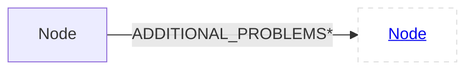
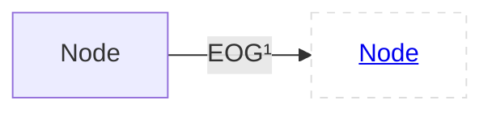
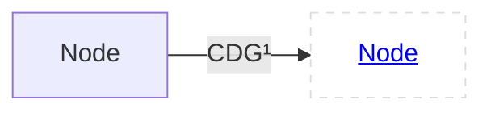
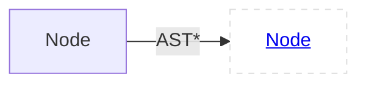
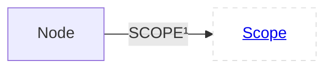
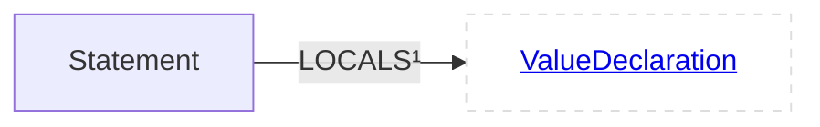
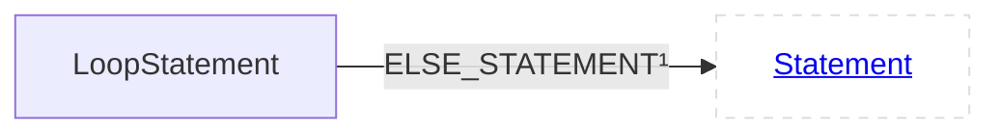
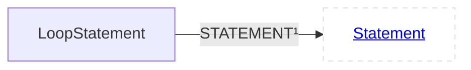

<style>.superclassLabel{background:#dddddd;border-radius:5%;line-height:26px;display:inline-block;text-align:center;margin-bottom:10px;padding-left:10px;padding-right:10px;}.classLabel{background:#aabbff;border-radius:5%;line-height:26px;display:inline-block;text-align:center;margin-bottom:10px;padding-left:10px;padding-right:10px;}.child{background:#dddddd;border-radius:5%;line-height:26px;display:inline-block;text-align:center;margin-bottom:10px;padding-left:10px;padding-right:10px;}.relationship{background:#aaffbb;border-radius:5%;line-height:26px;display:inline-block;text-align:center;margin-bottom:10px;padding-left:10px;padding-right:10px;}.inherited-relationship{background:#dddddd;border-radius:5%;line-height:26px;display:inline-block;text-align:center;margin-bottom:10px;padding-left:10px;padding-right:10px;}</style>

# CPG Schema
This file shows all node labels and relationships between them that are persisted from the in memory CPG to the Neo4j database. The specification is generated automatically and always up to date.
## Node<a id="enode"></a>
### Children
<span class="child">[Statement](#estatement)</span>
<span class="child">[Declaration](#edeclaration)</span>
<span class="child">[Type](#etype)</span>
<span class="child">[Scope](#escope)</span>
<span class="child">[OverlayNode](#eoverlaynode)</span>
<span class="child">[AnnotationMember](#eannotationmember)</span>
<span class="child">[Annotation](#eannotation)</span>
<span class="child">[Component](#ecomponent)</span>

### Relationships
<span class="relationship">[ADDITIONAL_PROBLEMS](#NodeADDITIONAL_PROBLEMS)</span>
<span class="relationship">[EOG](#NodeEOG)</span>
<span class="relationship">[CDG](#NodeCDG)</span>
<span class="relationship">[DFG](#NodeDFG)</span>
<span class="relationship">[ANNOTATIONS](#NodeANNOTATIONS)</span>
<span class="relationship">[PDG](#NodePDG)</span>
<span class="relationship">[AST](#NodeAST)</span>
<span class="relationship">[SCOPE](#NodeSCOPE)</span>
#### ADDITIONAL_PROBLEMS<a id="NodeADDITIONAL_PROBLEMS"></a>

#### EOG<a id="NodeEOG"></a>

#### CDG<a id="NodeCDG"></a>

#### DFG<a id="NodeDFG"></a>

#### ANNOTATIONS<a id="NodeANNOTATIONS"></a>

#### PDG<a id="NodePDG"></a>

#### AST<a id="NodeAST"></a>

#### SCOPE<a id="NodeSCOPE"></a>

### Properties
code : String

argumentIndex : int

file : String

isImplicit : boolean

overlayEdges : Overlays

fullName : String

localName : String

name : String

nameDelimiter : String

comment : String

artifact : String

startLine : int

endLine : int

startColumn : int

endColumn : int

isInferred : boolean

## Statement<a id="estatement"></a>
**Labels**:<span class="superclassLabel">[Node](#enode)</span>
<span class="classLabel">[Statement](#estatement)</span>

### Children
<span class="child">[AssertStatement](#eassertstatement)</span>
<span class="child">[LoopStatement](#eloopstatement)</span>
<span class="child">[Expression](#eexpression)</span>
<span class="child">[CaseStatement](#ecasestatement)</span>
<span class="child">[ReturnStatement](#ereturnstatement)</span>
<span class="child">[LabelStatement](#elabelstatement)</span>
<span class="child">[EmptyStatement](#eemptystatement)</span>
<span class="child">[IfStatement](#eifstatement)</span>
<span class="child">[CatchClause](#ecatchclause)</span>
<span class="child">[SwitchStatement](#eswitchstatement)</span>
<span class="child">[GotoStatement](#egotostatement)</span>
<span class="child">[ContinueStatement](#econtinuestatement)</span>
<span class="child">[DefaultStatement](#edefaultstatement)</span>
<span class="child">[SynchronizedStatement](#esynchronizedstatement)</span>
<span class="child">[TryStatement](#etrystatement)</span>
<span class="child">[BreakStatement](#ebreakstatement)</span>
<span class="child">[LookupScopeStatement](#elookupscopestatement)</span>
<span class="child">[DeclarationStatement](#edeclarationstatement)</span>

### Relationships
<span class="relationship">[LOCALS](#StatementLOCALS)</span>
<div class="papers" markdown>
??? info "Inherited Relationships"

    <span class="inherited-relationship">[ADDITIONAL_PROBLEMS](#NodeADDITIONAL_PROBLEMS)</span>

    <span class="inherited-relationship">[EOG](#NodeEOG)</span>

    <span class="inherited-relationship">[CDG](#NodeCDG)</span>

    <span class="inherited-relationship">[DFG](#NodeDFG)</span>

    <span class="inherited-relationship">[ANNOTATIONS](#NodeANNOTATIONS)</span>

    <span class="inherited-relationship">[PDG](#NodePDG)</span>

    <span class="inherited-relationship">[AST](#NodeAST)</span>

    <span class="inherited-relationship">[SCOPE](#NodeSCOPE)</span>

</div>

#### LOCALS<a id="StatementLOCALS"></a>

### Properties
<div class="papers" markdown>
??? info "Inherited Properties"
    code : String

    argumentIndex : int

    file : String

    isImplicit : boolean

    overlayEdges : Overlays

    fullName : String

    localName : String

    name : String

    nameDelimiter : String

    comment : String

    artifact : String

    startLine : int

    endLine : int

    startColumn : int

    endColumn : int

    isInferred : boolean

</div>

## AssertStatement<a id="eassertstatement"></a>
**Labels**:<span class="superclassLabel">[Node](#enode)</span>
<span class="superclassLabel">[Statement](#estatement)</span>
<span class="classLabel">[AssertStatement](#eassertstatement)</span>

### Relationships
<span class="relationship">[MESSAGE](#AssertStatementMESSAGE)</span>
<span class="relationship">[CONDITION](#AssertStatementCONDITION)</span>
<div class="papers" markdown>
??? info "Inherited Relationships"

    <span class="inherited-relationship">[LOCALS](#StatementLOCALS)</span>

    <span class="inherited-relationship">[ADDITIONAL_PROBLEMS](#NodeADDITIONAL_PROBLEMS)</span>

    <span class="inherited-relationship">[EOG](#NodeEOG)</span>

    <span class="inherited-relationship">[CDG](#NodeCDG)</span>

    <span class="inherited-relationship">[DFG](#NodeDFG)</span>

    <span class="inherited-relationship">[ANNOTATIONS](#NodeANNOTATIONS)</span>

    <span class="inherited-relationship">[PDG](#NodePDG)</span>

    <span class="inherited-relationship">[AST](#NodeAST)</span>

    <span class="inherited-relationship">[SCOPE](#NodeSCOPE)</span>

</div>

#### MESSAGE<a id="AssertStatementMESSAGE"></a>

#### CONDITION<a id="AssertStatementCONDITION"></a>

### Properties
<div class="papers" markdown>
??? info "Inherited Properties"
    code : String

    argumentIndex : int

    file : String

    isImplicit : boolean

    overlayEdges : Overlays

    fullName : String

    localName : String

    name : String

    nameDelimiter : String

    comment : String

    artifact : String

    startLine : int

    endLine : int

    startColumn : int

    endColumn : int

    isInferred : boolean

</div>

## LoopStatement<a id="eloopstatement"></a>
**Labels**:<span class="superclassLabel">[Node](#enode)</span>
<span class="superclassLabel">[Statement](#estatement)</span>
<span class="classLabel">[LoopStatement](#eloopstatement)</span>

### Children
<span class="child">[DoStatement](#edostatement)</span>
<span class="child">[ForStatement](#eforstatement)</span>
<span class="child">[WhileStatement](#ewhilestatement)</span>
<span class="child">[ForEachStatement](#eforeachstatement)</span>

### Relationships
<span class="relationship">[ELSE_STATEMENT](#LoopStatementELSE_STATEMENT)</span>
<span class="relationship">[STATEMENT](#LoopStatementSTATEMENT)</span>
<div class="papers" markdown>
??? info "Inherited Relationships"

    <span class="inherited-relationship">[LOCALS](#StatementLOCALS)</span>

    <span class="inherited-relationship">[ADDITIONAL_PROBLEMS](#NodeADDITIONAL_PROBLEMS)</span>

    <span class="inherited-relationship">[EOG](#NodeEOG)</span>

    <span class="inherited-relationship">[CDG](#NodeCDG)</span>

    <span class="inherited-relationship">[DFG](#NodeDFG)</span>

    <span class="inherited-relationship">[ANNOTATIONS](#NodeANNOTATIONS)</span>

    <span class="inherited-relationship">[PDG](#NodePDG)</span>

    <span class="inherited-relationship">[AST](#NodeAST)</span>

    <span class="inherited-relationship">[SCOPE](#NodeSCOPE)</span>

</div>

#### ELSE_STATEMENT<a id="LoopStatementELSE_STATEMENT"></a>

#### STATEMENT<a id="LoopStatementSTATEMENT"></a>

### Properties
<div class="papers" markdown>
??? info "Inherited Properties"
    code : String

    argumentIndex : int

    file : String

    isImplicit : boolean

    overlayEdges : Overlays

    fullName : String

    localName : String

    name : String

    nameDelimiter : String

    comment : String

    artifact : String

    startLine : int

    endLine : int

    startColumn : int

    endColumn : int

    isInferred : boolean

</div>

## DoStatement<a id="edostatement"></a>
**Labels**:<span class="superclassLabel">[Node](#enode)</span>
<span class="superclassLabel">[Statement](#estatement)</span>
<span class="superclassLabel">[LoopStatement](#eloopstatement)</span>
<span class="classLabel">[DoStatement](#edostatement)</span>

### Relationships
<span class="relationship">[CONDITION](#DoStatementCONDITION)</span>
<div class="papers" markdown>
??? info "Inherited Relationships"

    <span class="inherited-relationship">[ELSE_STATEMENT](#LoopStatementELSE_STATEMENT)</span>

    <span class="inherited-relationship">[STATEMENT](#LoopStatementSTATEMENT)</span>

    <span class="inherited-relationship">[LOCALS](#StatementLOCALS)</span>

    <span class="inherited-relationship">[ADDITIONAL_PROBLEMS](#NodeADDITIONAL_PROBLEMS)</span>

    <span class="inherited-relationship">[EOG](#NodeEOG)</span>

    <span class="inherited-relationship">[CDG](#NodeCDG)</span>

    <span class="inherited-relationship">[DFG](#NodeDFG)</span>

    <span class="inherited-relationship">[ANNOTATIONS](#NodeANNOTATIONS)</span>

    <span class="inherited-relationship">[PDG](#NodePDG)</span>

    <span class="inherited-relationship">[AST](#NodeAST)</span>

    <span class="inherited-relationship">[SCOPE](#NodeSCOPE)</span>

</div>

#### CONDITION<a id="DoStatementCONDITION"></a>

### Properties
<div class="papers" markdown>
??? info "Inherited Properties"
    code : String

    argumentIndex : int

    file : String

    isImplicit : boolean

    overlayEdges : Overlays

    fullName : String

    localName : String

    name : String

    nameDelimiter : String

    comment : String

    artifact : String

    startLine : int

    endLine : int

    startColumn : int

    endColumn : int

    isInferred : boolean

</div>

## ForStatement<a id="eforstatement"></a>
**Labels**:<span class="superclassLabel">[Node](#enode)</span>
<span class="superclassLabel">[Statement](#estatement)</span>
<span class="superclassLabel">[LoopStatement](#eloopstatement)</span>
<span class="classLabel">[ForStatement](#eforstatement)</span>

### Relationships
<span class="relationship">[CONDITION_DECLARATION](#ForStatementCONDITION_DECLARATION)</span>
<span class="relationship">[CONDITION](#ForStatementCONDITION)</span>
<span class="relationship">[ITERATION_STATEMENT](#ForStatementITERATION_STATEMENT)</span>
<span class="relationship">[INITIALIZER_STATEMENT](#ForStatementINITIALIZER_STATEMENT)</span>
<div class="papers" markdown>
??? info "Inherited Relationships"

    <span class="inherited-relationship">[ELSE_STATEMENT](#LoopStatementELSE_STATEMENT)</span>

    <span class="inherited-relationship">[STATEMENT](#LoopStatementSTATEMENT)</span>

    <span class="inherited-relationship">[LOCALS](#StatementLOCALS)</span>

    <span class="inherited-relationship">[ADDITIONAL_PROBLEMS](#NodeADDITIONAL_PROBLEMS)</span>

    <span class="inherited-relationship">[EOG](#NodeEOG)</span>

    <span class="inherited-relationship">[CDG](#NodeCDG)</span>

    <span class="inherited-relationship">[DFG](#NodeDFG)</span>

    <span class="inherited-relationship">[ANNOTATIONS](#NodeANNOTATIONS)</span>

    <span class="inherited-relationship">[PDG](#NodePDG)</span>

    <span class="inherited-relationship">[AST](#NodeAST)</span>

    <span class="inherited-relationship">[SCOPE](#NodeSCOPE)</span>

</div>

#### CONDITION_DECLARATION<a id="ForStatementCONDITION_DECLARATION"></a>

#### CONDITION<a id="ForStatementCONDITION"></a>

#### ITERATION_STATEMENT<a id="ForStatementITERATION_STATEMENT"></a>

#### INITIALIZER_STATEMENT<a id="ForStatementINITIALIZER_STATEMENT"></a>

### Properties
<div class="papers" markdown>
??? info "Inherited Properties"
    code : String

    argumentIndex : int

    file : String

    isImplicit : boolean

    overlayEdges : Overlays

    fullName : String

    localName : String

    name : String

    nameDelimiter : String

    comment : String

    artifact : String

    startLine : int

    endLine : int

    startColumn : int

    endColumn : int

    isInferred : boolean

</div>

## WhileStatement<a id="ewhilestatement"></a>
**Labels**:<span class="superclassLabel">[Node](#enode)</span>
<span class="superclassLabel">[Statement](#estatement)</span>
<span class="superclassLabel">[LoopStatement](#eloopstatement)</span>
<span class="classLabel">[WhileStatement](#ewhilestatement)</span>

### Relationships
<span class="relationship">[CONDITION_DECLARATION](#WhileStatementCONDITION_DECLARATION)</span>
<span class="relationship">[CONDITION](#WhileStatementCONDITION)</span>
<div class="papers" markdown>
??? info "Inherited Relationships"

    <span class="inherited-relationship">[ELSE_STATEMENT](#LoopStatementELSE_STATEMENT)</span>

    <span class="inherited-relationship">[STATEMENT](#LoopStatementSTATEMENT)</span>

    <span class="inherited-relationship">[LOCALS](#StatementLOCALS)</span>

    <span class="inherited-relationship">[ADDITIONAL_PROBLEMS](#NodeADDITIONAL_PROBLEMS)</span>

    <span class="inherited-relationship">[EOG](#NodeEOG)</span>

    <span class="inherited-relationship">[CDG](#NodeCDG)</span>

    <span class="inherited-relationship">[DFG](#NodeDFG)</span>

    <span class="inherited-relationship">[ANNOTATIONS](#NodeANNOTATIONS)</span>

    <span class="inherited-relationship">[PDG](#NodePDG)</span>

    <span class="inherited-relationship">[AST](#NodeAST)</span>

    <span class="inherited-relationship">[SCOPE](#NodeSCOPE)</span>

</div>

#### CONDITION_DECLARATION<a id="WhileStatementCONDITION_DECLARATION"></a>

#### CONDITION<a id="WhileStatementCONDITION"></a>

### Properties
<div class="papers" markdown>
??? info "Inherited Properties"
    code : String

    argumentIndex : int

    file : String

    isImplicit : boolean

    overlayEdges : Overlays

    fullName : String

    localName : String

    name : String

    nameDelimiter : String

    comment : String

    artifact : String

    startLine : int

    endLine : int

    startColumn : int

    endColumn : int

    isInferred : boolean

</div>

## ForEachStatement<a id="eforeachstatement"></a>
**Labels**:<span class="superclassLabel">[Node](#enode)</span>
<span class="superclassLabel">[Statement](#estatement)</span>
<span class="superclassLabel">[LoopStatement](#eloopstatement)</span>
<span class="classLabel">[ForEachStatement](#eforeachstatement)</span>

### Relationships
<span class="relationship">[ITERABLE](#ForEachStatementITERABLE)</span>
<span class="relationship">[VARIABLE](#ForEachStatementVARIABLE)</span>
<div class="papers" markdown>
??? info "Inherited Relationships"

    <span class="inherited-relationship">[ELSE_STATEMENT](#LoopStatementELSE_STATEMENT)</span>

    <span class="inherited-relationship">[STATEMENT](#LoopStatementSTATEMENT)</span>

    <span class="inherited-relationship">[LOCALS](#StatementLOCALS)</span>

    <span class="inherited-relationship">[ADDITIONAL_PROBLEMS](#NodeADDITIONAL_PROBLEMS)</span>

    <span class="inherited-relationship">[EOG](#NodeEOG)</span>

    <span class="inherited-relationship">[CDG](#NodeCDG)</span>

    <span class="inherited-relationship">[DFG](#NodeDFG)</span>

    <span class="inherited-relationship">[ANNOTATIONS](#NodeANNOTATIONS)</span>

    <span class="inherited-relationship">[PDG](#NodePDG)</span>

    <span class="inherited-relationship">[AST](#NodeAST)</span>

    <span class="inherited-relationship">[SCOPE](#NodeSCOPE)</span>

</div>

#### ITERABLE<a id="ForEachStatementITERABLE"></a>
```mermaid
flowchart LR
  classDef outer fill:#fff,stroke:#ddd,stroke-dasharray:5 5;  classDef special fill:#afa,stroke:#5a5,stroke-dasharray:5 5;
ForEachStatement--"ITERABLE¹"-->ForEachStatementITERABLE[<a href='#estatement'>Statement</a>]:::outer
```
#### VARIABLE<a id="ForEachStatementVARIABLE"></a>
```mermaid
flowchart LR
  classDef outer fill:#fff,stroke:#ddd,stroke-dasharray:5 5;  classDef special fill:#afa,stroke:#5a5,stroke-dasharray:5 5;
ForEachStatement--"VARIABLE¹"-->ForEachStatementVARIABLE[<a href='#estatement'>Statement</a>]:::outer
```
### Properties
<div class="papers" markdown>
??? info "Inherited Properties"
    code : String

    argumentIndex : int

    file : String

    isImplicit : boolean

    overlayEdges : Overlays

    fullName : String

    localName : String

    name : String

    nameDelimiter : String

    comment : String

    artifact : String

    startLine : int

    endLine : int

    startColumn : int

    endColumn : int

    isInferred : boolean

</div>

## Expression<a id="eexpression"></a>
**Labels**:<span class="superclassLabel">[Node](#enode)</span>
<span class="superclassLabel">[Statement](#estatement)</span>
<span class="classLabel">[Expression](#eexpression)</span>

### Children
<span class="child">[Call](#ecallexpression)</span>
<span class="child">[New](#enewexpression)</span>
<span class="child">[UnaryOperator](#eunaryoperator)</span>
<span class="child">[CollectionComprehension](#ecollectioncomprehension)</span>
<span class="child">[Throw](#ethrowexpression)</span>
<span class="child">[Block](#eblock)</span>
<span class="child">[Cast](#ecastexpression)</span>
<span class="child">[Reference](#ereference)</span>
<span class="child">[BinaryOperator](#ebinaryoperator)</span>
<span class="child">[Conditional](#econditionalexpression)</span>
<span class="child">[Delete](#edeleteexpression)</span>
<span class="child">[Subscription](#esubscriptexpression)</span>
<span class="child">[Problem](#eproblemexpression)</span>
<span class="child">[Range](#erangeexpression)</span>
<span class="child">[Lambda](#elambdaexpression)</span>
<span class="child">[ArrayConstruction](#enewarrayexpression)</span>
<span class="child">[KeyValue](#ekeyvalueexpression)</span>
<span class="child">[Assign](#eassignexpression)</span>
<span class="child">[Comprehension](#ecomprehensionexpression)</span>
<span class="child">[TypeExpression](#etypeexpression)</span>
<span class="child">[InitializerList](#einitializerlistexpression)</span>
<span class="child">[Literal](#eliteral)</span>
<span class="child">[TypeReference](#etypeidexpression)</span>
<span class="child">[ExpressionList](#eexpressionlist)</span>

### Relationships
<span class="relationship">[TYPE](#ExpressionTYPE)</span>
<span class="relationship">[ASSIGNED_TYPES](#ExpressionASSIGNED_TYPES)</span>
<div class="papers" markdown>
??? info "Inherited Relationships"

    <span class="inherited-relationship">[LOCALS](#StatementLOCALS)</span>

    <span class="inherited-relationship">[ADDITIONAL_PROBLEMS](#NodeADDITIONAL_PROBLEMS)</span>

    <span class="inherited-relationship">[EOG](#NodeEOG)</span>

    <span class="inherited-relationship">[CDG](#NodeCDG)</span>

    <span class="inherited-relationship">[DFG](#NodeDFG)</span>

    <span class="inherited-relationship">[ANNOTATIONS](#NodeANNOTATIONS)</span>

    <span class="inherited-relationship">[PDG](#NodePDG)</span>

    <span class="inherited-relationship">[AST](#NodeAST)</span>

    <span class="inherited-relationship">[SCOPE](#NodeSCOPE)</span>

</div>

#### TYPE<a id="ExpressionTYPE"></a>
```mermaid
flowchart LR
  classDef outer fill:#fff,stroke:#ddd,stroke-dasharray:5 5;  classDef special fill:#afa,stroke:#5a5,stroke-dasharray:5 5;
Expression--"TYPE¹"-->ExpressionTYPE[<a href='#etype'>Type</a>]:::outer
```
#### ASSIGNED_TYPES<a id="ExpressionASSIGNED_TYPES"></a>
```mermaid
flowchart LR
  classDef outer fill:#fff,stroke:#ddd,stroke-dasharray:5 5;  classDef special fill:#afa,stroke:#5a5,stroke-dasharray:5 5;
Expression--"ASSIGNED_TYPES*"-->ExpressionASSIGNED_TYPES[<a href='#etype'>Type</a>]:::outer
```
### Properties
<div class="papers" markdown>
??? info "Inherited Properties"
    code : String

    argumentIndex : int

    file : String

    isImplicit : boolean

    overlayEdges : Overlays

    fullName : String

    localName : String

    name : String

    nameDelimiter : String

    comment : String

    artifact : String

    startLine : int

    endLine : int

    startColumn : int

    endColumn : int

    isInferred : boolean

</div>

## Call<a id="ecallexpression"></a>
**Labels**:<span class="superclassLabel">[Node](#enode)</span>
<span class="superclassLabel">[Statement](#estatement)</span>
<span class="superclassLabel">[Expression](#eexpression)</span>
<span class="classLabel">[Call](#ecallexpression)</span>

### Children
<span class="child">[OperatorCall](#eoperatorcallexpression)</span>
<span class="child">[Construction](#econstructexpression)</span>
<span class="child">[MemberCall](#emembercallexpression)</span>

### Relationships
<span class="relationship">[CALLEE](#CallCALLEE)</span>
<span class="relationship">[INVOKES](#CallINVOKES)</span>
<span class="relationship">[TEMPLATE_INSTANTIATION](#CallTEMPLATE_INSTANTIATION)</span>
<span class="relationship">[TEMPLATE_ARGUMENTS](#CallTEMPLATE_ARGUMENTS)</span>
<span class="relationship">[ARGUMENTS](#CallARGUMENTS)</span>
<div class="papers" markdown>
??? info "Inherited Relationships"

    <span class="inherited-relationship">[TYPE](#ExpressionTYPE)</span>

    <span class="inherited-relationship">[ASSIGNED_TYPES](#ExpressionASSIGNED_TYPES)</span>

    <span class="inherited-relationship">[LOCALS](#StatementLOCALS)</span>

    <span class="inherited-relationship">[ADDITIONAL_PROBLEMS](#NodeADDITIONAL_PROBLEMS)</span>

    <span class="inherited-relationship">[EOG](#NodeEOG)</span>

    <span class="inherited-relationship">[CDG](#NodeCDG)</span>

    <span class="inherited-relationship">[DFG](#NodeDFG)</span>

    <span class="inherited-relationship">[ANNOTATIONS](#NodeANNOTATIONS)</span>

    <span class="inherited-relationship">[PDG](#NodePDG)</span>

    <span class="inherited-relationship">[AST](#NodeAST)</span>

    <span class="inherited-relationship">[SCOPE](#NodeSCOPE)</span>

</div>

#### CALLEE<a id="CallCALLEE"></a>
```mermaid
flowchart LR
  classDef outer fill:#fff,stroke:#ddd,stroke-dasharray:5 5;  classDef special fill:#afa,stroke:#5a5,stroke-dasharray:5 5;
Call--"CALLEE¹"-->CallCALLEE[<a href='#eexpression'>Expression</a>]:::outer
```
#### INVOKES<a id="CallINVOKES"></a>
```mermaid
flowchart LR
  classDef outer fill:#fff,stroke:#ddd,stroke-dasharray:5 5;  classDef special fill:#afa,stroke:#5a5,stroke-dasharray:5 5;
Call--"INVOKES¹"-->CallINVOKES[<a href='#efunctiondeclaration'>FunctionDeclaration</a>]:::outer
```
#### TEMPLATE_INSTANTIATION<a id="CallTEMPLATE_INSTANTIATION"></a>
```mermaid
flowchart LR
  classDef outer fill:#fff,stroke:#ddd,stroke-dasharray:5 5;  classDef special fill:#afa,stroke:#5a5,stroke-dasharray:5 5;
Call--"TEMPLATE_INSTANTIATION¹"-->CallTEMPLATE_INSTANTIATION[<a href='#etemplatedeclaration'>TemplateDeclaration</a>]:::outer
```
#### TEMPLATE_ARGUMENTS<a id="CallTEMPLATE_ARGUMENTS"></a>
```mermaid
flowchart LR
  classDef outer fill:#fff,stroke:#ddd,stroke-dasharray:5 5;  classDef special fill:#afa,stroke:#5a5,stroke-dasharray:5 5;
Call--"TEMPLATE_ARGUMENTS¹"-->CallTEMPLATE_ARGUMENTS[<a href='#enode'>Node</a>]:::outer
```
#### ARGUMENTS<a id="CallARGUMENTS"></a>
```mermaid
flowchart LR
  classDef outer fill:#fff,stroke:#ddd,stroke-dasharray:5 5;  classDef special fill:#afa,stroke:#5a5,stroke-dasharray:5 5;
Call--"ARGUMENTS¹"-->CallARGUMENTS[<a href='#eexpression'>Expression</a>]:::outer
```
### Properties
template : boolean

<div class="papers" markdown>
??? info "Inherited Properties"
    code : String

    file : String

    isInferred : boolean

    argumentIndex : int

    isImplicit : boolean

    overlayEdges : Overlays

    fullName : String

    localName : String

    name : String

    nameDelimiter : String

    comment : String

    artifact : String

    startLine : int

    endLine : int

    startColumn : int

    endColumn : int

</div>

## OperatorCall<a id="eoperatorcallexpression"></a>
**Labels**:<span class="superclassLabel">[Node](#enode)</span>
<span class="superclassLabel">[Statement](#estatement)</span>
<span class="superclassLabel">[Expression](#eexpression)</span>
<span class="superclassLabel">[Call](#ecallexpression)</span>
<span class="classLabel">[OperatorCall](#eoperatorcallexpression)</span>

### Relationships
<div class="papers" markdown>
??? info "Inherited Relationships"

    <span class="inherited-relationship">[CALLEE](#CallCALLEE)</span>

    <span class="inherited-relationship">[INVOKES](#CallINVOKES)</span>

    <span class="inherited-relationship">[TEMPLATE_INSTANTIATION](#CallTEMPLATE_INSTANTIATION)</span>

    <span class="inherited-relationship">[TEMPLATE_ARGUMENTS](#CallTEMPLATE_ARGUMENTS)</span>

    <span class="inherited-relationship">[ARGUMENTS](#CallARGUMENTS)</span>

    <span class="inherited-relationship">[TYPE](#ExpressionTYPE)</span>

    <span class="inherited-relationship">[ASSIGNED_TYPES](#ExpressionASSIGNED_TYPES)</span>

    <span class="inherited-relationship">[LOCALS](#StatementLOCALS)</span>

    <span class="inherited-relationship">[ADDITIONAL_PROBLEMS](#NodeADDITIONAL_PROBLEMS)</span>

    <span class="inherited-relationship">[EOG](#NodeEOG)</span>

    <span class="inherited-relationship">[CDG](#NodeCDG)</span>

    <span class="inherited-relationship">[DFG](#NodeDFG)</span>

    <span class="inherited-relationship">[ANNOTATIONS](#NodeANNOTATIONS)</span>

    <span class="inherited-relationship">[PDG](#NodePDG)</span>

    <span class="inherited-relationship">[AST](#NodeAST)</span>

    <span class="inherited-relationship">[SCOPE](#NodeSCOPE)</span>

</div>

### Properties
operatorCode : String

<div class="papers" markdown>
??? info "Inherited Properties"
    template : boolean

    code : String

    file : String

    isInferred : boolean

    argumentIndex : int

    isImplicit : boolean

    overlayEdges : Overlays

    fullName : String

    localName : String

    name : String

    nameDelimiter : String

    comment : String

    artifact : String

    startLine : int

    endLine : int

    startColumn : int

    endColumn : int

</div>

## Construction<a id="econstructexpression"></a>
**Labels**:<span class="superclassLabel">[Node](#enode)</span>
<span class="superclassLabel">[Statement](#estatement)</span>
<span class="superclassLabel">[Expression](#eexpression)</span>
<span class="superclassLabel">[Call](#ecallexpression)</span>
<span class="classLabel">[Construction](#econstructexpression)</span>

### Relationships
<span class="relationship">[INSTANTIATES](#ConstructINSTANTIATES)</span>
<span class="relationship">[ANONYMOUS_CLASS](#ConstructANONYMOUS_CLASS)</span>
<span class="relationship">[CONSTRUCTOR](#ConstructCONSTRUCTOR)</span>
<div class="papers" markdown>
??? info "Inherited Relationships"

    <span class="inherited-relationship">[CALLEE](#CallCALLEE)</span>

    <span class="inherited-relationship">[INVOKES](#CallINVOKES)</span>

    <span class="inherited-relationship">[TEMPLATE_INSTANTIATION](#CallTEMPLATE_INSTANTIATION)</span>

    <span class="inherited-relationship">[TEMPLATE_ARGUMENTS](#CallTEMPLATE_ARGUMENTS)</span>

    <span class="inherited-relationship">[ARGUMENTS](#CallARGUMENTS)</span>

    <span class="inherited-relationship">[TYPE](#ExpressionTYPE)</span>

    <span class="inherited-relationship">[ASSIGNED_TYPES](#ExpressionASSIGNED_TYPES)</span>

    <span class="inherited-relationship">[LOCALS](#StatementLOCALS)</span>

    <span class="inherited-relationship">[ADDITIONAL_PROBLEMS](#NodeADDITIONAL_PROBLEMS)</span>

    <span class="inherited-relationship">[EOG](#NodeEOG)</span>

    <span class="inherited-relationship">[CDG](#NodeCDG)</span>

    <span class="inherited-relationship">[DFG](#NodeDFG)</span>

    <span class="inherited-relationship">[ANNOTATIONS](#NodeANNOTATIONS)</span>

    <span class="inherited-relationship">[PDG](#NodePDG)</span>

    <span class="inherited-relationship">[AST](#NodeAST)</span>

    <span class="inherited-relationship">[SCOPE](#NodeSCOPE)</span>

</div>

#### INSTANTIATES<a id="ConstructINSTANTIATES"></a>
```mermaid
flowchart LR
  classDef outer fill:#fff,stroke:#ddd,stroke-dasharray:5 5;  classDef special fill:#afa,stroke:#5a5,stroke-dasharray:5 5;
Construction--"INSTANTIATES¹"-->ConstructINSTANTIATES[<a href='#edeclaration'>Declaration</a>]:::outer
```
#### ANONYMOUS_CLASS<a id="ConstructANONYMOUS_CLASS"></a>
```mermaid
flowchart LR
  classDef outer fill:#fff,stroke:#ddd,stroke-dasharray:5 5;  classDef special fill:#afa,stroke:#5a5,stroke-dasharray:5 5;
Construction--"ANONYMOUS_CLASS¹"-->ConstructANONYMOUS_CLASS[<a href='#erecorddeclaration'>RecordDeclaration</a>]:::outer
```
#### CONSTRUCTOR<a id="ConstructCONSTRUCTOR"></a>
```mermaid
flowchart LR
  classDef outer fill:#fff,stroke:#ddd,stroke-dasharray:5 5;  classDef special fill:#afa,stroke:#5a5,stroke-dasharray:5 5;
Construction--"CONSTRUCTOR¹"-->ConstructCONSTRUCTOR[<a href='#econstructordeclaration'>ConstructorDeclaration</a>]:::outer
```
### Properties
<div class="papers" markdown>
??? info "Inherited Properties"
    template : boolean

    code : String

    file : String

    isInferred : boolean

    argumentIndex : int

    isImplicit : boolean

    overlayEdges : Overlays

    fullName : String

    localName : String

    name : String

    nameDelimiter : String

    comment : String

    artifact : String

    startLine : int

    endLine : int

    startColumn : int

    endColumn : int

</div>

## MemberCall<a id="emembercallexpression"></a>
**Labels**:<span class="superclassLabel">[Node](#enode)</span>
<span class="superclassLabel">[Statement](#estatement)</span>
<span class="superclassLabel">[Expression](#eexpression)</span>
<span class="superclassLabel">[Call](#ecallexpression)</span>
<span class="classLabel">[MemberCall](#emembercallexpression)</span>

### Relationships
<div class="papers" markdown>
??? info "Inherited Relationships"

    <span class="inherited-relationship">[CALLEE](#CallCALLEE)</span>

    <span class="inherited-relationship">[INVOKES](#CallINVOKES)</span>

    <span class="inherited-relationship">[TEMPLATE_INSTANTIATION](#CallTEMPLATE_INSTANTIATION)</span>

    <span class="inherited-relationship">[TEMPLATE_ARGUMENTS](#CallTEMPLATE_ARGUMENTS)</span>

    <span class="inherited-relationship">[ARGUMENTS](#CallARGUMENTS)</span>

    <span class="inherited-relationship">[TYPE](#ExpressionTYPE)</span>

    <span class="inherited-relationship">[ASSIGNED_TYPES](#ExpressionASSIGNED_TYPES)</span>

    <span class="inherited-relationship">[LOCALS](#StatementLOCALS)</span>

    <span class="inherited-relationship">[ADDITIONAL_PROBLEMS](#NodeADDITIONAL_PROBLEMS)</span>

    <span class="inherited-relationship">[EOG](#NodeEOG)</span>

    <span class="inherited-relationship">[CDG](#NodeCDG)</span>

    <span class="inherited-relationship">[DFG](#NodeDFG)</span>

    <span class="inherited-relationship">[ANNOTATIONS](#NodeANNOTATIONS)</span>

    <span class="inherited-relationship">[PDG](#NodePDG)</span>

    <span class="inherited-relationship">[AST](#NodeAST)</span>

    <span class="inherited-relationship">[SCOPE](#NodeSCOPE)</span>

</div>

### Properties
isStatic : boolean

<div class="papers" markdown>
??? info "Inherited Properties"
    template : boolean

    code : String

    file : String

    isInferred : boolean

    argumentIndex : int

    isImplicit : boolean

    overlayEdges : Overlays

    fullName : String

    localName : String

    name : String

    nameDelimiter : String

    comment : String

    artifact : String

    startLine : int

    endLine : int

    startColumn : int

    endColumn : int

</div>

## New<a id="enewexpression"></a>
**Labels**:<span class="superclassLabel">[Node](#enode)</span>
<span class="superclassLabel">[Statement](#estatement)</span>
<span class="superclassLabel">[Expression](#eexpression)</span>
<span class="classLabel">[New](#enewexpression)</span>

### Relationships
<span class="relationship">[INITIALIZER](#NewINITIALIZER)</span>
<span class="relationship">[TEMPLATE_PARAMETERS](#NewTEMPLATE_PARAMETERS)</span>
<div class="papers" markdown>
??? info "Inherited Relationships"

    <span class="inherited-relationship">[TYPE](#ExpressionTYPE)</span>

    <span class="inherited-relationship">[ASSIGNED_TYPES](#ExpressionASSIGNED_TYPES)</span>

    <span class="inherited-relationship">[LOCALS](#StatementLOCALS)</span>

    <span class="inherited-relationship">[ADDITIONAL_PROBLEMS](#NodeADDITIONAL_PROBLEMS)</span>

    <span class="inherited-relationship">[EOG](#NodeEOG)</span>

    <span class="inherited-relationship">[CDG](#NodeCDG)</span>

    <span class="inherited-relationship">[DFG](#NodeDFG)</span>

    <span class="inherited-relationship">[ANNOTATIONS](#NodeANNOTATIONS)</span>

    <span class="inherited-relationship">[PDG](#NodePDG)</span>

    <span class="inherited-relationship">[AST](#NodeAST)</span>

    <span class="inherited-relationship">[SCOPE](#NodeSCOPE)</span>

</div>

#### INITIALIZER<a id="NewINITIALIZER"></a>
```mermaid
flowchart LR
  classDef outer fill:#fff,stroke:#ddd,stroke-dasharray:5 5;  classDef special fill:#afa,stroke:#5a5,stroke-dasharray:5 5;
New--"INITIALIZER¹"-->NewINITIALIZER[<a href='#eexpression'>Expression</a>]:::outer
```
#### TEMPLATE_PARAMETERS<a id="NewTEMPLATE_PARAMETERS"></a>
```mermaid
flowchart LR
  classDef outer fill:#fff,stroke:#ddd,stroke-dasharray:5 5;  classDef special fill:#afa,stroke:#5a5,stroke-dasharray:5 5;
New--"TEMPLATE_PARAMETERS¹"-->NewTEMPLATE_PARAMETERS[<a href='#enode'>Node</a>]:::outer
```
### Properties
<div class="papers" markdown>
??? info "Inherited Properties"
    code : String

    argumentIndex : int

    file : String

    isImplicit : boolean

    overlayEdges : Overlays

    fullName : String

    localName : String

    name : String

    nameDelimiter : String

    comment : String

    artifact : String

    startLine : int

    endLine : int

    startColumn : int

    endColumn : int

    isInferred : boolean

</div>

## UnaryOperator<a id="eunaryoperator"></a>
**Labels**:<span class="superclassLabel">[Node](#enode)</span>
<span class="superclassLabel">[Statement](#estatement)</span>
<span class="superclassLabel">[Expression](#eexpression)</span>
<span class="classLabel">[UnaryOperator](#eunaryoperator)</span>

### Relationships
<span class="relationship">[INPUT](#UnaryOperatorINPUT)</span>
<div class="papers" markdown>
??? info "Inherited Relationships"

    <span class="inherited-relationship">[TYPE](#ExpressionTYPE)</span>

    <span class="inherited-relationship">[ASSIGNED_TYPES](#ExpressionASSIGNED_TYPES)</span>

    <span class="inherited-relationship">[LOCALS](#StatementLOCALS)</span>

    <span class="inherited-relationship">[ADDITIONAL_PROBLEMS](#NodeADDITIONAL_PROBLEMS)</span>

    <span class="inherited-relationship">[EOG](#NodeEOG)</span>

    <span class="inherited-relationship">[CDG](#NodeCDG)</span>

    <span class="inherited-relationship">[DFG](#NodeDFG)</span>

    <span class="inherited-relationship">[ANNOTATIONS](#NodeANNOTATIONS)</span>

    <span class="inherited-relationship">[PDG](#NodePDG)</span>

    <span class="inherited-relationship">[AST](#NodeAST)</span>

    <span class="inherited-relationship">[SCOPE](#NodeSCOPE)</span>

</div>

#### INPUT<a id="UnaryOperatorINPUT"></a>
```mermaid
flowchart LR
  classDef outer fill:#fff,stroke:#ddd,stroke-dasharray:5 5;  classDef special fill:#afa,stroke:#5a5,stroke-dasharray:5 5;
UnaryOperator--"INPUT¹"-->UnaryOperatorINPUT[<a href='#eexpression'>Expression</a>]:::outer
```
### Properties
operatorCode : String

isPostfix : boolean

isPrefix : boolean

<div class="papers" markdown>
??? info "Inherited Properties"
    code : String

    argumentIndex : int

    file : String

    isImplicit : boolean

    overlayEdges : Overlays

    fullName : String

    localName : String

    name : String

    nameDelimiter : String

    comment : String

    artifact : String

    startLine : int

    endLine : int

    startColumn : int

    endColumn : int

    isInferred : boolean

</div>

## CollectionComprehension<a id="ecollectioncomprehension"></a>
**Labels**:<span class="superclassLabel">[Node](#enode)</span>
<span class="superclassLabel">[Statement](#estatement)</span>
<span class="superclassLabel">[Expression](#eexpression)</span>
<span class="classLabel">[CollectionComprehension](#ecollectioncomprehension)</span>

### Relationships
<span class="relationship">[COMPREHENSION_EXPRESSIONS](#CollectionComprehensionCOMPREHENSION_EXPRESSIONS)</span>
<span class="relationship">[STATEMENT](#CollectionComprehensionSTATEMENT)</span>
<div class="papers" markdown>
??? info "Inherited Relationships"

    <span class="inherited-relationship">[TYPE](#ExpressionTYPE)</span>

    <span class="inherited-relationship">[ASSIGNED_TYPES](#ExpressionASSIGNED_TYPES)</span>

    <span class="inherited-relationship">[LOCALS](#StatementLOCALS)</span>

    <span class="inherited-relationship">[ADDITIONAL_PROBLEMS](#NodeADDITIONAL_PROBLEMS)</span>

    <span class="inherited-relationship">[EOG](#NodeEOG)</span>

    <span class="inherited-relationship">[CDG](#NodeCDG)</span>

    <span class="inherited-relationship">[DFG](#NodeDFG)</span>

    <span class="inherited-relationship">[ANNOTATIONS](#NodeANNOTATIONS)</span>

    <span class="inherited-relationship">[PDG](#NodePDG)</span>

    <span class="inherited-relationship">[AST](#NodeAST)</span>

    <span class="inherited-relationship">[SCOPE](#NodeSCOPE)</span>

</div>

#### COMPREHENSION_EXPRESSIONS<a id="CollectionComprehensionCOMPREHENSION_EXPRESSIONS"></a>
```mermaid
flowchart LR
  classDef outer fill:#fff,stroke:#ddd,stroke-dasharray:5 5;  classDef special fill:#afa,stroke:#5a5,stroke-dasharray:5 5;
CollectionComprehension--"COMPREHENSION_EXPRESSIONS¹"-->CollectionComprehensionCOMPREHENSION_EXPRESSIONS[<a href='#ecomprehensionexpression'>Comprehension</a>]:::outer
```
#### STATEMENT<a id="CollectionComprehensionSTATEMENT"></a>
```mermaid
flowchart LR
  classDef outer fill:#fff,stroke:#ddd,stroke-dasharray:5 5;  classDef special fill:#afa,stroke:#5a5,stroke-dasharray:5 5;
CollectionComprehension--"STATEMENT¹"-->CollectionComprehensionSTATEMENT[<a href='#estatement'>Statement</a>]:::outer
```
### Properties
<div class="papers" markdown>
??? info "Inherited Properties"
    code : String

    argumentIndex : int

    file : String

    isImplicit : boolean

    overlayEdges : Overlays

    fullName : String

    localName : String

    name : String

    nameDelimiter : String

    comment : String

    artifact : String

    startLine : int

    endLine : int

    startColumn : int

    endColumn : int

    isInferred : boolean

</div>

## Throw<a id="ethrowexpression"></a>
**Labels**:<span class="superclassLabel">[Node](#enode)</span>
<span class="superclassLabel">[Statement](#estatement)</span>
<span class="superclassLabel">[Expression](#eexpression)</span>
<span class="classLabel">[Throw](#ethrowexpression)</span>

### Relationships
<span class="relationship">[PARENT_EXCEPTION](#ThrowPARENT_EXCEPTION)</span>
<span class="relationship">[EXCEPTION](#ThrowEXCEPTION)</span>
<div class="papers" markdown>
??? info "Inherited Relationships"

    <span class="inherited-relationship">[TYPE](#ExpressionTYPE)</span>

    <span class="inherited-relationship">[ASSIGNED_TYPES](#ExpressionASSIGNED_TYPES)</span>

    <span class="inherited-relationship">[LOCALS](#StatementLOCALS)</span>

    <span class="inherited-relationship">[ADDITIONAL_PROBLEMS](#NodeADDITIONAL_PROBLEMS)</span>

    <span class="inherited-relationship">[EOG](#NodeEOG)</span>

    <span class="inherited-relationship">[CDG](#NodeCDG)</span>

    <span class="inherited-relationship">[DFG](#NodeDFG)</span>

    <span class="inherited-relationship">[ANNOTATIONS](#NodeANNOTATIONS)</span>

    <span class="inherited-relationship">[PDG](#NodePDG)</span>

    <span class="inherited-relationship">[AST](#NodeAST)</span>

    <span class="inherited-relationship">[SCOPE](#NodeSCOPE)</span>

</div>

#### PARENT_EXCEPTION<a id="ThrowPARENT_EXCEPTION"></a>
```mermaid
flowchart LR
  classDef outer fill:#fff,stroke:#ddd,stroke-dasharray:5 5;  classDef special fill:#afa,stroke:#5a5,stroke-dasharray:5 5;
Throw--"PARENT_EXCEPTION¹"-->ThrowPARENT_EXCEPTION[<a href='#eexpression'>Expression</a>]:::outer
```
#### EXCEPTION<a id="ThrowEXCEPTION"></a>
```mermaid
flowchart LR
  classDef outer fill:#fff,stroke:#ddd,stroke-dasharray:5 5;  classDef special fill:#afa,stroke:#5a5,stroke-dasharray:5 5;
Throw--"EXCEPTION¹"-->ThrowEXCEPTION[<a href='#eexpression'>Expression</a>]:::outer
```
### Properties
<div class="papers" markdown>
??? info "Inherited Properties"
    code : String

    argumentIndex : int

    file : String

    isImplicit : boolean

    overlayEdges : Overlays

    fullName : String

    localName : String

    name : String

    nameDelimiter : String

    comment : String

    artifact : String

    startLine : int

    endLine : int

    startColumn : int

    endColumn : int

    isInferred : boolean

</div>

## Block<a id="eblock"></a>
**Labels**:<span class="superclassLabel">[Node](#enode)</span>
<span class="superclassLabel">[Statement](#estatement)</span>
<span class="superclassLabel">[Expression](#eexpression)</span>
<span class="classLabel">[Block](#eblock)</span>

### Children
<span class="child">[DistinctLanguageBlock](#edistinctlanguageblock)</span>

### Relationships
<span class="relationship">[STATEMENTS](#BlockSTATEMENTS)</span>
<div class="papers" markdown>
??? info "Inherited Relationships"

    <span class="inherited-relationship">[TYPE](#ExpressionTYPE)</span>

    <span class="inherited-relationship">[ASSIGNED_TYPES](#ExpressionASSIGNED_TYPES)</span>

    <span class="inherited-relationship">[LOCALS](#StatementLOCALS)</span>

    <span class="inherited-relationship">[ADDITIONAL_PROBLEMS](#NodeADDITIONAL_PROBLEMS)</span>

    <span class="inherited-relationship">[EOG](#NodeEOG)</span>

    <span class="inherited-relationship">[CDG](#NodeCDG)</span>

    <span class="inherited-relationship">[DFG](#NodeDFG)</span>

    <span class="inherited-relationship">[ANNOTATIONS](#NodeANNOTATIONS)</span>

    <span class="inherited-relationship">[PDG](#NodePDG)</span>

    <span class="inherited-relationship">[AST](#NodeAST)</span>

    <span class="inherited-relationship">[SCOPE](#NodeSCOPE)</span>

</div>

#### STATEMENTS<a id="BlockSTATEMENTS"></a>
```mermaid
flowchart LR
  classDef outer fill:#fff,stroke:#ddd,stroke-dasharray:5 5;  classDef special fill:#afa,stroke:#5a5,stroke-dasharray:5 5;
Block--"STATEMENTS¹"-->BlockSTATEMENTS[<a href='#estatement'>Statement</a>]:::outer
```
### Properties
isStaticBlock : boolean

<div class="papers" markdown>
??? info "Inherited Properties"
    code : String

    argumentIndex : int

    file : String

    isImplicit : boolean

    overlayEdges : Overlays

    fullName : String

    localName : String

    name : String

    nameDelimiter : String

    comment : String

    artifact : String

    startLine : int

    endLine : int

    startColumn : int

    endColumn : int

    isInferred : boolean

</div>

## DistinctLanguageBlock<a id="edistinctlanguageblock"></a>
**Labels**:<span class="superclassLabel">[Node](#enode)</span>
<span class="superclassLabel">[Statement](#estatement)</span>
<span class="superclassLabel">[Expression](#eexpression)</span>
<span class="superclassLabel">[Block](#eblock)</span>
<span class="classLabel">[DistinctLanguageBlock](#edistinctlanguageblock)</span>

### Relationships
<div class="papers" markdown>
??? info "Inherited Relationships"

    <span class="inherited-relationship">[STATEMENTS](#BlockSTATEMENTS)</span>

    <span class="inherited-relationship">[TYPE](#ExpressionTYPE)</span>

    <span class="inherited-relationship">[ASSIGNED_TYPES](#ExpressionASSIGNED_TYPES)</span>

    <span class="inherited-relationship">[LOCALS](#StatementLOCALS)</span>

    <span class="inherited-relationship">[ADDITIONAL_PROBLEMS](#NodeADDITIONAL_PROBLEMS)</span>

    <span class="inherited-relationship">[EOG](#NodeEOG)</span>

    <span class="inherited-relationship">[CDG](#NodeCDG)</span>

    <span class="inherited-relationship">[DFG](#NodeDFG)</span>

    <span class="inherited-relationship">[ANNOTATIONS](#NodeANNOTATIONS)</span>

    <span class="inherited-relationship">[PDG](#NodePDG)</span>

    <span class="inherited-relationship">[AST](#NodeAST)</span>

    <span class="inherited-relationship">[SCOPE](#NodeSCOPE)</span>

</div>

### Properties
<div class="papers" markdown>
??? info "Inherited Properties"
    code : String

    argumentIndex : int

    file : String

    isImplicit : boolean

    overlayEdges : Overlays

    isStaticBlock : boolean

    fullName : String

    localName : String

    name : String

    nameDelimiter : String

    comment : String

    artifact : String

    startLine : int

    endLine : int

    startColumn : int

    endColumn : int

    isInferred : boolean

</div>

## Cast<a id="ecastexpression"></a>
**Labels**:<span class="superclassLabel">[Node](#enode)</span>
<span class="superclassLabel">[Statement](#estatement)</span>
<span class="superclassLabel">[Expression](#eexpression)</span>
<span class="classLabel">[Cast](#ecastexpression)</span>

### Relationships
<span class="relationship">[CAST_TYPE](#CastCAST_TYPE)</span>
<span class="relationship">[EXPRESSION](#CastEXPRESSION)</span>
<div class="papers" markdown>
??? info "Inherited Relationships"

    <span class="inherited-relationship">[TYPE](#ExpressionTYPE)</span>

    <span class="inherited-relationship">[ASSIGNED_TYPES](#ExpressionASSIGNED_TYPES)</span>

    <span class="inherited-relationship">[LOCALS](#StatementLOCALS)</span>

    <span class="inherited-relationship">[ADDITIONAL_PROBLEMS](#NodeADDITIONAL_PROBLEMS)</span>

    <span class="inherited-relationship">[EOG](#NodeEOG)</span>

    <span class="inherited-relationship">[CDG](#NodeCDG)</span>

    <span class="inherited-relationship">[DFG](#NodeDFG)</span>

    <span class="inherited-relationship">[ANNOTATIONS](#NodeANNOTATIONS)</span>

    <span class="inherited-relationship">[PDG](#NodePDG)</span>

    <span class="inherited-relationship">[AST](#NodeAST)</span>

    <span class="inherited-relationship">[SCOPE](#NodeSCOPE)</span>

</div>

#### CAST_TYPE<a id="CastCAST_TYPE"></a>
```mermaid
flowchart LR
  classDef outer fill:#fff,stroke:#ddd,stroke-dasharray:5 5;  classDef special fill:#afa,stroke:#5a5,stroke-dasharray:5 5;
Cast--"CAST_TYPE¹"-->CastCAST_TYPE[<a href='#etype'>Type</a>]:::outer
```
#### EXPRESSION<a id="CastEXPRESSION"></a>
```mermaid
flowchart LR
  classDef outer fill:#fff,stroke:#ddd,stroke-dasharray:5 5;  classDef special fill:#afa,stroke:#5a5,stroke-dasharray:5 5;
Cast--"EXPRESSION¹"-->CastEXPRESSION[<a href='#eexpression'>Expression</a>]:::outer
```
### Properties
<div class="papers" markdown>
??? info "Inherited Properties"
    code : String

    argumentIndex : int

    file : String

    isImplicit : boolean

    overlayEdges : Overlays

    fullName : String

    localName : String

    name : String

    nameDelimiter : String

    comment : String

    artifact : String

    startLine : int

    endLine : int

    startColumn : int

    endColumn : int

    isInferred : boolean

</div>

## Reference<a id="ereference"></a>
**Labels**:<span class="superclassLabel">[Node](#enode)</span>
<span class="superclassLabel">[Statement](#estatement)</span>
<span class="superclassLabel">[Expression](#eexpression)</span>
<span class="classLabel">[Reference](#ereference)</span>

### Children
<span class="child">[MemberAccess](#ememberexpression)</span>

### Relationships
<span class="relationship">[REFERS_TO](#ReferenceREFERS_TO)</span>
<span class="relationship">[ALIASES](#ReferenceALIASES)</span>
<span class="relationship">[RESOLUTION_HELPER](#ReferenceRESOLUTION_HELPER)</span>
<span class="relationship">[CANDIDATES](#ReferenceCANDIDATES)</span>
<div class="papers" markdown>
??? info "Inherited Relationships"

    <span class="inherited-relationship">[TYPE](#ExpressionTYPE)</span>

    <span class="inherited-relationship">[ASSIGNED_TYPES](#ExpressionASSIGNED_TYPES)</span>

    <span class="inherited-relationship">[LOCALS](#StatementLOCALS)</span>

    <span class="inherited-relationship">[ADDITIONAL_PROBLEMS](#NodeADDITIONAL_PROBLEMS)</span>

    <span class="inherited-relationship">[EOG](#NodeEOG)</span>

    <span class="inherited-relationship">[CDG](#NodeCDG)</span>

    <span class="inherited-relationship">[DFG](#NodeDFG)</span>

    <span class="inherited-relationship">[ANNOTATIONS](#NodeANNOTATIONS)</span>

    <span class="inherited-relationship">[PDG](#NodePDG)</span>

    <span class="inherited-relationship">[AST](#NodeAST)</span>

    <span class="inherited-relationship">[SCOPE](#NodeSCOPE)</span>

</div>

#### REFERS_TO<a id="ReferenceREFERS_TO"></a>
```mermaid
flowchart LR
  classDef outer fill:#fff,stroke:#ddd,stroke-dasharray:5 5;  classDef special fill:#afa,stroke:#5a5,stroke-dasharray:5 5;
Reference--"REFERS_TO¹"-->ReferenceREFERS_TO[<a href='#edeclaration'>Declaration</a>]:::outer
```
#### ALIASES<a id="ReferenceALIASES"></a>
```mermaid
flowchart LR
  classDef outer fill:#fff,stroke:#ddd,stroke-dasharray:5 5;  classDef special fill:#afa,stroke:#5a5,stroke-dasharray:5 5;
Reference--"ALIASES*"-->ReferenceALIASES[<a href='#enode'>Node</a>]:::outer
```
#### RESOLUTION_HELPER<a id="ReferenceRESOLUTION_HELPER"></a>
```mermaid
flowchart LR
  classDef outer fill:#fff,stroke:#ddd,stroke-dasharray:5 5;  classDef special fill:#afa,stroke:#5a5,stroke-dasharray:5 5;
Reference--"RESOLUTION_HELPER¹"-->ReferenceRESOLUTION_HELPER[<a href='#enode'>Node</a>]:::outer
```
#### CANDIDATES<a id="ReferenceCANDIDATES"></a>
```mermaid
flowchart LR
  classDef outer fill:#fff,stroke:#ddd,stroke-dasharray:5 5;  classDef special fill:#afa,stroke:#5a5,stroke-dasharray:5 5;
Reference--"CANDIDATES*"-->ReferenceCANDIDATES[<a href='#edeclaration'>Declaration</a>]:::outer
```
### Properties
access : AccessValues

isStaticAccess : boolean

<div class="papers" markdown>
??? info "Inherited Properties"
    code : String

    file : String

    isInferred : boolean

    argumentIndex : int

    isImplicit : boolean

    overlayEdges : Overlays

    fullName : String

    localName : String

    name : String

    nameDelimiter : String

    comment : String

    artifact : String

    startLine : int

    endLine : int

    startColumn : int

    endColumn : int

</div>

## MemberAccess<a id="ememberexpression"></a>
**Labels**:<span class="superclassLabel">[Node](#enode)</span>
<span class="superclassLabel">[Statement](#estatement)</span>
<span class="superclassLabel">[Expression](#eexpression)</span>
<span class="superclassLabel">[Reference](#ereference)</span>
<span class="classLabel">[MemberAccess](#ememberexpression)</span>

### Relationships
<span class="relationship">[BASE](#MemberBASE)</span>
<div class="papers" markdown>
??? info "Inherited Relationships"

    <span class="inherited-relationship">[REFERS_TO](#ReferenceREFERS_TO)</span>

    <span class="inherited-relationship">[ALIASES](#ReferenceALIASES)</span>

    <span class="inherited-relationship">[RESOLUTION_HELPER](#ReferenceRESOLUTION_HELPER)</span>

    <span class="inherited-relationship">[CANDIDATES](#ReferenceCANDIDATES)</span>

    <span class="inherited-relationship">[TYPE](#ExpressionTYPE)</span>

    <span class="inherited-relationship">[ASSIGNED_TYPES](#ExpressionASSIGNED_TYPES)</span>

    <span class="inherited-relationship">[LOCALS](#StatementLOCALS)</span>

    <span class="inherited-relationship">[ADDITIONAL_PROBLEMS](#NodeADDITIONAL_PROBLEMS)</span>

    <span class="inherited-relationship">[EOG](#NodeEOG)</span>

    <span class="inherited-relationship">[CDG](#NodeCDG)</span>

    <span class="inherited-relationship">[DFG](#NodeDFG)</span>

    <span class="inherited-relationship">[ANNOTATIONS](#NodeANNOTATIONS)</span>

    <span class="inherited-relationship">[PDG](#NodePDG)</span>

    <span class="inherited-relationship">[AST](#NodeAST)</span>

    <span class="inherited-relationship">[SCOPE](#NodeSCOPE)</span>

</div>

#### BASE<a id="MemberBASE"></a>
```mermaid
flowchart LR
  classDef outer fill:#fff,stroke:#ddd,stroke-dasharray:5 5;  classDef special fill:#afa,stroke:#5a5,stroke-dasharray:5 5;
MemberAccess--"BASE¹"-->MemberBASE[<a href='#eexpression'>Expression</a>]:::outer
```
### Properties
operatorCode : String

<div class="papers" markdown>
??? info "Inherited Properties"
    access : AccessValues

    code : String

    file : String

    isInferred : boolean

    isStaticAccess : boolean

    argumentIndex : int

    isImplicit : boolean

    overlayEdges : Overlays

    fullName : String

    localName : String

    name : String

    nameDelimiter : String

    comment : String

    artifact : String

    startLine : int

    endLine : int

    startColumn : int

    endColumn : int

</div>

## BinaryOperator<a id="ebinaryoperator"></a>
**Labels**:<span class="superclassLabel">[Node](#enode)</span>
<span class="superclassLabel">[Statement](#estatement)</span>
<span class="superclassLabel">[Expression](#eexpression)</span>
<span class="classLabel">[BinaryOperator](#ebinaryoperator)</span>

### Children
<span class="child">[ShortCircuitOperator](#eshortcircuitoperator)</span>

### Relationships
<span class="relationship">[RHS](#BinaryOperatorRHS)</span>
<span class="relationship">[LHS](#BinaryOperatorLHS)</span>
<div class="papers" markdown>
??? info "Inherited Relationships"

    <span class="inherited-relationship">[TYPE](#ExpressionTYPE)</span>

    <span class="inherited-relationship">[ASSIGNED_TYPES](#ExpressionASSIGNED_TYPES)</span>

    <span class="inherited-relationship">[LOCALS](#StatementLOCALS)</span>

    <span class="inherited-relationship">[ADDITIONAL_PROBLEMS](#NodeADDITIONAL_PROBLEMS)</span>

    <span class="inherited-relationship">[EOG](#NodeEOG)</span>

    <span class="inherited-relationship">[CDG](#NodeCDG)</span>

    <span class="inherited-relationship">[DFG](#NodeDFG)</span>

    <span class="inherited-relationship">[ANNOTATIONS](#NodeANNOTATIONS)</span>

    <span class="inherited-relationship">[PDG](#NodePDG)</span>

    <span class="inherited-relationship">[AST](#NodeAST)</span>

    <span class="inherited-relationship">[SCOPE](#NodeSCOPE)</span>

</div>

#### RHS<a id="BinaryOperatorRHS"></a>
```mermaid
flowchart LR
  classDef outer fill:#fff,stroke:#ddd,stroke-dasharray:5 5;  classDef special fill:#afa,stroke:#5a5,stroke-dasharray:5 5;
BinaryOperator--"RHS¹"-->BinaryOperatorRHS[<a href='#eexpression'>Expression</a>]:::outer
```
#### LHS<a id="BinaryOperatorLHS"></a>
```mermaid
flowchart LR
  classDef outer fill:#fff,stroke:#ddd,stroke-dasharray:5 5;  classDef special fill:#afa,stroke:#5a5,stroke-dasharray:5 5;
BinaryOperator--"LHS¹"-->BinaryOperatorLHS[<a href='#eexpression'>Expression</a>]:::outer
```
### Properties
operatorCode : String

<div class="papers" markdown>
??? info "Inherited Properties"
    code : String

    argumentIndex : int

    file : String

    isImplicit : boolean

    overlayEdges : Overlays

    fullName : String

    localName : String

    name : String

    nameDelimiter : String

    comment : String

    artifact : String

    startLine : int

    endLine : int

    startColumn : int

    endColumn : int

    isInferred : boolean

</div>

## ShortCircuitOperator<a id="eshortcircuitoperator"></a>
**Labels**:<span class="superclassLabel">[Node](#enode)</span>
<span class="superclassLabel">[Statement](#estatement)</span>
<span class="superclassLabel">[Expression](#eexpression)</span>
<span class="superclassLabel">[BinaryOperator](#ebinaryoperator)</span>
<span class="classLabel">[ShortCircuitOperator](#eshortcircuitoperator)</span>

### Relationships
<div class="papers" markdown>
??? info "Inherited Relationships"

    <span class="inherited-relationship">[RHS](#BinaryOperatorRHS)</span>

    <span class="inherited-relationship">[LHS](#BinaryOperatorLHS)</span>

    <span class="inherited-relationship">[TYPE](#ExpressionTYPE)</span>

    <span class="inherited-relationship">[ASSIGNED_TYPES](#ExpressionASSIGNED_TYPES)</span>

    <span class="inherited-relationship">[LOCALS](#StatementLOCALS)</span>

    <span class="inherited-relationship">[ADDITIONAL_PROBLEMS](#NodeADDITIONAL_PROBLEMS)</span>

    <span class="inherited-relationship">[EOG](#NodeEOG)</span>

    <span class="inherited-relationship">[CDG](#NodeCDG)</span>

    <span class="inherited-relationship">[DFG](#NodeDFG)</span>

    <span class="inherited-relationship">[ANNOTATIONS](#NodeANNOTATIONS)</span>

    <span class="inherited-relationship">[PDG](#NodePDG)</span>

    <span class="inherited-relationship">[AST](#NodeAST)</span>

    <span class="inherited-relationship">[SCOPE](#NodeSCOPE)</span>

</div>

### Properties
<div class="papers" markdown>
??? info "Inherited Properties"
    code : String

    operatorCode : String

    argumentIndex : int

    file : String

    isImplicit : boolean

    overlayEdges : Overlays

    fullName : String

    localName : String

    name : String

    nameDelimiter : String

    comment : String

    artifact : String

    startLine : int

    endLine : int

    startColumn : int

    endColumn : int

    isInferred : boolean

</div>

## Conditional<a id="econditionalexpression"></a>
**Labels**:<span class="superclassLabel">[Node](#enode)</span>
<span class="superclassLabel">[Statement](#estatement)</span>
<span class="superclassLabel">[Expression](#eexpression)</span>
<span class="classLabel">[Conditional](#econditionalexpression)</span>

### Relationships
<span class="relationship">[THEN_EXPRESSION](#ConditionalTHEN_EXPRESSION)</span>
<span class="relationship">[CONDITION](#ConditionalCONDITION)</span>
<span class="relationship">[ELSE_EXPRESSION](#ConditionalELSE_EXPRESSION)</span>
<div class="papers" markdown>
??? info "Inherited Relationships"

    <span class="inherited-relationship">[TYPE](#ExpressionTYPE)</span>

    <span class="inherited-relationship">[ASSIGNED_TYPES](#ExpressionASSIGNED_TYPES)</span>

    <span class="inherited-relationship">[LOCALS](#StatementLOCALS)</span>

    <span class="inherited-relationship">[ADDITIONAL_PROBLEMS](#NodeADDITIONAL_PROBLEMS)</span>

    <span class="inherited-relationship">[EOG](#NodeEOG)</span>

    <span class="inherited-relationship">[CDG](#NodeCDG)</span>

    <span class="inherited-relationship">[DFG](#NodeDFG)</span>

    <span class="inherited-relationship">[ANNOTATIONS](#NodeANNOTATIONS)</span>

    <span class="inherited-relationship">[PDG](#NodePDG)</span>

    <span class="inherited-relationship">[AST](#NodeAST)</span>

    <span class="inherited-relationship">[SCOPE](#NodeSCOPE)</span>

</div>

#### THEN_EXPRESSION<a id="ConditionalTHEN_EXPRESSION"></a>
```mermaid
flowchart LR
  classDef outer fill:#fff,stroke:#ddd,stroke-dasharray:5 5;  classDef special fill:#afa,stroke:#5a5,stroke-dasharray:5 5;
Conditional--"THEN_EXPRESSION¹"-->ConditionalTHEN_EXPRESSION[<a href='#eexpression'>Expression</a>]:::outer
```
#### CONDITION<a id="ConditionalCONDITION"></a>
```mermaid
flowchart LR
  classDef outer fill:#fff,stroke:#ddd,stroke-dasharray:5 5;  classDef special fill:#afa,stroke:#5a5,stroke-dasharray:5 5;
Conditional--"CONDITION¹"-->ConditionalCONDITION[<a href='#eexpression'>Expression</a>]:::outer
```
#### ELSE_EXPRESSION<a id="ConditionalELSE_EXPRESSION"></a>
```mermaid
flowchart LR
  classDef outer fill:#fff,stroke:#ddd,stroke-dasharray:5 5;  classDef special fill:#afa,stroke:#5a5,stroke-dasharray:5 5;
Conditional--"ELSE_EXPRESSION¹"-->ConditionalELSE_EXPRESSION[<a href='#eexpression'>Expression</a>]:::outer
```
### Properties
<div class="papers" markdown>
??? info "Inherited Properties"
    code : String

    argumentIndex : int

    file : String

    isImplicit : boolean

    overlayEdges : Overlays

    fullName : String

    localName : String

    name : String

    nameDelimiter : String

    comment : String

    artifact : String

    startLine : int

    endLine : int

    startColumn : int

    endColumn : int

    isInferred : boolean

</div>

## Delete<a id="edeleteexpression"></a>
**Labels**:<span class="superclassLabel">[Node](#enode)</span>
<span class="superclassLabel">[Statement](#estatement)</span>
<span class="superclassLabel">[Expression](#eexpression)</span>
<span class="classLabel">[Delete](#edeleteexpression)</span>

### Relationships
<span class="relationship">[OPERANDS](#DeleteOPERANDS)</span>
<div class="papers" markdown>
??? info "Inherited Relationships"

    <span class="inherited-relationship">[TYPE](#ExpressionTYPE)</span>

    <span class="inherited-relationship">[ASSIGNED_TYPES](#ExpressionASSIGNED_TYPES)</span>

    <span class="inherited-relationship">[LOCALS](#StatementLOCALS)</span>

    <span class="inherited-relationship">[ADDITIONAL_PROBLEMS](#NodeADDITIONAL_PROBLEMS)</span>

    <span class="inherited-relationship">[EOG](#NodeEOG)</span>

    <span class="inherited-relationship">[CDG](#NodeCDG)</span>

    <span class="inherited-relationship">[DFG](#NodeDFG)</span>

    <span class="inherited-relationship">[ANNOTATIONS](#NodeANNOTATIONS)</span>

    <span class="inherited-relationship">[PDG](#NodePDG)</span>

    <span class="inherited-relationship">[AST](#NodeAST)</span>

    <span class="inherited-relationship">[SCOPE](#NodeSCOPE)</span>

</div>

#### OPERANDS<a id="DeleteOPERANDS"></a>
```mermaid
flowchart LR
  classDef outer fill:#fff,stroke:#ddd,stroke-dasharray:5 5;  classDef special fill:#afa,stroke:#5a5,stroke-dasharray:5 5;
Delete--"OPERANDS¹"-->DeleteOPERANDS[<a href='#eexpression'>Expression</a>]:::outer
```
### Properties
<div class="papers" markdown>
??? info "Inherited Properties"
    code : String

    argumentIndex : int

    file : String

    isImplicit : boolean

    overlayEdges : Overlays

    fullName : String

    localName : String

    name : String

    nameDelimiter : String

    comment : String

    artifact : String

    startLine : int

    endLine : int

    startColumn : int

    endColumn : int

    isInferred : boolean

</div>

## Subscription<a id="esubscriptexpression"></a>
**Labels**:<span class="superclassLabel">[Node](#enode)</span>
<span class="superclassLabel">[Statement](#estatement)</span>
<span class="superclassLabel">[Expression](#eexpression)</span>
<span class="classLabel">[Subscription](#esubscriptexpression)</span>

### Relationships
<span class="relationship">[ARRAY_EXPRESSION](#SubscriptARRAY_EXPRESSION)</span>
<span class="relationship">[SUBSCRIPT_EXPRESSION](#SubscriptSUBSCRIPT_EXPRESSION)</span>
<div class="papers" markdown>
??? info "Inherited Relationships"

    <span class="inherited-relationship">[TYPE](#ExpressionTYPE)</span>

    <span class="inherited-relationship">[ASSIGNED_TYPES](#ExpressionASSIGNED_TYPES)</span>

    <span class="inherited-relationship">[LOCALS](#StatementLOCALS)</span>

    <span class="inherited-relationship">[ADDITIONAL_PROBLEMS](#NodeADDITIONAL_PROBLEMS)</span>

    <span class="inherited-relationship">[EOG](#NodeEOG)</span>

    <span class="inherited-relationship">[CDG](#NodeCDG)</span>

    <span class="inherited-relationship">[DFG](#NodeDFG)</span>

    <span class="inherited-relationship">[ANNOTATIONS](#NodeANNOTATIONS)</span>

    <span class="inherited-relationship">[PDG](#NodePDG)</span>

    <span class="inherited-relationship">[AST](#NodeAST)</span>

    <span class="inherited-relationship">[SCOPE](#NodeSCOPE)</span>

</div>

#### ARRAY_EXPRESSION<a id="SubscriptARRAY_EXPRESSION"></a>
```mermaid
flowchart LR
  classDef outer fill:#fff,stroke:#ddd,stroke-dasharray:5 5;  classDef special fill:#afa,stroke:#5a5,stroke-dasharray:5 5;
Subscription--"ARRAY_EXPRESSION¹"-->SubscriptARRAY_EXPRESSION[<a href='#eexpression'>Expression</a>]:::outer
```
#### SUBSCRIPT_EXPRESSION<a id="SubscriptSUBSCRIPT_EXPRESSION"></a>
```mermaid
flowchart LR
  classDef outer fill:#fff,stroke:#ddd,stroke-dasharray:5 5;  classDef special fill:#afa,stroke:#5a5,stroke-dasharray:5 5;
Subscription--"SUBSCRIPT_EXPRESSION¹"-->SubscriptSUBSCRIPT_EXPRESSION[<a href='#eexpression'>Expression</a>]:::outer
```
### Properties
<div class="papers" markdown>
??? info "Inherited Properties"
    code : String

    argumentIndex : int

    file : String

    isImplicit : boolean

    overlayEdges : Overlays

    fullName : String

    localName : String

    name : String

    nameDelimiter : String

    comment : String

    artifact : String

    startLine : int

    endLine : int

    startColumn : int

    endColumn : int

    isInferred : boolean

</div>

## Problem<a id="eproblemexpression"></a>
**Labels**:<span class="superclassLabel">[Node](#enode)</span>
<span class="superclassLabel">[Statement](#estatement)</span>
<span class="superclassLabel">[Expression](#eexpression)</span>
<span class="classLabel">[Problem](#eproblemexpression)</span>

### Relationships
<div class="papers" markdown>
??? info "Inherited Relationships"

    <span class="inherited-relationship">[TYPE](#ExpressionTYPE)</span>

    <span class="inherited-relationship">[ASSIGNED_TYPES](#ExpressionASSIGNED_TYPES)</span>

    <span class="inherited-relationship">[LOCALS](#StatementLOCALS)</span>

    <span class="inherited-relationship">[ADDITIONAL_PROBLEMS](#NodeADDITIONAL_PROBLEMS)</span>

    <span class="inherited-relationship">[EOG](#NodeEOG)</span>

    <span class="inherited-relationship">[CDG](#NodeCDG)</span>

    <span class="inherited-relationship">[DFG](#NodeDFG)</span>

    <span class="inherited-relationship">[ANNOTATIONS](#NodeANNOTATIONS)</span>

    <span class="inherited-relationship">[PDG](#NodePDG)</span>

    <span class="inherited-relationship">[AST](#NodeAST)</span>

    <span class="inherited-relationship">[SCOPE](#NodeSCOPE)</span>

</div>

### Properties
problem : String

problemType : ProblemType

<div class="papers" markdown>
??? info "Inherited Properties"
    code : String

    argumentIndex : int

    file : String

    isImplicit : boolean

    overlayEdges : Overlays

    fullName : String

    localName : String

    name : String

    nameDelimiter : String

    comment : String

    artifact : String

    startLine : int

    endLine : int

    startColumn : int

    endColumn : int

    isInferred : boolean

</div>

## Range<a id="erangeexpression"></a>
**Labels**:<span class="superclassLabel">[Node](#enode)</span>
<span class="superclassLabel">[Statement](#estatement)</span>
<span class="superclassLabel">[Expression](#eexpression)</span>
<span class="classLabel">[Range](#erangeexpression)</span>

### Relationships
<span class="relationship">[FLOOR](#RangeFLOOR)</span>
<span class="relationship">[CEILING](#RangeCEILING)</span>
<span class="relationship">[THIRD](#RangeTHIRD)</span>
<div class="papers" markdown>
??? info "Inherited Relationships"

    <span class="inherited-relationship">[TYPE](#ExpressionTYPE)</span>

    <span class="inherited-relationship">[ASSIGNED_TYPES](#ExpressionASSIGNED_TYPES)</span>

    <span class="inherited-relationship">[LOCALS](#StatementLOCALS)</span>

    <span class="inherited-relationship">[ADDITIONAL_PROBLEMS](#NodeADDITIONAL_PROBLEMS)</span>

    <span class="inherited-relationship">[EOG](#NodeEOG)</span>

    <span class="inherited-relationship">[CDG](#NodeCDG)</span>

    <span class="inherited-relationship">[DFG](#NodeDFG)</span>

    <span class="inherited-relationship">[ANNOTATIONS](#NodeANNOTATIONS)</span>

    <span class="inherited-relationship">[PDG](#NodePDG)</span>

    <span class="inherited-relationship">[AST](#NodeAST)</span>

    <span class="inherited-relationship">[SCOPE](#NodeSCOPE)</span>

</div>

#### FLOOR<a id="RangeFLOOR"></a>
```mermaid
flowchart LR
  classDef outer fill:#fff,stroke:#ddd,stroke-dasharray:5 5;  classDef special fill:#afa,stroke:#5a5,stroke-dasharray:5 5;
Range--"FLOOR¹"-->RangeFLOOR[<a href='#eexpression'>Expression</a>]:::outer
```
#### CEILING<a id="RangeCEILING"></a>
```mermaid
flowchart LR
  classDef outer fill:#fff,stroke:#ddd,stroke-dasharray:5 5;  classDef special fill:#afa,stroke:#5a5,stroke-dasharray:5 5;
Range--"CEILING¹"-->RangeCEILING[<a href='#eexpression'>Expression</a>]:::outer
```
#### THIRD<a id="RangeTHIRD"></a>
```mermaid
flowchart LR
  classDef outer fill:#fff,stroke:#ddd,stroke-dasharray:5 5;  classDef special fill:#afa,stroke:#5a5,stroke-dasharray:5 5;
Range--"THIRD¹"-->RangeTHIRD[<a href='#eexpression'>Expression</a>]:::outer
```
### Properties
operatorCode : String

<div class="papers" markdown>
??? info "Inherited Properties"
    code : String

    argumentIndex : int

    file : String

    isImplicit : boolean

    overlayEdges : Overlays

    fullName : String

    localName : String

    name : String

    nameDelimiter : String

    comment : String

    artifact : String

    startLine : int

    endLine : int

    startColumn : int

    endColumn : int

    isInferred : boolean

</div>

## Lambda<a id="elambdaexpression"></a>
**Labels**:<span class="superclassLabel">[Node](#enode)</span>
<span class="superclassLabel">[Statement](#estatement)</span>
<span class="superclassLabel">[Expression](#eexpression)</span>
<span class="classLabel">[Lambda](#elambdaexpression)</span>

### Relationships
<span class="relationship">[MUTABLE_VARIABLES](#LambdaMUTABLE_VARIABLES)</span>
<span class="relationship">[FUNCTION](#LambdaFUNCTION)</span>
<div class="papers" markdown>
??? info "Inherited Relationships"

    <span class="inherited-relationship">[TYPE](#ExpressionTYPE)</span>

    <span class="inherited-relationship">[ASSIGNED_TYPES](#ExpressionASSIGNED_TYPES)</span>

    <span class="inherited-relationship">[LOCALS](#StatementLOCALS)</span>

    <span class="inherited-relationship">[ADDITIONAL_PROBLEMS](#NodeADDITIONAL_PROBLEMS)</span>

    <span class="inherited-relationship">[EOG](#NodeEOG)</span>

    <span class="inherited-relationship">[CDG](#NodeCDG)</span>

    <span class="inherited-relationship">[DFG](#NodeDFG)</span>

    <span class="inherited-relationship">[ANNOTATIONS](#NodeANNOTATIONS)</span>

    <span class="inherited-relationship">[PDG](#NodePDG)</span>

    <span class="inherited-relationship">[AST](#NodeAST)</span>

    <span class="inherited-relationship">[SCOPE](#NodeSCOPE)</span>

</div>

#### MUTABLE_VARIABLES<a id="LambdaMUTABLE_VARIABLES"></a>
```mermaid
flowchart LR
  classDef outer fill:#fff,stroke:#ddd,stroke-dasharray:5 5;  classDef special fill:#afa,stroke:#5a5,stroke-dasharray:5 5;
Lambda--"MUTABLE_VARIABLES*"-->LambdaMUTABLE_VARIABLES[<a href='#evaluedeclaration'>ValueDeclaration</a>]:::outer
```
#### FUNCTION<a id="LambdaFUNCTION"></a>
```mermaid
flowchart LR
  classDef outer fill:#fff,stroke:#ddd,stroke-dasharray:5 5;  classDef special fill:#afa,stroke:#5a5,stroke-dasharray:5 5;
Lambda--"FUNCTION¹"-->LambdaFUNCTION[<a href='#efunctiondeclaration'>FunctionDeclaration</a>]:::outer
```
### Properties
areVariablesMutable : boolean

<div class="papers" markdown>
??? info "Inherited Properties"
    code : String

    argumentIndex : int

    file : String

    isImplicit : boolean

    overlayEdges : Overlays

    fullName : String

    localName : String

    name : String

    nameDelimiter : String

    comment : String

    artifact : String

    startLine : int

    endLine : int

    startColumn : int

    endColumn : int

    isInferred : boolean

</div>

## ArrayConstruction<a id="enewarrayexpression"></a>
**Labels**:<span class="superclassLabel">[Node](#enode)</span>
<span class="superclassLabel">[Statement](#estatement)</span>
<span class="superclassLabel">[Expression](#eexpression)</span>
<span class="classLabel">[ArrayConstruction](#enewarrayexpression)</span>

### Relationships
<span class="relationship">[INITIALIZER](#NewArrayINITIALIZER)</span>
<span class="relationship">[DIMENSIONS](#NewArrayDIMENSIONS)</span>
<div class="papers" markdown>
??? info "Inherited Relationships"

    <span class="inherited-relationship">[TYPE](#ExpressionTYPE)</span>

    <span class="inherited-relationship">[ASSIGNED_TYPES](#ExpressionASSIGNED_TYPES)</span>

    <span class="inherited-relationship">[LOCALS](#StatementLOCALS)</span>

    <span class="inherited-relationship">[ADDITIONAL_PROBLEMS](#NodeADDITIONAL_PROBLEMS)</span>

    <span class="inherited-relationship">[EOG](#NodeEOG)</span>

    <span class="inherited-relationship">[CDG](#NodeCDG)</span>

    <span class="inherited-relationship">[DFG](#NodeDFG)</span>

    <span class="inherited-relationship">[ANNOTATIONS](#NodeANNOTATIONS)</span>

    <span class="inherited-relationship">[PDG](#NodePDG)</span>

    <span class="inherited-relationship">[AST](#NodeAST)</span>

    <span class="inherited-relationship">[SCOPE](#NodeSCOPE)</span>

</div>

#### INITIALIZER<a id="NewArrayINITIALIZER"></a>
```mermaid
flowchart LR
  classDef outer fill:#fff,stroke:#ddd,stroke-dasharray:5 5;  classDef special fill:#afa,stroke:#5a5,stroke-dasharray:5 5;
ArrayConstruction--"INITIALIZER¹"-->NewArrayINITIALIZER[<a href='#eexpression'>Expression</a>]:::outer
```
#### DIMENSIONS<a id="NewArrayDIMENSIONS"></a>
```mermaid
flowchart LR
  classDef outer fill:#fff,stroke:#ddd,stroke-dasharray:5 5;  classDef special fill:#afa,stroke:#5a5,stroke-dasharray:5 5;
ArrayConstruction--"DIMENSIONS¹"-->NewArrayDIMENSIONS[<a href='#eexpression'>Expression</a>]:::outer
```
### Properties
<div class="papers" markdown>
??? info "Inherited Properties"
    code : String

    argumentIndex : int

    file : String

    isImplicit : boolean

    overlayEdges : Overlays

    fullName : String

    localName : String

    name : String

    nameDelimiter : String

    comment : String

    artifact : String

    startLine : int

    endLine : int

    startColumn : int

    endColumn : int

    isInferred : boolean

</div>

## KeyValue<a id="ekeyvalueexpression"></a>
**Labels**:<span class="superclassLabel">[Node](#enode)</span>
<span class="superclassLabel">[Statement](#estatement)</span>
<span class="superclassLabel">[Expression](#eexpression)</span>
<span class="classLabel">[KeyValue](#ekeyvalueexpression)</span>

### Relationships
<span class="relationship">[KEY](#KeyValueKEY)</span>
<span class="relationship">[VALUE](#KeyValueVALUE)</span>
<div class="papers" markdown>
??? info "Inherited Relationships"

    <span class="inherited-relationship">[TYPE](#ExpressionTYPE)</span>

    <span class="inherited-relationship">[ASSIGNED_TYPES](#ExpressionASSIGNED_TYPES)</span>

    <span class="inherited-relationship">[LOCALS](#StatementLOCALS)</span>

    <span class="inherited-relationship">[ADDITIONAL_PROBLEMS](#NodeADDITIONAL_PROBLEMS)</span>

    <span class="inherited-relationship">[EOG](#NodeEOG)</span>

    <span class="inherited-relationship">[CDG](#NodeCDG)</span>

    <span class="inherited-relationship">[DFG](#NodeDFG)</span>

    <span class="inherited-relationship">[ANNOTATIONS](#NodeANNOTATIONS)</span>

    <span class="inherited-relationship">[PDG](#NodePDG)</span>

    <span class="inherited-relationship">[AST](#NodeAST)</span>

    <span class="inherited-relationship">[SCOPE](#NodeSCOPE)</span>

</div>

#### KEY<a id="KeyValueKEY"></a>
```mermaid
flowchart LR
  classDef outer fill:#fff,stroke:#ddd,stroke-dasharray:5 5;  classDef special fill:#afa,stroke:#5a5,stroke-dasharray:5 5;
KeyValue--"KEY¹"-->KeyValueKEY[<a href='#eexpression'>Expression</a>]:::outer
```
#### VALUE<a id="KeyValueVALUE"></a>
```mermaid
flowchart LR
  classDef outer fill:#fff,stroke:#ddd,stroke-dasharray:5 5;  classDef special fill:#afa,stroke:#5a5,stroke-dasharray:5 5;
KeyValue--"VALUE¹"-->KeyValueVALUE[<a href='#eexpression'>Expression</a>]:::outer
```
### Properties
<div class="papers" markdown>
??? info "Inherited Properties"
    code : String

    argumentIndex : int

    file : String

    isImplicit : boolean

    overlayEdges : Overlays

    fullName : String

    localName : String

    name : String

    nameDelimiter : String

    comment : String

    artifact : String

    startLine : int

    endLine : int

    startColumn : int

    endColumn : int

    isInferred : boolean

</div>

## Assign<a id="eassignexpression"></a>
**Labels**:<span class="superclassLabel">[Node](#enode)</span>
<span class="superclassLabel">[Statement](#estatement)</span>
<span class="superclassLabel">[Expression](#eexpression)</span>
<span class="classLabel">[Assign](#eassignexpression)</span>

### Relationships
<span class="relationship">[LHS](#AssignLHS)</span>
<span class="relationship">[DECLARATIONS](#AssignDECLARATIONS)</span>
<span class="relationship">[RHS](#AssignRHS)</span>
<div class="papers" markdown>
??? info "Inherited Relationships"

    <span class="inherited-relationship">[TYPE](#ExpressionTYPE)</span>

    <span class="inherited-relationship">[ASSIGNED_TYPES](#ExpressionASSIGNED_TYPES)</span>

    <span class="inherited-relationship">[LOCALS](#StatementLOCALS)</span>

    <span class="inherited-relationship">[ADDITIONAL_PROBLEMS](#NodeADDITIONAL_PROBLEMS)</span>

    <span class="inherited-relationship">[EOG](#NodeEOG)</span>

    <span class="inherited-relationship">[CDG](#NodeCDG)</span>

    <span class="inherited-relationship">[DFG](#NodeDFG)</span>

    <span class="inherited-relationship">[ANNOTATIONS](#NodeANNOTATIONS)</span>

    <span class="inherited-relationship">[PDG](#NodePDG)</span>

    <span class="inherited-relationship">[AST](#NodeAST)</span>

    <span class="inherited-relationship">[SCOPE](#NodeSCOPE)</span>

</div>

#### LHS<a id="AssignLHS"></a>
```mermaid
flowchart LR
  classDef outer fill:#fff,stroke:#ddd,stroke-dasharray:5 5;  classDef special fill:#afa,stroke:#5a5,stroke-dasharray:5 5;
Assign--"LHS¹"-->AssignLHS[<a href='#eexpression'>Expression</a>]:::outer
```
#### DECLARATIONS<a id="AssignDECLARATIONS"></a>
```mermaid
flowchart LR
  classDef outer fill:#fff,stroke:#ddd,stroke-dasharray:5 5;  classDef special fill:#afa,stroke:#5a5,stroke-dasharray:5 5;
Assign--"DECLARATIONS¹"-->AssignDECLARATIONS[<a href='#evariabledeclaration'>VariableDeclaration</a>]:::outer
```
#### RHS<a id="AssignRHS"></a>
```mermaid
flowchart LR
  classDef outer fill:#fff,stroke:#ddd,stroke-dasharray:5 5;  classDef special fill:#afa,stroke:#5a5,stroke-dasharray:5 5;
Assign--"RHS¹"-->AssignRHS[<a href='#eexpression'>Expression</a>]:::outer
```
### Properties
usedAsExpression : boolean

operatorCode : String

<div class="papers" markdown>
??? info "Inherited Properties"
    code : String

    argumentIndex : int

    file : String

    isImplicit : boolean

    overlayEdges : Overlays

    fullName : String

    localName : String

    name : String

    nameDelimiter : String

    comment : String

    artifact : String

    startLine : int

    endLine : int

    startColumn : int

    endColumn : int

    isInferred : boolean

</div>

## Comprehension<a id="ecomprehensionexpression"></a>
**Labels**:<span class="superclassLabel">[Node](#enode)</span>
<span class="superclassLabel">[Statement](#estatement)</span>
<span class="superclassLabel">[Expression](#eexpression)</span>
<span class="classLabel">[Comprehension](#ecomprehensionexpression)</span>

### Relationships
<span class="relationship">[PREDICATE](#ComprehensionPREDICATE)</span>
<span class="relationship">[ITERABLE](#ComprehensionITERABLE)</span>
<span class="relationship">[VARIABLE](#ComprehensionVARIABLE)</span>
<div class="papers" markdown>
??? info "Inherited Relationships"

    <span class="inherited-relationship">[TYPE](#ExpressionTYPE)</span>

    <span class="inherited-relationship">[ASSIGNED_TYPES](#ExpressionASSIGNED_TYPES)</span>

    <span class="inherited-relationship">[LOCALS](#StatementLOCALS)</span>

    <span class="inherited-relationship">[ADDITIONAL_PROBLEMS](#NodeADDITIONAL_PROBLEMS)</span>

    <span class="inherited-relationship">[EOG](#NodeEOG)</span>

    <span class="inherited-relationship">[CDG](#NodeCDG)</span>

    <span class="inherited-relationship">[DFG](#NodeDFG)</span>

    <span class="inherited-relationship">[ANNOTATIONS](#NodeANNOTATIONS)</span>

    <span class="inherited-relationship">[PDG](#NodePDG)</span>

    <span class="inherited-relationship">[AST](#NodeAST)</span>

    <span class="inherited-relationship">[SCOPE](#NodeSCOPE)</span>

</div>

#### PREDICATE<a id="ComprehensionPREDICATE"></a>
```mermaid
flowchart LR
  classDef outer fill:#fff,stroke:#ddd,stroke-dasharray:5 5;  classDef special fill:#afa,stroke:#5a5,stroke-dasharray:5 5;
Comprehension--"PREDICATE¹"-->ComprehensionPREDICATE[<a href='#estatement'>Statement</a>]:::outer
```
#### ITERABLE<a id="ComprehensionITERABLE"></a>
```mermaid
flowchart LR
  classDef outer fill:#fff,stroke:#ddd,stroke-dasharray:5 5;  classDef special fill:#afa,stroke:#5a5,stroke-dasharray:5 5;
Comprehension--"ITERABLE¹"-->ComprehensionITERABLE[<a href='#eexpression'>Expression</a>]:::outer
```
#### VARIABLE<a id="ComprehensionVARIABLE"></a>
```mermaid
flowchart LR
  classDef outer fill:#fff,stroke:#ddd,stroke-dasharray:5 5;  classDef special fill:#afa,stroke:#5a5,stroke-dasharray:5 5;
Comprehension--"VARIABLE¹"-->ComprehensionVARIABLE[<a href='#estatement'>Statement</a>]:::outer
```
### Properties
<div class="papers" markdown>
??? info "Inherited Properties"
    code : String

    argumentIndex : int

    file : String

    isImplicit : boolean

    overlayEdges : Overlays

    fullName : String

    localName : String

    name : String

    nameDelimiter : String

    comment : String

    artifact : String

    startLine : int

    endLine : int

    startColumn : int

    endColumn : int

    isInferred : boolean

</div>

## TypeExpression<a id="etypeexpression"></a>
**Labels**:<span class="superclassLabel">[Node](#enode)</span>
<span class="superclassLabel">[Statement](#estatement)</span>
<span class="superclassLabel">[Expression](#eexpression)</span>
<span class="classLabel">[TypeExpression](#etypeexpression)</span>

### Relationships
<div class="papers" markdown>
??? info "Inherited Relationships"

    <span class="inherited-relationship">[TYPE](#ExpressionTYPE)</span>

    <span class="inherited-relationship">[ASSIGNED_TYPES](#ExpressionASSIGNED_TYPES)</span>

    <span class="inherited-relationship">[LOCALS](#StatementLOCALS)</span>

    <span class="inherited-relationship">[ADDITIONAL_PROBLEMS](#NodeADDITIONAL_PROBLEMS)</span>

    <span class="inherited-relationship">[EOG](#NodeEOG)</span>

    <span class="inherited-relationship">[CDG](#NodeCDG)</span>

    <span class="inherited-relationship">[DFG](#NodeDFG)</span>

    <span class="inherited-relationship">[ANNOTATIONS](#NodeANNOTATIONS)</span>

    <span class="inherited-relationship">[PDG](#NodePDG)</span>

    <span class="inherited-relationship">[AST](#NodeAST)</span>

    <span class="inherited-relationship">[SCOPE](#NodeSCOPE)</span>

</div>

### Properties
<div class="papers" markdown>
??? info "Inherited Properties"
    code : String

    argumentIndex : int

    file : String

    isImplicit : boolean

    overlayEdges : Overlays

    fullName : String

    localName : String

    name : String

    nameDelimiter : String

    comment : String

    artifact : String

    startLine : int

    endLine : int

    startColumn : int

    endColumn : int

    isInferred : boolean

</div>

## InitializerList<a id="einitializerlistexpression"></a>
**Labels**:<span class="superclassLabel">[Node](#enode)</span>
<span class="superclassLabel">[Statement](#estatement)</span>
<span class="superclassLabel">[Expression](#eexpression)</span>
<span class="classLabel">[InitializerList](#einitializerlistexpression)</span>

### Relationships
<span class="relationship">[INITIALIZERS](#InitializerListINITIALIZERS)</span>
<div class="papers" markdown>
??? info "Inherited Relationships"

    <span class="inherited-relationship">[TYPE](#ExpressionTYPE)</span>

    <span class="inherited-relationship">[ASSIGNED_TYPES](#ExpressionASSIGNED_TYPES)</span>

    <span class="inherited-relationship">[LOCALS](#StatementLOCALS)</span>

    <span class="inherited-relationship">[ADDITIONAL_PROBLEMS](#NodeADDITIONAL_PROBLEMS)</span>

    <span class="inherited-relationship">[EOG](#NodeEOG)</span>

    <span class="inherited-relationship">[CDG](#NodeCDG)</span>

    <span class="inherited-relationship">[DFG](#NodeDFG)</span>

    <span class="inherited-relationship">[ANNOTATIONS](#NodeANNOTATIONS)</span>

    <span class="inherited-relationship">[PDG](#NodePDG)</span>

    <span class="inherited-relationship">[AST](#NodeAST)</span>

    <span class="inherited-relationship">[SCOPE](#NodeSCOPE)</span>

</div>

#### INITIALIZERS<a id="InitializerListINITIALIZERS"></a>
```mermaid
flowchart LR
  classDef outer fill:#fff,stroke:#ddd,stroke-dasharray:5 5;  classDef special fill:#afa,stroke:#5a5,stroke-dasharray:5 5;
InitializerList--"INITIALIZERS¹"-->InitializerListINITIALIZERS[<a href='#eexpression'>Expression</a>]:::outer
```
### Properties
<div class="papers" markdown>
??? info "Inherited Properties"
    code : String

    argumentIndex : int

    file : String

    isImplicit : boolean

    overlayEdges : Overlays

    fullName : String

    localName : String

    name : String

    nameDelimiter : String

    comment : String

    artifact : String

    startLine : int

    endLine : int

    startColumn : int

    endColumn : int

    isInferred : boolean

</div>

## Literal<a id="eliteral"></a>
**Labels**:<span class="superclassLabel">[Node](#enode)</span>
<span class="superclassLabel">[Statement](#estatement)</span>
<span class="superclassLabel">[Expression](#eexpression)</span>
<span class="classLabel">[Literal](#eliteral)</span>

### Relationships
<div class="papers" markdown>
??? info "Inherited Relationships"

    <span class="inherited-relationship">[TYPE](#ExpressionTYPE)</span>

    <span class="inherited-relationship">[ASSIGNED_TYPES](#ExpressionASSIGNED_TYPES)</span>

    <span class="inherited-relationship">[LOCALS](#StatementLOCALS)</span>

    <span class="inherited-relationship">[ADDITIONAL_PROBLEMS](#NodeADDITIONAL_PROBLEMS)</span>

    <span class="inherited-relationship">[EOG](#NodeEOG)</span>

    <span class="inherited-relationship">[CDG](#NodeCDG)</span>

    <span class="inherited-relationship">[DFG](#NodeDFG)</span>

    <span class="inherited-relationship">[ANNOTATIONS](#NodeANNOTATIONS)</span>

    <span class="inherited-relationship">[PDG](#NodePDG)</span>

    <span class="inherited-relationship">[AST](#NodeAST)</span>

    <span class="inherited-relationship">[SCOPE](#NodeSCOPE)</span>

</div>

### Properties
value : Object

<div class="papers" markdown>
??? info "Inherited Properties"
    code : String

    argumentIndex : int

    file : String

    isImplicit : boolean

    overlayEdges : Overlays

    fullName : String

    localName : String

    name : String

    nameDelimiter : String

    comment : String

    artifact : String

    startLine : int

    endLine : int

    startColumn : int

    endColumn : int

    isInferred : boolean

</div>

## TypeReference<a id="etypeidexpression"></a>
**Labels**:<span class="superclassLabel">[Node](#enode)</span>
<span class="superclassLabel">[Statement](#estatement)</span>
<span class="superclassLabel">[Expression](#eexpression)</span>
<span class="classLabel">[TypeReference](#etypeidexpression)</span>

### Relationships
<span class="relationship">[REFERENCED_TYPE](#TypeIdREFERENCED_TYPE)</span>
<div class="papers" markdown>
??? info "Inherited Relationships"

    <span class="inherited-relationship">[TYPE](#ExpressionTYPE)</span>

    <span class="inherited-relationship">[ASSIGNED_TYPES](#ExpressionASSIGNED_TYPES)</span>

    <span class="inherited-relationship">[LOCALS](#StatementLOCALS)</span>

    <span class="inherited-relationship">[ADDITIONAL_PROBLEMS](#NodeADDITIONAL_PROBLEMS)</span>

    <span class="inherited-relationship">[EOG](#NodeEOG)</span>

    <span class="inherited-relationship">[CDG](#NodeCDG)</span>

    <span class="inherited-relationship">[DFG](#NodeDFG)</span>

    <span class="inherited-relationship">[ANNOTATIONS](#NodeANNOTATIONS)</span>

    <span class="inherited-relationship">[PDG](#NodePDG)</span>

    <span class="inherited-relationship">[AST](#NodeAST)</span>

    <span class="inherited-relationship">[SCOPE](#NodeSCOPE)</span>

</div>

#### REFERENCED_TYPE<a id="TypeIdREFERENCED_TYPE"></a>
```mermaid
flowchart LR
  classDef outer fill:#fff,stroke:#ddd,stroke-dasharray:5 5;  classDef special fill:#afa,stroke:#5a5,stroke-dasharray:5 5;
TypeReference--"REFERENCED_TYPE¹"-->TypeIdREFERENCED_TYPE[<a href='#etype'>Type</a>]:::outer
```
### Properties
operatorCode : String

<div class="papers" markdown>
??? info "Inherited Properties"
    code : String

    argumentIndex : int

    file : String

    isImplicit : boolean

    overlayEdges : Overlays

    fullName : String

    localName : String

    name : String

    nameDelimiter : String

    comment : String

    artifact : String

    startLine : int

    endLine : int

    startColumn : int

    endColumn : int

    isInferred : boolean

</div>

## ExpressionList<a id="eexpressionlist"></a>
**Labels**:<span class="superclassLabel">[Node](#enode)</span>
<span class="superclassLabel">[Statement](#estatement)</span>
<span class="superclassLabel">[Expression](#eexpression)</span>
<span class="classLabel">[ExpressionList](#eexpressionlist)</span>

### Relationships
<span class="relationship">[SUBEXPR](#ExpressionListSUBEXPR)</span>
<div class="papers" markdown>
??? info "Inherited Relationships"

    <span class="inherited-relationship">[TYPE](#ExpressionTYPE)</span>

    <span class="inherited-relationship">[ASSIGNED_TYPES](#ExpressionASSIGNED_TYPES)</span>

    <span class="inherited-relationship">[LOCALS](#StatementLOCALS)</span>

    <span class="inherited-relationship">[ADDITIONAL_PROBLEMS](#NodeADDITIONAL_PROBLEMS)</span>

    <span class="inherited-relationship">[EOG](#NodeEOG)</span>

    <span class="inherited-relationship">[CDG](#NodeCDG)</span>

    <span class="inherited-relationship">[DFG](#NodeDFG)</span>

    <span class="inherited-relationship">[ANNOTATIONS](#NodeANNOTATIONS)</span>

    <span class="inherited-relationship">[PDG](#NodePDG)</span>

    <span class="inherited-relationship">[AST](#NodeAST)</span>

    <span class="inherited-relationship">[SCOPE](#NodeSCOPE)</span>

</div>

#### SUBEXPR<a id="ExpressionListSUBEXPR"></a>
```mermaid
flowchart LR
  classDef outer fill:#fff,stroke:#ddd,stroke-dasharray:5 5;  classDef special fill:#afa,stroke:#5a5,stroke-dasharray:5 5;
ExpressionList--"SUBEXPR¹"-->ExpressionListSUBEXPR[<a href='#estatement'>Statement</a>]:::outer
```
### Properties
<div class="papers" markdown>
??? info "Inherited Properties"
    code : String

    argumentIndex : int

    file : String

    isImplicit : boolean

    overlayEdges : Overlays

    fullName : String

    localName : String

    name : String

    nameDelimiter : String

    comment : String

    artifact : String

    startLine : int

    endLine : int

    startColumn : int

    endColumn : int

    isInferred : boolean

</div>

## CaseStatement<a id="ecasestatement"></a>
**Labels**:<span class="superclassLabel">[Node](#enode)</span>
<span class="superclassLabel">[Statement](#estatement)</span>
<span class="classLabel">[CaseStatement](#ecasestatement)</span>

### Relationships
<span class="relationship">[CASE_EXPRESSION](#CaseStatementCASE_EXPRESSION)</span>
<div class="papers" markdown>
??? info "Inherited Relationships"

    <span class="inherited-relationship">[LOCALS](#StatementLOCALS)</span>

    <span class="inherited-relationship">[ADDITIONAL_PROBLEMS](#NodeADDITIONAL_PROBLEMS)</span>

    <span class="inherited-relationship">[EOG](#NodeEOG)</span>

    <span class="inherited-relationship">[CDG](#NodeCDG)</span>

    <span class="inherited-relationship">[DFG](#NodeDFG)</span>

    <span class="inherited-relationship">[ANNOTATIONS](#NodeANNOTATIONS)</span>

    <span class="inherited-relationship">[PDG](#NodePDG)</span>

    <span class="inherited-relationship">[AST](#NodeAST)</span>

    <span class="inherited-relationship">[SCOPE](#NodeSCOPE)</span>

</div>

#### CASE_EXPRESSION<a id="CaseStatementCASE_EXPRESSION"></a>
```mermaid
flowchart LR
  classDef outer fill:#fff,stroke:#ddd,stroke-dasharray:5 5;  classDef special fill:#afa,stroke:#5a5,stroke-dasharray:5 5;
CaseStatement--"CASE_EXPRESSION¹"-->CaseStatementCASE_EXPRESSION[<a href='#eexpression'>Expression</a>]:::outer
```
### Properties
<div class="papers" markdown>
??? info "Inherited Properties"
    code : String

    argumentIndex : int

    file : String

    isImplicit : boolean

    overlayEdges : Overlays

    fullName : String

    localName : String

    name : String

    nameDelimiter : String

    comment : String

    artifact : String

    startLine : int

    endLine : int

    startColumn : int

    endColumn : int

    isInferred : boolean

</div>

## ReturnStatement<a id="ereturnstatement"></a>
**Labels**:<span class="superclassLabel">[Node](#enode)</span>
<span class="superclassLabel">[Statement](#estatement)</span>
<span class="classLabel">[ReturnStatement](#ereturnstatement)</span>

### Relationships
<span class="relationship">[RETURN_VALUES](#ReturnStatementRETURN_VALUES)</span>
<div class="papers" markdown>
??? info "Inherited Relationships"

    <span class="inherited-relationship">[LOCALS](#StatementLOCALS)</span>

    <span class="inherited-relationship">[ADDITIONAL_PROBLEMS](#NodeADDITIONAL_PROBLEMS)</span>

    <span class="inherited-relationship">[EOG](#NodeEOG)</span>

    <span class="inherited-relationship">[CDG](#NodeCDG)</span>

    <span class="inherited-relationship">[DFG](#NodeDFG)</span>

    <span class="inherited-relationship">[ANNOTATIONS](#NodeANNOTATIONS)</span>

    <span class="inherited-relationship">[PDG](#NodePDG)</span>

    <span class="inherited-relationship">[AST](#NodeAST)</span>

    <span class="inherited-relationship">[SCOPE](#NodeSCOPE)</span>

</div>

#### RETURN_VALUES<a id="ReturnStatementRETURN_VALUES"></a>
```mermaid
flowchart LR
  classDef outer fill:#fff,stroke:#ddd,stroke-dasharray:5 5;  classDef special fill:#afa,stroke:#5a5,stroke-dasharray:5 5;
ReturnStatement--"RETURN_VALUES¹"-->ReturnStatementRETURN_VALUES[<a href='#eexpression'>Expression</a>]:::outer
```
### Properties
<div class="papers" markdown>
??? info "Inherited Properties"
    code : String

    argumentIndex : int

    file : String

    isImplicit : boolean

    overlayEdges : Overlays

    fullName : String

    localName : String

    name : String

    nameDelimiter : String

    comment : String

    artifact : String

    startLine : int

    endLine : int

    startColumn : int

    endColumn : int

    isInferred : boolean

</div>

## LabelStatement<a id="elabelstatement"></a>
**Labels**:<span class="superclassLabel">[Node](#enode)</span>
<span class="superclassLabel">[Statement](#estatement)</span>
<span class="classLabel">[LabelStatement](#elabelstatement)</span>

### Relationships
<span class="relationship">[SUB_STATEMENT](#LabelStatementSUB_STATEMENT)</span>
<div class="papers" markdown>
??? info "Inherited Relationships"

    <span class="inherited-relationship">[LOCALS](#StatementLOCALS)</span>

    <span class="inherited-relationship">[ADDITIONAL_PROBLEMS](#NodeADDITIONAL_PROBLEMS)</span>

    <span class="inherited-relationship">[EOG](#NodeEOG)</span>

    <span class="inherited-relationship">[CDG](#NodeCDG)</span>

    <span class="inherited-relationship">[DFG](#NodeDFG)</span>

    <span class="inherited-relationship">[ANNOTATIONS](#NodeANNOTATIONS)</span>

    <span class="inherited-relationship">[PDG](#NodePDG)</span>

    <span class="inherited-relationship">[AST](#NodeAST)</span>

    <span class="inherited-relationship">[SCOPE](#NodeSCOPE)</span>

</div>

#### SUB_STATEMENT<a id="LabelStatementSUB_STATEMENT"></a>
```mermaid
flowchart LR
  classDef outer fill:#fff,stroke:#ddd,stroke-dasharray:5 5;  classDef special fill:#afa,stroke:#5a5,stroke-dasharray:5 5;
LabelStatement--"SUB_STATEMENT¹"-->LabelStatementSUB_STATEMENT[<a href='#estatement'>Statement</a>]:::outer
```
### Properties
label : String

<div class="papers" markdown>
??? info "Inherited Properties"
    code : String

    argumentIndex : int

    file : String

    isImplicit : boolean

    overlayEdges : Overlays

    fullName : String

    localName : String

    name : String

    nameDelimiter : String

    comment : String

    artifact : String

    startLine : int

    endLine : int

    startColumn : int

    endColumn : int

    isInferred : boolean

</div>

## EmptyStatement<a id="eemptystatement"></a>
**Labels**:<span class="superclassLabel">[Node](#enode)</span>
<span class="superclassLabel">[Statement](#estatement)</span>
<span class="classLabel">[EmptyStatement](#eemptystatement)</span>

### Relationships
<div class="papers" markdown>
??? info "Inherited Relationships"

    <span class="inherited-relationship">[LOCALS](#StatementLOCALS)</span>

    <span class="inherited-relationship">[ADDITIONAL_PROBLEMS](#NodeADDITIONAL_PROBLEMS)</span>

    <span class="inherited-relationship">[EOG](#NodeEOG)</span>

    <span class="inherited-relationship">[CDG](#NodeCDG)</span>

    <span class="inherited-relationship">[DFG](#NodeDFG)</span>

    <span class="inherited-relationship">[ANNOTATIONS](#NodeANNOTATIONS)</span>

    <span class="inherited-relationship">[PDG](#NodePDG)</span>

    <span class="inherited-relationship">[AST](#NodeAST)</span>

    <span class="inherited-relationship">[SCOPE](#NodeSCOPE)</span>

</div>

### Properties
<div class="papers" markdown>
??? info "Inherited Properties"
    code : String

    argumentIndex : int

    file : String

    isImplicit : boolean

    overlayEdges : Overlays

    fullName : String

    localName : String

    name : String

    nameDelimiter : String

    comment : String

    artifact : String

    startLine : int

    endLine : int

    startColumn : int

    endColumn : int

    isInferred : boolean

</div>

## IfStatement<a id="eifstatement"></a>
**Labels**:<span class="superclassLabel">[Node](#enode)</span>
<span class="superclassLabel">[Statement](#estatement)</span>
<span class="classLabel">[IfStatement](#eifstatement)</span>

### Relationships
<span class="relationship">[THEN_STATEMENT](#IfStatementTHEN_STATEMENT)</span>
<span class="relationship">[ELSE_STATEMENT](#IfStatementELSE_STATEMENT)</span>
<span class="relationship">[CONDITION_DECLARATION](#IfStatementCONDITION_DECLARATION)</span>
<span class="relationship">[CONDITION](#IfStatementCONDITION)</span>
<span class="relationship">[INITIALIZER_STATEMENT](#IfStatementINITIALIZER_STATEMENT)</span>
<div class="papers" markdown>
??? info "Inherited Relationships"

    <span class="inherited-relationship">[LOCALS](#StatementLOCALS)</span>

    <span class="inherited-relationship">[ADDITIONAL_PROBLEMS](#NodeADDITIONAL_PROBLEMS)</span>

    <span class="inherited-relationship">[EOG](#NodeEOG)</span>

    <span class="inherited-relationship">[CDG](#NodeCDG)</span>

    <span class="inherited-relationship">[DFG](#NodeDFG)</span>

    <span class="inherited-relationship">[ANNOTATIONS](#NodeANNOTATIONS)</span>

    <span class="inherited-relationship">[PDG](#NodePDG)</span>

    <span class="inherited-relationship">[AST](#NodeAST)</span>

    <span class="inherited-relationship">[SCOPE](#NodeSCOPE)</span>

</div>

#### THEN_STATEMENT<a id="IfStatementTHEN_STATEMENT"></a>
```mermaid
flowchart LR
  classDef outer fill:#fff,stroke:#ddd,stroke-dasharray:5 5;  classDef special fill:#afa,stroke:#5a5,stroke-dasharray:5 5;
IfStatement--"THEN_STATEMENT¹"-->IfStatementTHEN_STATEMENT[<a href='#estatement'>Statement</a>]:::outer
```
#### ELSE_STATEMENT<a id="IfStatementELSE_STATEMENT"></a>
```mermaid
flowchart LR
  classDef outer fill:#fff,stroke:#ddd,stroke-dasharray:5 5;  classDef special fill:#afa,stroke:#5a5,stroke-dasharray:5 5;
IfStatement--"ELSE_STATEMENT¹"-->IfStatementELSE_STATEMENT[<a href='#estatement'>Statement</a>]:::outer
```
#### CONDITION_DECLARATION<a id="IfStatementCONDITION_DECLARATION"></a>
```mermaid
flowchart LR
  classDef outer fill:#fff,stroke:#ddd,stroke-dasharray:5 5;  classDef special fill:#afa,stroke:#5a5,stroke-dasharray:5 5;
IfStatement--"CONDITION_DECLARATION¹"-->IfStatementCONDITION_DECLARATION[<a href='#edeclaration'>Declaration</a>]:::outer
```
#### CONDITION<a id="IfStatementCONDITION"></a>
```mermaid
flowchart LR
  classDef outer fill:#fff,stroke:#ddd,stroke-dasharray:5 5;  classDef special fill:#afa,stroke:#5a5,stroke-dasharray:5 5;
IfStatement--"CONDITION¹"-->IfStatementCONDITION[<a href='#eexpression'>Expression</a>]:::outer
```
#### INITIALIZER_STATEMENT<a id="IfStatementINITIALIZER_STATEMENT"></a>
```mermaid
flowchart LR
  classDef outer fill:#fff,stroke:#ddd,stroke-dasharray:5 5;  classDef special fill:#afa,stroke:#5a5,stroke-dasharray:5 5;
IfStatement--"INITIALIZER_STATEMENT¹"-->IfStatementINITIALIZER_STATEMENT[<a href='#estatement'>Statement</a>]:::outer
```
### Properties
isConstExpression : boolean

<div class="papers" markdown>
??? info "Inherited Properties"
    code : String

    argumentIndex : int

    file : String

    isImplicit : boolean

    overlayEdges : Overlays

    fullName : String

    localName : String

    name : String

    nameDelimiter : String

    comment : String

    artifact : String

    startLine : int

    endLine : int

    startColumn : int

    endColumn : int

    isInferred : boolean

</div>

## CatchClause<a id="ecatchclause"></a>
**Labels**:<span class="superclassLabel">[Node](#enode)</span>
<span class="superclassLabel">[Statement](#estatement)</span>
<span class="classLabel">[CatchClause](#ecatchclause)</span>

### Relationships
<span class="relationship">[BODY](#CatchClauseBODY)</span>
<span class="relationship">[PARAMETER](#CatchClausePARAMETER)</span>
<div class="papers" markdown>
??? info "Inherited Relationships"

    <span class="inherited-relationship">[LOCALS](#StatementLOCALS)</span>

    <span class="inherited-relationship">[ADDITIONAL_PROBLEMS](#NodeADDITIONAL_PROBLEMS)</span>

    <span class="inherited-relationship">[EOG](#NodeEOG)</span>

    <span class="inherited-relationship">[CDG](#NodeCDG)</span>

    <span class="inherited-relationship">[DFG](#NodeDFG)</span>

    <span class="inherited-relationship">[ANNOTATIONS](#NodeANNOTATIONS)</span>

    <span class="inherited-relationship">[PDG](#NodePDG)</span>

    <span class="inherited-relationship">[AST](#NodeAST)</span>

    <span class="inherited-relationship">[SCOPE](#NodeSCOPE)</span>

</div>

#### BODY<a id="CatchClauseBODY"></a>
```mermaid
flowchart LR
  classDef outer fill:#fff,stroke:#ddd,stroke-dasharray:5 5;  classDef special fill:#afa,stroke:#5a5,stroke-dasharray:5 5;
CatchClause--"BODY¹"-->CatchClauseBODY[<a href='#eblock'>Block</a>]:::outer
```
#### PARAMETER<a id="CatchClausePARAMETER"></a>
```mermaid
flowchart LR
  classDef outer fill:#fff,stroke:#ddd,stroke-dasharray:5 5;  classDef special fill:#afa,stroke:#5a5,stroke-dasharray:5 5;
CatchClause--"PARAMETER¹"-->CatchClausePARAMETER[<a href='#evariabledeclaration'>VariableDeclaration</a>]:::outer
```
### Properties
<div class="papers" markdown>
??? info "Inherited Properties"
    code : String

    argumentIndex : int

    file : String

    isImplicit : boolean

    overlayEdges : Overlays

    fullName : String

    localName : String

    name : String

    nameDelimiter : String

    comment : String

    artifact : String

    startLine : int

    endLine : int

    startColumn : int

    endColumn : int

    isInferred : boolean

</div>

## SwitchStatement<a id="eswitchstatement"></a>
**Labels**:<span class="superclassLabel">[Node](#enode)</span>
<span class="superclassLabel">[Statement](#estatement)</span>
<span class="classLabel">[SwitchStatement](#eswitchstatement)</span>

### Relationships
<span class="relationship">[SELECTOR](#SwitchStatementSELECTOR)</span>
<span class="relationship">[INITIALIZER_STATEMENT](#SwitchStatementINITIALIZER_STATEMENT)</span>
<span class="relationship">[STATEMENT](#SwitchStatementSTATEMENT)</span>
<span class="relationship">[SELECTOR_DECLARATION](#SwitchStatementSELECTOR_DECLARATION)</span>
<div class="papers" markdown>
??? info "Inherited Relationships"

    <span class="inherited-relationship">[LOCALS](#StatementLOCALS)</span>

    <span class="inherited-relationship">[ADDITIONAL_PROBLEMS](#NodeADDITIONAL_PROBLEMS)</span>

    <span class="inherited-relationship">[EOG](#NodeEOG)</span>

    <span class="inherited-relationship">[CDG](#NodeCDG)</span>

    <span class="inherited-relationship">[DFG](#NodeDFG)</span>

    <span class="inherited-relationship">[ANNOTATIONS](#NodeANNOTATIONS)</span>

    <span class="inherited-relationship">[PDG](#NodePDG)</span>

    <span class="inherited-relationship">[AST](#NodeAST)</span>

    <span class="inherited-relationship">[SCOPE](#NodeSCOPE)</span>

</div>

#### SELECTOR<a id="SwitchStatementSELECTOR"></a>
```mermaid
flowchart LR
  classDef outer fill:#fff,stroke:#ddd,stroke-dasharray:5 5;  classDef special fill:#afa,stroke:#5a5,stroke-dasharray:5 5;
SwitchStatement--"SELECTOR¹"-->SwitchStatementSELECTOR[<a href='#eexpression'>Expression</a>]:::outer
```
#### INITIALIZER_STATEMENT<a id="SwitchStatementINITIALIZER_STATEMENT"></a>
```mermaid
flowchart LR
  classDef outer fill:#fff,stroke:#ddd,stroke-dasharray:5 5;  classDef special fill:#afa,stroke:#5a5,stroke-dasharray:5 5;
SwitchStatement--"INITIALIZER_STATEMENT¹"-->SwitchStatementINITIALIZER_STATEMENT[<a href='#estatement'>Statement</a>]:::outer
```
#### STATEMENT<a id="SwitchStatementSTATEMENT"></a>
```mermaid
flowchart LR
  classDef outer fill:#fff,stroke:#ddd,stroke-dasharray:5 5;  classDef special fill:#afa,stroke:#5a5,stroke-dasharray:5 5;
SwitchStatement--"STATEMENT¹"-->SwitchStatementSTATEMENT[<a href='#estatement'>Statement</a>]:::outer
```
#### SELECTOR_DECLARATION<a id="SwitchStatementSELECTOR_DECLARATION"></a>
```mermaid
flowchart LR
  classDef outer fill:#fff,stroke:#ddd,stroke-dasharray:5 5;  classDef special fill:#afa,stroke:#5a5,stroke-dasharray:5 5;
SwitchStatement--"SELECTOR_DECLARATION¹"-->SwitchStatementSELECTOR_DECLARATION[<a href='#edeclaration'>Declaration</a>]:::outer
```
### Properties
<div class="papers" markdown>
??? info "Inherited Properties"
    code : String

    argumentIndex : int

    file : String

    isImplicit : boolean

    overlayEdges : Overlays

    fullName : String

    localName : String

    name : String

    nameDelimiter : String

    comment : String

    artifact : String

    startLine : int

    endLine : int

    startColumn : int

    endColumn : int

    isInferred : boolean

</div>

## GotoStatement<a id="egotostatement"></a>
**Labels**:<span class="superclassLabel">[Node](#enode)</span>
<span class="superclassLabel">[Statement](#estatement)</span>
<span class="classLabel">[GotoStatement](#egotostatement)</span>

### Relationships
<span class="relationship">[TARGET_LABEL](#GotoStatementTARGET_LABEL)</span>
<div class="papers" markdown>
??? info "Inherited Relationships"

    <span class="inherited-relationship">[LOCALS](#StatementLOCALS)</span>

    <span class="inherited-relationship">[ADDITIONAL_PROBLEMS](#NodeADDITIONAL_PROBLEMS)</span>

    <span class="inherited-relationship">[EOG](#NodeEOG)</span>

    <span class="inherited-relationship">[CDG](#NodeCDG)</span>

    <span class="inherited-relationship">[DFG](#NodeDFG)</span>

    <span class="inherited-relationship">[ANNOTATIONS](#NodeANNOTATIONS)</span>

    <span class="inherited-relationship">[PDG](#NodePDG)</span>

    <span class="inherited-relationship">[AST](#NodeAST)</span>

    <span class="inherited-relationship">[SCOPE](#NodeSCOPE)</span>

</div>

#### TARGET_LABEL<a id="GotoStatementTARGET_LABEL"></a>
```mermaid
flowchart LR
  classDef outer fill:#fff,stroke:#ddd,stroke-dasharray:5 5;  classDef special fill:#afa,stroke:#5a5,stroke-dasharray:5 5;
GotoStatement--"TARGET_LABEL¹"-->GotoStatementTARGET_LABEL[<a href='#elabelstatement'>LabelStatement</a>]:::outer
```
### Properties
labelName : String

<div class="papers" markdown>
??? info "Inherited Properties"
    code : String

    argumentIndex : int

    file : String

    isImplicit : boolean

    overlayEdges : Overlays

    fullName : String

    localName : String

    name : String

    nameDelimiter : String

    comment : String

    artifact : String

    startLine : int

    endLine : int

    startColumn : int

    endColumn : int

    isInferred : boolean

</div>

## ContinueStatement<a id="econtinuestatement"></a>
**Labels**:<span class="superclassLabel">[Node](#enode)</span>
<span class="superclassLabel">[Statement](#estatement)</span>
<span class="classLabel">[ContinueStatement](#econtinuestatement)</span>

### Relationships
<div class="papers" markdown>
??? info "Inherited Relationships"

    <span class="inherited-relationship">[LOCALS](#StatementLOCALS)</span>

    <span class="inherited-relationship">[ADDITIONAL_PROBLEMS](#NodeADDITIONAL_PROBLEMS)</span>

    <span class="inherited-relationship">[EOG](#NodeEOG)</span>

    <span class="inherited-relationship">[CDG](#NodeCDG)</span>

    <span class="inherited-relationship">[DFG](#NodeDFG)</span>

    <span class="inherited-relationship">[ANNOTATIONS](#NodeANNOTATIONS)</span>

    <span class="inherited-relationship">[PDG](#NodePDG)</span>

    <span class="inherited-relationship">[AST](#NodeAST)</span>

    <span class="inherited-relationship">[SCOPE](#NodeSCOPE)</span>

</div>

### Properties
label : String

<div class="papers" markdown>
??? info "Inherited Properties"
    code : String

    argumentIndex : int

    file : String

    isImplicit : boolean

    overlayEdges : Overlays

    fullName : String

    localName : String

    name : String

    nameDelimiter : String

    comment : String

    artifact : String

    startLine : int

    endLine : int

    startColumn : int

    endColumn : int

    isInferred : boolean

</div>

## DefaultStatement<a id="edefaultstatement"></a>
**Labels**:<span class="superclassLabel">[Node](#enode)</span>
<span class="superclassLabel">[Statement](#estatement)</span>
<span class="classLabel">[DefaultStatement](#edefaultstatement)</span>

### Relationships
<div class="papers" markdown>
??? info "Inherited Relationships"

    <span class="inherited-relationship">[LOCALS](#StatementLOCALS)</span>

    <span class="inherited-relationship">[ADDITIONAL_PROBLEMS](#NodeADDITIONAL_PROBLEMS)</span>

    <span class="inherited-relationship">[EOG](#NodeEOG)</span>

    <span class="inherited-relationship">[CDG](#NodeCDG)</span>

    <span class="inherited-relationship">[DFG](#NodeDFG)</span>

    <span class="inherited-relationship">[ANNOTATIONS](#NodeANNOTATIONS)</span>

    <span class="inherited-relationship">[PDG](#NodePDG)</span>

    <span class="inherited-relationship">[AST](#NodeAST)</span>

    <span class="inherited-relationship">[SCOPE](#NodeSCOPE)</span>

</div>

### Properties
<div class="papers" markdown>
??? info "Inherited Properties"
    code : String

    argumentIndex : int

    file : String

    isImplicit : boolean

    overlayEdges : Overlays

    fullName : String

    localName : String

    name : String

    nameDelimiter : String

    comment : String

    artifact : String

    startLine : int

    endLine : int

    startColumn : int

    endColumn : int

    isInferred : boolean

</div>

## SynchronizedStatement<a id="esynchronizedstatement"></a>
**Labels**:<span class="superclassLabel">[Node](#enode)</span>
<span class="superclassLabel">[Statement](#estatement)</span>
<span class="classLabel">[SynchronizedStatement](#esynchronizedstatement)</span>

### Relationships
<span class="relationship">[BLOCK](#SynchronizedStatementBLOCK)</span>
<span class="relationship">[EXPRESSION](#SynchronizedStatementEXPRESSION)</span>
<div class="papers" markdown>
??? info "Inherited Relationships"

    <span class="inherited-relationship">[LOCALS](#StatementLOCALS)</span>

    <span class="inherited-relationship">[ADDITIONAL_PROBLEMS](#NodeADDITIONAL_PROBLEMS)</span>

    <span class="inherited-relationship">[EOG](#NodeEOG)</span>

    <span class="inherited-relationship">[CDG](#NodeCDG)</span>

    <span class="inherited-relationship">[DFG](#NodeDFG)</span>

    <span class="inherited-relationship">[ANNOTATIONS](#NodeANNOTATIONS)</span>

    <span class="inherited-relationship">[PDG](#NodePDG)</span>

    <span class="inherited-relationship">[AST](#NodeAST)</span>

    <span class="inherited-relationship">[SCOPE](#NodeSCOPE)</span>

</div>

#### BLOCK<a id="SynchronizedStatementBLOCK"></a>
```mermaid
flowchart LR
  classDef outer fill:#fff,stroke:#ddd,stroke-dasharray:5 5;  classDef special fill:#afa,stroke:#5a5,stroke-dasharray:5 5;
SynchronizedStatement--"BLOCK¹"-->SynchronizedStatementBLOCK[<a href='#eblock'>Block</a>]:::outer
```
#### EXPRESSION<a id="SynchronizedStatementEXPRESSION"></a>
```mermaid
flowchart LR
  classDef outer fill:#fff,stroke:#ddd,stroke-dasharray:5 5;  classDef special fill:#afa,stroke:#5a5,stroke-dasharray:5 5;
SynchronizedStatement--"EXPRESSION¹"-->SynchronizedStatementEXPRESSION[<a href='#eexpression'>Expression</a>]:::outer
```
### Properties
<div class="papers" markdown>
??? info "Inherited Properties"
    code : String

    argumentIndex : int

    file : String

    isImplicit : boolean

    overlayEdges : Overlays

    fullName : String

    localName : String

    name : String

    nameDelimiter : String

    comment : String

    artifact : String

    startLine : int

    endLine : int

    startColumn : int

    endColumn : int

    isInferred : boolean

</div>

## TryStatement<a id="etrystatement"></a>
**Labels**:<span class="superclassLabel">[Node](#enode)</span>
<span class="superclassLabel">[Statement](#estatement)</span>
<span class="classLabel">[TryStatement](#etrystatement)</span>

### Relationships
<span class="relationship">[RESOURCES](#TryStatementRESOURCES)</span>
<span class="relationship">[ELSE_BLOCK](#TryStatementELSE_BLOCK)</span>
<span class="relationship">[TRY_BLOCK](#TryStatementTRY_BLOCK)</span>
<span class="relationship">[FINALLY_BLOCK](#TryStatementFINALLY_BLOCK)</span>
<span class="relationship">[CATCH_CLAUSES](#TryStatementCATCH_CLAUSES)</span>
<div class="papers" markdown>
??? info "Inherited Relationships"

    <span class="inherited-relationship">[LOCALS](#StatementLOCALS)</span>

    <span class="inherited-relationship">[ADDITIONAL_PROBLEMS](#NodeADDITIONAL_PROBLEMS)</span>

    <span class="inherited-relationship">[EOG](#NodeEOG)</span>

    <span class="inherited-relationship">[CDG](#NodeCDG)</span>

    <span class="inherited-relationship">[DFG](#NodeDFG)</span>

    <span class="inherited-relationship">[ANNOTATIONS](#NodeANNOTATIONS)</span>

    <span class="inherited-relationship">[PDG](#NodePDG)</span>

    <span class="inherited-relationship">[AST](#NodeAST)</span>

    <span class="inherited-relationship">[SCOPE](#NodeSCOPE)</span>

</div>

#### RESOURCES<a id="TryStatementRESOURCES"></a>
```mermaid
flowchart LR
  classDef outer fill:#fff,stroke:#ddd,stroke-dasharray:5 5;  classDef special fill:#afa,stroke:#5a5,stroke-dasharray:5 5;
TryStatement--"RESOURCES¹"-->TryStatementRESOURCES[<a href='#estatement'>Statement</a>]:::outer
```
#### ELSE_BLOCK<a id="TryStatementELSE_BLOCK"></a>
```mermaid
flowchart LR
  classDef outer fill:#fff,stroke:#ddd,stroke-dasharray:5 5;  classDef special fill:#afa,stroke:#5a5,stroke-dasharray:5 5;
TryStatement--"ELSE_BLOCK¹"-->TryStatementELSE_BLOCK[<a href='#eblock'>Block</a>]:::outer
```
#### TRY_BLOCK<a id="TryStatementTRY_BLOCK"></a>
```mermaid
flowchart LR
  classDef outer fill:#fff,stroke:#ddd,stroke-dasharray:5 5;  classDef special fill:#afa,stroke:#5a5,stroke-dasharray:5 5;
TryStatement--"TRY_BLOCK¹"-->TryStatementTRY_BLOCK[<a href='#eblock'>Block</a>]:::outer
```
#### FINALLY_BLOCK<a id="TryStatementFINALLY_BLOCK"></a>
```mermaid
flowchart LR
  classDef outer fill:#fff,stroke:#ddd,stroke-dasharray:5 5;  classDef special fill:#afa,stroke:#5a5,stroke-dasharray:5 5;
TryStatement--"FINALLY_BLOCK¹"-->TryStatementFINALLY_BLOCK[<a href='#eblock'>Block</a>]:::outer
```
#### CATCH_CLAUSES<a id="TryStatementCATCH_CLAUSES"></a>
```mermaid
flowchart LR
  classDef outer fill:#fff,stroke:#ddd,stroke-dasharray:5 5;  classDef special fill:#afa,stroke:#5a5,stroke-dasharray:5 5;
TryStatement--"CATCH_CLAUSES¹"-->TryStatementCATCH_CLAUSES[<a href='#ecatchclause'>CatchClause</a>]:::outer
```
### Properties
<div class="papers" markdown>
??? info "Inherited Properties"
    code : String

    argumentIndex : int

    file : String

    isImplicit : boolean

    overlayEdges : Overlays

    fullName : String

    localName : String

    name : String

    nameDelimiter : String

    comment : String

    artifact : String

    startLine : int

    endLine : int

    startColumn : int

    endColumn : int

    isInferred : boolean

</div>

## BreakStatement<a id="ebreakstatement"></a>
**Labels**:<span class="superclassLabel">[Node](#enode)</span>
<span class="superclassLabel">[Statement](#estatement)</span>
<span class="classLabel">[BreakStatement](#ebreakstatement)</span>

### Relationships
<div class="papers" markdown>
??? info "Inherited Relationships"

    <span class="inherited-relationship">[LOCALS](#StatementLOCALS)</span>

    <span class="inherited-relationship">[ADDITIONAL_PROBLEMS](#NodeADDITIONAL_PROBLEMS)</span>

    <span class="inherited-relationship">[EOG](#NodeEOG)</span>

    <span class="inherited-relationship">[CDG](#NodeCDG)</span>

    <span class="inherited-relationship">[DFG](#NodeDFG)</span>

    <span class="inherited-relationship">[ANNOTATIONS](#NodeANNOTATIONS)</span>

    <span class="inherited-relationship">[PDG](#NodePDG)</span>

    <span class="inherited-relationship">[AST](#NodeAST)</span>

    <span class="inherited-relationship">[SCOPE](#NodeSCOPE)</span>

</div>

### Properties
label : String

<div class="papers" markdown>
??? info "Inherited Properties"
    code : String

    argumentIndex : int

    file : String

    isImplicit : boolean

    overlayEdges : Overlays

    fullName : String

    localName : String

    name : String

    nameDelimiter : String

    comment : String

    artifact : String

    startLine : int

    endLine : int

    startColumn : int

    endColumn : int

    isInferred : boolean

</div>

## LookupScopeStatement<a id="elookupscopestatement"></a>
**Labels**:<span class="superclassLabel">[Node](#enode)</span>
<span class="superclassLabel">[Statement](#estatement)</span>
<span class="classLabel">[LookupScopeStatement](#elookupscopestatement)</span>

### Relationships
<span class="relationship">[TARGET_SCOPE](#LookupScopeStatementTARGET_SCOPE)</span>
<div class="papers" markdown>
??? info "Inherited Relationships"

    <span class="inherited-relationship">[LOCALS](#StatementLOCALS)</span>

    <span class="inherited-relationship">[ADDITIONAL_PROBLEMS](#NodeADDITIONAL_PROBLEMS)</span>

    <span class="inherited-relationship">[EOG](#NodeEOG)</span>

    <span class="inherited-relationship">[CDG](#NodeCDG)</span>

    <span class="inherited-relationship">[DFG](#NodeDFG)</span>

    <span class="inherited-relationship">[ANNOTATIONS](#NodeANNOTATIONS)</span>

    <span class="inherited-relationship">[PDG](#NodePDG)</span>

    <span class="inherited-relationship">[AST](#NodeAST)</span>

    <span class="inherited-relationship">[SCOPE](#NodeSCOPE)</span>

</div>

#### TARGET_SCOPE<a id="LookupScopeStatementTARGET_SCOPE"></a>
```mermaid
flowchart LR
  classDef outer fill:#fff,stroke:#ddd,stroke-dasharray:5 5;  classDef special fill:#afa,stroke:#5a5,stroke-dasharray:5 5;
LookupScopeStatement--"TARGET_SCOPE¹"-->LookupScopeStatementTARGET_SCOPE[<a href='#escope'>Scope</a>]:::outer
```
### Properties
symbols : List

<div class="papers" markdown>
??? info "Inherited Properties"
    code : String

    argumentIndex : int

    file : String

    isImplicit : boolean

    overlayEdges : Overlays

    fullName : String

    localName : String

    name : String

    nameDelimiter : String

    comment : String

    artifact : String

    startLine : int

    endLine : int

    startColumn : int

    endColumn : int

    isInferred : boolean

</div>

## DeclarationStatement<a id="edeclarationstatement"></a>
**Labels**:<span class="superclassLabel">[Node](#enode)</span>
<span class="superclassLabel">[Statement](#estatement)</span>
<span class="classLabel">[DeclarationStatement](#edeclarationstatement)</span>

### Relationships
<span class="relationship">[DECLARATIONS](#DeclarationStatementDECLARATIONS)</span>
<div class="papers" markdown>
??? info "Inherited Relationships"

    <span class="inherited-relationship">[LOCALS](#StatementLOCALS)</span>

    <span class="inherited-relationship">[ADDITIONAL_PROBLEMS](#NodeADDITIONAL_PROBLEMS)</span>

    <span class="inherited-relationship">[EOG](#NodeEOG)</span>

    <span class="inherited-relationship">[CDG](#NodeCDG)</span>

    <span class="inherited-relationship">[DFG](#NodeDFG)</span>

    <span class="inherited-relationship">[ANNOTATIONS](#NodeANNOTATIONS)</span>

    <span class="inherited-relationship">[PDG](#NodePDG)</span>

    <span class="inherited-relationship">[AST](#NodeAST)</span>

    <span class="inherited-relationship">[SCOPE](#NodeSCOPE)</span>

</div>

#### DECLARATIONS<a id="DeclarationStatementDECLARATIONS"></a>
```mermaid
flowchart LR
  classDef outer fill:#fff,stroke:#ddd,stroke-dasharray:5 5;  classDef special fill:#afa,stroke:#5a5,stroke-dasharray:5 5;
DeclarationStatement--"DECLARATIONS¹"-->DeclarationStatementDECLARATIONS[<a href='#edeclaration'>Declaration</a>]:::outer
```
### Properties
<div class="papers" markdown>
??? info "Inherited Properties"
    code : String

    argumentIndex : int

    file : String

    isImplicit : boolean

    overlayEdges : Overlays

    fullName : String

    localName : String

    name : String

    nameDelimiter : String

    comment : String

    artifact : String

    startLine : int

    endLine : int

    startColumn : int

    endColumn : int

    isInferred : boolean

</div>

## Declaration<a id="edeclaration"></a>
**Labels**:<span class="superclassLabel">[Node](#enode)</span>
<span class="classLabel">[Declaration](#edeclaration)</span>

### Children
<span class="child">[ValueDeclaration](#evaluedeclaration)</span>
<span class="child">[TemplateDeclaration](#etemplatedeclaration)</span>
<span class="child">[NamespaceDeclaration](#enamespacedeclaration)</span>
<span class="child">[RecordDeclaration](#erecorddeclaration)</span>
<span class="child">[TranslationUnitDeclaration](#etranslationunitdeclaration)</span>
<span class="child">[ImportDeclaration](#eimportdeclaration)</span>
<span class="child">[IncludeDeclaration](#eincludedeclaration)</span>
<span class="child">[TypedefDeclaration](#etypedefdeclaration)</span>
<span class="child">[DeclarationSequence](#edeclarationsequence)</span>

### Relationships
<div class="papers" markdown>
??? info "Inherited Relationships"

    <span class="inherited-relationship">[ADDITIONAL_PROBLEMS](#NodeADDITIONAL_PROBLEMS)</span>

    <span class="inherited-relationship">[EOG](#NodeEOG)</span>

    <span class="inherited-relationship">[CDG](#NodeCDG)</span>

    <span class="inherited-relationship">[DFG](#NodeDFG)</span>

    <span class="inherited-relationship">[ANNOTATIONS](#NodeANNOTATIONS)</span>

    <span class="inherited-relationship">[PDG](#NodePDG)</span>

    <span class="inherited-relationship">[AST](#NodeAST)</span>

    <span class="inherited-relationship">[SCOPE](#NodeSCOPE)</span>

</div>

### Properties
<div class="papers" markdown>
??? info "Inherited Properties"
    code : String

    argumentIndex : int

    file : String

    isImplicit : boolean

    overlayEdges : Overlays

    fullName : String

    localName : String

    name : String

    nameDelimiter : String

    comment : String

    artifact : String

    startLine : int

    endLine : int

    startColumn : int

    endColumn : int

    isInferred : boolean

</div>

## ValueDeclaration<a id="evaluedeclaration"></a>
**Labels**:<span class="superclassLabel">[Node](#enode)</span>
<span class="superclassLabel">[Declaration](#edeclaration)</span>
<span class="classLabel">[ValueDeclaration](#evaluedeclaration)</span>

### Children
<span class="child">[VariableDeclaration](#evariabledeclaration)</span>
<span class="child">[EnumConstantDeclaration](#eenumconstantdeclaration)</span>
<span class="child">[TypeParameterDeclaration](#etypeparameterdeclaration)</span>
<span class="child">[ParameterDeclaration](#eparameterdeclaration)</span>
<span class="child">[FunctionDeclaration](#efunctiondeclaration)</span>
<span class="child">[ProblemDeclaration](#eproblemdeclaration)</span>

### Relationships
<span class="relationship">[ALIASES](#ValueDeclarationALIASES)</span>
<span class="relationship">[TYPE](#ValueDeclarationTYPE)</span>
<span class="relationship">[ASSIGNED_TYPES](#ValueDeclarationASSIGNED_TYPES)</span>
<span class="relationship">[USAGE](#ValueDeclarationUSAGE)</span>
<span class="relationship">[TYPE_OBSERVERS](#ValueDeclarationTYPE_OBSERVERS)</span>
<div class="papers" markdown>
??? info "Inherited Relationships"

    <span class="inherited-relationship">[ADDITIONAL_PROBLEMS](#NodeADDITIONAL_PROBLEMS)</span>

    <span class="inherited-relationship">[EOG](#NodeEOG)</span>

    <span class="inherited-relationship">[CDG](#NodeCDG)</span>

    <span class="inherited-relationship">[DFG](#NodeDFG)</span>

    <span class="inherited-relationship">[ANNOTATIONS](#NodeANNOTATIONS)</span>

    <span class="inherited-relationship">[PDG](#NodePDG)</span>

    <span class="inherited-relationship">[AST](#NodeAST)</span>

    <span class="inherited-relationship">[SCOPE](#NodeSCOPE)</span>

</div>

#### ALIASES<a id="ValueDeclarationALIASES"></a>
```mermaid
flowchart LR
  classDef outer fill:#fff,stroke:#ddd,stroke-dasharray:5 5;  classDef special fill:#afa,stroke:#5a5,stroke-dasharray:5 5;
ValueDeclaration--"ALIASES*"-->ValueDeclarationALIASES[<a href='#enode'>Node</a>]:::outer
```
#### TYPE<a id="ValueDeclarationTYPE"></a>
```mermaid
flowchart LR
  classDef outer fill:#fff,stroke:#ddd,stroke-dasharray:5 5;  classDef special fill:#afa,stroke:#5a5,stroke-dasharray:5 5;
ValueDeclaration--"TYPE¹"-->ValueDeclarationTYPE[<a href='#etype'>Type</a>]:::outer
```
#### ASSIGNED_TYPES<a id="ValueDeclarationASSIGNED_TYPES"></a>
```mermaid
flowchart LR
  classDef outer fill:#fff,stroke:#ddd,stroke-dasharray:5 5;  classDef special fill:#afa,stroke:#5a5,stroke-dasharray:5 5;
ValueDeclaration--"ASSIGNED_TYPES*"-->ValueDeclarationASSIGNED_TYPES[<a href='#etype'>Type</a>]:::outer
```
#### USAGE<a id="ValueDeclarationUSAGE"></a>
```mermaid
flowchart LR
  classDef outer fill:#fff,stroke:#ddd,stroke-dasharray:5 5;  classDef special fill:#afa,stroke:#5a5,stroke-dasharray:5 5;
ValueDeclaration--"USAGE¹"-->ValueDeclarationUSAGE[<a href='#ereference'>Reference</a>]:::outer
```
#### TYPE_OBSERVERS<a id="ValueDeclarationTYPE_OBSERVERS"></a>
```mermaid
flowchart LR
  classDef outer fill:#fff,stroke:#ddd,stroke-dasharray:5 5;  classDef special fill:#afa,stroke:#5a5,stroke-dasharray:5 5;
ValueDeclaration--"TYPE_OBSERVERS*"-->ValueDeclarationTYPE_OBSERVERS[<a href='#enode'>Node</a>]:::outer
```
### Properties
<div class="papers" markdown>
??? info "Inherited Properties"
    code : String

    argumentIndex : int

    file : String

    isImplicit : boolean

    overlayEdges : Overlays

    fullName : String

    localName : String

    name : String

    nameDelimiter : String

    comment : String

    artifact : String

    startLine : int

    endLine : int

    startColumn : int

    endColumn : int

    isInferred : boolean

</div>

## VariableDeclaration<a id="evariabledeclaration"></a>
**Labels**:<span class="superclassLabel">[Node](#enode)</span>
<span class="superclassLabel">[Declaration](#edeclaration)</span>
<span class="superclassLabel">[ValueDeclaration](#evaluedeclaration)</span>
<span class="classLabel">[VariableDeclaration](#evariabledeclaration)</span>

### Children
<span class="child">[TupleDeclaration](#etupledeclaration)</span>
<span class="child">[FieldDeclaration](#efielddeclaration)</span>

### Relationships
<span class="relationship">[INITIALIZER](#VariableDeclarationINITIALIZER)</span>
<span class="relationship">[TEMPLATE_PARAMETERS](#VariableDeclarationTEMPLATE_PARAMETERS)</span>
<div class="papers" markdown>
??? info "Inherited Relationships"

    <span class="inherited-relationship">[ALIASES](#ValueDeclarationALIASES)</span>

    <span class="inherited-relationship">[TYPE](#ValueDeclarationTYPE)</span>

    <span class="inherited-relationship">[ASSIGNED_TYPES](#ValueDeclarationASSIGNED_TYPES)</span>

    <span class="inherited-relationship">[USAGE](#ValueDeclarationUSAGE)</span>

    <span class="inherited-relationship">[TYPE_OBSERVERS](#ValueDeclarationTYPE_OBSERVERS)</span>

    <span class="inherited-relationship">[ADDITIONAL_PROBLEMS](#NodeADDITIONAL_PROBLEMS)</span>

    <span class="inherited-relationship">[EOG](#NodeEOG)</span>

    <span class="inherited-relationship">[CDG](#NodeCDG)</span>

    <span class="inherited-relationship">[DFG](#NodeDFG)</span>

    <span class="inherited-relationship">[ANNOTATIONS](#NodeANNOTATIONS)</span>

    <span class="inherited-relationship">[PDG](#NodePDG)</span>

    <span class="inherited-relationship">[AST](#NodeAST)</span>

    <span class="inherited-relationship">[SCOPE](#NodeSCOPE)</span>

</div>

#### INITIALIZER<a id="VariableDeclarationINITIALIZER"></a>
```mermaid
flowchart LR
  classDef outer fill:#fff,stroke:#ddd,stroke-dasharray:5 5;  classDef special fill:#afa,stroke:#5a5,stroke-dasharray:5 5;
VariableDeclaration--"INITIALIZER¹"-->VariableDeclarationINITIALIZER[<a href='#eexpression'>Expression</a>]:::outer
```
#### TEMPLATE_PARAMETERS<a id="VariableDeclarationTEMPLATE_PARAMETERS"></a>
```mermaid
flowchart LR
  classDef outer fill:#fff,stroke:#ddd,stroke-dasharray:5 5;  classDef special fill:#afa,stroke:#5a5,stroke-dasharray:5 5;
VariableDeclaration--"TEMPLATE_PARAMETERS¹"-->VariableDeclarationTEMPLATE_PARAMETERS[<a href='#enode'>Node</a>]:::outer
```
### Properties
isImplicitInitializerAllowed : boolean

isArray : boolean

<div class="papers" markdown>
??? info "Inherited Properties"
    code : String

    file : String

    isInferred : boolean

    argumentIndex : int

    isImplicit : boolean

    overlayEdges : Overlays

    fullName : String

    localName : String

    name : String

    nameDelimiter : String

    comment : String

    artifact : String

    startLine : int

    endLine : int

    startColumn : int

    endColumn : int

</div>

## TupleDeclaration<a id="etupledeclaration"></a>
**Labels**:<span class="superclassLabel">[Node](#enode)</span>
<span class="superclassLabel">[Declaration](#edeclaration)</span>
<span class="superclassLabel">[ValueDeclaration](#evaluedeclaration)</span>
<span class="superclassLabel">[VariableDeclaration](#evariabledeclaration)</span>
<span class="classLabel">[TupleDeclaration](#etupledeclaration)</span>

### Relationships
<span class="relationship">[ELEMENT_EDGES](#TupleDeclarationELEMENT_EDGES)</span>
<div class="papers" markdown>
??? info "Inherited Relationships"

    <span class="inherited-relationship">[INITIALIZER](#VariableDeclarationINITIALIZER)</span>

    <span class="inherited-relationship">[TEMPLATE_PARAMETERS](#VariableDeclarationTEMPLATE_PARAMETERS)</span>

    <span class="inherited-relationship">[ALIASES](#ValueDeclarationALIASES)</span>

    <span class="inherited-relationship">[TYPE](#ValueDeclarationTYPE)</span>

    <span class="inherited-relationship">[ASSIGNED_TYPES](#ValueDeclarationASSIGNED_TYPES)</span>

    <span class="inherited-relationship">[USAGE](#ValueDeclarationUSAGE)</span>

    <span class="inherited-relationship">[TYPE_OBSERVERS](#ValueDeclarationTYPE_OBSERVERS)</span>

    <span class="inherited-relationship">[ADDITIONAL_PROBLEMS](#NodeADDITIONAL_PROBLEMS)</span>

    <span class="inherited-relationship">[EOG](#NodeEOG)</span>

    <span class="inherited-relationship">[CDG](#NodeCDG)</span>

    <span class="inherited-relationship">[DFG](#NodeDFG)</span>

    <span class="inherited-relationship">[ANNOTATIONS](#NodeANNOTATIONS)</span>

    <span class="inherited-relationship">[PDG](#NodePDG)</span>

    <span class="inherited-relationship">[AST](#NodeAST)</span>

    <span class="inherited-relationship">[SCOPE](#NodeSCOPE)</span>

</div>

#### ELEMENT_EDGES<a id="TupleDeclarationELEMENT_EDGES"></a>
```mermaid
flowchart LR
  classDef outer fill:#fff,stroke:#ddd,stroke-dasharray:5 5;  classDef special fill:#afa,stroke:#5a5,stroke-dasharray:5 5;
TupleDeclaration--"ELEMENT_EDGES¹"-->TupleDeclarationELEMENT_EDGES[<a href='#evariabledeclaration'>VariableDeclaration</a>]:::outer
```
### Properties
<div class="papers" markdown>
??? info "Inherited Properties"
    code : String

    file : String

    isInferred : boolean

    argumentIndex : int

    isImplicit : boolean

    overlayEdges : Overlays

    isImplicitInitializerAllowed : boolean

    fullName : String

    localName : String

    name : String

    nameDelimiter : String

    isArray : boolean

    comment : String

    artifact : String

    startLine : int

    endLine : int

    startColumn : int

    endColumn : int

</div>

## FieldDeclaration<a id="efielddeclaration"></a>
**Labels**:<span class="superclassLabel">[Node](#enode)</span>
<span class="superclassLabel">[Declaration](#edeclaration)</span>
<span class="superclassLabel">[ValueDeclaration](#evaluedeclaration)</span>
<span class="superclassLabel">[VariableDeclaration](#evariabledeclaration)</span>
<span class="classLabel">[FieldDeclaration](#efielddeclaration)</span>

### Relationships
<span class="relationship">[DEFINES](#FieldDeclarationDEFINES)</span>
<div class="papers" markdown>
??? info "Inherited Relationships"

    <span class="inherited-relationship">[INITIALIZER](#VariableDeclarationINITIALIZER)</span>

    <span class="inherited-relationship">[TEMPLATE_PARAMETERS](#VariableDeclarationTEMPLATE_PARAMETERS)</span>

    <span class="inherited-relationship">[ALIASES](#ValueDeclarationALIASES)</span>

    <span class="inherited-relationship">[TYPE](#ValueDeclarationTYPE)</span>

    <span class="inherited-relationship">[ASSIGNED_TYPES](#ValueDeclarationASSIGNED_TYPES)</span>

    <span class="inherited-relationship">[USAGE](#ValueDeclarationUSAGE)</span>

    <span class="inherited-relationship">[TYPE_OBSERVERS](#ValueDeclarationTYPE_OBSERVERS)</span>

    <span class="inherited-relationship">[ADDITIONAL_PROBLEMS](#NodeADDITIONAL_PROBLEMS)</span>

    <span class="inherited-relationship">[EOG](#NodeEOG)</span>

    <span class="inherited-relationship">[CDG](#NodeCDG)</span>

    <span class="inherited-relationship">[DFG](#NodeDFG)</span>

    <span class="inherited-relationship">[ANNOTATIONS](#NodeANNOTATIONS)</span>

    <span class="inherited-relationship">[PDG](#NodePDG)</span>

    <span class="inherited-relationship">[AST](#NodeAST)</span>

    <span class="inherited-relationship">[SCOPE](#NodeSCOPE)</span>

</div>

#### DEFINES<a id="FieldDeclarationDEFINES"></a>
```mermaid
flowchart LR
  classDef outer fill:#fff,stroke:#ddd,stroke-dasharray:5 5;  classDef special fill:#afa,stroke:#5a5,stroke-dasharray:5 5;
FieldDeclaration--"DEFINES¹"-->FieldDeclarationDEFINES[<a href='#efielddeclaration'>FieldDeclaration</a>]:::outer
```
### Properties
modifiers : List

isDefinition : boolean

<div class="papers" markdown>
??? info "Inherited Properties"
    code : String

    file : String

    isInferred : boolean

    argumentIndex : int

    isImplicit : boolean

    overlayEdges : Overlays

    isImplicitInitializerAllowed : boolean

    fullName : String

    localName : String

    name : String

    nameDelimiter : String

    isArray : boolean

    comment : String

    artifact : String

    startLine : int

    endLine : int

    startColumn : int

    endColumn : int

</div>

## EnumConstantDeclaration<a id="eenumconstantdeclaration"></a>
**Labels**:<span class="superclassLabel">[Node](#enode)</span>
<span class="superclassLabel">[Declaration](#edeclaration)</span>
<span class="superclassLabel">[ValueDeclaration](#evaluedeclaration)</span>
<span class="classLabel">[EnumConstantDeclaration](#eenumconstantdeclaration)</span>

### Relationships
<span class="relationship">[INITIALIZER](#EnumConstantDeclarationINITIALIZER)</span>
<div class="papers" markdown>
??? info "Inherited Relationships"

    <span class="inherited-relationship">[ALIASES](#ValueDeclarationALIASES)</span>

    <span class="inherited-relationship">[TYPE](#ValueDeclarationTYPE)</span>

    <span class="inherited-relationship">[ASSIGNED_TYPES](#ValueDeclarationASSIGNED_TYPES)</span>

    <span class="inherited-relationship">[USAGE](#ValueDeclarationUSAGE)</span>

    <span class="inherited-relationship">[TYPE_OBSERVERS](#ValueDeclarationTYPE_OBSERVERS)</span>

    <span class="inherited-relationship">[ADDITIONAL_PROBLEMS](#NodeADDITIONAL_PROBLEMS)</span>

    <span class="inherited-relationship">[EOG](#NodeEOG)</span>

    <span class="inherited-relationship">[CDG](#NodeCDG)</span>

    <span class="inherited-relationship">[DFG](#NodeDFG)</span>

    <span class="inherited-relationship">[ANNOTATIONS](#NodeANNOTATIONS)</span>

    <span class="inherited-relationship">[PDG](#NodePDG)</span>

    <span class="inherited-relationship">[AST](#NodeAST)</span>

    <span class="inherited-relationship">[SCOPE](#NodeSCOPE)</span>

</div>

#### INITIALIZER<a id="EnumConstantDeclarationINITIALIZER"></a>
```mermaid
flowchart LR
  classDef outer fill:#fff,stroke:#ddd,stroke-dasharray:5 5;  classDef special fill:#afa,stroke:#5a5,stroke-dasharray:5 5;
EnumConstantDeclaration--"INITIALIZER¹"-->EnumConstantDeclarationINITIALIZER[<a href='#eexpression'>Expression</a>]:::outer
```
### Properties
<div class="papers" markdown>
??? info "Inherited Properties"
    code : String

    argumentIndex : int

    file : String

    isImplicit : boolean

    overlayEdges : Overlays

    fullName : String

    localName : String

    name : String

    nameDelimiter : String

    comment : String

    artifact : String

    startLine : int

    endLine : int

    startColumn : int

    endColumn : int

    isInferred : boolean

</div>

## TypeParameterDeclaration<a id="etypeparameterdeclaration"></a>
**Labels**:<span class="superclassLabel">[Node](#enode)</span>
<span class="superclassLabel">[Declaration](#edeclaration)</span>
<span class="superclassLabel">[ValueDeclaration](#evaluedeclaration)</span>
<span class="classLabel">[TypeParameterDeclaration](#etypeparameterdeclaration)</span>

### Relationships
<span class="relationship">[DEFAULT](#TypeParameterDeclarationDEFAULT)</span>
<div class="papers" markdown>
??? info "Inherited Relationships"

    <span class="inherited-relationship">[ALIASES](#ValueDeclarationALIASES)</span>

    <span class="inherited-relationship">[TYPE](#ValueDeclarationTYPE)</span>

    <span class="inherited-relationship">[ASSIGNED_TYPES](#ValueDeclarationASSIGNED_TYPES)</span>

    <span class="inherited-relationship">[USAGE](#ValueDeclarationUSAGE)</span>

    <span class="inherited-relationship">[TYPE_OBSERVERS](#ValueDeclarationTYPE_OBSERVERS)</span>

    <span class="inherited-relationship">[ADDITIONAL_PROBLEMS](#NodeADDITIONAL_PROBLEMS)</span>

    <span class="inherited-relationship">[EOG](#NodeEOG)</span>

    <span class="inherited-relationship">[CDG](#NodeCDG)</span>

    <span class="inherited-relationship">[DFG](#NodeDFG)</span>

    <span class="inherited-relationship">[ANNOTATIONS](#NodeANNOTATIONS)</span>

    <span class="inherited-relationship">[PDG](#NodePDG)</span>

    <span class="inherited-relationship">[AST](#NodeAST)</span>

    <span class="inherited-relationship">[SCOPE](#NodeSCOPE)</span>

</div>

#### DEFAULT<a id="TypeParameterDeclarationDEFAULT"></a>
```mermaid
flowchart LR
  classDef outer fill:#fff,stroke:#ddd,stroke-dasharray:5 5;  classDef special fill:#afa,stroke:#5a5,stroke-dasharray:5 5;
TypeParameterDeclaration--"DEFAULT¹"-->TypeParameterDeclarationDEFAULT[<a href='#etype'>Type</a>]:::outer
```
### Properties
<div class="papers" markdown>
??? info "Inherited Properties"
    code : String

    argumentIndex : int

    file : String

    isImplicit : boolean

    overlayEdges : Overlays

    fullName : String

    localName : String

    name : String

    nameDelimiter : String

    comment : String

    artifact : String

    startLine : int

    endLine : int

    startColumn : int

    endColumn : int

    isInferred : boolean

</div>

## ParameterDeclaration<a id="eparameterdeclaration"></a>
**Labels**:<span class="superclassLabel">[Node](#enode)</span>
<span class="superclassLabel">[Declaration](#edeclaration)</span>
<span class="superclassLabel">[ValueDeclaration](#evaluedeclaration)</span>
<span class="classLabel">[ParameterDeclaration](#eparameterdeclaration)</span>

### Relationships
<span class="relationship">[DEFAULT](#ParameterDeclarationDEFAULT)</span>
<div class="papers" markdown>
??? info "Inherited Relationships"

    <span class="inherited-relationship">[ALIASES](#ValueDeclarationALIASES)</span>

    <span class="inherited-relationship">[TYPE](#ValueDeclarationTYPE)</span>

    <span class="inherited-relationship">[ASSIGNED_TYPES](#ValueDeclarationASSIGNED_TYPES)</span>

    <span class="inherited-relationship">[USAGE](#ValueDeclarationUSAGE)</span>

    <span class="inherited-relationship">[TYPE_OBSERVERS](#ValueDeclarationTYPE_OBSERVERS)</span>

    <span class="inherited-relationship">[ADDITIONAL_PROBLEMS](#NodeADDITIONAL_PROBLEMS)</span>

    <span class="inherited-relationship">[EOG](#NodeEOG)</span>

    <span class="inherited-relationship">[CDG](#NodeCDG)</span>

    <span class="inherited-relationship">[DFG](#NodeDFG)</span>

    <span class="inherited-relationship">[ANNOTATIONS](#NodeANNOTATIONS)</span>

    <span class="inherited-relationship">[PDG](#NodePDG)</span>

    <span class="inherited-relationship">[AST](#NodeAST)</span>

    <span class="inherited-relationship">[SCOPE](#NodeSCOPE)</span>

</div>

#### DEFAULT<a id="ParameterDeclarationDEFAULT"></a>
```mermaid
flowchart LR
  classDef outer fill:#fff,stroke:#ddd,stroke-dasharray:5 5;  classDef special fill:#afa,stroke:#5a5,stroke-dasharray:5 5;
ParameterDeclaration--"DEFAULT¹"-->ParameterDeclarationDEFAULT[<a href='#eexpression'>Expression</a>]:::outer
```
### Properties
modifiers : List

isVariadic : boolean

<div class="papers" markdown>
??? info "Inherited Properties"
    code : String

    argumentIndex : int

    file : String

    isImplicit : boolean

    overlayEdges : Overlays

    fullName : String

    localName : String

    name : String

    nameDelimiter : String

    comment : String

    artifact : String

    startLine : int

    endLine : int

    startColumn : int

    endColumn : int

    isInferred : boolean

</div>

## FunctionDeclaration<a id="efunctiondeclaration"></a>
**Labels**:<span class="superclassLabel">[Node](#enode)</span>
<span class="superclassLabel">[Declaration](#edeclaration)</span>
<span class="superclassLabel">[ValueDeclaration](#evaluedeclaration)</span>
<span class="classLabel">[FunctionDeclaration](#efunctiondeclaration)</span>

### Children
<span class="child">[MethodDeclaration](#emethoddeclaration)</span>

### Relationships
<span class="relationship">[THROWS_TYPES](#FunctionDeclarationTHROWS_TYPES)</span>
<span class="relationship">[OVERRIDES](#FunctionDeclarationOVERRIDES)</span>
<span class="relationship">[BODY](#FunctionDeclarationBODY)</span>
<span class="relationship">[DEFINES](#FunctionDeclarationDEFINES)</span>
<span class="relationship">[RETURN_TYPES](#FunctionDeclarationRETURN_TYPES)</span>
<span class="relationship">[PARAMETERS](#FunctionDeclarationPARAMETERS)</span>
<div class="papers" markdown>
??? info "Inherited Relationships"

    <span class="inherited-relationship">[ALIASES](#ValueDeclarationALIASES)</span>

    <span class="inherited-relationship">[TYPE](#ValueDeclarationTYPE)</span>

    <span class="inherited-relationship">[ASSIGNED_TYPES](#ValueDeclarationASSIGNED_TYPES)</span>

    <span class="inherited-relationship">[USAGE](#ValueDeclarationUSAGE)</span>

    <span class="inherited-relationship">[TYPE_OBSERVERS](#ValueDeclarationTYPE_OBSERVERS)</span>

    <span class="inherited-relationship">[ADDITIONAL_PROBLEMS](#NodeADDITIONAL_PROBLEMS)</span>

    <span class="inherited-relationship">[EOG](#NodeEOG)</span>

    <span class="inherited-relationship">[CDG](#NodeCDG)</span>

    <span class="inherited-relationship">[DFG](#NodeDFG)</span>

    <span class="inherited-relationship">[ANNOTATIONS](#NodeANNOTATIONS)</span>

    <span class="inherited-relationship">[PDG](#NodePDG)</span>

    <span class="inherited-relationship">[AST](#NodeAST)</span>

    <span class="inherited-relationship">[SCOPE](#NodeSCOPE)</span>

</div>

#### THROWS_TYPES<a id="FunctionDeclarationTHROWS_TYPES"></a>
```mermaid
flowchart LR
  classDef outer fill:#fff,stroke:#ddd,stroke-dasharray:5 5;  classDef special fill:#afa,stroke:#5a5,stroke-dasharray:5 5;
FunctionDeclaration--"THROWS_TYPES*"-->FunctionDeclarationTHROWS_TYPES[<a href='#etype'>Type</a>]:::outer
```
#### OVERRIDES<a id="FunctionDeclarationOVERRIDES"></a>
```mermaid
flowchart LR
  classDef outer fill:#fff,stroke:#ddd,stroke-dasharray:5 5;  classDef special fill:#afa,stroke:#5a5,stroke-dasharray:5 5;
FunctionDeclaration--"OVERRIDES*"-->FunctionDeclarationOVERRIDES[<a href='#efunctiondeclaration'>FunctionDeclaration</a>]:::outer
```
#### BODY<a id="FunctionDeclarationBODY"></a>
```mermaid
flowchart LR
  classDef outer fill:#fff,stroke:#ddd,stroke-dasharray:5 5;  classDef special fill:#afa,stroke:#5a5,stroke-dasharray:5 5;
FunctionDeclaration--"BODY¹"-->FunctionDeclarationBODY[<a href='#estatement'>Statement</a>]:::outer
```
#### DEFINES<a id="FunctionDeclarationDEFINES"></a>
```mermaid
flowchart LR
  classDef outer fill:#fff,stroke:#ddd,stroke-dasharray:5 5;  classDef special fill:#afa,stroke:#5a5,stroke-dasharray:5 5;
FunctionDeclaration--"DEFINES¹"-->FunctionDeclarationDEFINES[<a href='#efunctiondeclaration'>FunctionDeclaration</a>]:::outer
```
#### RETURN_TYPES<a id="FunctionDeclarationRETURN_TYPES"></a>
```mermaid
flowchart LR
  classDef outer fill:#fff,stroke:#ddd,stroke-dasharray:5 5;  classDef special fill:#afa,stroke:#5a5,stroke-dasharray:5 5;
FunctionDeclaration--"RETURN_TYPES*"-->FunctionDeclarationRETURN_TYPES[<a href='#etype'>Type</a>]:::outer
```
#### PARAMETERS<a id="FunctionDeclarationPARAMETERS"></a>
```mermaid
flowchart LR
  classDef outer fill:#fff,stroke:#ddd,stroke-dasharray:5 5;  classDef special fill:#afa,stroke:#5a5,stroke-dasharray:5 5;
FunctionDeclaration--"PARAMETERS¹"-->FunctionDeclarationPARAMETERS[<a href='#eparameterdeclaration'>ParameterDeclaration</a>]:::outer
```
### Properties
isDefinition : boolean

<div class="papers" markdown>
??? info "Inherited Properties"
    code : String

    file : String

    isInferred : boolean

    argumentIndex : int

    isImplicit : boolean

    overlayEdges : Overlays

    fullName : String

    localName : String

    name : String

    nameDelimiter : String

    comment : String

    artifact : String

    startLine : int

    endLine : int

    startColumn : int

    endColumn : int

</div>

## MethodDeclaration<a id="emethoddeclaration"></a>
**Labels**:<span class="superclassLabel">[Node](#enode)</span>
<span class="superclassLabel">[Declaration](#edeclaration)</span>
<span class="superclassLabel">[ValueDeclaration](#evaluedeclaration)</span>
<span class="superclassLabel">[FunctionDeclaration](#efunctiondeclaration)</span>
<span class="classLabel">[MethodDeclaration](#emethoddeclaration)</span>

### Children
<span class="child">[ConstructorDeclaration](#econstructordeclaration)</span>
<span class="child">[OperatorDeclaration](#eoperatordeclaration)</span>

### Relationships
<span class="relationship">[RECORD_DECLARATION](#MethodDeclarationRECORD_DECLARATION)</span>
<span class="relationship">[RECEIVER](#MethodDeclarationRECEIVER)</span>
<div class="papers" markdown>
??? info "Inherited Relationships"

    <span class="inherited-relationship">[THROWS_TYPES](#FunctionDeclarationTHROWS_TYPES)</span>

    <span class="inherited-relationship">[OVERRIDES](#FunctionDeclarationOVERRIDES)</span>

    <span class="inherited-relationship">[BODY](#FunctionDeclarationBODY)</span>

    <span class="inherited-relationship">[DEFINES](#FunctionDeclarationDEFINES)</span>

    <span class="inherited-relationship">[RETURN_TYPES](#FunctionDeclarationRETURN_TYPES)</span>

    <span class="inherited-relationship">[PARAMETERS](#FunctionDeclarationPARAMETERS)</span>

    <span class="inherited-relationship">[ALIASES](#ValueDeclarationALIASES)</span>

    <span class="inherited-relationship">[TYPE](#ValueDeclarationTYPE)</span>

    <span class="inherited-relationship">[ASSIGNED_TYPES](#ValueDeclarationASSIGNED_TYPES)</span>

    <span class="inherited-relationship">[USAGE](#ValueDeclarationUSAGE)</span>

    <span class="inherited-relationship">[TYPE_OBSERVERS](#ValueDeclarationTYPE_OBSERVERS)</span>

    <span class="inherited-relationship">[ADDITIONAL_PROBLEMS](#NodeADDITIONAL_PROBLEMS)</span>

    <span class="inherited-relationship">[EOG](#NodeEOG)</span>

    <span class="inherited-relationship">[CDG](#NodeCDG)</span>

    <span class="inherited-relationship">[DFG](#NodeDFG)</span>

    <span class="inherited-relationship">[ANNOTATIONS](#NodeANNOTATIONS)</span>

    <span class="inherited-relationship">[PDG](#NodePDG)</span>

    <span class="inherited-relationship">[AST](#NodeAST)</span>

    <span class="inherited-relationship">[SCOPE](#NodeSCOPE)</span>

</div>

#### RECORD_DECLARATION<a id="MethodDeclarationRECORD_DECLARATION"></a>
```mermaid
flowchart LR
  classDef outer fill:#fff,stroke:#ddd,stroke-dasharray:5 5;  classDef special fill:#afa,stroke:#5a5,stroke-dasharray:5 5;
MethodDeclaration--"RECORD_DECLARATION¹"-->MethodDeclarationRECORD_DECLARATION[<a href='#erecorddeclaration'>RecordDeclaration</a>]:::outer
```
#### RECEIVER<a id="MethodDeclarationRECEIVER"></a>
```mermaid
flowchart LR
  classDef outer fill:#fff,stroke:#ddd,stroke-dasharray:5 5;  classDef special fill:#afa,stroke:#5a5,stroke-dasharray:5 5;
MethodDeclaration--"RECEIVER¹"-->MethodDeclarationRECEIVER[<a href='#evariabledeclaration'>VariableDeclaration</a>]:::outer
```
### Properties
isStatic : boolean

<div class="papers" markdown>
??? info "Inherited Properties"
    code : String

    file : String

    isInferred : boolean

    isDefinition : boolean

    argumentIndex : int

    isImplicit : boolean

    overlayEdges : Overlays

    fullName : String

    localName : String

    name : String

    nameDelimiter : String

    comment : String

    artifact : String

    startLine : int

    endLine : int

    startColumn : int

    endColumn : int

</div>

## ConstructorDeclaration<a id="econstructordeclaration"></a>
**Labels**:<span class="superclassLabel">[Node](#enode)</span>
<span class="superclassLabel">[Declaration](#edeclaration)</span>
<span class="superclassLabel">[ValueDeclaration](#evaluedeclaration)</span>
<span class="superclassLabel">[FunctionDeclaration](#efunctiondeclaration)</span>
<span class="superclassLabel">[MethodDeclaration](#emethoddeclaration)</span>
<span class="classLabel">[ConstructorDeclaration](#econstructordeclaration)</span>

### Relationships
<div class="papers" markdown>
??? info "Inherited Relationships"

    <span class="inherited-relationship">[RECORD_DECLARATION](#MethodDeclarationRECORD_DECLARATION)</span>

    <span class="inherited-relationship">[RECEIVER](#MethodDeclarationRECEIVER)</span>

    <span class="inherited-relationship">[THROWS_TYPES](#FunctionDeclarationTHROWS_TYPES)</span>

    <span class="inherited-relationship">[OVERRIDES](#FunctionDeclarationOVERRIDES)</span>

    <span class="inherited-relationship">[BODY](#FunctionDeclarationBODY)</span>

    <span class="inherited-relationship">[DEFINES](#FunctionDeclarationDEFINES)</span>

    <span class="inherited-relationship">[RETURN_TYPES](#FunctionDeclarationRETURN_TYPES)</span>

    <span class="inherited-relationship">[PARAMETERS](#FunctionDeclarationPARAMETERS)</span>

    <span class="inherited-relationship">[ALIASES](#ValueDeclarationALIASES)</span>

    <span class="inherited-relationship">[TYPE](#ValueDeclarationTYPE)</span>

    <span class="inherited-relationship">[ASSIGNED_TYPES](#ValueDeclarationASSIGNED_TYPES)</span>

    <span class="inherited-relationship">[USAGE](#ValueDeclarationUSAGE)</span>

    <span class="inherited-relationship">[TYPE_OBSERVERS](#ValueDeclarationTYPE_OBSERVERS)</span>

    <span class="inherited-relationship">[ADDITIONAL_PROBLEMS](#NodeADDITIONAL_PROBLEMS)</span>

    <span class="inherited-relationship">[EOG](#NodeEOG)</span>

    <span class="inherited-relationship">[CDG](#NodeCDG)</span>

    <span class="inherited-relationship">[DFG](#NodeDFG)</span>

    <span class="inherited-relationship">[ANNOTATIONS](#NodeANNOTATIONS)</span>

    <span class="inherited-relationship">[PDG](#NodePDG)</span>

    <span class="inherited-relationship">[AST](#NodeAST)</span>

    <span class="inherited-relationship">[SCOPE](#NodeSCOPE)</span>

</div>

### Properties
<div class="papers" markdown>
??? info "Inherited Properties"
    isStatic : boolean

    code : String

    file : String

    isInferred : boolean

    isDefinition : boolean

    argumentIndex : int

    isImplicit : boolean

    overlayEdges : Overlays

    fullName : String

    localName : String

    name : String

    nameDelimiter : String

    comment : String

    artifact : String

    startLine : int

    endLine : int

    startColumn : int

    endColumn : int

</div>

## OperatorDeclaration<a id="eoperatordeclaration"></a>
**Labels**:<span class="superclassLabel">[Node](#enode)</span>
<span class="superclassLabel">[Declaration](#edeclaration)</span>
<span class="superclassLabel">[ValueDeclaration](#evaluedeclaration)</span>
<span class="superclassLabel">[FunctionDeclaration](#efunctiondeclaration)</span>
<span class="superclassLabel">[MethodDeclaration](#emethoddeclaration)</span>
<span class="classLabel">[OperatorDeclaration](#eoperatordeclaration)</span>

### Relationships
<div class="papers" markdown>
??? info "Inherited Relationships"

    <span class="inherited-relationship">[RECORD_DECLARATION](#MethodDeclarationRECORD_DECLARATION)</span>

    <span class="inherited-relationship">[RECEIVER](#MethodDeclarationRECEIVER)</span>

    <span class="inherited-relationship">[THROWS_TYPES](#FunctionDeclarationTHROWS_TYPES)</span>

    <span class="inherited-relationship">[OVERRIDES](#FunctionDeclarationOVERRIDES)</span>

    <span class="inherited-relationship">[BODY](#FunctionDeclarationBODY)</span>

    <span class="inherited-relationship">[DEFINES](#FunctionDeclarationDEFINES)</span>

    <span class="inherited-relationship">[RETURN_TYPES](#FunctionDeclarationRETURN_TYPES)</span>

    <span class="inherited-relationship">[PARAMETERS](#FunctionDeclarationPARAMETERS)</span>

    <span class="inherited-relationship">[ALIASES](#ValueDeclarationALIASES)</span>

    <span class="inherited-relationship">[TYPE](#ValueDeclarationTYPE)</span>

    <span class="inherited-relationship">[ASSIGNED_TYPES](#ValueDeclarationASSIGNED_TYPES)</span>

    <span class="inherited-relationship">[USAGE](#ValueDeclarationUSAGE)</span>

    <span class="inherited-relationship">[TYPE_OBSERVERS](#ValueDeclarationTYPE_OBSERVERS)</span>

    <span class="inherited-relationship">[ADDITIONAL_PROBLEMS](#NodeADDITIONAL_PROBLEMS)</span>

    <span class="inherited-relationship">[EOG](#NodeEOG)</span>

    <span class="inherited-relationship">[CDG](#NodeCDG)</span>

    <span class="inherited-relationship">[DFG](#NodeDFG)</span>

    <span class="inherited-relationship">[ANNOTATIONS](#NodeANNOTATIONS)</span>

    <span class="inherited-relationship">[PDG](#NodePDG)</span>

    <span class="inherited-relationship">[AST](#NodeAST)</span>

    <span class="inherited-relationship">[SCOPE](#NodeSCOPE)</span>

</div>

### Properties
operatorCode : String

isPrefix : boolean

isPostfix : boolean

<div class="papers" markdown>
??? info "Inherited Properties"
    isStatic : boolean

    code : String

    file : String

    isInferred : boolean

    isDefinition : boolean

    argumentIndex : int

    isImplicit : boolean

    overlayEdges : Overlays

    fullName : String

    localName : String

    name : String

    nameDelimiter : String

    comment : String

    artifact : String

    startLine : int

    endLine : int

    startColumn : int

    endColumn : int

</div>

## ProblemDeclaration<a id="eproblemdeclaration"></a>
**Labels**:<span class="superclassLabel">[Node](#enode)</span>
<span class="superclassLabel">[Declaration](#edeclaration)</span>
<span class="superclassLabel">[ValueDeclaration](#evaluedeclaration)</span>
<span class="classLabel">[ProblemDeclaration](#eproblemdeclaration)</span>

### Relationships
<div class="papers" markdown>
??? info "Inherited Relationships"

    <span class="inherited-relationship">[ALIASES](#ValueDeclarationALIASES)</span>

    <span class="inherited-relationship">[TYPE](#ValueDeclarationTYPE)</span>

    <span class="inherited-relationship">[ASSIGNED_TYPES](#ValueDeclarationASSIGNED_TYPES)</span>

    <span class="inherited-relationship">[USAGE](#ValueDeclarationUSAGE)</span>

    <span class="inherited-relationship">[TYPE_OBSERVERS](#ValueDeclarationTYPE_OBSERVERS)</span>

    <span class="inherited-relationship">[ADDITIONAL_PROBLEMS](#NodeADDITIONAL_PROBLEMS)</span>

    <span class="inherited-relationship">[EOG](#NodeEOG)</span>

    <span class="inherited-relationship">[CDG](#NodeCDG)</span>

    <span class="inherited-relationship">[DFG](#NodeDFG)</span>

    <span class="inherited-relationship">[ANNOTATIONS](#NodeANNOTATIONS)</span>

    <span class="inherited-relationship">[PDG](#NodePDG)</span>

    <span class="inherited-relationship">[AST](#NodeAST)</span>

    <span class="inherited-relationship">[SCOPE](#NodeSCOPE)</span>

</div>

### Properties
problem : String

problemType : ProblemType

<div class="papers" markdown>
??? info "Inherited Properties"
    code : String

    argumentIndex : int

    file : String

    isImplicit : boolean

    overlayEdges : Overlays

    fullName : String

    localName : String

    name : String

    nameDelimiter : String

    comment : String

    artifact : String

    startLine : int

    endLine : int

    startColumn : int

    endColumn : int

    isInferred : boolean

</div>

## TemplateDeclaration<a id="etemplatedeclaration"></a>
**Labels**:<span class="superclassLabel">[Node](#enode)</span>
<span class="superclassLabel">[Declaration](#edeclaration)</span>
<span class="classLabel">[TemplateDeclaration](#etemplatedeclaration)</span>

### Children
<span class="child">[RecordTemplateDeclaration](#erecordtemplatedeclaration)</span>
<span class="child">[FunctionTemplateDeclaration](#efunctiontemplatedeclaration)</span>

### Relationships
<span class="relationship">[PARAMETERS](#TemplateDeclarationPARAMETERS)</span>
<div class="papers" markdown>
??? info "Inherited Relationships"

    <span class="inherited-relationship">[ADDITIONAL_PROBLEMS](#NodeADDITIONAL_PROBLEMS)</span>

    <span class="inherited-relationship">[EOG](#NodeEOG)</span>

    <span class="inherited-relationship">[CDG](#NodeCDG)</span>

    <span class="inherited-relationship">[DFG](#NodeDFG)</span>

    <span class="inherited-relationship">[ANNOTATIONS](#NodeANNOTATIONS)</span>

    <span class="inherited-relationship">[PDG](#NodePDG)</span>

    <span class="inherited-relationship">[AST](#NodeAST)</span>

    <span class="inherited-relationship">[SCOPE](#NodeSCOPE)</span>

</div>

#### PARAMETERS<a id="TemplateDeclarationPARAMETERS"></a>
```mermaid
flowchart LR
  classDef outer fill:#fff,stroke:#ddd,stroke-dasharray:5 5;  classDef special fill:#afa,stroke:#5a5,stroke-dasharray:5 5;
TemplateDeclaration--"PARAMETERS¹"-->TemplateDeclarationPARAMETERS[<a href='#edeclaration'>Declaration</a>]:::outer
```
### Properties
<div class="papers" markdown>
??? info "Inherited Properties"
    code : String

    argumentIndex : int

    file : String

    isImplicit : boolean

    overlayEdges : Overlays

    fullName : String

    localName : String

    name : String

    nameDelimiter : String

    comment : String

    artifact : String

    startLine : int

    endLine : int

    startColumn : int

    endColumn : int

    isInferred : boolean

</div>

## RecordTemplateDeclaration<a id="erecordtemplatedeclaration"></a>
**Labels**:<span class="superclassLabel">[Node](#enode)</span>
<span class="superclassLabel">[Declaration](#edeclaration)</span>
<span class="superclassLabel">[TemplateDeclaration](#etemplatedeclaration)</span>
<span class="classLabel">[RecordTemplateDeclaration](#erecordtemplatedeclaration)</span>

### Relationships
<span class="relationship">[REALIZATION](#RecordTemplateDeclarationREALIZATION)</span>
<div class="papers" markdown>
??? info "Inherited Relationships"

    <span class="inherited-relationship">[PARAMETERS](#TemplateDeclarationPARAMETERS)</span>

    <span class="inherited-relationship">[ADDITIONAL_PROBLEMS](#NodeADDITIONAL_PROBLEMS)</span>

    <span class="inherited-relationship">[EOG](#NodeEOG)</span>

    <span class="inherited-relationship">[CDG](#NodeCDG)</span>

    <span class="inherited-relationship">[DFG](#NodeDFG)</span>

    <span class="inherited-relationship">[ANNOTATIONS](#NodeANNOTATIONS)</span>

    <span class="inherited-relationship">[PDG](#NodePDG)</span>

    <span class="inherited-relationship">[AST](#NodeAST)</span>

    <span class="inherited-relationship">[SCOPE](#NodeSCOPE)</span>

</div>

#### REALIZATION<a id="RecordTemplateDeclarationREALIZATION"></a>
```mermaid
flowchart LR
  classDef outer fill:#fff,stroke:#ddd,stroke-dasharray:5 5;  classDef special fill:#afa,stroke:#5a5,stroke-dasharray:5 5;
RecordTemplateDeclaration--"REALIZATION¹"-->RecordTemplateDeclarationREALIZATION[<a href='#erecorddeclaration'>RecordDeclaration</a>]:::outer
```
### Properties
<div class="papers" markdown>
??? info "Inherited Properties"
    code : String

    argumentIndex : int

    file : String

    isImplicit : boolean

    overlayEdges : Overlays

    fullName : String

    localName : String

    name : String

    nameDelimiter : String

    comment : String

    artifact : String

    startLine : int

    endLine : int

    startColumn : int

    endColumn : int

    isInferred : boolean

</div>

## FunctionTemplateDeclaration<a id="efunctiontemplatedeclaration"></a>
**Labels**:<span class="superclassLabel">[Node](#enode)</span>
<span class="superclassLabel">[Declaration](#edeclaration)</span>
<span class="superclassLabel">[TemplateDeclaration](#etemplatedeclaration)</span>
<span class="classLabel">[FunctionTemplateDeclaration](#efunctiontemplatedeclaration)</span>

### Relationships
<span class="relationship">[REALIZATION](#FunctionTemplateDeclarationREALIZATION)</span>
<div class="papers" markdown>
??? info "Inherited Relationships"

    <span class="inherited-relationship">[PARAMETERS](#TemplateDeclarationPARAMETERS)</span>

    <span class="inherited-relationship">[ADDITIONAL_PROBLEMS](#NodeADDITIONAL_PROBLEMS)</span>

    <span class="inherited-relationship">[EOG](#NodeEOG)</span>

    <span class="inherited-relationship">[CDG](#NodeCDG)</span>

    <span class="inherited-relationship">[DFG](#NodeDFG)</span>

    <span class="inherited-relationship">[ANNOTATIONS](#NodeANNOTATIONS)</span>

    <span class="inherited-relationship">[PDG](#NodePDG)</span>

    <span class="inherited-relationship">[AST](#NodeAST)</span>

    <span class="inherited-relationship">[SCOPE](#NodeSCOPE)</span>

</div>

#### REALIZATION<a id="FunctionTemplateDeclarationREALIZATION"></a>
```mermaid
flowchart LR
  classDef outer fill:#fff,stroke:#ddd,stroke-dasharray:5 5;  classDef special fill:#afa,stroke:#5a5,stroke-dasharray:5 5;
FunctionTemplateDeclaration--"REALIZATION¹"-->FunctionTemplateDeclarationREALIZATION[<a href='#efunctiondeclaration'>FunctionDeclaration</a>]:::outer
```
### Properties
<div class="papers" markdown>
??? info "Inherited Properties"
    code : String

    argumentIndex : int

    file : String

    isImplicit : boolean

    overlayEdges : Overlays

    fullName : String

    localName : String

    name : String

    nameDelimiter : String

    comment : String

    artifact : String

    startLine : int

    endLine : int

    startColumn : int

    endColumn : int

    isInferred : boolean

</div>

## NamespaceDeclaration<a id="enamespacedeclaration"></a>
**Labels**:<span class="superclassLabel">[Node](#enode)</span>
<span class="superclassLabel">[Declaration](#edeclaration)</span>
<span class="classLabel">[NamespaceDeclaration](#enamespacedeclaration)</span>

### Relationships
<span class="relationship">[DECLARATION_EDGES](#NamespaceDeclarationDECLARATION_EDGES)</span>
<span class="relationship">[STATEMENTS](#NamespaceDeclarationSTATEMENTS)</span>
<div class="papers" markdown>
??? info "Inherited Relationships"

    <span class="inherited-relationship">[ADDITIONAL_PROBLEMS](#NodeADDITIONAL_PROBLEMS)</span>

    <span class="inherited-relationship">[EOG](#NodeEOG)</span>

    <span class="inherited-relationship">[CDG](#NodeCDG)</span>

    <span class="inherited-relationship">[DFG](#NodeDFG)</span>

    <span class="inherited-relationship">[ANNOTATIONS](#NodeANNOTATIONS)</span>

    <span class="inherited-relationship">[PDG](#NodePDG)</span>

    <span class="inherited-relationship">[AST](#NodeAST)</span>

    <span class="inherited-relationship">[SCOPE](#NodeSCOPE)</span>

</div>

#### DECLARATION_EDGES<a id="NamespaceDeclarationDECLARATION_EDGES"></a>
```mermaid
flowchart LR
  classDef outer fill:#fff,stroke:#ddd,stroke-dasharray:5 5;  classDef special fill:#afa,stroke:#5a5,stroke-dasharray:5 5;
NamespaceDeclaration--"DECLARATION_EDGES¹"-->NamespaceDeclarationDECLARATION_EDGES[<a href='#edeclaration'>Declaration</a>]:::outer
```
#### STATEMENTS<a id="NamespaceDeclarationSTATEMENTS"></a>
```mermaid
flowchart LR
  classDef outer fill:#fff,stroke:#ddd,stroke-dasharray:5 5;  classDef special fill:#afa,stroke:#5a5,stroke-dasharray:5 5;
NamespaceDeclaration--"STATEMENTS¹"-->NamespaceDeclarationSTATEMENTS[<a href='#estatement'>Statement</a>]:::outer
```
### Properties
path : String

<div class="papers" markdown>
??? info "Inherited Properties"
    code : String

    argumentIndex : int

    file : String

    isImplicit : boolean

    overlayEdges : Overlays

    fullName : String

    localName : String

    name : String

    nameDelimiter : String

    comment : String

    artifact : String

    startLine : int

    endLine : int

    startColumn : int

    endColumn : int

    isInferred : boolean

</div>

## RecordDeclaration<a id="erecorddeclaration"></a>
**Labels**:<span class="superclassLabel">[Node](#enode)</span>
<span class="superclassLabel">[Declaration](#edeclaration)</span>
<span class="classLabel">[RecordDeclaration](#erecorddeclaration)</span>

### Children
<span class="child">[EnumDeclaration](#eenumdeclaration)</span>

### Relationships
<span class="relationship">[IMPORTS](#RecordDeclarationIMPORTS)</span>
<span class="relationship">[CONSTRUCTORS](#RecordDeclarationCONSTRUCTORS)</span>
<span class="relationship">[FIELDS](#RecordDeclarationFIELDS)</span>
<span class="relationship">[TEMPLATES](#RecordDeclarationTEMPLATES)</span>
<span class="relationship">[STATIC_IMPORTS](#RecordDeclarationSTATIC_IMPORTS)</span>
<span class="relationship">[RECORDS](#RecordDeclarationRECORDS)</span>
<span class="relationship">[SUPER_TYPE_DECLARATIONS](#RecordDeclarationSUPER_TYPE_DECLARATIONS)</span>
<span class="relationship">[STATEMENTS](#RecordDeclarationSTATEMENTS)</span>
<span class="relationship">[METHODS](#RecordDeclarationMETHODS)</span>
<div class="papers" markdown>
??? info "Inherited Relationships"

    <span class="inherited-relationship">[ADDITIONAL_PROBLEMS](#NodeADDITIONAL_PROBLEMS)</span>

    <span class="inherited-relationship">[EOG](#NodeEOG)</span>

    <span class="inherited-relationship">[CDG](#NodeCDG)</span>

    <span class="inherited-relationship">[DFG](#NodeDFG)</span>

    <span class="inherited-relationship">[ANNOTATIONS](#NodeANNOTATIONS)</span>

    <span class="inherited-relationship">[PDG](#NodePDG)</span>

    <span class="inherited-relationship">[AST](#NodeAST)</span>

    <span class="inherited-relationship">[SCOPE](#NodeSCOPE)</span>

</div>

#### IMPORTS<a id="RecordDeclarationIMPORTS"></a>
```mermaid
flowchart LR
  classDef outer fill:#fff,stroke:#ddd,stroke-dasharray:5 5;  classDef special fill:#afa,stroke:#5a5,stroke-dasharray:5 5;
RecordDeclaration--"IMPORTS*"-->RecordDeclarationIMPORTS[<a href='#edeclaration'>Declaration</a>]:::outer
```
#### CONSTRUCTORS<a id="RecordDeclarationCONSTRUCTORS"></a>
```mermaid
flowchart LR
  classDef outer fill:#fff,stroke:#ddd,stroke-dasharray:5 5;  classDef special fill:#afa,stroke:#5a5,stroke-dasharray:5 5;
RecordDeclaration--"CONSTRUCTORS¹"-->RecordDeclarationCONSTRUCTORS[<a href='#econstructordeclaration'>ConstructorDeclaration</a>]:::outer
```
#### FIELDS<a id="RecordDeclarationFIELDS"></a>
```mermaid
flowchart LR
  classDef outer fill:#fff,stroke:#ddd,stroke-dasharray:5 5;  classDef special fill:#afa,stroke:#5a5,stroke-dasharray:5 5;
RecordDeclaration--"FIELDS¹"-->RecordDeclarationFIELDS[<a href='#efielddeclaration'>FieldDeclaration</a>]:::outer
```
#### TEMPLATES<a id="RecordDeclarationTEMPLATES"></a>
```mermaid
flowchart LR
  classDef outer fill:#fff,stroke:#ddd,stroke-dasharray:5 5;  classDef special fill:#afa,stroke:#5a5,stroke-dasharray:5 5;
RecordDeclaration--"TEMPLATES¹"-->RecordDeclarationTEMPLATES[<a href='#etemplatedeclaration'>TemplateDeclaration</a>]:::outer
```
#### STATIC_IMPORTS<a id="RecordDeclarationSTATIC_IMPORTS"></a>
```mermaid
flowchart LR
  classDef outer fill:#fff,stroke:#ddd,stroke-dasharray:5 5;  classDef special fill:#afa,stroke:#5a5,stroke-dasharray:5 5;
RecordDeclaration--"STATIC_IMPORTS*"-->RecordDeclarationSTATIC_IMPORTS[<a href='#evaluedeclaration'>ValueDeclaration</a>]:::outer
```
#### RECORDS<a id="RecordDeclarationRECORDS"></a>
```mermaid
flowchart LR
  classDef outer fill:#fff,stroke:#ddd,stroke-dasharray:5 5;  classDef special fill:#afa,stroke:#5a5,stroke-dasharray:5 5;
RecordDeclaration--"RECORDS¹"-->RecordDeclarationRECORDS[<a href='#erecorddeclaration'>RecordDeclaration</a>]:::outer
```
#### SUPER_TYPE_DECLARATIONS<a id="RecordDeclarationSUPER_TYPE_DECLARATIONS"></a>
```mermaid
flowchart LR
  classDef outer fill:#fff,stroke:#ddd,stroke-dasharray:5 5;  classDef special fill:#afa,stroke:#5a5,stroke-dasharray:5 5;
RecordDeclaration--"SUPER_TYPE_DECLARATIONS*"-->RecordDeclarationSUPER_TYPE_DECLARATIONS[<a href='#erecorddeclaration'>RecordDeclaration</a>]:::outer
```
#### STATEMENTS<a id="RecordDeclarationSTATEMENTS"></a>
```mermaid
flowchart LR
  classDef outer fill:#fff,stroke:#ddd,stroke-dasharray:5 5;  classDef special fill:#afa,stroke:#5a5,stroke-dasharray:5 5;
RecordDeclaration--"STATEMENTS¹"-->RecordDeclarationSTATEMENTS[<a href='#estatement'>Statement</a>]:::outer
```
#### METHODS<a id="RecordDeclarationMETHODS"></a>
```mermaid
flowchart LR
  classDef outer fill:#fff,stroke:#ddd,stroke-dasharray:5 5;  classDef special fill:#afa,stroke:#5a5,stroke-dasharray:5 5;
RecordDeclaration--"METHODS¹"-->RecordDeclarationMETHODS[<a href='#emethoddeclaration'>MethodDeclaration</a>]:::outer
```
### Properties
kind : String

importStatements : List

staticImportStatements : List

<div class="papers" markdown>
??? info "Inherited Properties"
    code : String

    file : String

    isInferred : boolean

    argumentIndex : int

    isImplicit : boolean

    overlayEdges : Overlays

    fullName : String

    localName : String

    name : String

    nameDelimiter : String

    comment : String

    artifact : String

    startLine : int

    endLine : int

    startColumn : int

    endColumn : int

</div>

## EnumDeclaration<a id="eenumdeclaration"></a>
**Labels**:<span class="superclassLabel">[Node](#enode)</span>
<span class="superclassLabel">[Declaration](#edeclaration)</span>
<span class="superclassLabel">[RecordDeclaration](#erecorddeclaration)</span>
<span class="classLabel">[EnumDeclaration](#eenumdeclaration)</span>

### Relationships
<span class="relationship">[ENTRIES](#EnumDeclarationENTRIES)</span>
<div class="papers" markdown>
??? info "Inherited Relationships"

    <span class="inherited-relationship">[IMPORTS](#RecordDeclarationIMPORTS)</span>

    <span class="inherited-relationship">[CONSTRUCTORS](#RecordDeclarationCONSTRUCTORS)</span>

    <span class="inherited-relationship">[FIELDS](#RecordDeclarationFIELDS)</span>

    <span class="inherited-relationship">[TEMPLATES](#RecordDeclarationTEMPLATES)</span>

    <span class="inherited-relationship">[STATIC_IMPORTS](#RecordDeclarationSTATIC_IMPORTS)</span>

    <span class="inherited-relationship">[RECORDS](#RecordDeclarationRECORDS)</span>

    <span class="inherited-relationship">[SUPER_TYPE_DECLARATIONS](#RecordDeclarationSUPER_TYPE_DECLARATIONS)</span>

    <span class="inherited-relationship">[STATEMENTS](#RecordDeclarationSTATEMENTS)</span>

    <span class="inherited-relationship">[METHODS](#RecordDeclarationMETHODS)</span>

    <span class="inherited-relationship">[ADDITIONAL_PROBLEMS](#NodeADDITIONAL_PROBLEMS)</span>

    <span class="inherited-relationship">[EOG](#NodeEOG)</span>

    <span class="inherited-relationship">[CDG](#NodeCDG)</span>

    <span class="inherited-relationship">[DFG](#NodeDFG)</span>

    <span class="inherited-relationship">[ANNOTATIONS](#NodeANNOTATIONS)</span>

    <span class="inherited-relationship">[PDG](#NodePDG)</span>

    <span class="inherited-relationship">[AST](#NodeAST)</span>

    <span class="inherited-relationship">[SCOPE](#NodeSCOPE)</span>

</div>

#### ENTRIES<a id="EnumDeclarationENTRIES"></a>
```mermaid
flowchart LR
  classDef outer fill:#fff,stroke:#ddd,stroke-dasharray:5 5;  classDef special fill:#afa,stroke:#5a5,stroke-dasharray:5 5;
EnumDeclaration--"ENTRIES¹"-->EnumDeclarationENTRIES[<a href='#eenumconstantdeclaration'>EnumConstantDeclaration</a>]:::outer
```
### Properties
<div class="papers" markdown>
??? info "Inherited Properties"
    code : String

    file : String

    isInferred : boolean

    kind : String

    argumentIndex : int

    isImplicit : boolean

    overlayEdges : Overlays

    fullName : String

    localName : String

    name : String

    nameDelimiter : String

    comment : String

    artifact : String

    startLine : int

    endLine : int

    startColumn : int

    endColumn : int

    importStatements : List

    staticImportStatements : List

</div>

## TranslationUnitDeclaration<a id="etranslationunitdeclaration"></a>
**Labels**:<span class="superclassLabel">[Node](#enode)</span>
<span class="superclassLabel">[Declaration](#edeclaration)</span>
<span class="classLabel">[TranslationUnitDeclaration](#etranslationunitdeclaration)</span>

### Relationships
<span class="relationship">[DECLARATIONS](#TranslationUnitDeclarationDECLARATIONS)</span>
<span class="relationship">[NAMESPACES](#TranslationUnitDeclarationNAMESPACES)</span>
<span class="relationship">[STATEMENTS](#TranslationUnitDeclarationSTATEMENTS)</span>
<span class="relationship">[INCLUDES](#TranslationUnitDeclarationINCLUDES)</span>
<div class="papers" markdown>
??? info "Inherited Relationships"

    <span class="inherited-relationship">[ADDITIONAL_PROBLEMS](#NodeADDITIONAL_PROBLEMS)</span>

    <span class="inherited-relationship">[EOG](#NodeEOG)</span>

    <span class="inherited-relationship">[CDG](#NodeCDG)</span>

    <span class="inherited-relationship">[DFG](#NodeDFG)</span>

    <span class="inherited-relationship">[ANNOTATIONS](#NodeANNOTATIONS)</span>

    <span class="inherited-relationship">[PDG](#NodePDG)</span>

    <span class="inherited-relationship">[AST](#NodeAST)</span>

    <span class="inherited-relationship">[SCOPE](#NodeSCOPE)</span>

</div>

#### DECLARATIONS<a id="TranslationUnitDeclarationDECLARATIONS"></a>
```mermaid
flowchart LR
  classDef outer fill:#fff,stroke:#ddd,stroke-dasharray:5 5;  classDef special fill:#afa,stroke:#5a5,stroke-dasharray:5 5;
TranslationUnitDeclaration--"DECLARATIONS¹"-->TranslationUnitDeclarationDECLARATIONS[<a href='#edeclaration'>Declaration</a>]:::outer
```
#### NAMESPACES<a id="TranslationUnitDeclarationNAMESPACES"></a>
```mermaid
flowchart LR
  classDef outer fill:#fff,stroke:#ddd,stroke-dasharray:5 5;  classDef special fill:#afa,stroke:#5a5,stroke-dasharray:5 5;
TranslationUnitDeclaration--"NAMESPACES¹"-->TranslationUnitDeclarationNAMESPACES[<a href='#enamespacedeclaration'>NamespaceDeclaration</a>]:::outer
```
#### STATEMENTS<a id="TranslationUnitDeclarationSTATEMENTS"></a>
```mermaid
flowchart LR
  classDef outer fill:#fff,stroke:#ddd,stroke-dasharray:5 5;  classDef special fill:#afa,stroke:#5a5,stroke-dasharray:5 5;
TranslationUnitDeclaration--"STATEMENTS¹"-->TranslationUnitDeclarationSTATEMENTS[<a href='#estatement'>Statement</a>]:::outer
```
#### INCLUDES<a id="TranslationUnitDeclarationINCLUDES"></a>
```mermaid
flowchart LR
  classDef outer fill:#fff,stroke:#ddd,stroke-dasharray:5 5;  classDef special fill:#afa,stroke:#5a5,stroke-dasharray:5 5;
TranslationUnitDeclaration--"INCLUDES¹"-->TranslationUnitDeclarationINCLUDES[<a href='#eincludedeclaration'>IncludeDeclaration</a>]:::outer
```
### Properties
<div class="papers" markdown>
??? info "Inherited Properties"
    code : String

    argumentIndex : int

    file : String

    isImplicit : boolean

    overlayEdges : Overlays

    fullName : String

    localName : String

    name : String

    nameDelimiter : String

    comment : String

    artifact : String

    startLine : int

    endLine : int

    startColumn : int

    endColumn : int

    isInferred : boolean

</div>

## ImportDeclaration<a id="eimportdeclaration"></a>
**Labels**:<span class="superclassLabel">[Node](#enode)</span>
<span class="superclassLabel">[Declaration](#edeclaration)</span>
<span class="classLabel">[ImportDeclaration](#eimportdeclaration)</span>

### Relationships
<div class="papers" markdown>
??? info "Inherited Relationships"

    <span class="inherited-relationship">[ADDITIONAL_PROBLEMS](#NodeADDITIONAL_PROBLEMS)</span>

    <span class="inherited-relationship">[EOG](#NodeEOG)</span>

    <span class="inherited-relationship">[CDG](#NodeCDG)</span>

    <span class="inherited-relationship">[DFG](#NodeDFG)</span>

    <span class="inherited-relationship">[ANNOTATIONS](#NodeANNOTATIONS)</span>

    <span class="inherited-relationship">[PDG](#NodePDG)</span>

    <span class="inherited-relationship">[AST](#NodeAST)</span>

    <span class="inherited-relationship">[SCOPE](#NodeSCOPE)</span>

</div>

### Properties
import : Name

wildcardImport : boolean

alias : Name

importURL : String

<div class="papers" markdown>
??? info "Inherited Properties"
    code : String

    argumentIndex : int

    file : String

    isImplicit : boolean

    overlayEdges : Overlays

    fullName : String

    localName : String

    name : String

    nameDelimiter : String

    comment : String

    artifact : String

    startLine : int

    endLine : int

    startColumn : int

    endColumn : int

    isInferred : boolean

</div>

## IncludeDeclaration<a id="eincludedeclaration"></a>
**Labels**:<span class="superclassLabel">[Node](#enode)</span>
<span class="superclassLabel">[Declaration](#edeclaration)</span>
<span class="classLabel">[IncludeDeclaration](#eincludedeclaration)</span>

### Relationships
<span class="relationship">[INCLUDES](#IncludeDeclarationINCLUDES)</span>
<span class="relationship">[PROBLEMS](#IncludeDeclarationPROBLEMS)</span>
<div class="papers" markdown>
??? info "Inherited Relationships"

    <span class="inherited-relationship">[ADDITIONAL_PROBLEMS](#NodeADDITIONAL_PROBLEMS)</span>

    <span class="inherited-relationship">[EOG](#NodeEOG)</span>

    <span class="inherited-relationship">[CDG](#NodeCDG)</span>

    <span class="inherited-relationship">[DFG](#NodeDFG)</span>

    <span class="inherited-relationship">[ANNOTATIONS](#NodeANNOTATIONS)</span>

    <span class="inherited-relationship">[PDG](#NodePDG)</span>

    <span class="inherited-relationship">[AST](#NodeAST)</span>

    <span class="inherited-relationship">[SCOPE](#NodeSCOPE)</span>

</div>

#### INCLUDES<a id="IncludeDeclarationINCLUDES"></a>
```mermaid
flowchart LR
  classDef outer fill:#fff,stroke:#ddd,stroke-dasharray:5 5;  classDef special fill:#afa,stroke:#5a5,stroke-dasharray:5 5;
IncludeDeclaration--"INCLUDES¹"-->IncludeDeclarationINCLUDES[<a href='#eincludedeclaration'>IncludeDeclaration</a>]:::outer
```
#### PROBLEMS<a id="IncludeDeclarationPROBLEMS"></a>
```mermaid
flowchart LR
  classDef outer fill:#fff,stroke:#ddd,stroke-dasharray:5 5;  classDef special fill:#afa,stroke:#5a5,stroke-dasharray:5 5;
IncludeDeclaration--"PROBLEMS¹"-->IncludeDeclarationPROBLEMS[<a href='#eproblemdeclaration'>ProblemDeclaration</a>]:::outer
```
### Properties
filename : String

<div class="papers" markdown>
??? info "Inherited Properties"
    code : String

    argumentIndex : int

    file : String

    isImplicit : boolean

    overlayEdges : Overlays

    fullName : String

    localName : String

    name : String

    nameDelimiter : String

    comment : String

    artifact : String

    startLine : int

    endLine : int

    startColumn : int

    endColumn : int

    isInferred : boolean

</div>

## TypedefDeclaration<a id="etypedefdeclaration"></a>
**Labels**:<span class="superclassLabel">[Node](#enode)</span>
<span class="superclassLabel">[Declaration](#edeclaration)</span>
<span class="classLabel">[TypedefDeclaration](#etypedefdeclaration)</span>

### Relationships
<span class="relationship">[TYPE](#TypedefDeclarationTYPE)</span>
<span class="relationship">[ALIAS](#TypedefDeclarationALIAS)</span>
<div class="papers" markdown>
??? info "Inherited Relationships"

    <span class="inherited-relationship">[ADDITIONAL_PROBLEMS](#NodeADDITIONAL_PROBLEMS)</span>

    <span class="inherited-relationship">[EOG](#NodeEOG)</span>

    <span class="inherited-relationship">[CDG](#NodeCDG)</span>

    <span class="inherited-relationship">[DFG](#NodeDFG)</span>

    <span class="inherited-relationship">[ANNOTATIONS](#NodeANNOTATIONS)</span>

    <span class="inherited-relationship">[PDG](#NodePDG)</span>

    <span class="inherited-relationship">[AST](#NodeAST)</span>

    <span class="inherited-relationship">[SCOPE](#NodeSCOPE)</span>

</div>

#### TYPE<a id="TypedefDeclarationTYPE"></a>
```mermaid
flowchart LR
  classDef outer fill:#fff,stroke:#ddd,stroke-dasharray:5 5;  classDef special fill:#afa,stroke:#5a5,stroke-dasharray:5 5;
TypedefDeclaration--"TYPE¹"-->TypedefDeclarationTYPE[<a href='#etype'>Type</a>]:::outer
```
#### ALIAS<a id="TypedefDeclarationALIAS"></a>
```mermaid
flowchart LR
  classDef outer fill:#fff,stroke:#ddd,stroke-dasharray:5 5;  classDef special fill:#afa,stroke:#5a5,stroke-dasharray:5 5;
TypedefDeclaration--"ALIAS¹"-->TypedefDeclarationALIAS[<a href='#etype'>Type</a>]:::outer
```
### Properties
<div class="papers" markdown>
??? info "Inherited Properties"
    code : String

    argumentIndex : int

    file : String

    isImplicit : boolean

    overlayEdges : Overlays

    fullName : String

    localName : String

    name : String

    nameDelimiter : String

    comment : String

    artifact : String

    startLine : int

    endLine : int

    startColumn : int

    endColumn : int

    isInferred : boolean

</div>

## DeclarationSequence<a id="edeclarationsequence"></a>
**Labels**:<span class="superclassLabel">[Node](#enode)</span>
<span class="superclassLabel">[Declaration](#edeclaration)</span>
<span class="classLabel">[DeclarationSequence](#edeclarationsequence)</span>

### Relationships
<span class="relationship">[CHILDREN](#DeclarationSequenceCHILDREN)</span>
<div class="papers" markdown>
??? info "Inherited Relationships"

    <span class="inherited-relationship">[ADDITIONAL_PROBLEMS](#NodeADDITIONAL_PROBLEMS)</span>

    <span class="inherited-relationship">[EOG](#NodeEOG)</span>

    <span class="inherited-relationship">[CDG](#NodeCDG)</span>

    <span class="inherited-relationship">[DFG](#NodeDFG)</span>

    <span class="inherited-relationship">[ANNOTATIONS](#NodeANNOTATIONS)</span>

    <span class="inherited-relationship">[PDG](#NodePDG)</span>

    <span class="inherited-relationship">[AST](#NodeAST)</span>

    <span class="inherited-relationship">[SCOPE](#NodeSCOPE)</span>

</div>

#### CHILDREN<a id="DeclarationSequenceCHILDREN"></a>
```mermaid
flowchart LR
  classDef outer fill:#fff,stroke:#ddd,stroke-dasharray:5 5;  classDef special fill:#afa,stroke:#5a5,stroke-dasharray:5 5;
DeclarationSequence--"CHILDREN*"-->DeclarationSequenceCHILDREN[<a href='#edeclaration'>Declaration</a>]:::outer
```
### Properties
<div class="papers" markdown>
??? info "Inherited Properties"
    code : String

    argumentIndex : int

    file : String

    isImplicit : boolean

    overlayEdges : Overlays

    fullName : String

    localName : String

    name : String

    nameDelimiter : String

    comment : String

    artifact : String

    startLine : int

    endLine : int

    startColumn : int

    endColumn : int

    isInferred : boolean

</div>

## Type<a id="etype"></a>
**Labels**:<span class="superclassLabel">[Node](#enode)</span>
<span class="classLabel">[Type](#etype)</span>

### Children
<span class="child">[ObjectType](#eobjecttype)</span>
<span class="child">[UnknownType](#eunknowntype)</span>
<span class="child">[ParameterizedType](#eparameterizedtype)</span>
<span class="child">[PointerType](#epointertype)</span>
<span class="child">[AutoType](#eautotype)</span>
<span class="child">[IncompleteType](#eincompletetype)</span>
<span class="child">[ProblemType](#eproblemtype)</span>
<span class="child">[FunctionPointerType](#efunctionpointertype)</span>
<span class="child">[TupleType](#etupletype)</span>
<span class="child">[ReferenceType](#ereferencetype)</span>
<span class="child">[FunctionType](#efunctiontype)</span>

### Relationships
<span class="relationship">[SUPER_TYPE](#TypeSUPER_TYPE)</span>
<span class="relationship">[DECLARED_FROM](#TypeDECLARED_FROM)</span>
<div class="papers" markdown>
??? info "Inherited Relationships"

    <span class="inherited-relationship">[ADDITIONAL_PROBLEMS](#NodeADDITIONAL_PROBLEMS)</span>

    <span class="inherited-relationship">[EOG](#NodeEOG)</span>

    <span class="inherited-relationship">[CDG](#NodeCDG)</span>

    <span class="inherited-relationship">[DFG](#NodeDFG)</span>

    <span class="inherited-relationship">[ANNOTATIONS](#NodeANNOTATIONS)</span>

    <span class="inherited-relationship">[PDG](#NodePDG)</span>

    <span class="inherited-relationship">[AST](#NodeAST)</span>

    <span class="inherited-relationship">[SCOPE](#NodeSCOPE)</span>

</div>

#### SUPER_TYPE<a id="TypeSUPER_TYPE"></a>
```mermaid
flowchart LR
  classDef outer fill:#fff,stroke:#ddd,stroke-dasharray:5 5;  classDef special fill:#afa,stroke:#5a5,stroke-dasharray:5 5;
Type--"SUPER_TYPE*"-->TypeSUPER_TYPE[<a href='#etype'>Type</a>]:::outer
```
#### DECLARED_FROM<a id="TypeDECLARED_FROM"></a>
```mermaid
flowchart LR
  classDef outer fill:#fff,stroke:#ddd,stroke-dasharray:5 5;  classDef special fill:#afa,stroke:#5a5,stroke-dasharray:5 5;
Type--"DECLARED_FROM¹"-->TypeDECLARED_FROM[<a href='#enode'>Node</a>]:::outer
```
### Properties
isPrimitive : boolean

typeOrigin : Origin

<div class="papers" markdown>
??? info "Inherited Properties"
    code : String

    argumentIndex : int

    file : String

    isImplicit : boolean

    overlayEdges : Overlays

    fullName : String

    localName : String

    name : String

    nameDelimiter : String

    comment : String

    artifact : String

    startLine : int

    endLine : int

    startColumn : int

    endColumn : int

    isInferred : boolean

</div>

## ObjectType<a id="eobjecttype"></a>
**Labels**:<span class="superclassLabel">[Node](#enode)</span>
<span class="superclassLabel">[Type](#etype)</span>
<span class="classLabel">[ObjectType](#eobjecttype)</span>

### Children
<span class="child">[ListType](#elisttype)</span>
<span class="child">[SetType](#esettype)</span>
<span class="child">[NumericType](#enumerictype)</span>
<span class="child">[MapType](#emaptype)</span>
<span class="child">[StringType](#estringtype)</span>

### Relationships
<span class="relationship">[GENERICS](#ObjectTypeGENERICS)</span>
<span class="relationship">[RECORD_DECLARATION](#ObjectTypeRECORD_DECLARATION)</span>
<div class="papers" markdown>
??? info "Inherited Relationships"

    <span class="inherited-relationship">[SUPER_TYPE](#TypeSUPER_TYPE)</span>

    <span class="inherited-relationship">[DECLARED_FROM](#TypeDECLARED_FROM)</span>

    <span class="inherited-relationship">[ADDITIONAL_PROBLEMS](#NodeADDITIONAL_PROBLEMS)</span>

    <span class="inherited-relationship">[EOG](#NodeEOG)</span>

    <span class="inherited-relationship">[CDG](#NodeCDG)</span>

    <span class="inherited-relationship">[DFG](#NodeDFG)</span>

    <span class="inherited-relationship">[ANNOTATIONS](#NodeANNOTATIONS)</span>

    <span class="inherited-relationship">[PDG](#NodePDG)</span>

    <span class="inherited-relationship">[AST](#NodeAST)</span>

    <span class="inherited-relationship">[SCOPE](#NodeSCOPE)</span>

</div>

#### GENERICS<a id="ObjectTypeGENERICS"></a>
```mermaid
flowchart LR
  classDef outer fill:#fff,stroke:#ddd,stroke-dasharray:5 5;  classDef special fill:#afa,stroke:#5a5,stroke-dasharray:5 5;
ObjectType--"GENERICS*"-->ObjectTypeGENERICS[<a href='#etype'>Type</a>]:::outer
```
#### RECORD_DECLARATION<a id="ObjectTypeRECORD_DECLARATION"></a>
```mermaid
flowchart LR
  classDef outer fill:#fff,stroke:#ddd,stroke-dasharray:5 5;  classDef special fill:#afa,stroke:#5a5,stroke-dasharray:5 5;
ObjectType--"RECORD_DECLARATION¹"-->ObjectTypeRECORD_DECLARATION[<a href='#erecorddeclaration'>RecordDeclaration</a>]:::outer
```
### Properties
<div class="papers" markdown>
??? info "Inherited Properties"
    code : String

    argumentIndex : int

    file : String

    isImplicit : boolean

    overlayEdges : Overlays

    fullName : String

    localName : String

    name : String

    nameDelimiter : String

    comment : String

    artifact : String

    startLine : int

    endLine : int

    startColumn : int

    endColumn : int

    isPrimitive : boolean

    isInferred : boolean

    typeOrigin : Origin

</div>

## ListType<a id="elisttype"></a>
**Labels**:<span class="superclassLabel">[Node](#enode)</span>
<span class="superclassLabel">[Type](#etype)</span>
<span class="superclassLabel">[ObjectType](#eobjecttype)</span>
<span class="classLabel">[ListType](#elisttype)</span>

### Relationships
<span class="relationship">[ELEMENT_TYPE](#ListTypeELEMENT_TYPE)</span>
<div class="papers" markdown>
??? info "Inherited Relationships"

    <span class="inherited-relationship">[GENERICS](#ObjectTypeGENERICS)</span>

    <span class="inherited-relationship">[RECORD_DECLARATION](#ObjectTypeRECORD_DECLARATION)</span>

    <span class="inherited-relationship">[SUPER_TYPE](#TypeSUPER_TYPE)</span>

    <span class="inherited-relationship">[DECLARED_FROM](#TypeDECLARED_FROM)</span>

    <span class="inherited-relationship">[ADDITIONAL_PROBLEMS](#NodeADDITIONAL_PROBLEMS)</span>

    <span class="inherited-relationship">[EOG](#NodeEOG)</span>

    <span class="inherited-relationship">[CDG](#NodeCDG)</span>

    <span class="inherited-relationship">[DFG](#NodeDFG)</span>

    <span class="inherited-relationship">[ANNOTATIONS](#NodeANNOTATIONS)</span>

    <span class="inherited-relationship">[PDG](#NodePDG)</span>

    <span class="inherited-relationship">[AST](#NodeAST)</span>

    <span class="inherited-relationship">[SCOPE](#NodeSCOPE)</span>

</div>

#### ELEMENT_TYPE<a id="ListTypeELEMENT_TYPE"></a>
```mermaid
flowchart LR
  classDef outer fill:#fff,stroke:#ddd,stroke-dasharray:5 5;  classDef special fill:#afa,stroke:#5a5,stroke-dasharray:5 5;
ListType--"ELEMENT_TYPE¹"-->ListTypeELEMENT_TYPE[<a href='#etype'>Type</a>]:::outer
```
### Properties
<div class="papers" markdown>
??? info "Inherited Properties"
    code : String

    argumentIndex : int

    file : String

    isImplicit : boolean

    overlayEdges : Overlays

    fullName : String

    localName : String

    name : String

    nameDelimiter : String

    comment : String

    artifact : String

    startLine : int

    endLine : int

    startColumn : int

    endColumn : int

    isPrimitive : boolean

    isInferred : boolean

    typeOrigin : Origin

</div>

## SetType<a id="esettype"></a>
**Labels**:<span class="superclassLabel">[Node](#enode)</span>
<span class="superclassLabel">[Type](#etype)</span>
<span class="superclassLabel">[ObjectType](#eobjecttype)</span>
<span class="classLabel">[SetType](#esettype)</span>

### Relationships
<span class="relationship">[ELEMENT_TYPE](#SetTypeELEMENT_TYPE)</span>
<div class="papers" markdown>
??? info "Inherited Relationships"

    <span class="inherited-relationship">[GENERICS](#ObjectTypeGENERICS)</span>

    <span class="inherited-relationship">[RECORD_DECLARATION](#ObjectTypeRECORD_DECLARATION)</span>

    <span class="inherited-relationship">[SUPER_TYPE](#TypeSUPER_TYPE)</span>

    <span class="inherited-relationship">[DECLARED_FROM](#TypeDECLARED_FROM)</span>

    <span class="inherited-relationship">[ADDITIONAL_PROBLEMS](#NodeADDITIONAL_PROBLEMS)</span>

    <span class="inherited-relationship">[EOG](#NodeEOG)</span>

    <span class="inherited-relationship">[CDG](#NodeCDG)</span>

    <span class="inherited-relationship">[DFG](#NodeDFG)</span>

    <span class="inherited-relationship">[ANNOTATIONS](#NodeANNOTATIONS)</span>

    <span class="inherited-relationship">[PDG](#NodePDG)</span>

    <span class="inherited-relationship">[AST](#NodeAST)</span>

    <span class="inherited-relationship">[SCOPE](#NodeSCOPE)</span>

</div>

#### ELEMENT_TYPE<a id="SetTypeELEMENT_TYPE"></a>
```mermaid
flowchart LR
  classDef outer fill:#fff,stroke:#ddd,stroke-dasharray:5 5;  classDef special fill:#afa,stroke:#5a5,stroke-dasharray:5 5;
SetType--"ELEMENT_TYPE¹"-->SetTypeELEMENT_TYPE[<a href='#etype'>Type</a>]:::outer
```
### Properties
<div class="papers" markdown>
??? info "Inherited Properties"
    code : String

    argumentIndex : int

    file : String

    isImplicit : boolean

    overlayEdges : Overlays

    fullName : String

    localName : String

    name : String

    nameDelimiter : String

    comment : String

    artifact : String

    startLine : int

    endLine : int

    startColumn : int

    endColumn : int

    isPrimitive : boolean

    isInferred : boolean

    typeOrigin : Origin

</div>

## NumericType<a id="enumerictype"></a>
**Labels**:<span class="superclassLabel">[Node](#enode)</span>
<span class="superclassLabel">[Type](#etype)</span>
<span class="superclassLabel">[ObjectType](#eobjecttype)</span>
<span class="classLabel">[NumericType](#enumerictype)</span>

### Children
<span class="child">[IntegerType](#eintegertype)</span>
<span class="child">[FloatingPointType](#efloatingpointtype)</span>
<span class="child">[BooleanType](#ebooleantype)</span>

### Relationships
<div class="papers" markdown>
??? info "Inherited Relationships"

    <span class="inherited-relationship">[GENERICS](#ObjectTypeGENERICS)</span>

    <span class="inherited-relationship">[RECORD_DECLARATION](#ObjectTypeRECORD_DECLARATION)</span>

    <span class="inherited-relationship">[SUPER_TYPE](#TypeSUPER_TYPE)</span>

    <span class="inherited-relationship">[DECLARED_FROM](#TypeDECLARED_FROM)</span>

    <span class="inherited-relationship">[ADDITIONAL_PROBLEMS](#NodeADDITIONAL_PROBLEMS)</span>

    <span class="inherited-relationship">[EOG](#NodeEOG)</span>

    <span class="inherited-relationship">[CDG](#NodeCDG)</span>

    <span class="inherited-relationship">[DFG](#NodeDFG)</span>

    <span class="inherited-relationship">[ANNOTATIONS](#NodeANNOTATIONS)</span>

    <span class="inherited-relationship">[PDG](#NodePDG)</span>

    <span class="inherited-relationship">[AST](#NodeAST)</span>

    <span class="inherited-relationship">[SCOPE](#NodeSCOPE)</span>

</div>

### Properties
modifier : Modifier

bitWidth : Integer

<div class="papers" markdown>
??? info "Inherited Properties"
    code : String

    argumentIndex : int

    file : String

    isImplicit : boolean

    overlayEdges : Overlays

    fullName : String

    localName : String

    name : String

    nameDelimiter : String

    comment : String

    artifact : String

    startLine : int

    endLine : int

    startColumn : int

    endColumn : int

    isPrimitive : boolean

    isInferred : boolean

    typeOrigin : Origin

</div>

## IntegerType<a id="eintegertype"></a>
**Labels**:<span class="superclassLabel">[Node](#enode)</span>
<span class="superclassLabel">[Type](#etype)</span>
<span class="superclassLabel">[ObjectType](#eobjecttype)</span>
<span class="superclassLabel">[NumericType](#enumerictype)</span>
<span class="classLabel">[IntegerType](#eintegertype)</span>

### Relationships
<div class="papers" markdown>
??? info "Inherited Relationships"

    <span class="inherited-relationship">[GENERICS](#ObjectTypeGENERICS)</span>

    <span class="inherited-relationship">[RECORD_DECLARATION](#ObjectTypeRECORD_DECLARATION)</span>

    <span class="inherited-relationship">[SUPER_TYPE](#TypeSUPER_TYPE)</span>

    <span class="inherited-relationship">[DECLARED_FROM](#TypeDECLARED_FROM)</span>

    <span class="inherited-relationship">[ADDITIONAL_PROBLEMS](#NodeADDITIONAL_PROBLEMS)</span>

    <span class="inherited-relationship">[EOG](#NodeEOG)</span>

    <span class="inherited-relationship">[CDG](#NodeCDG)</span>

    <span class="inherited-relationship">[DFG](#NodeDFG)</span>

    <span class="inherited-relationship">[ANNOTATIONS](#NodeANNOTATIONS)</span>

    <span class="inherited-relationship">[PDG](#NodePDG)</span>

    <span class="inherited-relationship">[AST](#NodeAST)</span>

    <span class="inherited-relationship">[SCOPE](#NodeSCOPE)</span>

</div>

### Properties
<div class="papers" markdown>
??? info "Inherited Properties"
    code : String

    modifier : Modifier

    argumentIndex : int

    file : String

    isImplicit : boolean

    overlayEdges : Overlays

    bitWidth : Integer

    fullName : String

    localName : String

    name : String

    nameDelimiter : String

    comment : String

    artifact : String

    startLine : int

    endLine : int

    startColumn : int

    endColumn : int

    isPrimitive : boolean

    isInferred : boolean

    typeOrigin : Origin

</div>

## FloatingPointType<a id="efloatingpointtype"></a>
**Labels**:<span class="superclassLabel">[Node](#enode)</span>
<span class="superclassLabel">[Type](#etype)</span>
<span class="superclassLabel">[ObjectType](#eobjecttype)</span>
<span class="superclassLabel">[NumericType](#enumerictype)</span>
<span class="classLabel">[FloatingPointType](#efloatingpointtype)</span>

### Relationships
<div class="papers" markdown>
??? info "Inherited Relationships"

    <span class="inherited-relationship">[GENERICS](#ObjectTypeGENERICS)</span>

    <span class="inherited-relationship">[RECORD_DECLARATION](#ObjectTypeRECORD_DECLARATION)</span>

    <span class="inherited-relationship">[SUPER_TYPE](#TypeSUPER_TYPE)</span>

    <span class="inherited-relationship">[DECLARED_FROM](#TypeDECLARED_FROM)</span>

    <span class="inherited-relationship">[ADDITIONAL_PROBLEMS](#NodeADDITIONAL_PROBLEMS)</span>

    <span class="inherited-relationship">[EOG](#NodeEOG)</span>

    <span class="inherited-relationship">[CDG](#NodeCDG)</span>

    <span class="inherited-relationship">[DFG](#NodeDFG)</span>

    <span class="inherited-relationship">[ANNOTATIONS](#NodeANNOTATIONS)</span>

    <span class="inherited-relationship">[PDG](#NodePDG)</span>

    <span class="inherited-relationship">[AST](#NodeAST)</span>

    <span class="inherited-relationship">[SCOPE](#NodeSCOPE)</span>

</div>

### Properties
<div class="papers" markdown>
??? info "Inherited Properties"
    code : String

    modifier : Modifier

    argumentIndex : int

    file : String

    isImplicit : boolean

    overlayEdges : Overlays

    bitWidth : Integer

    fullName : String

    localName : String

    name : String

    nameDelimiter : String

    comment : String

    artifact : String

    startLine : int

    endLine : int

    startColumn : int

    endColumn : int

    isPrimitive : boolean

    isInferred : boolean

    typeOrigin : Origin

</div>

## BooleanType<a id="ebooleantype"></a>
**Labels**:<span class="superclassLabel">[Node](#enode)</span>
<span class="superclassLabel">[Type](#etype)</span>
<span class="superclassLabel">[ObjectType](#eobjecttype)</span>
<span class="superclassLabel">[NumericType](#enumerictype)</span>
<span class="classLabel">[BooleanType](#ebooleantype)</span>

### Relationships
<div class="papers" markdown>
??? info "Inherited Relationships"

    <span class="inherited-relationship">[GENERICS](#ObjectTypeGENERICS)</span>

    <span class="inherited-relationship">[RECORD_DECLARATION](#ObjectTypeRECORD_DECLARATION)</span>

    <span class="inherited-relationship">[SUPER_TYPE](#TypeSUPER_TYPE)</span>

    <span class="inherited-relationship">[DECLARED_FROM](#TypeDECLARED_FROM)</span>

    <span class="inherited-relationship">[ADDITIONAL_PROBLEMS](#NodeADDITIONAL_PROBLEMS)</span>

    <span class="inherited-relationship">[EOG](#NodeEOG)</span>

    <span class="inherited-relationship">[CDG](#NodeCDG)</span>

    <span class="inherited-relationship">[DFG](#NodeDFG)</span>

    <span class="inherited-relationship">[ANNOTATIONS](#NodeANNOTATIONS)</span>

    <span class="inherited-relationship">[PDG](#NodePDG)</span>

    <span class="inherited-relationship">[AST](#NodeAST)</span>

    <span class="inherited-relationship">[SCOPE](#NodeSCOPE)</span>

</div>

### Properties
<div class="papers" markdown>
??? info "Inherited Properties"
    code : String

    modifier : Modifier

    argumentIndex : int

    file : String

    isImplicit : boolean

    overlayEdges : Overlays

    bitWidth : Integer

    fullName : String

    localName : String

    name : String

    nameDelimiter : String

    comment : String

    artifact : String

    startLine : int

    endLine : int

    startColumn : int

    endColumn : int

    isPrimitive : boolean

    isInferred : boolean

    typeOrigin : Origin

</div>

## MapType<a id="emaptype"></a>
**Labels**:<span class="superclassLabel">[Node](#enode)</span>
<span class="superclassLabel">[Type](#etype)</span>
<span class="superclassLabel">[ObjectType](#eobjecttype)</span>
<span class="classLabel">[MapType](#emaptype)</span>

### Relationships
<span class="relationship">[ELEMENT_TYPE](#MapTypeELEMENT_TYPE)</span>
<div class="papers" markdown>
??? info "Inherited Relationships"

    <span class="inherited-relationship">[GENERICS](#ObjectTypeGENERICS)</span>

    <span class="inherited-relationship">[RECORD_DECLARATION](#ObjectTypeRECORD_DECLARATION)</span>

    <span class="inherited-relationship">[SUPER_TYPE](#TypeSUPER_TYPE)</span>

    <span class="inherited-relationship">[DECLARED_FROM](#TypeDECLARED_FROM)</span>

    <span class="inherited-relationship">[ADDITIONAL_PROBLEMS](#NodeADDITIONAL_PROBLEMS)</span>

    <span class="inherited-relationship">[EOG](#NodeEOG)</span>

    <span class="inherited-relationship">[CDG](#NodeCDG)</span>

    <span class="inherited-relationship">[DFG](#NodeDFG)</span>

    <span class="inherited-relationship">[ANNOTATIONS](#NodeANNOTATIONS)</span>

    <span class="inherited-relationship">[PDG](#NodePDG)</span>

    <span class="inherited-relationship">[AST](#NodeAST)</span>

    <span class="inherited-relationship">[SCOPE](#NodeSCOPE)</span>

</div>

#### ELEMENT_TYPE<a id="MapTypeELEMENT_TYPE"></a>
```mermaid
flowchart LR
  classDef outer fill:#fff,stroke:#ddd,stroke-dasharray:5 5;  classDef special fill:#afa,stroke:#5a5,stroke-dasharray:5 5;
MapType--"ELEMENT_TYPE¹"-->MapTypeELEMENT_TYPE[<a href='#etype'>Type</a>]:::outer
```
### Properties
<div class="papers" markdown>
??? info "Inherited Properties"
    code : String

    argumentIndex : int

    file : String

    isImplicit : boolean

    overlayEdges : Overlays

    fullName : String

    localName : String

    name : String

    nameDelimiter : String

    comment : String

    artifact : String

    startLine : int

    endLine : int

    startColumn : int

    endColumn : int

    isPrimitive : boolean

    isInferred : boolean

    typeOrigin : Origin

</div>

## StringType<a id="estringtype"></a>
**Labels**:<span class="superclassLabel">[Node](#enode)</span>
<span class="superclassLabel">[Type](#etype)</span>
<span class="superclassLabel">[ObjectType](#eobjecttype)</span>
<span class="classLabel">[StringType](#estringtype)</span>

### Relationships
<div class="papers" markdown>
??? info "Inherited Relationships"

    <span class="inherited-relationship">[GENERICS](#ObjectTypeGENERICS)</span>

    <span class="inherited-relationship">[RECORD_DECLARATION](#ObjectTypeRECORD_DECLARATION)</span>

    <span class="inherited-relationship">[SUPER_TYPE](#TypeSUPER_TYPE)</span>

    <span class="inherited-relationship">[DECLARED_FROM](#TypeDECLARED_FROM)</span>

    <span class="inherited-relationship">[ADDITIONAL_PROBLEMS](#NodeADDITIONAL_PROBLEMS)</span>

    <span class="inherited-relationship">[EOG](#NodeEOG)</span>

    <span class="inherited-relationship">[CDG](#NodeCDG)</span>

    <span class="inherited-relationship">[DFG](#NodeDFG)</span>

    <span class="inherited-relationship">[ANNOTATIONS](#NodeANNOTATIONS)</span>

    <span class="inherited-relationship">[PDG](#NodePDG)</span>

    <span class="inherited-relationship">[AST](#NodeAST)</span>

    <span class="inherited-relationship">[SCOPE](#NodeSCOPE)</span>

</div>

### Properties
<div class="papers" markdown>
??? info "Inherited Properties"
    code : String

    argumentIndex : int

    file : String

    isImplicit : boolean

    overlayEdges : Overlays

    fullName : String

    localName : String

    name : String

    nameDelimiter : String

    comment : String

    artifact : String

    startLine : int

    endLine : int

    startColumn : int

    endColumn : int

    isPrimitive : boolean

    isInferred : boolean

    typeOrigin : Origin

</div>

## UnknownType<a id="eunknowntype"></a>
**Labels**:<span class="superclassLabel">[Node](#enode)</span>
<span class="superclassLabel">[Type](#etype)</span>
<span class="classLabel">[UnknownType](#eunknowntype)</span>

### Relationships
<div class="papers" markdown>
??? info "Inherited Relationships"

    <span class="inherited-relationship">[SUPER_TYPE](#TypeSUPER_TYPE)</span>

    <span class="inherited-relationship">[DECLARED_FROM](#TypeDECLARED_FROM)</span>

    <span class="inherited-relationship">[ADDITIONAL_PROBLEMS](#NodeADDITIONAL_PROBLEMS)</span>

    <span class="inherited-relationship">[EOG](#NodeEOG)</span>

    <span class="inherited-relationship">[CDG](#NodeCDG)</span>

    <span class="inherited-relationship">[DFG](#NodeDFG)</span>

    <span class="inherited-relationship">[ANNOTATIONS](#NodeANNOTATIONS)</span>

    <span class="inherited-relationship">[PDG](#NodePDG)</span>

    <span class="inherited-relationship">[AST](#NodeAST)</span>

    <span class="inherited-relationship">[SCOPE](#NodeSCOPE)</span>

</div>

### Properties
typeOrigin : Origin

<div class="papers" markdown>
??? info "Inherited Properties"
    code : String

    argumentIndex : int

    file : String

    isImplicit : boolean

    overlayEdges : Overlays

    fullName : String

    localName : String

    name : String

    nameDelimiter : String

    comment : String

    artifact : String

    startLine : int

    endLine : int

    startColumn : int

    endColumn : int

    isPrimitive : boolean

    isInferred : boolean

</div>

## ParameterizedType<a id="eparameterizedtype"></a>
**Labels**:<span class="superclassLabel">[Node](#enode)</span>
<span class="superclassLabel">[Type](#etype)</span>
<span class="classLabel">[ParameterizedType](#eparameterizedtype)</span>

### Relationships
<div class="papers" markdown>
??? info "Inherited Relationships"

    <span class="inherited-relationship">[SUPER_TYPE](#TypeSUPER_TYPE)</span>

    <span class="inherited-relationship">[DECLARED_FROM](#TypeDECLARED_FROM)</span>

    <span class="inherited-relationship">[ADDITIONAL_PROBLEMS](#NodeADDITIONAL_PROBLEMS)</span>

    <span class="inherited-relationship">[EOG](#NodeEOG)</span>

    <span class="inherited-relationship">[CDG](#NodeCDG)</span>

    <span class="inherited-relationship">[DFG](#NodeDFG)</span>

    <span class="inherited-relationship">[ANNOTATIONS](#NodeANNOTATIONS)</span>

    <span class="inherited-relationship">[PDG](#NodePDG)</span>

    <span class="inherited-relationship">[AST](#NodeAST)</span>

    <span class="inherited-relationship">[SCOPE](#NodeSCOPE)</span>

</div>

### Properties
<div class="papers" markdown>
??? info "Inherited Properties"
    code : String

    argumentIndex : int

    file : String

    isImplicit : boolean

    overlayEdges : Overlays

    fullName : String

    localName : String

    name : String

    nameDelimiter : String

    comment : String

    artifact : String

    startLine : int

    endLine : int

    startColumn : int

    endColumn : int

    isPrimitive : boolean

    isInferred : boolean

    typeOrigin : Origin

</div>

## PointerType<a id="epointertype"></a>
**Labels**:<span class="superclassLabel">[Node](#enode)</span>
<span class="superclassLabel">[Type](#etype)</span>
<span class="classLabel">[PointerType](#epointertype)</span>

### Relationships
<span class="relationship">[ELEMENT_TYPE](#PointerTypeELEMENT_TYPE)</span>
<div class="papers" markdown>
??? info "Inherited Relationships"

    <span class="inherited-relationship">[SUPER_TYPE](#TypeSUPER_TYPE)</span>

    <span class="inherited-relationship">[DECLARED_FROM](#TypeDECLARED_FROM)</span>

    <span class="inherited-relationship">[ADDITIONAL_PROBLEMS](#NodeADDITIONAL_PROBLEMS)</span>

    <span class="inherited-relationship">[EOG](#NodeEOG)</span>

    <span class="inherited-relationship">[CDG](#NodeCDG)</span>

    <span class="inherited-relationship">[DFG](#NodeDFG)</span>

    <span class="inherited-relationship">[ANNOTATIONS](#NodeANNOTATIONS)</span>

    <span class="inherited-relationship">[PDG](#NodePDG)</span>

    <span class="inherited-relationship">[AST](#NodeAST)</span>

    <span class="inherited-relationship">[SCOPE](#NodeSCOPE)</span>

</div>

#### ELEMENT_TYPE<a id="PointerTypeELEMENT_TYPE"></a>
```mermaid
flowchart LR
  classDef outer fill:#fff,stroke:#ddd,stroke-dasharray:5 5;  classDef special fill:#afa,stroke:#5a5,stroke-dasharray:5 5;
PointerType--"ELEMENT_TYPE¹"-->PointerTypeELEMENT_TYPE[<a href='#etype'>Type</a>]:::outer
```
### Properties
pointerOrigin : PointerOrigin

<div class="papers" markdown>
??? info "Inherited Properties"
    code : String

    argumentIndex : int

    file : String

    isImplicit : boolean

    overlayEdges : Overlays

    fullName : String

    localName : String

    name : String

    nameDelimiter : String

    comment : String

    artifact : String

    startLine : int

    endLine : int

    startColumn : int

    endColumn : int

    isPrimitive : boolean

    isInferred : boolean

    typeOrigin : Origin

</div>

## AutoType<a id="eautotype"></a>
**Labels**:<span class="superclassLabel">[Node](#enode)</span>
<span class="superclassLabel">[Type](#etype)</span>
<span class="classLabel">[AutoType](#eautotype)</span>

### Relationships
<div class="papers" markdown>
??? info "Inherited Relationships"

    <span class="inherited-relationship">[SUPER_TYPE](#TypeSUPER_TYPE)</span>

    <span class="inherited-relationship">[DECLARED_FROM](#TypeDECLARED_FROM)</span>

    <span class="inherited-relationship">[ADDITIONAL_PROBLEMS](#NodeADDITIONAL_PROBLEMS)</span>

    <span class="inherited-relationship">[EOG](#NodeEOG)</span>

    <span class="inherited-relationship">[CDG](#NodeCDG)</span>

    <span class="inherited-relationship">[DFG](#NodeDFG)</span>

    <span class="inherited-relationship">[ANNOTATIONS](#NodeANNOTATIONS)</span>

    <span class="inherited-relationship">[PDG](#NodePDG)</span>

    <span class="inherited-relationship">[AST](#NodeAST)</span>

    <span class="inherited-relationship">[SCOPE](#NodeSCOPE)</span>

</div>

### Properties
<div class="papers" markdown>
??? info "Inherited Properties"
    code : String

    argumentIndex : int

    file : String

    isImplicit : boolean

    overlayEdges : Overlays

    fullName : String

    localName : String

    name : String

    nameDelimiter : String

    comment : String

    artifact : String

    startLine : int

    endLine : int

    startColumn : int

    endColumn : int

    isPrimitive : boolean

    isInferred : boolean

    typeOrigin : Origin

</div>

## IncompleteType<a id="eincompletetype"></a>
**Labels**:<span class="superclassLabel">[Node](#enode)</span>
<span class="superclassLabel">[Type](#etype)</span>
<span class="classLabel">[IncompleteType](#eincompletetype)</span>

### Relationships
<div class="papers" markdown>
??? info "Inherited Relationships"

    <span class="inherited-relationship">[SUPER_TYPE](#TypeSUPER_TYPE)</span>

    <span class="inherited-relationship">[DECLARED_FROM](#TypeDECLARED_FROM)</span>

    <span class="inherited-relationship">[ADDITIONAL_PROBLEMS](#NodeADDITIONAL_PROBLEMS)</span>

    <span class="inherited-relationship">[EOG](#NodeEOG)</span>

    <span class="inherited-relationship">[CDG](#NodeCDG)</span>

    <span class="inherited-relationship">[DFG](#NodeDFG)</span>

    <span class="inherited-relationship">[ANNOTATIONS](#NodeANNOTATIONS)</span>

    <span class="inherited-relationship">[PDG](#NodePDG)</span>

    <span class="inherited-relationship">[AST](#NodeAST)</span>

    <span class="inherited-relationship">[SCOPE](#NodeSCOPE)</span>

</div>

### Properties
<div class="papers" markdown>
??? info "Inherited Properties"
    code : String

    argumentIndex : int

    file : String

    isImplicit : boolean

    overlayEdges : Overlays

    fullName : String

    localName : String

    name : String

    nameDelimiter : String

    comment : String

    artifact : String

    startLine : int

    endLine : int

    startColumn : int

    endColumn : int

    isPrimitive : boolean

    isInferred : boolean

    typeOrigin : Origin

</div>

## ProblemType<a id="eproblemtype"></a>
**Labels**:<span class="superclassLabel">[Node](#enode)</span>
<span class="superclassLabel">[Type](#etype)</span>
<span class="classLabel">[ProblemType](#eproblemtype)</span>

### Relationships
<div class="papers" markdown>
??? info "Inherited Relationships"

    <span class="inherited-relationship">[SUPER_TYPE](#TypeSUPER_TYPE)</span>

    <span class="inherited-relationship">[DECLARED_FROM](#TypeDECLARED_FROM)</span>

    <span class="inherited-relationship">[ADDITIONAL_PROBLEMS](#NodeADDITIONAL_PROBLEMS)</span>

    <span class="inherited-relationship">[EOG](#NodeEOG)</span>

    <span class="inherited-relationship">[CDG](#NodeCDG)</span>

    <span class="inherited-relationship">[DFG](#NodeDFG)</span>

    <span class="inherited-relationship">[ANNOTATIONS](#NodeANNOTATIONS)</span>

    <span class="inherited-relationship">[PDG](#NodePDG)</span>

    <span class="inherited-relationship">[AST](#NodeAST)</span>

    <span class="inherited-relationship">[SCOPE](#NodeSCOPE)</span>

</div>

### Properties
<div class="papers" markdown>
??? info "Inherited Properties"
    code : String

    argumentIndex : int

    file : String

    isImplicit : boolean

    overlayEdges : Overlays

    fullName : String

    localName : String

    name : String

    nameDelimiter : String

    comment : String

    artifact : String

    startLine : int

    endLine : int

    startColumn : int

    endColumn : int

    isPrimitive : boolean

    isInferred : boolean

    typeOrigin : Origin

</div>

## FunctionPointerType<a id="efunctionpointertype"></a>
**Labels**:<span class="superclassLabel">[Node](#enode)</span>
<span class="superclassLabel">[Type](#etype)</span>
<span class="classLabel">[FunctionPointerType](#efunctionpointertype)</span>

### Relationships
<span class="relationship">[PARAMETERS](#FunctionPointerTypePARAMETERS)</span>
<span class="relationship">[RETURN_TYPE](#FunctionPointerTypeRETURN_TYPE)</span>
<div class="papers" markdown>
??? info "Inherited Relationships"

    <span class="inherited-relationship">[SUPER_TYPE](#TypeSUPER_TYPE)</span>

    <span class="inherited-relationship">[DECLARED_FROM](#TypeDECLARED_FROM)</span>

    <span class="inherited-relationship">[ADDITIONAL_PROBLEMS](#NodeADDITIONAL_PROBLEMS)</span>

    <span class="inherited-relationship">[EOG](#NodeEOG)</span>

    <span class="inherited-relationship">[CDG](#NodeCDG)</span>

    <span class="inherited-relationship">[DFG](#NodeDFG)</span>

    <span class="inherited-relationship">[ANNOTATIONS](#NodeANNOTATIONS)</span>

    <span class="inherited-relationship">[PDG](#NodePDG)</span>

    <span class="inherited-relationship">[AST](#NodeAST)</span>

    <span class="inherited-relationship">[SCOPE](#NodeSCOPE)</span>

</div>

#### PARAMETERS<a id="FunctionPointerTypePARAMETERS"></a>
```mermaid
flowchart LR
  classDef outer fill:#fff,stroke:#ddd,stroke-dasharray:5 5;  classDef special fill:#afa,stroke:#5a5,stroke-dasharray:5 5;
FunctionPointerType--"PARAMETERS*"-->FunctionPointerTypePARAMETERS[<a href='#etype'>Type</a>]:::outer
```
#### RETURN_TYPE<a id="FunctionPointerTypeRETURN_TYPE"></a>
```mermaid
flowchart LR
  classDef outer fill:#fff,stroke:#ddd,stroke-dasharray:5 5;  classDef special fill:#afa,stroke:#5a5,stroke-dasharray:5 5;
FunctionPointerType--"RETURN_TYPE¹"-->FunctionPointerTypeRETURN_TYPE[<a href='#etype'>Type</a>]:::outer
```
### Properties
<div class="papers" markdown>
??? info "Inherited Properties"
    code : String

    argumentIndex : int

    file : String

    isImplicit : boolean

    overlayEdges : Overlays

    fullName : String

    localName : String

    name : String

    nameDelimiter : String

    comment : String

    artifact : String

    startLine : int

    endLine : int

    startColumn : int

    endColumn : int

    isPrimitive : boolean

    isInferred : boolean

    typeOrigin : Origin

</div>

## TupleType<a id="etupletype"></a>
**Labels**:<span class="superclassLabel">[Node](#enode)</span>
<span class="superclassLabel">[Type](#etype)</span>
<span class="classLabel">[TupleType](#etupletype)</span>

### Relationships
<span class="relationship">[TYPES](#TupleTypeTYPES)</span>
<div class="papers" markdown>
??? info "Inherited Relationships"

    <span class="inherited-relationship">[SUPER_TYPE](#TypeSUPER_TYPE)</span>

    <span class="inherited-relationship">[DECLARED_FROM](#TypeDECLARED_FROM)</span>

    <span class="inherited-relationship">[ADDITIONAL_PROBLEMS](#NodeADDITIONAL_PROBLEMS)</span>

    <span class="inherited-relationship">[EOG](#NodeEOG)</span>

    <span class="inherited-relationship">[CDG](#NodeCDG)</span>

    <span class="inherited-relationship">[DFG](#NodeDFG)</span>

    <span class="inherited-relationship">[ANNOTATIONS](#NodeANNOTATIONS)</span>

    <span class="inherited-relationship">[PDG](#NodePDG)</span>

    <span class="inherited-relationship">[AST](#NodeAST)</span>

    <span class="inherited-relationship">[SCOPE](#NodeSCOPE)</span>

</div>

#### TYPES<a id="TupleTypeTYPES"></a>
```mermaid
flowchart LR
  classDef outer fill:#fff,stroke:#ddd,stroke-dasharray:5 5;  classDef special fill:#afa,stroke:#5a5,stroke-dasharray:5 5;
TupleType--"TYPES*"-->TupleTypeTYPES[<a href='#etype'>Type</a>]:::outer
```
### Properties
<div class="papers" markdown>
??? info "Inherited Properties"
    code : String

    argumentIndex : int

    file : String

    isImplicit : boolean

    overlayEdges : Overlays

    fullName : String

    localName : String

    name : String

    nameDelimiter : String

    comment : String

    artifact : String

    startLine : int

    endLine : int

    startColumn : int

    endColumn : int

    isPrimitive : boolean

    isInferred : boolean

    typeOrigin : Origin

</div>

## ReferenceType<a id="ereferencetype"></a>
**Labels**:<span class="superclassLabel">[Node](#enode)</span>
<span class="superclassLabel">[Type](#etype)</span>
<span class="classLabel">[ReferenceType](#ereferencetype)</span>

### Relationships
<span class="relationship">[ELEMENT_TYPE](#ReferenceTypeELEMENT_TYPE)</span>
<div class="papers" markdown>
??? info "Inherited Relationships"

    <span class="inherited-relationship">[SUPER_TYPE](#TypeSUPER_TYPE)</span>

    <span class="inherited-relationship">[DECLARED_FROM](#TypeDECLARED_FROM)</span>

    <span class="inherited-relationship">[ADDITIONAL_PROBLEMS](#NodeADDITIONAL_PROBLEMS)</span>

    <span class="inherited-relationship">[EOG](#NodeEOG)</span>

    <span class="inherited-relationship">[CDG](#NodeCDG)</span>

    <span class="inherited-relationship">[DFG](#NodeDFG)</span>

    <span class="inherited-relationship">[ANNOTATIONS](#NodeANNOTATIONS)</span>

    <span class="inherited-relationship">[PDG](#NodePDG)</span>

    <span class="inherited-relationship">[AST](#NodeAST)</span>

    <span class="inherited-relationship">[SCOPE](#NodeSCOPE)</span>

</div>

#### ELEMENT_TYPE<a id="ReferenceTypeELEMENT_TYPE"></a>
```mermaid
flowchart LR
  classDef outer fill:#fff,stroke:#ddd,stroke-dasharray:5 5;  classDef special fill:#afa,stroke:#5a5,stroke-dasharray:5 5;
ReferenceType--"ELEMENT_TYPE¹"-->ReferenceTypeELEMENT_TYPE[<a href='#etype'>Type</a>]:::outer
```
### Properties
<div class="papers" markdown>
??? info "Inherited Properties"
    code : String

    argumentIndex : int

    file : String

    isImplicit : boolean

    overlayEdges : Overlays

    fullName : String

    localName : String

    name : String

    nameDelimiter : String

    comment : String

    artifact : String

    startLine : int

    endLine : int

    startColumn : int

    endColumn : int

    isPrimitive : boolean

    isInferred : boolean

    typeOrigin : Origin

</div>

## FunctionType<a id="efunctiontype"></a>
**Labels**:<span class="superclassLabel">[Node](#enode)</span>
<span class="superclassLabel">[Type](#etype)</span>
<span class="classLabel">[FunctionType](#efunctiontype)</span>

### Relationships
<span class="relationship">[RETURN_TYPES](#FunctionTypeRETURN_TYPES)</span>
<span class="relationship">[PARAMETERS](#FunctionTypePARAMETERS)</span>
<div class="papers" markdown>
??? info "Inherited Relationships"

    <span class="inherited-relationship">[SUPER_TYPE](#TypeSUPER_TYPE)</span>

    <span class="inherited-relationship">[DECLARED_FROM](#TypeDECLARED_FROM)</span>

    <span class="inherited-relationship">[ADDITIONAL_PROBLEMS](#NodeADDITIONAL_PROBLEMS)</span>

    <span class="inherited-relationship">[EOG](#NodeEOG)</span>

    <span class="inherited-relationship">[CDG](#NodeCDG)</span>

    <span class="inherited-relationship">[DFG](#NodeDFG)</span>

    <span class="inherited-relationship">[ANNOTATIONS](#NodeANNOTATIONS)</span>

    <span class="inherited-relationship">[PDG](#NodePDG)</span>

    <span class="inherited-relationship">[AST](#NodeAST)</span>

    <span class="inherited-relationship">[SCOPE](#NodeSCOPE)</span>

</div>

#### RETURN_TYPES<a id="FunctionTypeRETURN_TYPES"></a>
```mermaid
flowchart LR
  classDef outer fill:#fff,stroke:#ddd,stroke-dasharray:5 5;  classDef special fill:#afa,stroke:#5a5,stroke-dasharray:5 5;
FunctionType--"RETURN_TYPES*"-->FunctionTypeRETURN_TYPES[<a href='#etype'>Type</a>]:::outer
```
#### PARAMETERS<a id="FunctionTypePARAMETERS"></a>
```mermaid
flowchart LR
  classDef outer fill:#fff,stroke:#ddd,stroke-dasharray:5 5;  classDef special fill:#afa,stroke:#5a5,stroke-dasharray:5 5;
FunctionType--"PARAMETERS*"-->FunctionTypePARAMETERS[<a href='#etype'>Type</a>]:::outer
```
### Properties
<div class="papers" markdown>
??? info "Inherited Properties"
    code : String

    argumentIndex : int

    file : String

    isImplicit : boolean

    overlayEdges : Overlays

    fullName : String

    localName : String

    name : String

    nameDelimiter : String

    comment : String

    artifact : String

    startLine : int

    endLine : int

    startColumn : int

    endColumn : int

    isPrimitive : boolean

    isInferred : boolean

    typeOrigin : Origin

</div>

## Scope<a id="escope"></a>
**Labels**:<span class="superclassLabel">[Node](#enode)</span>
<span class="classLabel">[Scope](#escope)</span>

### Children
<span class="child">[ValueDeclarationScope](#evaluedeclarationscope)</span>
<span class="child">[FileScope](#efilescope)</span>

### Relationships
<span class="relationship">[PARENT](#ScopePARENT)</span>
<span class="relationship">[SCOPE](#ScopeSCOPE)</span>
<div class="papers" markdown>
??? info "Inherited Relationships"

    <span class="inherited-relationship">[ADDITIONAL_PROBLEMS](#NodeADDITIONAL_PROBLEMS)</span>

    <span class="inherited-relationship">[EOG](#NodeEOG)</span>

    <span class="inherited-relationship">[CDG](#NodeCDG)</span>

    <span class="inherited-relationship">[DFG](#NodeDFG)</span>

    <span class="inherited-relationship">[ANNOTATIONS](#NodeANNOTATIONS)</span>

    <span class="inherited-relationship">[PDG](#NodePDG)</span>

    <span class="inherited-relationship">[AST](#NodeAST)</span>

    <span class="inherited-relationship">[SCOPE](#ScopeSCOPE)</span>

</div>

#### PARENT<a id="ScopePARENT"></a>
```mermaid
flowchart LR
  classDef outer fill:#fff,stroke:#ddd,stroke-dasharray:5 5;  classDef special fill:#afa,stroke:#5a5,stroke-dasharray:5 5;
Scope--"PARENT¹"-->ScopePARENT[<a href='#escope'>Scope</a>]:::outer
```
#### SCOPE<a id="ScopeSCOPE"></a>
```mermaid
flowchart LR
  classDef outer fill:#fff,stroke:#ddd,stroke-dasharray:5 5;  classDef special fill:#afa,stroke:#5a5,stroke-dasharray:5 5;
Scope--"SCOPE¹"-->ScopeSCOPE[<a href='#enode'>Node</a>]:::outer
```
### Properties
scopedName : String

<div class="papers" markdown>
??? info "Inherited Properties"
    code : String

    argumentIndex : int

    file : String

    isImplicit : boolean

    overlayEdges : Overlays

    fullName : String

    localName : String

    name : String

    nameDelimiter : String

    comment : String

    artifact : String

    startLine : int

    endLine : int

    startColumn : int

    endColumn : int

    isInferred : boolean

</div>

## ValueDeclarationScope<a id="evaluedeclarationscope"></a>
**Labels**:<span class="superclassLabel">[Node](#enode)</span>
<span class="superclassLabel">[Scope](#escope)</span>
<span class="classLabel">[ValueDeclarationScope](#evaluedeclarationscope)</span>

### Children
<span class="child">[FunctionScope](#efunctionscope)</span>
<span class="child">[StructureDeclarationScope](#estructuredeclarationscope)</span>
<span class="child">[LocalScope](#elocalscope)</span>

### Relationships
<div class="papers" markdown>
??? info "Inherited Relationships"

    <span class="inherited-relationship">[PARENT](#ScopePARENT)</span>

    <span class="inherited-relationship">[SCOPE](#ScopeSCOPE)</span>

    <span class="inherited-relationship">[ADDITIONAL_PROBLEMS](#NodeADDITIONAL_PROBLEMS)</span>

    <span class="inherited-relationship">[EOG](#NodeEOG)</span>

    <span class="inherited-relationship">[CDG](#NodeCDG)</span>

    <span class="inherited-relationship">[DFG](#NodeDFG)</span>

    <span class="inherited-relationship">[ANNOTATIONS](#NodeANNOTATIONS)</span>

    <span class="inherited-relationship">[PDG](#NodePDG)</span>

    <span class="inherited-relationship">[AST](#NodeAST)</span>

</div>

### Properties
<div class="papers" markdown>
??? info "Inherited Properties"
    code : String

    scopedName : String

    argumentIndex : int

    file : String

    isImplicit : boolean

    overlayEdges : Overlays

    fullName : String

    localName : String

    name : String

    nameDelimiter : String

    comment : String

    artifact : String

    startLine : int

    endLine : int

    startColumn : int

    endColumn : int

    isInferred : boolean

</div>

## FunctionScope<a id="efunctionscope"></a>
**Labels**:<span class="superclassLabel">[Node](#enode)</span>
<span class="superclassLabel">[Scope](#escope)</span>
<span class="superclassLabel">[ValueDeclarationScope](#evaluedeclarationscope)</span>
<span class="classLabel">[FunctionScope](#efunctionscope)</span>

### Relationships
<div class="papers" markdown>
??? info "Inherited Relationships"

    <span class="inherited-relationship">[PARENT](#ScopePARENT)</span>

    <span class="inherited-relationship">[SCOPE](#ScopeSCOPE)</span>

    <span class="inherited-relationship">[ADDITIONAL_PROBLEMS](#NodeADDITIONAL_PROBLEMS)</span>

    <span class="inherited-relationship">[EOG](#NodeEOG)</span>

    <span class="inherited-relationship">[CDG](#NodeCDG)</span>

    <span class="inherited-relationship">[DFG](#NodeDFG)</span>

    <span class="inherited-relationship">[ANNOTATIONS](#NodeANNOTATIONS)</span>

    <span class="inherited-relationship">[PDG](#NodePDG)</span>

    <span class="inherited-relationship">[AST](#NodeAST)</span>

</div>

### Properties
<div class="papers" markdown>
??? info "Inherited Properties"
    code : String

    scopedName : String

    argumentIndex : int

    file : String

    isImplicit : boolean

    overlayEdges : Overlays

    fullName : String

    localName : String

    name : String

    nameDelimiter : String

    comment : String

    artifact : String

    startLine : int

    endLine : int

    startColumn : int

    endColumn : int

    isInferred : boolean

</div>

## StructureDeclarationScope<a id="estructuredeclarationscope"></a>
**Labels**:<span class="superclassLabel">[Node](#enode)</span>
<span class="superclassLabel">[Scope](#escope)</span>
<span class="superclassLabel">[ValueDeclarationScope](#evaluedeclarationscope)</span>
<span class="classLabel">[StructureDeclarationScope](#estructuredeclarationscope)</span>

### Children
<span class="child">[NameScope](#enamescope)</span>
<span class="child">[GlobalScope](#eglobalscope)</span>
<span class="child">[TemplateScope](#etemplatescope)</span>

### Relationships
<div class="papers" markdown>
??? info "Inherited Relationships"

    <span class="inherited-relationship">[PARENT](#ScopePARENT)</span>

    <span class="inherited-relationship">[SCOPE](#ScopeSCOPE)</span>

    <span class="inherited-relationship">[ADDITIONAL_PROBLEMS](#NodeADDITIONAL_PROBLEMS)</span>

    <span class="inherited-relationship">[EOG](#NodeEOG)</span>

    <span class="inherited-relationship">[CDG](#NodeCDG)</span>

    <span class="inherited-relationship">[DFG](#NodeDFG)</span>

    <span class="inherited-relationship">[ANNOTATIONS](#NodeANNOTATIONS)</span>

    <span class="inherited-relationship">[PDG](#NodePDG)</span>

    <span class="inherited-relationship">[AST](#NodeAST)</span>

</div>

### Properties
<div class="papers" markdown>
??? info "Inherited Properties"
    code : String

    scopedName : String

    argumentIndex : int

    file : String

    isImplicit : boolean

    overlayEdges : Overlays

    fullName : String

    localName : String

    name : String

    nameDelimiter : String

    comment : String

    artifact : String

    startLine : int

    endLine : int

    startColumn : int

    endColumn : int

    isInferred : boolean

</div>

## NameScope<a id="enamescope"></a>
**Labels**:<span class="superclassLabel">[Node](#enode)</span>
<span class="superclassLabel">[Scope](#escope)</span>
<span class="superclassLabel">[ValueDeclarationScope](#evaluedeclarationscope)</span>
<span class="superclassLabel">[StructureDeclarationScope](#estructuredeclarationscope)</span>
<span class="classLabel">[NameScope](#enamescope)</span>

### Children
<span class="child">[NamespaceScope](#enamespacescope)</span>
<span class="child">[RecordScope](#erecordscope)</span>

### Relationships
<div class="papers" markdown>
??? info "Inherited Relationships"

    <span class="inherited-relationship">[PARENT](#ScopePARENT)</span>

    <span class="inherited-relationship">[SCOPE](#ScopeSCOPE)</span>

    <span class="inherited-relationship">[ADDITIONAL_PROBLEMS](#NodeADDITIONAL_PROBLEMS)</span>

    <span class="inherited-relationship">[EOG](#NodeEOG)</span>

    <span class="inherited-relationship">[CDG](#NodeCDG)</span>

    <span class="inherited-relationship">[DFG](#NodeDFG)</span>

    <span class="inherited-relationship">[ANNOTATIONS](#NodeANNOTATIONS)</span>

    <span class="inherited-relationship">[PDG](#NodePDG)</span>

    <span class="inherited-relationship">[AST](#NodeAST)</span>

</div>

### Properties
<div class="papers" markdown>
??? info "Inherited Properties"
    code : String

    scopedName : String

    argumentIndex : int

    file : String

    isImplicit : boolean

    overlayEdges : Overlays

    fullName : String

    localName : String

    name : String

    nameDelimiter : String

    comment : String

    artifact : String

    startLine : int

    endLine : int

    startColumn : int

    endColumn : int

    isInferred : boolean

</div>

## NamespaceScope<a id="enamespacescope"></a>
**Labels**:<span class="superclassLabel">[Node](#enode)</span>
<span class="superclassLabel">[Scope](#escope)</span>
<span class="superclassLabel">[ValueDeclarationScope](#evaluedeclarationscope)</span>
<span class="superclassLabel">[StructureDeclarationScope](#estructuredeclarationscope)</span>
<span class="superclassLabel">[NameScope](#enamescope)</span>
<span class="classLabel">[NamespaceScope](#enamespacescope)</span>

### Relationships
<div class="papers" markdown>
??? info "Inherited Relationships"

    <span class="inherited-relationship">[PARENT](#ScopePARENT)</span>

    <span class="inherited-relationship">[SCOPE](#ScopeSCOPE)</span>

    <span class="inherited-relationship">[ADDITIONAL_PROBLEMS](#NodeADDITIONAL_PROBLEMS)</span>

    <span class="inherited-relationship">[EOG](#NodeEOG)</span>

    <span class="inherited-relationship">[CDG](#NodeCDG)</span>

    <span class="inherited-relationship">[DFG](#NodeDFG)</span>

    <span class="inherited-relationship">[ANNOTATIONS](#NodeANNOTATIONS)</span>

    <span class="inherited-relationship">[PDG](#NodePDG)</span>

    <span class="inherited-relationship">[AST](#NodeAST)</span>

</div>

### Properties
<div class="papers" markdown>
??? info "Inherited Properties"
    code : String

    scopedName : String

    argumentIndex : int

    file : String

    isImplicit : boolean

    overlayEdges : Overlays

    fullName : String

    localName : String

    name : String

    nameDelimiter : String

    comment : String

    artifact : String

    startLine : int

    endLine : int

    startColumn : int

    endColumn : int

    isInferred : boolean

</div>

## RecordScope<a id="erecordscope"></a>
**Labels**:<span class="superclassLabel">[Node](#enode)</span>
<span class="superclassLabel">[Scope](#escope)</span>
<span class="superclassLabel">[ValueDeclarationScope](#evaluedeclarationscope)</span>
<span class="superclassLabel">[StructureDeclarationScope](#estructuredeclarationscope)</span>
<span class="superclassLabel">[NameScope](#enamescope)</span>
<span class="classLabel">[RecordScope](#erecordscope)</span>

### Relationships
<div class="papers" markdown>
??? info "Inherited Relationships"

    <span class="inherited-relationship">[PARENT](#ScopePARENT)</span>

    <span class="inherited-relationship">[SCOPE](#ScopeSCOPE)</span>

    <span class="inherited-relationship">[ADDITIONAL_PROBLEMS](#NodeADDITIONAL_PROBLEMS)</span>

    <span class="inherited-relationship">[EOG](#NodeEOG)</span>

    <span class="inherited-relationship">[CDG](#NodeCDG)</span>

    <span class="inherited-relationship">[DFG](#NodeDFG)</span>

    <span class="inherited-relationship">[ANNOTATIONS](#NodeANNOTATIONS)</span>

    <span class="inherited-relationship">[PDG](#NodePDG)</span>

    <span class="inherited-relationship">[AST](#NodeAST)</span>

</div>

### Properties
<div class="papers" markdown>
??? info "Inherited Properties"
    code : String

    scopedName : String

    argumentIndex : int

    file : String

    isImplicit : boolean

    overlayEdges : Overlays

    fullName : String

    localName : String

    name : String

    nameDelimiter : String

    comment : String

    artifact : String

    startLine : int

    endLine : int

    startColumn : int

    endColumn : int

    isInferred : boolean

</div>

## GlobalScope<a id="eglobalscope"></a>
**Labels**:<span class="superclassLabel">[Node](#enode)</span>
<span class="superclassLabel">[Scope](#escope)</span>
<span class="superclassLabel">[ValueDeclarationScope](#evaluedeclarationscope)</span>
<span class="superclassLabel">[StructureDeclarationScope](#estructuredeclarationscope)</span>
<span class="classLabel">[GlobalScope](#eglobalscope)</span>

### Relationships
<div class="papers" markdown>
??? info "Inherited Relationships"

    <span class="inherited-relationship">[PARENT](#ScopePARENT)</span>

    <span class="inherited-relationship">[SCOPE](#ScopeSCOPE)</span>

    <span class="inherited-relationship">[ADDITIONAL_PROBLEMS](#NodeADDITIONAL_PROBLEMS)</span>

    <span class="inherited-relationship">[EOG](#NodeEOG)</span>

    <span class="inherited-relationship">[CDG](#NodeCDG)</span>

    <span class="inherited-relationship">[DFG](#NodeDFG)</span>

    <span class="inherited-relationship">[ANNOTATIONS](#NodeANNOTATIONS)</span>

    <span class="inherited-relationship">[PDG](#NodePDG)</span>

    <span class="inherited-relationship">[AST](#NodeAST)</span>

</div>

### Properties
<div class="papers" markdown>
??? info "Inherited Properties"
    code : String

    scopedName : String

    argumentIndex : int

    file : String

    isImplicit : boolean

    overlayEdges : Overlays

    fullName : String

    localName : String

    name : String

    nameDelimiter : String

    comment : String

    artifact : String

    startLine : int

    endLine : int

    startColumn : int

    endColumn : int

    isInferred : boolean

</div>

## TemplateScope<a id="etemplatescope"></a>
**Labels**:<span class="superclassLabel">[Node](#enode)</span>
<span class="superclassLabel">[Scope](#escope)</span>
<span class="superclassLabel">[ValueDeclarationScope](#evaluedeclarationscope)</span>
<span class="superclassLabel">[StructureDeclarationScope](#estructuredeclarationscope)</span>
<span class="classLabel">[TemplateScope](#etemplatescope)</span>

### Relationships
<div class="papers" markdown>
??? info "Inherited Relationships"

    <span class="inherited-relationship">[PARENT](#ScopePARENT)</span>

    <span class="inherited-relationship">[SCOPE](#ScopeSCOPE)</span>

    <span class="inherited-relationship">[ADDITIONAL_PROBLEMS](#NodeADDITIONAL_PROBLEMS)</span>

    <span class="inherited-relationship">[EOG](#NodeEOG)</span>

    <span class="inherited-relationship">[CDG](#NodeCDG)</span>

    <span class="inherited-relationship">[DFG](#NodeDFG)</span>

    <span class="inherited-relationship">[ANNOTATIONS](#NodeANNOTATIONS)</span>

    <span class="inherited-relationship">[PDG](#NodePDG)</span>

    <span class="inherited-relationship">[AST](#NodeAST)</span>

</div>

### Properties
<div class="papers" markdown>
??? info "Inherited Properties"
    code : String

    scopedName : String

    argumentIndex : int

    file : String

    isImplicit : boolean

    overlayEdges : Overlays

    fullName : String

    localName : String

    name : String

    nameDelimiter : String

    comment : String

    artifact : String

    startLine : int

    endLine : int

    startColumn : int

    endColumn : int

    isInferred : boolean

</div>

## LocalScope<a id="elocalscope"></a>
**Labels**:<span class="superclassLabel">[Node](#enode)</span>
<span class="superclassLabel">[Scope](#escope)</span>
<span class="superclassLabel">[ValueDeclarationScope](#evaluedeclarationscope)</span>
<span class="classLabel">[LocalScope](#elocalscope)</span>

### Relationships
<div class="papers" markdown>
??? info "Inherited Relationships"

    <span class="inherited-relationship">[PARENT](#ScopePARENT)</span>

    <span class="inherited-relationship">[SCOPE](#ScopeSCOPE)</span>

    <span class="inherited-relationship">[ADDITIONAL_PROBLEMS](#NodeADDITIONAL_PROBLEMS)</span>

    <span class="inherited-relationship">[EOG](#NodeEOG)</span>

    <span class="inherited-relationship">[CDG](#NodeCDG)</span>

    <span class="inherited-relationship">[DFG](#NodeDFG)</span>

    <span class="inherited-relationship">[ANNOTATIONS](#NodeANNOTATIONS)</span>

    <span class="inherited-relationship">[PDG](#NodePDG)</span>

    <span class="inherited-relationship">[AST](#NodeAST)</span>

</div>

### Properties
<div class="papers" markdown>
??? info "Inherited Properties"
    code : String

    scopedName : String

    argumentIndex : int

    file : String

    isImplicit : boolean

    overlayEdges : Overlays

    fullName : String

    localName : String

    name : String

    nameDelimiter : String

    comment : String

    artifact : String

    startLine : int

    endLine : int

    startColumn : int

    endColumn : int

    isInferred : boolean

</div>

## FileScope<a id="efilescope"></a>
**Labels**:<span class="superclassLabel">[Node](#enode)</span>
<span class="superclassLabel">[Scope](#escope)</span>
<span class="classLabel">[FileScope](#efilescope)</span>

### Relationships
<div class="papers" markdown>
??? info "Inherited Relationships"

    <span class="inherited-relationship">[PARENT](#ScopePARENT)</span>

    <span class="inherited-relationship">[SCOPE](#ScopeSCOPE)</span>

    <span class="inherited-relationship">[ADDITIONAL_PROBLEMS](#NodeADDITIONAL_PROBLEMS)</span>

    <span class="inherited-relationship">[EOG](#NodeEOG)</span>

    <span class="inherited-relationship">[CDG](#NodeCDG)</span>

    <span class="inherited-relationship">[DFG](#NodeDFG)</span>

    <span class="inherited-relationship">[ANNOTATIONS](#NodeANNOTATIONS)</span>

    <span class="inherited-relationship">[PDG](#NodePDG)</span>

    <span class="inherited-relationship">[AST](#NodeAST)</span>

</div>

### Properties
<div class="papers" markdown>
??? info "Inherited Properties"
    code : String

    scopedName : String

    argumentIndex : int

    file : String

    isImplicit : boolean

    overlayEdges : Overlays

    fullName : String

    localName : String

    name : String

    nameDelimiter : String

    comment : String

    artifact : String

    startLine : int

    endLine : int

    startColumn : int

    endColumn : int

    isInferred : boolean

</div>

## OverlayNode<a id="eoverlaynode"></a>
**Labels**:<span class="superclassLabel">[Node](#enode)</span>
<span class="classLabel">[OverlayNode](#eoverlaynode)</span>

### Children
<span class="child">[Operation](#eoperation)</span>
<span class="child">[Concept](#econcept)</span>

### Relationships
<div class="papers" markdown>
??? info "Inherited Relationships"

    <span class="inherited-relationship">[ADDITIONAL_PROBLEMS](#NodeADDITIONAL_PROBLEMS)</span>

    <span class="inherited-relationship">[EOG](#NodeEOG)</span>

    <span class="inherited-relationship">[CDG](#NodeCDG)</span>

    <span class="inherited-relationship">[DFG](#NodeDFG)</span>

    <span class="inherited-relationship">[ANNOTATIONS](#NodeANNOTATIONS)</span>

    <span class="inherited-relationship">[PDG](#NodePDG)</span>

    <span class="inherited-relationship">[AST](#NodeAST)</span>

    <span class="inherited-relationship">[SCOPE](#NodeSCOPE)</span>

</div>

### Properties
underlyingNodeEdge : OverlaySingleEdge

<div class="papers" markdown>
??? info "Inherited Properties"
    code : String

    argumentIndex : int

    file : String

    isImplicit : boolean

    overlayEdges : Overlays

    fullName : String

    localName : String

    name : String

    nameDelimiter : String

    comment : String

    artifact : String

    startLine : int

    endLine : int

    startColumn : int

    endColumn : int

    isInferred : boolean

</div>

## Operation<a id="eoperation"></a>
**Labels**:<span class="superclassLabel">[Node](#enode)</span>
<span class="superclassLabel">[OverlayNode](#eoverlaynode)</span>
<span class="classLabel">[Operation](#eoperation)</span>

### Relationships
<span class="relationship">[CONCEPT](#OperationCONCEPT)</span>
<div class="papers" markdown>
??? info "Inherited Relationships"

    <span class="inherited-relationship">[ADDITIONAL_PROBLEMS](#NodeADDITIONAL_PROBLEMS)</span>

    <span class="inherited-relationship">[EOG](#NodeEOG)</span>

    <span class="inherited-relationship">[CDG](#NodeCDG)</span>

    <span class="inherited-relationship">[DFG](#NodeDFG)</span>

    <span class="inherited-relationship">[ANNOTATIONS](#NodeANNOTATIONS)</span>

    <span class="inherited-relationship">[PDG](#NodePDG)</span>

    <span class="inherited-relationship">[AST](#NodeAST)</span>

    <span class="inherited-relationship">[SCOPE](#NodeSCOPE)</span>

</div>

#### CONCEPT<a id="OperationCONCEPT"></a>
```mermaid
flowchart LR
  classDef outer fill:#fff,stroke:#ddd,stroke-dasharray:5 5;  classDef special fill:#afa,stroke:#5a5,stroke-dasharray:5 5;
Operation--"CONCEPT¹"-->OperationCONCEPT[<a href='#enode'>Node</a>]:::outer
```
### Properties
<div class="papers" markdown>
??? info "Inherited Properties"
    underlyingNodeEdge : OverlaySingleEdge

    code : String

    argumentIndex : int

    file : String

    isImplicit : boolean

    overlayEdges : Overlays

    fullName : String

    localName : String

    name : String

    nameDelimiter : String

    comment : String

    artifact : String

    startLine : int

    endLine : int

    startColumn : int

    endColumn : int

    isInferred : boolean

</div>

## Concept<a id="econcept"></a>
**Labels**:<span class="superclassLabel">[Node](#enode)</span>
<span class="superclassLabel">[OverlayNode](#eoverlaynode)</span>
<span class="classLabel">[Concept](#econcept)</span>

### Relationships
<span class="relationship">[OPS](#ConceptOPS)</span>
<div class="papers" markdown>
??? info "Inherited Relationships"

    <span class="inherited-relationship">[ADDITIONAL_PROBLEMS](#NodeADDITIONAL_PROBLEMS)</span>

    <span class="inherited-relationship">[EOG](#NodeEOG)</span>

    <span class="inherited-relationship">[CDG](#NodeCDG)</span>

    <span class="inherited-relationship">[DFG](#NodeDFG)</span>

    <span class="inherited-relationship">[ANNOTATIONS](#NodeANNOTATIONS)</span>

    <span class="inherited-relationship">[PDG](#NodePDG)</span>

    <span class="inherited-relationship">[AST](#NodeAST)</span>

    <span class="inherited-relationship">[SCOPE](#NodeSCOPE)</span>

</div>

#### OPS<a id="ConceptOPS"></a>
```mermaid
flowchart LR
  classDef outer fill:#fff,stroke:#ddd,stroke-dasharray:5 5;  classDef special fill:#afa,stroke:#5a5,stroke-dasharray:5 5;
Concept--"OPS*"-->ConceptOPS[<a href='#enode'>Node</a>]:::outer
```
### Properties
<div class="papers" markdown>
??? info "Inherited Properties"
    underlyingNodeEdge : OverlaySingleEdge

    code : String

    argumentIndex : int

    file : String

    isImplicit : boolean

    overlayEdges : Overlays

    fullName : String

    localName : String

    name : String

    nameDelimiter : String

    comment : String

    artifact : String

    startLine : int

    endLine : int

    startColumn : int

    endColumn : int

    isInferred : boolean

</div>

## AnnotationMember<a id="eannotationmember"></a>
**Labels**:<span class="superclassLabel">[Node](#enode)</span>
<span class="classLabel">[AnnotationMember](#eannotationmember)</span>

### Relationships
<span class="relationship">[VALUE](#AnnotationMemberVALUE)</span>
<div class="papers" markdown>
??? info "Inherited Relationships"

    <span class="inherited-relationship">[ADDITIONAL_PROBLEMS](#NodeADDITIONAL_PROBLEMS)</span>

    <span class="inherited-relationship">[EOG](#NodeEOG)</span>

    <span class="inherited-relationship">[CDG](#NodeCDG)</span>

    <span class="inherited-relationship">[DFG](#NodeDFG)</span>

    <span class="inherited-relationship">[ANNOTATIONS](#NodeANNOTATIONS)</span>

    <span class="inherited-relationship">[PDG](#NodePDG)</span>

    <span class="inherited-relationship">[AST](#NodeAST)</span>

    <span class="inherited-relationship">[SCOPE](#NodeSCOPE)</span>

</div>

#### VALUE<a id="AnnotationMemberVALUE"></a>
```mermaid
flowchart LR
  classDef outer fill:#fff,stroke:#ddd,stroke-dasharray:5 5;  classDef special fill:#afa,stroke:#5a5,stroke-dasharray:5 5;
AnnotationMember--"VALUE¹"-->AnnotationMemberVALUE[<a href='#eexpression'>Expression</a>]:::outer
```
### Properties
<div class="papers" markdown>
??? info "Inherited Properties"
    code : String

    argumentIndex : int

    file : String

    isImplicit : boolean

    overlayEdges : Overlays

    fullName : String

    localName : String

    name : String

    nameDelimiter : String

    comment : String

    artifact : String

    startLine : int

    endLine : int

    startColumn : int

    endColumn : int

    isInferred : boolean

</div>

## Annotation<a id="eannotation"></a>
**Labels**:<span class="superclassLabel">[Node](#enode)</span>
<span class="classLabel">[Annotation](#eannotation)</span>

### Relationships
<span class="relationship">[MEMBERS](#AnnotationMEMBERS)</span>
<div class="papers" markdown>
??? info "Inherited Relationships"

    <span class="inherited-relationship">[ADDITIONAL_PROBLEMS](#NodeADDITIONAL_PROBLEMS)</span>

    <span class="inherited-relationship">[EOG](#NodeEOG)</span>

    <span class="inherited-relationship">[CDG](#NodeCDG)</span>

    <span class="inherited-relationship">[DFG](#NodeDFG)</span>

    <span class="inherited-relationship">[ANNOTATIONS](#NodeANNOTATIONS)</span>

    <span class="inherited-relationship">[PDG](#NodePDG)</span>

    <span class="inherited-relationship">[AST](#NodeAST)</span>

    <span class="inherited-relationship">[SCOPE](#NodeSCOPE)</span>

</div>

#### MEMBERS<a id="AnnotationMEMBERS"></a>
```mermaid
flowchart LR
  classDef outer fill:#fff,stroke:#ddd,stroke-dasharray:5 5;  classDef special fill:#afa,stroke:#5a5,stroke-dasharray:5 5;
Annotation--"MEMBERS*"-->AnnotationMEMBERS[<a href='#eannotationmember'>AnnotationMember</a>]:::outer
```
### Properties
<div class="papers" markdown>
??? info "Inherited Properties"
    code : String

    argumentIndex : int

    file : String

    isImplicit : boolean

    overlayEdges : Overlays

    fullName : String

    localName : String

    name : String

    nameDelimiter : String

    comment : String

    artifact : String

    startLine : int

    endLine : int

    startColumn : int

    endColumn : int

    isInferred : boolean

</div>

## Component<a id="ecomponent"></a>
**Labels**:<span class="superclassLabel">[Node](#enode)</span>
<span class="classLabel">[Component](#ecomponent)</span>

### Relationships
<span class="relationship">[TRANSLATION_UNITS](#ComponentTRANSLATION_UNITS)</span>
<span class="relationship">[INCOMING_INTERACTIONS](#ComponentINCOMING_INTERACTIONS)</span>
<span class="relationship">[OUTGOING_INTERACTIONS](#ComponentOUTGOING_INTERACTIONS)</span>
<div class="papers" markdown>
??? info "Inherited Relationships"

    <span class="inherited-relationship">[ADDITIONAL_PROBLEMS](#NodeADDITIONAL_PROBLEMS)</span>

    <span class="inherited-relationship">[EOG](#NodeEOG)</span>

    <span class="inherited-relationship">[CDG](#NodeCDG)</span>

    <span class="inherited-relationship">[DFG](#NodeDFG)</span>

    <span class="inherited-relationship">[ANNOTATIONS](#NodeANNOTATIONS)</span>

    <span class="inherited-relationship">[PDG](#NodePDG)</span>

    <span class="inherited-relationship">[AST](#NodeAST)</span>

    <span class="inherited-relationship">[SCOPE](#NodeSCOPE)</span>

</div>

#### TRANSLATION_UNITS<a id="ComponentTRANSLATION_UNITS"></a>
```mermaid
flowchart LR
  classDef outer fill:#fff,stroke:#ddd,stroke-dasharray:5 5;  classDef special fill:#afa,stroke:#5a5,stroke-dasharray:5 5;
Component--"TRANSLATION_UNITS¹"-->ComponentTRANSLATION_UNITS[<a href='#etranslationunitdeclaration'>TranslationUnitDeclaration</a>]:::outer
```
#### INCOMING_INTERACTIONS<a id="ComponentINCOMING_INTERACTIONS"></a>
```mermaid
flowchart LR
  classDef outer fill:#fff,stroke:#ddd,stroke-dasharray:5 5;  classDef special fill:#afa,stroke:#5a5,stroke-dasharray:5 5;
Component--"INCOMING_INTERACTIONS*"-->ComponentINCOMING_INTERACTIONS[<a href='#enode'>Node</a>]:::outer
```
#### OUTGOING_INTERACTIONS<a id="ComponentOUTGOING_INTERACTIONS"></a>
```mermaid
flowchart LR
  classDef outer fill:#fff,stroke:#ddd,stroke-dasharray:5 5;  classDef special fill:#afa,stroke:#5a5,stroke-dasharray:5 5;
Component--"OUTGOING_INTERACTIONS*"-->ComponentOUTGOING_INTERACTIONS[<a href='#enode'>Node</a>]:::outer
```
### Properties
<div class="papers" markdown>
??? info "Inherited Properties"
    code : String

    argumentIndex : int

    file : String

    isImplicit : boolean

    overlayEdges : Overlays

    fullName : String

    localName : String

    name : String

    nameDelimiter : String

    comment : String

    artifact : String

    startLine : int

    endLine : int

    startColumn : int

    endColumn : int

    isInferred : boolean

</div>

