# CPG Schema
This file shows all node labels and relationships between them that are persisted from the in memory CPG to the Neo4j database. The specification is generated automatically and always up to date.
# Node<a id="eNode"></a>
## Children
<span style="background:#dddddd;
    border-radius:5%;
    line-height: 26px;
    display: inline-block;
    text-align: center;
    margin-bottom: 10px;
    padding-left: 10px;
    padding-right: 10px;">[Statement](#estatement)</span>	<span style="background:#dddddd;
    border-radius:5%;
    line-height: 26px;
    display: inline-block;
    text-align: center;
    margin-bottom: 10px;
    padding-left: 10px;
    padding-right: 10px;">[Declaration](#edeclaration)</span>	<span style="background:#dddddd;
    border-radius:5%;
    line-height: 26px;
    display: inline-block;
    text-align: center;
    margin-bottom: 10px;
    padding-left: 10px;
    padding-right: 10px;">[Type](#etype)</span>	<span style="background:#dddddd;
    border-radius:5%;
    line-height: 26px;
    display: inline-block;
    text-align: center;
    margin-bottom: 10px;
    padding-left: 10px;
    padding-right: 10px;">[AnnotationMember](#eannotationmember)</span>	<span style="background:#dddddd;
    border-radius:5%;
    line-height: 26px;
    display: inline-block;
    text-align: center;
    margin-bottom: 10px;
    padding-left: 10px;
    padding-right: 10px;">[Component](#ecomponent)</span>	<span style="background:#dddddd;
    border-radius:5%;
    line-height: 26px;
    display: inline-block;
    text-align: center;
    margin-bottom: 10px;
    padding-left: 10px;
    padding-right: 10px;">[Annotation](#eannotation)</span>	
## Relationships
<span style="background:#aaffbb;
    border-radius:5%;
    line-height: 26px;
    display: inline-block;
    text-align: center;
    margin-bottom: 10px;
    padding-left: 10px;
    padding-right: 10px;">[DFG](#NodeDFG)</span>	
<span style="background:#aaffbb;
    border-radius:5%;
    line-height: 26px;
    display: inline-block;
    text-align: center;
    margin-bottom: 10px;
    padding-left: 10px;
    padding-right: 10px;">[EOG](#NodeEOG)</span>	
<span style="background:#aaffbb;
    border-radius:5%;
    line-height: 26px;
    display: inline-block;
    text-align: center;
    margin-bottom: 10px;
    padding-left: 10px;
    padding-right: 10px;">[ANNOTATIONS](#NodeANNOTATIONS)</span>	
<span style="background:#aaffbb;
    border-radius:5%;
    line-height: 26px;
    display: inline-block;
    text-align: center;
    margin-bottom: 10px;
    padding-left: 10px;
    padding-right: 10px;">[AST](#NodeAST)</span>	
<span style="background:#aaffbb;
    border-radius:5%;
    line-height: 26px;
    display: inline-block;
    text-align: center;
    margin-bottom: 10px;
    padding-left: 10px;
    padding-right: 10px;">[SCOPE](#NodeSCOPE)</span>	
<span style="background:#aaffbb;
    border-radius:5%;
    line-height: 26px;
    display: inline-block;
    text-align: center;
    margin-bottom: 10px;
    padding-left: 10px;
    padding-right: 10px;">[TYPEDEFS](#NodeTYPEDEFS)</span>	
### DFG<a id="NodeDFG"></a>

### EOG<a id="NodeEOG"></a>
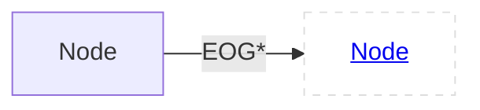
### ANNOTATIONS<a id="NodeANNOTATIONS"></a>
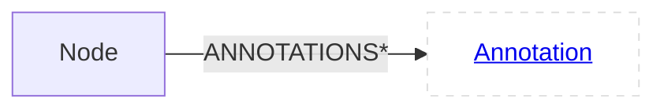
### AST<a id="NodeAST"></a>
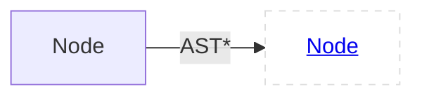
### SCOPE<a id="NodeSCOPE"></a>
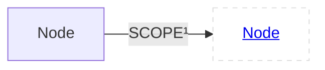
### TYPEDEFS<a id="NodeTYPEDEFS"></a>
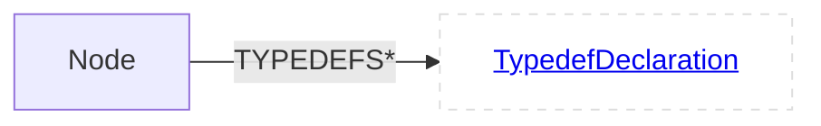
# Statement<a id="eStatement"></a>
**Labels**:<span style="background:#dddddd;
    border-radius:5%;
    line-height: 26px;
    display: inline-block;
    text-align: center;
    margin-bottom: 10px;
    padding-left: 10px;
    padding-right: 10px;">[Node](#enode)</span>	<span style="background:#aabbff;
    border-radius:5%;
    line-height: 26px;
    display: inline-block;
    text-align: center;
    margin-bottom: 10px;
    padding-left: 10px;
    padding-right: 10px;">[Statement](#estatement)</span>	
## Children
<span style="background:#dddddd;
    border-radius:5%;
    line-height: 26px;
    display: inline-block;
    text-align: center;
    margin-bottom: 10px;
    padding-left: 10px;
    padding-right: 10px;">[AssertStatement](#eassertstatement)</span>	<span style="background:#dddddd;
    border-radius:5%;
    line-height: 26px;
    display: inline-block;
    text-align: center;
    margin-bottom: 10px;
    padding-left: 10px;
    padding-right: 10px;">[DoStatement](#edostatement)</span>	<span style="background:#dddddd;
    border-radius:5%;
    line-height: 26px;
    display: inline-block;
    text-align: center;
    margin-bottom: 10px;
    padding-left: 10px;
    padding-right: 10px;">[CaseStatement](#ecasestatement)</span>	<span style="background:#dddddd;
    border-radius:5%;
    line-height: 26px;
    display: inline-block;
    text-align: center;
    margin-bottom: 10px;
    padding-left: 10px;
    padding-right: 10px;">[ReturnStatement](#ereturnstatement)</span>	<span style="background:#dddddd;
    border-radius:5%;
    line-height: 26px;
    display: inline-block;
    text-align: center;
    margin-bottom: 10px;
    padding-left: 10px;
    padding-right: 10px;">[Expression](#eexpression)</span>	<span style="background:#dddddd;
    border-radius:5%;
    line-height: 26px;
    display: inline-block;
    text-align: center;
    margin-bottom: 10px;
    padding-left: 10px;
    padding-right: 10px;">[IfStatement](#eifstatement)</span>	<span style="background:#dddddd;
    border-radius:5%;
    line-height: 26px;
    display: inline-block;
    text-align: center;
    margin-bottom: 10px;
    padding-left: 10px;
    padding-right: 10px;">[DeclarationStatement](#edeclarationstatement)</span>	<span style="background:#dddddd;
    border-radius:5%;
    line-height: 26px;
    display: inline-block;
    text-align: center;
    margin-bottom: 10px;
    padding-left: 10px;
    padding-right: 10px;">[ForStatement](#eforstatement)</span>	<span style="background:#dddddd;
    border-radius:5%;
    line-height: 26px;
    display: inline-block;
    text-align: center;
    margin-bottom: 10px;
    padding-left: 10px;
    padding-right: 10px;">[CatchClause](#ecatchclause)</span>	<span style="background:#dddddd;
    border-radius:5%;
    line-height: 26px;
    display: inline-block;
    text-align: center;
    margin-bottom: 10px;
    padding-left: 10px;
    padding-right: 10px;">[SwitchStatement](#eswitchstatement)</span>	<span style="background:#dddddd;
    border-radius:5%;
    line-height: 26px;
    display: inline-block;
    text-align: center;
    margin-bottom: 10px;
    padding-left: 10px;
    padding-right: 10px;">[GotoStatement](#egotostatement)</span>	<span style="background:#dddddd;
    border-radius:5%;
    line-height: 26px;
    display: inline-block;
    text-align: center;
    margin-bottom: 10px;
    padding-left: 10px;
    padding-right: 10px;">[WhileStatement](#ewhilestatement)</span>	<span style="background:#dddddd;
    border-radius:5%;
    line-height: 26px;
    display: inline-block;
    text-align: center;
    margin-bottom: 10px;
    padding-left: 10px;
    padding-right: 10px;">[CompoundStatement](#ecompoundstatement)</span>	<span style="background:#dddddd;
    border-radius:5%;
    line-height: 26px;
    display: inline-block;
    text-align: center;
    margin-bottom: 10px;
    padding-left: 10px;
    padding-right: 10px;">[ContinueStatement](#econtinuestatement)</span>	<span style="background:#dddddd;
    border-radius:5%;
    line-height: 26px;
    display: inline-block;
    text-align: center;
    margin-bottom: 10px;
    padding-left: 10px;
    padding-right: 10px;">[DefaultStatement](#edefaultstatement)</span>	<span style="background:#dddddd;
    border-radius:5%;
    line-height: 26px;
    display: inline-block;
    text-align: center;
    margin-bottom: 10px;
    padding-left: 10px;
    padding-right: 10px;">[SynchronizedStatement](#esynchronizedstatement)</span>	<span style="background:#dddddd;
    border-radius:5%;
    line-height: 26px;
    display: inline-block;
    text-align: center;
    margin-bottom: 10px;
    padding-left: 10px;
    padding-right: 10px;">[TryStatement](#etrystatement)</span>	<span style="background:#dddddd;
    border-radius:5%;
    line-height: 26px;
    display: inline-block;
    text-align: center;
    margin-bottom: 10px;
    padding-left: 10px;
    padding-right: 10px;">[ForEachStatement](#eforeachstatement)</span>	<span style="background:#dddddd;
    border-radius:5%;
    line-height: 26px;
    display: inline-block;
    text-align: center;
    margin-bottom: 10px;
    padding-left: 10px;
    padding-right: 10px;">[LabelStatement](#elabelstatement)</span>	<span style="background:#dddddd;
    border-radius:5%;
    line-height: 26px;
    display: inline-block;
    text-align: center;
    margin-bottom: 10px;
    padding-left: 10px;
    padding-right: 10px;">[BreakStatement](#ebreakstatement)</span>	<span style="background:#dddddd;
    border-radius:5%;
    line-height: 26px;
    display: inline-block;
    text-align: center;
    margin-bottom: 10px;
    padding-left: 10px;
    padding-right: 10px;">[EmptyStatement](#eemptystatement)</span>	
## Relationships
<span style="background:#aaffbb;
    border-radius:5%;
    line-height: 26px;
    display: inline-block;
    text-align: center;
    margin-bottom: 10px;
    padding-left: 10px;
    padding-right: 10px;">[LOCALS](#StatementLOCALS)</span>	
<span style="background:#dddddd;
    border-radius:5%;
    line-height: 26px;
    display: inline-block;
    text-align: center;
    margin-bottom: 10px;
    padding-left: 10px;
    padding-right: 10px;">[DFG](#NodeDFG)</span>	
<span style="background:#dddddd;
    border-radius:5%;
    line-height: 26px;
    display: inline-block;
    text-align: center;
    margin-bottom: 10px;
    padding-left: 10px;
    padding-right: 10px;">[EOG](#NodeEOG)</span>	
<span style="background:#dddddd;
    border-radius:5%;
    line-height: 26px;
    display: inline-block;
    text-align: center;
    margin-bottom: 10px;
    padding-left: 10px;
    padding-right: 10px;">[ANNOTATIONS](#NodeANNOTATIONS)</span>	
<span style="background:#dddddd;
    border-radius:5%;
    line-height: 26px;
    display: inline-block;
    text-align: center;
    margin-bottom: 10px;
    padding-left: 10px;
    padding-right: 10px;">[AST](#NodeAST)</span>	
<span style="background:#dddddd;
    border-radius:5%;
    line-height: 26px;
    display: inline-block;
    text-align: center;
    margin-bottom: 10px;
    padding-left: 10px;
    padding-right: 10px;">[SCOPE](#NodeSCOPE)</span>	
<span style="background:#dddddd;
    border-radius:5%;
    line-height: 26px;
    display: inline-block;
    text-align: center;
    margin-bottom: 10px;
    padding-left: 10px;
    padding-right: 10px;">[TYPEDEFS](#NodeTYPEDEFS)</span>	
### LOCALS<a id="StatementLOCALS"></a>
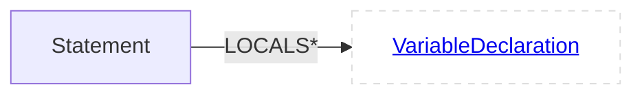
# AssertStatement<a id="eAssertStatement"></a>
**Labels**:<span style="background:#dddddd;
    border-radius:5%;
    line-height: 26px;
    display: inline-block;
    text-align: center;
    margin-bottom: 10px;
    padding-left: 10px;
    padding-right: 10px;">[Node](#enode)</span>	<span style="background:#dddddd;
    border-radius:5%;
    line-height: 26px;
    display: inline-block;
    text-align: center;
    margin-bottom: 10px;
    padding-left: 10px;
    padding-right: 10px;">[Statement](#estatement)</span>	<span style="background:#aabbff;
    border-radius:5%;
    line-height: 26px;
    display: inline-block;
    text-align: center;
    margin-bottom: 10px;
    padding-left: 10px;
    padding-right: 10px;">[AssertStatement](#eassertstatement)</span>	
## Relationships
<span style="background:#aaffbb;
    border-radius:5%;
    line-height: 26px;
    display: inline-block;
    text-align: center;
    margin-bottom: 10px;
    padding-left: 10px;
    padding-right: 10px;">[CONDITION](#AssertStatementCONDITION)</span>	
<span style="background:#aaffbb;
    border-radius:5%;
    line-height: 26px;
    display: inline-block;
    text-align: center;
    margin-bottom: 10px;
    padding-left: 10px;
    padding-right: 10px;">[MESSAGE](#AssertStatementMESSAGE)</span>	
<span style="background:#dddddd;
    border-radius:5%;
    line-height: 26px;
    display: inline-block;
    text-align: center;
    margin-bottom: 10px;
    padding-left: 10px;
    padding-right: 10px;">[LOCALS](#StatementLOCALS)</span>	
<span style="background:#dddddd;
    border-radius:5%;
    line-height: 26px;
    display: inline-block;
    text-align: center;
    margin-bottom: 10px;
    padding-left: 10px;
    padding-right: 10px;">[DFG](#NodeDFG)</span>	
<span style="background:#dddddd;
    border-radius:5%;
    line-height: 26px;
    display: inline-block;
    text-align: center;
    margin-bottom: 10px;
    padding-left: 10px;
    padding-right: 10px;">[EOG](#NodeEOG)</span>	
<span style="background:#dddddd;
    border-radius:5%;
    line-height: 26px;
    display: inline-block;
    text-align: center;
    margin-bottom: 10px;
    padding-left: 10px;
    padding-right: 10px;">[ANNOTATIONS](#NodeANNOTATIONS)</span>	
<span style="background:#dddddd;
    border-radius:5%;
    line-height: 26px;
    display: inline-block;
    text-align: center;
    margin-bottom: 10px;
    padding-left: 10px;
    padding-right: 10px;">[AST](#NodeAST)</span>	
<span style="background:#dddddd;
    border-radius:5%;
    line-height: 26px;
    display: inline-block;
    text-align: center;
    margin-bottom: 10px;
    padding-left: 10px;
    padding-right: 10px;">[SCOPE](#NodeSCOPE)</span>	
<span style="background:#dddddd;
    border-radius:5%;
    line-height: 26px;
    display: inline-block;
    text-align: center;
    margin-bottom: 10px;
    padding-left: 10px;
    padding-right: 10px;">[TYPEDEFS](#NodeTYPEDEFS)</span>	
### CONDITION<a id="AssertStatementCONDITION"></a>
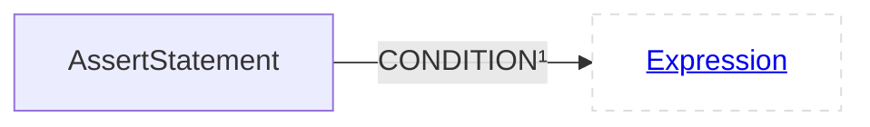
### MESSAGE<a id="AssertStatementMESSAGE"></a>
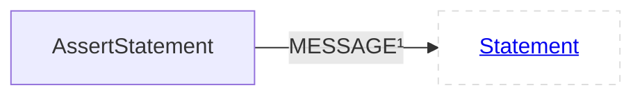
# DoStatement<a id="eDoStatement"></a>
**Labels**:<span style="background:#dddddd;
    border-radius:5%;
    line-height: 26px;
    display: inline-block;
    text-align: center;
    margin-bottom: 10px;
    padding-left: 10px;
    padding-right: 10px;">[Node](#enode)</span>	<span style="background:#dddddd;
    border-radius:5%;
    line-height: 26px;
    display: inline-block;
    text-align: center;
    margin-bottom: 10px;
    padding-left: 10px;
    padding-right: 10px;">[Statement](#estatement)</span>	<span style="background:#aabbff;
    border-radius:5%;
    line-height: 26px;
    display: inline-block;
    text-align: center;
    margin-bottom: 10px;
    padding-left: 10px;
    padding-right: 10px;">[DoStatement](#edostatement)</span>	
## Relationships
<span style="background:#aaffbb;
    border-radius:5%;
    line-height: 26px;
    display: inline-block;
    text-align: center;
    margin-bottom: 10px;
    padding-left: 10px;
    padding-right: 10px;">[CONDITION](#DoStatementCONDITION)</span>	
<span style="background:#aaffbb;
    border-radius:5%;
    line-height: 26px;
    display: inline-block;
    text-align: center;
    margin-bottom: 10px;
    padding-left: 10px;
    padding-right: 10px;">[STATEMENT](#DoStatementSTATEMENT)</span>	
<span style="background:#dddddd;
    border-radius:5%;
    line-height: 26px;
    display: inline-block;
    text-align: center;
    margin-bottom: 10px;
    padding-left: 10px;
    padding-right: 10px;">[LOCALS](#StatementLOCALS)</span>	
<span style="background:#dddddd;
    border-radius:5%;
    line-height: 26px;
    display: inline-block;
    text-align: center;
    margin-bottom: 10px;
    padding-left: 10px;
    padding-right: 10px;">[DFG](#NodeDFG)</span>	
<span style="background:#dddddd;
    border-radius:5%;
    line-height: 26px;
    display: inline-block;
    text-align: center;
    margin-bottom: 10px;
    padding-left: 10px;
    padding-right: 10px;">[EOG](#NodeEOG)</span>	
<span style="background:#dddddd;
    border-radius:5%;
    line-height: 26px;
    display: inline-block;
    text-align: center;
    margin-bottom: 10px;
    padding-left: 10px;
    padding-right: 10px;">[ANNOTATIONS](#NodeANNOTATIONS)</span>	
<span style="background:#dddddd;
    border-radius:5%;
    line-height: 26px;
    display: inline-block;
    text-align: center;
    margin-bottom: 10px;
    padding-left: 10px;
    padding-right: 10px;">[AST](#NodeAST)</span>	
<span style="background:#dddddd;
    border-radius:5%;
    line-height: 26px;
    display: inline-block;
    text-align: center;
    margin-bottom: 10px;
    padding-left: 10px;
    padding-right: 10px;">[SCOPE](#NodeSCOPE)</span>	
<span style="background:#dddddd;
    border-radius:5%;
    line-height: 26px;
    display: inline-block;
    text-align: center;
    margin-bottom: 10px;
    padding-left: 10px;
    padding-right: 10px;">[TYPEDEFS](#NodeTYPEDEFS)</span>	
### CONDITION<a id="DoStatementCONDITION"></a>

### STATEMENT<a id="DoStatementSTATEMENT"></a>

# CaseStatement<a id="eCaseStatement"></a>
**Labels**:<span style="background:#dddddd;
    border-radius:5%;
    line-height: 26px;
    display: inline-block;
    text-align: center;
    margin-bottom: 10px;
    padding-left: 10px;
    padding-right: 10px;">[Node](#enode)</span>	<span style="background:#dddddd;
    border-radius:5%;
    line-height: 26px;
    display: inline-block;
    text-align: center;
    margin-bottom: 10px;
    padding-left: 10px;
    padding-right: 10px;">[Statement](#estatement)</span>	<span style="background:#aabbff;
    border-radius:5%;
    line-height: 26px;
    display: inline-block;
    text-align: center;
    margin-bottom: 10px;
    padding-left: 10px;
    padding-right: 10px;">[CaseStatement](#ecasestatement)</span>	
## Relationships
<span style="background:#aaffbb;
    border-radius:5%;
    line-height: 26px;
    display: inline-block;
    text-align: center;
    margin-bottom: 10px;
    padding-left: 10px;
    padding-right: 10px;">[CASE_EXPRESSION](#CaseStatementCASE_EXPRESSION)</span>	
<span style="background:#dddddd;
    border-radius:5%;
    line-height: 26px;
    display: inline-block;
    text-align: center;
    margin-bottom: 10px;
    padding-left: 10px;
    padding-right: 10px;">[LOCALS](#StatementLOCALS)</span>	
<span style="background:#dddddd;
    border-radius:5%;
    line-height: 26px;
    display: inline-block;
    text-align: center;
    margin-bottom: 10px;
    padding-left: 10px;
    padding-right: 10px;">[DFG](#NodeDFG)</span>	
<span style="background:#dddddd;
    border-radius:5%;
    line-height: 26px;
    display: inline-block;
    text-align: center;
    margin-bottom: 10px;
    padding-left: 10px;
    padding-right: 10px;">[EOG](#NodeEOG)</span>	
<span style="background:#dddddd;
    border-radius:5%;
    line-height: 26px;
    display: inline-block;
    text-align: center;
    margin-bottom: 10px;
    padding-left: 10px;
    padding-right: 10px;">[ANNOTATIONS](#NodeANNOTATIONS)</span>	
<span style="background:#dddddd;
    border-radius:5%;
    line-height: 26px;
    display: inline-block;
    text-align: center;
    margin-bottom: 10px;
    padding-left: 10px;
    padding-right: 10px;">[AST](#NodeAST)</span>	
<span style="background:#dddddd;
    border-radius:5%;
    line-height: 26px;
    display: inline-block;
    text-align: center;
    margin-bottom: 10px;
    padding-left: 10px;
    padding-right: 10px;">[SCOPE](#NodeSCOPE)</span>	
<span style="background:#dddddd;
    border-radius:5%;
    line-height: 26px;
    display: inline-block;
    text-align: center;
    margin-bottom: 10px;
    padding-left: 10px;
    padding-right: 10px;">[TYPEDEFS](#NodeTYPEDEFS)</span>	
### CASE_EXPRESSION<a id="CaseStatementCASE_EXPRESSION"></a>
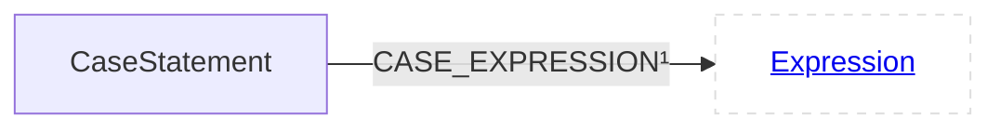
# ReturnStatement<a id="eReturnStatement"></a>
**Labels**:<span style="background:#dddddd;
    border-radius:5%;
    line-height: 26px;
    display: inline-block;
    text-align: center;
    margin-bottom: 10px;
    padding-left: 10px;
    padding-right: 10px;">[Node](#enode)</span>	<span style="background:#dddddd;
    border-radius:5%;
    line-height: 26px;
    display: inline-block;
    text-align: center;
    margin-bottom: 10px;
    padding-left: 10px;
    padding-right: 10px;">[Statement](#estatement)</span>	<span style="background:#aabbff;
    border-radius:5%;
    line-height: 26px;
    display: inline-block;
    text-align: center;
    margin-bottom: 10px;
    padding-left: 10px;
    padding-right: 10px;">[ReturnStatement](#ereturnstatement)</span>	
## Relationships
<span style="background:#aaffbb;
    border-radius:5%;
    line-height: 26px;
    display: inline-block;
    text-align: center;
    margin-bottom: 10px;
    padding-left: 10px;
    padding-right: 10px;">[RETURN_VALUES](#ReturnStatementRETURN_VALUES)</span>	
<span style="background:#dddddd;
    border-radius:5%;
    line-height: 26px;
    display: inline-block;
    text-align: center;
    margin-bottom: 10px;
    padding-left: 10px;
    padding-right: 10px;">[LOCALS](#StatementLOCALS)</span>	
<span style="background:#dddddd;
    border-radius:5%;
    line-height: 26px;
    display: inline-block;
    text-align: center;
    margin-bottom: 10px;
    padding-left: 10px;
    padding-right: 10px;">[DFG](#NodeDFG)</span>	
<span style="background:#dddddd;
    border-radius:5%;
    line-height: 26px;
    display: inline-block;
    text-align: center;
    margin-bottom: 10px;
    padding-left: 10px;
    padding-right: 10px;">[EOG](#NodeEOG)</span>	
<span style="background:#dddddd;
    border-radius:5%;
    line-height: 26px;
    display: inline-block;
    text-align: center;
    margin-bottom: 10px;
    padding-left: 10px;
    padding-right: 10px;">[ANNOTATIONS](#NodeANNOTATIONS)</span>	
<span style="background:#dddddd;
    border-radius:5%;
    line-height: 26px;
    display: inline-block;
    text-align: center;
    margin-bottom: 10px;
    padding-left: 10px;
    padding-right: 10px;">[AST](#NodeAST)</span>	
<span style="background:#dddddd;
    border-radius:5%;
    line-height: 26px;
    display: inline-block;
    text-align: center;
    margin-bottom: 10px;
    padding-left: 10px;
    padding-right: 10px;">[SCOPE](#NodeSCOPE)</span>	
<span style="background:#dddddd;
    border-radius:5%;
    line-height: 26px;
    display: inline-block;
    text-align: center;
    margin-bottom: 10px;
    padding-left: 10px;
    padding-right: 10px;">[TYPEDEFS](#NodeTYPEDEFS)</span>	
### RETURN_VALUES<a id="ReturnStatementRETURN_VALUES"></a>

# Expression<a id="eExpression"></a>
**Labels**:<span style="background:#dddddd;
    border-radius:5%;
    line-height: 26px;
    display: inline-block;
    text-align: center;
    margin-bottom: 10px;
    padding-left: 10px;
    padding-right: 10px;">[Node](#enode)</span>	<span style="background:#dddddd;
    border-radius:5%;
    line-height: 26px;
    display: inline-block;
    text-align: center;
    margin-bottom: 10px;
    padding-left: 10px;
    padding-right: 10px;">[Statement](#estatement)</span>	<span style="background:#aabbff;
    border-radius:5%;
    line-height: 26px;
    display: inline-block;
    text-align: center;
    margin-bottom: 10px;
    padding-left: 10px;
    padding-right: 10px;">[Expression](#eexpression)</span>	
## Children
<span style="background:#dddddd;
    border-radius:5%;
    line-height: 26px;
    display: inline-block;
    text-align: center;
    margin-bottom: 10px;
    padding-left: 10px;
    padding-right: 10px;">[NewExpression](#enewexpression)</span>	<span style="background:#dddddd;
    border-radius:5%;
    line-height: 26px;
    display: inline-block;
    text-align: center;
    margin-bottom: 10px;
    padding-left: 10px;
    padding-right: 10px;">[LambdaExpression](#elambdaexpression)</span>	<span style="background:#dddddd;
    border-radius:5%;
    line-height: 26px;
    display: inline-block;
    text-align: center;
    margin-bottom: 10px;
    padding-left: 10px;
    padding-right: 10px;">[UnaryOperator](#eunaryoperator)</span>	<span style="background:#dddddd;
    border-radius:5%;
    line-height: 26px;
    display: inline-block;
    text-align: center;
    margin-bottom: 10px;
    padding-left: 10px;
    padding-right: 10px;">[ArrayRangeExpression](#earrayrangeexpression)</span>	<span style="background:#dddddd;
    border-radius:5%;
    line-height: 26px;
    display: inline-block;
    text-align: center;
    margin-bottom: 10px;
    padding-left: 10px;
    padding-right: 10px;">[CallExpression](#ecallexpression)</span>	<span style="background:#dddddd;
    border-radius:5%;
    line-height: 26px;
    display: inline-block;
    text-align: center;
    margin-bottom: 10px;
    padding-left: 10px;
    padding-right: 10px;">[DesignatedInitializerExpression](#edesignatedinitializerexpression)</span>	<span style="background:#dddddd;
    border-radius:5%;
    line-height: 26px;
    display: inline-block;
    text-align: center;
    margin-bottom: 10px;
    padding-left: 10px;
    padding-right: 10px;">[KeyValueExpression](#ekeyvalueexpression)</span>	<span style="background:#dddddd;
    border-radius:5%;
    line-height: 26px;
    display: inline-block;
    text-align: center;
    margin-bottom: 10px;
    padding-left: 10px;
    padding-right: 10px;">[AssignExpression](#eassignexpression)</span>	<span style="background:#dddddd;
    border-radius:5%;
    line-height: 26px;
    display: inline-block;
    text-align: center;
    margin-bottom: 10px;
    padding-left: 10px;
    padding-right: 10px;">[CastExpression](#ecastexpression)</span>	<span style="background:#dddddd;
    border-radius:5%;
    line-height: 26px;
    display: inline-block;
    text-align: center;
    margin-bottom: 10px;
    padding-left: 10px;
    padding-right: 10px;">[ArrayCreationExpression](#earraycreationexpression)</span>	<span style="background:#dddddd;
    border-radius:5%;
    line-height: 26px;
    display: inline-block;
    text-align: center;
    margin-bottom: 10px;
    padding-left: 10px;
    padding-right: 10px;">[ArraySubscriptionExpression](#earraysubscriptionexpression)</span>	<span style="background:#dddddd;
    border-radius:5%;
    line-height: 26px;
    display: inline-block;
    text-align: center;
    margin-bottom: 10px;
    padding-left: 10px;
    padding-right: 10px;">[TypeExpression](#etypeexpression)</span>	<span style="background:#dddddd;
    border-radius:5%;
    line-height: 26px;
    display: inline-block;
    text-align: center;
    margin-bottom: 10px;
    padding-left: 10px;
    padding-right: 10px;">[BinaryOperator](#ebinaryoperator)</span>	<span style="background:#dddddd;
    border-radius:5%;
    line-height: 26px;
    display: inline-block;
    text-align: center;
    margin-bottom: 10px;
    padding-left: 10px;
    padding-right: 10px;">[ConditionalExpression](#econditionalexpression)</span>	<span style="background:#dddddd;
    border-radius:5%;
    line-height: 26px;
    display: inline-block;
    text-align: center;
    margin-bottom: 10px;
    padding-left: 10px;
    padding-right: 10px;">[DeclaredReferenceExpression](#edeclaredreferenceexpression)</span>	<span style="background:#dddddd;
    border-radius:5%;
    line-height: 26px;
    display: inline-block;
    text-align: center;
    margin-bottom: 10px;
    padding-left: 10px;
    padding-right: 10px;">[InitializerListExpression](#einitializerlistexpression)</span>	<span style="background:#dddddd;
    border-radius:5%;
    line-height: 26px;
    display: inline-block;
    text-align: center;
    margin-bottom: 10px;
    padding-left: 10px;
    padding-right: 10px;">[DeleteExpression](#edeleteexpression)</span>	<span style="background:#dddddd;
    border-radius:5%;
    line-height: 26px;
    display: inline-block;
    text-align: center;
    margin-bottom: 10px;
    padding-left: 10px;
    padding-right: 10px;">[CompoundStatementExpression](#ecompoundstatementexpression)</span>	<span style="background:#dddddd;
    border-radius:5%;
    line-height: 26px;
    display: inline-block;
    text-align: center;
    margin-bottom: 10px;
    padding-left: 10px;
    padding-right: 10px;">[ProblemExpression](#eproblemexpression)</span>	<span style="background:#dddddd;
    border-radius:5%;
    line-height: 26px;
    display: inline-block;
    text-align: center;
    margin-bottom: 10px;
    padding-left: 10px;
    padding-right: 10px;">[Literal](#eliteral)</span>	<span style="background:#dddddd;
    border-radius:5%;
    line-height: 26px;
    display: inline-block;
    text-align: center;
    margin-bottom: 10px;
    padding-left: 10px;
    padding-right: 10px;">[TypeIdExpression](#etypeidexpression)</span>	<span style="background:#dddddd;
    border-radius:5%;
    line-height: 26px;
    display: inline-block;
    text-align: center;
    margin-bottom: 10px;
    padding-left: 10px;
    padding-right: 10px;">[ExpressionList](#eexpressionlist)</span>	
## Relationships
<span style="background:#aaffbb;
    border-radius:5%;
    line-height: 26px;
    display: inline-block;
    text-align: center;
    margin-bottom: 10px;
    padding-left: 10px;
    padding-right: 10px;">[POSSIBLE_SUB_TYPES](#ExpressionPOSSIBLE_SUB_TYPES)</span>	
<span style="background:#aaffbb;
    border-radius:5%;
    line-height: 26px;
    display: inline-block;
    text-align: center;
    margin-bottom: 10px;
    padding-left: 10px;
    padding-right: 10px;">[TYPE](#ExpressionTYPE)</span>	
<span style="background:#dddddd;
    border-radius:5%;
    line-height: 26px;
    display: inline-block;
    text-align: center;
    margin-bottom: 10px;
    padding-left: 10px;
    padding-right: 10px;">[LOCALS](#StatementLOCALS)</span>	
<span style="background:#dddddd;
    border-radius:5%;
    line-height: 26px;
    display: inline-block;
    text-align: center;
    margin-bottom: 10px;
    padding-left: 10px;
    padding-right: 10px;">[DFG](#NodeDFG)</span>	
<span style="background:#dddddd;
    border-radius:5%;
    line-height: 26px;
    display: inline-block;
    text-align: center;
    margin-bottom: 10px;
    padding-left: 10px;
    padding-right: 10px;">[EOG](#NodeEOG)</span>	
<span style="background:#dddddd;
    border-radius:5%;
    line-height: 26px;
    display: inline-block;
    text-align: center;
    margin-bottom: 10px;
    padding-left: 10px;
    padding-right: 10px;">[ANNOTATIONS](#NodeANNOTATIONS)</span>	
<span style="background:#dddddd;
    border-radius:5%;
    line-height: 26px;
    display: inline-block;
    text-align: center;
    margin-bottom: 10px;
    padding-left: 10px;
    padding-right: 10px;">[AST](#NodeAST)</span>	
<span style="background:#dddddd;
    border-radius:5%;
    line-height: 26px;
    display: inline-block;
    text-align: center;
    margin-bottom: 10px;
    padding-left: 10px;
    padding-right: 10px;">[SCOPE](#NodeSCOPE)</span>	
<span style="background:#dddddd;
    border-radius:5%;
    line-height: 26px;
    display: inline-block;
    text-align: center;
    margin-bottom: 10px;
    padding-left: 10px;
    padding-right: 10px;">[TYPEDEFS](#NodeTYPEDEFS)</span>	
### POSSIBLE_SUB_TYPES<a id="ExpressionPOSSIBLE_SUB_TYPES"></a>
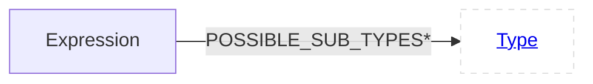
### TYPE<a id="ExpressionTYPE"></a>
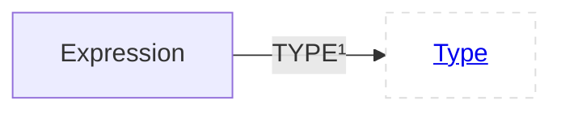
# NewExpression<a id="eNewExpression"></a>
**Labels**:<span style="background:#dddddd;
    border-radius:5%;
    line-height: 26px;
    display: inline-block;
    text-align: center;
    margin-bottom: 10px;
    padding-left: 10px;
    padding-right: 10px;">[Node](#enode)</span>	<span style="background:#dddddd;
    border-radius:5%;
    line-height: 26px;
    display: inline-block;
    text-align: center;
    margin-bottom: 10px;
    padding-left: 10px;
    padding-right: 10px;">[Statement](#estatement)</span>	<span style="background:#dddddd;
    border-radius:5%;
    line-height: 26px;
    display: inline-block;
    text-align: center;
    margin-bottom: 10px;
    padding-left: 10px;
    padding-right: 10px;">[Expression](#eexpression)</span>	<span style="background:#aabbff;
    border-radius:5%;
    line-height: 26px;
    display: inline-block;
    text-align: center;
    margin-bottom: 10px;
    padding-left: 10px;
    padding-right: 10px;">[NewExpression](#enewexpression)</span>	
## Relationships
<span style="background:#aaffbb;
    border-radius:5%;
    line-height: 26px;
    display: inline-block;
    text-align: center;
    margin-bottom: 10px;
    padding-left: 10px;
    padding-right: 10px;">[INITIALIZER](#NewExpressionINITIALIZER)</span>	
<span style="background:#aaffbb;
    border-radius:5%;
    line-height: 26px;
    display: inline-block;
    text-align: center;
    margin-bottom: 10px;
    padding-left: 10px;
    padding-right: 10px;">[TEMPLATE_PARAMETERS](#NewExpressionTEMPLATE_PARAMETERS)</span>	
<span style="background:#dddddd;
    border-radius:5%;
    line-height: 26px;
    display: inline-block;
    text-align: center;
    margin-bottom: 10px;
    padding-left: 10px;
    padding-right: 10px;">[POSSIBLE_SUB_TYPES](#ExpressionPOSSIBLE_SUB_TYPES)</span>	
<span style="background:#dddddd;
    border-radius:5%;
    line-height: 26px;
    display: inline-block;
    text-align: center;
    margin-bottom: 10px;
    padding-left: 10px;
    padding-right: 10px;">[TYPE](#ExpressionTYPE)</span>	
<span style="background:#dddddd;
    border-radius:5%;
    line-height: 26px;
    display: inline-block;
    text-align: center;
    margin-bottom: 10px;
    padding-left: 10px;
    padding-right: 10px;">[LOCALS](#StatementLOCALS)</span>	
<span style="background:#dddddd;
    border-radius:5%;
    line-height: 26px;
    display: inline-block;
    text-align: center;
    margin-bottom: 10px;
    padding-left: 10px;
    padding-right: 10px;">[DFG](#NodeDFG)</span>	
<span style="background:#dddddd;
    border-radius:5%;
    line-height: 26px;
    display: inline-block;
    text-align: center;
    margin-bottom: 10px;
    padding-left: 10px;
    padding-right: 10px;">[EOG](#NodeEOG)</span>	
<span style="background:#dddddd;
    border-radius:5%;
    line-height: 26px;
    display: inline-block;
    text-align: center;
    margin-bottom: 10px;
    padding-left: 10px;
    padding-right: 10px;">[ANNOTATIONS](#NodeANNOTATIONS)</span>	
<span style="background:#dddddd;
    border-radius:5%;
    line-height: 26px;
    display: inline-block;
    text-align: center;
    margin-bottom: 10px;
    padding-left: 10px;
    padding-right: 10px;">[AST](#NodeAST)</span>	
<span style="background:#dddddd;
    border-radius:5%;
    line-height: 26px;
    display: inline-block;
    text-align: center;
    margin-bottom: 10px;
    padding-left: 10px;
    padding-right: 10px;">[SCOPE](#NodeSCOPE)</span>	
<span style="background:#dddddd;
    border-radius:5%;
    line-height: 26px;
    display: inline-block;
    text-align: center;
    margin-bottom: 10px;
    padding-left: 10px;
    padding-right: 10px;">[TYPEDEFS](#NodeTYPEDEFS)</span>	
### INITIALIZER<a id="NewExpressionINITIALIZER"></a>

### TEMPLATE_PARAMETERS<a id="NewExpressionTEMPLATE_PARAMETERS"></a>

# LambdaExpression<a id="eLambdaExpression"></a>
**Labels**:<span style="background:#dddddd;
    border-radius:5%;
    line-height: 26px;
    display: inline-block;
    text-align: center;
    margin-bottom: 10px;
    padding-left: 10px;
    padding-right: 10px;">[Node](#enode)</span>	<span style="background:#dddddd;
    border-radius:5%;
    line-height: 26px;
    display: inline-block;
    text-align: center;
    margin-bottom: 10px;
    padding-left: 10px;
    padding-right: 10px;">[Statement](#estatement)</span>	<span style="background:#dddddd;
    border-radius:5%;
    line-height: 26px;
    display: inline-block;
    text-align: center;
    margin-bottom: 10px;
    padding-left: 10px;
    padding-right: 10px;">[Expression](#eexpression)</span>	<span style="background:#aabbff;
    border-radius:5%;
    line-height: 26px;
    display: inline-block;
    text-align: center;
    margin-bottom: 10px;
    padding-left: 10px;
    padding-right: 10px;">[LambdaExpression](#elambdaexpression)</span>	
## Relationships
<span style="background:#aaffbb;
    border-radius:5%;
    line-height: 26px;
    display: inline-block;
    text-align: center;
    margin-bottom: 10px;
    padding-left: 10px;
    padding-right: 10px;">[MUTABLE_VARIABLES](#LambdaExpressionMUTABLE_VARIABLES)</span>	
<span style="background:#aaffbb;
    border-radius:5%;
    line-height: 26px;
    display: inline-block;
    text-align: center;
    margin-bottom: 10px;
    padding-left: 10px;
    padding-right: 10px;">[FUNCTION](#LambdaExpressionFUNCTION)</span>	
<span style="background:#dddddd;
    border-radius:5%;
    line-height: 26px;
    display: inline-block;
    text-align: center;
    margin-bottom: 10px;
    padding-left: 10px;
    padding-right: 10px;">[POSSIBLE_SUB_TYPES](#ExpressionPOSSIBLE_SUB_TYPES)</span>	
<span style="background:#dddddd;
    border-radius:5%;
    line-height: 26px;
    display: inline-block;
    text-align: center;
    margin-bottom: 10px;
    padding-left: 10px;
    padding-right: 10px;">[TYPE](#ExpressionTYPE)</span>	
<span style="background:#dddddd;
    border-radius:5%;
    line-height: 26px;
    display: inline-block;
    text-align: center;
    margin-bottom: 10px;
    padding-left: 10px;
    padding-right: 10px;">[LOCALS](#StatementLOCALS)</span>	
<span style="background:#dddddd;
    border-radius:5%;
    line-height: 26px;
    display: inline-block;
    text-align: center;
    margin-bottom: 10px;
    padding-left: 10px;
    padding-right: 10px;">[DFG](#NodeDFG)</span>	
<span style="background:#dddddd;
    border-radius:5%;
    line-height: 26px;
    display: inline-block;
    text-align: center;
    margin-bottom: 10px;
    padding-left: 10px;
    padding-right: 10px;">[EOG](#NodeEOG)</span>	
<span style="background:#dddddd;
    border-radius:5%;
    line-height: 26px;
    display: inline-block;
    text-align: center;
    margin-bottom: 10px;
    padding-left: 10px;
    padding-right: 10px;">[ANNOTATIONS](#NodeANNOTATIONS)</span>	
<span style="background:#dddddd;
    border-radius:5%;
    line-height: 26px;
    display: inline-block;
    text-align: center;
    margin-bottom: 10px;
    padding-left: 10px;
    padding-right: 10px;">[AST](#NodeAST)</span>	
<span style="background:#dddddd;
    border-radius:5%;
    line-height: 26px;
    display: inline-block;
    text-align: center;
    margin-bottom: 10px;
    padding-left: 10px;
    padding-right: 10px;">[SCOPE](#NodeSCOPE)</span>	
<span style="background:#dddddd;
    border-radius:5%;
    line-height: 26px;
    display: inline-block;
    text-align: center;
    margin-bottom: 10px;
    padding-left: 10px;
    padding-right: 10px;">[TYPEDEFS](#NodeTYPEDEFS)</span>	
### MUTABLE_VARIABLES<a id="LambdaExpressionMUTABLE_VARIABLES"></a>
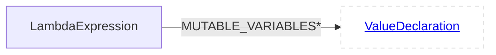
### FUNCTION<a id="LambdaExpressionFUNCTION"></a>
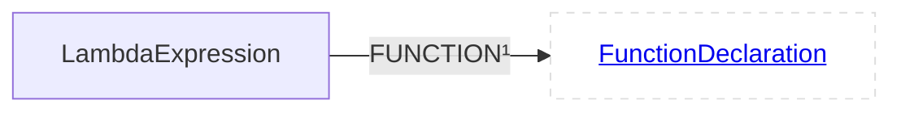
# UnaryOperator<a id="eUnaryOperator"></a>
**Labels**:<span style="background:#dddddd;
    border-radius:5%;
    line-height: 26px;
    display: inline-block;
    text-align: center;
    margin-bottom: 10px;
    padding-left: 10px;
    padding-right: 10px;">[Node](#enode)</span>	<span style="background:#dddddd;
    border-radius:5%;
    line-height: 26px;
    display: inline-block;
    text-align: center;
    margin-bottom: 10px;
    padding-left: 10px;
    padding-right: 10px;">[Statement](#estatement)</span>	<span style="background:#dddddd;
    border-radius:5%;
    line-height: 26px;
    display: inline-block;
    text-align: center;
    margin-bottom: 10px;
    padding-left: 10px;
    padding-right: 10px;">[Expression](#eexpression)</span>	<span style="background:#aabbff;
    border-radius:5%;
    line-height: 26px;
    display: inline-block;
    text-align: center;
    margin-bottom: 10px;
    padding-left: 10px;
    padding-right: 10px;">[UnaryOperator](#eunaryoperator)</span>	
## Relationships
<span style="background:#aaffbb;
    border-radius:5%;
    line-height: 26px;
    display: inline-block;
    text-align: center;
    margin-bottom: 10px;
    padding-left: 10px;
    padding-right: 10px;">[INPUT](#UnaryOperatorINPUT)</span>	
<span style="background:#dddddd;
    border-radius:5%;
    line-height: 26px;
    display: inline-block;
    text-align: center;
    margin-bottom: 10px;
    padding-left: 10px;
    padding-right: 10px;">[POSSIBLE_SUB_TYPES](#ExpressionPOSSIBLE_SUB_TYPES)</span>	
<span style="background:#dddddd;
    border-radius:5%;
    line-height: 26px;
    display: inline-block;
    text-align: center;
    margin-bottom: 10px;
    padding-left: 10px;
    padding-right: 10px;">[TYPE](#ExpressionTYPE)</span>	
<span style="background:#dddddd;
    border-radius:5%;
    line-height: 26px;
    display: inline-block;
    text-align: center;
    margin-bottom: 10px;
    padding-left: 10px;
    padding-right: 10px;">[LOCALS](#StatementLOCALS)</span>	
<span style="background:#dddddd;
    border-radius:5%;
    line-height: 26px;
    display: inline-block;
    text-align: center;
    margin-bottom: 10px;
    padding-left: 10px;
    padding-right: 10px;">[DFG](#NodeDFG)</span>	
<span style="background:#dddddd;
    border-radius:5%;
    line-height: 26px;
    display: inline-block;
    text-align: center;
    margin-bottom: 10px;
    padding-left: 10px;
    padding-right: 10px;">[EOG](#NodeEOG)</span>	
<span style="background:#dddddd;
    border-radius:5%;
    line-height: 26px;
    display: inline-block;
    text-align: center;
    margin-bottom: 10px;
    padding-left: 10px;
    padding-right: 10px;">[ANNOTATIONS](#NodeANNOTATIONS)</span>	
<span style="background:#dddddd;
    border-radius:5%;
    line-height: 26px;
    display: inline-block;
    text-align: center;
    margin-bottom: 10px;
    padding-left: 10px;
    padding-right: 10px;">[AST](#NodeAST)</span>	
<span style="background:#dddddd;
    border-radius:5%;
    line-height: 26px;
    display: inline-block;
    text-align: center;
    margin-bottom: 10px;
    padding-left: 10px;
    padding-right: 10px;">[SCOPE](#NodeSCOPE)</span>	
<span style="background:#dddddd;
    border-radius:5%;
    line-height: 26px;
    display: inline-block;
    text-align: center;
    margin-bottom: 10px;
    padding-left: 10px;
    padding-right: 10px;">[TYPEDEFS](#NodeTYPEDEFS)</span>	
### INPUT<a id="UnaryOperatorINPUT"></a>
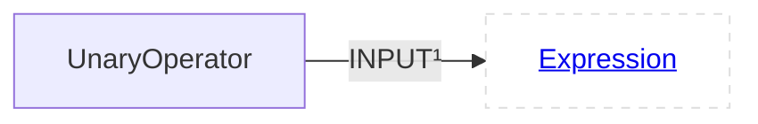
# ArrayRangeExpression<a id="eArrayRangeExpression"></a>
**Labels**:<span style="background:#dddddd;
    border-radius:5%;
    line-height: 26px;
    display: inline-block;
    text-align: center;
    margin-bottom: 10px;
    padding-left: 10px;
    padding-right: 10px;">[Node](#enode)</span>	<span style="background:#dddddd;
    border-radius:5%;
    line-height: 26px;
    display: inline-block;
    text-align: center;
    margin-bottom: 10px;
    padding-left: 10px;
    padding-right: 10px;">[Statement](#estatement)</span>	<span style="background:#dddddd;
    border-radius:5%;
    line-height: 26px;
    display: inline-block;
    text-align: center;
    margin-bottom: 10px;
    padding-left: 10px;
    padding-right: 10px;">[Expression](#eexpression)</span>	<span style="background:#aabbff;
    border-radius:5%;
    line-height: 26px;
    display: inline-block;
    text-align: center;
    margin-bottom: 10px;
    padding-left: 10px;
    padding-right: 10px;">[ArrayRangeExpression](#earrayrangeexpression)</span>	
## Relationships
<span style="background:#aaffbb;
    border-radius:5%;
    line-height: 26px;
    display: inline-block;
    text-align: center;
    margin-bottom: 10px;
    padding-left: 10px;
    padding-right: 10px;">[CEILING](#ArrayRangeExpressionCEILING)</span>	
<span style="background:#aaffbb;
    border-radius:5%;
    line-height: 26px;
    display: inline-block;
    text-align: center;
    margin-bottom: 10px;
    padding-left: 10px;
    padding-right: 10px;">[STEP](#ArrayRangeExpressionSTEP)</span>	
<span style="background:#aaffbb;
    border-radius:5%;
    line-height: 26px;
    display: inline-block;
    text-align: center;
    margin-bottom: 10px;
    padding-left: 10px;
    padding-right: 10px;">[FLOOR](#ArrayRangeExpressionFLOOR)</span>	
<span style="background:#dddddd;
    border-radius:5%;
    line-height: 26px;
    display: inline-block;
    text-align: center;
    margin-bottom: 10px;
    padding-left: 10px;
    padding-right: 10px;">[POSSIBLE_SUB_TYPES](#ExpressionPOSSIBLE_SUB_TYPES)</span>	
<span style="background:#dddddd;
    border-radius:5%;
    line-height: 26px;
    display: inline-block;
    text-align: center;
    margin-bottom: 10px;
    padding-left: 10px;
    padding-right: 10px;">[TYPE](#ExpressionTYPE)</span>	
<span style="background:#dddddd;
    border-radius:5%;
    line-height: 26px;
    display: inline-block;
    text-align: center;
    margin-bottom: 10px;
    padding-left: 10px;
    padding-right: 10px;">[LOCALS](#StatementLOCALS)</span>	
<span style="background:#dddddd;
    border-radius:5%;
    line-height: 26px;
    display: inline-block;
    text-align: center;
    margin-bottom: 10px;
    padding-left: 10px;
    padding-right: 10px;">[DFG](#NodeDFG)</span>	
<span style="background:#dddddd;
    border-radius:5%;
    line-height: 26px;
    display: inline-block;
    text-align: center;
    margin-bottom: 10px;
    padding-left: 10px;
    padding-right: 10px;">[EOG](#NodeEOG)</span>	
<span style="background:#dddddd;
    border-radius:5%;
    line-height: 26px;
    display: inline-block;
    text-align: center;
    margin-bottom: 10px;
    padding-left: 10px;
    padding-right: 10px;">[ANNOTATIONS](#NodeANNOTATIONS)</span>	
<span style="background:#dddddd;
    border-radius:5%;
    line-height: 26px;
    display: inline-block;
    text-align: center;
    margin-bottom: 10px;
    padding-left: 10px;
    padding-right: 10px;">[AST](#NodeAST)</span>	
<span style="background:#dddddd;
    border-radius:5%;
    line-height: 26px;
    display: inline-block;
    text-align: center;
    margin-bottom: 10px;
    padding-left: 10px;
    padding-right: 10px;">[SCOPE](#NodeSCOPE)</span>	
<span style="background:#dddddd;
    border-radius:5%;
    line-height: 26px;
    display: inline-block;
    text-align: center;
    margin-bottom: 10px;
    padding-left: 10px;
    padding-right: 10px;">[TYPEDEFS](#NodeTYPEDEFS)</span>	
### CEILING<a id="ArrayRangeExpressionCEILING"></a>
```mermaid
flowchart LR
  classDef outer fill:#fff,stroke:#ddd,stroke-dasharray:5 5;  classDef special fill:#afa,stroke:#5a5,stroke-dasharray:5 5;
ArrayRangeExpression--"CEILING¹"-->ArrayRangeExpressionCEILING[<a href='#eexpression'>Expression</a>]:::outer
```
### STEP<a id="ArrayRangeExpressionSTEP"></a>
```mermaid
flowchart LR
  classDef outer fill:#fff,stroke:#ddd,stroke-dasharray:5 5;  classDef special fill:#afa,stroke:#5a5,stroke-dasharray:5 5;
ArrayRangeExpression--"STEP¹"-->ArrayRangeExpressionSTEP[<a href='#eexpression'>Expression</a>]:::outer
```
### FLOOR<a id="ArrayRangeExpressionFLOOR"></a>
```mermaid
flowchart LR
  classDef outer fill:#fff,stroke:#ddd,stroke-dasharray:5 5;  classDef special fill:#afa,stroke:#5a5,stroke-dasharray:5 5;
ArrayRangeExpression--"FLOOR¹"-->ArrayRangeExpressionFLOOR[<a href='#eexpression'>Expression</a>]:::outer
```
# CallExpression<a id="eCallExpression"></a>
**Labels**:<span style="background:#dddddd;
    border-radius:5%;
    line-height: 26px;
    display: inline-block;
    text-align: center;
    margin-bottom: 10px;
    padding-left: 10px;
    padding-right: 10px;">[Node](#enode)</span>	<span style="background:#dddddd;
    border-radius:5%;
    line-height: 26px;
    display: inline-block;
    text-align: center;
    margin-bottom: 10px;
    padding-left: 10px;
    padding-right: 10px;">[Statement](#estatement)</span>	<span style="background:#dddddd;
    border-radius:5%;
    line-height: 26px;
    display: inline-block;
    text-align: center;
    margin-bottom: 10px;
    padding-left: 10px;
    padding-right: 10px;">[Expression](#eexpression)</span>	<span style="background:#aabbff;
    border-radius:5%;
    line-height: 26px;
    display: inline-block;
    text-align: center;
    margin-bottom: 10px;
    padding-left: 10px;
    padding-right: 10px;">[CallExpression](#ecallexpression)</span>	
## Children
<span style="background:#dddddd;
    border-radius:5%;
    line-height: 26px;
    display: inline-block;
    text-align: center;
    margin-bottom: 10px;
    padding-left: 10px;
    padding-right: 10px;">[ExplicitConstructorInvocation](#eexplicitconstructorinvocation)</span>	<span style="background:#dddddd;
    border-radius:5%;
    line-height: 26px;
    display: inline-block;
    text-align: center;
    margin-bottom: 10px;
    padding-left: 10px;
    padding-right: 10px;">[ConstructExpression](#econstructexpression)</span>	<span style="background:#dddddd;
    border-radius:5%;
    line-height: 26px;
    display: inline-block;
    text-align: center;
    margin-bottom: 10px;
    padding-left: 10px;
    padding-right: 10px;">[MemberCallExpression](#emembercallexpression)</span>	
## Relationships
<span style="background:#aaffbb;
    border-radius:5%;
    line-height: 26px;
    display: inline-block;
    text-align: center;
    margin-bottom: 10px;
    padding-left: 10px;
    padding-right: 10px;">[CALLEE](#CallExpressionCALLEE)</span>	
<span style="background:#aaffbb;
    border-radius:5%;
    line-height: 26px;
    display: inline-block;
    text-align: center;
    margin-bottom: 10px;
    padding-left: 10px;
    padding-right: 10px;">[INVOKES](#CallExpressionINVOKES)</span>	
<span style="background:#aaffbb;
    border-radius:5%;
    line-height: 26px;
    display: inline-block;
    text-align: center;
    margin-bottom: 10px;
    padding-left: 10px;
    padding-right: 10px;">[TEMPLATE_INSTANTIATION](#CallExpressionTEMPLATE_INSTANTIATION)</span>	
<span style="background:#aaffbb;
    border-radius:5%;
    line-height: 26px;
    display: inline-block;
    text-align: center;
    margin-bottom: 10px;
    padding-left: 10px;
    padding-right: 10px;">[ARGUMENTS](#CallExpressionARGUMENTS)</span>	
<span style="background:#aaffbb;
    border-radius:5%;
    line-height: 26px;
    display: inline-block;
    text-align: center;
    margin-bottom: 10px;
    padding-left: 10px;
    padding-right: 10px;">[TEMPLATE_PARAMETERS](#CallExpressionTEMPLATE_PARAMETERS)</span>	
<span style="background:#dddddd;
    border-radius:5%;
    line-height: 26px;
    display: inline-block;
    text-align: center;
    margin-bottom: 10px;
    padding-left: 10px;
    padding-right: 10px;">[POSSIBLE_SUB_TYPES](#ExpressionPOSSIBLE_SUB_TYPES)</span>	
<span style="background:#dddddd;
    border-radius:5%;
    line-height: 26px;
    display: inline-block;
    text-align: center;
    margin-bottom: 10px;
    padding-left: 10px;
    padding-right: 10px;">[TYPE](#ExpressionTYPE)</span>	
<span style="background:#dddddd;
    border-radius:5%;
    line-height: 26px;
    display: inline-block;
    text-align: center;
    margin-bottom: 10px;
    padding-left: 10px;
    padding-right: 10px;">[LOCALS](#StatementLOCALS)</span>	
<span style="background:#dddddd;
    border-radius:5%;
    line-height: 26px;
    display: inline-block;
    text-align: center;
    margin-bottom: 10px;
    padding-left: 10px;
    padding-right: 10px;">[DFG](#NodeDFG)</span>	
<span style="background:#dddddd;
    border-radius:5%;
    line-height: 26px;
    display: inline-block;
    text-align: center;
    margin-bottom: 10px;
    padding-left: 10px;
    padding-right: 10px;">[EOG](#NodeEOG)</span>	
<span style="background:#dddddd;
    border-radius:5%;
    line-height: 26px;
    display: inline-block;
    text-align: center;
    margin-bottom: 10px;
    padding-left: 10px;
    padding-right: 10px;">[ANNOTATIONS](#NodeANNOTATIONS)</span>	
<span style="background:#dddddd;
    border-radius:5%;
    line-height: 26px;
    display: inline-block;
    text-align: center;
    margin-bottom: 10px;
    padding-left: 10px;
    padding-right: 10px;">[AST](#NodeAST)</span>	
<span style="background:#dddddd;
    border-radius:5%;
    line-height: 26px;
    display: inline-block;
    text-align: center;
    margin-bottom: 10px;
    padding-left: 10px;
    padding-right: 10px;">[SCOPE](#NodeSCOPE)</span>	
<span style="background:#dddddd;
    border-radius:5%;
    line-height: 26px;
    display: inline-block;
    text-align: center;
    margin-bottom: 10px;
    padding-left: 10px;
    padding-right: 10px;">[TYPEDEFS](#NodeTYPEDEFS)</span>	
### CALLEE<a id="CallExpressionCALLEE"></a>
```mermaid
flowchart LR
  classDef outer fill:#fff,stroke:#ddd,stroke-dasharray:5 5;  classDef special fill:#afa,stroke:#5a5,stroke-dasharray:5 5;
CallExpression--"CALLEE¹"-->CallExpressionCALLEE[<a href='#eexpression'>Expression</a>]:::outer
```
### INVOKES<a id="CallExpressionINVOKES"></a>
```mermaid
flowchart LR
  classDef outer fill:#fff,stroke:#ddd,stroke-dasharray:5 5;  classDef special fill:#afa,stroke:#5a5,stroke-dasharray:5 5;
CallExpression--"INVOKES*"-->CallExpressionINVOKES[<a href='#efunctiondeclaration'>FunctionDeclaration</a>]:::outer
```
### TEMPLATE_INSTANTIATION<a id="CallExpressionTEMPLATE_INSTANTIATION"></a>
```mermaid
flowchart LR
  classDef outer fill:#fff,stroke:#ddd,stroke-dasharray:5 5;  classDef special fill:#afa,stroke:#5a5,stroke-dasharray:5 5;
CallExpression--"TEMPLATE_INSTANTIATION¹"-->CallExpressionTEMPLATE_INSTANTIATION[<a href='#etemplatedeclaration'>TemplateDeclaration</a>]:::outer
```
### ARGUMENTS<a id="CallExpressionARGUMENTS"></a>
```mermaid
flowchart LR
  classDef outer fill:#fff,stroke:#ddd,stroke-dasharray:5 5;  classDef special fill:#afa,stroke:#5a5,stroke-dasharray:5 5;
CallExpression--"ARGUMENTS*"-->CallExpressionARGUMENTS[<a href='#eexpression'>Expression</a>]:::outer
```
### TEMPLATE_PARAMETERS<a id="CallExpressionTEMPLATE_PARAMETERS"></a>
```mermaid
flowchart LR
  classDef outer fill:#fff,stroke:#ddd,stroke-dasharray:5 5;  classDef special fill:#afa,stroke:#5a5,stroke-dasharray:5 5;
CallExpression--"TEMPLATE_PARAMETERS*"-->CallExpressionTEMPLATE_PARAMETERS[<a href='#enode'>Node</a>]:::outer
```
# ExplicitConstructorInvocation<a id="eExplicitConstructorInvocation"></a>
**Labels**:<span style="background:#dddddd;
    border-radius:5%;
    line-height: 26px;
    display: inline-block;
    text-align: center;
    margin-bottom: 10px;
    padding-left: 10px;
    padding-right: 10px;">[Node](#enode)</span>	<span style="background:#dddddd;
    border-radius:5%;
    line-height: 26px;
    display: inline-block;
    text-align: center;
    margin-bottom: 10px;
    padding-left: 10px;
    padding-right: 10px;">[Statement](#estatement)</span>	<span style="background:#dddddd;
    border-radius:5%;
    line-height: 26px;
    display: inline-block;
    text-align: center;
    margin-bottom: 10px;
    padding-left: 10px;
    padding-right: 10px;">[Expression](#eexpression)</span>	<span style="background:#dddddd;
    border-radius:5%;
    line-height: 26px;
    display: inline-block;
    text-align: center;
    margin-bottom: 10px;
    padding-left: 10px;
    padding-right: 10px;">[CallExpression](#ecallexpression)</span>	<span style="background:#aabbff;
    border-radius:5%;
    line-height: 26px;
    display: inline-block;
    text-align: center;
    margin-bottom: 10px;
    padding-left: 10px;
    padding-right: 10px;">[ExplicitConstructorInvocation](#eexplicitconstructorinvocation)</span>	
## Relationships
<span style="background:#dddddd;
    border-radius:5%;
    line-height: 26px;
    display: inline-block;
    text-align: center;
    margin-bottom: 10px;
    padding-left: 10px;
    padding-right: 10px;">[CALLEE](#CallExpressionCALLEE)</span>	
<span style="background:#dddddd;
    border-radius:5%;
    line-height: 26px;
    display: inline-block;
    text-align: center;
    margin-bottom: 10px;
    padding-left: 10px;
    padding-right: 10px;">[INVOKES](#CallExpressionINVOKES)</span>	
<span style="background:#dddddd;
    border-radius:5%;
    line-height: 26px;
    display: inline-block;
    text-align: center;
    margin-bottom: 10px;
    padding-left: 10px;
    padding-right: 10px;">[TEMPLATE_INSTANTIATION](#CallExpressionTEMPLATE_INSTANTIATION)</span>	
<span style="background:#dddddd;
    border-radius:5%;
    line-height: 26px;
    display: inline-block;
    text-align: center;
    margin-bottom: 10px;
    padding-left: 10px;
    padding-right: 10px;">[ARGUMENTS](#CallExpressionARGUMENTS)</span>	
<span style="background:#dddddd;
    border-radius:5%;
    line-height: 26px;
    display: inline-block;
    text-align: center;
    margin-bottom: 10px;
    padding-left: 10px;
    padding-right: 10px;">[TEMPLATE_PARAMETERS](#CallExpressionTEMPLATE_PARAMETERS)</span>	
<span style="background:#dddddd;
    border-radius:5%;
    line-height: 26px;
    display: inline-block;
    text-align: center;
    margin-bottom: 10px;
    padding-left: 10px;
    padding-right: 10px;">[POSSIBLE_SUB_TYPES](#ExpressionPOSSIBLE_SUB_TYPES)</span>	
<span style="background:#dddddd;
    border-radius:5%;
    line-height: 26px;
    display: inline-block;
    text-align: center;
    margin-bottom: 10px;
    padding-left: 10px;
    padding-right: 10px;">[TYPE](#ExpressionTYPE)</span>	
<span style="background:#dddddd;
    border-radius:5%;
    line-height: 26px;
    display: inline-block;
    text-align: center;
    margin-bottom: 10px;
    padding-left: 10px;
    padding-right: 10px;">[LOCALS](#StatementLOCALS)</span>	
<span style="background:#dddddd;
    border-radius:5%;
    line-height: 26px;
    display: inline-block;
    text-align: center;
    margin-bottom: 10px;
    padding-left: 10px;
    padding-right: 10px;">[DFG](#NodeDFG)</span>	
<span style="background:#dddddd;
    border-radius:5%;
    line-height: 26px;
    display: inline-block;
    text-align: center;
    margin-bottom: 10px;
    padding-left: 10px;
    padding-right: 10px;">[EOG](#NodeEOG)</span>	
<span style="background:#dddddd;
    border-radius:5%;
    line-height: 26px;
    display: inline-block;
    text-align: center;
    margin-bottom: 10px;
    padding-left: 10px;
    padding-right: 10px;">[ANNOTATIONS](#NodeANNOTATIONS)</span>	
<span style="background:#dddddd;
    border-radius:5%;
    line-height: 26px;
    display: inline-block;
    text-align: center;
    margin-bottom: 10px;
    padding-left: 10px;
    padding-right: 10px;">[AST](#NodeAST)</span>	
<span style="background:#dddddd;
    border-radius:5%;
    line-height: 26px;
    display: inline-block;
    text-align: center;
    margin-bottom: 10px;
    padding-left: 10px;
    padding-right: 10px;">[SCOPE](#NodeSCOPE)</span>	
<span style="background:#dddddd;
    border-radius:5%;
    line-height: 26px;
    display: inline-block;
    text-align: center;
    margin-bottom: 10px;
    padding-left: 10px;
    padding-right: 10px;">[TYPEDEFS](#NodeTYPEDEFS)</span>	
# ConstructExpression<a id="eConstructExpression"></a>
**Labels**:<span style="background:#dddddd;
    border-radius:5%;
    line-height: 26px;
    display: inline-block;
    text-align: center;
    margin-bottom: 10px;
    padding-left: 10px;
    padding-right: 10px;">[Node](#enode)</span>	<span style="background:#dddddd;
    border-radius:5%;
    line-height: 26px;
    display: inline-block;
    text-align: center;
    margin-bottom: 10px;
    padding-left: 10px;
    padding-right: 10px;">[Statement](#estatement)</span>	<span style="background:#dddddd;
    border-radius:5%;
    line-height: 26px;
    display: inline-block;
    text-align: center;
    margin-bottom: 10px;
    padding-left: 10px;
    padding-right: 10px;">[Expression](#eexpression)</span>	<span style="background:#dddddd;
    border-radius:5%;
    line-height: 26px;
    display: inline-block;
    text-align: center;
    margin-bottom: 10px;
    padding-left: 10px;
    padding-right: 10px;">[CallExpression](#ecallexpression)</span>	<span style="background:#aabbff;
    border-radius:5%;
    line-height: 26px;
    display: inline-block;
    text-align: center;
    margin-bottom: 10px;
    padding-left: 10px;
    padding-right: 10px;">[ConstructExpression](#econstructexpression)</span>	
## Relationships
<span style="background:#aaffbb;
    border-radius:5%;
    line-height: 26px;
    display: inline-block;
    text-align: center;
    margin-bottom: 10px;
    padding-left: 10px;
    padding-right: 10px;">[INSTANTIATES](#ConstructExpressionINSTANTIATES)</span>	
<span style="background:#aaffbb;
    border-radius:5%;
    line-height: 26px;
    display: inline-block;
    text-align: center;
    margin-bottom: 10px;
    padding-left: 10px;
    padding-right: 10px;">[CONSTRUCTOR](#ConstructExpressionCONSTRUCTOR)</span>	
<span style="background:#aaffbb;
    border-radius:5%;
    line-height: 26px;
    display: inline-block;
    text-align: center;
    margin-bottom: 10px;
    padding-left: 10px;
    padding-right: 10px;">[ANOYMOUS_CLASS](#ConstructExpressionANOYMOUS_CLASS)</span>	
<span style="background:#dddddd;
    border-radius:5%;
    line-height: 26px;
    display: inline-block;
    text-align: center;
    margin-bottom: 10px;
    padding-left: 10px;
    padding-right: 10px;">[CALLEE](#CallExpressionCALLEE)</span>	
<span style="background:#dddddd;
    border-radius:5%;
    line-height: 26px;
    display: inline-block;
    text-align: center;
    margin-bottom: 10px;
    padding-left: 10px;
    padding-right: 10px;">[INVOKES](#CallExpressionINVOKES)</span>	
<span style="background:#dddddd;
    border-radius:5%;
    line-height: 26px;
    display: inline-block;
    text-align: center;
    margin-bottom: 10px;
    padding-left: 10px;
    padding-right: 10px;">[TEMPLATE_INSTANTIATION](#CallExpressionTEMPLATE_INSTANTIATION)</span>	
<span style="background:#dddddd;
    border-radius:5%;
    line-height: 26px;
    display: inline-block;
    text-align: center;
    margin-bottom: 10px;
    padding-left: 10px;
    padding-right: 10px;">[ARGUMENTS](#CallExpressionARGUMENTS)</span>	
<span style="background:#dddddd;
    border-radius:5%;
    line-height: 26px;
    display: inline-block;
    text-align: center;
    margin-bottom: 10px;
    padding-left: 10px;
    padding-right: 10px;">[TEMPLATE_PARAMETERS](#CallExpressionTEMPLATE_PARAMETERS)</span>	
<span style="background:#dddddd;
    border-radius:5%;
    line-height: 26px;
    display: inline-block;
    text-align: center;
    margin-bottom: 10px;
    padding-left: 10px;
    padding-right: 10px;">[POSSIBLE_SUB_TYPES](#ExpressionPOSSIBLE_SUB_TYPES)</span>	
<span style="background:#dddddd;
    border-radius:5%;
    line-height: 26px;
    display: inline-block;
    text-align: center;
    margin-bottom: 10px;
    padding-left: 10px;
    padding-right: 10px;">[TYPE](#ExpressionTYPE)</span>	
<span style="background:#dddddd;
    border-radius:5%;
    line-height: 26px;
    display: inline-block;
    text-align: center;
    margin-bottom: 10px;
    padding-left: 10px;
    padding-right: 10px;">[LOCALS](#StatementLOCALS)</span>	
<span style="background:#dddddd;
    border-radius:5%;
    line-height: 26px;
    display: inline-block;
    text-align: center;
    margin-bottom: 10px;
    padding-left: 10px;
    padding-right: 10px;">[DFG](#NodeDFG)</span>	
<span style="background:#dddddd;
    border-radius:5%;
    line-height: 26px;
    display: inline-block;
    text-align: center;
    margin-bottom: 10px;
    padding-left: 10px;
    padding-right: 10px;">[EOG](#NodeEOG)</span>	
<span style="background:#dddddd;
    border-radius:5%;
    line-height: 26px;
    display: inline-block;
    text-align: center;
    margin-bottom: 10px;
    padding-left: 10px;
    padding-right: 10px;">[ANNOTATIONS](#NodeANNOTATIONS)</span>	
<span style="background:#dddddd;
    border-radius:5%;
    line-height: 26px;
    display: inline-block;
    text-align: center;
    margin-bottom: 10px;
    padding-left: 10px;
    padding-right: 10px;">[AST](#NodeAST)</span>	
<span style="background:#dddddd;
    border-radius:5%;
    line-height: 26px;
    display: inline-block;
    text-align: center;
    margin-bottom: 10px;
    padding-left: 10px;
    padding-right: 10px;">[SCOPE](#NodeSCOPE)</span>	
<span style="background:#dddddd;
    border-radius:5%;
    line-height: 26px;
    display: inline-block;
    text-align: center;
    margin-bottom: 10px;
    padding-left: 10px;
    padding-right: 10px;">[TYPEDEFS](#NodeTYPEDEFS)</span>	
### INSTANTIATES<a id="ConstructExpressionINSTANTIATES"></a>
```mermaid
flowchart LR
  classDef outer fill:#fff,stroke:#ddd,stroke-dasharray:5 5;  classDef special fill:#afa,stroke:#5a5,stroke-dasharray:5 5;
ConstructExpression--"INSTANTIATES¹"-->ConstructExpressionINSTANTIATES[<a href='#edeclaration'>Declaration</a>]:::outer
```
### CONSTRUCTOR<a id="ConstructExpressionCONSTRUCTOR"></a>
```mermaid
flowchart LR
  classDef outer fill:#fff,stroke:#ddd,stroke-dasharray:5 5;  classDef special fill:#afa,stroke:#5a5,stroke-dasharray:5 5;
ConstructExpression--"CONSTRUCTOR¹"-->ConstructExpressionCONSTRUCTOR[<a href='#econstructordeclaration'>ConstructorDeclaration</a>]:::outer
```
### ANOYMOUS_CLASS<a id="ConstructExpressionANOYMOUS_CLASS"></a>
```mermaid
flowchart LR
  classDef outer fill:#fff,stroke:#ddd,stroke-dasharray:5 5;  classDef special fill:#afa,stroke:#5a5,stroke-dasharray:5 5;
ConstructExpression--"ANOYMOUS_CLASS¹"-->ConstructExpressionANOYMOUS_CLASS[<a href='#erecorddeclaration'>RecordDeclaration</a>]:::outer
```
# MemberCallExpression<a id="eMemberCallExpression"></a>
**Labels**:<span style="background:#dddddd;
    border-radius:5%;
    line-height: 26px;
    display: inline-block;
    text-align: center;
    margin-bottom: 10px;
    padding-left: 10px;
    padding-right: 10px;">[Node](#enode)</span>	<span style="background:#dddddd;
    border-radius:5%;
    line-height: 26px;
    display: inline-block;
    text-align: center;
    margin-bottom: 10px;
    padding-left: 10px;
    padding-right: 10px;">[Statement](#estatement)</span>	<span style="background:#dddddd;
    border-radius:5%;
    line-height: 26px;
    display: inline-block;
    text-align: center;
    margin-bottom: 10px;
    padding-left: 10px;
    padding-right: 10px;">[Expression](#eexpression)</span>	<span style="background:#dddddd;
    border-radius:5%;
    line-height: 26px;
    display: inline-block;
    text-align: center;
    margin-bottom: 10px;
    padding-left: 10px;
    padding-right: 10px;">[CallExpression](#ecallexpression)</span>	<span style="background:#aabbff;
    border-radius:5%;
    line-height: 26px;
    display: inline-block;
    text-align: center;
    margin-bottom: 10px;
    padding-left: 10px;
    padding-right: 10px;">[MemberCallExpression](#emembercallexpression)</span>	
## Relationships
<span style="background:#dddddd;
    border-radius:5%;
    line-height: 26px;
    display: inline-block;
    text-align: center;
    margin-bottom: 10px;
    padding-left: 10px;
    padding-right: 10px;">[CALLEE](#CallExpressionCALLEE)</span>	
<span style="background:#dddddd;
    border-radius:5%;
    line-height: 26px;
    display: inline-block;
    text-align: center;
    margin-bottom: 10px;
    padding-left: 10px;
    padding-right: 10px;">[INVOKES](#CallExpressionINVOKES)</span>	
<span style="background:#dddddd;
    border-radius:5%;
    line-height: 26px;
    display: inline-block;
    text-align: center;
    margin-bottom: 10px;
    padding-left: 10px;
    padding-right: 10px;">[TEMPLATE_INSTANTIATION](#CallExpressionTEMPLATE_INSTANTIATION)</span>	
<span style="background:#dddddd;
    border-radius:5%;
    line-height: 26px;
    display: inline-block;
    text-align: center;
    margin-bottom: 10px;
    padding-left: 10px;
    padding-right: 10px;">[ARGUMENTS](#CallExpressionARGUMENTS)</span>	
<span style="background:#dddddd;
    border-radius:5%;
    line-height: 26px;
    display: inline-block;
    text-align: center;
    margin-bottom: 10px;
    padding-left: 10px;
    padding-right: 10px;">[TEMPLATE_PARAMETERS](#CallExpressionTEMPLATE_PARAMETERS)</span>	
<span style="background:#dddddd;
    border-radius:5%;
    line-height: 26px;
    display: inline-block;
    text-align: center;
    margin-bottom: 10px;
    padding-left: 10px;
    padding-right: 10px;">[POSSIBLE_SUB_TYPES](#ExpressionPOSSIBLE_SUB_TYPES)</span>	
<span style="background:#dddddd;
    border-radius:5%;
    line-height: 26px;
    display: inline-block;
    text-align: center;
    margin-bottom: 10px;
    padding-left: 10px;
    padding-right: 10px;">[TYPE](#ExpressionTYPE)</span>	
<span style="background:#dddddd;
    border-radius:5%;
    line-height: 26px;
    display: inline-block;
    text-align: center;
    margin-bottom: 10px;
    padding-left: 10px;
    padding-right: 10px;">[LOCALS](#StatementLOCALS)</span>	
<span style="background:#dddddd;
    border-radius:5%;
    line-height: 26px;
    display: inline-block;
    text-align: center;
    margin-bottom: 10px;
    padding-left: 10px;
    padding-right: 10px;">[DFG](#NodeDFG)</span>	
<span style="background:#dddddd;
    border-radius:5%;
    line-height: 26px;
    display: inline-block;
    text-align: center;
    margin-bottom: 10px;
    padding-left: 10px;
    padding-right: 10px;">[EOG](#NodeEOG)</span>	
<span style="background:#dddddd;
    border-radius:5%;
    line-height: 26px;
    display: inline-block;
    text-align: center;
    margin-bottom: 10px;
    padding-left: 10px;
    padding-right: 10px;">[ANNOTATIONS](#NodeANNOTATIONS)</span>	
<span style="background:#dddddd;
    border-radius:5%;
    line-height: 26px;
    display: inline-block;
    text-align: center;
    margin-bottom: 10px;
    padding-left: 10px;
    padding-right: 10px;">[AST](#NodeAST)</span>	
<span style="background:#dddddd;
    border-radius:5%;
    line-height: 26px;
    display: inline-block;
    text-align: center;
    margin-bottom: 10px;
    padding-left: 10px;
    padding-right: 10px;">[SCOPE](#NodeSCOPE)</span>	
<span style="background:#dddddd;
    border-radius:5%;
    line-height: 26px;
    display: inline-block;
    text-align: center;
    margin-bottom: 10px;
    padding-left: 10px;
    padding-right: 10px;">[TYPEDEFS](#NodeTYPEDEFS)</span>	
# DesignatedInitializerExpression<a id="eDesignatedInitializerExpression"></a>
**Labels**:<span style="background:#dddddd;
    border-radius:5%;
    line-height: 26px;
    display: inline-block;
    text-align: center;
    margin-bottom: 10px;
    padding-left: 10px;
    padding-right: 10px;">[Node](#enode)</span>	<span style="background:#dddddd;
    border-radius:5%;
    line-height: 26px;
    display: inline-block;
    text-align: center;
    margin-bottom: 10px;
    padding-left: 10px;
    padding-right: 10px;">[Statement](#estatement)</span>	<span style="background:#dddddd;
    border-radius:5%;
    line-height: 26px;
    display: inline-block;
    text-align: center;
    margin-bottom: 10px;
    padding-left: 10px;
    padding-right: 10px;">[Expression](#eexpression)</span>	<span style="background:#aabbff;
    border-radius:5%;
    line-height: 26px;
    display: inline-block;
    text-align: center;
    margin-bottom: 10px;
    padding-left: 10px;
    padding-right: 10px;">[DesignatedInitializerExpression](#edesignatedinitializerexpression)</span>	
## Relationships
<span style="background:#aaffbb;
    border-radius:5%;
    line-height: 26px;
    display: inline-block;
    text-align: center;
    margin-bottom: 10px;
    padding-left: 10px;
    padding-right: 10px;">[LHS](#DesignatedInitializerExpressionLHS)</span>	
<span style="background:#aaffbb;
    border-radius:5%;
    line-height: 26px;
    display: inline-block;
    text-align: center;
    margin-bottom: 10px;
    padding-left: 10px;
    padding-right: 10px;">[RHS](#DesignatedInitializerExpressionRHS)</span>	
<span style="background:#dddddd;
    border-radius:5%;
    line-height: 26px;
    display: inline-block;
    text-align: center;
    margin-bottom: 10px;
    padding-left: 10px;
    padding-right: 10px;">[POSSIBLE_SUB_TYPES](#ExpressionPOSSIBLE_SUB_TYPES)</span>	
<span style="background:#dddddd;
    border-radius:5%;
    line-height: 26px;
    display: inline-block;
    text-align: center;
    margin-bottom: 10px;
    padding-left: 10px;
    padding-right: 10px;">[TYPE](#ExpressionTYPE)</span>	
<span style="background:#dddddd;
    border-radius:5%;
    line-height: 26px;
    display: inline-block;
    text-align: center;
    margin-bottom: 10px;
    padding-left: 10px;
    padding-right: 10px;">[LOCALS](#StatementLOCALS)</span>	
<span style="background:#dddddd;
    border-radius:5%;
    line-height: 26px;
    display: inline-block;
    text-align: center;
    margin-bottom: 10px;
    padding-left: 10px;
    padding-right: 10px;">[DFG](#NodeDFG)</span>	
<span style="background:#dddddd;
    border-radius:5%;
    line-height: 26px;
    display: inline-block;
    text-align: center;
    margin-bottom: 10px;
    padding-left: 10px;
    padding-right: 10px;">[EOG](#NodeEOG)</span>	
<span style="background:#dddddd;
    border-radius:5%;
    line-height: 26px;
    display: inline-block;
    text-align: center;
    margin-bottom: 10px;
    padding-left: 10px;
    padding-right: 10px;">[ANNOTATIONS](#NodeANNOTATIONS)</span>	
<span style="background:#dddddd;
    border-radius:5%;
    line-height: 26px;
    display: inline-block;
    text-align: center;
    margin-bottom: 10px;
    padding-left: 10px;
    padding-right: 10px;">[AST](#NodeAST)</span>	
<span style="background:#dddddd;
    border-radius:5%;
    line-height: 26px;
    display: inline-block;
    text-align: center;
    margin-bottom: 10px;
    padding-left: 10px;
    padding-right: 10px;">[SCOPE](#NodeSCOPE)</span>	
<span style="background:#dddddd;
    border-radius:5%;
    line-height: 26px;
    display: inline-block;
    text-align: center;
    margin-bottom: 10px;
    padding-left: 10px;
    padding-right: 10px;">[TYPEDEFS](#NodeTYPEDEFS)</span>	
### LHS<a id="DesignatedInitializerExpressionLHS"></a>
```mermaid
flowchart LR
  classDef outer fill:#fff,stroke:#ddd,stroke-dasharray:5 5;  classDef special fill:#afa,stroke:#5a5,stroke-dasharray:5 5;
DesignatedInitializerExpression--"LHS*"-->DesignatedInitializerExpressionLHS[<a href='#eexpression'>Expression</a>]:::outer
```
### RHS<a id="DesignatedInitializerExpressionRHS"></a>
```mermaid
flowchart LR
  classDef outer fill:#fff,stroke:#ddd,stroke-dasharray:5 5;  classDef special fill:#afa,stroke:#5a5,stroke-dasharray:5 5;
DesignatedInitializerExpression--"RHS¹"-->DesignatedInitializerExpressionRHS[<a href='#eexpression'>Expression</a>]:::outer
```
# KeyValueExpression<a id="eKeyValueExpression"></a>
**Labels**:<span style="background:#dddddd;
    border-radius:5%;
    line-height: 26px;
    display: inline-block;
    text-align: center;
    margin-bottom: 10px;
    padding-left: 10px;
    padding-right: 10px;">[Node](#enode)</span>	<span style="background:#dddddd;
    border-radius:5%;
    line-height: 26px;
    display: inline-block;
    text-align: center;
    margin-bottom: 10px;
    padding-left: 10px;
    padding-right: 10px;">[Statement](#estatement)</span>	<span style="background:#dddddd;
    border-radius:5%;
    line-height: 26px;
    display: inline-block;
    text-align: center;
    margin-bottom: 10px;
    padding-left: 10px;
    padding-right: 10px;">[Expression](#eexpression)</span>	<span style="background:#aabbff;
    border-radius:5%;
    line-height: 26px;
    display: inline-block;
    text-align: center;
    margin-bottom: 10px;
    padding-left: 10px;
    padding-right: 10px;">[KeyValueExpression](#ekeyvalueexpression)</span>	
## Relationships
<span style="background:#aaffbb;
    border-radius:5%;
    line-height: 26px;
    display: inline-block;
    text-align: center;
    margin-bottom: 10px;
    padding-left: 10px;
    padding-right: 10px;">[VALUE](#KeyValueExpressionVALUE)</span>	
<span style="background:#aaffbb;
    border-radius:5%;
    line-height: 26px;
    display: inline-block;
    text-align: center;
    margin-bottom: 10px;
    padding-left: 10px;
    padding-right: 10px;">[KEY](#KeyValueExpressionKEY)</span>	
<span style="background:#dddddd;
    border-radius:5%;
    line-height: 26px;
    display: inline-block;
    text-align: center;
    margin-bottom: 10px;
    padding-left: 10px;
    padding-right: 10px;">[POSSIBLE_SUB_TYPES](#ExpressionPOSSIBLE_SUB_TYPES)</span>	
<span style="background:#dddddd;
    border-radius:5%;
    line-height: 26px;
    display: inline-block;
    text-align: center;
    margin-bottom: 10px;
    padding-left: 10px;
    padding-right: 10px;">[TYPE](#ExpressionTYPE)</span>	
<span style="background:#dddddd;
    border-radius:5%;
    line-height: 26px;
    display: inline-block;
    text-align: center;
    margin-bottom: 10px;
    padding-left: 10px;
    padding-right: 10px;">[LOCALS](#StatementLOCALS)</span>	
<span style="background:#dddddd;
    border-radius:5%;
    line-height: 26px;
    display: inline-block;
    text-align: center;
    margin-bottom: 10px;
    padding-left: 10px;
    padding-right: 10px;">[DFG](#NodeDFG)</span>	
<span style="background:#dddddd;
    border-radius:5%;
    line-height: 26px;
    display: inline-block;
    text-align: center;
    margin-bottom: 10px;
    padding-left: 10px;
    padding-right: 10px;">[EOG](#NodeEOG)</span>	
<span style="background:#dddddd;
    border-radius:5%;
    line-height: 26px;
    display: inline-block;
    text-align: center;
    margin-bottom: 10px;
    padding-left: 10px;
    padding-right: 10px;">[ANNOTATIONS](#NodeANNOTATIONS)</span>	
<span style="background:#dddddd;
    border-radius:5%;
    line-height: 26px;
    display: inline-block;
    text-align: center;
    margin-bottom: 10px;
    padding-left: 10px;
    padding-right: 10px;">[AST](#NodeAST)</span>	
<span style="background:#dddddd;
    border-radius:5%;
    line-height: 26px;
    display: inline-block;
    text-align: center;
    margin-bottom: 10px;
    padding-left: 10px;
    padding-right: 10px;">[SCOPE](#NodeSCOPE)</span>	
<span style="background:#dddddd;
    border-radius:5%;
    line-height: 26px;
    display: inline-block;
    text-align: center;
    margin-bottom: 10px;
    padding-left: 10px;
    padding-right: 10px;">[TYPEDEFS](#NodeTYPEDEFS)</span>	
### VALUE<a id="KeyValueExpressionVALUE"></a>
```mermaid
flowchart LR
  classDef outer fill:#fff,stroke:#ddd,stroke-dasharray:5 5;  classDef special fill:#afa,stroke:#5a5,stroke-dasharray:5 5;
KeyValueExpression--"VALUE¹"-->KeyValueExpressionVALUE[<a href='#eexpression'>Expression</a>]:::outer
```
### KEY<a id="KeyValueExpressionKEY"></a>
```mermaid
flowchart LR
  classDef outer fill:#fff,stroke:#ddd,stroke-dasharray:5 5;  classDef special fill:#afa,stroke:#5a5,stroke-dasharray:5 5;
KeyValueExpression--"KEY¹"-->KeyValueExpressionKEY[<a href='#eexpression'>Expression</a>]:::outer
```
# AssignExpression<a id="eAssignExpression"></a>
**Labels**:<span style="background:#dddddd;
    border-radius:5%;
    line-height: 26px;
    display: inline-block;
    text-align: center;
    margin-bottom: 10px;
    padding-left: 10px;
    padding-right: 10px;">[Node](#enode)</span>	<span style="background:#dddddd;
    border-radius:5%;
    line-height: 26px;
    display: inline-block;
    text-align: center;
    margin-bottom: 10px;
    padding-left: 10px;
    padding-right: 10px;">[Statement](#estatement)</span>	<span style="background:#dddddd;
    border-radius:5%;
    line-height: 26px;
    display: inline-block;
    text-align: center;
    margin-bottom: 10px;
    padding-left: 10px;
    padding-right: 10px;">[Expression](#eexpression)</span>	<span style="background:#aabbff;
    border-radius:5%;
    line-height: 26px;
    display: inline-block;
    text-align: center;
    margin-bottom: 10px;
    padding-left: 10px;
    padding-right: 10px;">[AssignExpression](#eassignexpression)</span>	
## Relationships
<span style="background:#aaffbb;
    border-radius:5%;
    line-height: 26px;
    display: inline-block;
    text-align: center;
    margin-bottom: 10px;
    padding-left: 10px;
    padding-right: 10px;">[DECLARATIONS](#AssignExpressionDECLARATIONS)</span>	
<span style="background:#aaffbb;
    border-radius:5%;
    line-height: 26px;
    display: inline-block;
    text-align: center;
    margin-bottom: 10px;
    padding-left: 10px;
    padding-right: 10px;">[LHS](#AssignExpressionLHS)</span>	
<span style="background:#aaffbb;
    border-radius:5%;
    line-height: 26px;
    display: inline-block;
    text-align: center;
    margin-bottom: 10px;
    padding-left: 10px;
    padding-right: 10px;">[RHS](#AssignExpressionRHS)</span>	
<span style="background:#dddddd;
    border-radius:5%;
    line-height: 26px;
    display: inline-block;
    text-align: center;
    margin-bottom: 10px;
    padding-left: 10px;
    padding-right: 10px;">[POSSIBLE_SUB_TYPES](#ExpressionPOSSIBLE_SUB_TYPES)</span>	
<span style="background:#dddddd;
    border-radius:5%;
    line-height: 26px;
    display: inline-block;
    text-align: center;
    margin-bottom: 10px;
    padding-left: 10px;
    padding-right: 10px;">[TYPE](#ExpressionTYPE)</span>	
<span style="background:#dddddd;
    border-radius:5%;
    line-height: 26px;
    display: inline-block;
    text-align: center;
    margin-bottom: 10px;
    padding-left: 10px;
    padding-right: 10px;">[LOCALS](#StatementLOCALS)</span>	
<span style="background:#dddddd;
    border-radius:5%;
    line-height: 26px;
    display: inline-block;
    text-align: center;
    margin-bottom: 10px;
    padding-left: 10px;
    padding-right: 10px;">[DFG](#NodeDFG)</span>	
<span style="background:#dddddd;
    border-radius:5%;
    line-height: 26px;
    display: inline-block;
    text-align: center;
    margin-bottom: 10px;
    padding-left: 10px;
    padding-right: 10px;">[EOG](#NodeEOG)</span>	
<span style="background:#dddddd;
    border-radius:5%;
    line-height: 26px;
    display: inline-block;
    text-align: center;
    margin-bottom: 10px;
    padding-left: 10px;
    padding-right: 10px;">[ANNOTATIONS](#NodeANNOTATIONS)</span>	
<span style="background:#dddddd;
    border-radius:5%;
    line-height: 26px;
    display: inline-block;
    text-align: center;
    margin-bottom: 10px;
    padding-left: 10px;
    padding-right: 10px;">[AST](#NodeAST)</span>	
<span style="background:#dddddd;
    border-radius:5%;
    line-height: 26px;
    display: inline-block;
    text-align: center;
    margin-bottom: 10px;
    padding-left: 10px;
    padding-right: 10px;">[SCOPE](#NodeSCOPE)</span>	
<span style="background:#dddddd;
    border-radius:5%;
    line-height: 26px;
    display: inline-block;
    text-align: center;
    margin-bottom: 10px;
    padding-left: 10px;
    padding-right: 10px;">[TYPEDEFS](#NodeTYPEDEFS)</span>	
### DECLARATIONS<a id="AssignExpressionDECLARATIONS"></a>
```mermaid
flowchart LR
  classDef outer fill:#fff,stroke:#ddd,stroke-dasharray:5 5;  classDef special fill:#afa,stroke:#5a5,stroke-dasharray:5 5;
AssignExpression--"DECLARATIONS*"-->AssignExpressionDECLARATIONS[<a href='#evariabledeclaration'>VariableDeclaration</a>]:::outer
```
### LHS<a id="AssignExpressionLHS"></a>
```mermaid
flowchart LR
  classDef outer fill:#fff,stroke:#ddd,stroke-dasharray:5 5;  classDef special fill:#afa,stroke:#5a5,stroke-dasharray:5 5;
AssignExpression--"LHS*"-->AssignExpressionLHS[<a href='#eexpression'>Expression</a>]:::outer
```
### RHS<a id="AssignExpressionRHS"></a>
```mermaid
flowchart LR
  classDef outer fill:#fff,stroke:#ddd,stroke-dasharray:5 5;  classDef special fill:#afa,stroke:#5a5,stroke-dasharray:5 5;
AssignExpression--"RHS*"-->AssignExpressionRHS[<a href='#eexpression'>Expression</a>]:::outer
```
# CastExpression<a id="eCastExpression"></a>
**Labels**:<span style="background:#dddddd;
    border-radius:5%;
    line-height: 26px;
    display: inline-block;
    text-align: center;
    margin-bottom: 10px;
    padding-left: 10px;
    padding-right: 10px;">[Node](#enode)</span>	<span style="background:#dddddd;
    border-radius:5%;
    line-height: 26px;
    display: inline-block;
    text-align: center;
    margin-bottom: 10px;
    padding-left: 10px;
    padding-right: 10px;">[Statement](#estatement)</span>	<span style="background:#dddddd;
    border-radius:5%;
    line-height: 26px;
    display: inline-block;
    text-align: center;
    margin-bottom: 10px;
    padding-left: 10px;
    padding-right: 10px;">[Expression](#eexpression)</span>	<span style="background:#aabbff;
    border-radius:5%;
    line-height: 26px;
    display: inline-block;
    text-align: center;
    margin-bottom: 10px;
    padding-left: 10px;
    padding-right: 10px;">[CastExpression](#ecastexpression)</span>	
## Relationships
<span style="background:#aaffbb;
    border-radius:5%;
    line-height: 26px;
    display: inline-block;
    text-align: center;
    margin-bottom: 10px;
    padding-left: 10px;
    padding-right: 10px;">[CAST_TYPE](#CastExpressionCAST_TYPE)</span>	
<span style="background:#aaffbb;
    border-radius:5%;
    line-height: 26px;
    display: inline-block;
    text-align: center;
    margin-bottom: 10px;
    padding-left: 10px;
    padding-right: 10px;">[EXPRESSION](#CastExpressionEXPRESSION)</span>	
<span style="background:#dddddd;
    border-radius:5%;
    line-height: 26px;
    display: inline-block;
    text-align: center;
    margin-bottom: 10px;
    padding-left: 10px;
    padding-right: 10px;">[POSSIBLE_SUB_TYPES](#ExpressionPOSSIBLE_SUB_TYPES)</span>	
<span style="background:#dddddd;
    border-radius:5%;
    line-height: 26px;
    display: inline-block;
    text-align: center;
    margin-bottom: 10px;
    padding-left: 10px;
    padding-right: 10px;">[TYPE](#ExpressionTYPE)</span>	
<span style="background:#dddddd;
    border-radius:5%;
    line-height: 26px;
    display: inline-block;
    text-align: center;
    margin-bottom: 10px;
    padding-left: 10px;
    padding-right: 10px;">[LOCALS](#StatementLOCALS)</span>	
<span style="background:#dddddd;
    border-radius:5%;
    line-height: 26px;
    display: inline-block;
    text-align: center;
    margin-bottom: 10px;
    padding-left: 10px;
    padding-right: 10px;">[DFG](#NodeDFG)</span>	
<span style="background:#dddddd;
    border-radius:5%;
    line-height: 26px;
    display: inline-block;
    text-align: center;
    margin-bottom: 10px;
    padding-left: 10px;
    padding-right: 10px;">[EOG](#NodeEOG)</span>	
<span style="background:#dddddd;
    border-radius:5%;
    line-height: 26px;
    display: inline-block;
    text-align: center;
    margin-bottom: 10px;
    padding-left: 10px;
    padding-right: 10px;">[ANNOTATIONS](#NodeANNOTATIONS)</span>	
<span style="background:#dddddd;
    border-radius:5%;
    line-height: 26px;
    display: inline-block;
    text-align: center;
    margin-bottom: 10px;
    padding-left: 10px;
    padding-right: 10px;">[AST](#NodeAST)</span>	
<span style="background:#dddddd;
    border-radius:5%;
    line-height: 26px;
    display: inline-block;
    text-align: center;
    margin-bottom: 10px;
    padding-left: 10px;
    padding-right: 10px;">[SCOPE](#NodeSCOPE)</span>	
<span style="background:#dddddd;
    border-radius:5%;
    line-height: 26px;
    display: inline-block;
    text-align: center;
    margin-bottom: 10px;
    padding-left: 10px;
    padding-right: 10px;">[TYPEDEFS](#NodeTYPEDEFS)</span>	
### CAST_TYPE<a id="CastExpressionCAST_TYPE"></a>
```mermaid
flowchart LR
  classDef outer fill:#fff,stroke:#ddd,stroke-dasharray:5 5;  classDef special fill:#afa,stroke:#5a5,stroke-dasharray:5 5;
CastExpression--"CAST_TYPE¹"-->CastExpressionCAST_TYPE[<a href='#etype'>Type</a>]:::outer
```
### EXPRESSION<a id="CastExpressionEXPRESSION"></a>
```mermaid
flowchart LR
  classDef outer fill:#fff,stroke:#ddd,stroke-dasharray:5 5;  classDef special fill:#afa,stroke:#5a5,stroke-dasharray:5 5;
CastExpression--"EXPRESSION¹"-->CastExpressionEXPRESSION[<a href='#eexpression'>Expression</a>]:::outer
```
# ArrayCreationExpression<a id="eArrayCreationExpression"></a>
**Labels**:<span style="background:#dddddd;
    border-radius:5%;
    line-height: 26px;
    display: inline-block;
    text-align: center;
    margin-bottom: 10px;
    padding-left: 10px;
    padding-right: 10px;">[Node](#enode)</span>	<span style="background:#dddddd;
    border-radius:5%;
    line-height: 26px;
    display: inline-block;
    text-align: center;
    margin-bottom: 10px;
    padding-left: 10px;
    padding-right: 10px;">[Statement](#estatement)</span>	<span style="background:#dddddd;
    border-radius:5%;
    line-height: 26px;
    display: inline-block;
    text-align: center;
    margin-bottom: 10px;
    padding-left: 10px;
    padding-right: 10px;">[Expression](#eexpression)</span>	<span style="background:#aabbff;
    border-radius:5%;
    line-height: 26px;
    display: inline-block;
    text-align: center;
    margin-bottom: 10px;
    padding-left: 10px;
    padding-right: 10px;">[ArrayCreationExpression](#earraycreationexpression)</span>	
## Relationships
<span style="background:#aaffbb;
    border-radius:5%;
    line-height: 26px;
    display: inline-block;
    text-align: center;
    margin-bottom: 10px;
    padding-left: 10px;
    padding-right: 10px;">[INITIALIZER](#ArrayCreationExpressionINITIALIZER)</span>	
<span style="background:#aaffbb;
    border-radius:5%;
    line-height: 26px;
    display: inline-block;
    text-align: center;
    margin-bottom: 10px;
    padding-left: 10px;
    padding-right: 10px;">[DIMENSIONS](#ArrayCreationExpressionDIMENSIONS)</span>	
<span style="background:#dddddd;
    border-radius:5%;
    line-height: 26px;
    display: inline-block;
    text-align: center;
    margin-bottom: 10px;
    padding-left: 10px;
    padding-right: 10px;">[POSSIBLE_SUB_TYPES](#ExpressionPOSSIBLE_SUB_TYPES)</span>	
<span style="background:#dddddd;
    border-radius:5%;
    line-height: 26px;
    display: inline-block;
    text-align: center;
    margin-bottom: 10px;
    padding-left: 10px;
    padding-right: 10px;">[TYPE](#ExpressionTYPE)</span>	
<span style="background:#dddddd;
    border-radius:5%;
    line-height: 26px;
    display: inline-block;
    text-align: center;
    margin-bottom: 10px;
    padding-left: 10px;
    padding-right: 10px;">[LOCALS](#StatementLOCALS)</span>	
<span style="background:#dddddd;
    border-radius:5%;
    line-height: 26px;
    display: inline-block;
    text-align: center;
    margin-bottom: 10px;
    padding-left: 10px;
    padding-right: 10px;">[DFG](#NodeDFG)</span>	
<span style="background:#dddddd;
    border-radius:5%;
    line-height: 26px;
    display: inline-block;
    text-align: center;
    margin-bottom: 10px;
    padding-left: 10px;
    padding-right: 10px;">[EOG](#NodeEOG)</span>	
<span style="background:#dddddd;
    border-radius:5%;
    line-height: 26px;
    display: inline-block;
    text-align: center;
    margin-bottom: 10px;
    padding-left: 10px;
    padding-right: 10px;">[ANNOTATIONS](#NodeANNOTATIONS)</span>	
<span style="background:#dddddd;
    border-radius:5%;
    line-height: 26px;
    display: inline-block;
    text-align: center;
    margin-bottom: 10px;
    padding-left: 10px;
    padding-right: 10px;">[AST](#NodeAST)</span>	
<span style="background:#dddddd;
    border-radius:5%;
    line-height: 26px;
    display: inline-block;
    text-align: center;
    margin-bottom: 10px;
    padding-left: 10px;
    padding-right: 10px;">[SCOPE](#NodeSCOPE)</span>	
<span style="background:#dddddd;
    border-radius:5%;
    line-height: 26px;
    display: inline-block;
    text-align: center;
    margin-bottom: 10px;
    padding-left: 10px;
    padding-right: 10px;">[TYPEDEFS](#NodeTYPEDEFS)</span>	
### INITIALIZER<a id="ArrayCreationExpressionINITIALIZER"></a>
```mermaid
flowchart LR
  classDef outer fill:#fff,stroke:#ddd,stroke-dasharray:5 5;  classDef special fill:#afa,stroke:#5a5,stroke-dasharray:5 5;
ArrayCreationExpression--"INITIALIZER¹"-->ArrayCreationExpressionINITIALIZER[<a href='#eexpression'>Expression</a>]:::outer
```
### DIMENSIONS<a id="ArrayCreationExpressionDIMENSIONS"></a>
```mermaid
flowchart LR
  classDef outer fill:#fff,stroke:#ddd,stroke-dasharray:5 5;  classDef special fill:#afa,stroke:#5a5,stroke-dasharray:5 5;
ArrayCreationExpression--"DIMENSIONS*"-->ArrayCreationExpressionDIMENSIONS[<a href='#eexpression'>Expression</a>]:::outer
```
# ArraySubscriptionExpression<a id="eArraySubscriptionExpression"></a>
**Labels**:<span style="background:#dddddd;
    border-radius:5%;
    line-height: 26px;
    display: inline-block;
    text-align: center;
    margin-bottom: 10px;
    padding-left: 10px;
    padding-right: 10px;">[Node](#enode)</span>	<span style="background:#dddddd;
    border-radius:5%;
    line-height: 26px;
    display: inline-block;
    text-align: center;
    margin-bottom: 10px;
    padding-left: 10px;
    padding-right: 10px;">[Statement](#estatement)</span>	<span style="background:#dddddd;
    border-radius:5%;
    line-height: 26px;
    display: inline-block;
    text-align: center;
    margin-bottom: 10px;
    padding-left: 10px;
    padding-right: 10px;">[Expression](#eexpression)</span>	<span style="background:#aabbff;
    border-radius:5%;
    line-height: 26px;
    display: inline-block;
    text-align: center;
    margin-bottom: 10px;
    padding-left: 10px;
    padding-right: 10px;">[ArraySubscriptionExpression](#earraysubscriptionexpression)</span>	
## Relationships
<span style="background:#aaffbb;
    border-radius:5%;
    line-height: 26px;
    display: inline-block;
    text-align: center;
    margin-bottom: 10px;
    padding-left: 10px;
    padding-right: 10px;">[ARRAY_EXPRESSION](#ArraySubscriptionExpressionARRAY_EXPRESSION)</span>	
<span style="background:#aaffbb;
    border-radius:5%;
    line-height: 26px;
    display: inline-block;
    text-align: center;
    margin-bottom: 10px;
    padding-left: 10px;
    padding-right: 10px;">[SUBSCRIPT_EXPRESSION](#ArraySubscriptionExpressionSUBSCRIPT_EXPRESSION)</span>	
<span style="background:#dddddd;
    border-radius:5%;
    line-height: 26px;
    display: inline-block;
    text-align: center;
    margin-bottom: 10px;
    padding-left: 10px;
    padding-right: 10px;">[POSSIBLE_SUB_TYPES](#ExpressionPOSSIBLE_SUB_TYPES)</span>	
<span style="background:#dddddd;
    border-radius:5%;
    line-height: 26px;
    display: inline-block;
    text-align: center;
    margin-bottom: 10px;
    padding-left: 10px;
    padding-right: 10px;">[TYPE](#ExpressionTYPE)</span>	
<span style="background:#dddddd;
    border-radius:5%;
    line-height: 26px;
    display: inline-block;
    text-align: center;
    margin-bottom: 10px;
    padding-left: 10px;
    padding-right: 10px;">[LOCALS](#StatementLOCALS)</span>	
<span style="background:#dddddd;
    border-radius:5%;
    line-height: 26px;
    display: inline-block;
    text-align: center;
    margin-bottom: 10px;
    padding-left: 10px;
    padding-right: 10px;">[DFG](#NodeDFG)</span>	
<span style="background:#dddddd;
    border-radius:5%;
    line-height: 26px;
    display: inline-block;
    text-align: center;
    margin-bottom: 10px;
    padding-left: 10px;
    padding-right: 10px;">[EOG](#NodeEOG)</span>	
<span style="background:#dddddd;
    border-radius:5%;
    line-height: 26px;
    display: inline-block;
    text-align: center;
    margin-bottom: 10px;
    padding-left: 10px;
    padding-right: 10px;">[ANNOTATIONS](#NodeANNOTATIONS)</span>	
<span style="background:#dddddd;
    border-radius:5%;
    line-height: 26px;
    display: inline-block;
    text-align: center;
    margin-bottom: 10px;
    padding-left: 10px;
    padding-right: 10px;">[AST](#NodeAST)</span>	
<span style="background:#dddddd;
    border-radius:5%;
    line-height: 26px;
    display: inline-block;
    text-align: center;
    margin-bottom: 10px;
    padding-left: 10px;
    padding-right: 10px;">[SCOPE](#NodeSCOPE)</span>	
<span style="background:#dddddd;
    border-radius:5%;
    line-height: 26px;
    display: inline-block;
    text-align: center;
    margin-bottom: 10px;
    padding-left: 10px;
    padding-right: 10px;">[TYPEDEFS](#NodeTYPEDEFS)</span>	
### ARRAY_EXPRESSION<a id="ArraySubscriptionExpressionARRAY_EXPRESSION"></a>
```mermaid
flowchart LR
  classDef outer fill:#fff,stroke:#ddd,stroke-dasharray:5 5;  classDef special fill:#afa,stroke:#5a5,stroke-dasharray:5 5;
ArraySubscriptionExpression--"ARRAY_EXPRESSION¹"-->ArraySubscriptionExpressionARRAY_EXPRESSION[<a href='#eexpression'>Expression</a>]:::outer
```
### SUBSCRIPT_EXPRESSION<a id="ArraySubscriptionExpressionSUBSCRIPT_EXPRESSION"></a>
```mermaid
flowchart LR
  classDef outer fill:#fff,stroke:#ddd,stroke-dasharray:5 5;  classDef special fill:#afa,stroke:#5a5,stroke-dasharray:5 5;
ArraySubscriptionExpression--"SUBSCRIPT_EXPRESSION¹"-->ArraySubscriptionExpressionSUBSCRIPT_EXPRESSION[<a href='#eexpression'>Expression</a>]:::outer
```
# TypeExpression<a id="eTypeExpression"></a>
**Labels**:<span style="background:#dddddd;
    border-radius:5%;
    line-height: 26px;
    display: inline-block;
    text-align: center;
    margin-bottom: 10px;
    padding-left: 10px;
    padding-right: 10px;">[Node](#enode)</span>	<span style="background:#dddddd;
    border-radius:5%;
    line-height: 26px;
    display: inline-block;
    text-align: center;
    margin-bottom: 10px;
    padding-left: 10px;
    padding-right: 10px;">[Statement](#estatement)</span>	<span style="background:#dddddd;
    border-radius:5%;
    line-height: 26px;
    display: inline-block;
    text-align: center;
    margin-bottom: 10px;
    padding-left: 10px;
    padding-right: 10px;">[Expression](#eexpression)</span>	<span style="background:#aabbff;
    border-radius:5%;
    line-height: 26px;
    display: inline-block;
    text-align: center;
    margin-bottom: 10px;
    padding-left: 10px;
    padding-right: 10px;">[TypeExpression](#etypeexpression)</span>	
## Relationships
<span style="background:#dddddd;
    border-radius:5%;
    line-height: 26px;
    display: inline-block;
    text-align: center;
    margin-bottom: 10px;
    padding-left: 10px;
    padding-right: 10px;">[POSSIBLE_SUB_TYPES](#ExpressionPOSSIBLE_SUB_TYPES)</span>	
<span style="background:#dddddd;
    border-radius:5%;
    line-height: 26px;
    display: inline-block;
    text-align: center;
    margin-bottom: 10px;
    padding-left: 10px;
    padding-right: 10px;">[TYPE](#ExpressionTYPE)</span>	
<span style="background:#dddddd;
    border-radius:5%;
    line-height: 26px;
    display: inline-block;
    text-align: center;
    margin-bottom: 10px;
    padding-left: 10px;
    padding-right: 10px;">[LOCALS](#StatementLOCALS)</span>	
<span style="background:#dddddd;
    border-radius:5%;
    line-height: 26px;
    display: inline-block;
    text-align: center;
    margin-bottom: 10px;
    padding-left: 10px;
    padding-right: 10px;">[DFG](#NodeDFG)</span>	
<span style="background:#dddddd;
    border-radius:5%;
    line-height: 26px;
    display: inline-block;
    text-align: center;
    margin-bottom: 10px;
    padding-left: 10px;
    padding-right: 10px;">[EOG](#NodeEOG)</span>	
<span style="background:#dddddd;
    border-radius:5%;
    line-height: 26px;
    display: inline-block;
    text-align: center;
    margin-bottom: 10px;
    padding-left: 10px;
    padding-right: 10px;">[ANNOTATIONS](#NodeANNOTATIONS)</span>	
<span style="background:#dddddd;
    border-radius:5%;
    line-height: 26px;
    display: inline-block;
    text-align: center;
    margin-bottom: 10px;
    padding-left: 10px;
    padding-right: 10px;">[AST](#NodeAST)</span>	
<span style="background:#dddddd;
    border-radius:5%;
    line-height: 26px;
    display: inline-block;
    text-align: center;
    margin-bottom: 10px;
    padding-left: 10px;
    padding-right: 10px;">[SCOPE](#NodeSCOPE)</span>	
<span style="background:#dddddd;
    border-radius:5%;
    line-height: 26px;
    display: inline-block;
    text-align: center;
    margin-bottom: 10px;
    padding-left: 10px;
    padding-right: 10px;">[TYPEDEFS](#NodeTYPEDEFS)</span>	
# BinaryOperator<a id="eBinaryOperator"></a>
**Labels**:<span style="background:#dddddd;
    border-radius:5%;
    line-height: 26px;
    display: inline-block;
    text-align: center;
    margin-bottom: 10px;
    padding-left: 10px;
    padding-right: 10px;">[Node](#enode)</span>	<span style="background:#dddddd;
    border-radius:5%;
    line-height: 26px;
    display: inline-block;
    text-align: center;
    margin-bottom: 10px;
    padding-left: 10px;
    padding-right: 10px;">[Statement](#estatement)</span>	<span style="background:#dddddd;
    border-radius:5%;
    line-height: 26px;
    display: inline-block;
    text-align: center;
    margin-bottom: 10px;
    padding-left: 10px;
    padding-right: 10px;">[Expression](#eexpression)</span>	<span style="background:#aabbff;
    border-radius:5%;
    line-height: 26px;
    display: inline-block;
    text-align: center;
    margin-bottom: 10px;
    padding-left: 10px;
    padding-right: 10px;">[BinaryOperator](#ebinaryoperator)</span>	
## Relationships
<span style="background:#aaffbb;
    border-radius:5%;
    line-height: 26px;
    display: inline-block;
    text-align: center;
    margin-bottom: 10px;
    padding-left: 10px;
    padding-right: 10px;">[LHS](#BinaryOperatorLHS)</span>	
<span style="background:#aaffbb;
    border-radius:5%;
    line-height: 26px;
    display: inline-block;
    text-align: center;
    margin-bottom: 10px;
    padding-left: 10px;
    padding-right: 10px;">[RHS](#BinaryOperatorRHS)</span>	
<span style="background:#dddddd;
    border-radius:5%;
    line-height: 26px;
    display: inline-block;
    text-align: center;
    margin-bottom: 10px;
    padding-left: 10px;
    padding-right: 10px;">[POSSIBLE_SUB_TYPES](#ExpressionPOSSIBLE_SUB_TYPES)</span>	
<span style="background:#dddddd;
    border-radius:5%;
    line-height: 26px;
    display: inline-block;
    text-align: center;
    margin-bottom: 10px;
    padding-left: 10px;
    padding-right: 10px;">[TYPE](#ExpressionTYPE)</span>	
<span style="background:#dddddd;
    border-radius:5%;
    line-height: 26px;
    display: inline-block;
    text-align: center;
    margin-bottom: 10px;
    padding-left: 10px;
    padding-right: 10px;">[LOCALS](#StatementLOCALS)</span>	
<span style="background:#dddddd;
    border-radius:5%;
    line-height: 26px;
    display: inline-block;
    text-align: center;
    margin-bottom: 10px;
    padding-left: 10px;
    padding-right: 10px;">[DFG](#NodeDFG)</span>	
<span style="background:#dddddd;
    border-radius:5%;
    line-height: 26px;
    display: inline-block;
    text-align: center;
    margin-bottom: 10px;
    padding-left: 10px;
    padding-right: 10px;">[EOG](#NodeEOG)</span>	
<span style="background:#dddddd;
    border-radius:5%;
    line-height: 26px;
    display: inline-block;
    text-align: center;
    margin-bottom: 10px;
    padding-left: 10px;
    padding-right: 10px;">[ANNOTATIONS](#NodeANNOTATIONS)</span>	
<span style="background:#dddddd;
    border-radius:5%;
    line-height: 26px;
    display: inline-block;
    text-align: center;
    margin-bottom: 10px;
    padding-left: 10px;
    padding-right: 10px;">[AST](#NodeAST)</span>	
<span style="background:#dddddd;
    border-radius:5%;
    line-height: 26px;
    display: inline-block;
    text-align: center;
    margin-bottom: 10px;
    padding-left: 10px;
    padding-right: 10px;">[SCOPE](#NodeSCOPE)</span>	
<span style="background:#dddddd;
    border-radius:5%;
    line-height: 26px;
    display: inline-block;
    text-align: center;
    margin-bottom: 10px;
    padding-left: 10px;
    padding-right: 10px;">[TYPEDEFS](#NodeTYPEDEFS)</span>	
### LHS<a id="BinaryOperatorLHS"></a>
```mermaid
flowchart LR
  classDef outer fill:#fff,stroke:#ddd,stroke-dasharray:5 5;  classDef special fill:#afa,stroke:#5a5,stroke-dasharray:5 5;
BinaryOperator--"LHS¹"-->BinaryOperatorLHS[<a href='#eexpression'>Expression</a>]:::outer
```
### RHS<a id="BinaryOperatorRHS"></a>
```mermaid
flowchart LR
  classDef outer fill:#fff,stroke:#ddd,stroke-dasharray:5 5;  classDef special fill:#afa,stroke:#5a5,stroke-dasharray:5 5;
BinaryOperator--"RHS¹"-->BinaryOperatorRHS[<a href='#eexpression'>Expression</a>]:::outer
```
# ConditionalExpression<a id="eConditionalExpression"></a>
**Labels**:<span style="background:#dddddd;
    border-radius:5%;
    line-height: 26px;
    display: inline-block;
    text-align: center;
    margin-bottom: 10px;
    padding-left: 10px;
    padding-right: 10px;">[Node](#enode)</span>	<span style="background:#dddddd;
    border-radius:5%;
    line-height: 26px;
    display: inline-block;
    text-align: center;
    margin-bottom: 10px;
    padding-left: 10px;
    padding-right: 10px;">[Statement](#estatement)</span>	<span style="background:#dddddd;
    border-radius:5%;
    line-height: 26px;
    display: inline-block;
    text-align: center;
    margin-bottom: 10px;
    padding-left: 10px;
    padding-right: 10px;">[Expression](#eexpression)</span>	<span style="background:#aabbff;
    border-radius:5%;
    line-height: 26px;
    display: inline-block;
    text-align: center;
    margin-bottom: 10px;
    padding-left: 10px;
    padding-right: 10px;">[ConditionalExpression](#econditionalexpression)</span>	
## Relationships
<span style="background:#aaffbb;
    border-radius:5%;
    line-height: 26px;
    display: inline-block;
    text-align: center;
    margin-bottom: 10px;
    padding-left: 10px;
    padding-right: 10px;">[ELSE_EXPR](#ConditionalExpressionELSE_EXPR)</span>	
<span style="background:#aaffbb;
    border-radius:5%;
    line-height: 26px;
    display: inline-block;
    text-align: center;
    margin-bottom: 10px;
    padding-left: 10px;
    padding-right: 10px;">[THEN_EXPR](#ConditionalExpressionTHEN_EXPR)</span>	
<span style="background:#aaffbb;
    border-radius:5%;
    line-height: 26px;
    display: inline-block;
    text-align: center;
    margin-bottom: 10px;
    padding-left: 10px;
    padding-right: 10px;">[CONDITION](#ConditionalExpressionCONDITION)</span>	
<span style="background:#dddddd;
    border-radius:5%;
    line-height: 26px;
    display: inline-block;
    text-align: center;
    margin-bottom: 10px;
    padding-left: 10px;
    padding-right: 10px;">[POSSIBLE_SUB_TYPES](#ExpressionPOSSIBLE_SUB_TYPES)</span>	
<span style="background:#dddddd;
    border-radius:5%;
    line-height: 26px;
    display: inline-block;
    text-align: center;
    margin-bottom: 10px;
    padding-left: 10px;
    padding-right: 10px;">[TYPE](#ExpressionTYPE)</span>	
<span style="background:#dddddd;
    border-radius:5%;
    line-height: 26px;
    display: inline-block;
    text-align: center;
    margin-bottom: 10px;
    padding-left: 10px;
    padding-right: 10px;">[LOCALS](#StatementLOCALS)</span>	
<span style="background:#dddddd;
    border-radius:5%;
    line-height: 26px;
    display: inline-block;
    text-align: center;
    margin-bottom: 10px;
    padding-left: 10px;
    padding-right: 10px;">[DFG](#NodeDFG)</span>	
<span style="background:#dddddd;
    border-radius:5%;
    line-height: 26px;
    display: inline-block;
    text-align: center;
    margin-bottom: 10px;
    padding-left: 10px;
    padding-right: 10px;">[EOG](#NodeEOG)</span>	
<span style="background:#dddddd;
    border-radius:5%;
    line-height: 26px;
    display: inline-block;
    text-align: center;
    margin-bottom: 10px;
    padding-left: 10px;
    padding-right: 10px;">[ANNOTATIONS](#NodeANNOTATIONS)</span>	
<span style="background:#dddddd;
    border-radius:5%;
    line-height: 26px;
    display: inline-block;
    text-align: center;
    margin-bottom: 10px;
    padding-left: 10px;
    padding-right: 10px;">[AST](#NodeAST)</span>	
<span style="background:#dddddd;
    border-radius:5%;
    line-height: 26px;
    display: inline-block;
    text-align: center;
    margin-bottom: 10px;
    padding-left: 10px;
    padding-right: 10px;">[SCOPE](#NodeSCOPE)</span>	
<span style="background:#dddddd;
    border-radius:5%;
    line-height: 26px;
    display: inline-block;
    text-align: center;
    margin-bottom: 10px;
    padding-left: 10px;
    padding-right: 10px;">[TYPEDEFS](#NodeTYPEDEFS)</span>	
### ELSE_EXPR<a id="ConditionalExpressionELSE_EXPR"></a>
```mermaid
flowchart LR
  classDef outer fill:#fff,stroke:#ddd,stroke-dasharray:5 5;  classDef special fill:#afa,stroke:#5a5,stroke-dasharray:5 5;
ConditionalExpression--"ELSE_EXPR¹"-->ConditionalExpressionELSE_EXPR[<a href='#eexpression'>Expression</a>]:::outer
```
### THEN_EXPR<a id="ConditionalExpressionTHEN_EXPR"></a>
```mermaid
flowchart LR
  classDef outer fill:#fff,stroke:#ddd,stroke-dasharray:5 5;  classDef special fill:#afa,stroke:#5a5,stroke-dasharray:5 5;
ConditionalExpression--"THEN_EXPR¹"-->ConditionalExpressionTHEN_EXPR[<a href='#eexpression'>Expression</a>]:::outer
```
### CONDITION<a id="ConditionalExpressionCONDITION"></a>
```mermaid
flowchart LR
  classDef outer fill:#fff,stroke:#ddd,stroke-dasharray:5 5;  classDef special fill:#afa,stroke:#5a5,stroke-dasharray:5 5;
ConditionalExpression--"CONDITION¹"-->ConditionalExpressionCONDITION[<a href='#eexpression'>Expression</a>]:::outer
```
# DeclaredReferenceExpression<a id="eDeclaredReferenceExpression"></a>
**Labels**:<span style="background:#dddddd;
    border-radius:5%;
    line-height: 26px;
    display: inline-block;
    text-align: center;
    margin-bottom: 10px;
    padding-left: 10px;
    padding-right: 10px;">[Node](#enode)</span>	<span style="background:#dddddd;
    border-radius:5%;
    line-height: 26px;
    display: inline-block;
    text-align: center;
    margin-bottom: 10px;
    padding-left: 10px;
    padding-right: 10px;">[Statement](#estatement)</span>	<span style="background:#dddddd;
    border-radius:5%;
    line-height: 26px;
    display: inline-block;
    text-align: center;
    margin-bottom: 10px;
    padding-left: 10px;
    padding-right: 10px;">[Expression](#eexpression)</span>	<span style="background:#aabbff;
    border-radius:5%;
    line-height: 26px;
    display: inline-block;
    text-align: center;
    margin-bottom: 10px;
    padding-left: 10px;
    padding-right: 10px;">[DeclaredReferenceExpression](#edeclaredreferenceexpression)</span>	
## Children
<span style="background:#dddddd;
    border-radius:5%;
    line-height: 26px;
    display: inline-block;
    text-align: center;
    margin-bottom: 10px;
    padding-left: 10px;
    padding-right: 10px;">[MemberExpression](#ememberexpression)</span>	
## Relationships
<span style="background:#aaffbb;
    border-radius:5%;
    line-height: 26px;
    display: inline-block;
    text-align: center;
    margin-bottom: 10px;
    padding-left: 10px;
    padding-right: 10px;">[REFERS_TO](#DeclaredReferenceExpressionREFERS_TO)</span>	
<span style="background:#dddddd;
    border-radius:5%;
    line-height: 26px;
    display: inline-block;
    text-align: center;
    margin-bottom: 10px;
    padding-left: 10px;
    padding-right: 10px;">[POSSIBLE_SUB_TYPES](#ExpressionPOSSIBLE_SUB_TYPES)</span>	
<span style="background:#dddddd;
    border-radius:5%;
    line-height: 26px;
    display: inline-block;
    text-align: center;
    margin-bottom: 10px;
    padding-left: 10px;
    padding-right: 10px;">[TYPE](#ExpressionTYPE)</span>	
<span style="background:#dddddd;
    border-radius:5%;
    line-height: 26px;
    display: inline-block;
    text-align: center;
    margin-bottom: 10px;
    padding-left: 10px;
    padding-right: 10px;">[LOCALS](#StatementLOCALS)</span>	
<span style="background:#dddddd;
    border-radius:5%;
    line-height: 26px;
    display: inline-block;
    text-align: center;
    margin-bottom: 10px;
    padding-left: 10px;
    padding-right: 10px;">[DFG](#NodeDFG)</span>	
<span style="background:#dddddd;
    border-radius:5%;
    line-height: 26px;
    display: inline-block;
    text-align: center;
    margin-bottom: 10px;
    padding-left: 10px;
    padding-right: 10px;">[EOG](#NodeEOG)</span>	
<span style="background:#dddddd;
    border-radius:5%;
    line-height: 26px;
    display: inline-block;
    text-align: center;
    margin-bottom: 10px;
    padding-left: 10px;
    padding-right: 10px;">[ANNOTATIONS](#NodeANNOTATIONS)</span>	
<span style="background:#dddddd;
    border-radius:5%;
    line-height: 26px;
    display: inline-block;
    text-align: center;
    margin-bottom: 10px;
    padding-left: 10px;
    padding-right: 10px;">[AST](#NodeAST)</span>	
<span style="background:#dddddd;
    border-radius:5%;
    line-height: 26px;
    display: inline-block;
    text-align: center;
    margin-bottom: 10px;
    padding-left: 10px;
    padding-right: 10px;">[SCOPE](#NodeSCOPE)</span>	
<span style="background:#dddddd;
    border-radius:5%;
    line-height: 26px;
    display: inline-block;
    text-align: center;
    margin-bottom: 10px;
    padding-left: 10px;
    padding-right: 10px;">[TYPEDEFS](#NodeTYPEDEFS)</span>	
### REFERS_TO<a id="DeclaredReferenceExpressionREFERS_TO"></a>
```mermaid
flowchart LR
  classDef outer fill:#fff,stroke:#ddd,stroke-dasharray:5 5;  classDef special fill:#afa,stroke:#5a5,stroke-dasharray:5 5;
DeclaredReferenceExpression--"REFERS_TO¹"-->DeclaredReferenceExpressionREFERS_TO[<a href='#edeclaration'>Declaration</a>]:::outer
```
# MemberExpression<a id="eMemberExpression"></a>
**Labels**:<span style="background:#dddddd;
    border-radius:5%;
    line-height: 26px;
    display: inline-block;
    text-align: center;
    margin-bottom: 10px;
    padding-left: 10px;
    padding-right: 10px;">[Node](#enode)</span>	<span style="background:#dddddd;
    border-radius:5%;
    line-height: 26px;
    display: inline-block;
    text-align: center;
    margin-bottom: 10px;
    padding-left: 10px;
    padding-right: 10px;">[Statement](#estatement)</span>	<span style="background:#dddddd;
    border-radius:5%;
    line-height: 26px;
    display: inline-block;
    text-align: center;
    margin-bottom: 10px;
    padding-left: 10px;
    padding-right: 10px;">[Expression](#eexpression)</span>	<span style="background:#dddddd;
    border-radius:5%;
    line-height: 26px;
    display: inline-block;
    text-align: center;
    margin-bottom: 10px;
    padding-left: 10px;
    padding-right: 10px;">[DeclaredReferenceExpression](#edeclaredreferenceexpression)</span>	<span style="background:#aabbff;
    border-radius:5%;
    line-height: 26px;
    display: inline-block;
    text-align: center;
    margin-bottom: 10px;
    padding-left: 10px;
    padding-right: 10px;">[MemberExpression](#ememberexpression)</span>	
## Relationships
<span style="background:#aaffbb;
    border-radius:5%;
    line-height: 26px;
    display: inline-block;
    text-align: center;
    margin-bottom: 10px;
    padding-left: 10px;
    padding-right: 10px;">[BASE](#MemberExpressionBASE)</span>	
<span style="background:#dddddd;
    border-radius:5%;
    line-height: 26px;
    display: inline-block;
    text-align: center;
    margin-bottom: 10px;
    padding-left: 10px;
    padding-right: 10px;">[REFERS_TO](#DeclaredReferenceExpressionREFERS_TO)</span>	
<span style="background:#dddddd;
    border-radius:5%;
    line-height: 26px;
    display: inline-block;
    text-align: center;
    margin-bottom: 10px;
    padding-left: 10px;
    padding-right: 10px;">[POSSIBLE_SUB_TYPES](#ExpressionPOSSIBLE_SUB_TYPES)</span>	
<span style="background:#dddddd;
    border-radius:5%;
    line-height: 26px;
    display: inline-block;
    text-align: center;
    margin-bottom: 10px;
    padding-left: 10px;
    padding-right: 10px;">[TYPE](#ExpressionTYPE)</span>	
<span style="background:#dddddd;
    border-radius:5%;
    line-height: 26px;
    display: inline-block;
    text-align: center;
    margin-bottom: 10px;
    padding-left: 10px;
    padding-right: 10px;">[LOCALS](#StatementLOCALS)</span>	
<span style="background:#dddddd;
    border-radius:5%;
    line-height: 26px;
    display: inline-block;
    text-align: center;
    margin-bottom: 10px;
    padding-left: 10px;
    padding-right: 10px;">[DFG](#NodeDFG)</span>	
<span style="background:#dddddd;
    border-radius:5%;
    line-height: 26px;
    display: inline-block;
    text-align: center;
    margin-bottom: 10px;
    padding-left: 10px;
    padding-right: 10px;">[EOG](#NodeEOG)</span>	
<span style="background:#dddddd;
    border-radius:5%;
    line-height: 26px;
    display: inline-block;
    text-align: center;
    margin-bottom: 10px;
    padding-left: 10px;
    padding-right: 10px;">[ANNOTATIONS](#NodeANNOTATIONS)</span>	
<span style="background:#dddddd;
    border-radius:5%;
    line-height: 26px;
    display: inline-block;
    text-align: center;
    margin-bottom: 10px;
    padding-left: 10px;
    padding-right: 10px;">[AST](#NodeAST)</span>	
<span style="background:#dddddd;
    border-radius:5%;
    line-height: 26px;
    display: inline-block;
    text-align: center;
    margin-bottom: 10px;
    padding-left: 10px;
    padding-right: 10px;">[SCOPE](#NodeSCOPE)</span>	
<span style="background:#dddddd;
    border-radius:5%;
    line-height: 26px;
    display: inline-block;
    text-align: center;
    margin-bottom: 10px;
    padding-left: 10px;
    padding-right: 10px;">[TYPEDEFS](#NodeTYPEDEFS)</span>	
### BASE<a id="MemberExpressionBASE"></a>
```mermaid
flowchart LR
  classDef outer fill:#fff,stroke:#ddd,stroke-dasharray:5 5;  classDef special fill:#afa,stroke:#5a5,stroke-dasharray:5 5;
MemberExpression--"BASE¹"-->MemberExpressionBASE[<a href='#eexpression'>Expression</a>]:::outer
```
# InitializerListExpression<a id="eInitializerListExpression"></a>
**Labels**:<span style="background:#dddddd;
    border-radius:5%;
    line-height: 26px;
    display: inline-block;
    text-align: center;
    margin-bottom: 10px;
    padding-left: 10px;
    padding-right: 10px;">[Node](#enode)</span>	<span style="background:#dddddd;
    border-radius:5%;
    line-height: 26px;
    display: inline-block;
    text-align: center;
    margin-bottom: 10px;
    padding-left: 10px;
    padding-right: 10px;">[Statement](#estatement)</span>	<span style="background:#dddddd;
    border-radius:5%;
    line-height: 26px;
    display: inline-block;
    text-align: center;
    margin-bottom: 10px;
    padding-left: 10px;
    padding-right: 10px;">[Expression](#eexpression)</span>	<span style="background:#aabbff;
    border-radius:5%;
    line-height: 26px;
    display: inline-block;
    text-align: center;
    margin-bottom: 10px;
    padding-left: 10px;
    padding-right: 10px;">[InitializerListExpression](#einitializerlistexpression)</span>	
## Relationships
<span style="background:#aaffbb;
    border-radius:5%;
    line-height: 26px;
    display: inline-block;
    text-align: center;
    margin-bottom: 10px;
    padding-left: 10px;
    padding-right: 10px;">[INITIALIZERS](#InitializerListExpressionINITIALIZERS)</span>	
<span style="background:#dddddd;
    border-radius:5%;
    line-height: 26px;
    display: inline-block;
    text-align: center;
    margin-bottom: 10px;
    padding-left: 10px;
    padding-right: 10px;">[POSSIBLE_SUB_TYPES](#ExpressionPOSSIBLE_SUB_TYPES)</span>	
<span style="background:#dddddd;
    border-radius:5%;
    line-height: 26px;
    display: inline-block;
    text-align: center;
    margin-bottom: 10px;
    padding-left: 10px;
    padding-right: 10px;">[TYPE](#ExpressionTYPE)</span>	
<span style="background:#dddddd;
    border-radius:5%;
    line-height: 26px;
    display: inline-block;
    text-align: center;
    margin-bottom: 10px;
    padding-left: 10px;
    padding-right: 10px;">[LOCALS](#StatementLOCALS)</span>	
<span style="background:#dddddd;
    border-radius:5%;
    line-height: 26px;
    display: inline-block;
    text-align: center;
    margin-bottom: 10px;
    padding-left: 10px;
    padding-right: 10px;">[DFG](#NodeDFG)</span>	
<span style="background:#dddddd;
    border-radius:5%;
    line-height: 26px;
    display: inline-block;
    text-align: center;
    margin-bottom: 10px;
    padding-left: 10px;
    padding-right: 10px;">[EOG](#NodeEOG)</span>	
<span style="background:#dddddd;
    border-radius:5%;
    line-height: 26px;
    display: inline-block;
    text-align: center;
    margin-bottom: 10px;
    padding-left: 10px;
    padding-right: 10px;">[ANNOTATIONS](#NodeANNOTATIONS)</span>	
<span style="background:#dddddd;
    border-radius:5%;
    line-height: 26px;
    display: inline-block;
    text-align: center;
    margin-bottom: 10px;
    padding-left: 10px;
    padding-right: 10px;">[AST](#NodeAST)</span>	
<span style="background:#dddddd;
    border-radius:5%;
    line-height: 26px;
    display: inline-block;
    text-align: center;
    margin-bottom: 10px;
    padding-left: 10px;
    padding-right: 10px;">[SCOPE](#NodeSCOPE)</span>	
<span style="background:#dddddd;
    border-radius:5%;
    line-height: 26px;
    display: inline-block;
    text-align: center;
    margin-bottom: 10px;
    padding-left: 10px;
    padding-right: 10px;">[TYPEDEFS](#NodeTYPEDEFS)</span>	
### INITIALIZERS<a id="InitializerListExpressionINITIALIZERS"></a>
```mermaid
flowchart LR
  classDef outer fill:#fff,stroke:#ddd,stroke-dasharray:5 5;  classDef special fill:#afa,stroke:#5a5,stroke-dasharray:5 5;
InitializerListExpression--"INITIALIZERS*"-->InitializerListExpressionINITIALIZERS[<a href='#eexpression'>Expression</a>]:::outer
```
# DeleteExpression<a id="eDeleteExpression"></a>
**Labels**:<span style="background:#dddddd;
    border-radius:5%;
    line-height: 26px;
    display: inline-block;
    text-align: center;
    margin-bottom: 10px;
    padding-left: 10px;
    padding-right: 10px;">[Node](#enode)</span>	<span style="background:#dddddd;
    border-radius:5%;
    line-height: 26px;
    display: inline-block;
    text-align: center;
    margin-bottom: 10px;
    padding-left: 10px;
    padding-right: 10px;">[Statement](#estatement)</span>	<span style="background:#dddddd;
    border-radius:5%;
    line-height: 26px;
    display: inline-block;
    text-align: center;
    margin-bottom: 10px;
    padding-left: 10px;
    padding-right: 10px;">[Expression](#eexpression)</span>	<span style="background:#aabbff;
    border-radius:5%;
    line-height: 26px;
    display: inline-block;
    text-align: center;
    margin-bottom: 10px;
    padding-left: 10px;
    padding-right: 10px;">[DeleteExpression](#edeleteexpression)</span>	
## Relationships
<span style="background:#aaffbb;
    border-radius:5%;
    line-height: 26px;
    display: inline-block;
    text-align: center;
    margin-bottom: 10px;
    padding-left: 10px;
    padding-right: 10px;">[OPERAND](#DeleteExpressionOPERAND)</span>	
<span style="background:#dddddd;
    border-radius:5%;
    line-height: 26px;
    display: inline-block;
    text-align: center;
    margin-bottom: 10px;
    padding-left: 10px;
    padding-right: 10px;">[POSSIBLE_SUB_TYPES](#ExpressionPOSSIBLE_SUB_TYPES)</span>	
<span style="background:#dddddd;
    border-radius:5%;
    line-height: 26px;
    display: inline-block;
    text-align: center;
    margin-bottom: 10px;
    padding-left: 10px;
    padding-right: 10px;">[TYPE](#ExpressionTYPE)</span>	
<span style="background:#dddddd;
    border-radius:5%;
    line-height: 26px;
    display: inline-block;
    text-align: center;
    margin-bottom: 10px;
    padding-left: 10px;
    padding-right: 10px;">[LOCALS](#StatementLOCALS)</span>	
<span style="background:#dddddd;
    border-radius:5%;
    line-height: 26px;
    display: inline-block;
    text-align: center;
    margin-bottom: 10px;
    padding-left: 10px;
    padding-right: 10px;">[DFG](#NodeDFG)</span>	
<span style="background:#dddddd;
    border-radius:5%;
    line-height: 26px;
    display: inline-block;
    text-align: center;
    margin-bottom: 10px;
    padding-left: 10px;
    padding-right: 10px;">[EOG](#NodeEOG)</span>	
<span style="background:#dddddd;
    border-radius:5%;
    line-height: 26px;
    display: inline-block;
    text-align: center;
    margin-bottom: 10px;
    padding-left: 10px;
    padding-right: 10px;">[ANNOTATIONS](#NodeANNOTATIONS)</span>	
<span style="background:#dddddd;
    border-radius:5%;
    line-height: 26px;
    display: inline-block;
    text-align: center;
    margin-bottom: 10px;
    padding-left: 10px;
    padding-right: 10px;">[AST](#NodeAST)</span>	
<span style="background:#dddddd;
    border-radius:5%;
    line-height: 26px;
    display: inline-block;
    text-align: center;
    margin-bottom: 10px;
    padding-left: 10px;
    padding-right: 10px;">[SCOPE](#NodeSCOPE)</span>	
<span style="background:#dddddd;
    border-radius:5%;
    line-height: 26px;
    display: inline-block;
    text-align: center;
    margin-bottom: 10px;
    padding-left: 10px;
    padding-right: 10px;">[TYPEDEFS](#NodeTYPEDEFS)</span>	
### OPERAND<a id="DeleteExpressionOPERAND"></a>
```mermaid
flowchart LR
  classDef outer fill:#fff,stroke:#ddd,stroke-dasharray:5 5;  classDef special fill:#afa,stroke:#5a5,stroke-dasharray:5 5;
DeleteExpression--"OPERAND¹"-->DeleteExpressionOPERAND[<a href='#eexpression'>Expression</a>]:::outer
```
# CompoundStatementExpression<a id="eCompoundStatementExpression"></a>
**Labels**:<span style="background:#dddddd;
    border-radius:5%;
    line-height: 26px;
    display: inline-block;
    text-align: center;
    margin-bottom: 10px;
    padding-left: 10px;
    padding-right: 10px;">[Node](#enode)</span>	<span style="background:#dddddd;
    border-radius:5%;
    line-height: 26px;
    display: inline-block;
    text-align: center;
    margin-bottom: 10px;
    padding-left: 10px;
    padding-right: 10px;">[Statement](#estatement)</span>	<span style="background:#dddddd;
    border-radius:5%;
    line-height: 26px;
    display: inline-block;
    text-align: center;
    margin-bottom: 10px;
    padding-left: 10px;
    padding-right: 10px;">[Expression](#eexpression)</span>	<span style="background:#aabbff;
    border-radius:5%;
    line-height: 26px;
    display: inline-block;
    text-align: center;
    margin-bottom: 10px;
    padding-left: 10px;
    padding-right: 10px;">[CompoundStatementExpression](#ecompoundstatementexpression)</span>	
## Relationships
<span style="background:#aaffbb;
    border-radius:5%;
    line-height: 26px;
    display: inline-block;
    text-align: center;
    margin-bottom: 10px;
    padding-left: 10px;
    padding-right: 10px;">[STATEMENT](#CompoundStatementExpressionSTATEMENT)</span>	
<span style="background:#dddddd;
    border-radius:5%;
    line-height: 26px;
    display: inline-block;
    text-align: center;
    margin-bottom: 10px;
    padding-left: 10px;
    padding-right: 10px;">[POSSIBLE_SUB_TYPES](#ExpressionPOSSIBLE_SUB_TYPES)</span>	
<span style="background:#dddddd;
    border-radius:5%;
    line-height: 26px;
    display: inline-block;
    text-align: center;
    margin-bottom: 10px;
    padding-left: 10px;
    padding-right: 10px;">[TYPE](#ExpressionTYPE)</span>	
<span style="background:#dddddd;
    border-radius:5%;
    line-height: 26px;
    display: inline-block;
    text-align: center;
    margin-bottom: 10px;
    padding-left: 10px;
    padding-right: 10px;">[LOCALS](#StatementLOCALS)</span>	
<span style="background:#dddddd;
    border-radius:5%;
    line-height: 26px;
    display: inline-block;
    text-align: center;
    margin-bottom: 10px;
    padding-left: 10px;
    padding-right: 10px;">[DFG](#NodeDFG)</span>	
<span style="background:#dddddd;
    border-radius:5%;
    line-height: 26px;
    display: inline-block;
    text-align: center;
    margin-bottom: 10px;
    padding-left: 10px;
    padding-right: 10px;">[EOG](#NodeEOG)</span>	
<span style="background:#dddddd;
    border-radius:5%;
    line-height: 26px;
    display: inline-block;
    text-align: center;
    margin-bottom: 10px;
    padding-left: 10px;
    padding-right: 10px;">[ANNOTATIONS](#NodeANNOTATIONS)</span>	
<span style="background:#dddddd;
    border-radius:5%;
    line-height: 26px;
    display: inline-block;
    text-align: center;
    margin-bottom: 10px;
    padding-left: 10px;
    padding-right: 10px;">[AST](#NodeAST)</span>	
<span style="background:#dddddd;
    border-radius:5%;
    line-height: 26px;
    display: inline-block;
    text-align: center;
    margin-bottom: 10px;
    padding-left: 10px;
    padding-right: 10px;">[SCOPE](#NodeSCOPE)</span>	
<span style="background:#dddddd;
    border-radius:5%;
    line-height: 26px;
    display: inline-block;
    text-align: center;
    margin-bottom: 10px;
    padding-left: 10px;
    padding-right: 10px;">[TYPEDEFS](#NodeTYPEDEFS)</span>	
### STATEMENT<a id="CompoundStatementExpressionSTATEMENT"></a>
```mermaid
flowchart LR
  classDef outer fill:#fff,stroke:#ddd,stroke-dasharray:5 5;  classDef special fill:#afa,stroke:#5a5,stroke-dasharray:5 5;
CompoundStatementExpression--"STATEMENT¹"-->CompoundStatementExpressionSTATEMENT[<a href='#estatement'>Statement</a>]:::outer
```
# ProblemExpression<a id="eProblemExpression"></a>
**Labels**:<span style="background:#dddddd;
    border-radius:5%;
    line-height: 26px;
    display: inline-block;
    text-align: center;
    margin-bottom: 10px;
    padding-left: 10px;
    padding-right: 10px;">[Node](#enode)</span>	<span style="background:#dddddd;
    border-radius:5%;
    line-height: 26px;
    display: inline-block;
    text-align: center;
    margin-bottom: 10px;
    padding-left: 10px;
    padding-right: 10px;">[Statement](#estatement)</span>	<span style="background:#dddddd;
    border-radius:5%;
    line-height: 26px;
    display: inline-block;
    text-align: center;
    margin-bottom: 10px;
    padding-left: 10px;
    padding-right: 10px;">[Expression](#eexpression)</span>	<span style="background:#aabbff;
    border-radius:5%;
    line-height: 26px;
    display: inline-block;
    text-align: center;
    margin-bottom: 10px;
    padding-left: 10px;
    padding-right: 10px;">[ProblemExpression](#eproblemexpression)</span>	
## Relationships
<span style="background:#dddddd;
    border-radius:5%;
    line-height: 26px;
    display: inline-block;
    text-align: center;
    margin-bottom: 10px;
    padding-left: 10px;
    padding-right: 10px;">[POSSIBLE_SUB_TYPES](#ExpressionPOSSIBLE_SUB_TYPES)</span>	
<span style="background:#dddddd;
    border-radius:5%;
    line-height: 26px;
    display: inline-block;
    text-align: center;
    margin-bottom: 10px;
    padding-left: 10px;
    padding-right: 10px;">[TYPE](#ExpressionTYPE)</span>	
<span style="background:#dddddd;
    border-radius:5%;
    line-height: 26px;
    display: inline-block;
    text-align: center;
    margin-bottom: 10px;
    padding-left: 10px;
    padding-right: 10px;">[LOCALS](#StatementLOCALS)</span>	
<span style="background:#dddddd;
    border-radius:5%;
    line-height: 26px;
    display: inline-block;
    text-align: center;
    margin-bottom: 10px;
    padding-left: 10px;
    padding-right: 10px;">[DFG](#NodeDFG)</span>	
<span style="background:#dddddd;
    border-radius:5%;
    line-height: 26px;
    display: inline-block;
    text-align: center;
    margin-bottom: 10px;
    padding-left: 10px;
    padding-right: 10px;">[EOG](#NodeEOG)</span>	
<span style="background:#dddddd;
    border-radius:5%;
    line-height: 26px;
    display: inline-block;
    text-align: center;
    margin-bottom: 10px;
    padding-left: 10px;
    padding-right: 10px;">[ANNOTATIONS](#NodeANNOTATIONS)</span>	
<span style="background:#dddddd;
    border-radius:5%;
    line-height: 26px;
    display: inline-block;
    text-align: center;
    margin-bottom: 10px;
    padding-left: 10px;
    padding-right: 10px;">[AST](#NodeAST)</span>	
<span style="background:#dddddd;
    border-radius:5%;
    line-height: 26px;
    display: inline-block;
    text-align: center;
    margin-bottom: 10px;
    padding-left: 10px;
    padding-right: 10px;">[SCOPE](#NodeSCOPE)</span>	
<span style="background:#dddddd;
    border-radius:5%;
    line-height: 26px;
    display: inline-block;
    text-align: center;
    margin-bottom: 10px;
    padding-left: 10px;
    padding-right: 10px;">[TYPEDEFS](#NodeTYPEDEFS)</span>	
# Literal<a id="eLiteral"></a>
**Labels**:<span style="background:#dddddd;
    border-radius:5%;
    line-height: 26px;
    display: inline-block;
    text-align: center;
    margin-bottom: 10px;
    padding-left: 10px;
    padding-right: 10px;">[Node](#enode)</span>	<span style="background:#dddddd;
    border-radius:5%;
    line-height: 26px;
    display: inline-block;
    text-align: center;
    margin-bottom: 10px;
    padding-left: 10px;
    padding-right: 10px;">[Statement](#estatement)</span>	<span style="background:#dddddd;
    border-radius:5%;
    line-height: 26px;
    display: inline-block;
    text-align: center;
    margin-bottom: 10px;
    padding-left: 10px;
    padding-right: 10px;">[Expression](#eexpression)</span>	<span style="background:#aabbff;
    border-radius:5%;
    line-height: 26px;
    display: inline-block;
    text-align: center;
    margin-bottom: 10px;
    padding-left: 10px;
    padding-right: 10px;">[Literal](#eliteral)</span>	
## Relationships
<span style="background:#dddddd;
    border-radius:5%;
    line-height: 26px;
    display: inline-block;
    text-align: center;
    margin-bottom: 10px;
    padding-left: 10px;
    padding-right: 10px;">[POSSIBLE_SUB_TYPES](#ExpressionPOSSIBLE_SUB_TYPES)</span>	
<span style="background:#dddddd;
    border-radius:5%;
    line-height: 26px;
    display: inline-block;
    text-align: center;
    margin-bottom: 10px;
    padding-left: 10px;
    padding-right: 10px;">[TYPE](#ExpressionTYPE)</span>	
<span style="background:#dddddd;
    border-radius:5%;
    line-height: 26px;
    display: inline-block;
    text-align: center;
    margin-bottom: 10px;
    padding-left: 10px;
    padding-right: 10px;">[LOCALS](#StatementLOCALS)</span>	
<span style="background:#dddddd;
    border-radius:5%;
    line-height: 26px;
    display: inline-block;
    text-align: center;
    margin-bottom: 10px;
    padding-left: 10px;
    padding-right: 10px;">[DFG](#NodeDFG)</span>	
<span style="background:#dddddd;
    border-radius:5%;
    line-height: 26px;
    display: inline-block;
    text-align: center;
    margin-bottom: 10px;
    padding-left: 10px;
    padding-right: 10px;">[EOG](#NodeEOG)</span>	
<span style="background:#dddddd;
    border-radius:5%;
    line-height: 26px;
    display: inline-block;
    text-align: center;
    margin-bottom: 10px;
    padding-left: 10px;
    padding-right: 10px;">[ANNOTATIONS](#NodeANNOTATIONS)</span>	
<span style="background:#dddddd;
    border-radius:5%;
    line-height: 26px;
    display: inline-block;
    text-align: center;
    margin-bottom: 10px;
    padding-left: 10px;
    padding-right: 10px;">[AST](#NodeAST)</span>	
<span style="background:#dddddd;
    border-radius:5%;
    line-height: 26px;
    display: inline-block;
    text-align: center;
    margin-bottom: 10px;
    padding-left: 10px;
    padding-right: 10px;">[SCOPE](#NodeSCOPE)</span>	
<span style="background:#dddddd;
    border-radius:5%;
    line-height: 26px;
    display: inline-block;
    text-align: center;
    margin-bottom: 10px;
    padding-left: 10px;
    padding-right: 10px;">[TYPEDEFS](#NodeTYPEDEFS)</span>	
# TypeIdExpression<a id="eTypeIdExpression"></a>
**Labels**:<span style="background:#dddddd;
    border-radius:5%;
    line-height: 26px;
    display: inline-block;
    text-align: center;
    margin-bottom: 10px;
    padding-left: 10px;
    padding-right: 10px;">[Node](#enode)</span>	<span style="background:#dddddd;
    border-radius:5%;
    line-height: 26px;
    display: inline-block;
    text-align: center;
    margin-bottom: 10px;
    padding-left: 10px;
    padding-right: 10px;">[Statement](#estatement)</span>	<span style="background:#dddddd;
    border-radius:5%;
    line-height: 26px;
    display: inline-block;
    text-align: center;
    margin-bottom: 10px;
    padding-left: 10px;
    padding-right: 10px;">[Expression](#eexpression)</span>	<span style="background:#aabbff;
    border-radius:5%;
    line-height: 26px;
    display: inline-block;
    text-align: center;
    margin-bottom: 10px;
    padding-left: 10px;
    padding-right: 10px;">[TypeIdExpression](#etypeidexpression)</span>	
## Relationships
<span style="background:#aaffbb;
    border-radius:5%;
    line-height: 26px;
    display: inline-block;
    text-align: center;
    margin-bottom: 10px;
    padding-left: 10px;
    padding-right: 10px;">[REFERENCED_TYPE](#TypeIdExpressionREFERENCED_TYPE)</span>	
<span style="background:#dddddd;
    border-radius:5%;
    line-height: 26px;
    display: inline-block;
    text-align: center;
    margin-bottom: 10px;
    padding-left: 10px;
    padding-right: 10px;">[POSSIBLE_SUB_TYPES](#ExpressionPOSSIBLE_SUB_TYPES)</span>	
<span style="background:#dddddd;
    border-radius:5%;
    line-height: 26px;
    display: inline-block;
    text-align: center;
    margin-bottom: 10px;
    padding-left: 10px;
    padding-right: 10px;">[TYPE](#ExpressionTYPE)</span>	
<span style="background:#dddddd;
    border-radius:5%;
    line-height: 26px;
    display: inline-block;
    text-align: center;
    margin-bottom: 10px;
    padding-left: 10px;
    padding-right: 10px;">[LOCALS](#StatementLOCALS)</span>	
<span style="background:#dddddd;
    border-radius:5%;
    line-height: 26px;
    display: inline-block;
    text-align: center;
    margin-bottom: 10px;
    padding-left: 10px;
    padding-right: 10px;">[DFG](#NodeDFG)</span>	
<span style="background:#dddddd;
    border-radius:5%;
    line-height: 26px;
    display: inline-block;
    text-align: center;
    margin-bottom: 10px;
    padding-left: 10px;
    padding-right: 10px;">[EOG](#NodeEOG)</span>	
<span style="background:#dddddd;
    border-radius:5%;
    line-height: 26px;
    display: inline-block;
    text-align: center;
    margin-bottom: 10px;
    padding-left: 10px;
    padding-right: 10px;">[ANNOTATIONS](#NodeANNOTATIONS)</span>	
<span style="background:#dddddd;
    border-radius:5%;
    line-height: 26px;
    display: inline-block;
    text-align: center;
    margin-bottom: 10px;
    padding-left: 10px;
    padding-right: 10px;">[AST](#NodeAST)</span>	
<span style="background:#dddddd;
    border-radius:5%;
    line-height: 26px;
    display: inline-block;
    text-align: center;
    margin-bottom: 10px;
    padding-left: 10px;
    padding-right: 10px;">[SCOPE](#NodeSCOPE)</span>	
<span style="background:#dddddd;
    border-radius:5%;
    line-height: 26px;
    display: inline-block;
    text-align: center;
    margin-bottom: 10px;
    padding-left: 10px;
    padding-right: 10px;">[TYPEDEFS](#NodeTYPEDEFS)</span>	
### REFERENCED_TYPE<a id="TypeIdExpressionREFERENCED_TYPE"></a>
```mermaid
flowchart LR
  classDef outer fill:#fff,stroke:#ddd,stroke-dasharray:5 5;  classDef special fill:#afa,stroke:#5a5,stroke-dasharray:5 5;
TypeIdExpression--"REFERENCED_TYPE¹"-->TypeIdExpressionREFERENCED_TYPE[<a href='#etype'>Type</a>]:::outer
```
# ExpressionList<a id="eExpressionList"></a>
**Labels**:<span style="background:#dddddd;
    border-radius:5%;
    line-height: 26px;
    display: inline-block;
    text-align: center;
    margin-bottom: 10px;
    padding-left: 10px;
    padding-right: 10px;">[Node](#enode)</span>	<span style="background:#dddddd;
    border-radius:5%;
    line-height: 26px;
    display: inline-block;
    text-align: center;
    margin-bottom: 10px;
    padding-left: 10px;
    padding-right: 10px;">[Statement](#estatement)</span>	<span style="background:#dddddd;
    border-radius:5%;
    line-height: 26px;
    display: inline-block;
    text-align: center;
    margin-bottom: 10px;
    padding-left: 10px;
    padding-right: 10px;">[Expression](#eexpression)</span>	<span style="background:#aabbff;
    border-radius:5%;
    line-height: 26px;
    display: inline-block;
    text-align: center;
    margin-bottom: 10px;
    padding-left: 10px;
    padding-right: 10px;">[ExpressionList](#eexpressionlist)</span>	
## Relationships
<span style="background:#aaffbb;
    border-radius:5%;
    line-height: 26px;
    display: inline-block;
    text-align: center;
    margin-bottom: 10px;
    padding-left: 10px;
    padding-right: 10px;">[SUBEXPR](#ExpressionListSUBEXPR)</span>	
<span style="background:#dddddd;
    border-radius:5%;
    line-height: 26px;
    display: inline-block;
    text-align: center;
    margin-bottom: 10px;
    padding-left: 10px;
    padding-right: 10px;">[POSSIBLE_SUB_TYPES](#ExpressionPOSSIBLE_SUB_TYPES)</span>	
<span style="background:#dddddd;
    border-radius:5%;
    line-height: 26px;
    display: inline-block;
    text-align: center;
    margin-bottom: 10px;
    padding-left: 10px;
    padding-right: 10px;">[TYPE](#ExpressionTYPE)</span>	
<span style="background:#dddddd;
    border-radius:5%;
    line-height: 26px;
    display: inline-block;
    text-align: center;
    margin-bottom: 10px;
    padding-left: 10px;
    padding-right: 10px;">[LOCALS](#StatementLOCALS)</span>	
<span style="background:#dddddd;
    border-radius:5%;
    line-height: 26px;
    display: inline-block;
    text-align: center;
    margin-bottom: 10px;
    padding-left: 10px;
    padding-right: 10px;">[DFG](#NodeDFG)</span>	
<span style="background:#dddddd;
    border-radius:5%;
    line-height: 26px;
    display: inline-block;
    text-align: center;
    margin-bottom: 10px;
    padding-left: 10px;
    padding-right: 10px;">[EOG](#NodeEOG)</span>	
<span style="background:#dddddd;
    border-radius:5%;
    line-height: 26px;
    display: inline-block;
    text-align: center;
    margin-bottom: 10px;
    padding-left: 10px;
    padding-right: 10px;">[ANNOTATIONS](#NodeANNOTATIONS)</span>	
<span style="background:#dddddd;
    border-radius:5%;
    line-height: 26px;
    display: inline-block;
    text-align: center;
    margin-bottom: 10px;
    padding-left: 10px;
    padding-right: 10px;">[AST](#NodeAST)</span>	
<span style="background:#dddddd;
    border-radius:5%;
    line-height: 26px;
    display: inline-block;
    text-align: center;
    margin-bottom: 10px;
    padding-left: 10px;
    padding-right: 10px;">[SCOPE](#NodeSCOPE)</span>	
<span style="background:#dddddd;
    border-radius:5%;
    line-height: 26px;
    display: inline-block;
    text-align: center;
    margin-bottom: 10px;
    padding-left: 10px;
    padding-right: 10px;">[TYPEDEFS](#NodeTYPEDEFS)</span>	
### SUBEXPR<a id="ExpressionListSUBEXPR"></a>
```mermaid
flowchart LR
  classDef outer fill:#fff,stroke:#ddd,stroke-dasharray:5 5;  classDef special fill:#afa,stroke:#5a5,stroke-dasharray:5 5;
ExpressionList--"SUBEXPR*"-->ExpressionListSUBEXPR[<a href='#estatement'>Statement</a>]:::outer
```
# IfStatement<a id="eIfStatement"></a>
**Labels**:<span style="background:#dddddd;
    border-radius:5%;
    line-height: 26px;
    display: inline-block;
    text-align: center;
    margin-bottom: 10px;
    padding-left: 10px;
    padding-right: 10px;">[Node](#enode)</span>	<span style="background:#dddddd;
    border-radius:5%;
    line-height: 26px;
    display: inline-block;
    text-align: center;
    margin-bottom: 10px;
    padding-left: 10px;
    padding-right: 10px;">[Statement](#estatement)</span>	<span style="background:#aabbff;
    border-radius:5%;
    line-height: 26px;
    display: inline-block;
    text-align: center;
    margin-bottom: 10px;
    padding-left: 10px;
    padding-right: 10px;">[IfStatement](#eifstatement)</span>	
## Relationships
<span style="background:#aaffbb;
    border-radius:5%;
    line-height: 26px;
    display: inline-block;
    text-align: center;
    margin-bottom: 10px;
    padding-left: 10px;
    padding-right: 10px;">[CONDITION_DECLARATION](#IfStatementCONDITION_DECLARATION)</span>	
<span style="background:#aaffbb;
    border-radius:5%;
    line-height: 26px;
    display: inline-block;
    text-align: center;
    margin-bottom: 10px;
    padding-left: 10px;
    padding-right: 10px;">[INITIALIZER_STATEMENT](#IfStatementINITIALIZER_STATEMENT)</span>	
<span style="background:#aaffbb;
    border-radius:5%;
    line-height: 26px;
    display: inline-block;
    text-align: center;
    margin-bottom: 10px;
    padding-left: 10px;
    padding-right: 10px;">[THEN_STATEMENT](#IfStatementTHEN_STATEMENT)</span>	
<span style="background:#aaffbb;
    border-radius:5%;
    line-height: 26px;
    display: inline-block;
    text-align: center;
    margin-bottom: 10px;
    padding-left: 10px;
    padding-right: 10px;">[CONDITION](#IfStatementCONDITION)</span>	
<span style="background:#aaffbb;
    border-radius:5%;
    line-height: 26px;
    display: inline-block;
    text-align: center;
    margin-bottom: 10px;
    padding-left: 10px;
    padding-right: 10px;">[ELSE_STATEMENT](#IfStatementELSE_STATEMENT)</span>	
<span style="background:#dddddd;
    border-radius:5%;
    line-height: 26px;
    display: inline-block;
    text-align: center;
    margin-bottom: 10px;
    padding-left: 10px;
    padding-right: 10px;">[LOCALS](#StatementLOCALS)</span>	
<span style="background:#dddddd;
    border-radius:5%;
    line-height: 26px;
    display: inline-block;
    text-align: center;
    margin-bottom: 10px;
    padding-left: 10px;
    padding-right: 10px;">[DFG](#NodeDFG)</span>	
<span style="background:#dddddd;
    border-radius:5%;
    line-height: 26px;
    display: inline-block;
    text-align: center;
    margin-bottom: 10px;
    padding-left: 10px;
    padding-right: 10px;">[EOG](#NodeEOG)</span>	
<span style="background:#dddddd;
    border-radius:5%;
    line-height: 26px;
    display: inline-block;
    text-align: center;
    margin-bottom: 10px;
    padding-left: 10px;
    padding-right: 10px;">[ANNOTATIONS](#NodeANNOTATIONS)</span>	
<span style="background:#dddddd;
    border-radius:5%;
    line-height: 26px;
    display: inline-block;
    text-align: center;
    margin-bottom: 10px;
    padding-left: 10px;
    padding-right: 10px;">[AST](#NodeAST)</span>	
<span style="background:#dddddd;
    border-radius:5%;
    line-height: 26px;
    display: inline-block;
    text-align: center;
    margin-bottom: 10px;
    padding-left: 10px;
    padding-right: 10px;">[SCOPE](#NodeSCOPE)</span>	
<span style="background:#dddddd;
    border-radius:5%;
    line-height: 26px;
    display: inline-block;
    text-align: center;
    margin-bottom: 10px;
    padding-left: 10px;
    padding-right: 10px;">[TYPEDEFS](#NodeTYPEDEFS)</span>	
### CONDITION_DECLARATION<a id="IfStatementCONDITION_DECLARATION"></a>
```mermaid
flowchart LR
  classDef outer fill:#fff,stroke:#ddd,stroke-dasharray:5 5;  classDef special fill:#afa,stroke:#5a5,stroke-dasharray:5 5;
IfStatement--"CONDITION_DECLARATION¹"-->IfStatementCONDITION_DECLARATION[<a href='#edeclaration'>Declaration</a>]:::outer
```
### INITIALIZER_STATEMENT<a id="IfStatementINITIALIZER_STATEMENT"></a>
```mermaid
flowchart LR
  classDef outer fill:#fff,stroke:#ddd,stroke-dasharray:5 5;  classDef special fill:#afa,stroke:#5a5,stroke-dasharray:5 5;
IfStatement--"INITIALIZER_STATEMENT¹"-->IfStatementINITIALIZER_STATEMENT[<a href='#estatement'>Statement</a>]:::outer
```
### THEN_STATEMENT<a id="IfStatementTHEN_STATEMENT"></a>
```mermaid
flowchart LR
  classDef outer fill:#fff,stroke:#ddd,stroke-dasharray:5 5;  classDef special fill:#afa,stroke:#5a5,stroke-dasharray:5 5;
IfStatement--"THEN_STATEMENT¹"-->IfStatementTHEN_STATEMENT[<a href='#estatement'>Statement</a>]:::outer
```
### CONDITION<a id="IfStatementCONDITION"></a>
```mermaid
flowchart LR
  classDef outer fill:#fff,stroke:#ddd,stroke-dasharray:5 5;  classDef special fill:#afa,stroke:#5a5,stroke-dasharray:5 5;
IfStatement--"CONDITION¹"-->IfStatementCONDITION[<a href='#eexpression'>Expression</a>]:::outer
```
### ELSE_STATEMENT<a id="IfStatementELSE_STATEMENT"></a>
```mermaid
flowchart LR
  classDef outer fill:#fff,stroke:#ddd,stroke-dasharray:5 5;  classDef special fill:#afa,stroke:#5a5,stroke-dasharray:5 5;
IfStatement--"ELSE_STATEMENT¹"-->IfStatementELSE_STATEMENT[<a href='#estatement'>Statement</a>]:::outer
```
# DeclarationStatement<a id="eDeclarationStatement"></a>
**Labels**:<span style="background:#dddddd;
    border-radius:5%;
    line-height: 26px;
    display: inline-block;
    text-align: center;
    margin-bottom: 10px;
    padding-left: 10px;
    padding-right: 10px;">[Node](#enode)</span>	<span style="background:#dddddd;
    border-radius:5%;
    line-height: 26px;
    display: inline-block;
    text-align: center;
    margin-bottom: 10px;
    padding-left: 10px;
    padding-right: 10px;">[Statement](#estatement)</span>	<span style="background:#aabbff;
    border-radius:5%;
    line-height: 26px;
    display: inline-block;
    text-align: center;
    margin-bottom: 10px;
    padding-left: 10px;
    padding-right: 10px;">[DeclarationStatement](#edeclarationstatement)</span>	
## Children
<span style="background:#dddddd;
    border-radius:5%;
    line-height: 26px;
    display: inline-block;
    text-align: center;
    margin-bottom: 10px;
    padding-left: 10px;
    padding-right: 10px;">[ASMDeclarationStatement](#easmdeclarationstatement)</span>	
## Relationships
<span style="background:#aaffbb;
    border-radius:5%;
    line-height: 26px;
    display: inline-block;
    text-align: center;
    margin-bottom: 10px;
    padding-left: 10px;
    padding-right: 10px;">[DECLARATIONS](#DeclarationStatementDECLARATIONS)</span>	
<span style="background:#dddddd;
    border-radius:5%;
    line-height: 26px;
    display: inline-block;
    text-align: center;
    margin-bottom: 10px;
    padding-left: 10px;
    padding-right: 10px;">[LOCALS](#StatementLOCALS)</span>	
<span style="background:#dddddd;
    border-radius:5%;
    line-height: 26px;
    display: inline-block;
    text-align: center;
    margin-bottom: 10px;
    padding-left: 10px;
    padding-right: 10px;">[DFG](#NodeDFG)</span>	
<span style="background:#dddddd;
    border-radius:5%;
    line-height: 26px;
    display: inline-block;
    text-align: center;
    margin-bottom: 10px;
    padding-left: 10px;
    padding-right: 10px;">[EOG](#NodeEOG)</span>	
<span style="background:#dddddd;
    border-radius:5%;
    line-height: 26px;
    display: inline-block;
    text-align: center;
    margin-bottom: 10px;
    padding-left: 10px;
    padding-right: 10px;">[ANNOTATIONS](#NodeANNOTATIONS)</span>	
<span style="background:#dddddd;
    border-radius:5%;
    line-height: 26px;
    display: inline-block;
    text-align: center;
    margin-bottom: 10px;
    padding-left: 10px;
    padding-right: 10px;">[AST](#NodeAST)</span>	
<span style="background:#dddddd;
    border-radius:5%;
    line-height: 26px;
    display: inline-block;
    text-align: center;
    margin-bottom: 10px;
    padding-left: 10px;
    padding-right: 10px;">[SCOPE](#NodeSCOPE)</span>	
<span style="background:#dddddd;
    border-radius:5%;
    line-height: 26px;
    display: inline-block;
    text-align: center;
    margin-bottom: 10px;
    padding-left: 10px;
    padding-right: 10px;">[TYPEDEFS](#NodeTYPEDEFS)</span>	
### DECLARATIONS<a id="DeclarationStatementDECLARATIONS"></a>
```mermaid
flowchart LR
  classDef outer fill:#fff,stroke:#ddd,stroke-dasharray:5 5;  classDef special fill:#afa,stroke:#5a5,stroke-dasharray:5 5;
DeclarationStatement--"DECLARATIONS*"-->DeclarationStatementDECLARATIONS[<a href='#edeclaration'>Declaration</a>]:::outer
```
# ASMDeclarationStatement<a id="eASMDeclarationStatement"></a>
**Labels**:<span style="background:#dddddd;
    border-radius:5%;
    line-height: 26px;
    display: inline-block;
    text-align: center;
    margin-bottom: 10px;
    padding-left: 10px;
    padding-right: 10px;">[Node](#enode)</span>	<span style="background:#dddddd;
    border-radius:5%;
    line-height: 26px;
    display: inline-block;
    text-align: center;
    margin-bottom: 10px;
    padding-left: 10px;
    padding-right: 10px;">[Statement](#estatement)</span>	<span style="background:#dddddd;
    border-radius:5%;
    line-height: 26px;
    display: inline-block;
    text-align: center;
    margin-bottom: 10px;
    padding-left: 10px;
    padding-right: 10px;">[DeclarationStatement](#edeclarationstatement)</span>	<span style="background:#aabbff;
    border-radius:5%;
    line-height: 26px;
    display: inline-block;
    text-align: center;
    margin-bottom: 10px;
    padding-left: 10px;
    padding-right: 10px;">[ASMDeclarationStatement](#easmdeclarationstatement)</span>	
## Relationships
<span style="background:#dddddd;
    border-radius:5%;
    line-height: 26px;
    display: inline-block;
    text-align: center;
    margin-bottom: 10px;
    padding-left: 10px;
    padding-right: 10px;">[DECLARATIONS](#DeclarationStatementDECLARATIONS)</span>	
<span style="background:#dddddd;
    border-radius:5%;
    line-height: 26px;
    display: inline-block;
    text-align: center;
    margin-bottom: 10px;
    padding-left: 10px;
    padding-right: 10px;">[LOCALS](#StatementLOCALS)</span>	
<span style="background:#dddddd;
    border-radius:5%;
    line-height: 26px;
    display: inline-block;
    text-align: center;
    margin-bottom: 10px;
    padding-left: 10px;
    padding-right: 10px;">[DFG](#NodeDFG)</span>	
<span style="background:#dddddd;
    border-radius:5%;
    line-height: 26px;
    display: inline-block;
    text-align: center;
    margin-bottom: 10px;
    padding-left: 10px;
    padding-right: 10px;">[EOG](#NodeEOG)</span>	
<span style="background:#dddddd;
    border-radius:5%;
    line-height: 26px;
    display: inline-block;
    text-align: center;
    margin-bottom: 10px;
    padding-left: 10px;
    padding-right: 10px;">[ANNOTATIONS](#NodeANNOTATIONS)</span>	
<span style="background:#dddddd;
    border-radius:5%;
    line-height: 26px;
    display: inline-block;
    text-align: center;
    margin-bottom: 10px;
    padding-left: 10px;
    padding-right: 10px;">[AST](#NodeAST)</span>	
<span style="background:#dddddd;
    border-radius:5%;
    line-height: 26px;
    display: inline-block;
    text-align: center;
    margin-bottom: 10px;
    padding-left: 10px;
    padding-right: 10px;">[SCOPE](#NodeSCOPE)</span>	
<span style="background:#dddddd;
    border-radius:5%;
    line-height: 26px;
    display: inline-block;
    text-align: center;
    margin-bottom: 10px;
    padding-left: 10px;
    padding-right: 10px;">[TYPEDEFS](#NodeTYPEDEFS)</span>	
# ForStatement<a id="eForStatement"></a>
**Labels**:<span style="background:#dddddd;
    border-radius:5%;
    line-height: 26px;
    display: inline-block;
    text-align: center;
    margin-bottom: 10px;
    padding-left: 10px;
    padding-right: 10px;">[Node](#enode)</span>	<span style="background:#dddddd;
    border-radius:5%;
    line-height: 26px;
    display: inline-block;
    text-align: center;
    margin-bottom: 10px;
    padding-left: 10px;
    padding-right: 10px;">[Statement](#estatement)</span>	<span style="background:#aabbff;
    border-radius:5%;
    line-height: 26px;
    display: inline-block;
    text-align: center;
    margin-bottom: 10px;
    padding-left: 10px;
    padding-right: 10px;">[ForStatement](#eforstatement)</span>	
## Relationships
<span style="background:#aaffbb;
    border-radius:5%;
    line-height: 26px;
    display: inline-block;
    text-align: center;
    margin-bottom: 10px;
    padding-left: 10px;
    padding-right: 10px;">[CONDITION_DECLARATION](#ForStatementCONDITION_DECLARATION)</span>	
<span style="background:#aaffbb;
    border-radius:5%;
    line-height: 26px;
    display: inline-block;
    text-align: center;
    margin-bottom: 10px;
    padding-left: 10px;
    padding-right: 10px;">[INITIALIZER_STATEMENT](#ForStatementINITIALIZER_STATEMENT)</span>	
<span style="background:#aaffbb;
    border-radius:5%;
    line-height: 26px;
    display: inline-block;
    text-align: center;
    margin-bottom: 10px;
    padding-left: 10px;
    padding-right: 10px;">[ITERATION_STATEMENT](#ForStatementITERATION_STATEMENT)</span>	
<span style="background:#aaffbb;
    border-radius:5%;
    line-height: 26px;
    display: inline-block;
    text-align: center;
    margin-bottom: 10px;
    padding-left: 10px;
    padding-right: 10px;">[CONDITION](#ForStatementCONDITION)</span>	
<span style="background:#aaffbb;
    border-radius:5%;
    line-height: 26px;
    display: inline-block;
    text-align: center;
    margin-bottom: 10px;
    padding-left: 10px;
    padding-right: 10px;">[STATEMENT](#ForStatementSTATEMENT)</span>	
<span style="background:#dddddd;
    border-radius:5%;
    line-height: 26px;
    display: inline-block;
    text-align: center;
    margin-bottom: 10px;
    padding-left: 10px;
    padding-right: 10px;">[LOCALS](#StatementLOCALS)</span>	
<span style="background:#dddddd;
    border-radius:5%;
    line-height: 26px;
    display: inline-block;
    text-align: center;
    margin-bottom: 10px;
    padding-left: 10px;
    padding-right: 10px;">[DFG](#NodeDFG)</span>	
<span style="background:#dddddd;
    border-radius:5%;
    line-height: 26px;
    display: inline-block;
    text-align: center;
    margin-bottom: 10px;
    padding-left: 10px;
    padding-right: 10px;">[EOG](#NodeEOG)</span>	
<span style="background:#dddddd;
    border-radius:5%;
    line-height: 26px;
    display: inline-block;
    text-align: center;
    margin-bottom: 10px;
    padding-left: 10px;
    padding-right: 10px;">[ANNOTATIONS](#NodeANNOTATIONS)</span>	
<span style="background:#dddddd;
    border-radius:5%;
    line-height: 26px;
    display: inline-block;
    text-align: center;
    margin-bottom: 10px;
    padding-left: 10px;
    padding-right: 10px;">[AST](#NodeAST)</span>	
<span style="background:#dddddd;
    border-radius:5%;
    line-height: 26px;
    display: inline-block;
    text-align: center;
    margin-bottom: 10px;
    padding-left: 10px;
    padding-right: 10px;">[SCOPE](#NodeSCOPE)</span>	
<span style="background:#dddddd;
    border-radius:5%;
    line-height: 26px;
    display: inline-block;
    text-align: center;
    margin-bottom: 10px;
    padding-left: 10px;
    padding-right: 10px;">[TYPEDEFS](#NodeTYPEDEFS)</span>	
### CONDITION_DECLARATION<a id="ForStatementCONDITION_DECLARATION"></a>
```mermaid
flowchart LR
  classDef outer fill:#fff,stroke:#ddd,stroke-dasharray:5 5;  classDef special fill:#afa,stroke:#5a5,stroke-dasharray:5 5;
ForStatement--"CONDITION_DECLARATION¹"-->ForStatementCONDITION_DECLARATION[<a href='#edeclaration'>Declaration</a>]:::outer
```
### INITIALIZER_STATEMENT<a id="ForStatementINITIALIZER_STATEMENT"></a>
```mermaid
flowchart LR
  classDef outer fill:#fff,stroke:#ddd,stroke-dasharray:5 5;  classDef special fill:#afa,stroke:#5a5,stroke-dasharray:5 5;
ForStatement--"INITIALIZER_STATEMENT¹"-->ForStatementINITIALIZER_STATEMENT[<a href='#estatement'>Statement</a>]:::outer
```
### ITERATION_STATEMENT<a id="ForStatementITERATION_STATEMENT"></a>
```mermaid
flowchart LR
  classDef outer fill:#fff,stroke:#ddd,stroke-dasharray:5 5;  classDef special fill:#afa,stroke:#5a5,stroke-dasharray:5 5;
ForStatement--"ITERATION_STATEMENT¹"-->ForStatementITERATION_STATEMENT[<a href='#estatement'>Statement</a>]:::outer
```
### CONDITION<a id="ForStatementCONDITION"></a>
```mermaid
flowchart LR
  classDef outer fill:#fff,stroke:#ddd,stroke-dasharray:5 5;  classDef special fill:#afa,stroke:#5a5,stroke-dasharray:5 5;
ForStatement--"CONDITION¹"-->ForStatementCONDITION[<a href='#eexpression'>Expression</a>]:::outer
```
### STATEMENT<a id="ForStatementSTATEMENT"></a>
```mermaid
flowchart LR
  classDef outer fill:#fff,stroke:#ddd,stroke-dasharray:5 5;  classDef special fill:#afa,stroke:#5a5,stroke-dasharray:5 5;
ForStatement--"STATEMENT¹"-->ForStatementSTATEMENT[<a href='#estatement'>Statement</a>]:::outer
```
# CatchClause<a id="eCatchClause"></a>
**Labels**:<span style="background:#dddddd;
    border-radius:5%;
    line-height: 26px;
    display: inline-block;
    text-align: center;
    margin-bottom: 10px;
    padding-left: 10px;
    padding-right: 10px;">[Node](#enode)</span>	<span style="background:#dddddd;
    border-radius:5%;
    line-height: 26px;
    display: inline-block;
    text-align: center;
    margin-bottom: 10px;
    padding-left: 10px;
    padding-right: 10px;">[Statement](#estatement)</span>	<span style="background:#aabbff;
    border-radius:5%;
    line-height: 26px;
    display: inline-block;
    text-align: center;
    margin-bottom: 10px;
    padding-left: 10px;
    padding-right: 10px;">[CatchClause](#ecatchclause)</span>	
## Relationships
<span style="background:#aaffbb;
    border-radius:5%;
    line-height: 26px;
    display: inline-block;
    text-align: center;
    margin-bottom: 10px;
    padding-left: 10px;
    padding-right: 10px;">[PARAMETER](#CatchClausePARAMETER)</span>	
<span style="background:#aaffbb;
    border-radius:5%;
    line-height: 26px;
    display: inline-block;
    text-align: center;
    margin-bottom: 10px;
    padding-left: 10px;
    padding-right: 10px;">[BODY](#CatchClauseBODY)</span>	
<span style="background:#dddddd;
    border-radius:5%;
    line-height: 26px;
    display: inline-block;
    text-align: center;
    margin-bottom: 10px;
    padding-left: 10px;
    padding-right: 10px;">[LOCALS](#StatementLOCALS)</span>	
<span style="background:#dddddd;
    border-radius:5%;
    line-height: 26px;
    display: inline-block;
    text-align: center;
    margin-bottom: 10px;
    padding-left: 10px;
    padding-right: 10px;">[DFG](#NodeDFG)</span>	
<span style="background:#dddddd;
    border-radius:5%;
    line-height: 26px;
    display: inline-block;
    text-align: center;
    margin-bottom: 10px;
    padding-left: 10px;
    padding-right: 10px;">[EOG](#NodeEOG)</span>	
<span style="background:#dddddd;
    border-radius:5%;
    line-height: 26px;
    display: inline-block;
    text-align: center;
    margin-bottom: 10px;
    padding-left: 10px;
    padding-right: 10px;">[ANNOTATIONS](#NodeANNOTATIONS)</span>	
<span style="background:#dddddd;
    border-radius:5%;
    line-height: 26px;
    display: inline-block;
    text-align: center;
    margin-bottom: 10px;
    padding-left: 10px;
    padding-right: 10px;">[AST](#NodeAST)</span>	
<span style="background:#dddddd;
    border-radius:5%;
    line-height: 26px;
    display: inline-block;
    text-align: center;
    margin-bottom: 10px;
    padding-left: 10px;
    padding-right: 10px;">[SCOPE](#NodeSCOPE)</span>	
<span style="background:#dddddd;
    border-radius:5%;
    line-height: 26px;
    display: inline-block;
    text-align: center;
    margin-bottom: 10px;
    padding-left: 10px;
    padding-right: 10px;">[TYPEDEFS](#NodeTYPEDEFS)</span>	
### PARAMETER<a id="CatchClausePARAMETER"></a>
```mermaid
flowchart LR
  classDef outer fill:#fff,stroke:#ddd,stroke-dasharray:5 5;  classDef special fill:#afa,stroke:#5a5,stroke-dasharray:5 5;
CatchClause--"PARAMETER¹"-->CatchClausePARAMETER[<a href='#evariabledeclaration'>VariableDeclaration</a>]:::outer
```
### BODY<a id="CatchClauseBODY"></a>
```mermaid
flowchart LR
  classDef outer fill:#fff,stroke:#ddd,stroke-dasharray:5 5;  classDef special fill:#afa,stroke:#5a5,stroke-dasharray:5 5;
CatchClause--"BODY¹"-->CatchClauseBODY[<a href='#ecompoundstatement'>CompoundStatement</a>]:::outer
```
# SwitchStatement<a id="eSwitchStatement"></a>
**Labels**:<span style="background:#dddddd;
    border-radius:5%;
    line-height: 26px;
    display: inline-block;
    text-align: center;
    margin-bottom: 10px;
    padding-left: 10px;
    padding-right: 10px;">[Node](#enode)</span>	<span style="background:#dddddd;
    border-radius:5%;
    line-height: 26px;
    display: inline-block;
    text-align: center;
    margin-bottom: 10px;
    padding-left: 10px;
    padding-right: 10px;">[Statement](#estatement)</span>	<span style="background:#aabbff;
    border-radius:5%;
    line-height: 26px;
    display: inline-block;
    text-align: center;
    margin-bottom: 10px;
    padding-left: 10px;
    padding-right: 10px;">[SwitchStatement](#eswitchstatement)</span>	
## Relationships
<span style="background:#aaffbb;
    border-radius:5%;
    line-height: 26px;
    display: inline-block;
    text-align: center;
    margin-bottom: 10px;
    padding-left: 10px;
    padding-right: 10px;">[INITIALIZER_STATEMENT](#SwitchStatementINITIALIZER_STATEMENT)</span>	
<span style="background:#aaffbb;
    border-radius:5%;
    line-height: 26px;
    display: inline-block;
    text-align: center;
    margin-bottom: 10px;
    padding-left: 10px;
    padding-right: 10px;">[SELECTOR_DECLARATION](#SwitchStatementSELECTOR_DECLARATION)</span>	
<span style="background:#aaffbb;
    border-radius:5%;
    line-height: 26px;
    display: inline-block;
    text-align: center;
    margin-bottom: 10px;
    padding-left: 10px;
    padding-right: 10px;">[STATEMENT](#SwitchStatementSTATEMENT)</span>	
<span style="background:#aaffbb;
    border-radius:5%;
    line-height: 26px;
    display: inline-block;
    text-align: center;
    margin-bottom: 10px;
    padding-left: 10px;
    padding-right: 10px;">[SELECTOR](#SwitchStatementSELECTOR)</span>	
<span style="background:#dddddd;
    border-radius:5%;
    line-height: 26px;
    display: inline-block;
    text-align: center;
    margin-bottom: 10px;
    padding-left: 10px;
    padding-right: 10px;">[LOCALS](#StatementLOCALS)</span>	
<span style="background:#dddddd;
    border-radius:5%;
    line-height: 26px;
    display: inline-block;
    text-align: center;
    margin-bottom: 10px;
    padding-left: 10px;
    padding-right: 10px;">[DFG](#NodeDFG)</span>	
<span style="background:#dddddd;
    border-radius:5%;
    line-height: 26px;
    display: inline-block;
    text-align: center;
    margin-bottom: 10px;
    padding-left: 10px;
    padding-right: 10px;">[EOG](#NodeEOG)</span>	
<span style="background:#dddddd;
    border-radius:5%;
    line-height: 26px;
    display: inline-block;
    text-align: center;
    margin-bottom: 10px;
    padding-left: 10px;
    padding-right: 10px;">[ANNOTATIONS](#NodeANNOTATIONS)</span>	
<span style="background:#dddddd;
    border-radius:5%;
    line-height: 26px;
    display: inline-block;
    text-align: center;
    margin-bottom: 10px;
    padding-left: 10px;
    padding-right: 10px;">[AST](#NodeAST)</span>	
<span style="background:#dddddd;
    border-radius:5%;
    line-height: 26px;
    display: inline-block;
    text-align: center;
    margin-bottom: 10px;
    padding-left: 10px;
    padding-right: 10px;">[SCOPE](#NodeSCOPE)</span>	
<span style="background:#dddddd;
    border-radius:5%;
    line-height: 26px;
    display: inline-block;
    text-align: center;
    margin-bottom: 10px;
    padding-left: 10px;
    padding-right: 10px;">[TYPEDEFS](#NodeTYPEDEFS)</span>	
### INITIALIZER_STATEMENT<a id="SwitchStatementINITIALIZER_STATEMENT"></a>
```mermaid
flowchart LR
  classDef outer fill:#fff,stroke:#ddd,stroke-dasharray:5 5;  classDef special fill:#afa,stroke:#5a5,stroke-dasharray:5 5;
SwitchStatement--"INITIALIZER_STATEMENT¹"-->SwitchStatementINITIALIZER_STATEMENT[<a href='#estatement'>Statement</a>]:::outer
```
### SELECTOR_DECLARATION<a id="SwitchStatementSELECTOR_DECLARATION"></a>
```mermaid
flowchart LR
  classDef outer fill:#fff,stroke:#ddd,stroke-dasharray:5 5;  classDef special fill:#afa,stroke:#5a5,stroke-dasharray:5 5;
SwitchStatement--"SELECTOR_DECLARATION¹"-->SwitchStatementSELECTOR_DECLARATION[<a href='#edeclaration'>Declaration</a>]:::outer
```
### STATEMENT<a id="SwitchStatementSTATEMENT"></a>
```mermaid
flowchart LR
  classDef outer fill:#fff,stroke:#ddd,stroke-dasharray:5 5;  classDef special fill:#afa,stroke:#5a5,stroke-dasharray:5 5;
SwitchStatement--"STATEMENT¹"-->SwitchStatementSTATEMENT[<a href='#estatement'>Statement</a>]:::outer
```
### SELECTOR<a id="SwitchStatementSELECTOR"></a>
```mermaid
flowchart LR
  classDef outer fill:#fff,stroke:#ddd,stroke-dasharray:5 5;  classDef special fill:#afa,stroke:#5a5,stroke-dasharray:5 5;
SwitchStatement--"SELECTOR¹"-->SwitchStatementSELECTOR[<a href='#eexpression'>Expression</a>]:::outer
```
# GotoStatement<a id="eGotoStatement"></a>
**Labels**:<span style="background:#dddddd;
    border-radius:5%;
    line-height: 26px;
    display: inline-block;
    text-align: center;
    margin-bottom: 10px;
    padding-left: 10px;
    padding-right: 10px;">[Node](#enode)</span>	<span style="background:#dddddd;
    border-radius:5%;
    line-height: 26px;
    display: inline-block;
    text-align: center;
    margin-bottom: 10px;
    padding-left: 10px;
    padding-right: 10px;">[Statement](#estatement)</span>	<span style="background:#aabbff;
    border-radius:5%;
    line-height: 26px;
    display: inline-block;
    text-align: center;
    margin-bottom: 10px;
    padding-left: 10px;
    padding-right: 10px;">[GotoStatement](#egotostatement)</span>	
## Relationships
<span style="background:#aaffbb;
    border-radius:5%;
    line-height: 26px;
    display: inline-block;
    text-align: center;
    margin-bottom: 10px;
    padding-left: 10px;
    padding-right: 10px;">[TARGET_LABEL](#GotoStatementTARGET_LABEL)</span>	
<span style="background:#dddddd;
    border-radius:5%;
    line-height: 26px;
    display: inline-block;
    text-align: center;
    margin-bottom: 10px;
    padding-left: 10px;
    padding-right: 10px;">[LOCALS](#StatementLOCALS)</span>	
<span style="background:#dddddd;
    border-radius:5%;
    line-height: 26px;
    display: inline-block;
    text-align: center;
    margin-bottom: 10px;
    padding-left: 10px;
    padding-right: 10px;">[DFG](#NodeDFG)</span>	
<span style="background:#dddddd;
    border-radius:5%;
    line-height: 26px;
    display: inline-block;
    text-align: center;
    margin-bottom: 10px;
    padding-left: 10px;
    padding-right: 10px;">[EOG](#NodeEOG)</span>	
<span style="background:#dddddd;
    border-radius:5%;
    line-height: 26px;
    display: inline-block;
    text-align: center;
    margin-bottom: 10px;
    padding-left: 10px;
    padding-right: 10px;">[ANNOTATIONS](#NodeANNOTATIONS)</span>	
<span style="background:#dddddd;
    border-radius:5%;
    line-height: 26px;
    display: inline-block;
    text-align: center;
    margin-bottom: 10px;
    padding-left: 10px;
    padding-right: 10px;">[AST](#NodeAST)</span>	
<span style="background:#dddddd;
    border-radius:5%;
    line-height: 26px;
    display: inline-block;
    text-align: center;
    margin-bottom: 10px;
    padding-left: 10px;
    padding-right: 10px;">[SCOPE](#NodeSCOPE)</span>	
<span style="background:#dddddd;
    border-radius:5%;
    line-height: 26px;
    display: inline-block;
    text-align: center;
    margin-bottom: 10px;
    padding-left: 10px;
    padding-right: 10px;">[TYPEDEFS](#NodeTYPEDEFS)</span>	
### TARGET_LABEL<a id="GotoStatementTARGET_LABEL"></a>
```mermaid
flowchart LR
  classDef outer fill:#fff,stroke:#ddd,stroke-dasharray:5 5;  classDef special fill:#afa,stroke:#5a5,stroke-dasharray:5 5;
GotoStatement--"TARGET_LABEL¹"-->GotoStatementTARGET_LABEL[<a href='#elabelstatement'>LabelStatement</a>]:::outer
```
# WhileStatement<a id="eWhileStatement"></a>
**Labels**:<span style="background:#dddddd;
    border-radius:5%;
    line-height: 26px;
    display: inline-block;
    text-align: center;
    margin-bottom: 10px;
    padding-left: 10px;
    padding-right: 10px;">[Node](#enode)</span>	<span style="background:#dddddd;
    border-radius:5%;
    line-height: 26px;
    display: inline-block;
    text-align: center;
    margin-bottom: 10px;
    padding-left: 10px;
    padding-right: 10px;">[Statement](#estatement)</span>	<span style="background:#aabbff;
    border-radius:5%;
    line-height: 26px;
    display: inline-block;
    text-align: center;
    margin-bottom: 10px;
    padding-left: 10px;
    padding-right: 10px;">[WhileStatement](#ewhilestatement)</span>	
## Relationships
<span style="background:#aaffbb;
    border-radius:5%;
    line-height: 26px;
    display: inline-block;
    text-align: center;
    margin-bottom: 10px;
    padding-left: 10px;
    padding-right: 10px;">[CONDITION_DECLARATION](#WhileStatementCONDITION_DECLARATION)</span>	
<span style="background:#aaffbb;
    border-radius:5%;
    line-height: 26px;
    display: inline-block;
    text-align: center;
    margin-bottom: 10px;
    padding-left: 10px;
    padding-right: 10px;">[CONDITION](#WhileStatementCONDITION)</span>	
<span style="background:#aaffbb;
    border-radius:5%;
    line-height: 26px;
    display: inline-block;
    text-align: center;
    margin-bottom: 10px;
    padding-left: 10px;
    padding-right: 10px;">[STATEMENT](#WhileStatementSTATEMENT)</span>	
<span style="background:#dddddd;
    border-radius:5%;
    line-height: 26px;
    display: inline-block;
    text-align: center;
    margin-bottom: 10px;
    padding-left: 10px;
    padding-right: 10px;">[LOCALS](#StatementLOCALS)</span>	
<span style="background:#dddddd;
    border-radius:5%;
    line-height: 26px;
    display: inline-block;
    text-align: center;
    margin-bottom: 10px;
    padding-left: 10px;
    padding-right: 10px;">[DFG](#NodeDFG)</span>	
<span style="background:#dddddd;
    border-radius:5%;
    line-height: 26px;
    display: inline-block;
    text-align: center;
    margin-bottom: 10px;
    padding-left: 10px;
    padding-right: 10px;">[EOG](#NodeEOG)</span>	
<span style="background:#dddddd;
    border-radius:5%;
    line-height: 26px;
    display: inline-block;
    text-align: center;
    margin-bottom: 10px;
    padding-left: 10px;
    padding-right: 10px;">[ANNOTATIONS](#NodeANNOTATIONS)</span>	
<span style="background:#dddddd;
    border-radius:5%;
    line-height: 26px;
    display: inline-block;
    text-align: center;
    margin-bottom: 10px;
    padding-left: 10px;
    padding-right: 10px;">[AST](#NodeAST)</span>	
<span style="background:#dddddd;
    border-radius:5%;
    line-height: 26px;
    display: inline-block;
    text-align: center;
    margin-bottom: 10px;
    padding-left: 10px;
    padding-right: 10px;">[SCOPE](#NodeSCOPE)</span>	
<span style="background:#dddddd;
    border-radius:5%;
    line-height: 26px;
    display: inline-block;
    text-align: center;
    margin-bottom: 10px;
    padding-left: 10px;
    padding-right: 10px;">[TYPEDEFS](#NodeTYPEDEFS)</span>	
### CONDITION_DECLARATION<a id="WhileStatementCONDITION_DECLARATION"></a>
```mermaid
flowchart LR
  classDef outer fill:#fff,stroke:#ddd,stroke-dasharray:5 5;  classDef special fill:#afa,stroke:#5a5,stroke-dasharray:5 5;
WhileStatement--"CONDITION_DECLARATION¹"-->WhileStatementCONDITION_DECLARATION[<a href='#edeclaration'>Declaration</a>]:::outer
```
### CONDITION<a id="WhileStatementCONDITION"></a>
```mermaid
flowchart LR
  classDef outer fill:#fff,stroke:#ddd,stroke-dasharray:5 5;  classDef special fill:#afa,stroke:#5a5,stroke-dasharray:5 5;
WhileStatement--"CONDITION¹"-->WhileStatementCONDITION[<a href='#eexpression'>Expression</a>]:::outer
```
### STATEMENT<a id="WhileStatementSTATEMENT"></a>
```mermaid
flowchart LR
  classDef outer fill:#fff,stroke:#ddd,stroke-dasharray:5 5;  classDef special fill:#afa,stroke:#5a5,stroke-dasharray:5 5;
WhileStatement--"STATEMENT¹"-->WhileStatementSTATEMENT[<a href='#estatement'>Statement</a>]:::outer
```
# CompoundStatement<a id="eCompoundStatement"></a>
**Labels**:<span style="background:#dddddd;
    border-radius:5%;
    line-height: 26px;
    display: inline-block;
    text-align: center;
    margin-bottom: 10px;
    padding-left: 10px;
    padding-right: 10px;">[Node](#enode)</span>	<span style="background:#dddddd;
    border-radius:5%;
    line-height: 26px;
    display: inline-block;
    text-align: center;
    margin-bottom: 10px;
    padding-left: 10px;
    padding-right: 10px;">[Statement](#estatement)</span>	<span style="background:#aabbff;
    border-radius:5%;
    line-height: 26px;
    display: inline-block;
    text-align: center;
    margin-bottom: 10px;
    padding-left: 10px;
    padding-right: 10px;">[CompoundStatement](#ecompoundstatement)</span>	
## Relationships
<span style="background:#aaffbb;
    border-radius:5%;
    line-height: 26px;
    display: inline-block;
    text-align: center;
    margin-bottom: 10px;
    padding-left: 10px;
    padding-right: 10px;">[STATEMENTS](#CompoundStatementSTATEMENTS)</span>	
<span style="background:#dddddd;
    border-radius:5%;
    line-height: 26px;
    display: inline-block;
    text-align: center;
    margin-bottom: 10px;
    padding-left: 10px;
    padding-right: 10px;">[LOCALS](#StatementLOCALS)</span>	
<span style="background:#dddddd;
    border-radius:5%;
    line-height: 26px;
    display: inline-block;
    text-align: center;
    margin-bottom: 10px;
    padding-left: 10px;
    padding-right: 10px;">[DFG](#NodeDFG)</span>	
<span style="background:#dddddd;
    border-radius:5%;
    line-height: 26px;
    display: inline-block;
    text-align: center;
    margin-bottom: 10px;
    padding-left: 10px;
    padding-right: 10px;">[EOG](#NodeEOG)</span>	
<span style="background:#dddddd;
    border-radius:5%;
    line-height: 26px;
    display: inline-block;
    text-align: center;
    margin-bottom: 10px;
    padding-left: 10px;
    padding-right: 10px;">[ANNOTATIONS](#NodeANNOTATIONS)</span>	
<span style="background:#dddddd;
    border-radius:5%;
    line-height: 26px;
    display: inline-block;
    text-align: center;
    margin-bottom: 10px;
    padding-left: 10px;
    padding-right: 10px;">[AST](#NodeAST)</span>	
<span style="background:#dddddd;
    border-radius:5%;
    line-height: 26px;
    display: inline-block;
    text-align: center;
    margin-bottom: 10px;
    padding-left: 10px;
    padding-right: 10px;">[SCOPE](#NodeSCOPE)</span>	
<span style="background:#dddddd;
    border-radius:5%;
    line-height: 26px;
    display: inline-block;
    text-align: center;
    margin-bottom: 10px;
    padding-left: 10px;
    padding-right: 10px;">[TYPEDEFS](#NodeTYPEDEFS)</span>	
### STATEMENTS<a id="CompoundStatementSTATEMENTS"></a>
```mermaid
flowchart LR
  classDef outer fill:#fff,stroke:#ddd,stroke-dasharray:5 5;  classDef special fill:#afa,stroke:#5a5,stroke-dasharray:5 5;
CompoundStatement--"STATEMENTS*"-->CompoundStatementSTATEMENTS[<a href='#estatement'>Statement</a>]:::outer
```
# ContinueStatement<a id="eContinueStatement"></a>
**Labels**:<span style="background:#dddddd;
    border-radius:5%;
    line-height: 26px;
    display: inline-block;
    text-align: center;
    margin-bottom: 10px;
    padding-left: 10px;
    padding-right: 10px;">[Node](#enode)</span>	<span style="background:#dddddd;
    border-radius:5%;
    line-height: 26px;
    display: inline-block;
    text-align: center;
    margin-bottom: 10px;
    padding-left: 10px;
    padding-right: 10px;">[Statement](#estatement)</span>	<span style="background:#aabbff;
    border-radius:5%;
    line-height: 26px;
    display: inline-block;
    text-align: center;
    margin-bottom: 10px;
    padding-left: 10px;
    padding-right: 10px;">[ContinueStatement](#econtinuestatement)</span>	
## Relationships
<span style="background:#dddddd;
    border-radius:5%;
    line-height: 26px;
    display: inline-block;
    text-align: center;
    margin-bottom: 10px;
    padding-left: 10px;
    padding-right: 10px;">[LOCALS](#StatementLOCALS)</span>	
<span style="background:#dddddd;
    border-radius:5%;
    line-height: 26px;
    display: inline-block;
    text-align: center;
    margin-bottom: 10px;
    padding-left: 10px;
    padding-right: 10px;">[DFG](#NodeDFG)</span>	
<span style="background:#dddddd;
    border-radius:5%;
    line-height: 26px;
    display: inline-block;
    text-align: center;
    margin-bottom: 10px;
    padding-left: 10px;
    padding-right: 10px;">[EOG](#NodeEOG)</span>	
<span style="background:#dddddd;
    border-radius:5%;
    line-height: 26px;
    display: inline-block;
    text-align: center;
    margin-bottom: 10px;
    padding-left: 10px;
    padding-right: 10px;">[ANNOTATIONS](#NodeANNOTATIONS)</span>	
<span style="background:#dddddd;
    border-radius:5%;
    line-height: 26px;
    display: inline-block;
    text-align: center;
    margin-bottom: 10px;
    padding-left: 10px;
    padding-right: 10px;">[AST](#NodeAST)</span>	
<span style="background:#dddddd;
    border-radius:5%;
    line-height: 26px;
    display: inline-block;
    text-align: center;
    margin-bottom: 10px;
    padding-left: 10px;
    padding-right: 10px;">[SCOPE](#NodeSCOPE)</span>	
<span style="background:#dddddd;
    border-radius:5%;
    line-height: 26px;
    display: inline-block;
    text-align: center;
    margin-bottom: 10px;
    padding-left: 10px;
    padding-right: 10px;">[TYPEDEFS](#NodeTYPEDEFS)</span>	
# DefaultStatement<a id="eDefaultStatement"></a>
**Labels**:<span style="background:#dddddd;
    border-radius:5%;
    line-height: 26px;
    display: inline-block;
    text-align: center;
    margin-bottom: 10px;
    padding-left: 10px;
    padding-right: 10px;">[Node](#enode)</span>	<span style="background:#dddddd;
    border-radius:5%;
    line-height: 26px;
    display: inline-block;
    text-align: center;
    margin-bottom: 10px;
    padding-left: 10px;
    padding-right: 10px;">[Statement](#estatement)</span>	<span style="background:#aabbff;
    border-radius:5%;
    line-height: 26px;
    display: inline-block;
    text-align: center;
    margin-bottom: 10px;
    padding-left: 10px;
    padding-right: 10px;">[DefaultStatement](#edefaultstatement)</span>	
## Relationships
<span style="background:#dddddd;
    border-radius:5%;
    line-height: 26px;
    display: inline-block;
    text-align: center;
    margin-bottom: 10px;
    padding-left: 10px;
    padding-right: 10px;">[LOCALS](#StatementLOCALS)</span>	
<span style="background:#dddddd;
    border-radius:5%;
    line-height: 26px;
    display: inline-block;
    text-align: center;
    margin-bottom: 10px;
    padding-left: 10px;
    padding-right: 10px;">[DFG](#NodeDFG)</span>	
<span style="background:#dddddd;
    border-radius:5%;
    line-height: 26px;
    display: inline-block;
    text-align: center;
    margin-bottom: 10px;
    padding-left: 10px;
    padding-right: 10px;">[EOG](#NodeEOG)</span>	
<span style="background:#dddddd;
    border-radius:5%;
    line-height: 26px;
    display: inline-block;
    text-align: center;
    margin-bottom: 10px;
    padding-left: 10px;
    padding-right: 10px;">[ANNOTATIONS](#NodeANNOTATIONS)</span>	
<span style="background:#dddddd;
    border-radius:5%;
    line-height: 26px;
    display: inline-block;
    text-align: center;
    margin-bottom: 10px;
    padding-left: 10px;
    padding-right: 10px;">[AST](#NodeAST)</span>	
<span style="background:#dddddd;
    border-radius:5%;
    line-height: 26px;
    display: inline-block;
    text-align: center;
    margin-bottom: 10px;
    padding-left: 10px;
    padding-right: 10px;">[SCOPE](#NodeSCOPE)</span>	
<span style="background:#dddddd;
    border-radius:5%;
    line-height: 26px;
    display: inline-block;
    text-align: center;
    margin-bottom: 10px;
    padding-left: 10px;
    padding-right: 10px;">[TYPEDEFS](#NodeTYPEDEFS)</span>	
# SynchronizedStatement<a id="eSynchronizedStatement"></a>
**Labels**:<span style="background:#dddddd;
    border-radius:5%;
    line-height: 26px;
    display: inline-block;
    text-align: center;
    margin-bottom: 10px;
    padding-left: 10px;
    padding-right: 10px;">[Node](#enode)</span>	<span style="background:#dddddd;
    border-radius:5%;
    line-height: 26px;
    display: inline-block;
    text-align: center;
    margin-bottom: 10px;
    padding-left: 10px;
    padding-right: 10px;">[Statement](#estatement)</span>	<span style="background:#aabbff;
    border-radius:5%;
    line-height: 26px;
    display: inline-block;
    text-align: center;
    margin-bottom: 10px;
    padding-left: 10px;
    padding-right: 10px;">[SynchronizedStatement](#esynchronizedstatement)</span>	
## Relationships
<span style="background:#aaffbb;
    border-radius:5%;
    line-height: 26px;
    display: inline-block;
    text-align: center;
    margin-bottom: 10px;
    padding-left: 10px;
    padding-right: 10px;">[BLOCK_STATEMENT](#SynchronizedStatementBLOCK_STATEMENT)</span>	
<span style="background:#aaffbb;
    border-radius:5%;
    line-height: 26px;
    display: inline-block;
    text-align: center;
    margin-bottom: 10px;
    padding-left: 10px;
    padding-right: 10px;">[EXPRESSION](#SynchronizedStatementEXPRESSION)</span>	
<span style="background:#dddddd;
    border-radius:5%;
    line-height: 26px;
    display: inline-block;
    text-align: center;
    margin-bottom: 10px;
    padding-left: 10px;
    padding-right: 10px;">[LOCALS](#StatementLOCALS)</span>	
<span style="background:#dddddd;
    border-radius:5%;
    line-height: 26px;
    display: inline-block;
    text-align: center;
    margin-bottom: 10px;
    padding-left: 10px;
    padding-right: 10px;">[DFG](#NodeDFG)</span>	
<span style="background:#dddddd;
    border-radius:5%;
    line-height: 26px;
    display: inline-block;
    text-align: center;
    margin-bottom: 10px;
    padding-left: 10px;
    padding-right: 10px;">[EOG](#NodeEOG)</span>	
<span style="background:#dddddd;
    border-radius:5%;
    line-height: 26px;
    display: inline-block;
    text-align: center;
    margin-bottom: 10px;
    padding-left: 10px;
    padding-right: 10px;">[ANNOTATIONS](#NodeANNOTATIONS)</span>	
<span style="background:#dddddd;
    border-radius:5%;
    line-height: 26px;
    display: inline-block;
    text-align: center;
    margin-bottom: 10px;
    padding-left: 10px;
    padding-right: 10px;">[AST](#NodeAST)</span>	
<span style="background:#dddddd;
    border-radius:5%;
    line-height: 26px;
    display: inline-block;
    text-align: center;
    margin-bottom: 10px;
    padding-left: 10px;
    padding-right: 10px;">[SCOPE](#NodeSCOPE)</span>	
<span style="background:#dddddd;
    border-radius:5%;
    line-height: 26px;
    display: inline-block;
    text-align: center;
    margin-bottom: 10px;
    padding-left: 10px;
    padding-right: 10px;">[TYPEDEFS](#NodeTYPEDEFS)</span>	
### BLOCK_STATEMENT<a id="SynchronizedStatementBLOCK_STATEMENT"></a>
```mermaid
flowchart LR
  classDef outer fill:#fff,stroke:#ddd,stroke-dasharray:5 5;  classDef special fill:#afa,stroke:#5a5,stroke-dasharray:5 5;
SynchronizedStatement--"BLOCK_STATEMENT¹"-->SynchronizedStatementBLOCK_STATEMENT[<a href='#ecompoundstatement'>CompoundStatement</a>]:::outer
```
### EXPRESSION<a id="SynchronizedStatementEXPRESSION"></a>
```mermaid
flowchart LR
  classDef outer fill:#fff,stroke:#ddd,stroke-dasharray:5 5;  classDef special fill:#afa,stroke:#5a5,stroke-dasharray:5 5;
SynchronizedStatement--"EXPRESSION¹"-->SynchronizedStatementEXPRESSION[<a href='#eexpression'>Expression</a>]:::outer
```
# TryStatement<a id="eTryStatement"></a>
**Labels**:<span style="background:#dddddd;
    border-radius:5%;
    line-height: 26px;
    display: inline-block;
    text-align: center;
    margin-bottom: 10px;
    padding-left: 10px;
    padding-right: 10px;">[Node](#enode)</span>	<span style="background:#dddddd;
    border-radius:5%;
    line-height: 26px;
    display: inline-block;
    text-align: center;
    margin-bottom: 10px;
    padding-left: 10px;
    padding-right: 10px;">[Statement](#estatement)</span>	<span style="background:#aabbff;
    border-radius:5%;
    line-height: 26px;
    display: inline-block;
    text-align: center;
    margin-bottom: 10px;
    padding-left: 10px;
    padding-right: 10px;">[TryStatement](#etrystatement)</span>	
## Relationships
<span style="background:#aaffbb;
    border-radius:5%;
    line-height: 26px;
    display: inline-block;
    text-align: center;
    margin-bottom: 10px;
    padding-left: 10px;
    padding-right: 10px;">[RESOURCES](#TryStatementRESOURCES)</span>	
<span style="background:#aaffbb;
    border-radius:5%;
    line-height: 26px;
    display: inline-block;
    text-align: center;
    margin-bottom: 10px;
    padding-left: 10px;
    padding-right: 10px;">[FINALLY_BLOCK](#TryStatementFINALLY_BLOCK)</span>	
<span style="background:#aaffbb;
    border-radius:5%;
    line-height: 26px;
    display: inline-block;
    text-align: center;
    margin-bottom: 10px;
    padding-left: 10px;
    padding-right: 10px;">[TRY_BLOCK](#TryStatementTRY_BLOCK)</span>	
<span style="background:#aaffbb;
    border-radius:5%;
    line-height: 26px;
    display: inline-block;
    text-align: center;
    margin-bottom: 10px;
    padding-left: 10px;
    padding-right: 10px;">[CATCH_CLAUSES](#TryStatementCATCH_CLAUSES)</span>	
<span style="background:#dddddd;
    border-radius:5%;
    line-height: 26px;
    display: inline-block;
    text-align: center;
    margin-bottom: 10px;
    padding-left: 10px;
    padding-right: 10px;">[LOCALS](#StatementLOCALS)</span>	
<span style="background:#dddddd;
    border-radius:5%;
    line-height: 26px;
    display: inline-block;
    text-align: center;
    margin-bottom: 10px;
    padding-left: 10px;
    padding-right: 10px;">[DFG](#NodeDFG)</span>	
<span style="background:#dddddd;
    border-radius:5%;
    line-height: 26px;
    display: inline-block;
    text-align: center;
    margin-bottom: 10px;
    padding-left: 10px;
    padding-right: 10px;">[EOG](#NodeEOG)</span>	
<span style="background:#dddddd;
    border-radius:5%;
    line-height: 26px;
    display: inline-block;
    text-align: center;
    margin-bottom: 10px;
    padding-left: 10px;
    padding-right: 10px;">[ANNOTATIONS](#NodeANNOTATIONS)</span>	
<span style="background:#dddddd;
    border-radius:5%;
    line-height: 26px;
    display: inline-block;
    text-align: center;
    margin-bottom: 10px;
    padding-left: 10px;
    padding-right: 10px;">[AST](#NodeAST)</span>	
<span style="background:#dddddd;
    border-radius:5%;
    line-height: 26px;
    display: inline-block;
    text-align: center;
    margin-bottom: 10px;
    padding-left: 10px;
    padding-right: 10px;">[SCOPE](#NodeSCOPE)</span>	
<span style="background:#dddddd;
    border-radius:5%;
    line-height: 26px;
    display: inline-block;
    text-align: center;
    margin-bottom: 10px;
    padding-left: 10px;
    padding-right: 10px;">[TYPEDEFS](#NodeTYPEDEFS)</span>	
### RESOURCES<a id="TryStatementRESOURCES"></a>
```mermaid
flowchart LR
  classDef outer fill:#fff,stroke:#ddd,stroke-dasharray:5 5;  classDef special fill:#afa,stroke:#5a5,stroke-dasharray:5 5;
TryStatement--"RESOURCES*"-->TryStatementRESOURCES[<a href='#estatement'>Statement</a>]:::outer
```
### FINALLY_BLOCK<a id="TryStatementFINALLY_BLOCK"></a>
```mermaid
flowchart LR
  classDef outer fill:#fff,stroke:#ddd,stroke-dasharray:5 5;  classDef special fill:#afa,stroke:#5a5,stroke-dasharray:5 5;
TryStatement--"FINALLY_BLOCK¹"-->TryStatementFINALLY_BLOCK[<a href='#ecompoundstatement'>CompoundStatement</a>]:::outer
```
### TRY_BLOCK<a id="TryStatementTRY_BLOCK"></a>
```mermaid
flowchart LR
  classDef outer fill:#fff,stroke:#ddd,stroke-dasharray:5 5;  classDef special fill:#afa,stroke:#5a5,stroke-dasharray:5 5;
TryStatement--"TRY_BLOCK¹"-->TryStatementTRY_BLOCK[<a href='#ecompoundstatement'>CompoundStatement</a>]:::outer
```
### CATCH_CLAUSES<a id="TryStatementCATCH_CLAUSES"></a>
```mermaid
flowchart LR
  classDef outer fill:#fff,stroke:#ddd,stroke-dasharray:5 5;  classDef special fill:#afa,stroke:#5a5,stroke-dasharray:5 5;
TryStatement--"CATCH_CLAUSES*"-->TryStatementCATCH_CLAUSES[<a href='#ecatchclause'>CatchClause</a>]:::outer
```
# ForEachStatement<a id="eForEachStatement"></a>
**Labels**:<span style="background:#dddddd;
    border-radius:5%;
    line-height: 26px;
    display: inline-block;
    text-align: center;
    margin-bottom: 10px;
    padding-left: 10px;
    padding-right: 10px;">[Node](#enode)</span>	<span style="background:#dddddd;
    border-radius:5%;
    line-height: 26px;
    display: inline-block;
    text-align: center;
    margin-bottom: 10px;
    padding-left: 10px;
    padding-right: 10px;">[Statement](#estatement)</span>	<span style="background:#aabbff;
    border-radius:5%;
    line-height: 26px;
    display: inline-block;
    text-align: center;
    margin-bottom: 10px;
    padding-left: 10px;
    padding-right: 10px;">[ForEachStatement](#eforeachstatement)</span>	
## Relationships
<span style="background:#aaffbb;
    border-radius:5%;
    line-height: 26px;
    display: inline-block;
    text-align: center;
    margin-bottom: 10px;
    padding-left: 10px;
    padding-right: 10px;">[STATEMENT](#ForEachStatementSTATEMENT)</span>	
<span style="background:#aaffbb;
    border-radius:5%;
    line-height: 26px;
    display: inline-block;
    text-align: center;
    margin-bottom: 10px;
    padding-left: 10px;
    padding-right: 10px;">[VARIABLE](#ForEachStatementVARIABLE)</span>	
<span style="background:#aaffbb;
    border-radius:5%;
    line-height: 26px;
    display: inline-block;
    text-align: center;
    margin-bottom: 10px;
    padding-left: 10px;
    padding-right: 10px;">[ITERABLE](#ForEachStatementITERABLE)</span>	
<span style="background:#dddddd;
    border-radius:5%;
    line-height: 26px;
    display: inline-block;
    text-align: center;
    margin-bottom: 10px;
    padding-left: 10px;
    padding-right: 10px;">[LOCALS](#StatementLOCALS)</span>	
<span style="background:#dddddd;
    border-radius:5%;
    line-height: 26px;
    display: inline-block;
    text-align: center;
    margin-bottom: 10px;
    padding-left: 10px;
    padding-right: 10px;">[DFG](#NodeDFG)</span>	
<span style="background:#dddddd;
    border-radius:5%;
    line-height: 26px;
    display: inline-block;
    text-align: center;
    margin-bottom: 10px;
    padding-left: 10px;
    padding-right: 10px;">[EOG](#NodeEOG)</span>	
<span style="background:#dddddd;
    border-radius:5%;
    line-height: 26px;
    display: inline-block;
    text-align: center;
    margin-bottom: 10px;
    padding-left: 10px;
    padding-right: 10px;">[ANNOTATIONS](#NodeANNOTATIONS)</span>	
<span style="background:#dddddd;
    border-radius:5%;
    line-height: 26px;
    display: inline-block;
    text-align: center;
    margin-bottom: 10px;
    padding-left: 10px;
    padding-right: 10px;">[AST](#NodeAST)</span>	
<span style="background:#dddddd;
    border-radius:5%;
    line-height: 26px;
    display: inline-block;
    text-align: center;
    margin-bottom: 10px;
    padding-left: 10px;
    padding-right: 10px;">[SCOPE](#NodeSCOPE)</span>	
<span style="background:#dddddd;
    border-radius:5%;
    line-height: 26px;
    display: inline-block;
    text-align: center;
    margin-bottom: 10px;
    padding-left: 10px;
    padding-right: 10px;">[TYPEDEFS](#NodeTYPEDEFS)</span>	
### STATEMENT<a id="ForEachStatementSTATEMENT"></a>
```mermaid
flowchart LR
  classDef outer fill:#fff,stroke:#ddd,stroke-dasharray:5 5;  classDef special fill:#afa,stroke:#5a5,stroke-dasharray:5 5;
ForEachStatement--"STATEMENT¹"-->ForEachStatementSTATEMENT[<a href='#estatement'>Statement</a>]:::outer
```
### VARIABLE<a id="ForEachStatementVARIABLE"></a>
```mermaid
flowchart LR
  classDef outer fill:#fff,stroke:#ddd,stroke-dasharray:5 5;  classDef special fill:#afa,stroke:#5a5,stroke-dasharray:5 5;
ForEachStatement--"VARIABLE¹"-->ForEachStatementVARIABLE[<a href='#estatement'>Statement</a>]:::outer
```
### ITERABLE<a id="ForEachStatementITERABLE"></a>
```mermaid
flowchart LR
  classDef outer fill:#fff,stroke:#ddd,stroke-dasharray:5 5;  classDef special fill:#afa,stroke:#5a5,stroke-dasharray:5 5;
ForEachStatement--"ITERABLE¹"-->ForEachStatementITERABLE[<a href='#estatement'>Statement</a>]:::outer
```
# LabelStatement<a id="eLabelStatement"></a>
**Labels**:<span style="background:#dddddd;
    border-radius:5%;
    line-height: 26px;
    display: inline-block;
    text-align: center;
    margin-bottom: 10px;
    padding-left: 10px;
    padding-right: 10px;">[Node](#enode)</span>	<span style="background:#dddddd;
    border-radius:5%;
    line-height: 26px;
    display: inline-block;
    text-align: center;
    margin-bottom: 10px;
    padding-left: 10px;
    padding-right: 10px;">[Statement](#estatement)</span>	<span style="background:#aabbff;
    border-radius:5%;
    line-height: 26px;
    display: inline-block;
    text-align: center;
    margin-bottom: 10px;
    padding-left: 10px;
    padding-right: 10px;">[LabelStatement](#elabelstatement)</span>	
## Relationships
<span style="background:#aaffbb;
    border-radius:5%;
    line-height: 26px;
    display: inline-block;
    text-align: center;
    margin-bottom: 10px;
    padding-left: 10px;
    padding-right: 10px;">[SUB_STATEMENT](#LabelStatementSUB_STATEMENT)</span>	
<span style="background:#dddddd;
    border-radius:5%;
    line-height: 26px;
    display: inline-block;
    text-align: center;
    margin-bottom: 10px;
    padding-left: 10px;
    padding-right: 10px;">[LOCALS](#StatementLOCALS)</span>	
<span style="background:#dddddd;
    border-radius:5%;
    line-height: 26px;
    display: inline-block;
    text-align: center;
    margin-bottom: 10px;
    padding-left: 10px;
    padding-right: 10px;">[DFG](#NodeDFG)</span>	
<span style="background:#dddddd;
    border-radius:5%;
    line-height: 26px;
    display: inline-block;
    text-align: center;
    margin-bottom: 10px;
    padding-left: 10px;
    padding-right: 10px;">[EOG](#NodeEOG)</span>	
<span style="background:#dddddd;
    border-radius:5%;
    line-height: 26px;
    display: inline-block;
    text-align: center;
    margin-bottom: 10px;
    padding-left: 10px;
    padding-right: 10px;">[ANNOTATIONS](#NodeANNOTATIONS)</span>	
<span style="background:#dddddd;
    border-radius:5%;
    line-height: 26px;
    display: inline-block;
    text-align: center;
    margin-bottom: 10px;
    padding-left: 10px;
    padding-right: 10px;">[AST](#NodeAST)</span>	
<span style="background:#dddddd;
    border-radius:5%;
    line-height: 26px;
    display: inline-block;
    text-align: center;
    margin-bottom: 10px;
    padding-left: 10px;
    padding-right: 10px;">[SCOPE](#NodeSCOPE)</span>	
<span style="background:#dddddd;
    border-radius:5%;
    line-height: 26px;
    display: inline-block;
    text-align: center;
    margin-bottom: 10px;
    padding-left: 10px;
    padding-right: 10px;">[TYPEDEFS](#NodeTYPEDEFS)</span>	
### SUB_STATEMENT<a id="LabelStatementSUB_STATEMENT"></a>
```mermaid
flowchart LR
  classDef outer fill:#fff,stroke:#ddd,stroke-dasharray:5 5;  classDef special fill:#afa,stroke:#5a5,stroke-dasharray:5 5;
LabelStatement--"SUB_STATEMENT¹"-->LabelStatementSUB_STATEMENT[<a href='#estatement'>Statement</a>]:::outer
```
# BreakStatement<a id="eBreakStatement"></a>
**Labels**:<span style="background:#dddddd;
    border-radius:5%;
    line-height: 26px;
    display: inline-block;
    text-align: center;
    margin-bottom: 10px;
    padding-left: 10px;
    padding-right: 10px;">[Node](#enode)</span>	<span style="background:#dddddd;
    border-radius:5%;
    line-height: 26px;
    display: inline-block;
    text-align: center;
    margin-bottom: 10px;
    padding-left: 10px;
    padding-right: 10px;">[Statement](#estatement)</span>	<span style="background:#aabbff;
    border-radius:5%;
    line-height: 26px;
    display: inline-block;
    text-align: center;
    margin-bottom: 10px;
    padding-left: 10px;
    padding-right: 10px;">[BreakStatement](#ebreakstatement)</span>	
## Relationships
<span style="background:#dddddd;
    border-radius:5%;
    line-height: 26px;
    display: inline-block;
    text-align: center;
    margin-bottom: 10px;
    padding-left: 10px;
    padding-right: 10px;">[LOCALS](#StatementLOCALS)</span>	
<span style="background:#dddddd;
    border-radius:5%;
    line-height: 26px;
    display: inline-block;
    text-align: center;
    margin-bottom: 10px;
    padding-left: 10px;
    padding-right: 10px;">[DFG](#NodeDFG)</span>	
<span style="background:#dddddd;
    border-radius:5%;
    line-height: 26px;
    display: inline-block;
    text-align: center;
    margin-bottom: 10px;
    padding-left: 10px;
    padding-right: 10px;">[EOG](#NodeEOG)</span>	
<span style="background:#dddddd;
    border-radius:5%;
    line-height: 26px;
    display: inline-block;
    text-align: center;
    margin-bottom: 10px;
    padding-left: 10px;
    padding-right: 10px;">[ANNOTATIONS](#NodeANNOTATIONS)</span>	
<span style="background:#dddddd;
    border-radius:5%;
    line-height: 26px;
    display: inline-block;
    text-align: center;
    margin-bottom: 10px;
    padding-left: 10px;
    padding-right: 10px;">[AST](#NodeAST)</span>	
<span style="background:#dddddd;
    border-radius:5%;
    line-height: 26px;
    display: inline-block;
    text-align: center;
    margin-bottom: 10px;
    padding-left: 10px;
    padding-right: 10px;">[SCOPE](#NodeSCOPE)</span>	
<span style="background:#dddddd;
    border-radius:5%;
    line-height: 26px;
    display: inline-block;
    text-align: center;
    margin-bottom: 10px;
    padding-left: 10px;
    padding-right: 10px;">[TYPEDEFS](#NodeTYPEDEFS)</span>	
# EmptyStatement<a id="eEmptyStatement"></a>
**Labels**:<span style="background:#dddddd;
    border-radius:5%;
    line-height: 26px;
    display: inline-block;
    text-align: center;
    margin-bottom: 10px;
    padding-left: 10px;
    padding-right: 10px;">[Node](#enode)</span>	<span style="background:#dddddd;
    border-radius:5%;
    line-height: 26px;
    display: inline-block;
    text-align: center;
    margin-bottom: 10px;
    padding-left: 10px;
    padding-right: 10px;">[Statement](#estatement)</span>	<span style="background:#aabbff;
    border-radius:5%;
    line-height: 26px;
    display: inline-block;
    text-align: center;
    margin-bottom: 10px;
    padding-left: 10px;
    padding-right: 10px;">[EmptyStatement](#eemptystatement)</span>	
## Relationships
<span style="background:#dddddd;
    border-radius:5%;
    line-height: 26px;
    display: inline-block;
    text-align: center;
    margin-bottom: 10px;
    padding-left: 10px;
    padding-right: 10px;">[LOCALS](#StatementLOCALS)</span>	
<span style="background:#dddddd;
    border-radius:5%;
    line-height: 26px;
    display: inline-block;
    text-align: center;
    margin-bottom: 10px;
    padding-left: 10px;
    padding-right: 10px;">[DFG](#NodeDFG)</span>	
<span style="background:#dddddd;
    border-radius:5%;
    line-height: 26px;
    display: inline-block;
    text-align: center;
    margin-bottom: 10px;
    padding-left: 10px;
    padding-right: 10px;">[EOG](#NodeEOG)</span>	
<span style="background:#dddddd;
    border-radius:5%;
    line-height: 26px;
    display: inline-block;
    text-align: center;
    margin-bottom: 10px;
    padding-left: 10px;
    padding-right: 10px;">[ANNOTATIONS](#NodeANNOTATIONS)</span>	
<span style="background:#dddddd;
    border-radius:5%;
    line-height: 26px;
    display: inline-block;
    text-align: center;
    margin-bottom: 10px;
    padding-left: 10px;
    padding-right: 10px;">[AST](#NodeAST)</span>	
<span style="background:#dddddd;
    border-radius:5%;
    line-height: 26px;
    display: inline-block;
    text-align: center;
    margin-bottom: 10px;
    padding-left: 10px;
    padding-right: 10px;">[SCOPE](#NodeSCOPE)</span>	
<span style="background:#dddddd;
    border-radius:5%;
    line-height: 26px;
    display: inline-block;
    text-align: center;
    margin-bottom: 10px;
    padding-left: 10px;
    padding-right: 10px;">[TYPEDEFS](#NodeTYPEDEFS)</span>	
# Declaration<a id="eDeclaration"></a>
**Labels**:<span style="background:#dddddd;
    border-radius:5%;
    line-height: 26px;
    display: inline-block;
    text-align: center;
    margin-bottom: 10px;
    padding-left: 10px;
    padding-right: 10px;">[Node](#enode)</span>	<span style="background:#aabbff;
    border-radius:5%;
    line-height: 26px;
    display: inline-block;
    text-align: center;
    margin-bottom: 10px;
    padding-left: 10px;
    padding-right: 10px;">[Declaration](#edeclaration)</span>	
## Children
<span style="background:#dddddd;
    border-radius:5%;
    line-height: 26px;
    display: inline-block;
    text-align: center;
    margin-bottom: 10px;
    padding-left: 10px;
    padding-right: 10px;">[ValueDeclaration](#evaluedeclaration)</span>	<span style="background:#dddddd;
    border-radius:5%;
    line-height: 26px;
    display: inline-block;
    text-align: center;
    margin-bottom: 10px;
    padding-left: 10px;
    padding-right: 10px;">[TemplateDeclaration](#etemplatedeclaration)</span>	<span style="background:#dddddd;
    border-radius:5%;
    line-height: 26px;
    display: inline-block;
    text-align: center;
    margin-bottom: 10px;
    padding-left: 10px;
    padding-right: 10px;">[EnumDeclaration](#eenumdeclaration)</span>	<span style="background:#dddddd;
    border-radius:5%;
    line-height: 26px;
    display: inline-block;
    text-align: center;
    margin-bottom: 10px;
    padding-left: 10px;
    padding-right: 10px;">[TypedefDeclaration](#etypedefdeclaration)</span>	<span style="background:#dddddd;
    border-radius:5%;
    line-height: 26px;
    display: inline-block;
    text-align: center;
    margin-bottom: 10px;
    padding-left: 10px;
    padding-right: 10px;">[UsingDirective](#eusingdirective)</span>	<span style="background:#dddddd;
    border-radius:5%;
    line-height: 26px;
    display: inline-block;
    text-align: center;
    margin-bottom: 10px;
    padding-left: 10px;
    padding-right: 10px;">[NamespaceDeclaration](#enamespacedeclaration)</span>	<span style="background:#dddddd;
    border-radius:5%;
    line-height: 26px;
    display: inline-block;
    text-align: center;
    margin-bottom: 10px;
    padding-left: 10px;
    padding-right: 10px;">[RecordDeclaration](#erecorddeclaration)</span>	<span style="background:#dddddd;
    border-radius:5%;
    line-height: 26px;
    display: inline-block;
    text-align: center;
    margin-bottom: 10px;
    padding-left: 10px;
    padding-right: 10px;">[DeclarationSequence](#edeclarationsequence)</span>	<span style="background:#dddddd;
    border-radius:5%;
    line-height: 26px;
    display: inline-block;
    text-align: center;
    margin-bottom: 10px;
    padding-left: 10px;
    padding-right: 10px;">[TranslationUnitDeclaration](#etranslationunitdeclaration)</span>	<span style="background:#dddddd;
    border-radius:5%;
    line-height: 26px;
    display: inline-block;
    text-align: center;
    margin-bottom: 10px;
    padding-left: 10px;
    padding-right: 10px;">[IncludeDeclaration](#eincludedeclaration)</span>	
## Relationships
<span style="background:#dddddd;
    border-radius:5%;
    line-height: 26px;
    display: inline-block;
    text-align: center;
    margin-bottom: 10px;
    padding-left: 10px;
    padding-right: 10px;">[DFG](#NodeDFG)</span>	
<span style="background:#dddddd;
    border-radius:5%;
    line-height: 26px;
    display: inline-block;
    text-align: center;
    margin-bottom: 10px;
    padding-left: 10px;
    padding-right: 10px;">[EOG](#NodeEOG)</span>	
<span style="background:#dddddd;
    border-radius:5%;
    line-height: 26px;
    display: inline-block;
    text-align: center;
    margin-bottom: 10px;
    padding-left: 10px;
    padding-right: 10px;">[ANNOTATIONS](#NodeANNOTATIONS)</span>	
<span style="background:#dddddd;
    border-radius:5%;
    line-height: 26px;
    display: inline-block;
    text-align: center;
    margin-bottom: 10px;
    padding-left: 10px;
    padding-right: 10px;">[AST](#NodeAST)</span>	
<span style="background:#dddddd;
    border-radius:5%;
    line-height: 26px;
    display: inline-block;
    text-align: center;
    margin-bottom: 10px;
    padding-left: 10px;
    padding-right: 10px;">[SCOPE](#NodeSCOPE)</span>	
<span style="background:#dddddd;
    border-radius:5%;
    line-height: 26px;
    display: inline-block;
    text-align: center;
    margin-bottom: 10px;
    padding-left: 10px;
    padding-right: 10px;">[TYPEDEFS](#NodeTYPEDEFS)</span>	
# ValueDeclaration<a id="eValueDeclaration"></a>
**Labels**:<span style="background:#dddddd;
    border-radius:5%;
    line-height: 26px;
    display: inline-block;
    text-align: center;
    margin-bottom: 10px;
    padding-left: 10px;
    padding-right: 10px;">[Node](#enode)</span>	<span style="background:#dddddd;
    border-radius:5%;
    line-height: 26px;
    display: inline-block;
    text-align: center;
    margin-bottom: 10px;
    padding-left: 10px;
    padding-right: 10px;">[Declaration](#edeclaration)</span>	<span style="background:#aabbff;
    border-radius:5%;
    line-height: 26px;
    display: inline-block;
    text-align: center;
    margin-bottom: 10px;
    padding-left: 10px;
    padding-right: 10px;">[ValueDeclaration](#evaluedeclaration)</span>	
## Children
<span style="background:#dddddd;
    border-radius:5%;
    line-height: 26px;
    display: inline-block;
    text-align: center;
    margin-bottom: 10px;
    padding-left: 10px;
    padding-right: 10px;">[FieldDeclaration](#efielddeclaration)</span>	<span style="background:#dddddd;
    border-radius:5%;
    line-height: 26px;
    display: inline-block;
    text-align: center;
    margin-bottom: 10px;
    padding-left: 10px;
    padding-right: 10px;">[VariableDeclaration](#evariabledeclaration)</span>	<span style="background:#dddddd;
    border-radius:5%;
    line-height: 26px;
    display: inline-block;
    text-align: center;
    margin-bottom: 10px;
    padding-left: 10px;
    padding-right: 10px;">[ProblemDeclaration](#eproblemdeclaration)</span>	<span style="background:#dddddd;
    border-radius:5%;
    line-height: 26px;
    display: inline-block;
    text-align: center;
    margin-bottom: 10px;
    padding-left: 10px;
    padding-right: 10px;">[EnumConstantDeclaration](#eenumconstantdeclaration)</span>	<span style="background:#dddddd;
    border-radius:5%;
    line-height: 26px;
    display: inline-block;
    text-align: center;
    margin-bottom: 10px;
    padding-left: 10px;
    padding-right: 10px;">[FunctionDeclaration](#efunctiondeclaration)</span>	<span style="background:#dddddd;
    border-radius:5%;
    line-height: 26px;
    display: inline-block;
    text-align: center;
    margin-bottom: 10px;
    padding-left: 10px;
    padding-right: 10px;">[ParamVariableDeclaration](#eparamvariabledeclaration)</span>	<span style="background:#dddddd;
    border-radius:5%;
    line-height: 26px;
    display: inline-block;
    text-align: center;
    margin-bottom: 10px;
    padding-left: 10px;
    padding-right: 10px;">[TypeParamDeclaration](#etypeparamdeclaration)</span>	
## Relationships
<span style="background:#aaffbb;
    border-radius:5%;
    line-height: 26px;
    display: inline-block;
    text-align: center;
    margin-bottom: 10px;
    padding-left: 10px;
    padding-right: 10px;">[POSSIBLE_SUB_TYPES](#ValueDeclarationPOSSIBLE_SUB_TYPES)</span>	
<span style="background:#aaffbb;
    border-radius:5%;
    line-height: 26px;
    display: inline-block;
    text-align: center;
    margin-bottom: 10px;
    padding-left: 10px;
    padding-right: 10px;">[TYPE](#ValueDeclarationTYPE)</span>	
<span style="background:#aaffbb;
    border-radius:5%;
    line-height: 26px;
    display: inline-block;
    text-align: center;
    margin-bottom: 10px;
    padding-left: 10px;
    padding-right: 10px;">[USAGE](#ValueDeclarationUSAGE)</span>	
<span style="background:#dddddd;
    border-radius:5%;
    line-height: 26px;
    display: inline-block;
    text-align: center;
    margin-bottom: 10px;
    padding-left: 10px;
    padding-right: 10px;">[DFG](#NodeDFG)</span>	
<span style="background:#dddddd;
    border-radius:5%;
    line-height: 26px;
    display: inline-block;
    text-align: center;
    margin-bottom: 10px;
    padding-left: 10px;
    padding-right: 10px;">[EOG](#NodeEOG)</span>	
<span style="background:#dddddd;
    border-radius:5%;
    line-height: 26px;
    display: inline-block;
    text-align: center;
    margin-bottom: 10px;
    padding-left: 10px;
    padding-right: 10px;">[ANNOTATIONS](#NodeANNOTATIONS)</span>	
<span style="background:#dddddd;
    border-radius:5%;
    line-height: 26px;
    display: inline-block;
    text-align: center;
    margin-bottom: 10px;
    padding-left: 10px;
    padding-right: 10px;">[AST](#NodeAST)</span>	
<span style="background:#dddddd;
    border-radius:5%;
    line-height: 26px;
    display: inline-block;
    text-align: center;
    margin-bottom: 10px;
    padding-left: 10px;
    padding-right: 10px;">[SCOPE](#NodeSCOPE)</span>	
<span style="background:#dddddd;
    border-radius:5%;
    line-height: 26px;
    display: inline-block;
    text-align: center;
    margin-bottom: 10px;
    padding-left: 10px;
    padding-right: 10px;">[TYPEDEFS](#NodeTYPEDEFS)</span>	
### POSSIBLE_SUB_TYPES<a id="ValueDeclarationPOSSIBLE_SUB_TYPES"></a>
```mermaid
flowchart LR
  classDef outer fill:#fff,stroke:#ddd,stroke-dasharray:5 5;  classDef special fill:#afa,stroke:#5a5,stroke-dasharray:5 5;
ValueDeclaration--"POSSIBLE_SUB_TYPES*"-->ValueDeclarationPOSSIBLE_SUB_TYPES[<a href='#etype'>Type</a>]:::outer
```
### TYPE<a id="ValueDeclarationTYPE"></a>
```mermaid
flowchart LR
  classDef outer fill:#fff,stroke:#ddd,stroke-dasharray:5 5;  classDef special fill:#afa,stroke:#5a5,stroke-dasharray:5 5;
ValueDeclaration--"TYPE¹"-->ValueDeclarationTYPE[<a href='#etype'>Type</a>]:::outer
```
### USAGE<a id="ValueDeclarationUSAGE"></a>
```mermaid
flowchart LR
  classDef outer fill:#fff,stroke:#ddd,stroke-dasharray:5 5;  classDef special fill:#afa,stroke:#5a5,stroke-dasharray:5 5;
ValueDeclaration--"USAGE*"-->ValueDeclarationUSAGE[<a href='#edeclaredreferenceexpression'>DeclaredReferenceExpression</a>]:::outer
```
# FieldDeclaration<a id="eFieldDeclaration"></a>
**Labels**:<span style="background:#dddddd;
    border-radius:5%;
    line-height: 26px;
    display: inline-block;
    text-align: center;
    margin-bottom: 10px;
    padding-left: 10px;
    padding-right: 10px;">[Node](#enode)</span>	<span style="background:#dddddd;
    border-radius:5%;
    line-height: 26px;
    display: inline-block;
    text-align: center;
    margin-bottom: 10px;
    padding-left: 10px;
    padding-right: 10px;">[Declaration](#edeclaration)</span>	<span style="background:#dddddd;
    border-radius:5%;
    line-height: 26px;
    display: inline-block;
    text-align: center;
    margin-bottom: 10px;
    padding-left: 10px;
    padding-right: 10px;">[ValueDeclaration](#evaluedeclaration)</span>	<span style="background:#aabbff;
    border-radius:5%;
    line-height: 26px;
    display: inline-block;
    text-align: center;
    margin-bottom: 10px;
    padding-left: 10px;
    padding-right: 10px;">[FieldDeclaration](#efielddeclaration)</span>	
## Relationships
<span style="background:#aaffbb;
    border-radius:5%;
    line-height: 26px;
    display: inline-block;
    text-align: center;
    margin-bottom: 10px;
    padding-left: 10px;
    padding-right: 10px;">[INITIALIZER](#FieldDeclarationINITIALIZER)</span>	
<span style="background:#aaffbb;
    border-radius:5%;
    line-height: 26px;
    display: inline-block;
    text-align: center;
    margin-bottom: 10px;
    padding-left: 10px;
    padding-right: 10px;">[DEFINES](#FieldDeclarationDEFINES)</span>	
<span style="background:#dddddd;
    border-radius:5%;
    line-height: 26px;
    display: inline-block;
    text-align: center;
    margin-bottom: 10px;
    padding-left: 10px;
    padding-right: 10px;">[POSSIBLE_SUB_TYPES](#ValueDeclarationPOSSIBLE_SUB_TYPES)</span>	
<span style="background:#dddddd;
    border-radius:5%;
    line-height: 26px;
    display: inline-block;
    text-align: center;
    margin-bottom: 10px;
    padding-left: 10px;
    padding-right: 10px;">[TYPE](#ValueDeclarationTYPE)</span>	
<span style="background:#dddddd;
    border-radius:5%;
    line-height: 26px;
    display: inline-block;
    text-align: center;
    margin-bottom: 10px;
    padding-left: 10px;
    padding-right: 10px;">[USAGE](#ValueDeclarationUSAGE)</span>	
<span style="background:#dddddd;
    border-radius:5%;
    line-height: 26px;
    display: inline-block;
    text-align: center;
    margin-bottom: 10px;
    padding-left: 10px;
    padding-right: 10px;">[DFG](#NodeDFG)</span>	
<span style="background:#dddddd;
    border-radius:5%;
    line-height: 26px;
    display: inline-block;
    text-align: center;
    margin-bottom: 10px;
    padding-left: 10px;
    padding-right: 10px;">[EOG](#NodeEOG)</span>	
<span style="background:#dddddd;
    border-radius:5%;
    line-height: 26px;
    display: inline-block;
    text-align: center;
    margin-bottom: 10px;
    padding-left: 10px;
    padding-right: 10px;">[ANNOTATIONS](#NodeANNOTATIONS)</span>	
<span style="background:#dddddd;
    border-radius:5%;
    line-height: 26px;
    display: inline-block;
    text-align: center;
    margin-bottom: 10px;
    padding-left: 10px;
    padding-right: 10px;">[AST](#NodeAST)</span>	
<span style="background:#dddddd;
    border-radius:5%;
    line-height: 26px;
    display: inline-block;
    text-align: center;
    margin-bottom: 10px;
    padding-left: 10px;
    padding-right: 10px;">[SCOPE](#NodeSCOPE)</span>	
<span style="background:#dddddd;
    border-radius:5%;
    line-height: 26px;
    display: inline-block;
    text-align: center;
    margin-bottom: 10px;
    padding-left: 10px;
    padding-right: 10px;">[TYPEDEFS](#NodeTYPEDEFS)</span>	
### INITIALIZER<a id="FieldDeclarationINITIALIZER"></a>
```mermaid
flowchart LR
  classDef outer fill:#fff,stroke:#ddd,stroke-dasharray:5 5;  classDef special fill:#afa,stroke:#5a5,stroke-dasharray:5 5;
FieldDeclaration--"INITIALIZER¹"-->FieldDeclarationINITIALIZER[<a href='#eexpression'>Expression</a>]:::outer
```
### DEFINES<a id="FieldDeclarationDEFINES"></a>
```mermaid
flowchart LR
  classDef outer fill:#fff,stroke:#ddd,stroke-dasharray:5 5;  classDef special fill:#afa,stroke:#5a5,stroke-dasharray:5 5;
FieldDeclaration--"DEFINES¹"-->FieldDeclarationDEFINES[<a href='#efielddeclaration'>FieldDeclaration</a>]:::outer
```
# VariableDeclaration<a id="eVariableDeclaration"></a>
**Labels**:<span style="background:#dddddd;
    border-radius:5%;
    line-height: 26px;
    display: inline-block;
    text-align: center;
    margin-bottom: 10px;
    padding-left: 10px;
    padding-right: 10px;">[Node](#enode)</span>	<span style="background:#dddddd;
    border-radius:5%;
    line-height: 26px;
    display: inline-block;
    text-align: center;
    margin-bottom: 10px;
    padding-left: 10px;
    padding-right: 10px;">[Declaration](#edeclaration)</span>	<span style="background:#dddddd;
    border-radius:5%;
    line-height: 26px;
    display: inline-block;
    text-align: center;
    margin-bottom: 10px;
    padding-left: 10px;
    padding-right: 10px;">[ValueDeclaration](#evaluedeclaration)</span>	<span style="background:#aabbff;
    border-radius:5%;
    line-height: 26px;
    display: inline-block;
    text-align: center;
    margin-bottom: 10px;
    padding-left: 10px;
    padding-right: 10px;">[VariableDeclaration](#evariabledeclaration)</span>	
## Relationships
<span style="background:#aaffbb;
    border-radius:5%;
    line-height: 26px;
    display: inline-block;
    text-align: center;
    margin-bottom: 10px;
    padding-left: 10px;
    padding-right: 10px;">[INITIALIZER](#VariableDeclarationINITIALIZER)</span>	
<span style="background:#aaffbb;
    border-radius:5%;
    line-height: 26px;
    display: inline-block;
    text-align: center;
    margin-bottom: 10px;
    padding-left: 10px;
    padding-right: 10px;">[TEMPLATE_PARAMETERS](#VariableDeclarationTEMPLATE_PARAMETERS)</span>	
<span style="background:#dddddd;
    border-radius:5%;
    line-height: 26px;
    display: inline-block;
    text-align: center;
    margin-bottom: 10px;
    padding-left: 10px;
    padding-right: 10px;">[POSSIBLE_SUB_TYPES](#ValueDeclarationPOSSIBLE_SUB_TYPES)</span>	
<span style="background:#dddddd;
    border-radius:5%;
    line-height: 26px;
    display: inline-block;
    text-align: center;
    margin-bottom: 10px;
    padding-left: 10px;
    padding-right: 10px;">[TYPE](#ValueDeclarationTYPE)</span>	
<span style="background:#dddddd;
    border-radius:5%;
    line-height: 26px;
    display: inline-block;
    text-align: center;
    margin-bottom: 10px;
    padding-left: 10px;
    padding-right: 10px;">[USAGE](#ValueDeclarationUSAGE)</span>	
<span style="background:#dddddd;
    border-radius:5%;
    line-height: 26px;
    display: inline-block;
    text-align: center;
    margin-bottom: 10px;
    padding-left: 10px;
    padding-right: 10px;">[DFG](#NodeDFG)</span>	
<span style="background:#dddddd;
    border-radius:5%;
    line-height: 26px;
    display: inline-block;
    text-align: center;
    margin-bottom: 10px;
    padding-left: 10px;
    padding-right: 10px;">[EOG](#NodeEOG)</span>	
<span style="background:#dddddd;
    border-radius:5%;
    line-height: 26px;
    display: inline-block;
    text-align: center;
    margin-bottom: 10px;
    padding-left: 10px;
    padding-right: 10px;">[ANNOTATIONS](#NodeANNOTATIONS)</span>	
<span style="background:#dddddd;
    border-radius:5%;
    line-height: 26px;
    display: inline-block;
    text-align: center;
    margin-bottom: 10px;
    padding-left: 10px;
    padding-right: 10px;">[AST](#NodeAST)</span>	
<span style="background:#dddddd;
    border-radius:5%;
    line-height: 26px;
    display: inline-block;
    text-align: center;
    margin-bottom: 10px;
    padding-left: 10px;
    padding-right: 10px;">[SCOPE](#NodeSCOPE)</span>	
<span style="background:#dddddd;
    border-radius:5%;
    line-height: 26px;
    display: inline-block;
    text-align: center;
    margin-bottom: 10px;
    padding-left: 10px;
    padding-right: 10px;">[TYPEDEFS](#NodeTYPEDEFS)</span>	
### INITIALIZER<a id="VariableDeclarationINITIALIZER"></a>
```mermaid
flowchart LR
  classDef outer fill:#fff,stroke:#ddd,stroke-dasharray:5 5;  classDef special fill:#afa,stroke:#5a5,stroke-dasharray:5 5;
VariableDeclaration--"INITIALIZER¹"-->VariableDeclarationINITIALIZER[<a href='#eexpression'>Expression</a>]:::outer
```
### TEMPLATE_PARAMETERS<a id="VariableDeclarationTEMPLATE_PARAMETERS"></a>
```mermaid
flowchart LR
  classDef outer fill:#fff,stroke:#ddd,stroke-dasharray:5 5;  classDef special fill:#afa,stroke:#5a5,stroke-dasharray:5 5;
VariableDeclaration--"TEMPLATE_PARAMETERS*"-->VariableDeclarationTEMPLATE_PARAMETERS[<a href='#enode'>Node</a>]:::outer
```
# ProblemDeclaration<a id="eProblemDeclaration"></a>
**Labels**:<span style="background:#dddddd;
    border-radius:5%;
    line-height: 26px;
    display: inline-block;
    text-align: center;
    margin-bottom: 10px;
    padding-left: 10px;
    padding-right: 10px;">[Node](#enode)</span>	<span style="background:#dddddd;
    border-radius:5%;
    line-height: 26px;
    display: inline-block;
    text-align: center;
    margin-bottom: 10px;
    padding-left: 10px;
    padding-right: 10px;">[Declaration](#edeclaration)</span>	<span style="background:#dddddd;
    border-radius:5%;
    line-height: 26px;
    display: inline-block;
    text-align: center;
    margin-bottom: 10px;
    padding-left: 10px;
    padding-right: 10px;">[ValueDeclaration](#evaluedeclaration)</span>	<span style="background:#aabbff;
    border-radius:5%;
    line-height: 26px;
    display: inline-block;
    text-align: center;
    margin-bottom: 10px;
    padding-left: 10px;
    padding-right: 10px;">[ProblemDeclaration](#eproblemdeclaration)</span>	
## Relationships
<span style="background:#dddddd;
    border-radius:5%;
    line-height: 26px;
    display: inline-block;
    text-align: center;
    margin-bottom: 10px;
    padding-left: 10px;
    padding-right: 10px;">[POSSIBLE_SUB_TYPES](#ValueDeclarationPOSSIBLE_SUB_TYPES)</span>	
<span style="background:#dddddd;
    border-radius:5%;
    line-height: 26px;
    display: inline-block;
    text-align: center;
    margin-bottom: 10px;
    padding-left: 10px;
    padding-right: 10px;">[TYPE](#ValueDeclarationTYPE)</span>	
<span style="background:#dddddd;
    border-radius:5%;
    line-height: 26px;
    display: inline-block;
    text-align: center;
    margin-bottom: 10px;
    padding-left: 10px;
    padding-right: 10px;">[USAGE](#ValueDeclarationUSAGE)</span>	
<span style="background:#dddddd;
    border-radius:5%;
    line-height: 26px;
    display: inline-block;
    text-align: center;
    margin-bottom: 10px;
    padding-left: 10px;
    padding-right: 10px;">[DFG](#NodeDFG)</span>	
<span style="background:#dddddd;
    border-radius:5%;
    line-height: 26px;
    display: inline-block;
    text-align: center;
    margin-bottom: 10px;
    padding-left: 10px;
    padding-right: 10px;">[EOG](#NodeEOG)</span>	
<span style="background:#dddddd;
    border-radius:5%;
    line-height: 26px;
    display: inline-block;
    text-align: center;
    margin-bottom: 10px;
    padding-left: 10px;
    padding-right: 10px;">[ANNOTATIONS](#NodeANNOTATIONS)</span>	
<span style="background:#dddddd;
    border-radius:5%;
    line-height: 26px;
    display: inline-block;
    text-align: center;
    margin-bottom: 10px;
    padding-left: 10px;
    padding-right: 10px;">[AST](#NodeAST)</span>	
<span style="background:#dddddd;
    border-radius:5%;
    line-height: 26px;
    display: inline-block;
    text-align: center;
    margin-bottom: 10px;
    padding-left: 10px;
    padding-right: 10px;">[SCOPE](#NodeSCOPE)</span>	
<span style="background:#dddddd;
    border-radius:5%;
    line-height: 26px;
    display: inline-block;
    text-align: center;
    margin-bottom: 10px;
    padding-left: 10px;
    padding-right: 10px;">[TYPEDEFS](#NodeTYPEDEFS)</span>	
# EnumConstantDeclaration<a id="eEnumConstantDeclaration"></a>
**Labels**:<span style="background:#dddddd;
    border-radius:5%;
    line-height: 26px;
    display: inline-block;
    text-align: center;
    margin-bottom: 10px;
    padding-left: 10px;
    padding-right: 10px;">[Node](#enode)</span>	<span style="background:#dddddd;
    border-radius:5%;
    line-height: 26px;
    display: inline-block;
    text-align: center;
    margin-bottom: 10px;
    padding-left: 10px;
    padding-right: 10px;">[Declaration](#edeclaration)</span>	<span style="background:#dddddd;
    border-radius:5%;
    line-height: 26px;
    display: inline-block;
    text-align: center;
    margin-bottom: 10px;
    padding-left: 10px;
    padding-right: 10px;">[ValueDeclaration](#evaluedeclaration)</span>	<span style="background:#aabbff;
    border-radius:5%;
    line-height: 26px;
    display: inline-block;
    text-align: center;
    margin-bottom: 10px;
    padding-left: 10px;
    padding-right: 10px;">[EnumConstantDeclaration](#eenumconstantdeclaration)</span>	
## Relationships
<span style="background:#aaffbb;
    border-radius:5%;
    line-height: 26px;
    display: inline-block;
    text-align: center;
    margin-bottom: 10px;
    padding-left: 10px;
    padding-right: 10px;">[INITIALIZER](#EnumConstantDeclarationINITIALIZER)</span>	
<span style="background:#dddddd;
    border-radius:5%;
    line-height: 26px;
    display: inline-block;
    text-align: center;
    margin-bottom: 10px;
    padding-left: 10px;
    padding-right: 10px;">[POSSIBLE_SUB_TYPES](#ValueDeclarationPOSSIBLE_SUB_TYPES)</span>	
<span style="background:#dddddd;
    border-radius:5%;
    line-height: 26px;
    display: inline-block;
    text-align: center;
    margin-bottom: 10px;
    padding-left: 10px;
    padding-right: 10px;">[TYPE](#ValueDeclarationTYPE)</span>	
<span style="background:#dddddd;
    border-radius:5%;
    line-height: 26px;
    display: inline-block;
    text-align: center;
    margin-bottom: 10px;
    padding-left: 10px;
    padding-right: 10px;">[USAGE](#ValueDeclarationUSAGE)</span>	
<span style="background:#dddddd;
    border-radius:5%;
    line-height: 26px;
    display: inline-block;
    text-align: center;
    margin-bottom: 10px;
    padding-left: 10px;
    padding-right: 10px;">[DFG](#NodeDFG)</span>	
<span style="background:#dddddd;
    border-radius:5%;
    line-height: 26px;
    display: inline-block;
    text-align: center;
    margin-bottom: 10px;
    padding-left: 10px;
    padding-right: 10px;">[EOG](#NodeEOG)</span>	
<span style="background:#dddddd;
    border-radius:5%;
    line-height: 26px;
    display: inline-block;
    text-align: center;
    margin-bottom: 10px;
    padding-left: 10px;
    padding-right: 10px;">[ANNOTATIONS](#NodeANNOTATIONS)</span>	
<span style="background:#dddddd;
    border-radius:5%;
    line-height: 26px;
    display: inline-block;
    text-align: center;
    margin-bottom: 10px;
    padding-left: 10px;
    padding-right: 10px;">[AST](#NodeAST)</span>	
<span style="background:#dddddd;
    border-radius:5%;
    line-height: 26px;
    display: inline-block;
    text-align: center;
    margin-bottom: 10px;
    padding-left: 10px;
    padding-right: 10px;">[SCOPE](#NodeSCOPE)</span>	
<span style="background:#dddddd;
    border-radius:5%;
    line-height: 26px;
    display: inline-block;
    text-align: center;
    margin-bottom: 10px;
    padding-left: 10px;
    padding-right: 10px;">[TYPEDEFS](#NodeTYPEDEFS)</span>	
### INITIALIZER<a id="EnumConstantDeclarationINITIALIZER"></a>
```mermaid
flowchart LR
  classDef outer fill:#fff,stroke:#ddd,stroke-dasharray:5 5;  classDef special fill:#afa,stroke:#5a5,stroke-dasharray:5 5;
EnumConstantDeclaration--"INITIALIZER¹"-->EnumConstantDeclarationINITIALIZER[<a href='#eexpression'>Expression</a>]:::outer
```
# FunctionDeclaration<a id="eFunctionDeclaration"></a>
**Labels**:<span style="background:#dddddd;
    border-radius:5%;
    line-height: 26px;
    display: inline-block;
    text-align: center;
    margin-bottom: 10px;
    padding-left: 10px;
    padding-right: 10px;">[Node](#enode)</span>	<span style="background:#dddddd;
    border-radius:5%;
    line-height: 26px;
    display: inline-block;
    text-align: center;
    margin-bottom: 10px;
    padding-left: 10px;
    padding-right: 10px;">[Declaration](#edeclaration)</span>	<span style="background:#dddddd;
    border-radius:5%;
    line-height: 26px;
    display: inline-block;
    text-align: center;
    margin-bottom: 10px;
    padding-left: 10px;
    padding-right: 10px;">[ValueDeclaration](#evaluedeclaration)</span>	<span style="background:#aabbff;
    border-radius:5%;
    line-height: 26px;
    display: inline-block;
    text-align: center;
    margin-bottom: 10px;
    padding-left: 10px;
    padding-right: 10px;">[FunctionDeclaration](#efunctiondeclaration)</span>	
## Children
<span style="background:#dddddd;
    border-radius:5%;
    line-height: 26px;
    display: inline-block;
    text-align: center;
    margin-bottom: 10px;
    padding-left: 10px;
    padding-right: 10px;">[MethodDeclaration](#emethoddeclaration)</span>	
## Relationships
<span style="background:#aaffbb;
    border-radius:5%;
    line-height: 26px;
    display: inline-block;
    text-align: center;
    margin-bottom: 10px;
    padding-left: 10px;
    padding-right: 10px;">[THROWS_TYPES](#FunctionDeclarationTHROWS_TYPES)</span>	
<span style="background:#aaffbb;
    border-radius:5%;
    line-height: 26px;
    display: inline-block;
    text-align: center;
    margin-bottom: 10px;
    padding-left: 10px;
    padding-right: 10px;">[OVERRIDES](#FunctionDeclarationOVERRIDES)</span>	
<span style="background:#aaffbb;
    border-radius:5%;
    line-height: 26px;
    display: inline-block;
    text-align: center;
    margin-bottom: 10px;
    padding-left: 10px;
    padding-right: 10px;">[BODY](#FunctionDeclarationBODY)</span>	
<span style="background:#aaffbb;
    border-radius:5%;
    line-height: 26px;
    display: inline-block;
    text-align: center;
    margin-bottom: 10px;
    padding-left: 10px;
    padding-right: 10px;">[RECORDS](#FunctionDeclarationRECORDS)</span>	
<span style="background:#aaffbb;
    border-radius:5%;
    line-height: 26px;
    display: inline-block;
    text-align: center;
    margin-bottom: 10px;
    padding-left: 10px;
    padding-right: 10px;">[RETURN_TYPES](#FunctionDeclarationRETURN_TYPES)</span>	
<span style="background:#aaffbb;
    border-radius:5%;
    line-height: 26px;
    display: inline-block;
    text-align: center;
    margin-bottom: 10px;
    padding-left: 10px;
    padding-right: 10px;">[PARAMETERS](#FunctionDeclarationPARAMETERS)</span>	
<span style="background:#aaffbb;
    border-radius:5%;
    line-height: 26px;
    display: inline-block;
    text-align: center;
    margin-bottom: 10px;
    padding-left: 10px;
    padding-right: 10px;">[DEFINES](#FunctionDeclarationDEFINES)</span>	
<span style="background:#dddddd;
    border-radius:5%;
    line-height: 26px;
    display: inline-block;
    text-align: center;
    margin-bottom: 10px;
    padding-left: 10px;
    padding-right: 10px;">[POSSIBLE_SUB_TYPES](#ValueDeclarationPOSSIBLE_SUB_TYPES)</span>	
<span style="background:#dddddd;
    border-radius:5%;
    line-height: 26px;
    display: inline-block;
    text-align: center;
    margin-bottom: 10px;
    padding-left: 10px;
    padding-right: 10px;">[TYPE](#ValueDeclarationTYPE)</span>	
<span style="background:#dddddd;
    border-radius:5%;
    line-height: 26px;
    display: inline-block;
    text-align: center;
    margin-bottom: 10px;
    padding-left: 10px;
    padding-right: 10px;">[USAGE](#ValueDeclarationUSAGE)</span>	
<span style="background:#dddddd;
    border-radius:5%;
    line-height: 26px;
    display: inline-block;
    text-align: center;
    margin-bottom: 10px;
    padding-left: 10px;
    padding-right: 10px;">[DFG](#NodeDFG)</span>	
<span style="background:#dddddd;
    border-radius:5%;
    line-height: 26px;
    display: inline-block;
    text-align: center;
    margin-bottom: 10px;
    padding-left: 10px;
    padding-right: 10px;">[EOG](#NodeEOG)</span>	
<span style="background:#dddddd;
    border-radius:5%;
    line-height: 26px;
    display: inline-block;
    text-align: center;
    margin-bottom: 10px;
    padding-left: 10px;
    padding-right: 10px;">[ANNOTATIONS](#NodeANNOTATIONS)</span>	
<span style="background:#dddddd;
    border-radius:5%;
    line-height: 26px;
    display: inline-block;
    text-align: center;
    margin-bottom: 10px;
    padding-left: 10px;
    padding-right: 10px;">[AST](#NodeAST)</span>	
<span style="background:#dddddd;
    border-radius:5%;
    line-height: 26px;
    display: inline-block;
    text-align: center;
    margin-bottom: 10px;
    padding-left: 10px;
    padding-right: 10px;">[SCOPE](#NodeSCOPE)</span>	
<span style="background:#dddddd;
    border-radius:5%;
    line-height: 26px;
    display: inline-block;
    text-align: center;
    margin-bottom: 10px;
    padding-left: 10px;
    padding-right: 10px;">[TYPEDEFS](#NodeTYPEDEFS)</span>	
### THROWS_TYPES<a id="FunctionDeclarationTHROWS_TYPES"></a>
```mermaid
flowchart LR
  classDef outer fill:#fff,stroke:#ddd,stroke-dasharray:5 5;  classDef special fill:#afa,stroke:#5a5,stroke-dasharray:5 5;
FunctionDeclaration--"THROWS_TYPES*"-->FunctionDeclarationTHROWS_TYPES[<a href='#etype'>Type</a>]:::outer
```
### OVERRIDES<a id="FunctionDeclarationOVERRIDES"></a>
```mermaid
flowchart LR
  classDef outer fill:#fff,stroke:#ddd,stroke-dasharray:5 5;  classDef special fill:#afa,stroke:#5a5,stroke-dasharray:5 5;
FunctionDeclaration--"OVERRIDES*"-->FunctionDeclarationOVERRIDES[<a href='#efunctiondeclaration'>FunctionDeclaration</a>]:::outer
```
### BODY<a id="FunctionDeclarationBODY"></a>
```mermaid
flowchart LR
  classDef outer fill:#fff,stroke:#ddd,stroke-dasharray:5 5;  classDef special fill:#afa,stroke:#5a5,stroke-dasharray:5 5;
FunctionDeclaration--"BODY¹"-->FunctionDeclarationBODY[<a href='#estatement'>Statement</a>]:::outer
```
### RECORDS<a id="FunctionDeclarationRECORDS"></a>
```mermaid
flowchart LR
  classDef outer fill:#fff,stroke:#ddd,stroke-dasharray:5 5;  classDef special fill:#afa,stroke:#5a5,stroke-dasharray:5 5;
FunctionDeclaration--"RECORDS*"-->FunctionDeclarationRECORDS[<a href='#erecorddeclaration'>RecordDeclaration</a>]:::outer
```
### RETURN_TYPES<a id="FunctionDeclarationRETURN_TYPES"></a>
```mermaid
flowchart LR
  classDef outer fill:#fff,stroke:#ddd,stroke-dasharray:5 5;  classDef special fill:#afa,stroke:#5a5,stroke-dasharray:5 5;
FunctionDeclaration--"RETURN_TYPES*"-->FunctionDeclarationRETURN_TYPES[<a href='#etype'>Type</a>]:::outer
```
### PARAMETERS<a id="FunctionDeclarationPARAMETERS"></a>
```mermaid
flowchart LR
  classDef outer fill:#fff,stroke:#ddd,stroke-dasharray:5 5;  classDef special fill:#afa,stroke:#5a5,stroke-dasharray:5 5;
FunctionDeclaration--"PARAMETERS*"-->FunctionDeclarationPARAMETERS[<a href='#eparamvariabledeclaration'>ParamVariableDeclaration</a>]:::outer
```
### DEFINES<a id="FunctionDeclarationDEFINES"></a>
```mermaid
flowchart LR
  classDef outer fill:#fff,stroke:#ddd,stroke-dasharray:5 5;  classDef special fill:#afa,stroke:#5a5,stroke-dasharray:5 5;
FunctionDeclaration--"DEFINES¹"-->FunctionDeclarationDEFINES[<a href='#efunctiondeclaration'>FunctionDeclaration</a>]:::outer
```
# MethodDeclaration<a id="eMethodDeclaration"></a>
**Labels**:<span style="background:#dddddd;
    border-radius:5%;
    line-height: 26px;
    display: inline-block;
    text-align: center;
    margin-bottom: 10px;
    padding-left: 10px;
    padding-right: 10px;">[Node](#enode)</span>	<span style="background:#dddddd;
    border-radius:5%;
    line-height: 26px;
    display: inline-block;
    text-align: center;
    margin-bottom: 10px;
    padding-left: 10px;
    padding-right: 10px;">[Declaration](#edeclaration)</span>	<span style="background:#dddddd;
    border-radius:5%;
    line-height: 26px;
    display: inline-block;
    text-align: center;
    margin-bottom: 10px;
    padding-left: 10px;
    padding-right: 10px;">[ValueDeclaration](#evaluedeclaration)</span>	<span style="background:#dddddd;
    border-radius:5%;
    line-height: 26px;
    display: inline-block;
    text-align: center;
    margin-bottom: 10px;
    padding-left: 10px;
    padding-right: 10px;">[FunctionDeclaration](#efunctiondeclaration)</span>	<span style="background:#aabbff;
    border-radius:5%;
    line-height: 26px;
    display: inline-block;
    text-align: center;
    margin-bottom: 10px;
    padding-left: 10px;
    padding-right: 10px;">[MethodDeclaration](#emethoddeclaration)</span>	
## Children
<span style="background:#dddddd;
    border-radius:5%;
    line-height: 26px;
    display: inline-block;
    text-align: center;
    margin-bottom: 10px;
    padding-left: 10px;
    padding-right: 10px;">[ConstructorDeclaration](#econstructordeclaration)</span>	
## Relationships
<span style="background:#aaffbb;
    border-radius:5%;
    line-height: 26px;
    display: inline-block;
    text-align: center;
    margin-bottom: 10px;
    padding-left: 10px;
    padding-right: 10px;">[RECEIVER](#MethodDeclarationRECEIVER)</span>	
<span style="background:#aaffbb;
    border-radius:5%;
    line-height: 26px;
    display: inline-block;
    text-align: center;
    margin-bottom: 10px;
    padding-left: 10px;
    padding-right: 10px;">[RECORD_DECLARATION](#MethodDeclarationRECORD_DECLARATION)</span>	
<span style="background:#dddddd;
    border-radius:5%;
    line-height: 26px;
    display: inline-block;
    text-align: center;
    margin-bottom: 10px;
    padding-left: 10px;
    padding-right: 10px;">[THROWS_TYPES](#FunctionDeclarationTHROWS_TYPES)</span>	
<span style="background:#dddddd;
    border-radius:5%;
    line-height: 26px;
    display: inline-block;
    text-align: center;
    margin-bottom: 10px;
    padding-left: 10px;
    padding-right: 10px;">[OVERRIDES](#FunctionDeclarationOVERRIDES)</span>	
<span style="background:#dddddd;
    border-radius:5%;
    line-height: 26px;
    display: inline-block;
    text-align: center;
    margin-bottom: 10px;
    padding-left: 10px;
    padding-right: 10px;">[BODY](#FunctionDeclarationBODY)</span>	
<span style="background:#dddddd;
    border-radius:5%;
    line-height: 26px;
    display: inline-block;
    text-align: center;
    margin-bottom: 10px;
    padding-left: 10px;
    padding-right: 10px;">[RECORDS](#FunctionDeclarationRECORDS)</span>	
<span style="background:#dddddd;
    border-radius:5%;
    line-height: 26px;
    display: inline-block;
    text-align: center;
    margin-bottom: 10px;
    padding-left: 10px;
    padding-right: 10px;">[RETURN_TYPES](#FunctionDeclarationRETURN_TYPES)</span>	
<span style="background:#dddddd;
    border-radius:5%;
    line-height: 26px;
    display: inline-block;
    text-align: center;
    margin-bottom: 10px;
    padding-left: 10px;
    padding-right: 10px;">[PARAMETERS](#FunctionDeclarationPARAMETERS)</span>	
<span style="background:#dddddd;
    border-radius:5%;
    line-height: 26px;
    display: inline-block;
    text-align: center;
    margin-bottom: 10px;
    padding-left: 10px;
    padding-right: 10px;">[DEFINES](#FunctionDeclarationDEFINES)</span>	
<span style="background:#dddddd;
    border-radius:5%;
    line-height: 26px;
    display: inline-block;
    text-align: center;
    margin-bottom: 10px;
    padding-left: 10px;
    padding-right: 10px;">[POSSIBLE_SUB_TYPES](#ValueDeclarationPOSSIBLE_SUB_TYPES)</span>	
<span style="background:#dddddd;
    border-radius:5%;
    line-height: 26px;
    display: inline-block;
    text-align: center;
    margin-bottom: 10px;
    padding-left: 10px;
    padding-right: 10px;">[TYPE](#ValueDeclarationTYPE)</span>	
<span style="background:#dddddd;
    border-radius:5%;
    line-height: 26px;
    display: inline-block;
    text-align: center;
    margin-bottom: 10px;
    padding-left: 10px;
    padding-right: 10px;">[USAGE](#ValueDeclarationUSAGE)</span>	
<span style="background:#dddddd;
    border-radius:5%;
    line-height: 26px;
    display: inline-block;
    text-align: center;
    margin-bottom: 10px;
    padding-left: 10px;
    padding-right: 10px;">[DFG](#NodeDFG)</span>	
<span style="background:#dddddd;
    border-radius:5%;
    line-height: 26px;
    display: inline-block;
    text-align: center;
    margin-bottom: 10px;
    padding-left: 10px;
    padding-right: 10px;">[EOG](#NodeEOG)</span>	
<span style="background:#dddddd;
    border-radius:5%;
    line-height: 26px;
    display: inline-block;
    text-align: center;
    margin-bottom: 10px;
    padding-left: 10px;
    padding-right: 10px;">[ANNOTATIONS](#NodeANNOTATIONS)</span>	
<span style="background:#dddddd;
    border-radius:5%;
    line-height: 26px;
    display: inline-block;
    text-align: center;
    margin-bottom: 10px;
    padding-left: 10px;
    padding-right: 10px;">[AST](#NodeAST)</span>	
<span style="background:#dddddd;
    border-radius:5%;
    line-height: 26px;
    display: inline-block;
    text-align: center;
    margin-bottom: 10px;
    padding-left: 10px;
    padding-right: 10px;">[SCOPE](#NodeSCOPE)</span>	
<span style="background:#dddddd;
    border-radius:5%;
    line-height: 26px;
    display: inline-block;
    text-align: center;
    margin-bottom: 10px;
    padding-left: 10px;
    padding-right: 10px;">[TYPEDEFS](#NodeTYPEDEFS)</span>	
### RECEIVER<a id="MethodDeclarationRECEIVER"></a>
```mermaid
flowchart LR
  classDef outer fill:#fff,stroke:#ddd,stroke-dasharray:5 5;  classDef special fill:#afa,stroke:#5a5,stroke-dasharray:5 5;
MethodDeclaration--"RECEIVER¹"-->MethodDeclarationRECEIVER[<a href='#evariabledeclaration'>VariableDeclaration</a>]:::outer
```
### RECORD_DECLARATION<a id="MethodDeclarationRECORD_DECLARATION"></a>
```mermaid
flowchart LR
  classDef outer fill:#fff,stroke:#ddd,stroke-dasharray:5 5;  classDef special fill:#afa,stroke:#5a5,stroke-dasharray:5 5;
MethodDeclaration--"RECORD_DECLARATION¹"-->MethodDeclarationRECORD_DECLARATION[<a href='#erecorddeclaration'>RecordDeclaration</a>]:::outer
```
# ConstructorDeclaration<a id="eConstructorDeclaration"></a>
**Labels**:<span style="background:#dddddd;
    border-radius:5%;
    line-height: 26px;
    display: inline-block;
    text-align: center;
    margin-bottom: 10px;
    padding-left: 10px;
    padding-right: 10px;">[Node](#enode)</span>	<span style="background:#dddddd;
    border-radius:5%;
    line-height: 26px;
    display: inline-block;
    text-align: center;
    margin-bottom: 10px;
    padding-left: 10px;
    padding-right: 10px;">[Declaration](#edeclaration)</span>	<span style="background:#dddddd;
    border-radius:5%;
    line-height: 26px;
    display: inline-block;
    text-align: center;
    margin-bottom: 10px;
    padding-left: 10px;
    padding-right: 10px;">[ValueDeclaration](#evaluedeclaration)</span>	<span style="background:#dddddd;
    border-radius:5%;
    line-height: 26px;
    display: inline-block;
    text-align: center;
    margin-bottom: 10px;
    padding-left: 10px;
    padding-right: 10px;">[FunctionDeclaration](#efunctiondeclaration)</span>	<span style="background:#dddddd;
    border-radius:5%;
    line-height: 26px;
    display: inline-block;
    text-align: center;
    margin-bottom: 10px;
    padding-left: 10px;
    padding-right: 10px;">[MethodDeclaration](#emethoddeclaration)</span>	<span style="background:#aabbff;
    border-radius:5%;
    line-height: 26px;
    display: inline-block;
    text-align: center;
    margin-bottom: 10px;
    padding-left: 10px;
    padding-right: 10px;">[ConstructorDeclaration](#econstructordeclaration)</span>	
## Relationships
<span style="background:#dddddd;
    border-radius:5%;
    line-height: 26px;
    display: inline-block;
    text-align: center;
    margin-bottom: 10px;
    padding-left: 10px;
    padding-right: 10px;">[RECEIVER](#MethodDeclarationRECEIVER)</span>	
<span style="background:#dddddd;
    border-radius:5%;
    line-height: 26px;
    display: inline-block;
    text-align: center;
    margin-bottom: 10px;
    padding-left: 10px;
    padding-right: 10px;">[RECORD_DECLARATION](#MethodDeclarationRECORD_DECLARATION)</span>	
<span style="background:#dddddd;
    border-radius:5%;
    line-height: 26px;
    display: inline-block;
    text-align: center;
    margin-bottom: 10px;
    padding-left: 10px;
    padding-right: 10px;">[THROWS_TYPES](#FunctionDeclarationTHROWS_TYPES)</span>	
<span style="background:#dddddd;
    border-radius:5%;
    line-height: 26px;
    display: inline-block;
    text-align: center;
    margin-bottom: 10px;
    padding-left: 10px;
    padding-right: 10px;">[OVERRIDES](#FunctionDeclarationOVERRIDES)</span>	
<span style="background:#dddddd;
    border-radius:5%;
    line-height: 26px;
    display: inline-block;
    text-align: center;
    margin-bottom: 10px;
    padding-left: 10px;
    padding-right: 10px;">[BODY](#FunctionDeclarationBODY)</span>	
<span style="background:#dddddd;
    border-radius:5%;
    line-height: 26px;
    display: inline-block;
    text-align: center;
    margin-bottom: 10px;
    padding-left: 10px;
    padding-right: 10px;">[RECORDS](#FunctionDeclarationRECORDS)</span>	
<span style="background:#dddddd;
    border-radius:5%;
    line-height: 26px;
    display: inline-block;
    text-align: center;
    margin-bottom: 10px;
    padding-left: 10px;
    padding-right: 10px;">[RETURN_TYPES](#FunctionDeclarationRETURN_TYPES)</span>	
<span style="background:#dddddd;
    border-radius:5%;
    line-height: 26px;
    display: inline-block;
    text-align: center;
    margin-bottom: 10px;
    padding-left: 10px;
    padding-right: 10px;">[PARAMETERS](#FunctionDeclarationPARAMETERS)</span>	
<span style="background:#dddddd;
    border-radius:5%;
    line-height: 26px;
    display: inline-block;
    text-align: center;
    margin-bottom: 10px;
    padding-left: 10px;
    padding-right: 10px;">[DEFINES](#FunctionDeclarationDEFINES)</span>	
<span style="background:#dddddd;
    border-radius:5%;
    line-height: 26px;
    display: inline-block;
    text-align: center;
    margin-bottom: 10px;
    padding-left: 10px;
    padding-right: 10px;">[POSSIBLE_SUB_TYPES](#ValueDeclarationPOSSIBLE_SUB_TYPES)</span>	
<span style="background:#dddddd;
    border-radius:5%;
    line-height: 26px;
    display: inline-block;
    text-align: center;
    margin-bottom: 10px;
    padding-left: 10px;
    padding-right: 10px;">[TYPE](#ValueDeclarationTYPE)</span>	
<span style="background:#dddddd;
    border-radius:5%;
    line-height: 26px;
    display: inline-block;
    text-align: center;
    margin-bottom: 10px;
    padding-left: 10px;
    padding-right: 10px;">[USAGE](#ValueDeclarationUSAGE)</span>	
<span style="background:#dddddd;
    border-radius:5%;
    line-height: 26px;
    display: inline-block;
    text-align: center;
    margin-bottom: 10px;
    padding-left: 10px;
    padding-right: 10px;">[DFG](#NodeDFG)</span>	
<span style="background:#dddddd;
    border-radius:5%;
    line-height: 26px;
    display: inline-block;
    text-align: center;
    margin-bottom: 10px;
    padding-left: 10px;
    padding-right: 10px;">[EOG](#NodeEOG)</span>	
<span style="background:#dddddd;
    border-radius:5%;
    line-height: 26px;
    display: inline-block;
    text-align: center;
    margin-bottom: 10px;
    padding-left: 10px;
    padding-right: 10px;">[ANNOTATIONS](#NodeANNOTATIONS)</span>	
<span style="background:#dddddd;
    border-radius:5%;
    line-height: 26px;
    display: inline-block;
    text-align: center;
    margin-bottom: 10px;
    padding-left: 10px;
    padding-right: 10px;">[AST](#NodeAST)</span>	
<span style="background:#dddddd;
    border-radius:5%;
    line-height: 26px;
    display: inline-block;
    text-align: center;
    margin-bottom: 10px;
    padding-left: 10px;
    padding-right: 10px;">[SCOPE](#NodeSCOPE)</span>	
<span style="background:#dddddd;
    border-radius:5%;
    line-height: 26px;
    display: inline-block;
    text-align: center;
    margin-bottom: 10px;
    padding-left: 10px;
    padding-right: 10px;">[TYPEDEFS](#NodeTYPEDEFS)</span>	
# ParamVariableDeclaration<a id="eParamVariableDeclaration"></a>
**Labels**:<span style="background:#dddddd;
    border-radius:5%;
    line-height: 26px;
    display: inline-block;
    text-align: center;
    margin-bottom: 10px;
    padding-left: 10px;
    padding-right: 10px;">[Node](#enode)</span>	<span style="background:#dddddd;
    border-radius:5%;
    line-height: 26px;
    display: inline-block;
    text-align: center;
    margin-bottom: 10px;
    padding-left: 10px;
    padding-right: 10px;">[Declaration](#edeclaration)</span>	<span style="background:#dddddd;
    border-radius:5%;
    line-height: 26px;
    display: inline-block;
    text-align: center;
    margin-bottom: 10px;
    padding-left: 10px;
    padding-right: 10px;">[ValueDeclaration](#evaluedeclaration)</span>	<span style="background:#aabbff;
    border-radius:5%;
    line-height: 26px;
    display: inline-block;
    text-align: center;
    margin-bottom: 10px;
    padding-left: 10px;
    padding-right: 10px;">[ParamVariableDeclaration](#eparamvariabledeclaration)</span>	
## Relationships
<span style="background:#aaffbb;
    border-radius:5%;
    line-height: 26px;
    display: inline-block;
    text-align: center;
    margin-bottom: 10px;
    padding-left: 10px;
    padding-right: 10px;">[DEFAULT](#ParamVariableDeclarationDEFAULT)</span>	
<span style="background:#dddddd;
    border-radius:5%;
    line-height: 26px;
    display: inline-block;
    text-align: center;
    margin-bottom: 10px;
    padding-left: 10px;
    padding-right: 10px;">[POSSIBLE_SUB_TYPES](#ValueDeclarationPOSSIBLE_SUB_TYPES)</span>	
<span style="background:#dddddd;
    border-radius:5%;
    line-height: 26px;
    display: inline-block;
    text-align: center;
    margin-bottom: 10px;
    padding-left: 10px;
    padding-right: 10px;">[TYPE](#ValueDeclarationTYPE)</span>	
<span style="background:#dddddd;
    border-radius:5%;
    line-height: 26px;
    display: inline-block;
    text-align: center;
    margin-bottom: 10px;
    padding-left: 10px;
    padding-right: 10px;">[USAGE](#ValueDeclarationUSAGE)</span>	
<span style="background:#dddddd;
    border-radius:5%;
    line-height: 26px;
    display: inline-block;
    text-align: center;
    margin-bottom: 10px;
    padding-left: 10px;
    padding-right: 10px;">[DFG](#NodeDFG)</span>	
<span style="background:#dddddd;
    border-radius:5%;
    line-height: 26px;
    display: inline-block;
    text-align: center;
    margin-bottom: 10px;
    padding-left: 10px;
    padding-right: 10px;">[EOG](#NodeEOG)</span>	
<span style="background:#dddddd;
    border-radius:5%;
    line-height: 26px;
    display: inline-block;
    text-align: center;
    margin-bottom: 10px;
    padding-left: 10px;
    padding-right: 10px;">[ANNOTATIONS](#NodeANNOTATIONS)</span>	
<span style="background:#dddddd;
    border-radius:5%;
    line-height: 26px;
    display: inline-block;
    text-align: center;
    margin-bottom: 10px;
    padding-left: 10px;
    padding-right: 10px;">[AST](#NodeAST)</span>	
<span style="background:#dddddd;
    border-radius:5%;
    line-height: 26px;
    display: inline-block;
    text-align: center;
    margin-bottom: 10px;
    padding-left: 10px;
    padding-right: 10px;">[SCOPE](#NodeSCOPE)</span>	
<span style="background:#dddddd;
    border-radius:5%;
    line-height: 26px;
    display: inline-block;
    text-align: center;
    margin-bottom: 10px;
    padding-left: 10px;
    padding-right: 10px;">[TYPEDEFS](#NodeTYPEDEFS)</span>	
### DEFAULT<a id="ParamVariableDeclarationDEFAULT"></a>
```mermaid
flowchart LR
  classDef outer fill:#fff,stroke:#ddd,stroke-dasharray:5 5;  classDef special fill:#afa,stroke:#5a5,stroke-dasharray:5 5;
ParamVariableDeclaration--"DEFAULT¹"-->ParamVariableDeclarationDEFAULT[<a href='#eexpression'>Expression</a>]:::outer
```
# TypeParamDeclaration<a id="eTypeParamDeclaration"></a>
**Labels**:<span style="background:#dddddd;
    border-radius:5%;
    line-height: 26px;
    display: inline-block;
    text-align: center;
    margin-bottom: 10px;
    padding-left: 10px;
    padding-right: 10px;">[Node](#enode)</span>	<span style="background:#dddddd;
    border-radius:5%;
    line-height: 26px;
    display: inline-block;
    text-align: center;
    margin-bottom: 10px;
    padding-left: 10px;
    padding-right: 10px;">[Declaration](#edeclaration)</span>	<span style="background:#dddddd;
    border-radius:5%;
    line-height: 26px;
    display: inline-block;
    text-align: center;
    margin-bottom: 10px;
    padding-left: 10px;
    padding-right: 10px;">[ValueDeclaration](#evaluedeclaration)</span>	<span style="background:#aabbff;
    border-radius:5%;
    line-height: 26px;
    display: inline-block;
    text-align: center;
    margin-bottom: 10px;
    padding-left: 10px;
    padding-right: 10px;">[TypeParamDeclaration](#etypeparamdeclaration)</span>	
## Relationships
<span style="background:#aaffbb;
    border-radius:5%;
    line-height: 26px;
    display: inline-block;
    text-align: center;
    margin-bottom: 10px;
    padding-left: 10px;
    padding-right: 10px;">[DEFAULT](#TypeParamDeclarationDEFAULT)</span>	
<span style="background:#dddddd;
    border-radius:5%;
    line-height: 26px;
    display: inline-block;
    text-align: center;
    margin-bottom: 10px;
    padding-left: 10px;
    padding-right: 10px;">[POSSIBLE_SUB_TYPES](#ValueDeclarationPOSSIBLE_SUB_TYPES)</span>	
<span style="background:#dddddd;
    border-radius:5%;
    line-height: 26px;
    display: inline-block;
    text-align: center;
    margin-bottom: 10px;
    padding-left: 10px;
    padding-right: 10px;">[TYPE](#ValueDeclarationTYPE)</span>	
<span style="background:#dddddd;
    border-radius:5%;
    line-height: 26px;
    display: inline-block;
    text-align: center;
    margin-bottom: 10px;
    padding-left: 10px;
    padding-right: 10px;">[USAGE](#ValueDeclarationUSAGE)</span>	
<span style="background:#dddddd;
    border-radius:5%;
    line-height: 26px;
    display: inline-block;
    text-align: center;
    margin-bottom: 10px;
    padding-left: 10px;
    padding-right: 10px;">[DFG](#NodeDFG)</span>	
<span style="background:#dddddd;
    border-radius:5%;
    line-height: 26px;
    display: inline-block;
    text-align: center;
    margin-bottom: 10px;
    padding-left: 10px;
    padding-right: 10px;">[EOG](#NodeEOG)</span>	
<span style="background:#dddddd;
    border-radius:5%;
    line-height: 26px;
    display: inline-block;
    text-align: center;
    margin-bottom: 10px;
    padding-left: 10px;
    padding-right: 10px;">[ANNOTATIONS](#NodeANNOTATIONS)</span>	
<span style="background:#dddddd;
    border-radius:5%;
    line-height: 26px;
    display: inline-block;
    text-align: center;
    margin-bottom: 10px;
    padding-left: 10px;
    padding-right: 10px;">[AST](#NodeAST)</span>	
<span style="background:#dddddd;
    border-radius:5%;
    line-height: 26px;
    display: inline-block;
    text-align: center;
    margin-bottom: 10px;
    padding-left: 10px;
    padding-right: 10px;">[SCOPE](#NodeSCOPE)</span>	
<span style="background:#dddddd;
    border-radius:5%;
    line-height: 26px;
    display: inline-block;
    text-align: center;
    margin-bottom: 10px;
    padding-left: 10px;
    padding-right: 10px;">[TYPEDEFS](#NodeTYPEDEFS)</span>	
### DEFAULT<a id="TypeParamDeclarationDEFAULT"></a>
```mermaid
flowchart LR
  classDef outer fill:#fff,stroke:#ddd,stroke-dasharray:5 5;  classDef special fill:#afa,stroke:#5a5,stroke-dasharray:5 5;
TypeParamDeclaration--"DEFAULT¹"-->TypeParamDeclarationDEFAULT[<a href='#etype'>Type</a>]:::outer
```
# TemplateDeclaration<a id="eTemplateDeclaration"></a>
**Labels**:<span style="background:#dddddd;
    border-radius:5%;
    line-height: 26px;
    display: inline-block;
    text-align: center;
    margin-bottom: 10px;
    padding-left: 10px;
    padding-right: 10px;">[Node](#enode)</span>	<span style="background:#dddddd;
    border-radius:5%;
    line-height: 26px;
    display: inline-block;
    text-align: center;
    margin-bottom: 10px;
    padding-left: 10px;
    padding-right: 10px;">[Declaration](#edeclaration)</span>	<span style="background:#aabbff;
    border-radius:5%;
    line-height: 26px;
    display: inline-block;
    text-align: center;
    margin-bottom: 10px;
    padding-left: 10px;
    padding-right: 10px;">[TemplateDeclaration](#etemplatedeclaration)</span>	
## Children
<span style="background:#dddddd;
    border-radius:5%;
    line-height: 26px;
    display: inline-block;
    text-align: center;
    margin-bottom: 10px;
    padding-left: 10px;
    padding-right: 10px;">[ClassTemplateDeclaration](#eclasstemplatedeclaration)</span>	<span style="background:#dddddd;
    border-radius:5%;
    line-height: 26px;
    display: inline-block;
    text-align: center;
    margin-bottom: 10px;
    padding-left: 10px;
    padding-right: 10px;">[FunctionTemplateDeclaration](#efunctiontemplatedeclaration)</span>	
## Relationships
<span style="background:#aaffbb;
    border-radius:5%;
    line-height: 26px;
    display: inline-block;
    text-align: center;
    margin-bottom: 10px;
    padding-left: 10px;
    padding-right: 10px;">[PARAMETERS](#TemplateDeclarationPARAMETERS)</span>	
<span style="background:#dddddd;
    border-radius:5%;
    line-height: 26px;
    display: inline-block;
    text-align: center;
    margin-bottom: 10px;
    padding-left: 10px;
    padding-right: 10px;">[DFG](#NodeDFG)</span>	
<span style="background:#dddddd;
    border-radius:5%;
    line-height: 26px;
    display: inline-block;
    text-align: center;
    margin-bottom: 10px;
    padding-left: 10px;
    padding-right: 10px;">[EOG](#NodeEOG)</span>	
<span style="background:#dddddd;
    border-radius:5%;
    line-height: 26px;
    display: inline-block;
    text-align: center;
    margin-bottom: 10px;
    padding-left: 10px;
    padding-right: 10px;">[ANNOTATIONS](#NodeANNOTATIONS)</span>	
<span style="background:#dddddd;
    border-radius:5%;
    line-height: 26px;
    display: inline-block;
    text-align: center;
    margin-bottom: 10px;
    padding-left: 10px;
    padding-right: 10px;">[AST](#NodeAST)</span>	
<span style="background:#dddddd;
    border-radius:5%;
    line-height: 26px;
    display: inline-block;
    text-align: center;
    margin-bottom: 10px;
    padding-left: 10px;
    padding-right: 10px;">[SCOPE](#NodeSCOPE)</span>	
<span style="background:#dddddd;
    border-radius:5%;
    line-height: 26px;
    display: inline-block;
    text-align: center;
    margin-bottom: 10px;
    padding-left: 10px;
    padding-right: 10px;">[TYPEDEFS](#NodeTYPEDEFS)</span>	
### PARAMETERS<a id="TemplateDeclarationPARAMETERS"></a>
```mermaid
flowchart LR
  classDef outer fill:#fff,stroke:#ddd,stroke-dasharray:5 5;  classDef special fill:#afa,stroke:#5a5,stroke-dasharray:5 5;
TemplateDeclaration--"PARAMETERS*"-->TemplateDeclarationPARAMETERS[<a href='#edeclaration'>Declaration</a>]:::outer
```
# ClassTemplateDeclaration<a id="eClassTemplateDeclaration"></a>
**Labels**:<span style="background:#dddddd;
    border-radius:5%;
    line-height: 26px;
    display: inline-block;
    text-align: center;
    margin-bottom: 10px;
    padding-left: 10px;
    padding-right: 10px;">[Node](#enode)</span>	<span style="background:#dddddd;
    border-radius:5%;
    line-height: 26px;
    display: inline-block;
    text-align: center;
    margin-bottom: 10px;
    padding-left: 10px;
    padding-right: 10px;">[Declaration](#edeclaration)</span>	<span style="background:#dddddd;
    border-radius:5%;
    line-height: 26px;
    display: inline-block;
    text-align: center;
    margin-bottom: 10px;
    padding-left: 10px;
    padding-right: 10px;">[TemplateDeclaration](#etemplatedeclaration)</span>	<span style="background:#aabbff;
    border-radius:5%;
    line-height: 26px;
    display: inline-block;
    text-align: center;
    margin-bottom: 10px;
    padding-left: 10px;
    padding-right: 10px;">[ClassTemplateDeclaration](#eclasstemplatedeclaration)</span>	
## Relationships
<span style="background:#aaffbb;
    border-radius:5%;
    line-height: 26px;
    display: inline-block;
    text-align: center;
    margin-bottom: 10px;
    padding-left: 10px;
    padding-right: 10px;">[REALIZATION](#ClassTemplateDeclarationREALIZATION)</span>	
<span style="background:#dddddd;
    border-radius:5%;
    line-height: 26px;
    display: inline-block;
    text-align: center;
    margin-bottom: 10px;
    padding-left: 10px;
    padding-right: 10px;">[PARAMETERS](#TemplateDeclarationPARAMETERS)</span>	
<span style="background:#dddddd;
    border-radius:5%;
    line-height: 26px;
    display: inline-block;
    text-align: center;
    margin-bottom: 10px;
    padding-left: 10px;
    padding-right: 10px;">[DFG](#NodeDFG)</span>	
<span style="background:#dddddd;
    border-radius:5%;
    line-height: 26px;
    display: inline-block;
    text-align: center;
    margin-bottom: 10px;
    padding-left: 10px;
    padding-right: 10px;">[EOG](#NodeEOG)</span>	
<span style="background:#dddddd;
    border-radius:5%;
    line-height: 26px;
    display: inline-block;
    text-align: center;
    margin-bottom: 10px;
    padding-left: 10px;
    padding-right: 10px;">[ANNOTATIONS](#NodeANNOTATIONS)</span>	
<span style="background:#dddddd;
    border-radius:5%;
    line-height: 26px;
    display: inline-block;
    text-align: center;
    margin-bottom: 10px;
    padding-left: 10px;
    padding-right: 10px;">[AST](#NodeAST)</span>	
<span style="background:#dddddd;
    border-radius:5%;
    line-height: 26px;
    display: inline-block;
    text-align: center;
    margin-bottom: 10px;
    padding-left: 10px;
    padding-right: 10px;">[SCOPE](#NodeSCOPE)</span>	
<span style="background:#dddddd;
    border-radius:5%;
    line-height: 26px;
    display: inline-block;
    text-align: center;
    margin-bottom: 10px;
    padding-left: 10px;
    padding-right: 10px;">[TYPEDEFS](#NodeTYPEDEFS)</span>	
### REALIZATION<a id="ClassTemplateDeclarationREALIZATION"></a>
```mermaid
flowchart LR
  classDef outer fill:#fff,stroke:#ddd,stroke-dasharray:5 5;  classDef special fill:#afa,stroke:#5a5,stroke-dasharray:5 5;
ClassTemplateDeclaration--"REALIZATION*"-->ClassTemplateDeclarationREALIZATION[<a href='#erecorddeclaration'>RecordDeclaration</a>]:::outer
```
# FunctionTemplateDeclaration<a id="eFunctionTemplateDeclaration"></a>
**Labels**:<span style="background:#dddddd;
    border-radius:5%;
    line-height: 26px;
    display: inline-block;
    text-align: center;
    margin-bottom: 10px;
    padding-left: 10px;
    padding-right: 10px;">[Node](#enode)</span>	<span style="background:#dddddd;
    border-radius:5%;
    line-height: 26px;
    display: inline-block;
    text-align: center;
    margin-bottom: 10px;
    padding-left: 10px;
    padding-right: 10px;">[Declaration](#edeclaration)</span>	<span style="background:#dddddd;
    border-radius:5%;
    line-height: 26px;
    display: inline-block;
    text-align: center;
    margin-bottom: 10px;
    padding-left: 10px;
    padding-right: 10px;">[TemplateDeclaration](#etemplatedeclaration)</span>	<span style="background:#aabbff;
    border-radius:5%;
    line-height: 26px;
    display: inline-block;
    text-align: center;
    margin-bottom: 10px;
    padding-left: 10px;
    padding-right: 10px;">[FunctionTemplateDeclaration](#efunctiontemplatedeclaration)</span>	
## Relationships
<span style="background:#aaffbb;
    border-radius:5%;
    line-height: 26px;
    display: inline-block;
    text-align: center;
    margin-bottom: 10px;
    padding-left: 10px;
    padding-right: 10px;">[REALIZATION](#FunctionTemplateDeclarationREALIZATION)</span>	
<span style="background:#dddddd;
    border-radius:5%;
    line-height: 26px;
    display: inline-block;
    text-align: center;
    margin-bottom: 10px;
    padding-left: 10px;
    padding-right: 10px;">[PARAMETERS](#TemplateDeclarationPARAMETERS)</span>	
<span style="background:#dddddd;
    border-radius:5%;
    line-height: 26px;
    display: inline-block;
    text-align: center;
    margin-bottom: 10px;
    padding-left: 10px;
    padding-right: 10px;">[DFG](#NodeDFG)</span>	
<span style="background:#dddddd;
    border-radius:5%;
    line-height: 26px;
    display: inline-block;
    text-align: center;
    margin-bottom: 10px;
    padding-left: 10px;
    padding-right: 10px;">[EOG](#NodeEOG)</span>	
<span style="background:#dddddd;
    border-radius:5%;
    line-height: 26px;
    display: inline-block;
    text-align: center;
    margin-bottom: 10px;
    padding-left: 10px;
    padding-right: 10px;">[ANNOTATIONS](#NodeANNOTATIONS)</span>	
<span style="background:#dddddd;
    border-radius:5%;
    line-height: 26px;
    display: inline-block;
    text-align: center;
    margin-bottom: 10px;
    padding-left: 10px;
    padding-right: 10px;">[AST](#NodeAST)</span>	
<span style="background:#dddddd;
    border-radius:5%;
    line-height: 26px;
    display: inline-block;
    text-align: center;
    margin-bottom: 10px;
    padding-left: 10px;
    padding-right: 10px;">[SCOPE](#NodeSCOPE)</span>	
<span style="background:#dddddd;
    border-radius:5%;
    line-height: 26px;
    display: inline-block;
    text-align: center;
    margin-bottom: 10px;
    padding-left: 10px;
    padding-right: 10px;">[TYPEDEFS](#NodeTYPEDEFS)</span>	
### REALIZATION<a id="FunctionTemplateDeclarationREALIZATION"></a>
```mermaid
flowchart LR
  classDef outer fill:#fff,stroke:#ddd,stroke-dasharray:5 5;  classDef special fill:#afa,stroke:#5a5,stroke-dasharray:5 5;
FunctionTemplateDeclaration--"REALIZATION*"-->FunctionTemplateDeclarationREALIZATION[<a href='#efunctiondeclaration'>FunctionDeclaration</a>]:::outer
```
# EnumDeclaration<a id="eEnumDeclaration"></a>
**Labels**:<span style="background:#dddddd;
    border-radius:5%;
    line-height: 26px;
    display: inline-block;
    text-align: center;
    margin-bottom: 10px;
    padding-left: 10px;
    padding-right: 10px;">[Node](#enode)</span>	<span style="background:#dddddd;
    border-radius:5%;
    line-height: 26px;
    display: inline-block;
    text-align: center;
    margin-bottom: 10px;
    padding-left: 10px;
    padding-right: 10px;">[Declaration](#edeclaration)</span>	<span style="background:#aabbff;
    border-radius:5%;
    line-height: 26px;
    display: inline-block;
    text-align: center;
    margin-bottom: 10px;
    padding-left: 10px;
    padding-right: 10px;">[EnumDeclaration](#eenumdeclaration)</span>	
## Relationships
<span style="background:#aaffbb;
    border-radius:5%;
    line-height: 26px;
    display: inline-block;
    text-align: center;
    margin-bottom: 10px;
    padding-left: 10px;
    padding-right: 10px;">[ENTRIES](#EnumDeclarationENTRIES)</span>	
<span style="background:#aaffbb;
    border-radius:5%;
    line-height: 26px;
    display: inline-block;
    text-align: center;
    margin-bottom: 10px;
    padding-left: 10px;
    padding-right: 10px;">[SUPER_TYPE_DECLARATIONS](#EnumDeclarationSUPER_TYPE_DECLARATIONS)</span>	
<span style="background:#aaffbb;
    border-radius:5%;
    line-height: 26px;
    display: inline-block;
    text-align: center;
    margin-bottom: 10px;
    padding-left: 10px;
    padding-right: 10px;">[SUPER_TYPES](#EnumDeclarationSUPER_TYPES)</span>	
<span style="background:#dddddd;
    border-radius:5%;
    line-height: 26px;
    display: inline-block;
    text-align: center;
    margin-bottom: 10px;
    padding-left: 10px;
    padding-right: 10px;">[DFG](#NodeDFG)</span>	
<span style="background:#dddddd;
    border-radius:5%;
    line-height: 26px;
    display: inline-block;
    text-align: center;
    margin-bottom: 10px;
    padding-left: 10px;
    padding-right: 10px;">[EOG](#NodeEOG)</span>	
<span style="background:#dddddd;
    border-radius:5%;
    line-height: 26px;
    display: inline-block;
    text-align: center;
    margin-bottom: 10px;
    padding-left: 10px;
    padding-right: 10px;">[ANNOTATIONS](#NodeANNOTATIONS)</span>	
<span style="background:#dddddd;
    border-radius:5%;
    line-height: 26px;
    display: inline-block;
    text-align: center;
    margin-bottom: 10px;
    padding-left: 10px;
    padding-right: 10px;">[AST](#NodeAST)</span>	
<span style="background:#dddddd;
    border-radius:5%;
    line-height: 26px;
    display: inline-block;
    text-align: center;
    margin-bottom: 10px;
    padding-left: 10px;
    padding-right: 10px;">[SCOPE](#NodeSCOPE)</span>	
<span style="background:#dddddd;
    border-radius:5%;
    line-height: 26px;
    display: inline-block;
    text-align: center;
    margin-bottom: 10px;
    padding-left: 10px;
    padding-right: 10px;">[TYPEDEFS](#NodeTYPEDEFS)</span>	
### ENTRIES<a id="EnumDeclarationENTRIES"></a>
```mermaid
flowchart LR
  classDef outer fill:#fff,stroke:#ddd,stroke-dasharray:5 5;  classDef special fill:#afa,stroke:#5a5,stroke-dasharray:5 5;
EnumDeclaration--"ENTRIES*"-->EnumDeclarationENTRIES[<a href='#eenumconstantdeclaration'>EnumConstantDeclaration</a>]:::outer
```
### SUPER_TYPE_DECLARATIONS<a id="EnumDeclarationSUPER_TYPE_DECLARATIONS"></a>
```mermaid
flowchart LR
  classDef outer fill:#fff,stroke:#ddd,stroke-dasharray:5 5;  classDef special fill:#afa,stroke:#5a5,stroke-dasharray:5 5;
EnumDeclaration--"SUPER_TYPE_DECLARATIONS*"-->EnumDeclarationSUPER_TYPE_DECLARATIONS[<a href='#erecorddeclaration'>RecordDeclaration</a>]:::outer
```
### SUPER_TYPES<a id="EnumDeclarationSUPER_TYPES"></a>
```mermaid
flowchart LR
  classDef outer fill:#fff,stroke:#ddd,stroke-dasharray:5 5;  classDef special fill:#afa,stroke:#5a5,stroke-dasharray:5 5;
EnumDeclaration--"SUPER_TYPES*"-->EnumDeclarationSUPER_TYPES[<a href='#etype'>Type</a>]:::outer
```
# TypedefDeclaration<a id="eTypedefDeclaration"></a>
**Labels**:<span style="background:#dddddd;
    border-radius:5%;
    line-height: 26px;
    display: inline-block;
    text-align: center;
    margin-bottom: 10px;
    padding-left: 10px;
    padding-right: 10px;">[Node](#enode)</span>	<span style="background:#dddddd;
    border-radius:5%;
    line-height: 26px;
    display: inline-block;
    text-align: center;
    margin-bottom: 10px;
    padding-left: 10px;
    padding-right: 10px;">[Declaration](#edeclaration)</span>	<span style="background:#aabbff;
    border-radius:5%;
    line-height: 26px;
    display: inline-block;
    text-align: center;
    margin-bottom: 10px;
    padding-left: 10px;
    padding-right: 10px;">[TypedefDeclaration](#etypedefdeclaration)</span>	
## Relationships
<span style="background:#aaffbb;
    border-radius:5%;
    line-height: 26px;
    display: inline-block;
    text-align: center;
    margin-bottom: 10px;
    padding-left: 10px;
    padding-right: 10px;">[ALIAS](#TypedefDeclarationALIAS)</span>	
<span style="background:#aaffbb;
    border-radius:5%;
    line-height: 26px;
    display: inline-block;
    text-align: center;
    margin-bottom: 10px;
    padding-left: 10px;
    padding-right: 10px;">[TYPE](#TypedefDeclarationTYPE)</span>	
<span style="background:#dddddd;
    border-radius:5%;
    line-height: 26px;
    display: inline-block;
    text-align: center;
    margin-bottom: 10px;
    padding-left: 10px;
    padding-right: 10px;">[DFG](#NodeDFG)</span>	
<span style="background:#dddddd;
    border-radius:5%;
    line-height: 26px;
    display: inline-block;
    text-align: center;
    margin-bottom: 10px;
    padding-left: 10px;
    padding-right: 10px;">[EOG](#NodeEOG)</span>	
<span style="background:#dddddd;
    border-radius:5%;
    line-height: 26px;
    display: inline-block;
    text-align: center;
    margin-bottom: 10px;
    padding-left: 10px;
    padding-right: 10px;">[ANNOTATIONS](#NodeANNOTATIONS)</span>	
<span style="background:#dddddd;
    border-radius:5%;
    line-height: 26px;
    display: inline-block;
    text-align: center;
    margin-bottom: 10px;
    padding-left: 10px;
    padding-right: 10px;">[AST](#NodeAST)</span>	
<span style="background:#dddddd;
    border-radius:5%;
    line-height: 26px;
    display: inline-block;
    text-align: center;
    margin-bottom: 10px;
    padding-left: 10px;
    padding-right: 10px;">[SCOPE](#NodeSCOPE)</span>	
<span style="background:#dddddd;
    border-radius:5%;
    line-height: 26px;
    display: inline-block;
    text-align: center;
    margin-bottom: 10px;
    padding-left: 10px;
    padding-right: 10px;">[TYPEDEFS](#NodeTYPEDEFS)</span>	
### ALIAS<a id="TypedefDeclarationALIAS"></a>
```mermaid
flowchart LR
  classDef outer fill:#fff,stroke:#ddd,stroke-dasharray:5 5;  classDef special fill:#afa,stroke:#5a5,stroke-dasharray:5 5;
TypedefDeclaration--"ALIAS¹"-->TypedefDeclarationALIAS[<a href='#etype'>Type</a>]:::outer
```
### TYPE<a id="TypedefDeclarationTYPE"></a>
```mermaid
flowchart LR
  classDef outer fill:#fff,stroke:#ddd,stroke-dasharray:5 5;  classDef special fill:#afa,stroke:#5a5,stroke-dasharray:5 5;
TypedefDeclaration--"TYPE¹"-->TypedefDeclarationTYPE[<a href='#etype'>Type</a>]:::outer
```
# UsingDirective<a id="eUsingDirective"></a>
**Labels**:<span style="background:#dddddd;
    border-radius:5%;
    line-height: 26px;
    display: inline-block;
    text-align: center;
    margin-bottom: 10px;
    padding-left: 10px;
    padding-right: 10px;">[Node](#enode)</span>	<span style="background:#dddddd;
    border-radius:5%;
    line-height: 26px;
    display: inline-block;
    text-align: center;
    margin-bottom: 10px;
    padding-left: 10px;
    padding-right: 10px;">[Declaration](#edeclaration)</span>	<span style="background:#aabbff;
    border-radius:5%;
    line-height: 26px;
    display: inline-block;
    text-align: center;
    margin-bottom: 10px;
    padding-left: 10px;
    padding-right: 10px;">[UsingDirective](#eusingdirective)</span>	
## Relationships
<span style="background:#dddddd;
    border-radius:5%;
    line-height: 26px;
    display: inline-block;
    text-align: center;
    margin-bottom: 10px;
    padding-left: 10px;
    padding-right: 10px;">[DFG](#NodeDFG)</span>	
<span style="background:#dddddd;
    border-radius:5%;
    line-height: 26px;
    display: inline-block;
    text-align: center;
    margin-bottom: 10px;
    padding-left: 10px;
    padding-right: 10px;">[EOG](#NodeEOG)</span>	
<span style="background:#dddddd;
    border-radius:5%;
    line-height: 26px;
    display: inline-block;
    text-align: center;
    margin-bottom: 10px;
    padding-left: 10px;
    padding-right: 10px;">[ANNOTATIONS](#NodeANNOTATIONS)</span>	
<span style="background:#dddddd;
    border-radius:5%;
    line-height: 26px;
    display: inline-block;
    text-align: center;
    margin-bottom: 10px;
    padding-left: 10px;
    padding-right: 10px;">[AST](#NodeAST)</span>	
<span style="background:#dddddd;
    border-radius:5%;
    line-height: 26px;
    display: inline-block;
    text-align: center;
    margin-bottom: 10px;
    padding-left: 10px;
    padding-right: 10px;">[SCOPE](#NodeSCOPE)</span>	
<span style="background:#dddddd;
    border-radius:5%;
    line-height: 26px;
    display: inline-block;
    text-align: center;
    margin-bottom: 10px;
    padding-left: 10px;
    padding-right: 10px;">[TYPEDEFS](#NodeTYPEDEFS)</span>	
# NamespaceDeclaration<a id="eNamespaceDeclaration"></a>
**Labels**:<span style="background:#dddddd;
    border-radius:5%;
    line-height: 26px;
    display: inline-block;
    text-align: center;
    margin-bottom: 10px;
    padding-left: 10px;
    padding-right: 10px;">[Node](#enode)</span>	<span style="background:#dddddd;
    border-radius:5%;
    line-height: 26px;
    display: inline-block;
    text-align: center;
    margin-bottom: 10px;
    padding-left: 10px;
    padding-right: 10px;">[Declaration](#edeclaration)</span>	<span style="background:#aabbff;
    border-radius:5%;
    line-height: 26px;
    display: inline-block;
    text-align: center;
    margin-bottom: 10px;
    padding-left: 10px;
    padding-right: 10px;">[NamespaceDeclaration](#enamespacedeclaration)</span>	
## Relationships
<span style="background:#aaffbb;
    border-radius:5%;
    line-height: 26px;
    display: inline-block;
    text-align: center;
    margin-bottom: 10px;
    padding-left: 10px;
    padding-right: 10px;">[STATEMENTS](#NamespaceDeclarationSTATEMENTS)</span>	
<span style="background:#aaffbb;
    border-radius:5%;
    line-height: 26px;
    display: inline-block;
    text-align: center;
    margin-bottom: 10px;
    padding-left: 10px;
    padding-right: 10px;">[DECLARATIONS](#NamespaceDeclarationDECLARATIONS)</span>	
<span style="background:#dddddd;
    border-radius:5%;
    line-height: 26px;
    display: inline-block;
    text-align: center;
    margin-bottom: 10px;
    padding-left: 10px;
    padding-right: 10px;">[DFG](#NodeDFG)</span>	
<span style="background:#dddddd;
    border-radius:5%;
    line-height: 26px;
    display: inline-block;
    text-align: center;
    margin-bottom: 10px;
    padding-left: 10px;
    padding-right: 10px;">[EOG](#NodeEOG)</span>	
<span style="background:#dddddd;
    border-radius:5%;
    line-height: 26px;
    display: inline-block;
    text-align: center;
    margin-bottom: 10px;
    padding-left: 10px;
    padding-right: 10px;">[ANNOTATIONS](#NodeANNOTATIONS)</span>	
<span style="background:#dddddd;
    border-radius:5%;
    line-height: 26px;
    display: inline-block;
    text-align: center;
    margin-bottom: 10px;
    padding-left: 10px;
    padding-right: 10px;">[AST](#NodeAST)</span>	
<span style="background:#dddddd;
    border-radius:5%;
    line-height: 26px;
    display: inline-block;
    text-align: center;
    margin-bottom: 10px;
    padding-left: 10px;
    padding-right: 10px;">[SCOPE](#NodeSCOPE)</span>	
<span style="background:#dddddd;
    border-radius:5%;
    line-height: 26px;
    display: inline-block;
    text-align: center;
    margin-bottom: 10px;
    padding-left: 10px;
    padding-right: 10px;">[TYPEDEFS](#NodeTYPEDEFS)</span>	
### STATEMENTS<a id="NamespaceDeclarationSTATEMENTS"></a>
```mermaid
flowchart LR
  classDef outer fill:#fff,stroke:#ddd,stroke-dasharray:5 5;  classDef special fill:#afa,stroke:#5a5,stroke-dasharray:5 5;
NamespaceDeclaration--"STATEMENTS*"-->NamespaceDeclarationSTATEMENTS[<a href='#estatement'>Statement</a>]:::outer
```
### DECLARATIONS<a id="NamespaceDeclarationDECLARATIONS"></a>
```mermaid
flowchart LR
  classDef outer fill:#fff,stroke:#ddd,stroke-dasharray:5 5;  classDef special fill:#afa,stroke:#5a5,stroke-dasharray:5 5;
NamespaceDeclaration--"DECLARATIONS*"-->NamespaceDeclarationDECLARATIONS[<a href='#edeclaration'>Declaration</a>]:::outer
```
# RecordDeclaration<a id="eRecordDeclaration"></a>
**Labels**:<span style="background:#dddddd;
    border-radius:5%;
    line-height: 26px;
    display: inline-block;
    text-align: center;
    margin-bottom: 10px;
    padding-left: 10px;
    padding-right: 10px;">[Node](#enode)</span>	<span style="background:#dddddd;
    border-radius:5%;
    line-height: 26px;
    display: inline-block;
    text-align: center;
    margin-bottom: 10px;
    padding-left: 10px;
    padding-right: 10px;">[Declaration](#edeclaration)</span>	<span style="background:#aabbff;
    border-radius:5%;
    line-height: 26px;
    display: inline-block;
    text-align: center;
    margin-bottom: 10px;
    padding-left: 10px;
    padding-right: 10px;">[RecordDeclaration](#erecorddeclaration)</span>	
## Relationships
<span style="background:#aaffbb;
    border-radius:5%;
    line-height: 26px;
    display: inline-block;
    text-align: center;
    margin-bottom: 10px;
    padding-left: 10px;
    padding-right: 10px;">[IMPORTS](#RecordDeclarationIMPORTS)</span>	
<span style="background:#aaffbb;
    border-radius:5%;
    line-height: 26px;
    display: inline-block;
    text-align: center;
    margin-bottom: 10px;
    padding-left: 10px;
    padding-right: 10px;">[CONSTRUCTORS](#RecordDeclarationCONSTRUCTORS)</span>	
<span style="background:#aaffbb;
    border-radius:5%;
    line-height: 26px;
    display: inline-block;
    text-align: center;
    margin-bottom: 10px;
    padding-left: 10px;
    padding-right: 10px;">[FIELDS](#RecordDeclarationFIELDS)</span>	
<span style="background:#aaffbb;
    border-radius:5%;
    line-height: 26px;
    display: inline-block;
    text-align: center;
    margin-bottom: 10px;
    padding-left: 10px;
    padding-right: 10px;">[TEMPLATES](#RecordDeclarationTEMPLATES)</span>	
<span style="background:#aaffbb;
    border-radius:5%;
    line-height: 26px;
    display: inline-block;
    text-align: center;
    margin-bottom: 10px;
    padding-left: 10px;
    padding-right: 10px;">[STATIC_IMPORTS](#RecordDeclarationSTATIC_IMPORTS)</span>	
<span style="background:#aaffbb;
    border-radius:5%;
    line-height: 26px;
    display: inline-block;
    text-align: center;
    margin-bottom: 10px;
    padding-left: 10px;
    padding-right: 10px;">[RECORDS](#RecordDeclarationRECORDS)</span>	
<span style="background:#aaffbb;
    border-radius:5%;
    line-height: 26px;
    display: inline-block;
    text-align: center;
    margin-bottom: 10px;
    padding-left: 10px;
    padding-right: 10px;">[SUPER_TYPE_DECLARATIONS](#RecordDeclarationSUPER_TYPE_DECLARATIONS)</span>	
<span style="background:#aaffbb;
    border-radius:5%;
    line-height: 26px;
    display: inline-block;
    text-align: center;
    margin-bottom: 10px;
    padding-left: 10px;
    padding-right: 10px;">[STATEMENTS](#RecordDeclarationSTATEMENTS)</span>	
<span style="background:#aaffbb;
    border-radius:5%;
    line-height: 26px;
    display: inline-block;
    text-align: center;
    margin-bottom: 10px;
    padding-left: 10px;
    padding-right: 10px;">[METHODS](#RecordDeclarationMETHODS)</span>	
<span style="background:#dddddd;
    border-radius:5%;
    line-height: 26px;
    display: inline-block;
    text-align: center;
    margin-bottom: 10px;
    padding-left: 10px;
    padding-right: 10px;">[DFG](#NodeDFG)</span>	
<span style="background:#dddddd;
    border-radius:5%;
    line-height: 26px;
    display: inline-block;
    text-align: center;
    margin-bottom: 10px;
    padding-left: 10px;
    padding-right: 10px;">[EOG](#NodeEOG)</span>	
<span style="background:#dddddd;
    border-radius:5%;
    line-height: 26px;
    display: inline-block;
    text-align: center;
    margin-bottom: 10px;
    padding-left: 10px;
    padding-right: 10px;">[ANNOTATIONS](#NodeANNOTATIONS)</span>	
<span style="background:#dddddd;
    border-radius:5%;
    line-height: 26px;
    display: inline-block;
    text-align: center;
    margin-bottom: 10px;
    padding-left: 10px;
    padding-right: 10px;">[AST](#NodeAST)</span>	
<span style="background:#dddddd;
    border-radius:5%;
    line-height: 26px;
    display: inline-block;
    text-align: center;
    margin-bottom: 10px;
    padding-left: 10px;
    padding-right: 10px;">[SCOPE](#NodeSCOPE)</span>	
<span style="background:#dddddd;
    border-radius:5%;
    line-height: 26px;
    display: inline-block;
    text-align: center;
    margin-bottom: 10px;
    padding-left: 10px;
    padding-right: 10px;">[TYPEDEFS](#NodeTYPEDEFS)</span>	
### IMPORTS<a id="RecordDeclarationIMPORTS"></a>
```mermaid
flowchart LR
  classDef outer fill:#fff,stroke:#ddd,stroke-dasharray:5 5;  classDef special fill:#afa,stroke:#5a5,stroke-dasharray:5 5;
RecordDeclaration--"IMPORTS*"-->RecordDeclarationIMPORTS[<a href='#edeclaration'>Declaration</a>]:::outer
```
### CONSTRUCTORS<a id="RecordDeclarationCONSTRUCTORS"></a>
```mermaid
flowchart LR
  classDef outer fill:#fff,stroke:#ddd,stroke-dasharray:5 5;  classDef special fill:#afa,stroke:#5a5,stroke-dasharray:5 5;
RecordDeclaration--"CONSTRUCTORS*"-->RecordDeclarationCONSTRUCTORS[<a href='#econstructordeclaration'>ConstructorDeclaration</a>]:::outer
```
### FIELDS<a id="RecordDeclarationFIELDS"></a>
```mermaid
flowchart LR
  classDef outer fill:#fff,stroke:#ddd,stroke-dasharray:5 5;  classDef special fill:#afa,stroke:#5a5,stroke-dasharray:5 5;
RecordDeclaration--"FIELDS*"-->RecordDeclarationFIELDS[<a href='#efielddeclaration'>FieldDeclaration</a>]:::outer
```
### TEMPLATES<a id="RecordDeclarationTEMPLATES"></a>
```mermaid
flowchart LR
  classDef outer fill:#fff,stroke:#ddd,stroke-dasharray:5 5;  classDef special fill:#afa,stroke:#5a5,stroke-dasharray:5 5;
RecordDeclaration--"TEMPLATES*"-->RecordDeclarationTEMPLATES[<a href='#etemplatedeclaration'>TemplateDeclaration</a>]:::outer
```
### STATIC_IMPORTS<a id="RecordDeclarationSTATIC_IMPORTS"></a>
```mermaid
flowchart LR
  classDef outer fill:#fff,stroke:#ddd,stroke-dasharray:5 5;  classDef special fill:#afa,stroke:#5a5,stroke-dasharray:5 5;
RecordDeclaration--"STATIC_IMPORTS*"-->RecordDeclarationSTATIC_IMPORTS[<a href='#evaluedeclaration'>ValueDeclaration</a>]:::outer
```
### RECORDS<a id="RecordDeclarationRECORDS"></a>
```mermaid
flowchart LR
  classDef outer fill:#fff,stroke:#ddd,stroke-dasharray:5 5;  classDef special fill:#afa,stroke:#5a5,stroke-dasharray:5 5;
RecordDeclaration--"RECORDS*"-->RecordDeclarationRECORDS[<a href='#erecorddeclaration'>RecordDeclaration</a>]:::outer
```
### SUPER_TYPE_DECLARATIONS<a id="RecordDeclarationSUPER_TYPE_DECLARATIONS"></a>
```mermaid
flowchart LR
  classDef outer fill:#fff,stroke:#ddd,stroke-dasharray:5 5;  classDef special fill:#afa,stroke:#5a5,stroke-dasharray:5 5;
RecordDeclaration--"SUPER_TYPE_DECLARATIONS*"-->RecordDeclarationSUPER_TYPE_DECLARATIONS[<a href='#erecorddeclaration'>RecordDeclaration</a>]:::outer
```
### STATEMENTS<a id="RecordDeclarationSTATEMENTS"></a>
```mermaid
flowchart LR
  classDef outer fill:#fff,stroke:#ddd,stroke-dasharray:5 5;  classDef special fill:#afa,stroke:#5a5,stroke-dasharray:5 5;
RecordDeclaration--"STATEMENTS*"-->RecordDeclarationSTATEMENTS[<a href='#estatement'>Statement</a>]:::outer
```
### METHODS<a id="RecordDeclarationMETHODS"></a>
```mermaid
flowchart LR
  classDef outer fill:#fff,stroke:#ddd,stroke-dasharray:5 5;  classDef special fill:#afa,stroke:#5a5,stroke-dasharray:5 5;
RecordDeclaration--"METHODS*"-->RecordDeclarationMETHODS[<a href='#emethoddeclaration'>MethodDeclaration</a>]:::outer
```
# DeclarationSequence<a id="eDeclarationSequence"></a>
**Labels**:<span style="background:#dddddd;
    border-radius:5%;
    line-height: 26px;
    display: inline-block;
    text-align: center;
    margin-bottom: 10px;
    padding-left: 10px;
    padding-right: 10px;">[Node](#enode)</span>	<span style="background:#dddddd;
    border-radius:5%;
    line-height: 26px;
    display: inline-block;
    text-align: center;
    margin-bottom: 10px;
    padding-left: 10px;
    padding-right: 10px;">[Declaration](#edeclaration)</span>	<span style="background:#aabbff;
    border-radius:5%;
    line-height: 26px;
    display: inline-block;
    text-align: center;
    margin-bottom: 10px;
    padding-left: 10px;
    padding-right: 10px;">[DeclarationSequence](#edeclarationsequence)</span>	
## Relationships
<span style="background:#aaffbb;
    border-radius:5%;
    line-height: 26px;
    display: inline-block;
    text-align: center;
    margin-bottom: 10px;
    padding-left: 10px;
    padding-right: 10px;">[CHILDREN](#DeclarationSequenceCHILDREN)</span>	
<span style="background:#dddddd;
    border-radius:5%;
    line-height: 26px;
    display: inline-block;
    text-align: center;
    margin-bottom: 10px;
    padding-left: 10px;
    padding-right: 10px;">[DFG](#NodeDFG)</span>	
<span style="background:#dddddd;
    border-radius:5%;
    line-height: 26px;
    display: inline-block;
    text-align: center;
    margin-bottom: 10px;
    padding-left: 10px;
    padding-right: 10px;">[EOG](#NodeEOG)</span>	
<span style="background:#dddddd;
    border-radius:5%;
    line-height: 26px;
    display: inline-block;
    text-align: center;
    margin-bottom: 10px;
    padding-left: 10px;
    padding-right: 10px;">[ANNOTATIONS](#NodeANNOTATIONS)</span>	
<span style="background:#dddddd;
    border-radius:5%;
    line-height: 26px;
    display: inline-block;
    text-align: center;
    margin-bottom: 10px;
    padding-left: 10px;
    padding-right: 10px;">[AST](#NodeAST)</span>	
<span style="background:#dddddd;
    border-radius:5%;
    line-height: 26px;
    display: inline-block;
    text-align: center;
    margin-bottom: 10px;
    padding-left: 10px;
    padding-right: 10px;">[SCOPE](#NodeSCOPE)</span>	
<span style="background:#dddddd;
    border-radius:5%;
    line-height: 26px;
    display: inline-block;
    text-align: center;
    margin-bottom: 10px;
    padding-left: 10px;
    padding-right: 10px;">[TYPEDEFS](#NodeTYPEDEFS)</span>	
### CHILDREN<a id="DeclarationSequenceCHILDREN"></a>
```mermaid
flowchart LR
  classDef outer fill:#fff,stroke:#ddd,stroke-dasharray:5 5;  classDef special fill:#afa,stroke:#5a5,stroke-dasharray:5 5;
DeclarationSequence--"CHILDREN*"-->DeclarationSequenceCHILDREN[<a href='#edeclaration'>Declaration</a>]:::outer
```
# TranslationUnitDeclaration<a id="eTranslationUnitDeclaration"></a>
**Labels**:<span style="background:#dddddd;
    border-radius:5%;
    line-height: 26px;
    display: inline-block;
    text-align: center;
    margin-bottom: 10px;
    padding-left: 10px;
    padding-right: 10px;">[Node](#enode)</span>	<span style="background:#dddddd;
    border-radius:5%;
    line-height: 26px;
    display: inline-block;
    text-align: center;
    margin-bottom: 10px;
    padding-left: 10px;
    padding-right: 10px;">[Declaration](#edeclaration)</span>	<span style="background:#aabbff;
    border-radius:5%;
    line-height: 26px;
    display: inline-block;
    text-align: center;
    margin-bottom: 10px;
    padding-left: 10px;
    padding-right: 10px;">[TranslationUnitDeclaration](#etranslationunitdeclaration)</span>	
## Relationships
<span style="background:#aaffbb;
    border-radius:5%;
    line-height: 26px;
    display: inline-block;
    text-align: center;
    margin-bottom: 10px;
    padding-left: 10px;
    padding-right: 10px;">[NAMESPACES](#TranslationUnitDeclarationNAMESPACES)</span>	
<span style="background:#aaffbb;
    border-radius:5%;
    line-height: 26px;
    display: inline-block;
    text-align: center;
    margin-bottom: 10px;
    padding-left: 10px;
    padding-right: 10px;">[DECLARATIONS](#TranslationUnitDeclarationDECLARATIONS)</span>	
<span style="background:#aaffbb;
    border-radius:5%;
    line-height: 26px;
    display: inline-block;
    text-align: center;
    margin-bottom: 10px;
    padding-left: 10px;
    padding-right: 10px;">[STATEMENTS](#TranslationUnitDeclarationSTATEMENTS)</span>	
<span style="background:#aaffbb;
    border-radius:5%;
    line-height: 26px;
    display: inline-block;
    text-align: center;
    margin-bottom: 10px;
    padding-left: 10px;
    padding-right: 10px;">[INCLUDES](#TranslationUnitDeclarationINCLUDES)</span>	
<span style="background:#dddddd;
    border-radius:5%;
    line-height: 26px;
    display: inline-block;
    text-align: center;
    margin-bottom: 10px;
    padding-left: 10px;
    padding-right: 10px;">[DFG](#NodeDFG)</span>	
<span style="background:#dddddd;
    border-radius:5%;
    line-height: 26px;
    display: inline-block;
    text-align: center;
    margin-bottom: 10px;
    padding-left: 10px;
    padding-right: 10px;">[EOG](#NodeEOG)</span>	
<span style="background:#dddddd;
    border-radius:5%;
    line-height: 26px;
    display: inline-block;
    text-align: center;
    margin-bottom: 10px;
    padding-left: 10px;
    padding-right: 10px;">[ANNOTATIONS](#NodeANNOTATIONS)</span>	
<span style="background:#dddddd;
    border-radius:5%;
    line-height: 26px;
    display: inline-block;
    text-align: center;
    margin-bottom: 10px;
    padding-left: 10px;
    padding-right: 10px;">[AST](#NodeAST)</span>	
<span style="background:#dddddd;
    border-radius:5%;
    line-height: 26px;
    display: inline-block;
    text-align: center;
    margin-bottom: 10px;
    padding-left: 10px;
    padding-right: 10px;">[SCOPE](#NodeSCOPE)</span>	
<span style="background:#dddddd;
    border-radius:5%;
    line-height: 26px;
    display: inline-block;
    text-align: center;
    margin-bottom: 10px;
    padding-left: 10px;
    padding-right: 10px;">[TYPEDEFS](#NodeTYPEDEFS)</span>	
### NAMESPACES<a id="TranslationUnitDeclarationNAMESPACES"></a>
```mermaid
flowchart LR
  classDef outer fill:#fff,stroke:#ddd,stroke-dasharray:5 5;  classDef special fill:#afa,stroke:#5a5,stroke-dasharray:5 5;
TranslationUnitDeclaration--"NAMESPACES*"-->TranslationUnitDeclarationNAMESPACES[<a href='#enamespacedeclaration'>NamespaceDeclaration</a>]:::outer
```
### DECLARATIONS<a id="TranslationUnitDeclarationDECLARATIONS"></a>
```mermaid
flowchart LR
  classDef outer fill:#fff,stroke:#ddd,stroke-dasharray:5 5;  classDef special fill:#afa,stroke:#5a5,stroke-dasharray:5 5;
TranslationUnitDeclaration--"DECLARATIONS*"-->TranslationUnitDeclarationDECLARATIONS[<a href='#edeclaration'>Declaration</a>]:::outer
```
### STATEMENTS<a id="TranslationUnitDeclarationSTATEMENTS"></a>
```mermaid
flowchart LR
  classDef outer fill:#fff,stroke:#ddd,stroke-dasharray:5 5;  classDef special fill:#afa,stroke:#5a5,stroke-dasharray:5 5;
TranslationUnitDeclaration--"STATEMENTS*"-->TranslationUnitDeclarationSTATEMENTS[<a href='#estatement'>Statement</a>]:::outer
```
### INCLUDES<a id="TranslationUnitDeclarationINCLUDES"></a>
```mermaid
flowchart LR
  classDef outer fill:#fff,stroke:#ddd,stroke-dasharray:5 5;  classDef special fill:#afa,stroke:#5a5,stroke-dasharray:5 5;
TranslationUnitDeclaration--"INCLUDES*"-->TranslationUnitDeclarationINCLUDES[<a href='#eincludedeclaration'>IncludeDeclaration</a>]:::outer
```
# IncludeDeclaration<a id="eIncludeDeclaration"></a>
**Labels**:<span style="background:#dddddd;
    border-radius:5%;
    line-height: 26px;
    display: inline-block;
    text-align: center;
    margin-bottom: 10px;
    padding-left: 10px;
    padding-right: 10px;">[Node](#enode)</span>	<span style="background:#dddddd;
    border-radius:5%;
    line-height: 26px;
    display: inline-block;
    text-align: center;
    margin-bottom: 10px;
    padding-left: 10px;
    padding-right: 10px;">[Declaration](#edeclaration)</span>	<span style="background:#aabbff;
    border-radius:5%;
    line-height: 26px;
    display: inline-block;
    text-align: center;
    margin-bottom: 10px;
    padding-left: 10px;
    padding-right: 10px;">[IncludeDeclaration](#eincludedeclaration)</span>	
## Relationships
<span style="background:#aaffbb;
    border-radius:5%;
    line-height: 26px;
    display: inline-block;
    text-align: center;
    margin-bottom: 10px;
    padding-left: 10px;
    padding-right: 10px;">[INCLUDES](#IncludeDeclarationINCLUDES)</span>	
<span style="background:#aaffbb;
    border-radius:5%;
    line-height: 26px;
    display: inline-block;
    text-align: center;
    margin-bottom: 10px;
    padding-left: 10px;
    padding-right: 10px;">[PROBLEMS](#IncludeDeclarationPROBLEMS)</span>	
<span style="background:#dddddd;
    border-radius:5%;
    line-height: 26px;
    display: inline-block;
    text-align: center;
    margin-bottom: 10px;
    padding-left: 10px;
    padding-right: 10px;">[DFG](#NodeDFG)</span>	
<span style="background:#dddddd;
    border-radius:5%;
    line-height: 26px;
    display: inline-block;
    text-align: center;
    margin-bottom: 10px;
    padding-left: 10px;
    padding-right: 10px;">[EOG](#NodeEOG)</span>	
<span style="background:#dddddd;
    border-radius:5%;
    line-height: 26px;
    display: inline-block;
    text-align: center;
    margin-bottom: 10px;
    padding-left: 10px;
    padding-right: 10px;">[ANNOTATIONS](#NodeANNOTATIONS)</span>	
<span style="background:#dddddd;
    border-radius:5%;
    line-height: 26px;
    display: inline-block;
    text-align: center;
    margin-bottom: 10px;
    padding-left: 10px;
    padding-right: 10px;">[AST](#NodeAST)</span>	
<span style="background:#dddddd;
    border-radius:5%;
    line-height: 26px;
    display: inline-block;
    text-align: center;
    margin-bottom: 10px;
    padding-left: 10px;
    padding-right: 10px;">[SCOPE](#NodeSCOPE)</span>	
<span style="background:#dddddd;
    border-radius:5%;
    line-height: 26px;
    display: inline-block;
    text-align: center;
    margin-bottom: 10px;
    padding-left: 10px;
    padding-right: 10px;">[TYPEDEFS](#NodeTYPEDEFS)</span>	
### INCLUDES<a id="IncludeDeclarationINCLUDES"></a>
```mermaid
flowchart LR
  classDef outer fill:#fff,stroke:#ddd,stroke-dasharray:5 5;  classDef special fill:#afa,stroke:#5a5,stroke-dasharray:5 5;
IncludeDeclaration--"INCLUDES*"-->IncludeDeclarationINCLUDES[<a href='#eincludedeclaration'>IncludeDeclaration</a>]:::outer
```
### PROBLEMS<a id="IncludeDeclarationPROBLEMS"></a>
```mermaid
flowchart LR
  classDef outer fill:#fff,stroke:#ddd,stroke-dasharray:5 5;  classDef special fill:#afa,stroke:#5a5,stroke-dasharray:5 5;
IncludeDeclaration--"PROBLEMS*"-->IncludeDeclarationPROBLEMS[<a href='#eproblemdeclaration'>ProblemDeclaration</a>]:::outer
```
# Type<a id="eType"></a>
**Labels**:<span style="background:#dddddd;
    border-radius:5%;
    line-height: 26px;
    display: inline-block;
    text-align: center;
    margin-bottom: 10px;
    padding-left: 10px;
    padding-right: 10px;">[Node](#enode)</span>	<span style="background:#aabbff;
    border-radius:5%;
    line-height: 26px;
    display: inline-block;
    text-align: center;
    margin-bottom: 10px;
    padding-left: 10px;
    padding-right: 10px;">[Type](#etype)</span>	
## Children
<span style="background:#dddddd;
    border-radius:5%;
    line-height: 26px;
    display: inline-block;
    text-align: center;
    margin-bottom: 10px;
    padding-left: 10px;
    padding-right: 10px;">[UnknownType](#eunknowntype)</span>	<span style="background:#dddddd;
    border-radius:5%;
    line-height: 26px;
    display: inline-block;
    text-align: center;
    margin-bottom: 10px;
    padding-left: 10px;
    padding-right: 10px;">[ObjectType](#eobjecttype)</span>	<span style="background:#dddddd;
    border-radius:5%;
    line-height: 26px;
    display: inline-block;
    text-align: center;
    margin-bottom: 10px;
    padding-left: 10px;
    padding-right: 10px;">[ParameterizedType](#eparameterizedtype)</span>	<span style="background:#dddddd;
    border-radius:5%;
    line-height: 26px;
    display: inline-block;
    text-align: center;
    margin-bottom: 10px;
    padding-left: 10px;
    padding-right: 10px;">[PointerType](#epointertype)</span>	<span style="background:#dddddd;
    border-radius:5%;
    line-height: 26px;
    display: inline-block;
    text-align: center;
    margin-bottom: 10px;
    padding-left: 10px;
    padding-right: 10px;">[FunctionPointerType](#efunctionpointertype)</span>	<span style="background:#dddddd;
    border-radius:5%;
    line-height: 26px;
    display: inline-block;
    text-align: center;
    margin-bottom: 10px;
    padding-left: 10px;
    padding-right: 10px;">[TupleType](#etupletype)</span>	<span style="background:#dddddd;
    border-radius:5%;
    line-height: 26px;
    display: inline-block;
    text-align: center;
    margin-bottom: 10px;
    padding-left: 10px;
    padding-right: 10px;">[IncompleteType](#eincompletetype)</span>	<span style="background:#dddddd;
    border-radius:5%;
    line-height: 26px;
    display: inline-block;
    text-align: center;
    margin-bottom: 10px;
    padding-left: 10px;
    padding-right: 10px;">[ReferenceType](#ereferencetype)</span>	<span style="background:#dddddd;
    border-radius:5%;
    line-height: 26px;
    display: inline-block;
    text-align: center;
    margin-bottom: 10px;
    padding-left: 10px;
    padding-right: 10px;">[FunctionType](#efunctiontype)</span>	
## Relationships
<span style="background:#aaffbb;
    border-radius:5%;
    line-height: 26px;
    display: inline-block;
    text-align: center;
    margin-bottom: 10px;
    padding-left: 10px;
    padding-right: 10px;">[SUPER_TYPE](#TypeSUPER_TYPE)</span>	
<span style="background:#dddddd;
    border-radius:5%;
    line-height: 26px;
    display: inline-block;
    text-align: center;
    margin-bottom: 10px;
    padding-left: 10px;
    padding-right: 10px;">[DFG](#NodeDFG)</span>	
<span style="background:#dddddd;
    border-radius:5%;
    line-height: 26px;
    display: inline-block;
    text-align: center;
    margin-bottom: 10px;
    padding-left: 10px;
    padding-right: 10px;">[EOG](#NodeEOG)</span>	
<span style="background:#dddddd;
    border-radius:5%;
    line-height: 26px;
    display: inline-block;
    text-align: center;
    margin-bottom: 10px;
    padding-left: 10px;
    padding-right: 10px;">[ANNOTATIONS](#NodeANNOTATIONS)</span>	
<span style="background:#dddddd;
    border-radius:5%;
    line-height: 26px;
    display: inline-block;
    text-align: center;
    margin-bottom: 10px;
    padding-left: 10px;
    padding-right: 10px;">[AST](#NodeAST)</span>	
<span style="background:#dddddd;
    border-radius:5%;
    line-height: 26px;
    display: inline-block;
    text-align: center;
    margin-bottom: 10px;
    padding-left: 10px;
    padding-right: 10px;">[SCOPE](#NodeSCOPE)</span>	
<span style="background:#dddddd;
    border-radius:5%;
    line-height: 26px;
    display: inline-block;
    text-align: center;
    margin-bottom: 10px;
    padding-left: 10px;
    padding-right: 10px;">[TYPEDEFS](#NodeTYPEDEFS)</span>	
### SUPER_TYPE<a id="TypeSUPER_TYPE"></a>
```mermaid
flowchart LR
  classDef outer fill:#fff,stroke:#ddd,stroke-dasharray:5 5;  classDef special fill:#afa,stroke:#5a5,stroke-dasharray:5 5;
Type--"SUPER_TYPE*"-->TypeSUPER_TYPE[<a href='#etype'>Type</a>]:::outer
```
# UnknownType<a id="eUnknownType"></a>
**Labels**:<span style="background:#dddddd;
    border-radius:5%;
    line-height: 26px;
    display: inline-block;
    text-align: center;
    margin-bottom: 10px;
    padding-left: 10px;
    padding-right: 10px;">[Node](#enode)</span>	<span style="background:#dddddd;
    border-radius:5%;
    line-height: 26px;
    display: inline-block;
    text-align: center;
    margin-bottom: 10px;
    padding-left: 10px;
    padding-right: 10px;">[Type](#etype)</span>	<span style="background:#aabbff;
    border-radius:5%;
    line-height: 26px;
    display: inline-block;
    text-align: center;
    margin-bottom: 10px;
    padding-left: 10px;
    padding-right: 10px;">[UnknownType](#eunknowntype)</span>	
## Relationships
<span style="background:#dddddd;
    border-radius:5%;
    line-height: 26px;
    display: inline-block;
    text-align: center;
    margin-bottom: 10px;
    padding-left: 10px;
    padding-right: 10px;">[SUPER_TYPE](#TypeSUPER_TYPE)</span>	
<span style="background:#dddddd;
    border-radius:5%;
    line-height: 26px;
    display: inline-block;
    text-align: center;
    margin-bottom: 10px;
    padding-left: 10px;
    padding-right: 10px;">[DFG](#NodeDFG)</span>	
<span style="background:#dddddd;
    border-radius:5%;
    line-height: 26px;
    display: inline-block;
    text-align: center;
    margin-bottom: 10px;
    padding-left: 10px;
    padding-right: 10px;">[EOG](#NodeEOG)</span>	
<span style="background:#dddddd;
    border-radius:5%;
    line-height: 26px;
    display: inline-block;
    text-align: center;
    margin-bottom: 10px;
    padding-left: 10px;
    padding-right: 10px;">[ANNOTATIONS](#NodeANNOTATIONS)</span>	
<span style="background:#dddddd;
    border-radius:5%;
    line-height: 26px;
    display: inline-block;
    text-align: center;
    margin-bottom: 10px;
    padding-left: 10px;
    padding-right: 10px;">[AST](#NodeAST)</span>	
<span style="background:#dddddd;
    border-radius:5%;
    line-height: 26px;
    display: inline-block;
    text-align: center;
    margin-bottom: 10px;
    padding-left: 10px;
    padding-right: 10px;">[SCOPE](#NodeSCOPE)</span>	
<span style="background:#dddddd;
    border-radius:5%;
    line-height: 26px;
    display: inline-block;
    text-align: center;
    margin-bottom: 10px;
    padding-left: 10px;
    padding-right: 10px;">[TYPEDEFS](#NodeTYPEDEFS)</span>	
# ObjectType<a id="eObjectType"></a>
**Labels**:<span style="background:#dddddd;
    border-radius:5%;
    line-height: 26px;
    display: inline-block;
    text-align: center;
    margin-bottom: 10px;
    padding-left: 10px;
    padding-right: 10px;">[Node](#enode)</span>	<span style="background:#dddddd;
    border-radius:5%;
    line-height: 26px;
    display: inline-block;
    text-align: center;
    margin-bottom: 10px;
    padding-left: 10px;
    padding-right: 10px;">[Type](#etype)</span>	<span style="background:#aabbff;
    border-radius:5%;
    line-height: 26px;
    display: inline-block;
    text-align: center;
    margin-bottom: 10px;
    padding-left: 10px;
    padding-right: 10px;">[ObjectType](#eobjecttype)</span>	
## Children
<span style="background:#dddddd;
    border-radius:5%;
    line-height: 26px;
    display: inline-block;
    text-align: center;
    margin-bottom: 10px;
    padding-left: 10px;
    padding-right: 10px;">[NumericType](#enumerictype)</span>	<span style="background:#dddddd;
    border-radius:5%;
    line-height: 26px;
    display: inline-block;
    text-align: center;
    margin-bottom: 10px;
    padding-left: 10px;
    padding-right: 10px;">[StringType](#estringtype)</span>	
## Relationships
<span style="background:#aaffbb;
    border-radius:5%;
    line-height: 26px;
    display: inline-block;
    text-align: center;
    margin-bottom: 10px;
    padding-left: 10px;
    padding-right: 10px;">[GENERICS](#ObjectTypeGENERICS)</span>	
<span style="background:#aaffbb;
    border-radius:5%;
    line-height: 26px;
    display: inline-block;
    text-align: center;
    margin-bottom: 10px;
    padding-left: 10px;
    padding-right: 10px;">[RECORD_DECLARATION](#ObjectTypeRECORD_DECLARATION)</span>	
<span style="background:#dddddd;
    border-radius:5%;
    line-height: 26px;
    display: inline-block;
    text-align: center;
    margin-bottom: 10px;
    padding-left: 10px;
    padding-right: 10px;">[SUPER_TYPE](#TypeSUPER_TYPE)</span>	
<span style="background:#dddddd;
    border-radius:5%;
    line-height: 26px;
    display: inline-block;
    text-align: center;
    margin-bottom: 10px;
    padding-left: 10px;
    padding-right: 10px;">[DFG](#NodeDFG)</span>	
<span style="background:#dddddd;
    border-radius:5%;
    line-height: 26px;
    display: inline-block;
    text-align: center;
    margin-bottom: 10px;
    padding-left: 10px;
    padding-right: 10px;">[EOG](#NodeEOG)</span>	
<span style="background:#dddddd;
    border-radius:5%;
    line-height: 26px;
    display: inline-block;
    text-align: center;
    margin-bottom: 10px;
    padding-left: 10px;
    padding-right: 10px;">[ANNOTATIONS](#NodeANNOTATIONS)</span>	
<span style="background:#dddddd;
    border-radius:5%;
    line-height: 26px;
    display: inline-block;
    text-align: center;
    margin-bottom: 10px;
    padding-left: 10px;
    padding-right: 10px;">[AST](#NodeAST)</span>	
<span style="background:#dddddd;
    border-radius:5%;
    line-height: 26px;
    display: inline-block;
    text-align: center;
    margin-bottom: 10px;
    padding-left: 10px;
    padding-right: 10px;">[SCOPE](#NodeSCOPE)</span>	
<span style="background:#dddddd;
    border-radius:5%;
    line-height: 26px;
    display: inline-block;
    text-align: center;
    margin-bottom: 10px;
    padding-left: 10px;
    padding-right: 10px;">[TYPEDEFS](#NodeTYPEDEFS)</span>	
### GENERICS<a id="ObjectTypeGENERICS"></a>
```mermaid
flowchart LR
  classDef outer fill:#fff,stroke:#ddd,stroke-dasharray:5 5;  classDef special fill:#afa,stroke:#5a5,stroke-dasharray:5 5;
ObjectType--"GENERICS*"-->ObjectTypeGENERICS[<a href='#etype'>Type</a>]:::outer
```
### RECORD_DECLARATION<a id="ObjectTypeRECORD_DECLARATION"></a>
```mermaid
flowchart LR
  classDef outer fill:#fff,stroke:#ddd,stroke-dasharray:5 5;  classDef special fill:#afa,stroke:#5a5,stroke-dasharray:5 5;
ObjectType--"RECORD_DECLARATION¹"-->ObjectTypeRECORD_DECLARATION[<a href='#erecorddeclaration'>RecordDeclaration</a>]:::outer
```
# NumericType<a id="eNumericType"></a>
**Labels**:<span style="background:#dddddd;
    border-radius:5%;
    line-height: 26px;
    display: inline-block;
    text-align: center;
    margin-bottom: 10px;
    padding-left: 10px;
    padding-right: 10px;">[Node](#enode)</span>	<span style="background:#dddddd;
    border-radius:5%;
    line-height: 26px;
    display: inline-block;
    text-align: center;
    margin-bottom: 10px;
    padding-left: 10px;
    padding-right: 10px;">[Type](#etype)</span>	<span style="background:#dddddd;
    border-radius:5%;
    line-height: 26px;
    display: inline-block;
    text-align: center;
    margin-bottom: 10px;
    padding-left: 10px;
    padding-right: 10px;">[ObjectType](#eobjecttype)</span>	<span style="background:#aabbff;
    border-radius:5%;
    line-height: 26px;
    display: inline-block;
    text-align: center;
    margin-bottom: 10px;
    padding-left: 10px;
    padding-right: 10px;">[NumericType](#enumerictype)</span>	
## Children
<span style="background:#dddddd;
    border-radius:5%;
    line-height: 26px;
    display: inline-block;
    text-align: center;
    margin-bottom: 10px;
    padding-left: 10px;
    padding-right: 10px;">[IntegerType](#eintegertype)</span>	<span style="background:#dddddd;
    border-radius:5%;
    line-height: 26px;
    display: inline-block;
    text-align: center;
    margin-bottom: 10px;
    padding-left: 10px;
    padding-right: 10px;">[FloatingPointType](#efloatingpointtype)</span>	<span style="background:#dddddd;
    border-radius:5%;
    line-height: 26px;
    display: inline-block;
    text-align: center;
    margin-bottom: 10px;
    padding-left: 10px;
    padding-right: 10px;">[BooleanType](#ebooleantype)</span>	
## Relationships
<span style="background:#dddddd;
    border-radius:5%;
    line-height: 26px;
    display: inline-block;
    text-align: center;
    margin-bottom: 10px;
    padding-left: 10px;
    padding-right: 10px;">[GENERICS](#ObjectTypeGENERICS)</span>	
<span style="background:#dddddd;
    border-radius:5%;
    line-height: 26px;
    display: inline-block;
    text-align: center;
    margin-bottom: 10px;
    padding-left: 10px;
    padding-right: 10px;">[RECORD_DECLARATION](#ObjectTypeRECORD_DECLARATION)</span>	
<span style="background:#dddddd;
    border-radius:5%;
    line-height: 26px;
    display: inline-block;
    text-align: center;
    margin-bottom: 10px;
    padding-left: 10px;
    padding-right: 10px;">[SUPER_TYPE](#TypeSUPER_TYPE)</span>	
<span style="background:#dddddd;
    border-radius:5%;
    line-height: 26px;
    display: inline-block;
    text-align: center;
    margin-bottom: 10px;
    padding-left: 10px;
    padding-right: 10px;">[DFG](#NodeDFG)</span>	
<span style="background:#dddddd;
    border-radius:5%;
    line-height: 26px;
    display: inline-block;
    text-align: center;
    margin-bottom: 10px;
    padding-left: 10px;
    padding-right: 10px;">[EOG](#NodeEOG)</span>	
<span style="background:#dddddd;
    border-radius:5%;
    line-height: 26px;
    display: inline-block;
    text-align: center;
    margin-bottom: 10px;
    padding-left: 10px;
    padding-right: 10px;">[ANNOTATIONS](#NodeANNOTATIONS)</span>	
<span style="background:#dddddd;
    border-radius:5%;
    line-height: 26px;
    display: inline-block;
    text-align: center;
    margin-bottom: 10px;
    padding-left: 10px;
    padding-right: 10px;">[AST](#NodeAST)</span>	
<span style="background:#dddddd;
    border-radius:5%;
    line-height: 26px;
    display: inline-block;
    text-align: center;
    margin-bottom: 10px;
    padding-left: 10px;
    padding-right: 10px;">[SCOPE](#NodeSCOPE)</span>	
<span style="background:#dddddd;
    border-radius:5%;
    line-height: 26px;
    display: inline-block;
    text-align: center;
    margin-bottom: 10px;
    padding-left: 10px;
    padding-right: 10px;">[TYPEDEFS](#NodeTYPEDEFS)</span>	
# IntegerType<a id="eIntegerType"></a>
**Labels**:<span style="background:#dddddd;
    border-radius:5%;
    line-height: 26px;
    display: inline-block;
    text-align: center;
    margin-bottom: 10px;
    padding-left: 10px;
    padding-right: 10px;">[Node](#enode)</span>	<span style="background:#dddddd;
    border-radius:5%;
    line-height: 26px;
    display: inline-block;
    text-align: center;
    margin-bottom: 10px;
    padding-left: 10px;
    padding-right: 10px;">[Type](#etype)</span>	<span style="background:#dddddd;
    border-radius:5%;
    line-height: 26px;
    display: inline-block;
    text-align: center;
    margin-bottom: 10px;
    padding-left: 10px;
    padding-right: 10px;">[ObjectType](#eobjecttype)</span>	<span style="background:#dddddd;
    border-radius:5%;
    line-height: 26px;
    display: inline-block;
    text-align: center;
    margin-bottom: 10px;
    padding-left: 10px;
    padding-right: 10px;">[NumericType](#enumerictype)</span>	<span style="background:#aabbff;
    border-radius:5%;
    line-height: 26px;
    display: inline-block;
    text-align: center;
    margin-bottom: 10px;
    padding-left: 10px;
    padding-right: 10px;">[IntegerType](#eintegertype)</span>	
## Relationships
<span style="background:#dddddd;
    border-radius:5%;
    line-height: 26px;
    display: inline-block;
    text-align: center;
    margin-bottom: 10px;
    padding-left: 10px;
    padding-right: 10px;">[GENERICS](#ObjectTypeGENERICS)</span>	
<span style="background:#dddddd;
    border-radius:5%;
    line-height: 26px;
    display: inline-block;
    text-align: center;
    margin-bottom: 10px;
    padding-left: 10px;
    padding-right: 10px;">[RECORD_DECLARATION](#ObjectTypeRECORD_DECLARATION)</span>	
<span style="background:#dddddd;
    border-radius:5%;
    line-height: 26px;
    display: inline-block;
    text-align: center;
    margin-bottom: 10px;
    padding-left: 10px;
    padding-right: 10px;">[SUPER_TYPE](#TypeSUPER_TYPE)</span>	
<span style="background:#dddddd;
    border-radius:5%;
    line-height: 26px;
    display: inline-block;
    text-align: center;
    margin-bottom: 10px;
    padding-left: 10px;
    padding-right: 10px;">[DFG](#NodeDFG)</span>	
<span style="background:#dddddd;
    border-radius:5%;
    line-height: 26px;
    display: inline-block;
    text-align: center;
    margin-bottom: 10px;
    padding-left: 10px;
    padding-right: 10px;">[EOG](#NodeEOG)</span>	
<span style="background:#dddddd;
    border-radius:5%;
    line-height: 26px;
    display: inline-block;
    text-align: center;
    margin-bottom: 10px;
    padding-left: 10px;
    padding-right: 10px;">[ANNOTATIONS](#NodeANNOTATIONS)</span>	
<span style="background:#dddddd;
    border-radius:5%;
    line-height: 26px;
    display: inline-block;
    text-align: center;
    margin-bottom: 10px;
    padding-left: 10px;
    padding-right: 10px;">[AST](#NodeAST)</span>	
<span style="background:#dddddd;
    border-radius:5%;
    line-height: 26px;
    display: inline-block;
    text-align: center;
    margin-bottom: 10px;
    padding-left: 10px;
    padding-right: 10px;">[SCOPE](#NodeSCOPE)</span>	
<span style="background:#dddddd;
    border-radius:5%;
    line-height: 26px;
    display: inline-block;
    text-align: center;
    margin-bottom: 10px;
    padding-left: 10px;
    padding-right: 10px;">[TYPEDEFS](#NodeTYPEDEFS)</span>	
# FloatingPointType<a id="eFloatingPointType"></a>
**Labels**:<span style="background:#dddddd;
    border-radius:5%;
    line-height: 26px;
    display: inline-block;
    text-align: center;
    margin-bottom: 10px;
    padding-left: 10px;
    padding-right: 10px;">[Node](#enode)</span>	<span style="background:#dddddd;
    border-radius:5%;
    line-height: 26px;
    display: inline-block;
    text-align: center;
    margin-bottom: 10px;
    padding-left: 10px;
    padding-right: 10px;">[Type](#etype)</span>	<span style="background:#dddddd;
    border-radius:5%;
    line-height: 26px;
    display: inline-block;
    text-align: center;
    margin-bottom: 10px;
    padding-left: 10px;
    padding-right: 10px;">[ObjectType](#eobjecttype)</span>	<span style="background:#dddddd;
    border-radius:5%;
    line-height: 26px;
    display: inline-block;
    text-align: center;
    margin-bottom: 10px;
    padding-left: 10px;
    padding-right: 10px;">[NumericType](#enumerictype)</span>	<span style="background:#aabbff;
    border-radius:5%;
    line-height: 26px;
    display: inline-block;
    text-align: center;
    margin-bottom: 10px;
    padding-left: 10px;
    padding-right: 10px;">[FloatingPointType](#efloatingpointtype)</span>	
## Relationships
<span style="background:#dddddd;
    border-radius:5%;
    line-height: 26px;
    display: inline-block;
    text-align: center;
    margin-bottom: 10px;
    padding-left: 10px;
    padding-right: 10px;">[GENERICS](#ObjectTypeGENERICS)</span>	
<span style="background:#dddddd;
    border-radius:5%;
    line-height: 26px;
    display: inline-block;
    text-align: center;
    margin-bottom: 10px;
    padding-left: 10px;
    padding-right: 10px;">[RECORD_DECLARATION](#ObjectTypeRECORD_DECLARATION)</span>	
<span style="background:#dddddd;
    border-radius:5%;
    line-height: 26px;
    display: inline-block;
    text-align: center;
    margin-bottom: 10px;
    padding-left: 10px;
    padding-right: 10px;">[SUPER_TYPE](#TypeSUPER_TYPE)</span>	
<span style="background:#dddddd;
    border-radius:5%;
    line-height: 26px;
    display: inline-block;
    text-align: center;
    margin-bottom: 10px;
    padding-left: 10px;
    padding-right: 10px;">[DFG](#NodeDFG)</span>	
<span style="background:#dddddd;
    border-radius:5%;
    line-height: 26px;
    display: inline-block;
    text-align: center;
    margin-bottom: 10px;
    padding-left: 10px;
    padding-right: 10px;">[EOG](#NodeEOG)</span>	
<span style="background:#dddddd;
    border-radius:5%;
    line-height: 26px;
    display: inline-block;
    text-align: center;
    margin-bottom: 10px;
    padding-left: 10px;
    padding-right: 10px;">[ANNOTATIONS](#NodeANNOTATIONS)</span>	
<span style="background:#dddddd;
    border-radius:5%;
    line-height: 26px;
    display: inline-block;
    text-align: center;
    margin-bottom: 10px;
    padding-left: 10px;
    padding-right: 10px;">[AST](#NodeAST)</span>	
<span style="background:#dddddd;
    border-radius:5%;
    line-height: 26px;
    display: inline-block;
    text-align: center;
    margin-bottom: 10px;
    padding-left: 10px;
    padding-right: 10px;">[SCOPE](#NodeSCOPE)</span>	
<span style="background:#dddddd;
    border-radius:5%;
    line-height: 26px;
    display: inline-block;
    text-align: center;
    margin-bottom: 10px;
    padding-left: 10px;
    padding-right: 10px;">[TYPEDEFS](#NodeTYPEDEFS)</span>	
# BooleanType<a id="eBooleanType"></a>
**Labels**:<span style="background:#dddddd;
    border-radius:5%;
    line-height: 26px;
    display: inline-block;
    text-align: center;
    margin-bottom: 10px;
    padding-left: 10px;
    padding-right: 10px;">[Node](#enode)</span>	<span style="background:#dddddd;
    border-radius:5%;
    line-height: 26px;
    display: inline-block;
    text-align: center;
    margin-bottom: 10px;
    padding-left: 10px;
    padding-right: 10px;">[Type](#etype)</span>	<span style="background:#dddddd;
    border-radius:5%;
    line-height: 26px;
    display: inline-block;
    text-align: center;
    margin-bottom: 10px;
    padding-left: 10px;
    padding-right: 10px;">[ObjectType](#eobjecttype)</span>	<span style="background:#dddddd;
    border-radius:5%;
    line-height: 26px;
    display: inline-block;
    text-align: center;
    margin-bottom: 10px;
    padding-left: 10px;
    padding-right: 10px;">[NumericType](#enumerictype)</span>	<span style="background:#aabbff;
    border-radius:5%;
    line-height: 26px;
    display: inline-block;
    text-align: center;
    margin-bottom: 10px;
    padding-left: 10px;
    padding-right: 10px;">[BooleanType](#ebooleantype)</span>	
## Relationships
<span style="background:#dddddd;
    border-radius:5%;
    line-height: 26px;
    display: inline-block;
    text-align: center;
    margin-bottom: 10px;
    padding-left: 10px;
    padding-right: 10px;">[GENERICS](#ObjectTypeGENERICS)</span>	
<span style="background:#dddddd;
    border-radius:5%;
    line-height: 26px;
    display: inline-block;
    text-align: center;
    margin-bottom: 10px;
    padding-left: 10px;
    padding-right: 10px;">[RECORD_DECLARATION](#ObjectTypeRECORD_DECLARATION)</span>	
<span style="background:#dddddd;
    border-radius:5%;
    line-height: 26px;
    display: inline-block;
    text-align: center;
    margin-bottom: 10px;
    padding-left: 10px;
    padding-right: 10px;">[SUPER_TYPE](#TypeSUPER_TYPE)</span>	
<span style="background:#dddddd;
    border-radius:5%;
    line-height: 26px;
    display: inline-block;
    text-align: center;
    margin-bottom: 10px;
    padding-left: 10px;
    padding-right: 10px;">[DFG](#NodeDFG)</span>	
<span style="background:#dddddd;
    border-radius:5%;
    line-height: 26px;
    display: inline-block;
    text-align: center;
    margin-bottom: 10px;
    padding-left: 10px;
    padding-right: 10px;">[EOG](#NodeEOG)</span>	
<span style="background:#dddddd;
    border-radius:5%;
    line-height: 26px;
    display: inline-block;
    text-align: center;
    margin-bottom: 10px;
    padding-left: 10px;
    padding-right: 10px;">[ANNOTATIONS](#NodeANNOTATIONS)</span>	
<span style="background:#dddddd;
    border-radius:5%;
    line-height: 26px;
    display: inline-block;
    text-align: center;
    margin-bottom: 10px;
    padding-left: 10px;
    padding-right: 10px;">[AST](#NodeAST)</span>	
<span style="background:#dddddd;
    border-radius:5%;
    line-height: 26px;
    display: inline-block;
    text-align: center;
    margin-bottom: 10px;
    padding-left: 10px;
    padding-right: 10px;">[SCOPE](#NodeSCOPE)</span>	
<span style="background:#dddddd;
    border-radius:5%;
    line-height: 26px;
    display: inline-block;
    text-align: center;
    margin-bottom: 10px;
    padding-left: 10px;
    padding-right: 10px;">[TYPEDEFS](#NodeTYPEDEFS)</span>	
# StringType<a id="eStringType"></a>
**Labels**:<span style="background:#dddddd;
    border-radius:5%;
    line-height: 26px;
    display: inline-block;
    text-align: center;
    margin-bottom: 10px;
    padding-left: 10px;
    padding-right: 10px;">[Node](#enode)</span>	<span style="background:#dddddd;
    border-radius:5%;
    line-height: 26px;
    display: inline-block;
    text-align: center;
    margin-bottom: 10px;
    padding-left: 10px;
    padding-right: 10px;">[Type](#etype)</span>	<span style="background:#dddddd;
    border-radius:5%;
    line-height: 26px;
    display: inline-block;
    text-align: center;
    margin-bottom: 10px;
    padding-left: 10px;
    padding-right: 10px;">[ObjectType](#eobjecttype)</span>	<span style="background:#aabbff;
    border-radius:5%;
    line-height: 26px;
    display: inline-block;
    text-align: center;
    margin-bottom: 10px;
    padding-left: 10px;
    padding-right: 10px;">[StringType](#estringtype)</span>	
## Relationships
<span style="background:#dddddd;
    border-radius:5%;
    line-height: 26px;
    display: inline-block;
    text-align: center;
    margin-bottom: 10px;
    padding-left: 10px;
    padding-right: 10px;">[GENERICS](#ObjectTypeGENERICS)</span>	
<span style="background:#dddddd;
    border-radius:5%;
    line-height: 26px;
    display: inline-block;
    text-align: center;
    margin-bottom: 10px;
    padding-left: 10px;
    padding-right: 10px;">[RECORD_DECLARATION](#ObjectTypeRECORD_DECLARATION)</span>	
<span style="background:#dddddd;
    border-radius:5%;
    line-height: 26px;
    display: inline-block;
    text-align: center;
    margin-bottom: 10px;
    padding-left: 10px;
    padding-right: 10px;">[SUPER_TYPE](#TypeSUPER_TYPE)</span>	
<span style="background:#dddddd;
    border-radius:5%;
    line-height: 26px;
    display: inline-block;
    text-align: center;
    margin-bottom: 10px;
    padding-left: 10px;
    padding-right: 10px;">[DFG](#NodeDFG)</span>	
<span style="background:#dddddd;
    border-radius:5%;
    line-height: 26px;
    display: inline-block;
    text-align: center;
    margin-bottom: 10px;
    padding-left: 10px;
    padding-right: 10px;">[EOG](#NodeEOG)</span>	
<span style="background:#dddddd;
    border-radius:5%;
    line-height: 26px;
    display: inline-block;
    text-align: center;
    margin-bottom: 10px;
    padding-left: 10px;
    padding-right: 10px;">[ANNOTATIONS](#NodeANNOTATIONS)</span>	
<span style="background:#dddddd;
    border-radius:5%;
    line-height: 26px;
    display: inline-block;
    text-align: center;
    margin-bottom: 10px;
    padding-left: 10px;
    padding-right: 10px;">[AST](#NodeAST)</span>	
<span style="background:#dddddd;
    border-radius:5%;
    line-height: 26px;
    display: inline-block;
    text-align: center;
    margin-bottom: 10px;
    padding-left: 10px;
    padding-right: 10px;">[SCOPE](#NodeSCOPE)</span>	
<span style="background:#dddddd;
    border-radius:5%;
    line-height: 26px;
    display: inline-block;
    text-align: center;
    margin-bottom: 10px;
    padding-left: 10px;
    padding-right: 10px;">[TYPEDEFS](#NodeTYPEDEFS)</span>	
# ParameterizedType<a id="eParameterizedType"></a>
**Labels**:<span style="background:#dddddd;
    border-radius:5%;
    line-height: 26px;
    display: inline-block;
    text-align: center;
    margin-bottom: 10px;
    padding-left: 10px;
    padding-right: 10px;">[Node](#enode)</span>	<span style="background:#dddddd;
    border-radius:5%;
    line-height: 26px;
    display: inline-block;
    text-align: center;
    margin-bottom: 10px;
    padding-left: 10px;
    padding-right: 10px;">[Type](#etype)</span>	<span style="background:#aabbff;
    border-radius:5%;
    line-height: 26px;
    display: inline-block;
    text-align: center;
    margin-bottom: 10px;
    padding-left: 10px;
    padding-right: 10px;">[ParameterizedType](#eparameterizedtype)</span>	
## Relationships
<span style="background:#dddddd;
    border-radius:5%;
    line-height: 26px;
    display: inline-block;
    text-align: center;
    margin-bottom: 10px;
    padding-left: 10px;
    padding-right: 10px;">[SUPER_TYPE](#TypeSUPER_TYPE)</span>	
<span style="background:#dddddd;
    border-radius:5%;
    line-height: 26px;
    display: inline-block;
    text-align: center;
    margin-bottom: 10px;
    padding-left: 10px;
    padding-right: 10px;">[DFG](#NodeDFG)</span>	
<span style="background:#dddddd;
    border-radius:5%;
    line-height: 26px;
    display: inline-block;
    text-align: center;
    margin-bottom: 10px;
    padding-left: 10px;
    padding-right: 10px;">[EOG](#NodeEOG)</span>	
<span style="background:#dddddd;
    border-radius:5%;
    line-height: 26px;
    display: inline-block;
    text-align: center;
    margin-bottom: 10px;
    padding-left: 10px;
    padding-right: 10px;">[ANNOTATIONS](#NodeANNOTATIONS)</span>	
<span style="background:#dddddd;
    border-radius:5%;
    line-height: 26px;
    display: inline-block;
    text-align: center;
    margin-bottom: 10px;
    padding-left: 10px;
    padding-right: 10px;">[AST](#NodeAST)</span>	
<span style="background:#dddddd;
    border-radius:5%;
    line-height: 26px;
    display: inline-block;
    text-align: center;
    margin-bottom: 10px;
    padding-left: 10px;
    padding-right: 10px;">[SCOPE](#NodeSCOPE)</span>	
<span style="background:#dddddd;
    border-radius:5%;
    line-height: 26px;
    display: inline-block;
    text-align: center;
    margin-bottom: 10px;
    padding-left: 10px;
    padding-right: 10px;">[TYPEDEFS](#NodeTYPEDEFS)</span>	
# PointerType<a id="ePointerType"></a>
**Labels**:<span style="background:#dddddd;
    border-radius:5%;
    line-height: 26px;
    display: inline-block;
    text-align: center;
    margin-bottom: 10px;
    padding-left: 10px;
    padding-right: 10px;">[Node](#enode)</span>	<span style="background:#dddddd;
    border-radius:5%;
    line-height: 26px;
    display: inline-block;
    text-align: center;
    margin-bottom: 10px;
    padding-left: 10px;
    padding-right: 10px;">[Type](#etype)</span>	<span style="background:#aabbff;
    border-radius:5%;
    line-height: 26px;
    display: inline-block;
    text-align: center;
    margin-bottom: 10px;
    padding-left: 10px;
    padding-right: 10px;">[PointerType](#epointertype)</span>	
## Relationships
<span style="background:#aaffbb;
    border-radius:5%;
    line-height: 26px;
    display: inline-block;
    text-align: center;
    margin-bottom: 10px;
    padding-left: 10px;
    padding-right: 10px;">[ELEMENT_TYPE](#PointerTypeELEMENT_TYPE)</span>	
<span style="background:#dddddd;
    border-radius:5%;
    line-height: 26px;
    display: inline-block;
    text-align: center;
    margin-bottom: 10px;
    padding-left: 10px;
    padding-right: 10px;">[SUPER_TYPE](#TypeSUPER_TYPE)</span>	
<span style="background:#dddddd;
    border-radius:5%;
    line-height: 26px;
    display: inline-block;
    text-align: center;
    margin-bottom: 10px;
    padding-left: 10px;
    padding-right: 10px;">[DFG](#NodeDFG)</span>	
<span style="background:#dddddd;
    border-radius:5%;
    line-height: 26px;
    display: inline-block;
    text-align: center;
    margin-bottom: 10px;
    padding-left: 10px;
    padding-right: 10px;">[EOG](#NodeEOG)</span>	
<span style="background:#dddddd;
    border-radius:5%;
    line-height: 26px;
    display: inline-block;
    text-align: center;
    margin-bottom: 10px;
    padding-left: 10px;
    padding-right: 10px;">[ANNOTATIONS](#NodeANNOTATIONS)</span>	
<span style="background:#dddddd;
    border-radius:5%;
    line-height: 26px;
    display: inline-block;
    text-align: center;
    margin-bottom: 10px;
    padding-left: 10px;
    padding-right: 10px;">[AST](#NodeAST)</span>	
<span style="background:#dddddd;
    border-radius:5%;
    line-height: 26px;
    display: inline-block;
    text-align: center;
    margin-bottom: 10px;
    padding-left: 10px;
    padding-right: 10px;">[SCOPE](#NodeSCOPE)</span>	
<span style="background:#dddddd;
    border-radius:5%;
    line-height: 26px;
    display: inline-block;
    text-align: center;
    margin-bottom: 10px;
    padding-left: 10px;
    padding-right: 10px;">[TYPEDEFS](#NodeTYPEDEFS)</span>	
### ELEMENT_TYPE<a id="PointerTypeELEMENT_TYPE"></a>
```mermaid
flowchart LR
  classDef outer fill:#fff,stroke:#ddd,stroke-dasharray:5 5;  classDef special fill:#afa,stroke:#5a5,stroke-dasharray:5 5;
PointerType--"ELEMENT_TYPE¹"-->PointerTypeELEMENT_TYPE[<a href='#etype'>Type</a>]:::outer
```
# FunctionPointerType<a id="eFunctionPointerType"></a>
**Labels**:<span style="background:#dddddd;
    border-radius:5%;
    line-height: 26px;
    display: inline-block;
    text-align: center;
    margin-bottom: 10px;
    padding-left: 10px;
    padding-right: 10px;">[Node](#enode)</span>	<span style="background:#dddddd;
    border-radius:5%;
    line-height: 26px;
    display: inline-block;
    text-align: center;
    margin-bottom: 10px;
    padding-left: 10px;
    padding-right: 10px;">[Type](#etype)</span>	<span style="background:#aabbff;
    border-radius:5%;
    line-height: 26px;
    display: inline-block;
    text-align: center;
    margin-bottom: 10px;
    padding-left: 10px;
    padding-right: 10px;">[FunctionPointerType](#efunctionpointertype)</span>	
## Relationships
<span style="background:#aaffbb;
    border-radius:5%;
    line-height: 26px;
    display: inline-block;
    text-align: center;
    margin-bottom: 10px;
    padding-left: 10px;
    padding-right: 10px;">[PARAMETERS](#FunctionPointerTypePARAMETERS)</span>	
<span style="background:#aaffbb;
    border-radius:5%;
    line-height: 26px;
    display: inline-block;
    text-align: center;
    margin-bottom: 10px;
    padding-left: 10px;
    padding-right: 10px;">[RETURN_TYPE](#FunctionPointerTypeRETURN_TYPE)</span>	
<span style="background:#dddddd;
    border-radius:5%;
    line-height: 26px;
    display: inline-block;
    text-align: center;
    margin-bottom: 10px;
    padding-left: 10px;
    padding-right: 10px;">[SUPER_TYPE](#TypeSUPER_TYPE)</span>	
<span style="background:#dddddd;
    border-radius:5%;
    line-height: 26px;
    display: inline-block;
    text-align: center;
    margin-bottom: 10px;
    padding-left: 10px;
    padding-right: 10px;">[DFG](#NodeDFG)</span>	
<span style="background:#dddddd;
    border-radius:5%;
    line-height: 26px;
    display: inline-block;
    text-align: center;
    margin-bottom: 10px;
    padding-left: 10px;
    padding-right: 10px;">[EOG](#NodeEOG)</span>	
<span style="background:#dddddd;
    border-radius:5%;
    line-height: 26px;
    display: inline-block;
    text-align: center;
    margin-bottom: 10px;
    padding-left: 10px;
    padding-right: 10px;">[ANNOTATIONS](#NodeANNOTATIONS)</span>	
<span style="background:#dddddd;
    border-radius:5%;
    line-height: 26px;
    display: inline-block;
    text-align: center;
    margin-bottom: 10px;
    padding-left: 10px;
    padding-right: 10px;">[AST](#NodeAST)</span>	
<span style="background:#dddddd;
    border-radius:5%;
    line-height: 26px;
    display: inline-block;
    text-align: center;
    margin-bottom: 10px;
    padding-left: 10px;
    padding-right: 10px;">[SCOPE](#NodeSCOPE)</span>	
<span style="background:#dddddd;
    border-radius:5%;
    line-height: 26px;
    display: inline-block;
    text-align: center;
    margin-bottom: 10px;
    padding-left: 10px;
    padding-right: 10px;">[TYPEDEFS](#NodeTYPEDEFS)</span>	
### PARAMETERS<a id="FunctionPointerTypePARAMETERS"></a>
```mermaid
flowchart LR
  classDef outer fill:#fff,stroke:#ddd,stroke-dasharray:5 5;  classDef special fill:#afa,stroke:#5a5,stroke-dasharray:5 5;
FunctionPointerType--"PARAMETERS*"-->FunctionPointerTypePARAMETERS[<a href='#etype'>Type</a>]:::outer
```
### RETURN_TYPE<a id="FunctionPointerTypeRETURN_TYPE"></a>
```mermaid
flowchart LR
  classDef outer fill:#fff,stroke:#ddd,stroke-dasharray:5 5;  classDef special fill:#afa,stroke:#5a5,stroke-dasharray:5 5;
FunctionPointerType--"RETURN_TYPE¹"-->FunctionPointerTypeRETURN_TYPE[<a href='#etype'>Type</a>]:::outer
```
# TupleType<a id="eTupleType"></a>
**Labels**:<span style="background:#dddddd;
    border-radius:5%;
    line-height: 26px;
    display: inline-block;
    text-align: center;
    margin-bottom: 10px;
    padding-left: 10px;
    padding-right: 10px;">[Node](#enode)</span>	<span style="background:#dddddd;
    border-radius:5%;
    line-height: 26px;
    display: inline-block;
    text-align: center;
    margin-bottom: 10px;
    padding-left: 10px;
    padding-right: 10px;">[Type](#etype)</span>	<span style="background:#aabbff;
    border-radius:5%;
    line-height: 26px;
    display: inline-block;
    text-align: center;
    margin-bottom: 10px;
    padding-left: 10px;
    padding-right: 10px;">[TupleType](#etupletype)</span>	
## Relationships
<span style="background:#aaffbb;
    border-radius:5%;
    line-height: 26px;
    display: inline-block;
    text-align: center;
    margin-bottom: 10px;
    padding-left: 10px;
    padding-right: 10px;">[TYPES](#TupleTypeTYPES)</span>	
<span style="background:#dddddd;
    border-radius:5%;
    line-height: 26px;
    display: inline-block;
    text-align: center;
    margin-bottom: 10px;
    padding-left: 10px;
    padding-right: 10px;">[SUPER_TYPE](#TypeSUPER_TYPE)</span>	
<span style="background:#dddddd;
    border-radius:5%;
    line-height: 26px;
    display: inline-block;
    text-align: center;
    margin-bottom: 10px;
    padding-left: 10px;
    padding-right: 10px;">[DFG](#NodeDFG)</span>	
<span style="background:#dddddd;
    border-radius:5%;
    line-height: 26px;
    display: inline-block;
    text-align: center;
    margin-bottom: 10px;
    padding-left: 10px;
    padding-right: 10px;">[EOG](#NodeEOG)</span>	
<span style="background:#dddddd;
    border-radius:5%;
    line-height: 26px;
    display: inline-block;
    text-align: center;
    margin-bottom: 10px;
    padding-left: 10px;
    padding-right: 10px;">[ANNOTATIONS](#NodeANNOTATIONS)</span>	
<span style="background:#dddddd;
    border-radius:5%;
    line-height: 26px;
    display: inline-block;
    text-align: center;
    margin-bottom: 10px;
    padding-left: 10px;
    padding-right: 10px;">[AST](#NodeAST)</span>	
<span style="background:#dddddd;
    border-radius:5%;
    line-height: 26px;
    display: inline-block;
    text-align: center;
    margin-bottom: 10px;
    padding-left: 10px;
    padding-right: 10px;">[SCOPE](#NodeSCOPE)</span>	
<span style="background:#dddddd;
    border-radius:5%;
    line-height: 26px;
    display: inline-block;
    text-align: center;
    margin-bottom: 10px;
    padding-left: 10px;
    padding-right: 10px;">[TYPEDEFS](#NodeTYPEDEFS)</span>	
### TYPES<a id="TupleTypeTYPES"></a>
```mermaid
flowchart LR
  classDef outer fill:#fff,stroke:#ddd,stroke-dasharray:5 5;  classDef special fill:#afa,stroke:#5a5,stroke-dasharray:5 5;
TupleType--"TYPES*"-->TupleTypeTYPES[<a href='#etype'>Type</a>]:::outer
```
# IncompleteType<a id="eIncompleteType"></a>
**Labels**:<span style="background:#dddddd;
    border-radius:5%;
    line-height: 26px;
    display: inline-block;
    text-align: center;
    margin-bottom: 10px;
    padding-left: 10px;
    padding-right: 10px;">[Node](#enode)</span>	<span style="background:#dddddd;
    border-radius:5%;
    line-height: 26px;
    display: inline-block;
    text-align: center;
    margin-bottom: 10px;
    padding-left: 10px;
    padding-right: 10px;">[Type](#etype)</span>	<span style="background:#aabbff;
    border-radius:5%;
    line-height: 26px;
    display: inline-block;
    text-align: center;
    margin-bottom: 10px;
    padding-left: 10px;
    padding-right: 10px;">[IncompleteType](#eincompletetype)</span>	
## Relationships
<span style="background:#dddddd;
    border-radius:5%;
    line-height: 26px;
    display: inline-block;
    text-align: center;
    margin-bottom: 10px;
    padding-left: 10px;
    padding-right: 10px;">[SUPER_TYPE](#TypeSUPER_TYPE)</span>	
<span style="background:#dddddd;
    border-radius:5%;
    line-height: 26px;
    display: inline-block;
    text-align: center;
    margin-bottom: 10px;
    padding-left: 10px;
    padding-right: 10px;">[DFG](#NodeDFG)</span>	
<span style="background:#dddddd;
    border-radius:5%;
    line-height: 26px;
    display: inline-block;
    text-align: center;
    margin-bottom: 10px;
    padding-left: 10px;
    padding-right: 10px;">[EOG](#NodeEOG)</span>	
<span style="background:#dddddd;
    border-radius:5%;
    line-height: 26px;
    display: inline-block;
    text-align: center;
    margin-bottom: 10px;
    padding-left: 10px;
    padding-right: 10px;">[ANNOTATIONS](#NodeANNOTATIONS)</span>	
<span style="background:#dddddd;
    border-radius:5%;
    line-height: 26px;
    display: inline-block;
    text-align: center;
    margin-bottom: 10px;
    padding-left: 10px;
    padding-right: 10px;">[AST](#NodeAST)</span>	
<span style="background:#dddddd;
    border-radius:5%;
    line-height: 26px;
    display: inline-block;
    text-align: center;
    margin-bottom: 10px;
    padding-left: 10px;
    padding-right: 10px;">[SCOPE](#NodeSCOPE)</span>	
<span style="background:#dddddd;
    border-radius:5%;
    line-height: 26px;
    display: inline-block;
    text-align: center;
    margin-bottom: 10px;
    padding-left: 10px;
    padding-right: 10px;">[TYPEDEFS](#NodeTYPEDEFS)</span>	
# ReferenceType<a id="eReferenceType"></a>
**Labels**:<span style="background:#dddddd;
    border-radius:5%;
    line-height: 26px;
    display: inline-block;
    text-align: center;
    margin-bottom: 10px;
    padding-left: 10px;
    padding-right: 10px;">[Node](#enode)</span>	<span style="background:#dddddd;
    border-radius:5%;
    line-height: 26px;
    display: inline-block;
    text-align: center;
    margin-bottom: 10px;
    padding-left: 10px;
    padding-right: 10px;">[Type](#etype)</span>	<span style="background:#aabbff;
    border-radius:5%;
    line-height: 26px;
    display: inline-block;
    text-align: center;
    margin-bottom: 10px;
    padding-left: 10px;
    padding-right: 10px;">[ReferenceType](#ereferencetype)</span>	
## Relationships
<span style="background:#aaffbb;
    border-radius:5%;
    line-height: 26px;
    display: inline-block;
    text-align: center;
    margin-bottom: 10px;
    padding-left: 10px;
    padding-right: 10px;">[REFERENCE](#ReferenceTypeREFERENCE)</span>	
<span style="background:#dddddd;
    border-radius:5%;
    line-height: 26px;
    display: inline-block;
    text-align: center;
    margin-bottom: 10px;
    padding-left: 10px;
    padding-right: 10px;">[SUPER_TYPE](#TypeSUPER_TYPE)</span>	
<span style="background:#dddddd;
    border-radius:5%;
    line-height: 26px;
    display: inline-block;
    text-align: center;
    margin-bottom: 10px;
    padding-left: 10px;
    padding-right: 10px;">[DFG](#NodeDFG)</span>	
<span style="background:#dddddd;
    border-radius:5%;
    line-height: 26px;
    display: inline-block;
    text-align: center;
    margin-bottom: 10px;
    padding-left: 10px;
    padding-right: 10px;">[EOG](#NodeEOG)</span>	
<span style="background:#dddddd;
    border-radius:5%;
    line-height: 26px;
    display: inline-block;
    text-align: center;
    margin-bottom: 10px;
    padding-left: 10px;
    padding-right: 10px;">[ANNOTATIONS](#NodeANNOTATIONS)</span>	
<span style="background:#dddddd;
    border-radius:5%;
    line-height: 26px;
    display: inline-block;
    text-align: center;
    margin-bottom: 10px;
    padding-left: 10px;
    padding-right: 10px;">[AST](#NodeAST)</span>	
<span style="background:#dddddd;
    border-radius:5%;
    line-height: 26px;
    display: inline-block;
    text-align: center;
    margin-bottom: 10px;
    padding-left: 10px;
    padding-right: 10px;">[SCOPE](#NodeSCOPE)</span>	
<span style="background:#dddddd;
    border-radius:5%;
    line-height: 26px;
    display: inline-block;
    text-align: center;
    margin-bottom: 10px;
    padding-left: 10px;
    padding-right: 10px;">[TYPEDEFS](#NodeTYPEDEFS)</span>	
### REFERENCE<a id="ReferenceTypeREFERENCE"></a>
```mermaid
flowchart LR
  classDef outer fill:#fff,stroke:#ddd,stroke-dasharray:5 5;  classDef special fill:#afa,stroke:#5a5,stroke-dasharray:5 5;
ReferenceType--"REFERENCE¹"-->ReferenceTypeREFERENCE[<a href='#etype'>Type</a>]:::outer
```
# FunctionType<a id="eFunctionType"></a>
**Labels**:<span style="background:#dddddd;
    border-radius:5%;
    line-height: 26px;
    display: inline-block;
    text-align: center;
    margin-bottom: 10px;
    padding-left: 10px;
    padding-right: 10px;">[Node](#enode)</span>	<span style="background:#dddddd;
    border-radius:5%;
    line-height: 26px;
    display: inline-block;
    text-align: center;
    margin-bottom: 10px;
    padding-left: 10px;
    padding-right: 10px;">[Type](#etype)</span>	<span style="background:#aabbff;
    border-radius:5%;
    line-height: 26px;
    display: inline-block;
    text-align: center;
    margin-bottom: 10px;
    padding-left: 10px;
    padding-right: 10px;">[FunctionType](#efunctiontype)</span>	
## Relationships
<span style="background:#aaffbb;
    border-radius:5%;
    line-height: 26px;
    display: inline-block;
    text-align: center;
    margin-bottom: 10px;
    padding-left: 10px;
    padding-right: 10px;">[RETURN_TYPES](#FunctionTypeRETURN_TYPES)</span>	
<span style="background:#aaffbb;
    border-radius:5%;
    line-height: 26px;
    display: inline-block;
    text-align: center;
    margin-bottom: 10px;
    padding-left: 10px;
    padding-right: 10px;">[PARAMETERS](#FunctionTypePARAMETERS)</span>	
<span style="background:#dddddd;
    border-radius:5%;
    line-height: 26px;
    display: inline-block;
    text-align: center;
    margin-bottom: 10px;
    padding-left: 10px;
    padding-right: 10px;">[SUPER_TYPE](#TypeSUPER_TYPE)</span>	
<span style="background:#dddddd;
    border-radius:5%;
    line-height: 26px;
    display: inline-block;
    text-align: center;
    margin-bottom: 10px;
    padding-left: 10px;
    padding-right: 10px;">[DFG](#NodeDFG)</span>	
<span style="background:#dddddd;
    border-radius:5%;
    line-height: 26px;
    display: inline-block;
    text-align: center;
    margin-bottom: 10px;
    padding-left: 10px;
    padding-right: 10px;">[EOG](#NodeEOG)</span>	
<span style="background:#dddddd;
    border-radius:5%;
    line-height: 26px;
    display: inline-block;
    text-align: center;
    margin-bottom: 10px;
    padding-left: 10px;
    padding-right: 10px;">[ANNOTATIONS](#NodeANNOTATIONS)</span>	
<span style="background:#dddddd;
    border-radius:5%;
    line-height: 26px;
    display: inline-block;
    text-align: center;
    margin-bottom: 10px;
    padding-left: 10px;
    padding-right: 10px;">[AST](#NodeAST)</span>	
<span style="background:#dddddd;
    border-radius:5%;
    line-height: 26px;
    display: inline-block;
    text-align: center;
    margin-bottom: 10px;
    padding-left: 10px;
    padding-right: 10px;">[SCOPE](#NodeSCOPE)</span>	
<span style="background:#dddddd;
    border-radius:5%;
    line-height: 26px;
    display: inline-block;
    text-align: center;
    margin-bottom: 10px;
    padding-left: 10px;
    padding-right: 10px;">[TYPEDEFS](#NodeTYPEDEFS)</span>	
### RETURN_TYPES<a id="FunctionTypeRETURN_TYPES"></a>
```mermaid
flowchart LR
  classDef outer fill:#fff,stroke:#ddd,stroke-dasharray:5 5;  classDef special fill:#afa,stroke:#5a5,stroke-dasharray:5 5;
FunctionType--"RETURN_TYPES*"-->FunctionTypeRETURN_TYPES[<a href='#etype'>Type</a>]:::outer
```
### PARAMETERS<a id="FunctionTypePARAMETERS"></a>
```mermaid
flowchart LR
  classDef outer fill:#fff,stroke:#ddd,stroke-dasharray:5 5;  classDef special fill:#afa,stroke:#5a5,stroke-dasharray:5 5;
FunctionType--"PARAMETERS*"-->FunctionTypePARAMETERS[<a href='#etype'>Type</a>]:::outer
```
# AnnotationMember<a id="eAnnotationMember"></a>
**Labels**:<span style="background:#dddddd;
    border-radius:5%;
    line-height: 26px;
    display: inline-block;
    text-align: center;
    margin-bottom: 10px;
    padding-left: 10px;
    padding-right: 10px;">[Node](#enode)</span>	<span style="background:#aabbff;
    border-radius:5%;
    line-height: 26px;
    display: inline-block;
    text-align: center;
    margin-bottom: 10px;
    padding-left: 10px;
    padding-right: 10px;">[AnnotationMember](#eannotationmember)</span>	
## Relationships
<span style="background:#aaffbb;
    border-radius:5%;
    line-height: 26px;
    display: inline-block;
    text-align: center;
    margin-bottom: 10px;
    padding-left: 10px;
    padding-right: 10px;">[VALUE](#AnnotationMemberVALUE)</span>	
<span style="background:#dddddd;
    border-radius:5%;
    line-height: 26px;
    display: inline-block;
    text-align: center;
    margin-bottom: 10px;
    padding-left: 10px;
    padding-right: 10px;">[DFG](#NodeDFG)</span>	
<span style="background:#dddddd;
    border-radius:5%;
    line-height: 26px;
    display: inline-block;
    text-align: center;
    margin-bottom: 10px;
    padding-left: 10px;
    padding-right: 10px;">[EOG](#NodeEOG)</span>	
<span style="background:#dddddd;
    border-radius:5%;
    line-height: 26px;
    display: inline-block;
    text-align: center;
    margin-bottom: 10px;
    padding-left: 10px;
    padding-right: 10px;">[ANNOTATIONS](#NodeANNOTATIONS)</span>	
<span style="background:#dddddd;
    border-radius:5%;
    line-height: 26px;
    display: inline-block;
    text-align: center;
    margin-bottom: 10px;
    padding-left: 10px;
    padding-right: 10px;">[AST](#NodeAST)</span>	
<span style="background:#dddddd;
    border-radius:5%;
    line-height: 26px;
    display: inline-block;
    text-align: center;
    margin-bottom: 10px;
    padding-left: 10px;
    padding-right: 10px;">[SCOPE](#NodeSCOPE)</span>	
<span style="background:#dddddd;
    border-radius:5%;
    line-height: 26px;
    display: inline-block;
    text-align: center;
    margin-bottom: 10px;
    padding-left: 10px;
    padding-right: 10px;">[TYPEDEFS](#NodeTYPEDEFS)</span>	
### VALUE<a id="AnnotationMemberVALUE"></a>
```mermaid
flowchart LR
  classDef outer fill:#fff,stroke:#ddd,stroke-dasharray:5 5;  classDef special fill:#afa,stroke:#5a5,stroke-dasharray:5 5;
AnnotationMember--"VALUE¹"-->AnnotationMemberVALUE[<a href='#eexpression'>Expression</a>]:::outer
```
# Component<a id="eComponent"></a>
**Labels**:<span style="background:#dddddd;
    border-radius:5%;
    line-height: 26px;
    display: inline-block;
    text-align: center;
    margin-bottom: 10px;
    padding-left: 10px;
    padding-right: 10px;">[Node](#enode)</span>	<span style="background:#aabbff;
    border-radius:5%;
    line-height: 26px;
    display: inline-block;
    text-align: center;
    margin-bottom: 10px;
    padding-left: 10px;
    padding-right: 10px;">[Component](#ecomponent)</span>	
## Relationships
<span style="background:#aaffbb;
    border-radius:5%;
    line-height: 26px;
    display: inline-block;
    text-align: center;
    margin-bottom: 10px;
    padding-left: 10px;
    padding-right: 10px;">[OUTGOING_INTERACTIONS](#ComponentOUTGOING_INTERACTIONS)</span>	
<span style="background:#aaffbb;
    border-radius:5%;
    line-height: 26px;
    display: inline-block;
    text-align: center;
    margin-bottom: 10px;
    padding-left: 10px;
    padding-right: 10px;">[INCOMING_INTERACTIONS](#ComponentINCOMING_INTERACTIONS)</span>	
<span style="background:#aaffbb;
    border-radius:5%;
    line-height: 26px;
    display: inline-block;
    text-align: center;
    margin-bottom: 10px;
    padding-left: 10px;
    padding-right: 10px;">[TRANSLATION_UNITS](#ComponentTRANSLATION_UNITS)</span>	
<span style="background:#dddddd;
    border-radius:5%;
    line-height: 26px;
    display: inline-block;
    text-align: center;
    margin-bottom: 10px;
    padding-left: 10px;
    padding-right: 10px;">[DFG](#NodeDFG)</span>	
<span style="background:#dddddd;
    border-radius:5%;
    line-height: 26px;
    display: inline-block;
    text-align: center;
    margin-bottom: 10px;
    padding-left: 10px;
    padding-right: 10px;">[EOG](#NodeEOG)</span>	
<span style="background:#dddddd;
    border-radius:5%;
    line-height: 26px;
    display: inline-block;
    text-align: center;
    margin-bottom: 10px;
    padding-left: 10px;
    padding-right: 10px;">[ANNOTATIONS](#NodeANNOTATIONS)</span>	
<span style="background:#dddddd;
    border-radius:5%;
    line-height: 26px;
    display: inline-block;
    text-align: center;
    margin-bottom: 10px;
    padding-left: 10px;
    padding-right: 10px;">[AST](#NodeAST)</span>	
<span style="background:#dddddd;
    border-radius:5%;
    line-height: 26px;
    display: inline-block;
    text-align: center;
    margin-bottom: 10px;
    padding-left: 10px;
    padding-right: 10px;">[SCOPE](#NodeSCOPE)</span>	
<span style="background:#dddddd;
    border-radius:5%;
    line-height: 26px;
    display: inline-block;
    text-align: center;
    margin-bottom: 10px;
    padding-left: 10px;
    padding-right: 10px;">[TYPEDEFS](#NodeTYPEDEFS)</span>	
### OUTGOING_INTERACTIONS<a id="ComponentOUTGOING_INTERACTIONS"></a>
```mermaid
flowchart LR
  classDef outer fill:#fff,stroke:#ddd,stroke-dasharray:5 5;  classDef special fill:#afa,stroke:#5a5,stroke-dasharray:5 5;
Component--"OUTGOING_INTERACTIONS*"-->ComponentOUTGOING_INTERACTIONS[<a href='#enode'>Node</a>]:::outer
```
### INCOMING_INTERACTIONS<a id="ComponentINCOMING_INTERACTIONS"></a>
```mermaid
flowchart LR
  classDef outer fill:#fff,stroke:#ddd,stroke-dasharray:5 5;  classDef special fill:#afa,stroke:#5a5,stroke-dasharray:5 5;
Component--"INCOMING_INTERACTIONS*"-->ComponentINCOMING_INTERACTIONS[<a href='#enode'>Node</a>]:::outer
```
### TRANSLATION_UNITS<a id="ComponentTRANSLATION_UNITS"></a>
```mermaid
flowchart LR
  classDef outer fill:#fff,stroke:#ddd,stroke-dasharray:5 5;  classDef special fill:#afa,stroke:#5a5,stroke-dasharray:5 5;
Component--"TRANSLATION_UNITS*"-->ComponentTRANSLATION_UNITS[<a href='#etranslationunitdeclaration'>TranslationUnitDeclaration</a>]:::outer
```
# Annotation<a id="eAnnotation"></a>
**Labels**:<span style="background:#dddddd;
    border-radius:5%;
    line-height: 26px;
    display: inline-block;
    text-align: center;
    margin-bottom: 10px;
    padding-left: 10px;
    padding-right: 10px;">[Node](#enode)</span>	<span style="background:#aabbff;
    border-radius:5%;
    line-height: 26px;
    display: inline-block;
    text-align: center;
    margin-bottom: 10px;
    padding-left: 10px;
    padding-right: 10px;">[Annotation](#eannotation)</span>	
## Relationships
<span style="background:#aaffbb;
    border-radius:5%;
    line-height: 26px;
    display: inline-block;
    text-align: center;
    margin-bottom: 10px;
    padding-left: 10px;
    padding-right: 10px;">[MEMBERS](#AnnotationMEMBERS)</span>	
<span style="background:#dddddd;
    border-radius:5%;
    line-height: 26px;
    display: inline-block;
    text-align: center;
    margin-bottom: 10px;
    padding-left: 10px;
    padding-right: 10px;">[DFG](#NodeDFG)</span>	
<span style="background:#dddddd;
    border-radius:5%;
    line-height: 26px;
    display: inline-block;
    text-align: center;
    margin-bottom: 10px;
    padding-left: 10px;
    padding-right: 10px;">[EOG](#NodeEOG)</span>	
<span style="background:#dddddd;
    border-radius:5%;
    line-height: 26px;
    display: inline-block;
    text-align: center;
    margin-bottom: 10px;
    padding-left: 10px;
    padding-right: 10px;">[ANNOTATIONS](#NodeANNOTATIONS)</span>	
<span style="background:#dddddd;
    border-radius:5%;
    line-height: 26px;
    display: inline-block;
    text-align: center;
    margin-bottom: 10px;
    padding-left: 10px;
    padding-right: 10px;">[AST](#NodeAST)</span>	
<span style="background:#dddddd;
    border-radius:5%;
    line-height: 26px;
    display: inline-block;
    text-align: center;
    margin-bottom: 10px;
    padding-left: 10px;
    padding-right: 10px;">[SCOPE](#NodeSCOPE)</span>	
<span style="background:#dddddd;
    border-radius:5%;
    line-height: 26px;
    display: inline-block;
    text-align: center;
    margin-bottom: 10px;
    padding-left: 10px;
    padding-right: 10px;">[TYPEDEFS](#NodeTYPEDEFS)</span>	
### MEMBERS<a id="AnnotationMEMBERS"></a>
```mermaid
flowchart LR
  classDef outer fill:#fff,stroke:#ddd,stroke-dasharray:5 5;  classDef special fill:#afa,stroke:#5a5,stroke-dasharray:5 5;
Annotation--"MEMBERS*"-->AnnotationMEMBERS[<a href='#eannotationmember'>AnnotationMember</a>]:::outer
```
