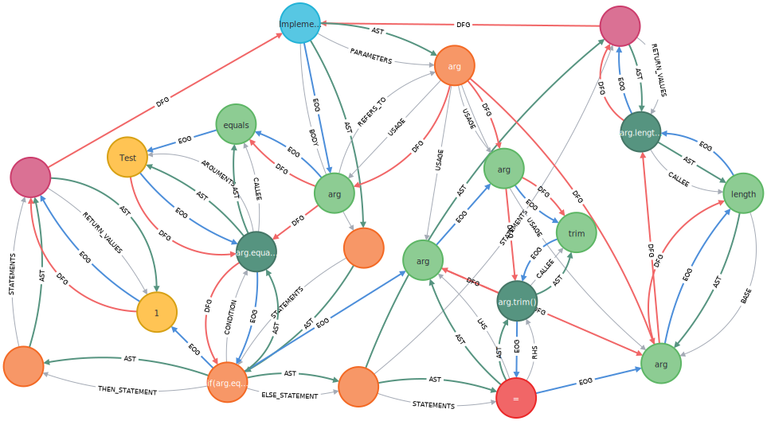

## What does the CPG library offer?

A Code Property Graph (CPG) is a graph-based representation of code which unites
several concepts such as an Abstract Syntax Tree (AST), Control Flow Graph
(CFG) or Evaluation Order Graph (EOG), Data Flow Graph (DFG) or Control Dependence
Graph (CDG), among others, in a single supergraph. This is beneficial because
the CPG contains the most relevant information to conduct static program
analysis and yet, the graph provides a certain abstraction of the respective
programming language.

 

  <h3>Supported Languages</h3>

  ---

  The library supports the following programming languages out of the box:

  * Java (Source code, JVM bytecode and Jimple)
  * C/C++
  * Go
  * Python
  * TypeScript
  * LLVM-IR
  * Ruby

  Nothing suitable found? [Write your own language frontend](./CPG/impl/language.md)
  for the respective language.
  

  

  <h3>Built-in Analyses</h3>

  ---

  The library currently provides different analyses:
  
  * Dataflow Analysis
  * Reachability Analysis
  * Constant Propagation
  * Intraprocedural Order Evaluation of Statements
  

  

  <h3>Accessing the Graph</h3>
  
  ---
  
  The library can be used by analysts or tools in different ways:

  * The graph can be exported to the graph database [neo4j](https://neo4j.com)
  * The CPG can be included into every project as a library
  * [Codyze](./GettingStarted/codyze.md), a tool checking for compliance of your software artifacs against certain requirements and visualizing the graph and the results in a webconsole
  * We provide an API for querying the graph for interesting properties
  

  

  <h3>Highly Extensible</h3>
  
  ---
  
  The library is easily extensible. You can add new...

  * language frontends [Tell me more about it!](./CPG/impl/language.md),
  * passes [Tell me more about it!](./CPG/impl/passes.md) or
  * analyses.
  

  

  <h3>Handling Incomplete Code</h3>
  
  ---
  
  The code you have to analyze is missing dependencies, is under active development and might
  miss some code fragments?
   
  No problem! Our tooling provides a certain resilience against such problems.
   <!--This allows our toolchain to analyze programs even if the current code base is incomplete and incorrect to a certain extent.-->
  

  

  

## About Us

We're a team of researchers at <a href="https://www.aisec.fraunhofer.de/">Fraunhofer AISEC</a>.
We're interested in different topics in the area of static program analysis. If
you're interested in our work, feel free to reach out to us - we're happy to
collaborate and push the boundaries of static code analysis.

## Publications

### 2024

  
Analyzing the Impact of Copying-and-Pasting Vulnerable Solidity Code Snippets from Question-and-Answer Websites

  

    
Konrad Weiss, Christof Ferreira Torres, Florian Wendland

    
In: ACM Internet Measurement Conference (IMC). Madrid, Spain.

    

      
bibtex

      <pre><code>@inproceedings{weiss2024solidity,
  author={Weiss, Konrad and Ferreira Torres, Christof and Wendland, Florian},
  title={Analyzing the Impact of Copying-and-Pasting Vulnerable Solidity Code Snippets from Question-and-Answer Websites},
  year={2024},
  booktitle={Proceedings of the 2024 ACM on Internet Measurement Conference},
  series={IMC '24},
  doi = {10.1145/3646547.3688437},
  location = {Madrid, Spain},
  publisher={ACM}
}</code></pre>
    

  

  

    <a class="green-button" href="https://doi.org/10.1145/3646547.3688437">paper</a>
  

### 2023

  
A Uniform Representation of Classical and Quantum Source Code for Static Code Analysis

  

    
Maximilian Kaul, Alexander Küchler, Christian Banse

    
In: IEEE International Conference on Quantum Computing and Engineering (QCE). Bellevue, WA, USA.

    

      
bibtex

      <pre><code>@inproceedings{kaul2023qcpg,
  author={Maximilian Kaul and Alexander K\"uchler and Christian Banse},
  title={A Uniform Representation of Classical and Quantum Source Code for Static Code Analysis},
  year={2023},
  booktitle={2023 IEEE International Conference on Quantum Computing and Engineering},
  series={QCE '23},
  doi={10.1109/QCE57702.2023.00115},
  location={Bellevue, WA, USA},
  publisher={IEEE}
}</code></pre>
    

  

  

    <a class="green-button" href="https://arxiv.org/pdf/2308.06113.pdf">preprint</a> 
    <a class="green-button" href="https://doi.org/10.1109/QCE57702.2023.00115">paper</a>
  

  
AbsIntIO: Towards Showing the Absence of Integer Overflows in Binaries using Abstract Interpretation

  

    
Alexander Küchler, Leon Wenning, Florian Wendland

    
In: ACM ASIA Conference on Computer and Communications Security (Asia CCS). Melbourne, VIC, Australia.

    

      
bibtex

      <pre><code>@inproceedings{kuechler2023absintio,
  author={Alexander K\"uchler and Leon Wenning and Florian Wendland},
  title={AbsIntIO: Towards Showing the Absence of Integer Overflows in Binaries using Abstract Interpretation},
  year={2023},
  booktitle={ACM ASIA Conference on Computer and Communications Security},
  series={Asia CCS '23},
  doi={10.1145/3579856.3582814},
  location={Melbourne, VIC, Australia},
  publisher={ACM}
}</code></pre>
    

  

  

    <a class="green-button" href="https://doi.org/10.1145/3579856.3582814">paper</a>
  

### 2022

  
Representing LLVM-IR in a Code Property Graph

  

    
Alexander Küchler, Christian Banse

    
In: 25th Information Security Conference (ISC). Bali, Indonesia.

    

      
bibtex

      <pre><code>@inproceedings{kuechler2022representing,
  author={Alexander K\"uchler and Christian Banse},
  title={Representing LLVM-IR in a Code Property Graph},
  year={2022},
  booktitle={25th Information Security Conference},
  series={ISC},
  doi={10.1007/978-3-031-22390-7\_21},
  location={Bali, Indonesia},
  publisher={Springer}
}</code></pre>
    

  

  

    <a class="green-button" href="https://arxiv.org/pdf/2211.05627.pdf">preprint</a> 
    <a class="green-button" href="https://link.springer.com/chapter/10.1007/978-3-031-22390-7_21">paper</a>
  

  
A Language-Independent Analysis Platform for Source Code

  

    
Konrad Weiss, Christian Banse

    

      
bibtex

      <pre><code>@misc{weiss2022a,
  doi = {10.48550/ARXIV.2203.08424},
  url = {https://arxiv.org/abs/2203.08424},
  author = {Weiss, Konrad and Banse, Christian},
  title = {A Language-Independent Analysis Platform for Source Code},
  publisher = {arXiv},
  year = {2022},
}</code></pre>
    

  

  

    <a class="green-button" href="https://arxiv.org/pdf/2203.08424.pdf">paper</a>
  

### 2021

  
Cloud Property Graph: Connecting Cloud Security Assessments with Static Code Analysis

  

    
Christian Banse, Immanuel Kunz, Angelika Schneider, Konrad Weiss

    
In: 2021 IEEE 14th International Conference on Cloud Computing (CLOUD). Los Alamitos, CA, USA

    

      
bibtex

      <pre><code>@inproceedings{banse2021cloudpg,
  author = {Christian Banse and Immanuel Kunz and Angelika Schneider and Konrad Weiss},
  booktitle = {2021 IEEE 14th International Conference on Cloud Computing (CLOUD)},
  title = {Cloud Property Graph: Connecting Cloud Security Assessments with Static Code Analysis},
  year = {2021},
  pages = {13-19},
  doi = {10.1109/CLOUD53861.2021.00014},
  url = {https://doi.ieeecomputersociety.org/10.1109/CLOUD53861.2021.00014},
  publisher = {IEEE Computer Society},
  address = {Los Alamitos, CA, USA},
  month = {sep}
}</code></pre>
    

  

  

    <a class="green-button" href="https://arxiv.org/pdf/2206.06938.pdf">preprint</a> 
    <a class="green-button" href="https://www.computer.org/csdl/proceedings-article/cloud/2021/006000a013/1ymJ7POIlxe">paper</a>
  

